# 第 10 章 训练系统

一个模型能够在单张加速卡上生成文本，是否意味着它也能在这张卡上训练？Qwen3-8B 的 BF16 权重约为 16.4 GB，而采用混合精度 Adam 进行全参数训练时，权重、梯度、主权重和优化器状态合计约为 131 GB。后者约为前者的八倍。反向传播还要读取前向保存的激活，执行期间还会出现参数聚合和转换缓冲。设计训练系统，首先要确定这些张量和缓冲区存放在哪里，以及需要保留多久。

把训练状态分到更多设备上，可以减轻单卡的显存压力，但计算往往需要等待其他设备传来的数据。把状态移到主机内存，可以腾出显存，却又增加了主机与 GPU 之间的传输。训练持续数周时，等待输入、保存检查点和故障后的重复计算也会影响完成时间。理解这些取舍，需要把三个问题连起来：**哪些张量和缓冲区需要同时保留，哪些工作决定一步何时结束，已经完成的训练中，有多少能够在故障后恢复。**

本章围绕一个任务展开：使用 Qwen3-8B 处理 100B token，完成领域继续训练，期限为 30 天。我们先估算至少需要多少资源，再比较由 32 张和 48 张 RTX 4090 组成的两套方案。比较从显存需求开始，逐步加入计算、通信、数据准备和故障恢复的耗时，最后确定哪套方案能够按期完成。为了讲清各项机制，文中穿插较小的张量和流水线算例。强化学习（RL）部分则进一步分析生成、验证和学习如何组成反馈循环。

GB、TB 表示十进制容量，GiB、MiB 表示二进制容量。教学方案的处理时间和容量预留在首次使用时给定；论文及实验结果标明来源，完整配置见章末资料。

## 10.1 从训练任务到容量与时间预算

### 10.1.1 训练任务、可训练参数与完成目标

系统设计从要完成的工作开始。本章任务采用全参数训练、混合精度 Adam 和 8,192-token 序列，处理 100B 有效 token。每次训练迭代处理 384 条完整长度的序列，即 3,145,728 个有效 token；最后一次训练迭代处理剩余数据，时间预算仍按完整一步安排。比较两套系统方案时，使用相同的训练数据、目标函数和评估要求。

有效 token 指任务中实际需要处理的 token，不包括为对齐长度而补入的填充位置。填充使张量形状更规则，但也占用计算和存储资源。统计任务完成量时，只累计有效 token。LoRA 则减少了需要训练的参数：基础权重仍用于前向计算，梯度和优化器状态的大小则主要取决于适配器参数量。因此，应先确定训练方法，再估算所需容量。

从时间上看，一次训练迭代包括前向传播、反向传播、梯度归约和参数更新。持续训练由多次迭代组成，其间还需要准备输入数据、保存检查点。启动、准备资源和维护也要计入从开始到结束的总时间。本章的设计案例从 30 天中预留 5 天给启动、评估和计划性停顿，留下 25 天用于训练、检查点与故障恢复。这使平均有效吞吐要求从约 38,600 token/s 提高到约 46,300 token/s。

完成整个任务需要 $\lceil10^{11}/3\,145\,728\rceil=31\,790$ 次训练迭代。25 天分摊到每次迭代，只有约 67.9 s。这是贯穿全章的时间预算：每步计算、通信等待、输入等待，以及分摊到这一步的保存与恢复，共同消耗这 67.9 s。

### 10.1.2 参数、梯度、优化器与激活

67.9 s 给出了每步允许花费的时间，但计算开始前还要满足显存要求。先看一次迭代需要保留哪些数据，再计算这些数据占多大空间。设参数数目为 $N$。本章的混合精度 Adam 用 BF16 权重执行矩阵运算，用 FP32 主权重保存优化器计算后的参数值，并保存两份 FP32 动量状态。梯度以 BF16 累积。逐项相加得到每参数 16 bytes。

| 状态 | 每参数字节 | Qwen3-8B 容量 / GB | 使用时机 |
|---|---:|---:|---|
| BF16 模型权重 | 2 | 16.4 | 前向与反向矩阵运算 |
| BF16 梯度 | 2 | 16.4 | 反向传播时产生，计算新参数时使用 |
| FP32 主权重 | 4 | 32.8 | 保存新参数，随后生成 BF16 副本 |
| Adam 一阶矩 | 4 | 32.8 | 在训练迭代之间保留梯度历史 |
| Adam 二阶矩 | 4 | 32.8 | 在训练迭代之间保留梯度平方历史 |
| 合计 | 16 | 131.1 | 长期保存的训练状态 |

Qwen3-8B 有 $N=8\,190\,735\,360$ 个参数，因此

$$
M_{\mathrm{persistent}}=16N\approx131.1\ \mathrm{GB}\approx122.1\ \mathrm{GiB}.
$$

将梯度改为 FP32，每参数增加 2 bytes，总量变为 18 bytes。这个变化来自梯度的数据格式，而“混合精度”这个名称本身没有给出梯度格式。MoE 的各专家同样拥有待更新参数和优化器历史，所以状态容量由全部可训练参数决定。[^state]

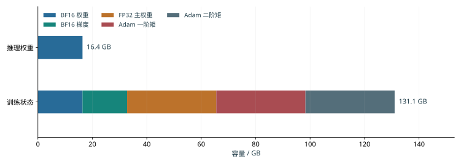

*图 10-1：五类训练状态如何形成相当于八份 BF16 权重的容量。模型为 Qwen3-8B，采用表中数据格式；横轴表示各类状态累计占用的容量。*

不同数据需要保留的时间并不相同。前向产生的激活要等到相应的反向计算结束后才能释放，而参数收集缓冲区可能只在某个模块执行期间使用。设备 $i$ 的显存峰值取决于同一时刻保留的训练状态、激活和临时缓冲区：

$$
M_{\mathrm{peak},i}=\max_t\left[M_{\mathrm{persistent},i}(t)+M_{\mathrm{activation},i}(t)+M_{\mathrm{temporary},i}(t)\right].
$$

例如，8 GiB 激活与 4 GiB 收集缓冲若同时出现，就要共同占用 12 GiB；若先释放激活再收集参数，同一片空间可以复用。容量优化由此有两个方向：减少张量和缓冲区的大小，或减少需要同时保留的数据。下一节的分片、重计算与卸载分别从这两个方向改变峰值。

### 10.1.3 计算需求、MFU 与资源下界

显存决定模型能否开始训练，计算速度决定能否按期完成。同一个模型的状态可以分到多张卡上，但增加到多少张才够，需要用总计算量和期限来判断。一条 8,192-token 序列的前向和反向的矩阵计算量约为 $4.31\times10^{14}$ FLOPs，平均每 token 约 52.7 GFLOPs。处理 100B token 共需约 $5.27\times10^{21}$ FLOPs。这里的工作量由模型矩阵形状和前后向运算累计得到。[^deadline]

先假设这 30 天全部用于训练计算。H100 SXM 的 dense BF16 峰值为 989 TFLOP/s，达到峰值的 40% 时，一张卡约能处理 7,500 token/s。五张卡合计约 37,600 token/s，低于 30 天所需的约 38,600 token/s；至少需要六张卡才能满足计算需求。相比之下，两张 80 GB 卡已能容纳理想均分的 131.1 GB 长期保存的训练状态，却需约 77 天完成计算。

设算法所需的总计算量为 $F$，设备数为 $p$，单卡峰值为 $P$，在所统计的时间内，平均计算效率为 $\eta$，则

$$
T=\frac{F}{pP\eta},\qquad
p_{\mathrm{compute}}=\left\lceil\frac{F}{P\eta T_{\mathrm{available}}}\right\rceil.
$$

模型 FLOPs 利用率（MFU）等于模型所需的浮点运算量，除以全部设备的峰值算力与实际耗时的乘积。若实际耗时取完整的训练迭代时间，通信等待已经计入其中；若只统计设备执行计算的时间，得到的就是单卡计算效率。本章的设计案例采用后一种分解：假定单卡计算效率为 40%，随后把无法与设备内计算重叠的通信时间，以及等待输入数据的时间逐项加上。这样可以直接观察每项系统设计对完成时间的影响。

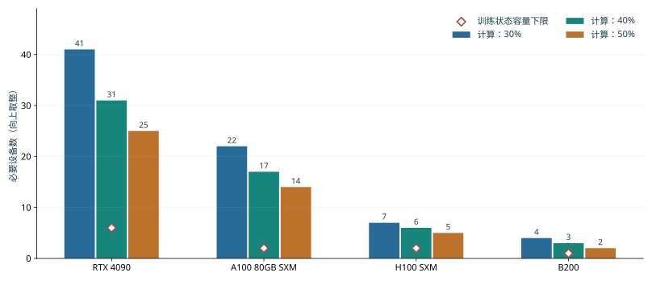

*图 10-2：效率改变计算所需卡数，状态容量提供另一道下界。任务为 Qwen3-8B、100B token、8,192-token 序列，先将全部 30 天用于执行。柱形使用矩阵工作和 dense BF16 峰值，菱形使用每参数 16 bytes 的理想分片容量；卡数向上取整。*

图 10-2 将显存下限与计算下限放在一起：对本章任务，所需卡数主要由计算决定。下面据此选取两套具体配置，供后续各节逐步比较。RTX 4090 的对应峰值为 165.2 TFLOP/s。按 40% 效率和 30 天计算，需要至少 31 张卡。采用每台主机八张卡的配置后，可以先考虑 32 卡方案；再增加两台主机得到 48 张。两者分别用 12 次和 8 次单序列微批次累积完成同一个包含 384 条序列的全局批次。设备增加改变了工作分配，训练目标保持相同。

现在可把章首预算写得更具体。每次训练迭代约有 $1.66\times10^{17}$ FLOPs，使用 32 卡时，每张卡完成所分配的计算约需 78.3 s；使用 48 卡时，约需 52.2 s。相对 67.9 s 的预算，32 卡在加入通信前已经超时，48 卡则留下约 15.7 s。下一步要判断，两套方案如何安排状态，以及这 15.7 s 会被哪些等待消耗。

## 10.2 训练状态的分片、重计算与卸载

### 10.2.1 数据并行与 ZeRO／FSDP 状态分片

同步数据并行让不同设备处理不同样本，再用归约后的梯度更新各自的参数。由于各设备得到的新参数相同，各副本通常保存相同的权重与优化器状态。设备数越多，复制的状态越多。ZeRO 逐步划分这些状态的所有权：某张卡只负责一部分参数的更新计算，其他卡通过通信获得执行所需的数据。

设数据并行组中有 $d$ 张卡。先计算长期保存的训练状态，普通数据并行和 ZeRO 三个阶段的每卡容量分别为

$$
\begin{aligned}
M_0&=16N,\\
M_1&=4N+12N/d,\\
M_2&=2N+14N/d,\\
M_3&=16N/d.
\end{aligned}
$$

第一阶段分片 FP32 主权重和两份 Adam 状态，共 12 bytes/参数，权重与梯度仍各保留一份。第二阶段再把梯度分片，完整复制只剩 BF16 权重。第三阶段连权重也分片。将 $d=8$ 代入，就得到下面的容量变化。

| 配置 | 每卡长期保存的训练状态 / GiB | 完整复制的训练状态 |
|---|---:|---|
| 普通 DP | 122.1 | 权重、梯度与优化器状态 |
| ZeRO-1 | 42.0 | 权重与梯度 |
| ZeRO-2 | 28.6 | 权重 |
| ZeRO-3 | 15.3 | 长期保存的训练状态均已分片 |

分片以后，每个模块按以下顺序执行：先通过全收集（AllGather）取得所需参数，执行前向或反向，再通过归约散播（ReduceScatter）汇总梯度并分配梯度分片，使负责该分片的设备得到完整梯度贡献，最后各自更新所负责的参数。FSDP 的全分片执行也围绕这条路径组织。若前向后释放完整参数，反向前就要再次收集；若保留完整参数，反向可直接使用，但它会与后续激活同时占用显存。

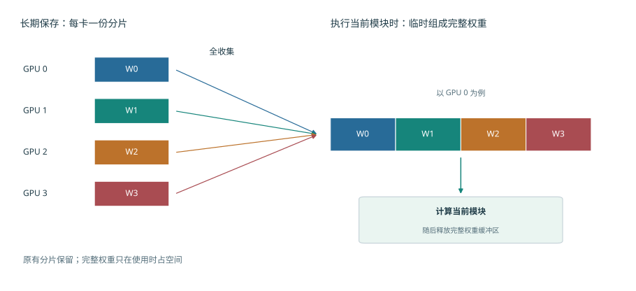

*图 10-3：同一模块的权重平时分散在四张卡上；执行时，各卡收集完整权重。图中展开 GPU 0 的收集过程，四种颜色分别表示四份参数分片。完整权重缓冲区用完即可释放，各卡长期保存的原始分片仍然保留。*

图 10-3 中，完整权重缓冲区与原有分片同时存在。增加卡数会缩小每份原始分片，完整权重缓冲区的大小却由模块本身决定。这就是长期保存量与执行峰值下降幅度不同的原因。

一组 CPU FSDP2 小模型实验将参与者从两个增加到四个，参数更新后保留的状态从约 18 MiB 减到 9 MiB，而执行峰值从约 39 MiB 减到 30 MiB。长期保存的部分减半，峰值只减少约 23%，因为执行中仍需约 21 MiB 的其他张量和缓冲区。分片后的容量分析因此转向模块执行时的参数和激活的保存时间。[^fsdp]

### 10.2.2 激活保存与选择性重计算

参数分片减少了权重和优化器状态的复制，前向保存的激活仍会占用显存。要继续节省空间，需要了解反向计算为什么要读取这些激活。考虑矩阵运算 $Y=XW$，反向要计算

$$
dX=dY W^{\mathsf T},\qquad dW=X^{\mathsf T}dY.
$$

参数梯度需要前向输入 $X$。保存 $X$ 会使它从前向一直保留到反向传播时；释放 $X$ 则要求反向使用前重新生成它。**激活重计算**只保留部分中间结果。反向计算需要其他结果时，再从已保留的结果出发，重新执行相应的前向计算。这样增加了计算量，却减少了需要长期保存的数据。

**例：保存乘积，还是保存它的来源？** Qwen3-8B 的一个 MLP 先得到门控结果 $a$ 和上投影结果 $u$，再形成 $h=a\odot u$，最后计算 $Y=hW_{\mathrm{down}}$。下投影的参数梯度需要 $h$。如果已为非线性算子的反向计算保留了 $a,u$，可以在下投影反向前重新相乘，就不必一直保存 $h$。

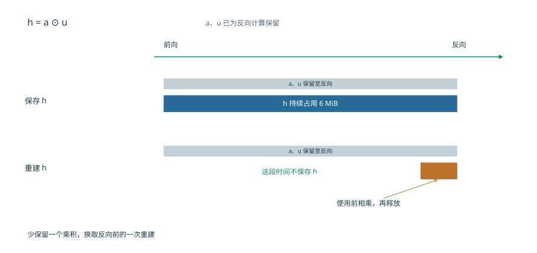

*图 10-4：两种方式都保留 a、u。直接保存 h 时，乘积从前向一直占用空间到反向；重建 h 时，只在使用前短暂分配乘积缓冲区。示例为 128-token 微批次、FP32 表示，h 的形状为 [128,12288]。横轴按操作顺序等距排列。*

图中省去的是前向与反向之间那段长时间保存，而不是反向计算对 h 的需要。现在给这块缓冲区标上尺寸：取 128-token 微批次和 FP32 激活，$h$ 的形状为 $[128,12288]$，占 $128\times12288\times4=6$ MiB；重建需要约 157 万次乘法。同一层的两个归一化加权输出形状均为 $[128,4096]$，每个占 2 MiB，也可由已保存的归一化结果和权重重建。于是，每层省去 $6+2+2=10$ MiB，每个微批次在九层组成的流水阶段中可省去 90 MiB，约 94 MB。

原方案为这些 GEMM 保存的输入每层共占 15 MiB，其中上述三个乘积占 10 MiB，其余 Q、K、V 和注意力输出占 5 MiB。九层阶段因此从 135 MiB 降到 45 MiB，即约 142 MB 降到 47 MB。重建按层依次发生，最大的乘积工作区为 6 MiB；上一层用完后，下一层复用这块空间。[^pipeline]

若有四个微批次同时等待反向计算，需要长期保存的数据就能减少 $4\times90=360$ MiB，约 377 MB，反向时则逐个微批次执行重建计算。这里的收益来自生命周期的差别：等待反向计算的微批次越多，需要长期保存的数据越多；逐层重建时，却只需反复使用同一块工作区。流水调度若让反向更早开始，等待反向计算的微批次数量又会下降。因此，重计算与流水调度共同决定应保存多少，而新增计算是否延长步骤，由其在执行时间轴上的位置决定。

### 10.2.3 CPU／GPU 卸载与缓冲区的使用时间

重计算适合从已保存结果中较便宜地重建数据。另一种办法是保留数据本身，把它移到容量更大的主机内存，使用前再传回 GPU，这就是**卸载**。选择卸载以后，原先的显存问题就变成了传输能否及时完成的问题。假设一份状态大小为 $V$，链路有效带宽为 $B$，从开始传输到算子需要这些数据之间有 $W$ 秒可用，则未能在这段时间内完成的传输

$$
T_{\mathrm{wait}}=\max(0,V/B-W)
$$

会使相应算子等待。传输和计算能重叠多少，取决于数据何时可发、链路何时空闲、相应算子何时需要这些数据。源缓冲在 DMA 结束前保持有效，目标缓冲从接收开始占用容量；卸载同时改变两端缓冲区的使用时间。

**例：梯度在哪一端转换？** 一个 gate 梯度形状为 $[12288,4096]$，BF16 大小 $G=96$ MiB，FP32 为 192 MiB。CPUAdam 使用 FP32 梯度，可以先传 BF16 再在 CPU 转换，也可以先在 GPU 转换再传 FP32。转换都要读 $G$、写 $2G$，共访问 $3G$ bytes。设 CPU、GPU 转换吞吐分别为 100、1500 GB/s，串行路径时间为

$$
T_c=G/B+3G/C_c,\qquad T_g=3G/C_g+2G/B.
$$

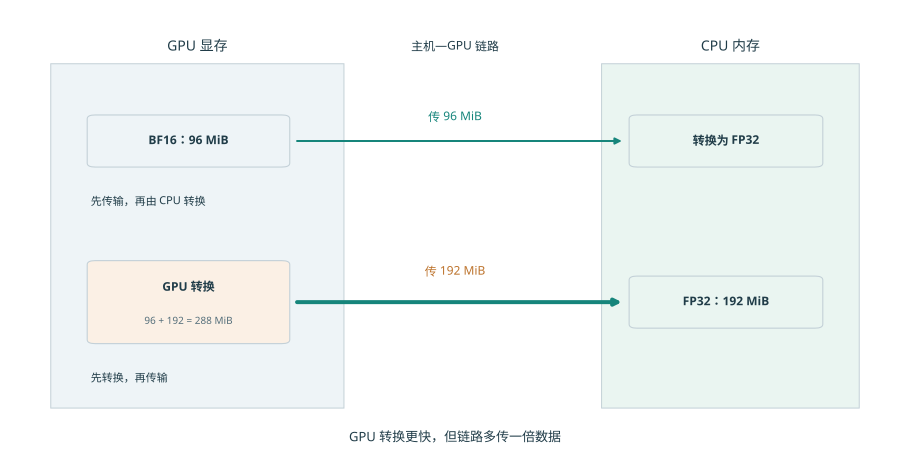

*图 10-5：上方先传 BF16 梯度，再由 CPU 转为 FP32；下方先在 GPU 转换，再传 FP32。两条路径得到相同格式的梯度，但跨越链路的数据分别为 96 MiB 和 192 MiB。下方 GPU 转换期间要同时保留输入与输出，共占 288 MiB。*

图 10-5 把差别集中在跨越链路的箭头上：GPU 虽然转换更快，却要多传 96 MiB。链路越慢，这部分额外传输越容易抵消转换收益。

在 32 GB/s 链路上，CPU 路径约为 $3.15+3.02=6.17$ ms，GPU 路径约为 $0.20+6.29=6.49$ ms。GPU 少花约 2.8 ms 转换，却多花约 3.1 ms 传输，所以略慢。将链路提高到 300 GB/s，多传 96 MiB 只增加约 0.34 ms，两条路径变为约 3.36 ms 和 0.87 ms，GPU 转换获得明显收益。[^offload]

令两条路径耗时相等，可以求出哪种方式更快的带宽分界点：

$$
B^*=\frac{1}{3(1/C_c-1/C_g)}\approx35.7\ \mathrm{GB/s}.
$$

这个阈值把两种相反作用放在同一尺度上：GPU 转换更快，节省了格式转换时间；FP32 数据更大，增加了传输时间。链路越快，后一项代价越小。

容量又给出第二道条件。GPU 转换期间原始 96 MiB 与输出 192 MiB 共存，峰值为 288 MiB；先传 BF16 的路径在 GPU 上只保留 96 MiB。选择 GPU 转换需要额外 192 MiB 缓冲区。SuperOffload 将转换位置与主机优化器执行共同安排，利用的正是转换速度、传输数据量和缓冲区的使用时间之间的取舍。整步收益则由最后一桶梯度、CPU 上的参数更新和权重回传何时完成决定。

### 10.2.4 并行组合下的逐卡状态与拓扑映射

分片、重计算和卸载分别改变保存量、计算量和传输量。把这些办法组合成完整系统时，还要确定它们作用于哪些设备和通信组。第 6、7 章的并行方法在训练中划分不同的数据和计算：TP 切分层内矩阵，PP 划分层，DP 划分样本，EP 划分专家。先确定每份参数由谁更新，再沿前后向依赖安排收集、交换与归约，就能同时得到每卡容量和各接口流量。

三种容量优化可以用同一组问题比较。

| 方法 | 减少的显存占用 | 增加的工作 | 决定收益的时间关系 |
|---|---|---|---|
| 状态分片 | 重复保存的权重、梯度或优化器状态 | 参数收集、梯度归约并分片 | 收集能否赶在模块执行前完成 |
| 激活重计算 | 前向到反向之间保存的中间值 | 重建前向值 | 重建是否延迟关键路径上的反向计算 |
| 状态卸载 | 设备上暂时不用的状态 | 主机与设备间传输 | 数据能否在使用前传回 |

**例：增加设备还是减少激活？** 取每卡 24 GiB 可用显存，Qwen3-8B ZeRO-3 在八卡上每卡保存约 15.3 GiB，留给其他张量和缓冲区约 8.7 GiB。如果激活与临时量同时需要 10 GiB，总量约 25.3 GiB，超出约 1.3 GiB。此时可以通过重计算减少这 1.3 GiB，也可以增至十六卡，将长期保存的训练状态降到约 7.6 GiB，总量降至约 17.6 GiB。

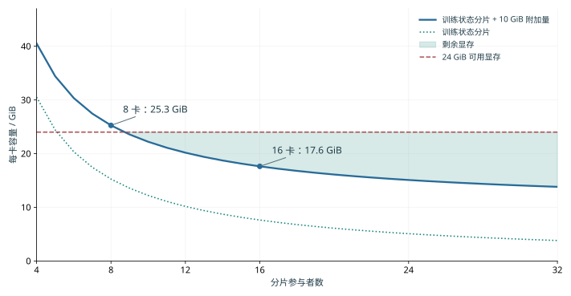

*图 10-6：给定附加存储需求时，分片数决定容量可行区域。曲线为 $16N/d+10$ GiB，水平线为 24 GiB 教学算例中的可用显存。曲线低于预算的区域可以容纳这些训练状态和缓冲区；纵向距离给出容量余量。*

这两个选择对应不同的代价：八卡方案增加重建计算，十六卡方案增加设备并改变通信组。可以先从图中找出满足显存要求的方案，再比较这些方案的每步耗时。

回到本章的训练任务，32 卡与 48 卡均采用全组 ZeRO-3，TP=PP=1，每卡微批次为一条序列。为设备运行时预留空间后，教学方案给每卡 22 GiB 可用显存，并为同时保留的激活、完整模块参数和工作区安排 10 GiB 上限。两套方案长期保存的训练状态分别约为 3.8、2.5 GiB，总量约为 13.8、12.5 GiB，容量余量约为 8.2、9.5 GiB。两套方案的显存都足够，接下来主要比较完成时间。[^design]

## 10.3 训练步的流水调度与通信重叠

容量分析确定显存能够容纳所需数据，时间分析确定它们能否及时到达。本节先明确一次训练迭代所优化的目标函数，再把前向、反向与通信放在同一时间轴上。本章的设计案例采用数据并行；四阶段流水作为独立算例，展示调度如何同时改变关键路径和激活的保存时间。

### 10.3.1 微批次、梯度累积与参数更新

一个全局批次（global batch）包含一次参数更新使用的全部样本，可以分成多个微批次（microbatch）依次执行反向传播，累积梯度后统一更新参数。设微批次 $k$ 的有效位置集合为 $S_k$，总位置数为 $L=\sum_k|S_k|$，token 平均损失为

$$
\mathcal L=\frac{1}{L}\sum_k\sum_{j\in S_k}\ell_j.
$$

求和与求导可以交换顺序，因此可以分别对各个微批次执行反向传播；计算每个微批次的损失时，都用其损失总和除以同一个 $L$。所有微批次的梯度累积完成后，执行一次梯度裁剪和一次参数更新。这样划分微批次只改变执行顺序，不改变各个 token 在损失函数中的权重。

**例：平均顺序为什么会改变梯度？** 八条回答中，四条各含两个有效 token，四条各含三个，共 20 个。设短回答每 token 的损失为 $\theta/5$，长回答为 $2\theta/5$，则

$$
\mathcal L=\frac{8\theta/5+12(2\theta/5)}{20}=\frac{8\theta}{25},\qquad
\frac{d\mathcal L}{d\theta}=0.32.
$$

若先对每条回答平均，再平均八条，短回答与长回答各占一半权重，梯度变成 $(0.2+0.4)/2=0.30$。原先按 token 平均时，长回答占 $12/20=60\%$，所以结果更靠近 0.4。若已经使用 20 这个共同分母，累积后又除以八，则梯度变为 0.04。分母决定每个位置对参数梯度的贡献。[^verl]

设计案例中的 384 条完整长度的序列可以在 32 卡上每卡累积 12 个微批次，也可以在 48 卡上每卡累积 8 个。每卡一次只处理一条，每张卡执行的矩阵形状相同；全局有效 token 数和目标函数也相同。较多设备减少每卡承担的微批次数量，使单卡计算时间从约 78.3 s 降到 52.2 s。参数收集和梯度通信则随执行路径另行排入时间轴。

### 10.3.2 流水线调度、气泡与激活的保存时间

微批次的划分保持了训练目标，却改变了计算的先后顺序。对流水并行而言，顺序还决定每个阶段什么时候有活可做，以及多少份激活需要等待反向。流水并行把模型分成多个阶段，每个微批次依次前向，再沿反方向传播梯度。**填满排空**先完成所有微批次前向，再执行反向。**1F1B** 预热后交错执行前向和反向，让较早微批次更快释放激活。

先设 $p$ 个阶段完全平衡，阶段前向为 $t_f$、反向为 $t_b$，传输和参数更新耗时取零。$m$ 个微批次填满排空需要

$$
T=(m+p-1)(t_f+t_b),\qquad u=\frac{m}{m+p-1}.
$$

式中的 $m$ 项是有用微批次工作，$p-1$ 项来自填充和排空。设备时间利用率 $u$ 因而随微批次数量增加而提高。取 $p=4,m=8$，得到 $u=8/11\approx72.7\%$。若保持全局批次，增加微批次数量意味着缩小每个微批次；由此获得的气泡收益，需要与更小矩阵的执行时间一起比较。

**例：提前反向怎样改变整条流水？** 将 Qwen3-8B 的 36 层分为四个九层阶段，八个微批次各含一条 128-token 序列。每阶段前向 10 ms、反向 20 ms，边界传输每次 1 ms，正反方向链路独立，参数更新耗时 1 ms。先看填满排空：无传输时为 $(8+4-1)\times30=330$ ms；前向填充经过三条边界增加 3 ms，反向排空再增加 3 ms，参数更新增加 1 ms，总计 337 ms。

1F1B 更早开始反向，也使后续前向等待反向释放计算资源。在阶段 0，前四个微批次于 40 ms 完成前向，第一份传回的梯度于 106 ms 到达。随后反向执行到 126 ms，第五个微批次才开始前向。这种交错逐级影响下游到达时间。阶段 3 在 93 ms 完成第二个微批次反向，但第三个前向输入到 95 ms 才到，产生 2 ms 空隙；后续相似的等待继续进入关键路径。按这些依赖关系排定执行顺序后，所有梯度在 346 ms 时计算完毕，加上参数更新共为 347 ms。[^pipeline]

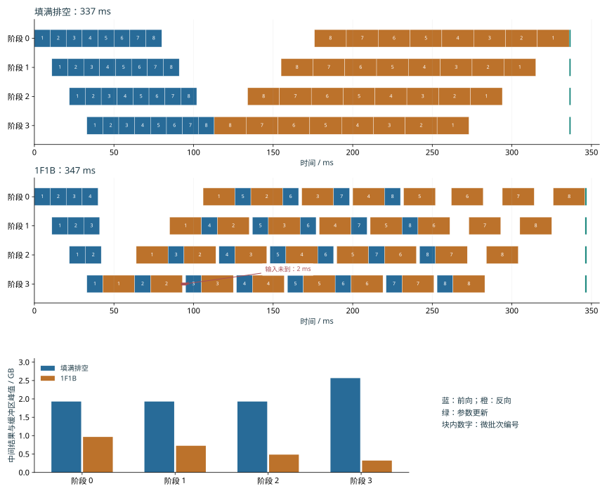

*图 10-7：提前反向缩短保存时间，同时改变后续输入的到达时间。四阶段、八微批次，处理时间见正文；橙色为反向，蓝色为前向。标注的 93—95 ms 空隙由下一份前向输入尚未到达产生。下方比较为非线性算子保存的中间结果与收发缓冲区的峰值。*

两种调度做相同的前后向工作，但 1F1B 在这些依赖下多用约 3% 时间；与此同时，图中所示的中间结果与缓冲区的最大显存占用从约 2.57 GB 降到 0.97 GB，减少约 62%。若为这些中间结果和缓冲区只留 1 GB，提前反向使步骤能够执行；容量充裕时，337 ms 的调度完成得更早。选择由“何时释放张量”和“何时得到下一份输入”共同决定。

### 10.3.3 反向依赖、梯度分桶与通信重叠

上一节的 2 ms 空隙来自输入尚未到达。梯度通信也受同一条规律支配：发送之前要等数据产生，发送时又要等链路空闲。反向传播逐层产生梯度，实现中通常把多个梯度张量合并成一个通信桶，等桶内所有梯度都计算完毕后再发送。桶越大，越可能等候最后生成的梯度；桶越小，需要启动通信的次数就越多。调度要在启动代价与提前发送之间取得平衡。

设归约需 3 ms，就绪后尚有 5 ms 独立计算，归约可以与这段计算同时进行。若共享链路此前已安排 4 ms 的专家交换，归约只能利用余下 1 ms，另有 2 ms 延伸到计算之后。这部分无法与计算重叠、会延长训练步骤的时间，称为**通信等待时间**。数据依赖给出最早开始时刻，资源争用将它推迟，后续算子的依赖关系决定等待是否延长整个训练步骤。

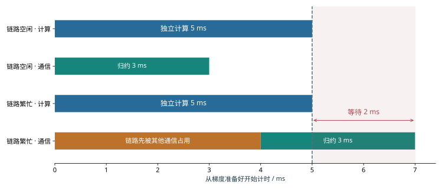

*图 10-8：两种情况都有 5 ms 独立计算和 3 ms 归约。链路空闲时，归约在计算结束前完成；链路先被其他通信占用 4 ms 时，相同归约延伸到第 7 ms，使步骤多等待 2 ms。虚线标出独立计算结束的时刻。*

图 10-8 暂时固定了梯度产生的时刻。实际训练还可以改变计算顺序，让某些梯度更早产生，从而把归约向左移动。矩阵反向中，输入梯度 $dX$ 使前一层继续反向，参数梯度 $dW$ 使本层开始归约。先算 $dX$ 可以让前一层更早开始反向传播，先算 $dW$ 则可以更早启动本层的梯度通信。两者争用同一计算资源时，改变顺序会重新分配通信窗口。这也是训练调度需要同时查看前后向依赖的原因。

本章的设计案例将参数收集、梯度归约并分片等通信中延长步骤的部分合计为每步 4 s，将参数更新和设备内的非矩阵运算包含在前面给定的单卡计算效率内。两套方案在输入就绪时的每步耗时因而分别为 $78.3+4=82.3$ s 和 $52.2+4=56.2$ s。4 s 是本设计题给定的通信等待时间预算，实现时需要调整参数收集的模块大小、预取时机和归约时机，将通信等待控制在这一时间内。[^design]

这也给优化设定了收益上限。若一段 1.3 s 的归约中只有 0.2 s 延续到反向计算结束之后，在其余时间轴不变时，即使消除这段通信等待，整步至多缩短 0.2 s。若还差 0.5 s 才能满足目标，就要同时缩短其他关键路径工作。

> **案例：固定批次大小时的扩展效率。** MegaScale 在 175B 模型上保持全局批次为 6144，将设备从 3072 增至 12288。原每步耗时约 23.7 s，若设备增加四倍就能带来四倍加速，每步应缩短至约 5.9 s，实际约 6.3 s。总加速约 3.7 倍，对应约 93% 扩展效率。设备增加后，每卡工作减少，跨组同步和负载不均衡造成的等待，在每步耗时中所占的比例随之上升；实际每步比理想值多约 0.4 s，这就是扩展后需要进一步分析的额外耗时。[^megascale]

### 10.3.4 MoE 与长上下文的调度变化

Dense 数据并行中的工作划分较规则。MoE 路由会使各设备收到不同数量的 token，序列长短不一也会使相同 token 数对应不同计算量。因此，分析每步耗时，要看工作如何分到各设备上，以及哪张设备最后完成。

**专家分派的不均衡。** 设两张专家设备分别收到 96、32 行输入，每行计算时间近似相同。总计 128 行，平均每卡 64 行，但完成时间由 96 行的一侧决定。将分配调整为 64、64 行，专家计算时间就从处理 96 行所需的时间降到处理 64 行所需的时间，缩短三分之一。

训练中的路由均衡机制作用于样本如何选择专家；专家副本和拓扑映射则作用于这些选择在哪里执行。

均衡专家的计算量以后，数据传输仍可能让设备等待。MoE 的前向 token 交换、反向输入梯度传输和参数梯度归约会争用同一条链路，因此还要利用上一节的通信时间轴分析。取一个 72 MiB 的 FP32 专家梯度，有效传输速率 16 GiB/s，每次通信启动 0.1 ms。整桶耗时约 $72/16384\times1000+0.1=4.5$ ms，放不进一个 2 ms 空隙。若三个 24 MiB 子桶分别提前就绪，每桶约 1.6 ms，可进入三个这样的空隙；总通信处理时间却增加到约 4.7 ms。虽然多启动了两次通信，但每个小桶都能在计算结束前传完，因此减少了计算之后的等待。[^moe]

专家负载取决于分派了多少行输入。长上下文还有另一层差别：即使 token 总数相同，需要计算的注意力配对数也可能不同。

**序列长度的不均衡。** 对长度 $s$ 的因果序列，第一个位置查看一个 token，第二个查看两个，依次相加，得到 $s(s+1)/2$ 个有效注意力配对。两条长度 4096、4096 的序列合计约 1680 万对；改为 7168、1024，总 token 数仍为 8192，配对数却增至约 2620 万，增加约 56%。注意力配对数随序列长度近似按平方增长，所以较长的序列增加了总计算量。[^length]

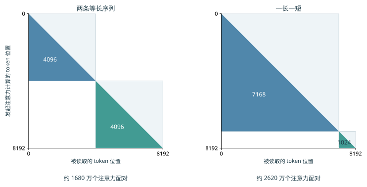

*图 10-9：每个有色三角形表示一条序列允许计算的因果注意力配对，空白区域不参与计算。左右两组总长度均为 8192，序列之间互不注意。把长度集中到一条序列上，会增大三角形总面积；精确配对数包含对角线上的位置。*

图 10-9 中，长三角形的额外面积来自真实的注意力关系，无法靠删除填充位置消除。打包减少 padding，按长度分组则让各设备承担的三角形面积更接近；上下文并行进一步把长序列的计算分到多个设备，并通过交换 K/V 取得其他设备保存的数据。它们分别改变无效工作、工作分配和数据到达路径。用相同总 token 数比较方案时，保留长度分布、mask 和损失权重，就能将调度收益与任务变化分开。

## 10.4 数据输入、检查点与故障恢复

前面的每步耗时分析假定输入数据已经准备好，训练也没有因故障中断。持续运行时，需要数据读取和预处理跟上计算速度，还需要检查点保存可恢复的训练状态。本节把二者加入章首的完成时间：输入决定设备能否持续工作，恢复决定已经做过的工作有多少需要重做。

### 10.4.1 数据读取、打包与预取

原始数据经过读取、解码或分词、筛选，再按目标长度拼接成训练序列，放入主机内存缓冲区，最后传到 GPU。主机缓冲区通常使用页锁定内存（pinned memory），使数据在异步传输期间保持在物理内存中。各环节的持续处理速度决定输入速度，队列用来缓冲短时间内的速度波动。

从这条输入流程可以看出，GPU 最后收到的数据很小，并不意味着前面的准备过程也很快。25 天预算要求约 46,300 token/s，即每秒约 5.7 条 8,192-token 序列。若传输 int64 token ID，数据率只有约 0.37 MB/s。设每个 CPU 数据准备进程每秒准备两条序列，两个数据准备进程只有四条/s，低于需求；三个数据准备进程达到六条/s。传输数据量很少，CPU 准备过程仍能限制整个集群。

本章的设计案例为输入安排四个这样的数据准备进程，合计八条/s。48 卡输入就绪时每步约 56.2 s，每步处理 384 条，需求约为 6.8 条/s，低于八条/s。数据准备速度高于训练消耗速度，可以在短暂变慢之后重新补满预取队列。设计题再给每步 0.5 s 的未被预取消除的平均输入等待时间，32 卡和 48 卡的每步训练时间由此成为约 82.8 s 和 56.7 s。[^design]

预取队列让数据准备与 GPU 计算以不同进度运行。正常训练时，这种进度差可以吸收波动；保存检查点时，则必须分清哪些数据已经用于训练。假设数据加载器已经为前 108 个批次分配了准备任务，而训练只完成第 100 个，第 101—108 个仍在处理或排队。若恢复直接从 109 开始，就会跳过八个批次。已分配给数据准备进程的批次位置反映预取进度，已用于训练的批次位置反映训练进度；两者之间的缓冲保存了尚未训练的数据。

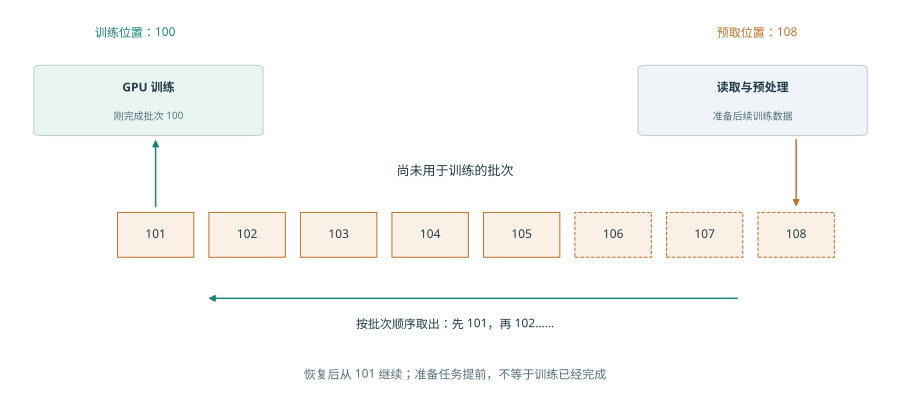

*图 10-10：训练已完成批次 100，预取任务已安排到 108。中间八个批次仍需训练，其中一部分已经准备好，另一部分还在处理。虚线框示意尚在处理的批次。恢复时应保留这些数据或重新准备它们，从批次 101 继续。*

图 10-10 的队列只能暂时填补准备速度的下降；若数据长期准备得更慢，队列终究会被取空。输入与检查点共享存储时，就可能出现这种持续不足。

设共同通路为 8 GB/s，输入原始数据读取占 3 GB/s，每份检查点为 112 GB、每 20 s 保存一次，平均写入为 5.6 GB/s。总需求 8.6 GB/s，每秒缺少 0.6 GB，有限预取缓冲最终耗尽。延长保存周期或分开通路可以解决持续带宽不足的问题。本章的设计案例采用 1800 s 保存间隔，约 115 GB 的检查点平均写流量只有约 64 MB/s；保存时的停顿则在后文单独计入。[^supply]

### 10.4.2 可恢复状态与布局变换

上一节已经说明，恢复训练要从正确的数据位置继续。模型一侧也有同样要求：下一次参数更新既取决于当前权重，也取决于优化器保留的历史。因此，检查点需要权重、Adam 动量、步数、学习率状态、随机状态和下一批数据的组成。权重相同而动量不同，下一次参数更新的方向便可能不同；数据读取位置相同而打包残留不同，下一条训练序列也会改变。

一次训练迭代结束后，下一批梯度由反向重新产生。此时保存权重 2 bytes、主权重 4 bytes 和两份 Adam 状态 8 bytes，共每参数 14 bytes。Qwen3-8B 的这部分检查点约为 115 GB。在一次训练迭代结束时，把模型状态和已处理到的数据位置一同保存，就能确定恢复后该用哪些参数、从哪一批数据继续训练。

**例：从 TP=4 恢复到 TP=8。** gate 权重形状为 $[12288,4096]$，BF16 大小 96 MiB。沿输出维四分，每片 3072 行、24 MiB；八分后，每片 1536 行、12 MiB。目标 rank $r$ 读取旧分片 $\lfloor r/2\rfloor$，偶数 rank 取前半，奇数 rank 取后半。全局行坐标将旧布局和新布局联系起来。

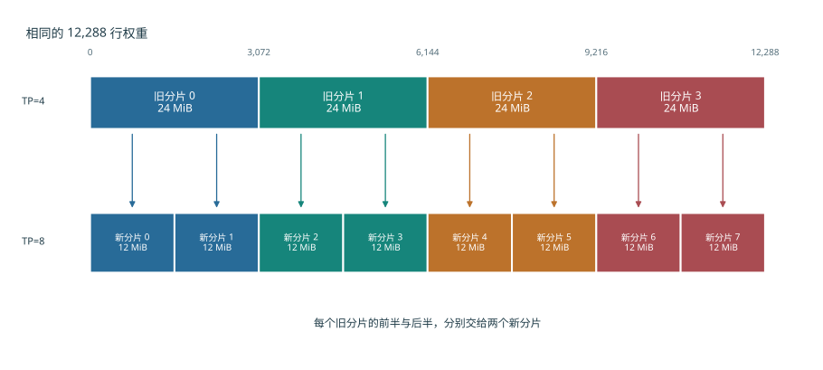

*图 10-11：横向位置对应原矩阵的行号，颜色表示旧分片。每份旧分片分成前后两半后，分别装入两个新分片。模型权重的内容和顺序保持相同，改变的是各设备负责的行范围；BF16 权重总量始终为 96 MiB。*

沿图 10-11 的箭头，恢复程序可以找到每个新分片对应的原始行范围。FP32 主权重与 Adam 两项状态也按相同的行范围拆分，每项为 BF16 权重的两倍。这个矩阵的全部保存状态因此为 $96\times(1+2+2+2)=672$ MiB。ByteCheckpoint 一类系统用全局形状、偏移和片段长度描述这些张量，使恢复端按目标布局读取需要的范围。文件分片是存储安排，全局坐标标明每个分片属于哪个张量、位于哪些行列。[^checkpoint]

权重可以凭原矩阵的行号重新拼接，训练序列也需要保留足够的信息，才能重新组成同样的输入。这又回到了图 10-10 中尚未用于训练的数据。除了批次位置，还要保留数据预处理的中间结果。

打包器若保留 2,000 个 token，下一份数据提供 6,192 个，两者组成下一条 8,192-token 序列。如果丢失这 2,000 个 token，就只能从后续数据中取出额外的 token 来补齐下一条序列，改变它的前缀、注意力关系和标签。将已用于训练的数据位置、残留与参数更新结果一起保存，恢复后才能继续构造同一批数据。[^resume]

### 10.4.3 同步、异步保存与带宽竞争

前面解决了“保存哪些数据”和“恢复到哪些设备”的问题。接下来要看保存过程怎样与训练同时进行，以及一份快照什么时候才真正可用。

同步保存先生成内容固定的快照，写入完成后继续训练。异步保存将快照复制到独立的内存缓冲区，再由后台写入，让训练较早恢复执行。训练恢复执行时，快照可能还没有写完；只有写入并提交完成后，这份快照才能用于故障恢复。

**例：相同暂停，为什么重做量不同？** 取每份 112 GB 的教学快照，写带宽 8 GB/s，上传需 14 s。每 10 s 产生一份时，请求速率为 11.2 GB/s，队列持续增长。改为每 20 s 一份，平均需求降到 5.6 GB/s，存储能在下一份到达前完成上一份。

在第 20、40 s 捕获两份快照，各花 0.5 s 复制到缓冲区后上传，完成时刻为 34.5、54.5 s。若第 50 s 故障，第二份仍在上传，只能恢复到第 20 s，重做 30 s。写带宽提高到 16 GB/s 后，上传时间减半，两份分别在 27.5、47.5 s 完成；同一故障可恢复到第 40 s，只重做 10 s。

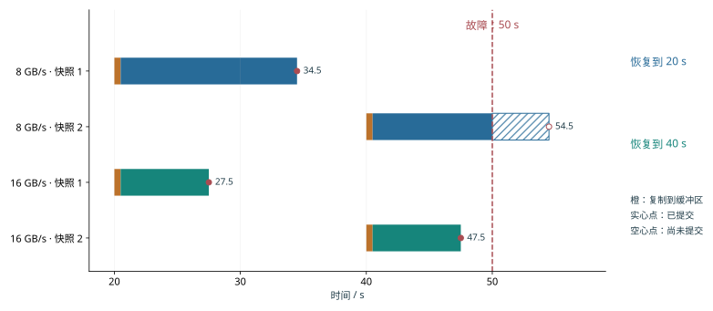

*图 10-12：写带宽通过提交时刻改变故障后的重做量。快照为 112 GB，复制到缓冲区各需 0.5 s，上传结束即持久化。实心点为 50 s 故障前已提交的快照；斜线和空心点标出无故障时原定的剩余上传与完成时刻。*

两种方案的前台暂停都是两次 0.5 s，合计 1 s。更快写入的收益体现在较新的恢复位置：少重做 20 s。异步保存的完成点因而直接影响长期进展，后台写入速度影响故障后的重做量，保存时暂停训练的时长则直接增加正常运行时间。

实际系统还要提交描述完整快照的元数据。一组 CPU 实验中，保存 API 约 7 ms 返回，恢复元数据约 48 ms 才提交；提交前终止进程，恢复端选择上一份完整检查点。数据文件与提交记录共同构成可用快照，恢复程序据此判断哪一份检查点已经完整保存。[^fault]

### 10.4.4 故障规模、保存周期与有效训练进度

图 10-12 固定了两次保存的时刻，比较写入速度的影响。还可以改变保存间隔：间隔短，故障时离上一份快照更近；间隔长，正常训练时需要暂停保存的次数更少。这两项代价方向相反，因此存在一个折中点。

设每次同步保存耗时 $c$，保存之间完成 $\tau$ 秒有用训练，作业故障率为 $\lambda$，恢复耗时为 $r$。采用稀少、独立故障的一阶模型，单位有用训练时间的附加成本为

$$
L(\tau)=\frac{c}{\tau}+\lambda\frac{\tau}{2}+\lambda r.
$$

第一项来自每隔 $\tau$ 保存一次。故障落在两次保存之间的任意位置，平均丢失半个间隔，得到第二项。第三项是恢复次数乘每次恢复时间。前两项一减一增，最优点满足

$$
-\frac{c}{\tau^2}+\frac{\lambda}{2}=0,
\qquad \tau^*=\sqrt{\frac{2c}{\lambda}}.
$$

**例：规模怎样改变保存频率？** 先取 1024 张卡，每卡平均 365 天故障一次，任一卡故障均中断作业。独立故障率相加，作业平均约 8.6 小时中断一次。约 115 GB 检查点以 8 GB/s 保存，$c\approx14.3$ s。设恢复需 120 s，代入得到最优间隔约 940 s，即约 16 分钟。[^interval]

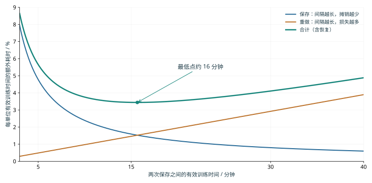

*图 10-13：蓝线为保存耗时占比，橙线为故障重做耗时占比，绿线为两者加上恢复耗时后的合计。使用 1024 卡、单卡 MTBF 365 天、保存约 14.3 s 和恢复 120 s 的一阶模型。最低点出现在两项随间隔变化的代价相互平衡处。*

图 10-13 中的最低点较平缓，配置时可以选择附近便于使用的间隔。下面比较五、十五和三十分钟，看看偏离最低点后增加的是哪一项成本。

| 有用训练间隔 | 保存成本 | 重做成本 | 恢复成本 | 合计 |
|---|---:|---:|---:|---:|
| 300 s | 4.8% | 0.5% | 0.4% | 5.7% |
| 900 s | 1.6% | 1.5% | 0.4% | 3.4% |
| 1800 s | 0.8% | 2.9% | 0.4% | 4.1% |

将保存间隔从五分钟延长到十五分钟，节省的保存时间多于新增的重做时间；继续延长到三十分钟，新增的重做时间就超过了节省的保存时间。表中合计由未舍入数值计算。设备数翻倍会使故障率翻倍，最优间隔缩短为原来的 $1/\sqrt2$；保存速度翻倍也使最优间隔按同样比例缩短，因为每次保存耗时更短。

本章设计案例使用的卡数较少，沿用每卡 365 天、恢复 120 s 和保存约 14.3 s，取有用训练间隔 1800 s。32 卡的保存、重做与恢复合计约增加 0.90% 时间，48 卡约增加 0.95%。48 卡更容易遇到一次设备中断，但附加比例只多约 0.05 个百分点，远小于它减少单卡计算带来的收益。到这里，容量、每步训练时间和长期附加成本已经齐备，可在 10.6 汇总完成期限。

## 10.5 RL：阶段协作、权重同步与样本一致性

前四节假定训练数据已经给定。RL 让模型参与产生下一批数据：模型生成轨迹，系统计算奖励或验证结果，再将轨迹用于训练，更新后的权重又改变下一轮生成。系统由单向训练流水变成反馈循环，新的问题集中在各阶段的处理速度、切换时的状态重叠，以及样本究竟由哪一版策略产生。

### 10.5.1 一轮回答生成、验证与参数更新

从四条提示词（prompt）出发，每题生成两条回答，得到八条轨迹。奖励描述这些回答的结果，优势函数给出调整回答概率的方向和幅度，训练端按有效位置构造损失并完成一次参数更新。新权重交给生成端后，下一轮样本来自更新后的策略。生成、奖励与学习分别使用不同形式的数据，样本标识把它们连接起来。

第 10.3.1 节的八条回答例子来自一次小模型实验的回答长度：有效回答共 20 token，包含 EOS；输入计算的有效位置共 366。提示词和回答共同参加前向，损失则按所选回答位置归一化。因此，生成长度影响计算成本，损失 mask 决定哪些位置参与梯度计算，两者有不同作用。[^verl]

同一提示词下的相对奖励还决定优势。例如两条回答奖励均为 1，减去组内均值后都为零；奖励变为 1、0，中心化后为 0.5、−0.5，策略才获得区分两条回答的方向。系统即使完成了前向、反向和优化器调用，也可能遇到第一种全零优势批次。统计训练吞吐量时，应计算每秒实际用于训练的轨迹或 token 数；模型能力是否提高，则用固定的评估任务检验。

> **案例：参数变化为何不等于学会。** 固定 verl／vLLM 小模型实验中，算术精确奖励使同组回答取得相同奖励，优势和策略梯度为零，参数变化来自 AdamW 权重衰减。改用固定符号奖励后，两步出现非零梯度与权重更新，但算术验证只有 2/4 正确。奖励构造决定学习方向，系统执行负责把这个方向一致地应用到参数。[^verl]

### 10.5.2 各阶段的资源分配与权重同步

明确了样本怎样形成梯度以后，才能讨论每秒能训练多少样本。生成、验证和学习像前后相接的三道工序，前一道做得更快，只有后一道接得住，才会增加最终产出。先把三者的处理能力换成相同工作单位。设它们分别为 $r_g,r_v,r_l$，验证后符合策略版本要求的比例为 $q$，在独立资源上稳定流水执行时，每秒可用于训练的样本数上限为

$$
r_{\mathrm{effective}}=\min\left(r_l,q\min(r_g,r_v)\right).
$$

**例：增加哪一阶段的设备？** 生成每秒提供 12 条等长轨迹，验证处理六条，学习阶段处理八条；验证后四分之一因版本过旧被丢弃。每秒进入学习的只有 $6\times0.75=4.5$ 条。生成翻倍到 24 条/s，仍被验证挡在 4.5 条/s；验证翻倍到 12 条/s，每秒可用于训练的轨迹达到九条，此时训练端以八条/s 限制全流水。因此，应把新增资源分配给当前最慢的阶段；这个阶段加速后，再看瓶颈转移到了哪里。

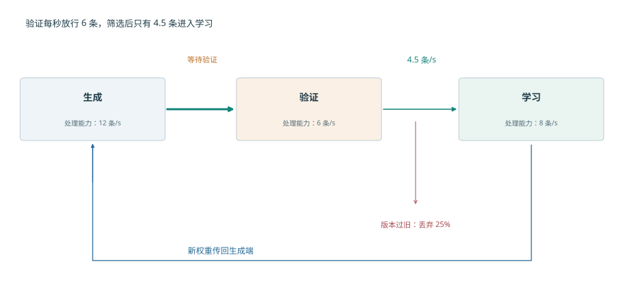

*图 10-14：三阶段分别最多处理 12、6、8 条等长轨迹/s。验证后保留 75%，所以只有 4.5 条/s 进入学习。返回箭头表示学习产生的新权重影响后续生成；其同步耗时在后面的阶段切换与异步算例中展开。*

图 10-14 先把三道工序画在各自独立的资源上。若改用同一组设备轮流执行，就能节省设备，但生成和学习之间需要切换整套显存数据。

**共享设备**让同一组设备轮流训练和生成，节省重复资源；**独立部署**让两侧独立执行，获得重叠机会，但要在两组设备间发送权重。共享设备的关键成本发生在切换：旧状态尚未释放，新状态已经开始装载，两个阶段各自运行时显存都足够，切换时却可能因两套数据同时保留而超出容量。

设训练状态占用显存 40 GiB，生成需要约 15.3 GiB BF16 权重与 24 GiB KV 池，另有两阶段共用开销 4 GiB。训练独占时 44 GiB，生成独占时约 43.3 GiB，都低于 64 GiB。先恢复生成权重和 KV，再释放训练状态，峰值为 $40+15.3+24+4\approx83.3$ GiB。

改变次序，先加载生成所需的权重，暂不分配 KV，峰值为 $40+15.3+4\approx59.3$ GiB。随后释放 40 GiB 训练状态，显存占用降为约 19.3 GiB，再分配 KV，进入约 43.3 GiB 的生成状态。两条路径最终状态相同，峰值差 24 GiB，恰好是一份 KV 池。[^handoff]

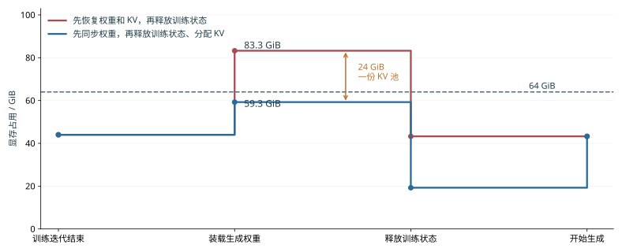

*图 10-15：分配顺序通过需要同时保留的数据改变阶段切换时的显存峰值。训练状态 40 GiB，生成权重约 15.3 GiB，KV 池 24 GiB，共用开销 4 GiB，预算 64 GiB。横轴为操作步骤，按执行顺序等距排列。*

独立部署的代价则由权重发送范围决定。Qwen3-235B 的 BF16 专家权重为 423 GiB，EP16 中每个接收端只需要约 26.4 GiB。逐一向 16 个接收端发送完整专家集合，共发送 $16\times423=6768$ GiB；按各自分片发送，合计为 423 GiB。确定接收端需要的参数分片，再组织分发，可以同时减少接收缓冲和源端发送量。

这里再次出现本章的两个模型：共享设备时要分析张量的保存时间，独立部署时要分析数据传输和各阶段的处理时间。阶段独立以后，还会产生策略版本差异，下一小节将分析这种版本差异如何影响可用于训练的样本数量。

### 10.5.3 异步训练、策略版本与长轨迹恢复

上一节给出了两种部署方式：共享设备时轮流执行，独立部署时可以同时执行。独立部署进一步允许不同批次交错进行：学习端处理上一批样本时，生成端已经开始生成下一批。同步循环则等待学习和权重同步完成，再产生下一批样本。异步循环让生成与学习重叠，生成端可能仍在使用旧权重。为计算样本对当前参数更新的贡献，需要保留实际采样策略的概率。

令实际行为分布为 $\mu$，本轮优化开始时的参考策略为 $\pi_{\mathrm{old}}$，当前优化策略为 $\pi_\theta$。对同一 token 和前缀，三个概率比满足

$$
\frac{\pi_\theta}{\mu}
=\frac{\pi_\theta}{\pi_{\mathrm{old}}}
\frac{\pi_{\mathrm{old}}}{\mu}.
$$

右边第一项描述本轮参数优化带来的概率变化，第二项描述采样时的策略滞后。若行为策略和当前策略对这个 token 给出的对数概率（logprob）都为 $-3$，总比值为 1；若误用重新计算得到的对数概率代替行为策略原先记录的值，将它写成 $-3.25$，比值就变为 $\exp(0.25)\approx1.28$。参数没有变化，样本权重却增加约 28%。保留行为概率使训练端能够区分策略变化与计算差异。[^identity]

**例：异步重叠能抵消多少样本损失？** 每批生成 40 s、学习 16 s、阻塞两侧的权重同步 4 s，同步周期为 60 s。设生成和学习使用独立资源，权重同步仍独占 4 s，则异步稳态周期为 $\max(40,16)+4=44$ s。

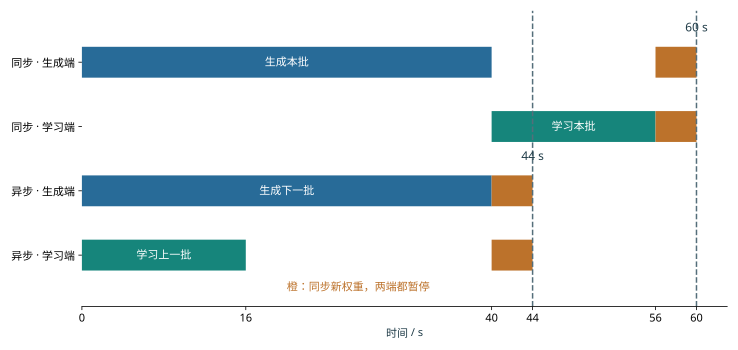

*图 10-16：上方同步执行先生成本批样本，再学习本批样本，最后同步权重；下方在独立资源上同时生成下一批、学习上一批，再同步权重。生成、学习和同步分别耗时 40、16、4 s。图中异步部分表示进入稳定流水后的一个周期。*

图 10-16 中消失的是学习端与生成端轮流等待的时间。但生成得更早也意味着样本可能使用较旧的权重，因此还要扣除被丢弃的样本。

若每批原有 $B$ 条等效轨迹，异步后比例 $q$ 保留下来用于训练，则同步和异步执行的有效样本吞吐量分别为 $B/60$、$qB/44$。异步更快要求

$$
q>44/60=11/15\approx73.3\%.
$$

当 $q=0.8$ 时，有效样本吞吐量提高约 9%；当 $q=0.7$ 时，虽然每批更早结束，有效样本吞吐量反而减少约 5%。因此，计算异步执行的收益时，还要减去因策略版本过旧而被丢弃的样本。

图中的生成阶段被画成一段连续工作。轨迹越长，这一段越容易跨过参数更新或遇到中断，于是除了筛选完成的样本，还要考虑尚未完成的轨迹怎样继续。长轨迹也会延长生成样本与使用样本训练之间的时间差。KV 是给定权重对前缀执行的结果：同权重恢复可继续使用已保存 KV，换权重后则需重新执行前缀来生成对应 KV。Qwen3-8B 的 8K BF16 KV 占 1.125 GiB，保存和取回 KV 缓存需要存储空间与传输时间，重建 KV 缓存则需要重新执行预填充计算。恢复方案据此比较取回时间与重建时间。

若总是丢弃中断轨迹并重新采样，长轨迹因执行时间更长而更容易被丢弃。设生成期间的中断率为 $\lambda$，持续 $t$ 的轨迹在不中断的情况下生成完毕的概率为 $e^{-\lambda t}$；随着 $t$ 增长，进入学习的数据比例下降。按 token 保存进展和策略版本，可以在恢复后继续生成同一条轨迹，减少这种由系统中断引入的长度偏移。跨角色资源恢复在下一章展开。

### 10.5.4 MoE Routing Replay 与训练一致性

上一节讨论的是不同权重版本造成的概率差异。MoE 还存在另一种来源：即使权重相同，生成端与训练端的数值计算差异也可能改变专家选择。由于专家选择是离散的，小幅数值变化就可能让 token 进入另一条计算路径。以 top-2 为例，前三个专家分数为 0.500、0.301、0.300 时，选择专家 1、2；第三个分数因计算次序变为 0.302，便改为专家 1、3。很小的分数变化就可能让计算改用另一个专家的权重矩阵，影响可以沿后续层继续传播。

**Routing Replay** 保存生成时的逻辑专家 ID，训练时按照这些 ID 选择专家，再用当前权重计算路由分数、专家输出和梯度。重放确定使用哪些专家，训练端再计算这些专家在当前权重下的输出和梯度。样本、token 位置和层号共同定位这一份记录。

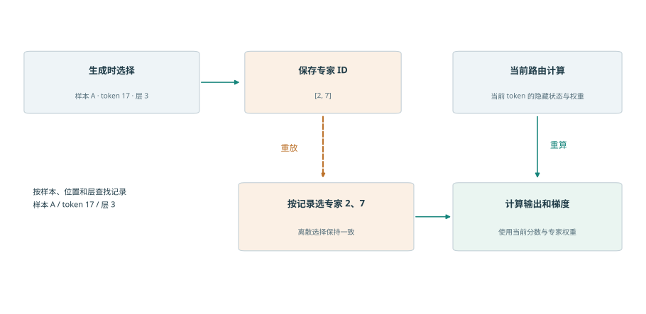

*图 10-17：离散专家 ID 连接生成端与训练端，当前权重继续参与数值计算。示意记录为样本 A、token 17、层 3 的 top-2 选择；虚线表示 ID 重放，实线表示当前计算数据流。*

Qwen3-30B-A3B 的 48 层各记录 top-8。对 8,192 个 token，以 uint16 保存每个专家 ID，大小为

$$
8192\times48\times8\times2=6\ \mathrm{MiB}.
$$

int32 则为 12 MiB。容量计算之后，执行问题是记录如何随 token 一起移动：序列打包改变 token 的位置，上下文切分改变设备归属，重计算再次读取同一层记录。让 ID 与 token 的原始位置共同经过这些变换，训练端才能选中原先那组专家。[^replay]

> **案例：一致性与训练收益。** 作者公布的四组 R3 开关对照各训练 100 步，开启后日志中记录的对数概率误差中位数均下降，每步总耗时中位数略长，训练 reward 没有一致提高。重放减少了路由差异，但保存记录和执行重放也增加了耗时。比较两种方案时，分别观察概率误差、训练时间和固定评估任务上的表现。[^replay]

RL 由此延续了全章的方法：先保证一次训练迭代使用正确的数据和概率，再比较每秒能完成多少次这样的迭代。阶段吞吐、过期样本筛选与重放成本共同决定反馈循环的有效训练进度。

## 10.6 从系统方案到完成期限与硬件选择

### 10.6.1 汇总容量、每步耗时、停顿与恢复

现在回到章首任务。两套方案都处理 100B token，每步 384 条 8,192-token 序列，共 31,790 次训练迭代。设每步训练时间 $t_s$ 已包含单卡计算、通信等待与输入等待，保存恢复附加比例为 $L$，计划性停顿为 $T_0$，则本章的一阶完成时间模型为

$$
T_{\mathrm{finish}}=T_0+\left\lceil\frac{D}{b}\right\rceil t_s(1+L).
$$

各项来自前面不同层次的分析：分析张量的保存时间，可以确认显存是否足够；分析关键路径，可以求得 $t_s$；检查点模型给出 $L$；计划性停顿为 $T_0=5$ 天。将这些结果汇总，就能比较两套方案的完成时间；表中合计由未舍入数值计算。[^design]

| 设计项 | 32 卡方案 | 48 卡方案 |
|---|---:|---:|
| 八卡主机数 | 4 | 6 |
| 全组 ZeRO-3，每卡单序列累积次数 | 12 | 8 |
| 每卡预计显存占用 / GiB | 13.8 | 12.5 |
| 每卡可用显存 / GiB | 22 | 22 |
| 每步单卡计算 / s | 78.3 | 52.2 |
| 每步通信等待 / s | 4.0 | 4.0 |
| 每步等待输入数据的时间 / s | 0.5 | 0.5 |
| 每步训练时间 / s | 82.8 | 56.7 |
| 保存、重做与恢复附加时间 | 0.90% | 0.95% |
| 基础训练时间 / 天 | 30.5 | 20.9 |
| 加入保存恢复和 5 天预留 / 天 | 35.8 | 26.1 |

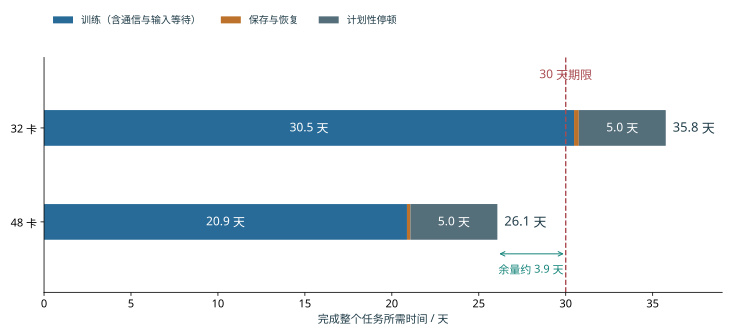

*图 10-18：每条横条依次累计基础训练时间、保存与故障恢复的附加时间，以及预留的 5 天计划性停顿。基础训练时间已经包括通信和输入等待；橙色小段为检查点模型得到的额外耗时。两套方案使用相同任务和全局批次，虚线标出 30 天期限。*

图 10-18 中，两套方案的计划停顿相同，保存与恢复也只占很小一段。主要差别在蓝色的基础训练时间：48 卡把更多微批次并行分给设备，显著缩短了这一段。

**在这组设计条件下，选择 48 卡方案。** 两者都满足容量要求，32 卡因完成时间超过 30 天而淘汰；48 卡约 26.1 天完成，剩余约 3.9 天。增加设备的主要价值是减少每卡承担的训练工作，额外故障成本只抵消很小一部分收益。

### 10.6.2 4090 集群的可行范围

图 10-18 给出了约 3.9 天的剩余时间。将这部分余量分摊回每次迭代，就能知道每步还允许增加多少等待，也就得到了可用于实际调优的性能目标。48 卡的每步训练时间必须满足

$$
t_s\le\frac{25\times86400}{31\,790\times(1+0.00952)}\approx67.3\ \mathrm{s}.
$$

本方案为约 56.7 s，余量约 10.6 s/步。固定单卡计算时间约 52.2 s、输入等待 0.5 s，则总通信等待最多约 14.6 s；当前给定值为 4 s。这一差额可直接用于评估参数预取不及时、跨机通信争用等变化会不会推翻期限判断。

32 卡则需要提高单卡计算效率。扣除恢复、4 s 通信和 0.5 s 输入后，可留给单卡计算约 62.8 s，而 40% 效率下需要约 78.3 s。相同工作量要求单卡计算效率提高到约 $40\%\times78.3/62.8\approx50\%$。于是，两条改进路线可以直接比较：增加两台主机，或者在原有设备上把单卡计算效率从 40% 提高到约 50%。

通信预算必须落实到物理接口。若某主机的八个 rank 共享同一网卡，每个 rank 的发送量都要经过该接口，主机总流量会形成共同排队。以普通 DP 的完整 BF16 梯度环形 AllReduce 为独立例子，32 个参与者每 rank 发送约 $2(31/32)\times16.4\approx31.7$ GB。一个独占 25 GB/s 接口的发送过程约需 1.3 s；多个 rank 共享时，应把它们穿过该接口的字节相加，再按就绪时刻排列。ZeRO-3 则按各模块的参数收集与梯度归约并分片建立同样的接口时间轴。

这样，性能目标就对应到了具体的执行过程：每步最多允许 67.3 s，其中计算约需 52.2 s，其余时间留给通信和输入等待。调优时首先缩短超出预算的那段关键路径，已有足够显存保存的张量则无需为省字节而额外增加工作。

### 10.6.3 替换硬件后的瓶颈与选择

上一小节把期限换成了各项耗时的预算。更换设备时，可以继续沿用这份预算：计算变快会缩短哪一段，带宽变小又会拉长哪一段？更换设备会同时影响单卡计算、容量和互联。将原有步骤分成计算、通信等待等时间，可以判断某项硬件变化有多大价值。设某资源占原每步耗时比例为 $f$，处理能力改为原来的 $r$ 倍，保持其他执行和依赖不变，则

$$
\frac{T'}{T}=1-f+\frac{f}{r}.
$$

这就是根据各项耗时的比例应用 Amdahl 定律。原来 100 ms 中只有 5 ms 通信等待，带宽减半后变为 $95+10=105$ ms；若原来通信占 50 ms，同样减半后为 $50+100=150$ ms。前一个任务只慢 5%，后一个慢 50%，因为等待该资源的原有时间占比相差十倍。

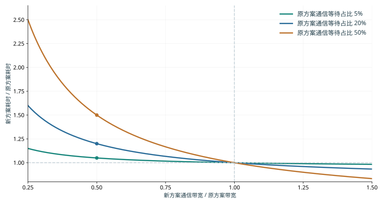

*图 10-19：资源能力变化的收益由原有等待时间占比决定。曲线按 $T'/T=1-f+f/r$ 计算，固定单卡计算与依赖，通信时间随有效能力成反比。*

在本章的 48 卡方案中，若 4 s 通信等待对应的处理时间翻倍，每步耗时从约 56.7 s 增到 60.7 s，仍低于 67.3 s。若单卡计算效率从 40% 降到 30%，单卡计算时间变为约 69.6 s，加上通信与输入为约 74.1 s，超过目标。对这套方案，单卡计算效率比这次带宽减半更容易改变期限结论。[^hardware]

比较 A100、A800、H20 或其他设备时，可将其对应的单卡计算、接口服务和容量代入同样的分解。满足期限的方案再比较设备租用、能源和准备成本。更强的单项指标是否值得购买，取决于它能减少多少任务完成时间或设备数量。

### 10.6.4 模型规模、数据量与期限的敏感性

前面保持模型不变，比较了设备数量和设备性能。若把模型本身放大，计算量又会怎样增长？最后把同一方法扩展到模型规模。采用 Dense 粗略工作模型 $F=6ND$，固定数据量 $D=20$T token、50% MFU 和可用于执行的期限 $T$，满足期限所需卡数为

$$
p\ge\left\lceil\frac{6ND}{P\eta T}\right\rceil.
$$

图 10-20 将 90 天期限画成设备数边界。选择某个模型规模后，边界上方的计算资源能够在该效率下完成工作，边界下方需要提高效率或延长期限。

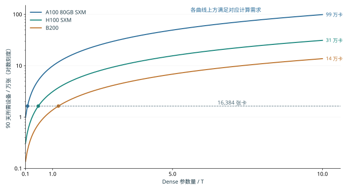

*图 10-20：固定 90 天执行期限，Dense 规模增大要求更多计算设备。数据量为 20T token，算法工作为 $6ND$，效率为 50%，使用 BF16 dense 峰值。各线为向上取整前的连续计算边界；横线标出 16,384 张卡。*

对 1T 参数，16,384 张 A100、H100、B200 分别约需 543、171、75 天。因此在 90 天执行预算下，B200 处于计算边界上方，H100 与 A100 需要增加卡数。B200 的 75 天距离期限仍有约 15 天，可继续分配给计划停顿与恢复。[^scale]

固定数据量时，模型参数增至五倍，工作也增至五倍；若数据量同时取 $D=20N$，则 $F=120N^2$，五倍参数带来 25 倍工作。规模问题的答案由模型和数据共同决定。MoE 则分开计算全部可训练参数的状态与被激活路径的执行工作，再将专家交换放入关键路径。

公开训练日志提供长期执行的观察窗口。若从检查点继续训练，本次新增 token 等于结束累计值减去恢复起点累计值；用新增工作除以本次时间，得到对应长期速率。这个速率可以直接检验整套系统能否保持设计中的有效训练进度。[^public]

回看全章，图 10-3 至图 10-5 解释了数据怎样占用显存和经过链路；图 10-7 至图 10-13 说明这些操作怎样形成等待、又怎样影响长期训练；图 10-18 则把各项耗时汇成了章首任务的完成时间。状态安排、执行顺序和恢复方式由此连成了同一个设计问题。RL 将工作来源改为反馈循环，仍通过同一方法比较资源和有效训练进度。下一章进一步讨论这些作业与阶段怎样共享资源池。

## 本章小结

训练容量由状态表示、所有权和生命周期共同决定。ZeRO 减少状态复制，重计算减少前向到反向之间的保存，卸载将暂时不用的训练状态移到主机内存；三者都把容量收益换成新的工作或传输。执行时，数据就绪与资源空闲共同决定开始时刻，沿依赖关系累积到参数更新结束的延迟决定每步耗时。

长期完成时间在每步耗时之外计入输入数据准备、保存与故障重做。检查点既保存优化器状态，也保存已完成训练的数据位置；保存周期平衡正常运行中的写入成本与故障后的重做成本。RL 进一步要求跟踪样本标识和策略版本，使阶段重叠产生的速度收益转化为训练样本吞吐量。

本章的设计案例中，32 卡与 48 卡均能容纳训练状态，但给定相同训练目标和执行效率后，完成时间分别约为 35.8 天和 26.1 天。48 卡满足 30 天期限，每步训练时间上限约为 67.3 s。这个结论来自容量、执行与恢复的连续推导；相同模型也给出了结论随效率、通信和故障变化的阈值。

## 常见误区

**“分片数翻倍，训练峰值就减半。”** 分片只直接缩小分给各设备的长期保存的训练状态。小模型例中长期保存的训练状态从 18 MiB 减到 9 MiB，临时存活量仍约 21 MiB，峰值从 39 MiB 减到 30 MiB。决定容量的量是同一时刻的总显存占用。

**“通信处理时间更短，训练步就更短。”** 三个小桶的总处理时间约 4.7 ms，比整桶 4.5 ms 更长，却可以分别进入三个计算空隙。通信的完成位置决定它是否延长步骤。

**“异步保存返回了，已有进展就安全了。”** 50 s 故障时，可用恢复点取决于哪份快照已经提交。相同的 1 s 前台暂停可以对应 30 s 或 10 s 重做，区别来自后台写入的完成时刻。

**“增加生成吞吐，就增加 RL 学习速度。”** 生成 12 条/s、验证六条/s、样本保留比例 75% 时，学习只有 4.5 条/s。增加生成资源不会越过验证瓶颈，提高验证能力才会把限制移到训练端。

## 习题与实验

以下十题按基础计算、机制分析和综合设计递进。计算题所需条件均在正文中；实验部分使用配套记录或自行测量的数据完成。

> **习题 10-1 · 基础：状态与峰值**
>
> 将本章梯度改为 FP32，计算 Qwen3-8B 长期保存的训练状态。再求八卡 ZeRO-1、ZeRO-2、ZeRO-3 的每卡容量。设执行中有 6 GiB 激活和两份各 3 GiB 的模块缓冲，分别计算两份缓冲同时保留与顺序复用时的峰值。

> **习题 10-2 · 基础：从期限反推效率**
>
> 使用本章任务和 384 序列全局批次，计算 30 天和 25 天对应的每步预算。给定 32 卡、每步 4 s 通信等待和 0.5 s 输入等待，先忽略恢复，求满足 25 天的最低单卡计算效率；再加入本章恢复成本。

> **习题 10-3 · 综合设计：32 卡与 48 卡方案的选择**
>
> 比较 32 卡与 48 卡的完成时间和训练期间 GPU·小时。将每步附加存储上限从 10 GiB 提高到 20 GiB，重新判断容量。若只能租用四台八卡主机，分别求减少任务量、延长期限和提高效率三条路线的目标值。实验部分选择一条路线进行测量，替换教学参数。

> **习题 10-4 · 分析：流水气泡与重计算**
>
> 在四阶段、前向 10 ms、反向 20 ms 的模型中，求 1、4、8、16 个微批次的理想利用率。沿图 10-7 解释 93—95 ms 的等待来自哪项依赖。将每层 10 MiB 的可重建乘积扩展到九层、四个待反向微批次，计算长期保存的数据减少多少，以及串行重建需要多大的工作区；再讨论两层同时执行反向传播时工作区怎样变化。

> **习题 10-5 · 分析：数据准备与有限队列**
>
> 48 卡每步处理 384 条序列，每步训练时间约 56.7 s，四个数据准备进程各准备两条/s。若一个数据准备进程暂停 60 s，求维持原处理速度至少需要的预取条数，以及恢复四个数据准备进程后补满这些条数所需时间。再将检查点与输入放在同一条 8 GB/s 通路，分析保存期间的数据输入速度。

> **习题 10-6 · 分析：保存周期**
>
> 推导一阶最优周期，复算 1024 卡的 300、900、1800 s 三个保存间隔。加入每天一次、会同时影响全作业的共同中断，重新计算故障率和最优周期。实验部分在提交前后分别注入故障，比较恢复位置与需要重做的工作。

> **习题 10-7 · 综合设计：RL 阶段配置**
>
> 从生成 12、验证 6、学习 8 条/s、样本保留比例 75% 出发，比较只将一个阶段能力翻倍的收益。再用生成 40 s、学习 16 s、权重同步 4 s 的周期模型，求样本保留比例 80% 和 70% 时的有效吞吐。实验部分追踪一批样本的标识、奖励、有效损失位置和接收端权重。

> **习题 10-8 · 分析：路由记录与样本对应关系**
>
> 计算 8K token、48 层、top-8 在 uint16 和 int32 下的记录容量。将两条序列打包后，再沿上下文切成四份，描述专家 ID 如何随 token 重排。构造一个 token 位置错位的例子，说明训练端将如何使用错误专家，并设计定位这一错误的检查。

> **习题 10-9 · 分析：硬件敏感性**
>
> 在本章的 48 卡设计案例中，分别将通信时间翻倍、单卡计算效率降至 30%、输入等待增至 5 s，重算完成期限。给定额外资源只能改善其中一项，比较每项可减少的关键路径时间。再选一份硬件规格或执行记录，将其中一个教学输入替换为有来源的数值。

> **习题 10-10 · 综合设计：规模与完成成本**
>
> 用 $6ND$ 计算 1T、5T、10T Dense 模型在固定 20T token 和 $D=20N$ 下的工作，分别求 90 天与 180 天的设备边界。自行给定并说明设备日成本、准备时间和恢复参数，比较两个满足期限的方案。实验部分从一份带恢复起点的公开日志计算本次新增 token 的长期速率。

## 参考资料与进一步阅读

[^state]: [官方参数与 Adam／ZeRO 状态复算](../calculations/results/training-state-book.md)；[FP32 梯度变体](../calculations/results/training-state-fp32-gradient.md)。本章使用规定的五项状态表示，其他优化器与低精度状态需另算。
[^deadline]: [训练期限与设备下界](../calculations/results/training-deadline-book.md)及[日历时间变体](../calculations/results/training-deadline-calendar.md)。精度、稀疏性与硬件来源在 JSON 中逐项记录。
[^fsdp]: [已有 CPU FSDP2 四配置记录](../experiments/ch10/10-01/fsdp-cpu/README.md)。 CPU 小模型四种配置得到的参数与未分片参考结果一致；训练分配峰为 39.16／30.14 MiB。
[^pipeline]: [填满排空事件模型](../calculations/results/training-pipeline-gpipe-m8.md)、[1F1B 事件模型](../calculations/results/training-pipeline-1f1b-m8.md)、[GEMM 输入张量的保存关系](../calculations/results/pipeline-gemm-save-1f1b.md)、[选择性重计算](../calculations/results/pipeline-gemm-recompute-products.md)。 GEMM 输入采用 FP32 参考表示，九层的可重建乘积为 90 MiB，最大逐层重建工作区 6 MiB。流水图采用 save_nonlinear 策略保存的中间结果及其收发缓冲。
[^offload]: [梯度转换复算](../calculations/results/gradient-cast-book.md)、[快链路变体](../calculations/results/gradient-cast-fast-link.md)、[SuperOffload 阅读与转换案例](../case-studies/training-offload-and-casting.md)、[已有 CPUAdam 卸载记录](../experiments/ch10/10-01/deepspeed-offload/README.md)。 转换路径从 GPU 梯度就绪开始，到 CPU 可读取 FP32 梯度结束；两条路径均使用页锁定主机内存作为缓冲区，CPU／GPU 转换吞吐为教学输入。
[^megascale]: 论文报告的每步耗时为 23.66／6.34 s，扩展效率约 93.3%；对应固定全局批次的整套系统扩展实验。 [MegaScale 正式论文](../references/proceedings/NSDI/2024/selected/nsdi24-jiang-ziheng.pdf)及[固定任务、历史配置与计量笔记](../case-studies/collective-paths-and-diagnosis.md)。
[^moe]: [DeepSeek-V3 技术报告](../references/files/papers/deepseek-v3.pdf)、[专家交换与反向分桶案例](../case-studies/expert-dispatch-and-resizing.md)。 72 MiB 分三桶、16 GiB/s 有效数据传输速率、0.1 ms 启动和三个 2 ms 空隙为教学输入。专家均衡与路由机制参见 DeepSeek-V3，切块调度参见链接中的案例。
[^length]: [训练工作与长度分布推算](../case-studies/training-compute.md)。
[^supply]: [训练数据输入与共享存储模型](../calculations/results/training-supply-shared-starvation.md)、[已有输入与保存共存实验](../experiments/ch10/10-06/input-io-contention/README.md)。 共享通路算例使用 112 GB 快照、8 GB/s 总传输速率和 3 GB/s 输入需求；本章的设计案例使用四个各准备两条序列/s 的数据准备进程。
[^checkpoint]: [检查点布局、ByteCheckpoint 与后台保存阅读](../case-studies/checkpoint-layout-and-loading.md)、[逻辑重分片计算](../calculations/results/checkpoint-reshard-book.md)、[112 GB 时间线](../calculations/results/checkpoint-async-rounded.md)。
[^resume]: [DCP 恢复记录](../experiments/ch10/10-06/README.md)、[真实文本管线恢复](../experiments/ch10/10-06/input-state-recovery/README.md)。 2,000＋6,192 是解释打包残留的教学例。已有 DCP 小模型将两份行分片恢复为三份列分片与完整状态，参数、Adam、随机状态和下一次参数更新结果与不中断训练一致。
[^fault]: [已有异步保存与提交前故障实验](../experiments/ch10/10-07/README.md)及[无保存／同步／异步对照](../experiments/ch10/10-07/save-baseline/README.md)。 原正常路径 API 为约 7.25 ms、元数据提交约 48.30 ms；故障实验在提交前设置屏障并终止进程。
[^interval]: [保存周期与 Poisson 重试模型](../calculations/results/checkpoint-interval-book.md)。 精确数据量为 114,670,295,040 bytes，保存成本约 14.334 s；一阶最优 939.6125 s，含保存期故障的 Poisson 重试模型约 930.0811 s。本文的选择只需要区分五、十五和三十分钟。
[^verl]: [固定 verl 小模型真实闭环](../experiments/ch10/10-08/README.md)、[loss 与更新的源码核对](../research/2026-infra-survey/qa/verl-recipe-loss-closure.md)。实验目录沿用重组前编号；当前对应习题 10-7。 固定 Qwen2.5-0.5B-Instruct 配方采用单卡 NO_SHARD、no_sync=False；源码和版本锁定见链接中的记录。0.32／0.30／0.04 使用真实长度结构与教学标量损失推导。
[^handoff]: [Qwen3-8B 共享设备峰值](../calculations/results/weight-handoff-qwen8.md)、[Qwen3-235B 分片权重同步](../calculations/results/weight-handoff-book.md)。 40 GiB 为分片／卸载后显存占用的教学输入；两个切换峰值精确约为 83.256／59.256 GiB。
[^identity]: [RL 状态、概率比与版本](../case-studies/rl-state-and-reproducibility.md)、[DeepSeek-V4 技术报告](../references/files/papers/deepseek-v4.pdf)。
[^replay]: [路由元数据预算](../calculations/results/routing-metadata-book.md)、[作者公开 R3 日志及分析边界](../experiments/ch10/10-09/source-readiness/README.md)。当前对应习题 10-8。 四对设置共用 seed42；reward 为训练批指标，logprob 为作者日志级统计。
[^hardware]: [匹配训练日志的来源缺项](../experiments/ch10/10-04/README.md)。 既有资料尚无 Qwen3-8B／235B 在 A100、A800、H20 上同条件稳态全参训练日志；约 3.5 s/步的 H20 记录来自 LoRA。
[^scale]: [Dense 规模与期限](../calculations/results/dense-training-scale-book.md)、[数据量随参数增长的变体](../calculations/results/dense-training-scale-proportional.md)。
[^public]: [SmolLM3 原始训练记录核验](../experiments/ch10/10-10/public-training/README.md)。 SmolLM3 记录含 384、288、192 rank 阶段，最后一次恢复实际运行 14,000 步；终点累计 token 包含此前工作。

[^design]: [本章设计题的输入、推导与复算](ch10/design-case.md)。32／48 卡的容量预留、单卡计算效率、通信等待、输入等待和计划停顿为教学输入；模型矩阵工作来自既有 training-deadline 计算。逐项数值与独立复算保存在 [design-case.json](ch10/design-case.json)。
