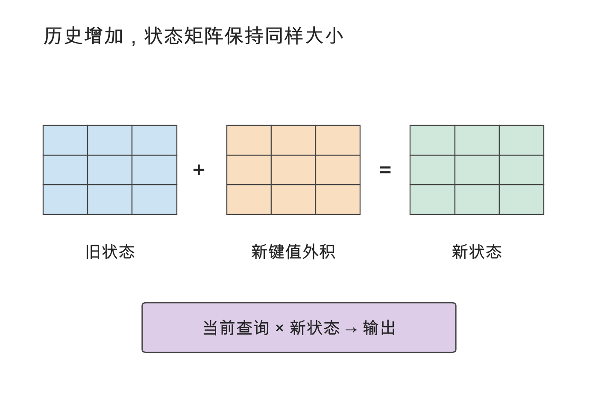
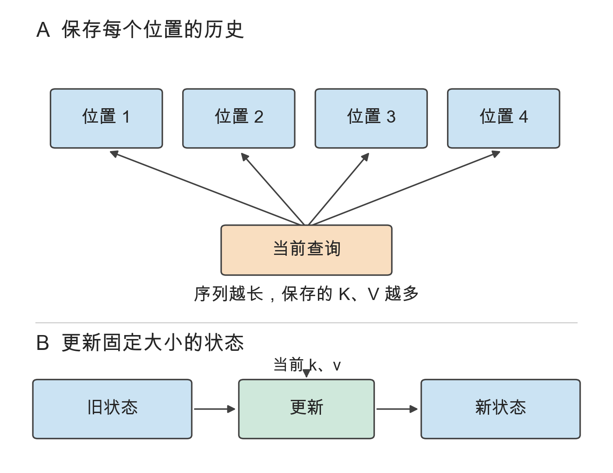
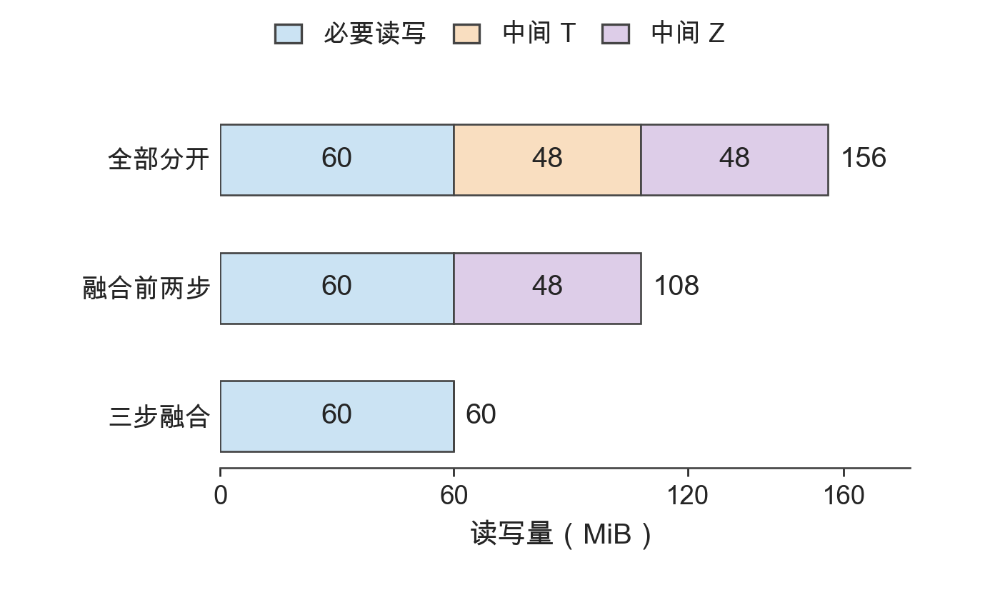
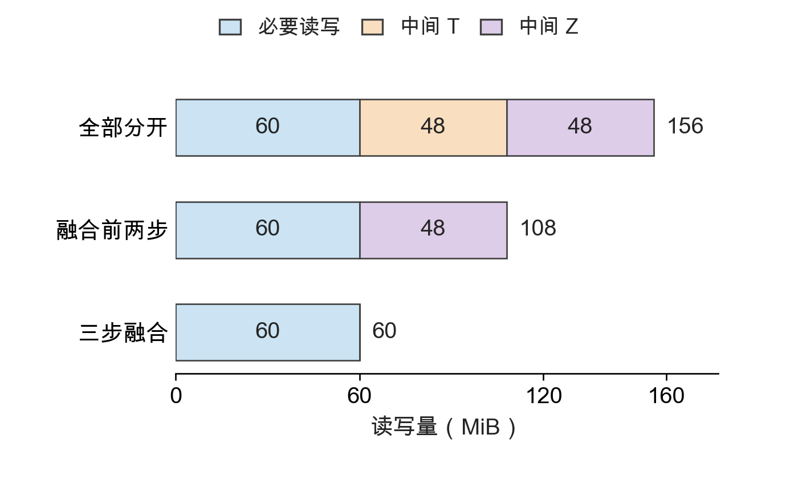

<!-- 从 preview.html 迁移的资料快照；原始 HTML SHA-256: 182a15e1cfce83d11e4aaece64dcb2ee9215f0e4d233f2d9633069803efab2be。 -->

# Infra 配图体例样稿

参考《Hands-On Large Language Models》的教学插图语言。两组原图与样图按同一宽度显示；样图以 420 pt 成书宽度设计，主体文字 12 pt。本页为独立评审稿。

[完整分析与迁移建议](README.md)

## 历史状态的两种保存方式

原图

样图

上图：箭头表示查询访问各位置的 K、V；仅示意四个历史位置。下图：当前 k、v 更新固定形状的状态，Sₜ = Sₜ₋₁ + kₜvₜᵀ；该式为简化的线性状态更新示意。

[SVG](sample-history.svg) · [PDF](sample-history.pdf)

## 融合减少中间结果读写

原图

样图

同一算例中，必要读写为 60 MiB；中间 T、Z 各产生 48 MiB 的写回与读取。融合分别消除这些中间读写，总量为 156、108、60 MiB。

[SVG](sample-fusion.svg) · [PDF](sample-fusion.pdf)
