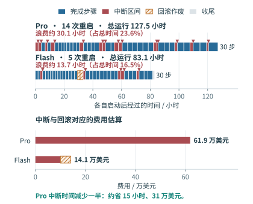

# MiMo-V2.6 两次 RL 运行的中断与恢复

一次故障造成的损失，不只是加载 checkpoint 的几分钟。故障发生前已经做过的计算可能需要重来，发现和排查问题也需要时间。训练集群越大，这些时间对应的费用越高。MiMo-V2.6 的公开运行日志和费率，可以用来估算这笔成本。[^src]

## 两三个小时，五六万美元

技术报告 §4.1 披露，MiMo-V2.6-Pro 与 Flash 两次 RL 后训练分别花费约 260 万和 90 万美元。运行看板按固定费率累计费用：Pro 每秒 5.71 美元，Flash 每秒 2.855 美元。因此，两组资源每小时的成本分别为

$$
p_{\mathrm{Pro}}=5.71\times3600=20{,}556\ \text{美元/小时},
\qquad
p_{\mathrm{Flash}}=2.855\times3600=10{,}278\ \text{美元/小时}.
$$

以 Pro 为例，从上一步完成到第五次重启，经过约 2.758 h，按此费率计为

$$
2.758\times20{,}556\approx56{,}689\ \text{美元}.
$$

该时段未完成新的训练步，重启后仍需继续训练。下表列出几次达到五六万美元的中断；计算采用未取整的时间，表中只显示两位小数。

| Pro 重启序号 | 上一步完成至重启 | 对应费用 |
|---|---:|---:|
| 第 4 次 | 2.85 h | 58,560 美元 |
| 第 5 次 | 2.76 h | 56,689 美元 |
| 第 6 次 | 2.63 h | 54,106 美元 |
| 第 8 次 | 2.95 h | 60,728 美元 |
| 第 9 次 | 2.72 h | 55,815 美元 |

这说明一次中断就可能消耗五六万美元。各次中断并非同样长：完整 Pro 运行共重启 14 次，按下述方法估算，平均每次约 4.4 万美元。

## 整次运行损失了多少



两次运行最终各完成 30 步。图中将相邻事件之间的时间逐段画出：完成一步记为蓝色，重启前的区间记为红色，最后一步之后的收尾记为灰色。红色三角表示重启时刻。

Flash 还有一次回滚。运行方公告称，一类基础设施错误约三小时未被正确检出，随后从第 15 步恢复。此时第 16、17 步已做完，却需要重新执行；第一次执行这两步花掉的约 3.96 h 被画成斜线。第二次成功执行的两步计入正常训练，不再重复算作损失。

| 统计量 | Pro | Flash |
|---|---:|---:|
| 日志开始至结束 | 127.49 h | 83.09 h |
| 重启次数 | 14 | 5 |
| 中断区间累计 | 30.12 h | 9.74 h |
| 回滚作废的已完成步骤 | 0 | 3.96 h |
| 浪费时间合计（中断与回滚） | 30.12 h | 13.71 h |
| 占总运行时间 | 23.6% | 16.5% |
| 中断区间对应费用 | 61.91 万美元 | 10.01 万美元 |
| 作废步骤对应费用 | 0 | 4.07 万美元 |
| **中断与回滚费用估算** | **61.91 万美元** | **14.09 万美元** |

这里的中断区间，是每个重启事件到前一个事件之间的时间；第一条事件若为重启，则从运行开始计起。它包含失败尝试、故障检测及重启前等待，日志没有进一步拆分。按区间乘费率，可以估算这些中断占用资源的成本，但其中可能有采样结果在恢复后得到复用，因而不把金额解释为全部计算均已作废的精确账单。报告 §6.3 明确说明，恢复后可复用满足策略陈旧度限制的已完成轨迹。

## 提高可靠性可以省下多少

假设完成同样的训练工作，Pro 的中断总耗时减少一半，且其他耗时和费率不变，则运行可缩短约 15.06 h，对应节省

$$
\Delta C=\frac{30.12}{2}\times20{,}556\approx31\ \text{万美元}.
$$

这是用于评估优化价值的情景计算，不是已经测得的优化收益。它说明，减少故障带来的时间浪费，本身就可能产生可观的成本收益。即使模型算子的执行速度不变，只要少停几次、少重做几轮，同一项训练也能更早完成。

第 10.4.4 节的一阶模型将故障附加时间写为 $\lambda(\tau/2+r)$。减少故障次数、拉长平均故障间隔，会降低 $\lambda$；缩短恢复时间会降低 $r$；更近的可用 checkpoint 则减少重做。若资源每小时成本为 $p$，节省 $\Delta T$ 小时就对应 $p\Delta T$ 的资源成本。是否值得投入优化，可以将这一收益与新增保存开销、资源冗余和实施成本一起比较。

技术报告 §5.5 给出了可以着手处理的问题。基础设施故障包括显存双比特错误、Kubernetes pod 崩溃，以及评分服务网络不可达；推理侧曾因低估轨迹长度而耗尽 GPU 与锁页主机内存中的 KV 池；训练侧曾因专家负载不均而显存溢出；Flash 后期还出现序列打包导致的主机内存不足。运行方调整训练并行方式、降低激活显存，以容纳局部专家负载峰值。这些改进针对故障原因，checkpoint 与恢复优化则负责在故障发生后减少损失。

## 数据与复算

本图参考作者提供的 Claude Artifact 截图，保留时间线和费用分解的表达方式，改用两次运行结束后的完整日志。截图截至 9 月 18 日，Pro 为 9 次重启、Flash 为 3 次；本图使用最终的 14 次与 5 次。截图中的 Flash 将重跑两步的耗时计入额外成本，本图则统计第一次执行后作废的两步，使时间线中的每一段只计一次。

运行看板按日志起止字段累计总成本，Pro 为 262.07 万美元，Flash 为 85.40 万美元。技术报告自报的 260 万和 90 万美元用于说明训练投入；逐次中断金额均按看板费率计算，不混用两套总额。报告图 12 标注 123.1 h 与 81.8 h，和日志的 127.49 h 与 83.09 h 也有差异：Flash 的差额可由最后一步之后的收尾解释，Pro 的差异尚无法从现有材料确定。本图统一使用日志时间戳。

[复算脚本](../references/files/documents/mimo-v26-rl-run-log/recalculate.py)核对两次快照合并后的事件、重启次数和最终步骤时间戳，输出每次中断的区间、金额及[完整计算记录](../references/files/documents/mimo-v26-rl-run-log/recalculated.json)。[作图脚本](../manuscripts/ch10/mimo-interruptions.py)直接读取该记录生成 SVG、PNG 和 PDF。在仓库根目录运行：

```bash
python3 references/files/documents/mimo-v26-rl-run-log/recalculate.py
.venv-site/bin/python manuscripts/ch10/mimo-interruptions.py
```

[^src]: [MiMo-V2.6 技术报告](../references/files/papers/mimo-v26-tech-report.pdf)：§4.1（训练总成本）、§5.5 与图 12（故障原因与时间线）、§6.3（恢复后复用轨迹）。[归档日志](../references/files/documents/mimo-v26-rl-run-log/README.md)包括费率、事件、逐步指标与运营方公告；原始来源为[小米运行看板](https://mimo.xiaomi.com/rl/)。图形参考为作者提供的 [Claude Artifact](https://claude.ai/artifact/7ERomYzY1SP2dpiyoTbHRo) 两张截图；其故障费用并非官方单列发布的统计值。
