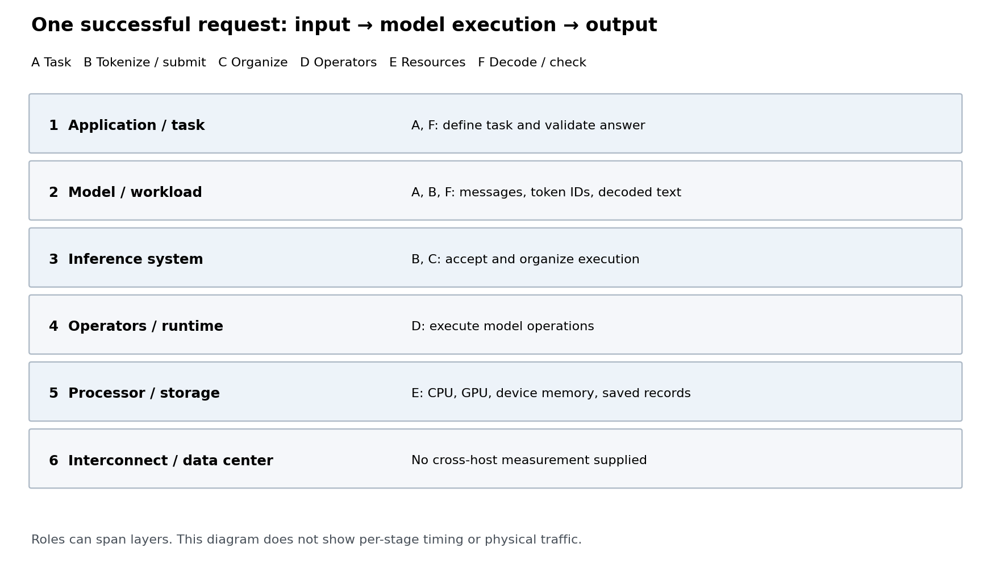

# 参考答案

| 六层教学分组 | 对应路径标签 | 负责什么 |
|---|---|---|
| 1 应用与任务 | A、F | 定义要查询的键和输出格式；检查返回JSON是否完成任务。 |
| 2 模型与负载 | A、B、F | 文本输入、token序列和生成结果；把消息编码为模型输入，把返回token解码为文本。 |
| 3 训练与推理系统 | B、C | 接收生成请求，组织执行，管理KV容量和请求顺序。本记录没有训练。 |
| 4 算子与编译运行时 | D | 将模型运算交给运行时执行。这里不提供每个算子的内部计数或独立耗时。 |
| 5 处理器与存储 | E | CPU执行准备与控制，GPU提供模型计算，显存容纳模型数据和KV；主机文件保存输入与结果。 |
| 6 互联与数据中心 | 不补造链路 | 单机内部仍有通信边界，但这份教学记录没有跨主机链路测量，不能填入跨数据中心耗时或带宽。 |



六层描述不同职责，不是请求必须依次穿过的六个串行阶段。B既涉及输入表示，也涉及向推理系统提交请求；F既涉及解码，也涉及应用检查。CPU也参与安排工作的代码执行，因此“安排工作”和“提供计算资源”不能机械地划为互斥设备类别。

该请求保存了 **7,235个输入token、46个输出token**，自然停止。返回：

```json
{"k0064": "915819", "k0256": "358610", "k0447": "659277"}
```

返回文本与给定记录中的三个值完全一致；完整输入ID与请求实际接收ID一致。这里的完成判据是这道固定查询题的严格答案检查，不能扩展为模型的通用质量保证。模型生成结束以后，应用仍需解码和检查结果。进阶Agent案例还要启动工具、接收反馈，模型生成结束更不等于整个任务结束。

`evidence/driver.py`显示编码、提交、生成和解码调用；配置记录显示引擎及KV设置。资源定位结合这些源码与成功执行记录，不能冒称逐步硬件事件跟踪。token数不是网络字节数，配置容量也不是逐时刻实测占用。本题没有重新计算这些量。
