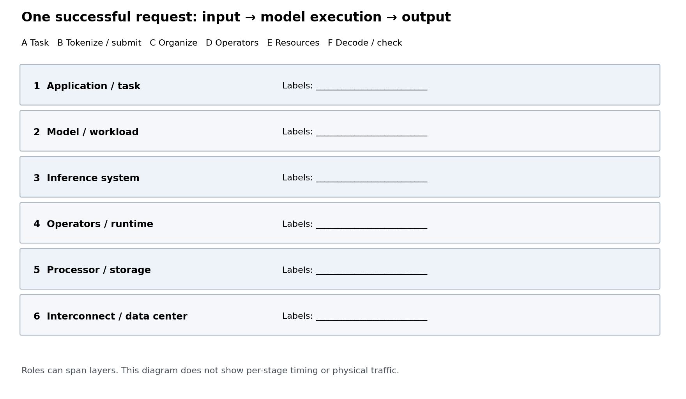

# 基础练习：把一次生成请求放回六层图

输入是一段512条键值记录，任务是取出 `k0064`、`k0256`、`k0447` 的值，并只返回JSON。完整输入见 `evidence/cases.json` 中的 `n512-r0`；这条请求已经在RTX主机上的原生模型运行中成功完成。

已标注的请求路径如下。A至F是阅读标签，不是六个独立进程，也不是六段互不重叠的计时。

**输入：A任务与消息 → B编码和提交 → 模型执行：C安排执行 → D运行模型算子，使用E计算与存储资源 → 输出：F解码与检查答案。**

下面的空白图列出了本书六层。将A至F填入适当位置，一个标签可涉及多个层；没有证据经过的链路可以明确留空。

1. 标出哪些活动定义任务，哪些安排工作，哪些实际计算，哪些保存数据。
2. GPU、显存、推理引擎、输出检查分别应放在哪一层？哪些活动可以横跨层次？
3. 模型返回token以后，这个任务还需要做什么才能判定完成？
4. 能否凭这条单机记录填写跨数据中心通信耗时，或者把输入token数量当成实际网络字节数？说明依据。

先作答，再看 [参考答案](ANSWER.md)。可运行 `python3 run.py`核对输入、返回记录与已知正确答案；不需要GPU或模型依赖。
