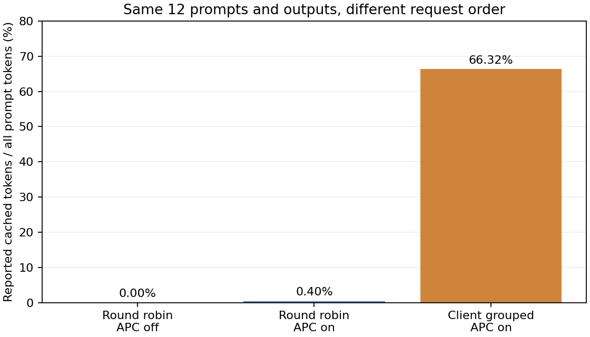

# 3-2：多轮客户身份、历史与前缀缓存

同样四个客户、每客户三轮检索，完整输入与模型输出逐请求完全一致，仅改变缓存开关或客户访问顺序，实际报告的前缀命中明显不同。三个条件各12/12严格JSON答案正确，共36次实际生成，没有把期望答案填入会话历史。

| 条件 | 输入token合计 | 报告cached tokens | 输入token命中比例 |
|---|---:|---:|---:|
| 四客户轮转，APC关闭 | 87864 | 0 | 0% |
| 四客户轮转，APC开启 | 87864 | 352 | 0.40% |
| 客户内连续三轮，APC开启 | 87864 | 58272 | 66.32% |



APC开启的轮转组除首请求为0外，均只报告32token公共前缀命中。连续组后两轮每客户分别命中7232、7312token，其余客户首轮仍仅32token。两种APC条件逐请求输入和输出全部一致，缓存差异没有混入不同答案导致的历史变化。全部请求正常stop，每条46输出token。

本结果表明，保留客户身份和长历史并不保证后续请求仍能命中长前缀；同一内容在不同访问顺序下的可复用量不同。这里记录的是vLLM的`num_cached_tokens`，不是物理KV读取字节、内部cache eviction事件或省下的GPU时间。两组均无观测到的等待请求或抢占；最大采样KV使用率均约51.27%，该指标不能当作所有缓存块的物理驻留量。

## 负载与范围

这是明确构造的四客户控制负载，不是ServeGen生产会话复现。公开ServeGen会话使用匿名标识，输入标识数组不等于实际token序列，不能据此还原真实文本前缀。原公开会话审计及窗口回放保持独立。

四份512条键值文档，固定seed302900–302903，各三轮查询不同的三个键。后续每轮消息包含同一客户此前的**实际模型回答**，并保留原始文档；客户之间不混用历史。保存完整messages、prompt IDs、output IDs、答案、期望值、请求metrics及每次scheduler回调。

BF16 Qwen3-8B固定本地快照，RTX PRO6000Blackwell，vLLM0.23/Torch2.11cu130；KV2GiB、maxlen8192、chunk2048、maxseq1、eager、async scheduling关闭、temperature0、maxoutput128、thinking关闭。引擎与模型精确路径见各组environment。三个独立引擎依次执行，单次无反序重复，未预热全部形状，所以不据墙钟给顺序或缓存策略做性能排名。

原协议是轮转APC关／开，观察到短公共前缀命中后追加客户连续顺序，时间与理由见`FOLLOWUP.md`；不冒称该追加在原协议中预登记。三组均顺序dispatch，未保持生产到达时间，不包含真实用户思考、工具等待、并发客户或到达分布结论。它补的是多轮回放和真实缓存观察机制。

## 独立复现与证据

```sh
python reproduce.py --model /path/to/frozen/Qwen3-8B/snapshot
python analyze.py
python plot.py
```

在相同vLLM环境的独立目录副本执行，须先移走封存off/on/grouped及对应*-run输出目录，防止覆盖。任务在运行时按固定seed生成，无相邻目录依赖；绘图需Matplotlib。`run.py`与`run_grouped.py`只在两层循环次序上不同，`analyze.py`按请求ID配对而不按文件行顺序错误配对。

`*-run/supervisor.json`证明三个正式批次exit0且无残留。一次16K配置超过2GiBKV可服务长度的初始化失败发生在请求之前；核实终态后清理，只保留最终8K成功配置。未停止其他GPU服务，未修改calculations。

`verify.py`检查manifest并重新独立检查实际历史连续性、所有严格答案、缓存计数范围、三组引擎参数及输入／输出匹配；重跑分析应与封存analysis逐字相同。全部原始请求和scheduler记录、PNG/SVG/PDF图随包保留。实际生产客户、并发到达和最终跨session论文复核仍待。
