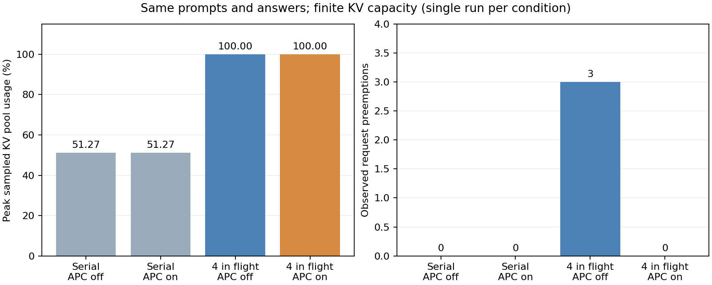

# 3-2：同一多轮负载的四客户并发

四客户每轮同时提交、全部完成后进入下一轮。两组APC关闭／开启各12请求，**24条完整答案均正确**；按请求ID核对，输入和输出token与已有串行参考全部相同。每个客户的后续历史来自实际模型回答，没有使用期望答案替代。

| 观察项 | 串行参考（关／开） | 四请求在途、APC关 | 四请求在途、APC开 |
|---|---:|---:|---:|
| 严格答案正确 | 各12/12 | 12/12 | 12/12 |
| KV池采样峰值 | 51.27%／51.27% | 100% | 100% |
| 最大等待请求 | 0／0 | 3 | 3 |
| 最大运行请求 | 1／1 | 2 | 2 |
| 观测抢占次数 | 0／0 | 3 | 0 |
| 报告cached tokens | 0／352 | 0 | 352 |



输入输出总量相同，提交方式改变了实际等待与状态压力。应用的四条请求经起止区间核对确实同时在途；引擎最多报告两条运行，且运行数可能包含部分prefill，不能当成四条同时decode。APC开启仍只有短公共前缀命中，本次没有抢占，不能由单次固定顺序推出普遍的抢占消除效果。

## 条件和边界

使用前一 [多轮缓存控制](../multiturn-cache/README.md)的四份512条文档、三个查询轮次和seed。BF16 Qwen3-8B同一快照、KV2GiB、maxlen8192、chunk2048、eager、temperature0、maxoutput128、thinking关闭。相对各自串行参考，仅引擎max_num_seqs从1改4及驱动并发提交方式改变；分析器核对其余引擎参数完全相同。

每轮四请求的实际dispatch跨度为34–58ms，未冒充同一时刻到达；各轮均等待全部完成再继续，不是独立客户思考后续发或生产开环到达。每组只有一次正式运行，off先、on后，没有反序重复，不以端到端墙钟差声称缓存或并发吞吐收益。每条46输出token、每组87864输入token。这里是合成控制负载，不是ServeGen匿名生产会话。

全部scheduler回调原样记录运行数、等待数、KV使用率、抢占增量和应用活跃请求集合。KV是引擎池指标，不等于整卡显存或所有缓存块的物理驻留；抢占数不是失败请求数。原始每请求metrics和事件保留，不把首次调度等待当成累计抢占等待。

两次guard正常exit0、无资源终止原因、无残留，未终止其他GPU服务。串行参考直接复制封存原件，没有重复运行；本轮没有失败批次需要清理。更多KV容量、反序重复、生产客户及到达分布仍待，不能将此单次对照外推为通用配置排名。

## 独立复现

在相同vLLM0.23/Torch2.11cu130环境的独立副本中，先移走封存off/on和对应*-run目录：

```sh
python reproduce.py --model /path/to/frozen/Qwen3-8B/snapshot
python analyze.py
python plot.py
```

输出存在则拒绝覆盖。`reference/`与`reference-sha.json`保存原串行证据；本目录无需调用相邻实验或calculations。`analyze.py`核对实际历史连续性、逐请求严格答案、输入输出对齐、同时在途和轮次屏障，以及引擎配置；原始请求、调度、资源记录在off/on和*-run中。

`verify.py`核验既有manifest并重跑分析要求逐字一致；plot.py生成PNG/SVG/PDF。全部正式答案保留，不按结果选择重跑。全书最后跨session复核尚未开始。
