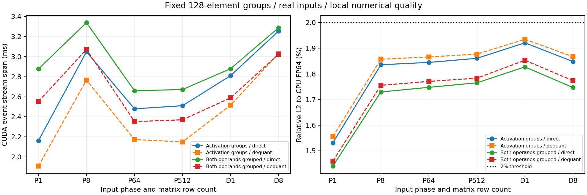

# 4-2：真实激活下的128元素分组缩放（部分交付）

固定此前真实专家矩阵与实际输入，预先设置两个分组变体：仅激活沿K维每128元素一个scale；激活和权重都沿K维128分组，权重在组内逐列scale。两变体均比较INT8部分矩阵直算/合并与反量化后一次BF16矩阵乘，沿用原2%局部误差门槛。

仅分组激活的CPU FP64相对误差为1.53%–1.93%，同时分组权重后为1.44%–1.85%，全部通过本组门槛。相比此前逐行激活误差2.32%–3.45%，本组只细化激活scale已足够；但两个新变体的分块直算均比反量化路径更慢。通过数值门槛不等于实现速度收益。

## 结果

完整路径CUDA event stream span中位，单位毫秒；包含提交间隙、量化/拆分/填充/合并及分配开销，不是纯kernel活跃时间。每条件9轮、每样本10次调用。

|分组对象|输入 / M|INT8直算 ms|反量化BF16 ms|INT8误差 %|反量化误差 %|
|---|---|---:|---:|---:|---:|
|激活|prefill / 1|2.1630|1.9087|1.5311|1.5554|
|激活|prefill / 8|3.0483|2.7664|1.8357|1.8572|
|激活|prefill / 64|2.4796|2.1741|1.8447|1.8660|
|激活|prefill / 512|2.5110|2.1499|1.8607|1.8771|
|激活|decode / 1|2.8101|2.5165|1.9211|1.9349|
|激活|decode / 8|3.2543|3.0302|1.8480|1.8668|
|激活+权重|prefill / 1|2.8768|2.5531|1.4401|1.4597|
|激活+权重|prefill / 8|3.3387|3.0716|1.7296|1.7554|
|激活+权重|prefill / 64|2.6599|2.3526|1.7475|1.7706|
|激活+权重|prefill / 512|2.6721|2.3706|1.7652|1.7834|
|激活+权重|decode / 1|2.8795|2.5893|1.8273|1.8530|
|激活+权重|decode / 8|3.2872|3.0237|1.7467|1.7738|



12条件×4阶段×9轮=432条正式样本，另有12份Torch CPU/CUDA原始trace。每变体六个形状的trace分别含199/232/200/199/199/232个kernel事件；插桩运行不并入性能样本。四阶段为两条完整路径、激活量化和权重展开，不把阶段中位相加代替整条路径。全部样本和范围保留，未选择更快的一轮。PNG已目视检查，SVG/PDF同存。

## 实际输入与固定矩阵

expert.pt和prefill-pool.pt直接复用上一轮封存原件，没有新增模型生成。专家来自Qwen3-VL-30B-A3B FP8快照d9748a51ae66354c4dad665aab2c71f26cf2c8cd的layer0/expert0，完整矩阵2048×1536；源快照已是FP8，参考为它的FP32展开值，不是量化前BF16。

Prefill取原n512-r0实际路由输入池前1/8/64/512行；这些行来自prefill阶段，小M是相同池的形状扫描。source/另外保留37份真实单token调用且专家0被选中的输入原件与来源SHA。按原件顺序取前1/8行做decode矩阵测试；M1使用真实decode向量，M8是若干顺序decode向量的矩阵组批，不是8个并发模型请求实测。CPU审计逐条件验证输入与来源完全一致。

RTX PRO6000 / Torch2.11.0+cu130，共享GPU。没有重新运行完整模型，也没有修改服务或模型权重部署。

## 哪些开销增加了

K=2048被分成16组。直算对每组调用实际torch._int_mm，得到INT32部分结果，转换、乘激活及权重scale后累加到FP32输出。M1/8仍填充到32行。每组整数矩阵对FP64整数参考逐元素精确，CPU独立审计还检查直算输出与相同反量化操作数的FP64乘积一致。

反量化路径同样量化激活，再重建完整BF16输入和权重，最后一次BF16矩阵乘。它每次支付展开成本，不冒称最佳常驻BF16部署。此实现使用多个PyTorch调用，未融合分组量化/部分结果/合并，因此结果只说明这两条已执行路径，不能代表最优INT8内核的上限。

激活scale从逐行一个增加为每行16个，实际容量每行64 bytes，未包含工作区。仅分组激活时16组共享同一权重列scale，GPU唯一底层存储6,144 bytes；同时分组权重时是16组独立列scale，共98,304 bytes。raw.json另有引用列表的逻辑字节和唯一存储字节，不能把同一scale的16次引用重复当作实际占用。分块权重INT8数据总量未因增加scale而减少；数值精度改善也没有消除转换、填充、16次矩阵提交与合并。

本组最大误差仍接近2%，只证明这些固定输入和矩阵的局部检查通过，不保证更多输入、完整SwiGLU或模型生成质量。原先逐行方案的负结果仍保留，不用新方案覆盖旧结果；本实验没有计算能耗、账单或厂商峰值兑现率，calculations未动。

## 独立复现与验收

目录包含所需实际输入和专家数据，无需完整模型或相邻实验目录。在新复制件中移除results/与run/（封存原件保持不变）：

```sh
python reproduce.py
python plot.py
```

复现需要上述CUDA Torch环境。run.py执行预定12条件，reproduce.py调用仅管理自身进程的监护器，再分析并进行CPU审计。

```sh
python verify.py
python audit.py
```

verify.py校验文件哈希、正常终态和所有计时/trace覆盖；audit.py需要Torch，在CPU上核对输入来源、原矩阵FP64参考、INT8直算的数学结果和固定误差门槛。正式监护器exit0、无遗留进程，运行约13.13秒。只保留正式成功运行的记录。

整体4-2仍部分完成：没有将这些INT8路径替换进完整模型，端到端任务质量、更多输入/专家及完整workspace评估仍待。
