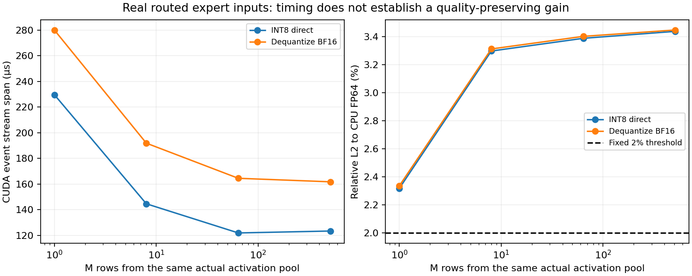

# 4-2：实际路由到专家的激活（部分交付）

从四次真实MoE生成捕获3,257行路由到第一层第0专家的BF16输入。插桩后四个答案及全部48层路由均与原记录一致，实际运行权重也与上一变体的checkpoint矩阵逐字节匹配。

将这些真实输入用于相同INT8直算/逐次反量化路径后，四个形状均未通过原定2%相对L2门槛。独立CPU FP64参考给出约2.32%–3.45%误差；上一变体随机激活的约1.26%不能推广到真实激活。执行成功与数值质量未达标分开记录，全部负结果保留。

## 采集依据

Qwen3-VL-30B-A3B-Instruct-FP8快照d9748a51ae66354c4dad665aab2c71f26cf2c8cd，vLLM0.23.0 / Torch2.11.0+cu130，RTX PRO6000。四份既有检索题不变，文本输入7,235 token，正常输出46 token；最后输出token没有再次进入模型，路由记录各7,280行。

|请求|第一层实际调用数|真实输入token行|路由到专家0的行|
|---|---:|---:|---:|
|n512-r0|49|7,280|801|
|n512-r1|49|7,280|793|
|n512-r2|49|7,280|816|
|n512-r3|49|7,280|847|

capture_probe.py只在第一层MoE模块执行时记录输入，并从原生TritonExperts.apply获取实际topk_ids。保存全部调用的路由ID、选中token位置及对应BF16行；只复制实际送往专家0的行，路由权重并未预先乘到输入，记录并核对apply_router_weight_on_input=False。原生expert执行入口的准备后激活为FP8，采集点则在量化前。没有替换权重、路由或返回值。

audit_capture.py逐调用核对选择位置，将196次top-k连接后与完整原生路由的第一层逐项比较。四个完整输出token序列及全部48层路由也与reference/原先成功记录完全一致。运行中expert0的FP8矩阵和scale保存于runtime-expert.pt；转置后与reference-expert.pt中的原checkpoint字节和scale一致。

本次KV预算2GiB，旧参考为4GiB；单序列、2048分块、关闭前缀缓存/图/异步调度。模型实际加载29.28GiB，2GiB KV报告容量21,840 token；未终止既有服务。不同预算与插桩开销下的时序不作纯性能对比。

## 矩阵重放与质量门槛

activation-pool.pt按原调用/token顺序保存n512-r0的801行真实BF16输入，重放取前M行，M为1/8/64/512，转为FP32时数值不变。它是同一实际激活池的batch形状扫描；前M行主要来自prefill，M1不是独立采集的decode任务，不把它称真实decode性能。

仍使用同一2048×1536专家矩阵、逐列INT8权重scale及逐行INT8激活scale。两路径共享这些量化值，INT8直算的M1/8填充到32行，反量化路径每次将权重展开为BF16。216条正式计时及四份实际Torch trace完整保留；独立CPU FP64审计还检查每个输入确实等于激活池前M行、权重完全相同。

计时描述这两个已执行的算子路径，但在2%质量门槛下均不是合格的等质量优化。未据此宣称特定量化方案一般失效，也未确定误差究竟来自哪些离群值或权重/激活部分。原生模型的四个正确答案仅验证只读采集未改变这组输出，不代表把INT8路径替换进模型后仍能正确。

|M|INT8完整路径 µs|反量化BF16完整路径 µs|INT8相对L2 %|反量化相对L2 %|
|---|---:|---:|---:|---:|
|1|229.653|280.067|2.3183|2.3364|
|8|144.605|191.856|3.2978|3.3127|
|64|121.878|164.477|3.3886|3.4026|
|512|123.373|161.731|3.4382|3.4480|



## 独立复现与验收

本目录包括四题原始参考、实际激活、运行权重、矩阵参考和全部代码，无相邻实验代码依赖。使用上述vLLM/Torch环境及完整模型快照，在新复制件中移除results/、run/、matrix-results/、matrix-run/、activation-pool.pt后执行；封存原件保持不变：

```sh
python reproduce.py --model /absolute/path/to/the/fixed/snapshot
python plot.py
```

只重放已捕获输入时，无需完整模型：

```sh
python run_matrix.py --output a-fresh-output-directory
python analyze_matrix.py --output a-fresh-output-directory
```

```sh
python verify.py
python audit_capture.py
python verify_matrix.py
```

verify.py核对文件哈希、两次进程终态及完整计时记录；后两项需要Torch/NumPy，在CPU上重新核对路由、实际权重、激活来源与FP64数值参考。监护器按PID出生信息、session和环境标记只管理本次进程。模型采集与算子重放首次均正常结束，无失败启动批次；传输中断后只续传同一原件，未重启计算。

PNG已目视检查，SVG/PDF同存。真实decode单独采样、满足质量门槛的量化方案、模型内替换后的完整任务质量及工作区仍待，整体4-2不因增加真实输入而自动标完成；calculations未动。
