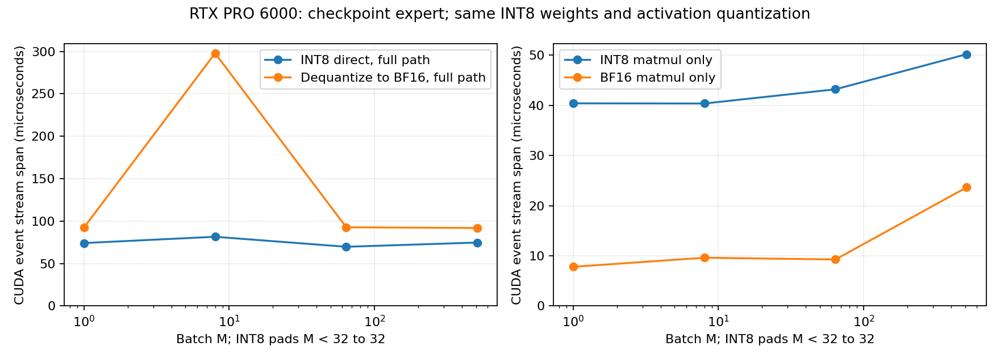

# 4-2：训练专家矩阵的低精度路径（部分交付）

固定已有Qwen3-VL-30B-A3B FP8快照第一层第0专家完整gate_up_proj矩阵[2048,1536]，比较INT8直算与每次反量化到BF16后计算。四形状216条正式计时完成；两路径对CPU FP64参考的最大相对L2约1.2612%，通过预先固定2%局部门槛。激活仍为固定随机输入，不代表完整模型质量。

## 实测

CUDA event stream span中位，单位微秒；每条样本20次调用，9轮。采样前同步、预热分配器；该时间含stream上的提交间隙，不是纯kernel活跃时间。

|batch|INT8完整路径|反量化BF16完整路径|INT8矩阵本体|BF16矩阵本体|
|---|---:|---:|---:|---:|
|1|74.130|92.330|40.405|7.805|
|8|81.528|297.885|40.370|9.613|
|64|69.744|92.717|43.203|9.264|
|512|74.741|91.899|50.205|23.648|



四档INT8完整路径中位较低，但INT8矩阵调用本体都更慢。反量化路径每调用一次就展开权重，预先常驻BF16的矩阵本体不付这部分成本；两者不能当作相同部署范围。M8反量化完整路径出现较高中位，全部9轮与min/max保留，不删除较慢记录，也不将它解释为稳定硬件规律。独立阶段中位不相加代替完整路径。

6阶段包括两条完整路径、激活量化/填充、权重展开及两个矩阵本体；4形状×6阶段×9轮=216样本。四份另外采集的Torch CPU/CUDA原始trace分别30/31/29/28个kernel事件，未并入性能样本；不凭算子名字推断具体tensor-core类型或DRAM流量。PNG已目视检查，SVG/PDF同存。

## 真实权重、数值与初始成本

来源快照d9748a51ae66354c4dad665aab2c71f26cf2c8cd，键model.language_model.layers.0.mlp.experts.gate_up_proj的expert0；原FP8矩阵[2048,1536]和FP32 scale[16,12]均保存在expert.pt，每块128×128。provenance.json记录源配置/index哈希、矩阵/scale/展开值/INT8权重的逐张量SHA与快照路径。源码快照本身已经是FP8，因此参考为其FP32展开值，不是量化前BF16权重，不能据此测第一次FP8量化造成的损失。

prepare.py对FP32展开权重做逐列对称INT8量化；两路径共享相同INT8权重与scale。GPU激活逐行量化，M1/8填充到32行；INT8结果先INT32累加再scale，另一条将相同量化数据展开到BF16后乘法，因此另有BF16舍入。两条均保存输入、参考、输出和误差。整数结果对同一整数输入的FP64参考逐元素精确，覆盖填充行；性能计时在每形状数值检查之后开始。低于2%才标局部数值通过，失败会保留数值结果而不挑选通过样本。

独立CPU审计重构192个FP8块、核对每形状使用相同权重，再用CPU FP64矩阵乘检查GPU参考与两输出，详见tensor-audit.json。最大相对误差约1.2612%，不是端到端任务成功率。未测真实路由激活、完整SwiGLU或模型生成。

初始CPU列scale/再量化/限幅/INT8 cast一次实测22.021毫秒，四CPU线程，排除源文件读取与FP8解码。量化权重3,145,728 bytes与scale6,144 bytes由pageable CPU传入CUDA，墙钟0.532毫秒、CUDA事件0.498毫秒；参考FP32矩阵的传输另行执行并排除。此为一次初始化观测，不把它当稳态带宽或每次矩阵调用开销。

GPU BF16展开权重6,291,456 bytes；M1/8的填充INT8输入65,536 bytes、INT32输出196,608 bytes，scale另计。这里报告实际数组容量，不是DRAM计数。程序同时保留各表示和参考供验证，不代表最小部署容量或完整workspace峰值；共享GPU其他服务未终止。

序列化曾让一个专家切片携带未使用的底层存储。交付前只对张量做clone并重新保存，expert.pt由418,488,718缩为18,884,134 bytes；所有张量SHA完全不变。原执行文件SHA、最终文件SHA及原因在provenance.json，未重跑计时或改数值。prepare.py现提前clone切片避免重复携带大存储。此变化不修改历史RSS轨迹，也不把它解读成原运行已使用最小主机内存。

## 独立复现与验收

Torch2.11.0+cu130 / RTX PRO6000，已有INT8接口兼容性验证。交付的expert.pt已包含本次矩阵，无需完整模型或相邻实验目录。在新复制件中移除results/和run/（封存原件不动），执行：

```sh
python reproduce.py
python plot.py
```

如需从原快照重新提取，在单独复制件中移除expert.pt与provenance.json，再执行：

```sh
python prepare.py --snapshot /absolute/path/to/the/fixed/snapshot
```

```sh
python verify.py
python verify_tensors.py
```

verify.py检查封存、进程终态与全部计时/质量/trace覆盖；verify_tensors.py需要Torch与NumPy，在CPU上重做原始张量/块表示/FP64数值审计。监护器仅管理自身进程，正式运行exit0、无遗留进程，没有启动失败批次。新变体不是对旧随机矩阵结果的同形状速度复测，整体4-2仍partial；完整模型质量、真实激活与工作区等缺口仍保留，calculations未动。
