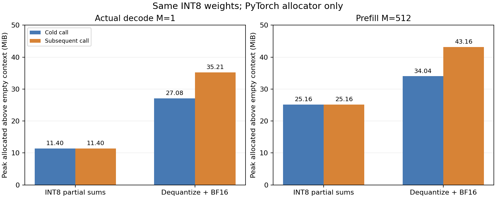

# 4-2：真实专家两条路径的分配器工作区

同一份 INT8 权重不意味着相同的执行显存峰值。本次在 RTX PRO 6000 Blackwell 上，分别用独立 CUDA 进程测量 INT8 分块直算和逐次反量化 BF16 路径。覆盖真实 decode 向量 M=1 与实际 prefill 激活 M=512；均使用第0层专家0的完整 K2048×N1536 矩阵和128元素激活分组。

表中单位均为 MiB（2²⁰ bytes）。总峰值是相对创建输入与权重之前的空分配器基线的 `max_memory_allocated` 增量，包含输入、权重、scale、保留分配、临时张量及输出。

| 输入／路径 | 初始常驻 | 首次总峰值 | 后续总峰值 | 后续调用新增峰值 |
|---|---:|---:|---:|---:|
| decode M1／INT8直算 | 3.014 | 11.401 | 11.401 | 0.262 |
| decode M1／反量化BF16 | 3.014 | 27.081 | 35.206 | 24.067 |
| prefill M512／INT8直算 | 7.006 | 25.162 | 25.162 | 10.031 |
| prefill M512／反量化BF16 | 7.006 | 34.037 | 43.162 | 28.031 |

每条件一次首次调用、三次后续调用，四次输出逐元素相同；三次后续峰值各自相同，不从中选择最小值。调用后两条路径都比初始常驻多保留 **8.125 MiB** 的分配。后续新增峰值从该次调用开始时的 allocated 计算，不能与初始常驻直接相加。反量化路径后续总峰值高于首次；仅测第一次会低估本实现的后续峰值。



## 测量范围

初始常驻只包含 FP32 输入、3,145,728 bytes INT8 权重和6,144 bytes FP32逐列scale；decode输入8,192 bytes，prefill输入4,194,304 bytes。权重16个分块为同一存储的视图，不重复保存FP8／FP32参考或常驻BF16权重到GPU。原始矩阵、输入和输出审计保存在CPU。

计算表达式与 [block-scales 的 activation 路径](../block-scales/README.md)相同：直算产生16组INT32部分结果，转FP32乘scale并合并；另一条将相同激活和权重量化值逐组展开、拼接为BF16后矩阵乘。M1直算填充到32行。这是两段具体PyTorch实现的空间测量，不是所有融合内核的空间下界，也不是整模型最低显存需求。

记录 `allocated` 与 `reserved`，不混为一谈。每次有分配器原始快照，独立检查快照活动块总和与当时allocated一致，segment总和与reserved一致。保留分配暂不归因到某个库内核；快照没有证明的来源不推断。PyTorch之外的驱动上下文、外部分配不在该峰值范围，整卡 `nvidia-smi` 还包含其他服务，未用于路径内存比较。未终止其他服务。

CPU FP64重新比较原始专家矩阵：decode直算／反量化误差1.9211%／1.9349%，prefill为1.8607%／1.8771%，均低于原固定2%门槛。本轮不重新测速度，也不增加模型质量结论。模型答案验证见 [model-intervention](../model-intervention/README.md)。

## 证据与复现

- `measure.py`：每个条件独立CUDA进程，四次调用，按各次起点重置峰值；输入输出释放后另记保留量。
- `results/*/measurement.json`、`output.pt`、四份`*-snapshot.pickle`：实际测量、数值与原始分配记录。pickle为本实验自生成，分析程序只读这些封存文件。
- `provenance.json`：复用训练专家、实际prefill和decode源文件的SHA；没有重复运行原模型采集。
- `analyze.py`：CPU数值和快照检查；`analysis.json`为汇总；`plot.py`生成PNG/SVG/PDF。
- `run/supervisor.json`：最终正常退出、无资源终止和残留；只保留最终成功测量批次。探测时错误假定调用后回到初始常驻的断言已修正，未完成记录已清理。

在相同Torch2.11.0+cu130环境的独立副本中，先移走封存的`run/`、`results/`和`analysis.json`，再执行：

```sh
python reproduce.py
python plot.py
```

输出目录存在则拒绝覆盖。`python verify.py`核对交付的原封存，重新执行产生的原始文件不要求与旧manifest字节相同。更多专家及任务、完整部署的显存与质量仍待补齐。
