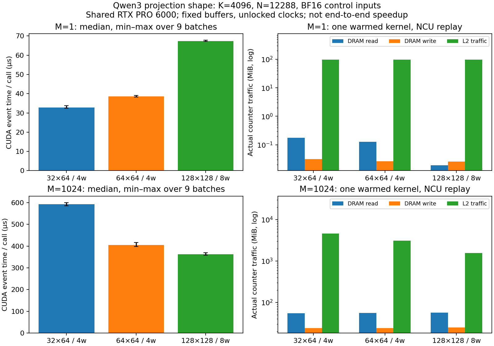

# 5-1：Qwen3投影形状的GPU分块与实际流量

同一K4096/N12288 BF16投影，M=1时本组最快候选是32×64，M=1024时是128×128。M=1024的64×64与128×128块实际L2流量约3096/1560MiB，显存读仅约56MiB；不能把L2重读全部记成显存访问。RTX使用GDDR，以下DRAM计数不称为HBM实测。

| M | 输出块／warps | CUDA事件中位µs | DRAM读MiB | DRAM写MiB | L2流量MiB | 实际活跃warp比例 |
|---:|---|---:|---:|---:|---:|---:|
|1|32×64／4|32.74|0.176|0.031|97.883|8.51%|
|1|64×64／4|38.52|0.128|0.027|97.901|8.52%|
|1|128×128／8|67.24|0.019|0.026|97.086|16.67%|
|1024|32×64／4|593.32|54.488|23.780|4632.392|70.49%|
|1024|64×64／4|405.91|55.969|24.136|3096.386|46.19%|
|1024|128×128／8|363.11|56.406|24.726|1560.378|31.93%|



时间来自未profile测量，硬件流量与活跃warp来自另一次NCU采集，不能把它们当同一次调用。每点9个批次，每批20次launch；顺序逐轮固定种子打乱，图误差线是最小/最大，不是置信区间。54个原始批次、六个原生NCU报告与CSV全部保存；每个报告仅一个目标kernel、一次replay pass。没有将计数乘层数或套成端到端收益。

## 数值与原件

输入为CPU固定种子501随机数转BF16，不是训练权重；所有候选读取每形状同一A/B。输出BF16、内部FP32累加。六份完整输出与GPU FP64参考比较，再由Mac CPU从封存输入独立重建完整FP64 GEMM。两种参考满足rtol1e-10/atol1e-9；所有候选满足执行前[协议](PROTOCOL.md)的相对L2<0.5%、逐元素abs误差≤0.05+0.01×abs(reference)。M1/M1024相对L2为0.164854%/0.166226%，同形状三种分块的BF16输出逐元素相同。这是算子数值检查，不是模型任务质量。

results保存两组完整input/ref及六output张量、54时间批次、六组TTIR/TTGIR/PTX/cubin。analyze.py使用CPU Torch重新计算全部矩阵，不依赖NumPy、GPU或相邻目录。原始运行Torch2.11.0+cu130，实际Triton版本及驱动在results/raw.json，NCU2026.2.1版本在counters/collection.json。独立Mac复核用Torch2.14；缺少NumPy的初始化警告不影响该纯Torch路径。

## 为什么不能只看占用率

编译器报告的动态shared memory依次为6/8/16KiB；原生launch另有1KiB driver开销，总7/9/17KiB。寄存器每线程54/80/118，实际分配56/80/120，三组均无spill。NCU给出的寄存器约束驻留block上限为9/6/2，shared memory约束为14/11/5；它们分别只是一种资源的上限，不是实际同时驻留数。

M1024中较大块降低L2访问和本次时间，即便实测活跃warp比例下降；占用率单项不足以判断速度。M1的许多tile行被掩掉，三组grid分别192/192/96block，增大BM不能增加有效输出行。这些变化与观测一致，但没有隔离改变每个参数，不能作单因素因果结论：128×128组同时使用8warps，其余4warps。

所有BK32、num_stages2，未搜索最优配置。固定缓冲预热后测量、不清缓存、不锁频，GPU有其他服务；尤其M1 DRAM读远小于权重大小，说明本采样条件不能当冷启动读权重成本。M1024仍有缓存复用，DRAM写也受写回边界影响，不能要求计数逐项等于张量逻辑字节。实验中的实际编译分配也不等于教学算法的全活动张量预算。

## 独立复现

在具有Torch/Triton与受支持CUDA GPU的新副本中执行；本次使用RTX PRO6000 Blackwell及现有vLLM0.23环境内Torch，模型无需下载。已存在results、runs或counters时应换新目录，脚本拒绝覆盖封存结果。

```sh
python resource_guard.py --out runs/measurement -- python run.py
python collect.py --ncu /path/to/ncu --sudo
python analyze.py
python plot.py  # 需要Matplotlib；生成PNG/SVG/PDF
```

Linux guard只跟踪自身会话/PID出生时间，时间与资源上限见代码和各launch.json；本次七个guard全部exit0、无残留/资源终止，未停止其他服务。--sudo使用已有计数器权限；如用户已有权限可去掉该选项。NCU使用kernel replay、cache-control none、clock-control none，只在五次预热后的目标kernel打开采样。

校验封存：`python verify.py`检查SHA；`python analyze.py --check`使用CPU Torch重建参考并核对分析。本轮没有失败实验批次。容量与逻辑访问枚举仍由calculations负责；bank布局实测、RMSNorm拆分归约及全书最终跨session审计仍待。
