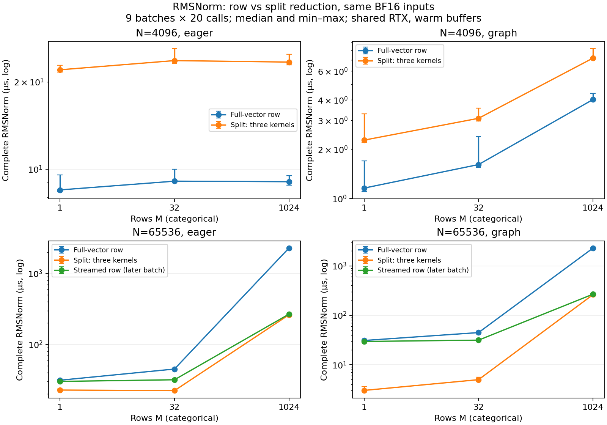

# 5-1：RMSNorm整行与拆分归约

4096列时，所测整行融合路径更快；65536列时，整行向量路径发生寄存器溢出，拆分明显更快。追加仍一CTA一行的分段读取控制后，1024行宽矩阵的巨大差距消失，不能把原差距全部归于跨CTA并行。

15份完整输出均通过执行前误差界。同一路径重复5次、不同batch的共同前缀行逐位一致；不同归约路径却可能有少量BF16元素不同。误差容限通过不等于逐位相同。

| N | M | 整行向量 graph µs | 拆分三阶段 graph µs | 分段整行 graph µs（后续批次） | 拆分scratch字节 |
|---:|---:|---:|---:|---:|---:|
|4096|1|1.158|2.274|未测|20|
|4096|32|1.613|3.090|未测|640|
|4096|1024|4.024|7.205|未测|20480|
|65536|1|30.894|3.022|29.546|260|
|65536|32|44.666|4.986|31.392|8320|
|65536|1024|2286.018|261.669|266.990|266240|



表为CUDA Graph重放内20次完整调用的事件时间除20，每点九批中位数。图同时给eager事件时间及最小/最大线；事件包含设备等待后续提交的空隙，不等于纯kernel时间。首轮两方法×两模式逐轮随机顺序；分段控制在观察后另测，不能将261.669/266.990µs的小差异解释为稳定胜负。两组GPU运行共享环境、固定缓冲、未锁频，未做冷缓存或端到端模型测量。

## 实际实现、额外阶段与预测修正

- 整行向量：一个CTA对应一行，8warps，完整行向量平方和归约及加权输出在一个kernel。
- 拆分：每1024列一个CTA计算FP32部分和；每行一个CTA第二次归约得到逆RMS；再由每1024列一个CTA写输出。三个kernel均4warps；显式scratch为FP32部分和及每行逆RMS。完整三阶段计时，未遗漏第二次归约。
- 分段整行：一个CTA对应一行、4warps，循环读取64个1024列段求和，再循环64段归一化，单kernel、无全局scratch。此控制同时改变warps和局部值寿命，不作为只改变一个参数的因果试验。

原[协议](PROTOCOL.md)在运行前倾向M1024沿行分配、M1/N65536沿列尝试；M1024/N65536的整行向量实测反驳了只按行数选择该实现的判断。其编译器n_spills字段为798，分段整行和拆分均为0；字段按原值保留，不将798解释为设备流量或某种字节单位。65536列的整行向量每线程40寄存器，分段整行28；4096列整行39寄存器、无spill。完整TTIR/TTGIR/PTX/cubin保留，可查实际编译路径。

[观察后控制协议](FOLLOWUP.md)明确记录追加动机。M1024/N65536分段整行使时间从约2286µs降至267µs，因此原巨大差距有宽行实现自身的问题；M1/N65536分段整行仍约29.5µs，而拆分约3.0µs，说明去掉溢出也没有自动消除该低行数条件的差距。不同批次、参数与固定编译器限制了因果解释；没有宣称框架最优RMSNorm或通用选择阈值。

九份原生Torch CUDA trace核对通过：首轮每形状实际四kernel，依次row_norm/partial/final_reduce/apply_norm；追加每形状一个streamed_row。grid为[M,1,1]与[M,N/1024,1]，最终归约仍[M,1,1]；真实trace中的阶段时间和完整调用时间分别保留，不能用增加CTA数代替实际并发占用率。

## 数值证据

种子50151，CPU生成BF16输入和权重，epsilon1e-6，GPU FP32平方和及归约，输出BF16。每个N只生成最大M1024，小batch取同一输入前缀；追加控制读取原件并核验文件SHA。随机控制数据不是训练质量题集。

全部15份输出相对FP64参考L2误差约0.1614%–0.1685%，满足预设<0.5%；逐元素abs差≤0.01+0.01×abs(reference)也全部通过。Mac CPU从原始输入独立重建全矩阵RMSNorm，逐项核对GPU计算保存的误差字段。输入及全部输出张量保留，参考可由纯CPU Torch再生成，不需NumPy或GPU。

整行向量与拆分的不同元素数（按M1/32/1024）：N4096为0/0/10；N65536为0/28/1529。追加分段整行与拆分为0/20/554。它们是合法误差范围内的归约路径差异，原样保留；不把它们当运行失败清理。每方法5次重复均精确相同；M1→M32比较首行、M32→M1024比较前32行，均精确相同，不推广为任意batch或跨设备逐位保证。

## 原件与独立复现

run.py为首轮，streamed.py为观察后控制；results和streamed目录保存对应原始数据、编译产物及trace，runs保存真实进程与资源退出。首轮216批、追加54批，每批20调用，共5400次计时调用，预热/编译/数值/trace调用另计。两个guard均exit0（4.333/2.188s），无残留/资源终止；没有失败批次，未停止原服务。

RTX PRO6000 Blackwell、Torch2.11.0+cu130、Triton3.6.0；Mac CPU复核Torch2.14。新副本在兼容CUDA/Torch/Triton环境中运行，输出目录已存在则拒绝覆盖；无需模型、相邻实验或calculations：

```sh
python resource_guard.py --out runs/measurement -- python run.py
python resource_guard.py --out runs/streamed -- python streamed.py
python analyze.py
python plot.py  # 需要Matplotlib，生成PNG/SVG/PDF
```

校验原封存：`python verify.py`核验SHA；`python analyze.py --check`使用CPU Torch重建完整数值并审阅270批时间和九份实际trace。本目录独立复现会按依赖顺序先生成自己的输入，streamed.py不依赖其他实验。Linux guard只管理自身会话并核验PID出生时间，限额见各launch.json。

本轮补齐固定两行宽/三行数的归约路径实测；bank布局/padding与跨kernel并发仍待，逻辑访问/容量枚举继续由calculations负责，全书最终跨session论文审计尚未开始。
