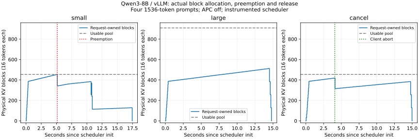

# 8-3：真实 KV 块、抢占与取消（部分交付）

Qwen3-8B / vLLM 0.23.0 的四个并发请求，在1 GiB KV空间下实际发生一次抢占；改为2 GiB后没有抢占。在1 GiB条件下主动取消一个请求，实际释放104个块，其余请求完成且没有抢占。三组结束后，全部请求拥有的块均归还。

本实验保存实际块编号与引用数，不实现另一份教学分配器；容量、分页与共享的手算继续归现有C43任务。

## 条件与结果

RTX PRO 6000 Blackwell Workstation，Qwen3-8B BF16（revision b968826d9c46dd6066d109eabc6255188de91218），Torch 2.11.0+cu130。四条1536-token合成说明文本，首token不同，强制512输出；APC关闭、eager、最大4序列、分块预算512、最大长度2048、关闭异步调度，原生采样。每组新引擎、一次执行，无请求预热；设备还有其他服务。

|条件|池总块数|保留块|请求占用峰值|实际抢占|实际调度token位置|输出token|
|---|---:|---:|---:|---:|---:|---:|
|small：1 GiB|455|1|454|1|9,993|4×512|
|large：2 GiB|910|1|512|0|8,188|4×512|
|cancel：1 GiB，取消r3|455|1|419|0|7,805|3×512＋128|

每块16 token，总块数和空闲块数均从引擎读取。固定保留的null block不属于请求；逐快照检查“空闲＋请求拥有＋保留＝池总数”，并核对无重复块及引用数。APC关闭时这套关系成立，不能原样推广到缓存空闲块仍保留内容的情况。



small中r3生成270个token后进入PREEMPTED，输出历史保留，num_computed_tokens重置为0、持有块变为空。它随后恢复并完成。与large相比，原调度器累计多调度1,805个token位置，这是实际重复执行的调度量，不能称为模型额外输出。两组最终输出序列完全一致。

cancel中客户端观测到r3的128个输出后调用abort；调用约1.55毫秒返回，自调用起约31.41毫秒才观测到调度器完成释放。该处理将空闲块从35增至139，并移除r3；后续出现同一ID的第二次结束处理，空闲块保持139。日志全部保留，分析检查重复结束没有再次释放。其余三条输出与large一致。API返回不等于KV已经回收，也不说明所有在途执行立即停止。

三组请求墙钟跨度分别17.428、14.758、14.952秒，仅作为带观察器的一次状态轨迹。逐步同步JSON写入会影响执行时间，不能将这些差距解释为无观察开销的稳定加速比。取消组完成的工作量更少，也不能直接与完整四请求排名。输入是固定长度夹具，不作自然任务质量声明。

## 观察与验证

[observer.py](observer.py)通过scheduler_cls加载为原Scheduler的子类：schedule、update_from_output和finish_requests均调用父类，保持返回结果，仅在边界读取并记录状态。get_blocks使用原coordinator的只读查询，原环境安装未修改。快照在主机调度边界观察分配和释放，不是逐字节显存访问或CUDA计算完成事件。

[run.py](run.py)为独立入口；需要已安装的vLLM 0.23.0与本地模型文件，三个输出目录必须事先不存在：

```bash
python run.py --model /path/to/Qwen3-8B --output results/small
python run.py --model /path/to/Qwen3-8B --output results/large --kv-gib 2
python run.py --model /path/to/Qwen3-8B --output results/cancel --cancel
python verify.py
python plot.py
```

三组blocks.jsonl共3,627条快照；requests.jsonl保存全部输出与交付事件，actions.jsonl保存调用时刻。环境记录源码与输入哈希，安装版本的相关原始模块另存[native-source-manifest.json](results/native-source-manifest.json)。[analyze.py](analyze.py)检查块守恒、引用和唯一性、抢占状态、取消后的移除、最终全部归还、配置及输入一致性，并报告输出比较。[原始清单](results/raw-manifest.json)由[verify.py](verify.py)核验；[汇总与时间线](results/summary.json)可重新生成，图已目视检查。

## 未完成范围

本轮只完成真实全注意力引擎的块分配、抢占、重算与取消对照。写时复制和多adapter的槽位、KV身份、加载与每租户尾延迟仍待测；不以本实验代替这些变体，也不以单模型实测覆盖235B容量计算。第一轮实验全部结束后，继续按用户要求统一对照另一session的增补和论文比较。

## 原生四分支共享补测

[实际块ID与引用计数](branch-sharing/README.md)完成预热前缀上的原生n=4采样：四分支共享95块、各有9个私有尾块时，416次块表引用对应131个唯一块。783快照逐项守恒及引用核对通过，完成后454/455块为空闲、另1保留。六输出实际相同，不当语义分叉或COW证明；多adapter仍待。

## 未预热分支补测

[新引擎直接四分支](cold-branches/README.md)同样形成95共享块，唯一块峰仍131；第一个分支先完成1536token输入调度，其他三个各补16个位置。四分支累计调度2092位置，原预热为572，输出逐分支相同。525快照与原件对照通过，不能用相同块占用推断相同执行工作量。

## 双adapter身份与槽位补测

[非零LoRA控制](adapter-isolation/README.md)完成基础模型/A/B及切回八请求。三个身份首次均0命中，重复及切回1520；单GPU槽A→B→A，CPU保留两adapter注册。1055快照身份/引用/释放核对通过；输出本次均同，不当投影数值或微调质量证明，真实adapter质量与并发租户延迟仍待。

## 实际投影数值补测

[第0层QKV捕获](adapter-projection/README.md)补证两个adapter确实改变Q：各512行相同输入、运行时权重与原件相同，Q增量对CPU FP64误差1.3271%/1.4141%低于预设2%，未适配的K/V逐元素不变。RTX与Mac CPU独立重建一致；不据文本相同判断LoRA无效，也不推广为所有层或任务质量。

## 并发adapter槽位补测

[一槽／两槽原生对照](adapter-concurrency/README.md)完成24条正式请求：一个槽最多同时运行一种adapter、两条请求，另两条等待；两个槽允许两种adapter、四条请求同时运行。本组1214快照未发现不同adapter共同拥有KV块，12对输出逐token相同。固定顺序、小样本和同步观察不能支持生产尾延迟或稳定加速结论；训练adapter质量与实际COW仍待。
