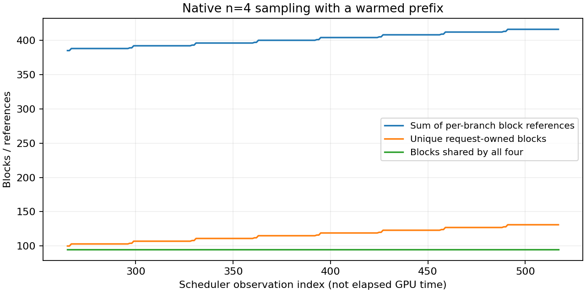

# 8-3：原生四分支的KV块共享

使用vLLM原生`n=4`生成接口，观察到四个独立分支共同引用95个已缓存前缀块，同时各自持有私有尾部。四份块表在最后一个共同存活快照中合计416次引用，实际只对应131个不同块：95个共享块与每分支9个私有块。不能把四份块表的长度直接当成实际块占用。



共783个调度边界快照，其中253个快照包含四个已分配分支。逐快照检查同一块的引用计数等于实际拥有者数量，并检查“空闲块＋唯一请求拥有块＋1个保留块＝池总块数”。原生池共有455块，每块16token；结束后所有请求移除，454块回到空闲队列，保留null块仍占1块。APC缓存内容可以继续留在空闲块中，“空闲”不等于物理清零或缓存内容消失。

## 运行与输出

一次最终成功批次包含三个调用：单序列primer预热、原生四序列生成、完成后单序列复用。使用同一1536token合成说明文本，每序列强制128输出，共六序列。三个调用报告的cached tokens分别0、1520、1520；四分支调用的该字段按返回父请求记录，不乘4冒充独立计数。

最终六条输出token实际相同，即使采样温度0.8、固定seed803；不为获得不同文本重跑。本轮证明独立分支对象的实际共享和私有分配，不证明自然任务质量、语义分叉或复制操作。没有观测写时复制指令／数据复制，故不称完成COW验证。也不将这条预热路径推广为未预热分支的共享策略。

固定Qwen3-8B BF16快照、RTX PRO6000Blackwell、vLLM0.23/Torch2.11cu130，KV1GiB、maxlen2048、maxseq4、chunk512、APC开启、eager、异步调度关闭。各项实际配置、源码SHA在results/environment.json。观察器继承原Scheduler，所有执行方法调用父类并原样返回，仅在边界读取原块表与refcount。同步写日志影响性能，本轮不报告速度收益。

## 独立复现与核验

```sh
python reproduce.py --model /path/to/frozen/Qwen3-8B/snapshot
python plot.py
```

在相同vLLM环境的独立副本中运行，须先移走封存run/results与analysis.json；输出已存在则拒绝覆盖，不依赖相邻实验或calculations。`analyze.py`只用标准库检查全部序列、引用计数、唯一拥有量、块守恒、私有尾部及最终释放。`verify.py`核对manifest并重跑分析，要求analysis逐字一致。

results/blocks.jsonl保存完整块ID/引用数、调度与完成事件；requests.jsonl保存每次交付事件和全部分支结果。流式接口按分支更新，驱动按index累计各分支最终结果，不能只读取最后一次回调。run/supervisor.json记录最终exit0/23.605s、无资源终止原因和无残留。

前两次未完成探测分别暴露原生接口限制（贪心要求n=1）与分支回调收集错误；确认进程退出后已清理，只保留最终受支持配置和完整成功批次。未修改原调度器安装或停止其他服务。

多adapter槽位、KV身份、实际COW、未预热分支和更广条件仍待，8-3保持部分交付；全书最终跨session审计尚未开始。
