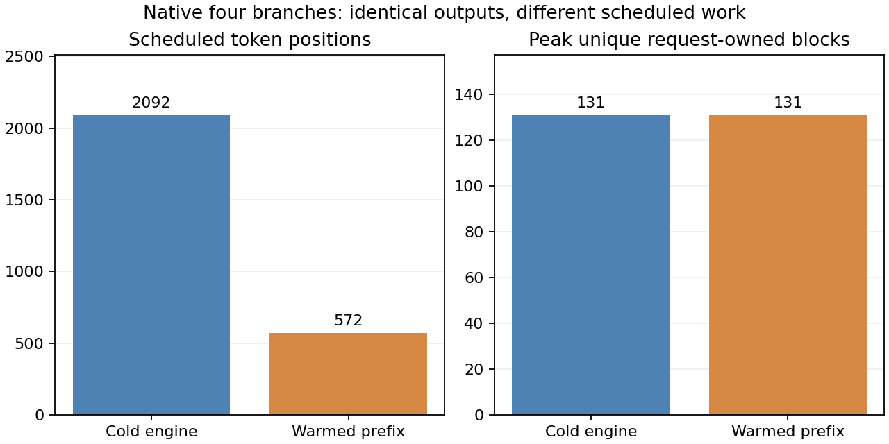

# 8-3：未预热四分支如何形成共享

新引擎直接提交原生n=4请求，仍形成95个四分支共同引用的前缀块。实际调度记录显示，先给第一个分支连续调度三个512token块段；随后其他三个分支各仅调度剩余16个输入token，并引用已形成的共享前缀。冷启动不意味着本次调用全过程都没有可共享内容。

| 同一四分支请求 | 新引擎无primer | 原预热参考 |
|---|---:|---:|
| 四分支共同引用的块数峰值 | 95 | 95 |
| 请求拥有的唯一块峰值 | 131 | 131 |
| 累计实际调度token位置 | 2092 | 572 |
| 对应四分支输出token相同 | 4/4 | 参考 |
| 完成后空闲块／池总块 | 454/455 | 454/455 |



调度量来自原Scheduler每次返回的num_scheduled_tokens，只统计四分支请求，不含primer或完成后复用。它不是输出token数、FLOPs或物理显存字节；不能将2092/572直接当作速度比。两边峰值块占用相同，并不代表执行工作量相同。

## 实际轨迹与边界

新批次525快照，原预热批次783快照。新引擎首快照没有请求、454空闲加1保留块。第1/3/5号快照只调度分支0各512token；第7号快照首次出现95共享块，调度分支0的1个位置及其他三分支各16个位置。computed字段位于调度边界，不能当GPU每个内核的完成时间。

逐快照重新核对所有块ID的拥有者、refcount与空闲/唯一拥有/保留守恒。最终所有请求消失，454块回到空闲队列；缓存内容可能保留在自由块中，不声称已清零。新批次共有四分支及完成后单序列复用，共五条128token序列，均完整收齐；四分支与预热参考按输出index逐token相同。合成强制长度，不代表自然任务质量、文本分叉或实际COW复制。

固定Qwen3-8B BF16、RTX PRO6000Blackwell、vLLM0.23/Torch2.11cu130；KV1GiB、APC开启、maxseq4/maxlen2048/chunk512、eager，temperature0.8/seed803。相对 [预热实验](../branch-sharing/README.md)只删去primer调用及对应完成计数。原始预热源码随包封存，分析器按文本替换核对这两个变化，配置和输入也精确匹配。原预热批次未重跑。

## 独立复现

```sh
python reproduce.py --model /path/to/frozen/Qwen3-8B/snapshot
python plot.py
```

使用独立副本并先移走封存run/results及analysis.json，输出目录存在则拒绝覆盖。本目录包含原预热参考、源码及SHA，无相邻实验或calculations执行依赖。

`results/blocks.jsonl`保存所有调度边界，`requests.jsonl`保存五序列与逐次交付；`analysis.json`同时列出冷／热首次共享现场和完整观察。`verify.py`核对封存并重跑独立分析，要求逐字相同。图提供PNG/SVG/PDF。

最终guard exit0/22.317s、无资源终止或残留；没有失败批次需清理，未停止其他服务。两条路径每条件一次且有观察开销，不做稳定性能排名。实际COW、多adapter和全书最终跨session复核仍待。
