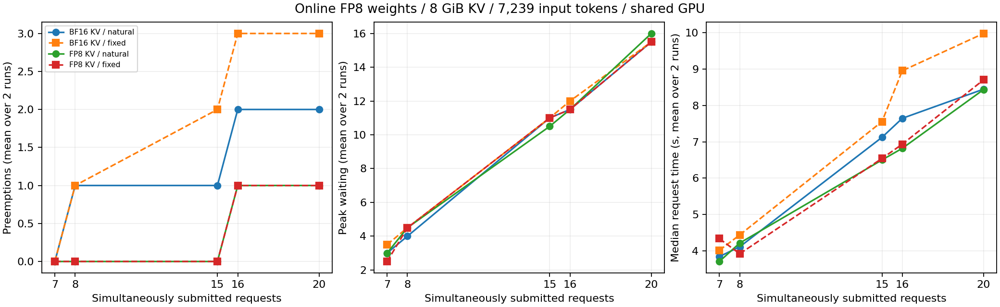

# 8-8：并发与缓存压力（部分交付）

两组首次运行均正常结束，共 538 次调用，包含 528 正式请求、8 预热和2校准。每组264正式请求中132为自然生成。BF16 / FP8 KV 的自然精确答案为98/132 /90/132；正式抢占为30/8次。四份文档反复提交，不是132个独立质量样本。

## 实测结果

|同时提交数|自然正确数（两轮合计）BF16 / FP8|每轮自然抢占 BF16 / FP8|每轮固定64输出抢占 BF16 / FP8|
|---|---|---|---|
|7|10/14 / 8/14|0,0 / 0,0|0,0 / 0,0|
|8|12/16 / 11/16|1,1 / 0,0|1,1 / 0,0|
|15|22/30 / 20/30|1,1 / 0,0|2,2 / 0,0|
|16|24/32 / 23/32|2,2 / 1,1|3,3 / 1,1|
|20|30/40 / 28/40|2,2 / 1,1|3,3 / 1,1|



在已测档位，BF16 KV 的7请求无抢占、8开始抢占；FP8 KV 的15请求无抢占、16开始抢占。两种输出模式和两轮均重现；这不是任意输入、任意生成长度或SLO下的最大服务容量。调度running峰值分别8与16，其中可含尚未完成prefill的请求；无抢占档位同样有等待队列。

两种格式的435项实际参数逐项一致；各格式校准scales在全程保持不变，并与此前1/4并发包中对应格式相同，已排除重新加载出不同权重。36层KV存储分别8,587,837,440与8,589,017,088 bytes，实际块数3,640与7,281。缓存格式对应的块取整已保留，不假定刚好两倍。

自然输出均46 token并正常结束，固定输出均64 token。BF16组两轮有9个固定输出序列不同；FP8组有17个不同，含2个自然回答。两格式264个同名正式请求有189个输出序列不同。逐题错误与两轮差异在summary.json中列明，没有通过选择某一轮掩盖不一致；本实验不足以确定具体数值误差来源。两种格式均未达到全部正确要求，不将容量收益当作已成立的等质量业务收益。

原始调度回调分别2,435与1,576条，抢占总数与逐批汇总完全一致。两组supervisor均exit_code=0、reason=null、leftovers={}，未终止其他服务。PNG已目视检查，SVG/PDF同时保存。


## 实验条件

固定 Qwen3-8B 快照 b968826d9c46dd6066d109eabc6255188de91218，在线 FP8 线性层权重；RTX PRO 6000，vLLM 0.23.0 / Torch 2.11.0+cu130。BF16 KV 与 FP8 E4M3 KV 都使用 8 GiB 预算，max_num_seqs=24，分块预算与最大长度 16,384。实际参数格式和逐参数 SHA256 在每组 kv-snapshots.json 中记录，不能仅凭配置称权重一致。

四份固定长文档各 512 行、7,239 输入 token，要求精确返回三个六位数值。每批按 r0/r1/r2/r3 循环填入 7、8、15、16、20 个请求，同时提交；格式间任务构成完全相同，但不同并发档的任务权重略有差别，不把正确率随并发的变化全归因执行。temperature=0，关闭 thinking、APC、异步调度与 CUDA Graph。该 Triton FP8 路径同时涉及 Q 量化，不能称纯 KV 精度作用。

每组独立校准一次，四请求自然生成预热一次，然后在固定随机顺序下正式重复两轮。自然生成允许 EOS、最多 128 token；固定生成忽略 EOS、恰好 64 token。预热不覆盖所有高并发形状，首次出现的 JIT 或缓存差异可能影响第一轮时间；因此逐轮保留，不把均值当作稳定性能。两引擎依次运行，共享 GPU 的其他服务保持运行。

## 观测口径

engine-stats.jsonl 保存每次原生 StatLogger 回调的调度/迭代字段和所属批次。num_running_reqs 包含部分 prefill，不等同于完整长上下文同时驻留；num_waiting_reqs 也包括初始分块调度所产生的队列。num_preempted_reqs 按迭代求和，汇总核对全文件抢占数，没有把一次抢占误当失败请求。

安装版本 scheduler._preempt_request 的原件保存在 sources/：它释放该请求 KV、将 num_computed_tokens 归零并重新放入等待状态，因此这里的抢占包含随后重算。请求最终完成不能证明未发生抢占；无抢占也不能证明无排队。scheduled_ts−queued_ts 是原生调度时间字段之差，不声称包括所有抢占后的累计等待。

没有定义延迟 SLO，也没有对一般业务作容量保证。只报告本组有限长度、输出长度与并发档位中的无抢占边界；不将 max_num_seqs=24 或引擎打印的容量倍数当作实测最大可接纳并发。

## 独立复现

本目录自包含。使用 Linux/CUDA 与上述 vLLM 安装、已有完整模型快照，在新复制件中移除 results/ 与 runs/ 后运行（封存原件不动）：

```sh
python reproduce.py --model /absolute/path/to/Qwen3-8B/snapshot
python plot.py
```

resource_guard.py 仅管理由自身创建的进程，核对 session、环境标记与 PID 出生信息，限制自身 GPU 32 GiB、RSS 96 GiB，记录资源轨迹。无需启动模型 API 服务；其他 GPU 作业未终止。

```sh
python verify.py
```

verify.py 验证文件哈希与两组终态，重新检查实际量化参数一致、输入和脚本哈希、校准冻结、正式条件覆盖，以及从原始文档解析的严格 JSON 答案。原始负结果与正式重复保留；不筛选最后一次答对的题目。plot.py 生成 PNG/SVG/PDF。
