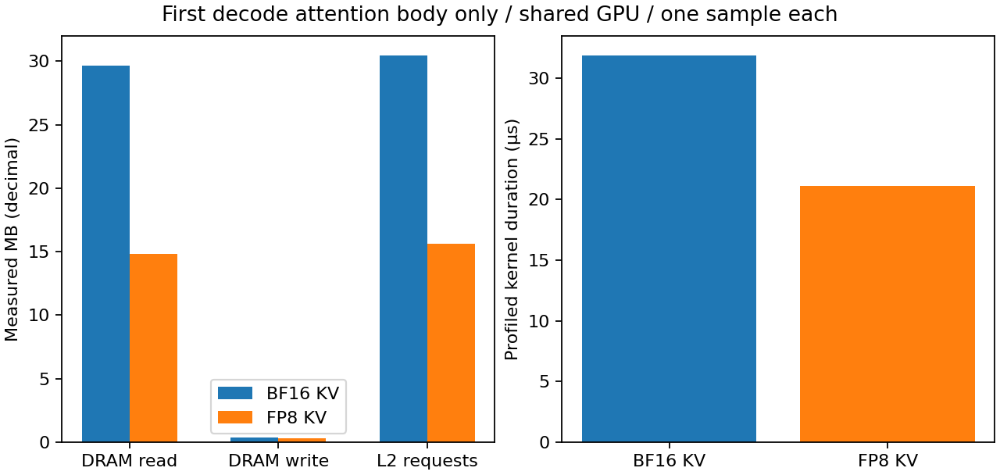

# 8-8：实际 decode attention 访存计数（部分交付）

固定在线 FP8 权重与8GiB KV，在7,239-token输入之后采首层decode的attention主体。两组各一份实际Nsight Compute报告，均正常退出；同一网格下FP8路径的DRAM读取与L2请求字节更少，但此处不是整模型每步流量。

|实际指标|BF16 KV|FP8 KV|
|---|---:|---:|
|DRAM读取 bytes|29,667,840|14,845,184|
|DRAM写入 bytes|342,528|321,536|
|L2请求 bytes|30,466,112|15,623,008|
|带profiler的kernel持续时间 ns|31,904|21,152|
|实际采集pass|1|1|



## 采样范围与验证

RTX PRO 6000，Nsight Compute2026.2.1.0，vLLM0.23.0 / Torch2.11.0+cu130；已有Qwen3-8B快照b968826d9c46dd6066d109eabc6255188de91218。基准配置、完整输入和KV/参数参考原件在reference/，逐文件SHA锁定；两格式在线量化权重435项逐项一致，每组与既有量化权重实验一致。独立校准后的36层KV scales与各自参考值一致，采样前后保持不变。

每格式先进行1次独立校准与2次相同目标预热，再采1次目标请求，均输出2 token。预热/校准的独立输出未保存，不将它们算作新的质量证据；采集请求的两个输出token原件为[4913,74]，两组一致。本包不是完整答案质量实验。

cudaProfilerApi只包围目标请求的prefill与一个decode步。NCU匹配kernel_unified_attention，跳过36个prefill调用，仅采第37个调用，即首层decode主体。两报告均恰好一个匹配结果：block=(128,1,1)、grid=(1,8,16)。[安装版本源码](sources/triton_unified_attention.py)说明第三维是16个softmax分段；后续reduce_segments不在采样内。单请求7239-token prefill的Q块数不为1，因此此网格也与decode形状吻合。源码逐文件SHA与当前安装版本核对一致。

原始.ncu-rep与完整CSV均保存；CSV含明确byte/ns单位，分析器直接读取dram__bytes_op_read.sum、dram__bytes_op_write.sum、lts__t_bytes.sum、gpu__time_duration.sum，不用逻辑张量大小替代计数。实际profiler__replayer_passes均为1，warmup pass为0。

配置kernel replay、cache-control none、clock-control none。其他GPU服务保持运行，没有独占GPU或主动清空缓存；计数与时间只代表此次带profiler的采样窗口，不能声称稳定加速。DRAM写入不必等于该kernel逻辑输出大小，缓存写回和共享设备状态影响观察。未采KV写入、Q量化、分段归约、其他层和整请求；不能将单层计数乘36当全模型实测。默认FP8路径也改变Q执行精度，不能归因于纯KV存储变化。

两组监护器exit_code=0、reason=null、leftovers={}；共用时约79.86/41.98秒，含加载/预热/采样/退出而非请求执行时间。首次均成功，没有失败启动批次。PNG已目视检查，SVG/PDF同时保留。

## 独立复现

使用已有上述vLLM环境与模型完整快照。NCU需现有GPU计数器权限；本次沿用机器已有sudo -n权限，未修改驱动设置。run.py从本目录reference中的配置读取模型绝对路径；在另一机器修改复制件的对应模型路径并重新生成参考索引后才运行，原封存包保持不变。

将本目录复制到新的工作位置，移除复制件中runs/、results/及bf16/fp8的.ncu-rep、.csv，然后执行：

```sh
sudo -n /absolute/path/to/vllm-python collect.py --ncu /absolute/path/to/ncu
python analyze.py
python plot.py
```

collect.py、run.py、trace_probe.py、probe.py和resource_guard.py均在本目录，无相邻实验依赖。使用privileged Python启动监护器是为了仅管理本实验的受监护子进程；PID出生信息、session与环境标记核对后才清理，其他服务未终止。初始采集逐组调用同一监护器命令，实际命令在runs/*/launch.json；collect.py封装相同调用和CSV导出。

```sh
python verify.py
```

verify.py检查封存文件、进程终态、实际采样过滤参数，并重跑参数/校准一致性、单kernel范围及计数单位检查。全模型访存、重复采样分布、Q保留变体的硬件计数和更多任务仍未覆盖；计算工作继续由calculations负责。
