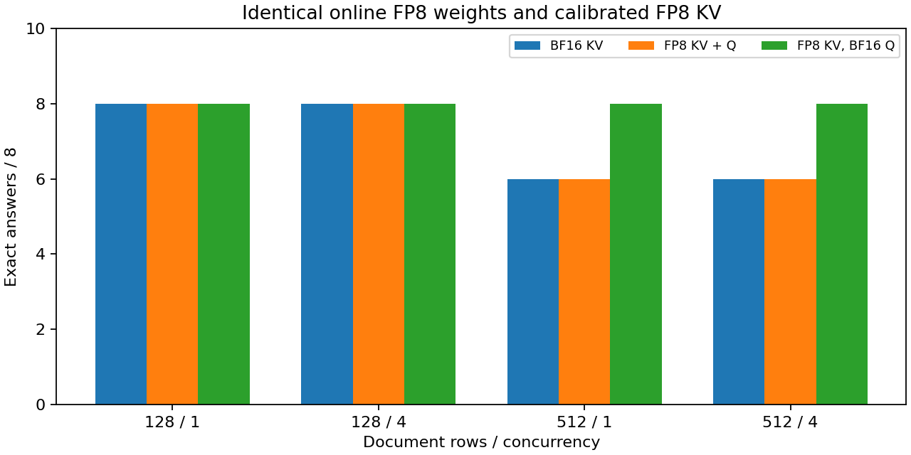

# 8-8：量化权重下保留 BF16 Q

固定在线 FP8 权重和已校准 FP8 KV 后，保留 BF16 Q 的自然答案由默认路径的28/32变为32/32。该对照新运行97调用，正常结束；原BF16 KV与默认FP8 KV两组各28/32，直接复用成功记录，不重复运行。

|文档行数 / 并发|BF16 KV|默认 FP8 KV + Q|FP8 KV，保留 BF16 Q|
|---|---:|---:|---:|
|128 / 1|8/8|8/8|8/8|
|128 / 4|8/8|8/8|8/8|
|512 / 1|6/8|6/8|8/8|
|512 / 4|6/8|6/8|8/8|



实际435项参数与默认FP8对照逐项SHA相同，36层KV校准scales逐项相同并在实验中保持不变。Q开关在36层全部关闭，attention入口每层3,313次观测、合计119,268次全部为torch.bfloat16（校准发生在观测启用前）。两轮正式输出完全一致。64个正式输出序列相对BF16 KV有12个不同、相对默认FP8 KV有16个不同，包含固定长度模式；自然输出均46 token、正常结束，无重试。

这个结果支持在该实现中将Q的量化路径单独作为质量变量；不证明FP8 KV一般优于BF16，也不证明更广任务、不同权重或高并发能保持全对。改变低精度路径后，各处舍入与误差组合不同，尚未定位到具体某层或数值机制。保留此前错误答案作为对照，不能用新控制覆盖默认路径的有效负结果。

监护器exit_code=0、reason=null、leftovers={}。实际运行约150.10秒，未终止其他GPU服务。PNG已目视检查，SVG/PDF同时保存。

计时包含Python观测开销，聚焦质量机制，不作为纯性能比较。

## 独立复现与范围

使用 Linux / CUDA、vLLM 0.23.0 / Torch 2.11.0+cu130，复用已有 Qwen3-8B 快照 b968826d9c46dd6066d109eabc6255188de91218。将此目录复制到新位置，移除复制件的 results/ 与 runs/ 后运行；原件及 reference/ 保持封存。

```sh
python reproduce.py --model /absolute/path/to/Qwen3-8B/snapshot
python plot.py
```

新运行共97调用（1独立校准、32预热、64正式），自然与固定64输出分开，各两轮。八个不同文档跨并发与轮次重复，不把32个自然请求当32个独立任务。与reference对照的唯一引擎配置差异为worker扩展；扩展在校准完成后设置各层attention实现的supports_quant_query_input=False，保留KV与权重参数。记录实际attention入口Q的dtype及各层调用计数，原安装包未改。

原两组分别BF16 KV与默认FP8 KV+Q，只复制此前成功记录，没有重新运行。reference/index.json锁定原路径与字节SHA。本控制两次重复均保留，包括错误答案；不通过重跑选取成功答案。共享GPU的时序和额外Python观测开销限制性能归因。

```sh
python verify.py
```

离线验证检查封存文件、进程终态、参考输入/原始记录SHA、控制配置差异、实际435项参数与校准KV scales一致、36层真实Q dtype，以及独立从文档解析的严格JSON答案。sources/保留实际安装的attention与量化相关源文件。未测量DRAM/L2，也不补作高并发Q控制或普遍任务质量结论。
