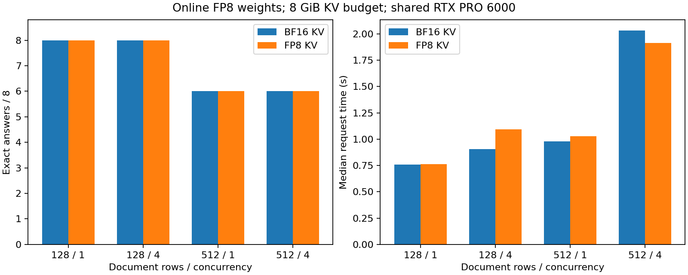

# 8-8：量化权重与 KV 精度（部分交付）

固定 Qwen3-8B，在加载时将线性层权重量化为 FP8，再比较 BF16 KV 与 FP8 E4M3 KV。两组正常结束，共 194 次调用；自然生成各正确 28/32 次，但出错任务不同，不能用同分证明质量等价。

## 结果

|文档行数 / 并发|自然精确答案 BF16 KV / FP8 KV|自然完成中位数秒 BF16 / FP8|固定 64 输出中位数秒 BF16 / FP8|
|---|---|---|---|
|128 / 1|8/8 / 8/8|0.758 / 0.762|0.995 / 1.053|
|128 / 4|8/8 / 8/8|0.905 / 1.094|1.160 / 1.181|
|512 / 1|6/8 / 6/8|0.979 / 1.027|1.284 / 1.549|
|512 / 4|6/8 / 6/8|2.032 / 1.913|2.285 / 2.346|



长文档 BF16 KV 错在 n512-r0，FP8 KV 错在 n512-r1，两种并发与两次正式重复均如此。同组重复输出 token 完全相同；跨组 64 个正式请求有 24 个输出序列不同，含固定长度生成。自然回答均 46 token、正常结束，无自动重试。八个不同任务的重复不构成 32 个独立质量样本；未通过全部正确的质量要求，是有效负结果，不删去或重跑挑选成功答案。

## 控制与实际格式

RTX PRO 6000，vLLM 0.23.0 / Torch 2.11.0+cu130，模型快照 b968826d9c46dd6066d109eabc6255188de91218。原始 BF16 checkpoint 加载时在线量化；144 个参数矩阵为 torch.float8_e4m3fn（6,945,767,424 bytes），147 个参数仍为 BF16（2,489,935,872 bytes），144 个 FP32 缩放参数共 576 bytes。并非全部参数都为 FP8。两次加载的 435 项参数名称、形状、dtype、逐项内容 SHA256 与量化方法均相同，见 kv-snapshots.json 中 weights。设备加载日志报告约 9.06 GiB。

每组 KV 预算固定 8 GiB。实际 36 层 KV 独立存储总量分别 8,587,837,440 / 8,589,017,088 bytes；每层 3,640 / 7,281 块，每块 16 token，差额来自块取整。此为已分配缓存容量，不是实测最大可接纳并发。本机该 Triton FP8 attention 路径同时涉及 Q 的量化，不能归因于纯 KV 存储格式；未新增保留 BF16 Q 变体。

每份文档 128 / 512 行，输入 1,863 / 7,239 token，四个种子任务各问三个键，原始输入与先前 BF16 权重实验逐项一致。自然生成最多 128 token，固定生成忽略 EOS 并输出 64 token，temperature=0；关闭 thinking、前缀缓存、异步调度及 CUDA Graph，max_model_len 与分块预算均 16,384，max_num_seqs=4。独立校准输入先计算一次 KV scales，之后冻结并核查。每条件预热一次，再以固定随机顺序正式重复两次；每组 1 校准 + 32 预热 + 64 正式请求。

两引擎依次运行，共享 GPU 上其他任务保持运行，因此耗时仅为本次观测，不能解释为稳定加速。旧 BF16 权重实验使用 12 GiB KV，本包为 8 GiB，禁止将两包耗时直接作为仅权重量化的性能对照。没有测量 DRAM/L2 流量、最大可接纳并发、广泛任务质量或 V4，8-8 仍部分完成。计算项目继续由 calculations 负责。

## 独立复现与验收

将本目录复制到 Linux / CUDA 环境，使用安装了上述 vLLM 的 Python，保留已有完整模型快照。复现前移除复制件中的 results/ 与 runs/（原始交付包保持封存）：

```sh
python reproduce.py --model /absolute/path/to/Qwen3-8B/snapshot
python plot.py
```

run.py / probe.py 无相邻实验依赖；resource_guard.py 通过环境标记、session 与 PID 出生信息仅管理自身进程，限制自身 GPU 32 GiB、RSS 96 GiB，并保存资源轨迹。两组 supervisor.json 均 exit_code=0、reason=null、leftovers={}。原始请求含输入、输出 token、文本、事件、终止原因和引擎 metrics；sources/ 保存安装版本的相关实现原件。

```sh
python verify.py
```

verify.py 检查 manifest、进程终态、输入和执行源码哈希，并重新分析参数一致性、校准冻结、完整条件覆盖和从文档独立解析的精确答案。plot.py 从汇总生成 PNG/SVG/PDF；PNG 已目视检查。两种条件首次运行均成功，没有需要保留的失败启动批次。
