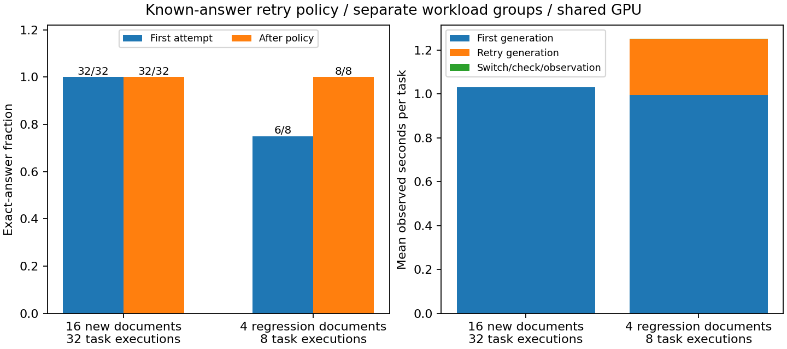

# 8-8：自然答案失败后的实际重试成本（部分交付）

实际执行默认FP8 Q回答、严格校验和最多一次BF16 Q重试；固定在线FP8权重与FP8 KV。16份新文档全部首尝试正确，没有触发重试。为验证失败路径，另外单列此前四份已知回归题，两次失败均经实际重试修正。两组首次运行都正常结束，合计48次模型调用，不删除失败答案，也不重新挑选成功批次。

|观测|16份新文档，两轮|4份已知回归文档，两轮|
|---|---:|---:|
|任务执行次数|32|8|
|首尝试正确|32/32|6/8|
|最终正确|32/32|8/8|
|实际重试次数|0|2|
|正式模型调用数|32|10|
|正式输出token（含失败）|1,472|460|
|首尝试生成总时间秒|32.9350|7.9519|
|全部尝试生成总时间秒|32.9350|9.9887|
|完整任务观测总时间秒|32.9883|10.0051|



已知回归组是原实验四份长文档的相同输入token、内容与标准答案，其中known-01两轮均首答错误。两个任务含重试总耗时分别2.0266与1.9985秒；两次重试新增92个输出token、约2.0368秒生成时间，首尝试的错误输出仍计入表中成本。相同任务同类尝试的两轮输出完全一致。所有正式尝试均46输出token、正常结束，没有用截断或API失败代替质量错误。

新文档组按预先固定种子8808000–8808015生成，未在此前控制中使用；已知回归组种子808512–808515，在看到新组没有失败后单列验证备用路径。因此两组分开报告，不混成扩大质量样本的总体成功率。每份文档两轮也不构成两个独立质量样本。校验器知道三个键的标准答案，这不是开放业务中能够免费判断正确性的方案；一般任务的验证成本、错误判断与无限重试均不在此实验范围。

## 实际执行与控制

Qwen3-8B快照b968826d9c46dd6066d109eabc6255188de91218，RTX PRO6000，vLLM0.23.0 / Torch2.11.0+cu130。在线FP8线性层权重、8GiB FP8 E4M3 KV，独立校准一次；每组正式运行前分别预热默认FP8 Q与BF16 Q。435项实际参数与此前量化权重参考SHA一致，36层KV scales匹配且在全过程保持不变。reference-snapshot.json是此前FP8组原始快照副本。

每份512行文档输入7,239 token，问三个精确六位数值；温度0、自然生成最多128 token、允许EOS、关闭thinking/APC/异步调度/CUDA Graph。max_num_seqs=4，但任务串行提交。每轮任务顺序预先按固定随机数打乱并保存在inputs.json。默认失败后只切换各层supports_quant_query_input，不重载模型、不改权重或KV校准值；再次失败就结束。切换前一个请求已完整结束，避免在途请求混用精度。实际attention入口逐层计数：首尝试全部为float8_e4m3fn，重试全部为bfloat16，并独立核对36层覆盖。

attempts.jsonl保存每次完整输出token、文本、事件、终止原因、引擎metrics、校验时间和实际Q dtype；tasks.jsonl保存任务起止与全部attempt ID。任务时间从设置首尝试精度前开始，包含首尝试、严格JSON校验、实际切换、失败重试及观测RPC；生成时间单列为引擎generate调用区间。额外Python类型观测与RPC会影响计时，不作为纯部署性能结论。引擎加载、校准和预热不计入正式任务时间，各组另外完整保存其调用和监护器总时间。

两个监护器均exit_code=0、reason=null、leftovers={}，总运行57.47/35.39秒；没有终止其他GPU服务。共享GPU条件下的样本没有价格或能耗换算，不重复calculations的估算工作。PNG已目视检查，SVG/PDF同存。

## 独立复现与验收

使用Linux/CUDA及上述vLLM环境，复用完整模型快照。在本目录的新复制件中移除results/、results-regression/、run/、run-regression/（封存原件保持不变），执行：

```sh
python reproduce.py --model /absolute/path/to/Qwen3-8B/snapshot
python plot.py
```

本目录包含两个独立运行入口、fixture、worker扩展与资源监护器，无相邻实验代码依赖。run.py执行新文档组，run_regression.py执行已知回归组；监护器仅管理本次创建的进程，核查PID出生信息、session与环境标记。

```sh
python verify.py
```

verify.py检查文件哈希和两组终态，再独立从文档解析标准答案，核对输入/执行代码SHA、参数与校准一致、尝试链完整、仅错误触发一次重试、实际Q dtype、全部失败尝试成本及重复输出差异。更多任务族、开放式答案校验、高并发备用路径与一般业务成本仍未覆盖。
