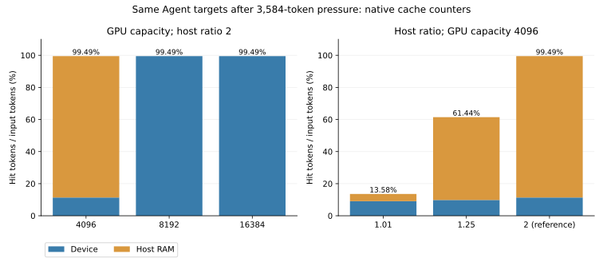

Completion update: parent experiment is delivered in its request-replay/storage-record scope; see [final coverage review](../COMPLETION-REVIEW.md). Earlier pending-work notes below are historical.

# Agent independent host-capacity scan

Completed 72 actual model calls: 48 Agent target calls and 24 unrelated pressure calls. All target output IDs agree across before/after pressure and scanned settings: **True**. This is a fixed one-token replay of the same12 original Agent inputs, not a task-quality run.

| GPU token pool | Host ratio | Target phase | Device hit tokens | Host hit tokens | Request hit rate | Token hit rate | Target time sum (s) |
|---:|---:|---|---:|---:|---:|---:|---:|
| 4096 | 1.01 | target_before | 16304 | 0 | 91.67% | 83.37% | 2.223504 |
| 4096 | 1.01 | target_after | 1776 | 880 | 100.00% | 13.58% | 1.398372 |
| 4096 | 1.25 | target_before | 16304 | 0 | 91.67% | 83.37% | 2.155418 |
| 4096 | 1.25 | target_after | 1920 | 10096 | 100.00% | 61.44% | 1.007830 |

Storage hits are zero throughout; no storage backend is configured. The native SGLang counters establish actual host reuse, rather than an inferred hit based on file existence. The analyzer checks effective GPU capacity from server_info, exact seeded3584-token pressure inputs,36 calls per fresh engine,16-token-page counters, input/source hashes and terminal engine/GPU cleanup.

These two fresh engines hold GPU capacity4096 and vary only host ratio1.01/1.25. The separately preserved4096/ratio2 run is the comparison point. Installed source rounds host slots to the next16-token page: the configured ratios correspond to4144/5136 slots, and ratio2 to8208 slots. These are logical pool slots, not complete process RSS. The source hash and formula are retained in host-pool-source.json.

Per-turn complete-request times and descriptive nearest-rank sample p95 are in summary.json. They include model work, so they are not isolated host-copy latency or physical memory bandwidth. Each capacity has one pass in fixed order; first requests may include startup/JIT effects. Equal one-token outputs do not prove bitwise-equal KV tensors. All prior file/remote/failure records remain separate.

Historical9-8 remains open for the remaining storage-capacity/save-policy/V4-state comparison. Recheck from repository root with `python3 experiments/ch09/09-08/agent-dram-capacity/analyze.py`.

The ratio2 comparison point is reused from the first sweep, not an additional independent repetition. SVG/PNG were visually checked.
