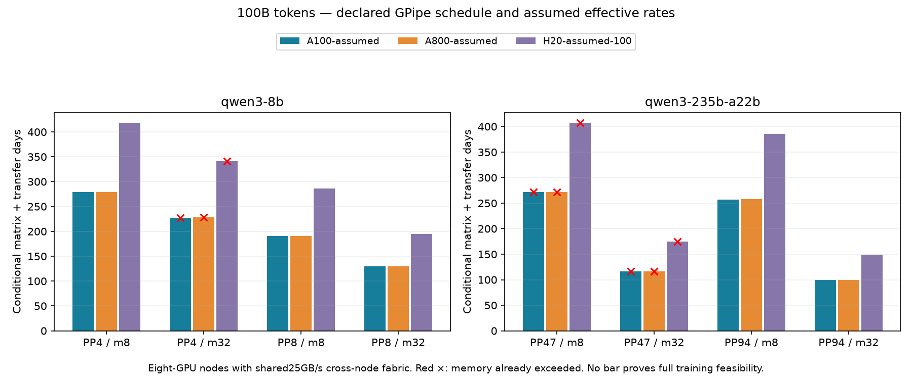

# Dependency-aware conditional hardware comparison

All96 schedules passed dependency, exclusive-resource, duration, matrix-work and payload checks. They reuse the eight concrete PP candidates and retain every compute/transfer event. The scheduler selects the earliest-ready operation, then its stable ID; this is a declared list schedule, not a proof of optimal scheduling. Forward fill completes before backward drain. Layer recomputation is charged. A stage waits for its preceding send before reusing its outbound buffer; each incoming transfer waits for the preceding consumer operation before reusing the receive buffer.

Compute uses one exclusive resource per GPU; transfer uses one exclusive resource per physical modeled link. Compute and DMA may overlap when dependencies permit. The independent-links model gives every PP boundary its own declared bandwidth. The eight-GPU-node model uses the same internal links but all boundaries crossing an eight-rank group share one25GB/s fabric resource. This is a stated topology assumption, not evidence that a94-GPU cluster has NVLink between every adjacent stage.

A100/A800 profiles hold candidate, compute rate150TFLOP/s effective matrix work,80GB capacity and topology fixed; only local-link effective bandwidth changes150→100GB/s. These are assumed effective rates, informed only by the archived2:3 NVLink specification ratio, not measured throughput. H20 profiles explicitly sweep50/100/150TFLOP/s with96GB and stated link rates; none is a hardware specification or measured training step.

| Model | PP | Microbatches | A100 assumed days | A800 assumed days | H20 assumed100TF days | Minimum workspace headroom80GB |
|---|---:|---:|---:|---:|---:|---:|
| qwen3-8b | 4 | 8 | 278.884 | 278.963 | 418.325 | 17.676GB |
| qwen3-8b | 4 | 32 | 227.742 | 227.809 | 341.613 | -40.306GB |
| qwen3-8b | 8 | 8 | 190.593 | 190.704 | 285.890 | 40.159GB |
| qwen3-8b | 8 | 32 | 129.938 | 130.013 | 194.907 | 7.946GB |
| qwen3-235b-a22b | 47 | 8 | 271.660 | 272.040 | 407.254 | -21.969GB |
| qwen3-235b-a22b | 47 | 32 | 116.465 | 116.607 | 174.638 | -25.190GB |
| qwen3-235b-a22b | 94 | 8 | 257.217 | 257.920 | 385.304 | 23.347GB |
| qwen3-235b-a22b | 94 | 32 | 99.431 | 99.654 | 149.016 | 21.737GB |

The100B-token task charges a whole final batch, with charged_tokens saved. These times include modeled matrix compute, layer recompute and PP transfer; they exclude embedding/nonmatrix work, loss, optimizer update, data input, validation, checkpoint I/O, outages and framework overhead. They are conditional matrix/transfer durations, not full training completion forecasts. Effective compute rates exclude the modeled communication, avoiding double counting it as total-step MFU.

Negative memory headroom rejects a candidate even before workspace. Positive headroom still needs the temporary activation/attention/logit/optimizer/kernel allocations bounded. No row is labeled fully feasible or a completed hardware calibration. All profiles preserve invalid candidates for diagnosis rather than silently ranking them. Thus the original10-4 full comparison remains open pending these boundaries; this artifact replaces illustrative traffic amounts with concrete transfers and explicitly scheduled dependencies.

Run `python run.py` to regenerate all traces and tables. Raw source calculations remain unchanged.

The chart shows the shared-fabric topology; every independent-link and additional H20-rate sample remains in results.json. Red crosses denote already-rejected capacity, not missing data.
