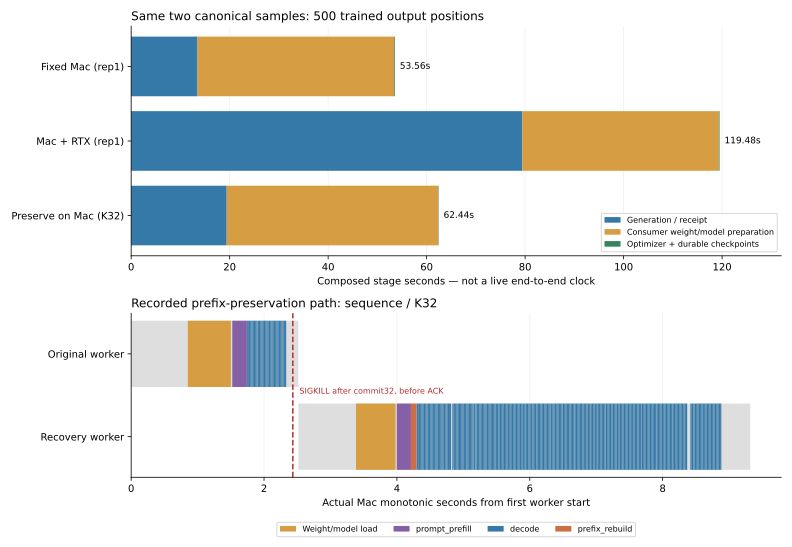

# Historical11-5: completed record-based effective-output comparison

The original exercise permits calculation/short scripts using weights, network throughput, generation records and preemption times. The requested fixed, additional-rollout and partial-response-preservation arrangements now have measured evidence, with restart retained as a control. This report joins those measurements under explicit accounting assumptions; it is not a single randomized four-arm end-to-end live trial.

Each row completes the same two accepted tasks and trains the same exact canonical prompt/output streams:500 output positions per batch. New heterogeneous outputs are normalized only after strict content checks; raw sampling/receipt counts and raw training remain separate. The new checkpoints were actually executed, saved, fsynced, reloaded and independently verified. No earlier checkpoint is relabeled.

| Arrangement | Rep / cutoff | Generation seconds | Composed training seconds | Composed total seconds | Teaching total cost |
|---|---|---:|---:|---:|---:|
| additional | rep0 | 82.324322 | 40.742309 | 123.066632 | 0.05314300 |
| fixed | rep0 | 13.431185 | 40.066601 | 53.497786 | 0.01486050 |
| additional | rep1 | 79.406697 | 40.073354 | 119.480051 | 0.05134136 |
| fixed | rep1 | 13.481022 | 40.076707 | 53.557729 | 0.01487715 |
| fixed | rep2 | 13.648449 | 40.079702 | 53.728150 | 0.01492449 |
| additional | rep2 | 79.532276 | 40.074518 | 119.606795 | 0.05139912 |
| restart | K32 | 21.295081 | 43.063907 | 64.358988 | 0.01787750 |
| preserve | K32 | 19.402557 | 43.032866 | 62.435423 | 0.01734317 |
| restart | K96 | 24.795767 | 43.040374 | 67.836141 | 0.01884337 |
| preserve | K96 | 23.914104 | 43.061583 | 66.975686 | 0.01860436 |

Generation batch windows for fixed/additional are directly measured. Restart/preserve generation values sum two original per-task windows under actual commit-before-ACK SIGKILL. Training adds one measured cold consumer preparation plus both measured optimizer/checkpoint durations. This is a sequential stage-composition scenario; no cross-run timestamps are subtracted. Startup conditions, precision and receiver protocols differ and are retained in the underlying reports. These values are not a causal four-arm effect estimate.

Mac and RTX are each assigned1 teaching unit/hour. Generation Mac reservation covers its defined batch/path window; extra RTX reservation uses the measured SSH request window; the sequential RTX training consumer covers its composed window. These are teaching allocation rules, not utilization, energy or invoices. No paper-scale distributed configuration is claimed: the local MLX4bit and RTXBF16 configurations are this book's measured variants.

The token ledger distinguishes3256 sampled /3000 uniquely committed positions in the original12 paths,256 duplicate deliveries, and actual preserved-prefix KV rebuilding. Original training checkpoints cover3000 logical positions. New device batches produce/receive3141 positions; their raw training covers3141, while the separate canonical alternative trains3000. These are alternative datasets and repeated logical trials, not additive unique content. Full per-request identities are linked in the source manifests.

## Resource lifetime

The21 cutoff rows replay each measured RTX token timeline at5/20/40/50/60/90/120seconds. Before terminal artifact completion, generated tokens can exist while this nonstreaming receiver has no usable received sample. These cutoffs are calculation, not additional physical kills. The original formal experiment contains eight actual SIGKILLs and restart/preservation verification; that evidence is not reassigned to the RTX route.

The sustained-task sensitivity uses measured one-extraction durations as throughput proxies. With optional/Mac price ratio r, RTX seconds/task g, Mac seconds/task m, and preparation D, the declared continuous approximation is cheaper only when r*g<m and L>D/(1-r*g/m). Completing at least one task also requires D+g. Finite task counts use floor((L-D)/g); the JSON reports their separate exact cost checks, so crossing the continuous boundary does not automatically imply finite-task savings.

At equal teaching hourly prices, all three measured throughput proxies give no finite cheaper lifetime in this model. At optional price0.3, cached-weight continuous boundaries are89.44–100.01seconds; adding an explicitly hypothetical full-weight transfer over1GB/s moves them to123.54–137.21seconds. These reuse one-task measurements as stationary rates and do not predict actual long-running throughput. Original Mac4bit weight size and independently recorded RTXBF16 file sizes remain distinct. The earlier100token/s model is retained as a separate declared teaching example, not a measurement.

The full results contain18 price/transfer cases and discrete lifetime checks. Existing cached weights were used in actual runs; no physical weight-distribution measurement is claimed.

## Reproduce and limits

Run `python3 experiments/ch11/11-04/final-comparison/run.py` and `python3 experiments/ch11/11-04/final-comparison/verify.py` from repository root. Verification checks input hashes, ten arrangement compositions,21 cutoffs,18 sensitivity cases, equal canonical batch counts and boundary arithmetic. Generation/recovery and checkpoint verifiers cover the underlying actual execution.

This completes the original calculation/short-script question with actual generation, preemption, added-device and downstream training evidence. It does not demonstrate full RL optimization, production distributed scaling, bitwise training determinism, measured cold weight transfer, or live end-to-end timing. Those limitations must accompany the results.

The upper panel composes recorded stages; the lower panel uses actual same-clock loading, preemption and recovery events. Gray regions include process/manager overhead. SVG/PNG were visually checked.
