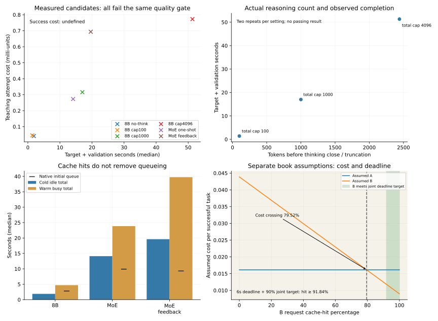

# Historical11-7: budgets, cache, queue and quality-constrained cost

The complete measured candidate set contains48 logical task evaluations:32 Qwen3-8B budget/cache/queue cases, eight one-shot Qwen3-VL-30B-A3B-Instruct-FP8 cases, and eight bounded two-attempt feedback cases. The latter adds16 actual target calls. All cases use the same repair specification and six acceptance checks. **No candidate passed the full gate.** This is a negative experimental result; it does not imply those models fail other tasks.

The recipe set was expanded after earlier failures; this is a documented exploratory experiment, not a blind model benchmark. Routing decisions use repetition0 only and are evaluated on repetition1 for the same known task and cache/queue state. Repetitions are not held-out tasks.

## Declared prices and decisions

Teaching prices per million input/cached/output tokens are0.1/0.025/0.3 for8B and0.4/0.1/1.2 for both MoE recipes. These are explicit estimates, not provider prices, bills or current market recommendations. Reasoning tokens are included once in generated-output charges. Target, warmup and background costs are recorded separately; failed attempts are charged. Validation compute, model initialization, taxes and other fees are unpriced.

| Policy | Evaluated requests | No feasible-route states | Successes | Observed failure fraction | Teaching evaluation spend | Teaching cost per success |
|---|---:|---:|---:|---|---:|---|
| fixed | 4 | 0 | 0 | 1.0 | 0.00127320 | Undefined: zero successes |
| lowest_token_unit_price | 4 | 0 | 0 | 1.0 | 0.00017400 | Undefined: zero successes |
| quality_constrained | 0 | 4 | 0 | None | 0.00000000 | Undefined: zero successes |

Calibration target+warmup acquisition costs 0.00797240 teaching units. All recorded target+warmup usage costs 0.01594480, with background load another 0.00189120. These acquisition totals are separate from policy evaluation spend; abstention is not a claim that collecting the evidence was free.

Fixed routing chooses8B thinking/cap1000. Lowest output-token price ties choose8B no-thinking/cap1000 by the preregistered order. Both evaluated choices fail every state. The quality-constrained rule admits only recipes that passed all six checks during calibration; none do, so it issues no evaluation request in all four states. It has no successful completion cost or failure fraction over issued requests. Its behavior is abstention, not a zero-cost successful answer.

First visible token, first post-thinking candidate segment, model+validation completion and verified-usable latency are retained for every case. All verified-usable fields are null because quality never passed. A quick first token or natural model stop is not a successful result.

## Two requested hand calculations

For100 versus1000 reasoning tokens while answer length and all other usage stay fixed, the extra900 tokens cost0.00027 teaching units at the8B output rate, or0.00108 at the MoE rate. This is the marginal arithmetic example, not the measured total-generation-cap intervention. Actual100/1000 thinking-cap outputs truncate; the4096 cap produces longer completed candidates that still fail. Actual reasoning-before-close counts are stored rather than assumed equal to the cap.

For a cache hit behind a queue, use observed native queue plus measured complete latency. The JSON includes12 same-recipe/repetition warm-busy versus cold-idle comparisons. For example,8B no-thinking median cold-idle completion is1.879s, while warm-busy is4.706s despite160 cached tokens. Native warm-busy median queue is2.811s. This illustrates how queueing can outweigh short-prompt reuse; it is not a pure cache-effect estimate. Larger-thinking-budget outputs differ across cache states, so generation changes also affect their times.

Both examples explain why the cheapest token unit or highest cache hit is not by itself a feasible quality-constrained choice. Under these measured candidates, no cost/routing rule can manufacture a passing result. More retries, revised prompts or other models would be a new experiment and are not silently introduced into the final comparison.

## Verification and limits

Run `python3 experiments/ch11/11-08/cost-routing/run.py` and `python3 experiments/ch11/11-08/cost-routing/verify.py` from repository root. Underlying reports: [8B measurements](../cache-queue/README.md), [MoE candidate](../model-choice-moe/README.md), [bounded feedback](../feedback-route/README.md). Source hashes,48 logical records, calibration/evaluation split,12 decisions, failed-attempt charges and marginal arithmetic are checked. All GPU runs are terminal and their cleanup records are retained.

The original question's estimate-then-offline-replay scope is complete. Real billed costs remain unknown because this is local hardware with declared token-price scenarios; observed zero-success denominators remain undefined for mathematical reasons. Neither is replaced with a fabricated number. No production SLA, general failure-rate estimate or model-quality ranking is asserted.

[PDF figure](comparison.pdf). The shaded panel reuses the current calculations/results/routing-cost-book.json assumptions:79.5249% cost crossover and91.8367% joint deadline threshold. It is not a measured API/model result. Figure source hashes are in plot-sources.json; SVG/PDF/PNG exported and PNG visually checked.
