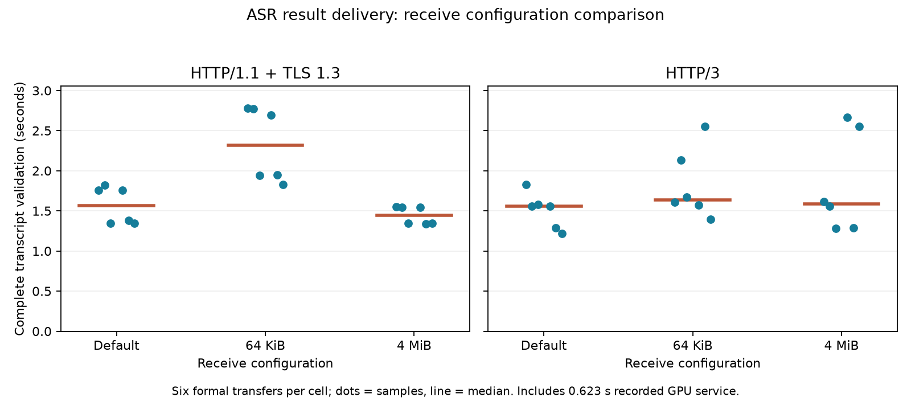

> Socket-default qualification: see [TCP_NODELAY diagnostic](SOCKET-DEFAULTS.md). A full matched rerun is complete in ../receive-windows; do not pool this batch with earlier implicit-socket TCP timings.

# ASR receive configuration and complete transcript delivery

This experiment uses the exact actual1,183,788-byte WAV and Whisper transcript from [ASR source records](../speech-records/README.md). Each real request uploads the complete WAV, waits the measured0.622926892s GPU-service replay and returns/validates the complete original UTF8 transcript. These are not54 new model calls, and transport configuration does not imply improved recognition quality.

Three trials use position-balanced mode order: default/64KiB/4MiB,64KiB/4MiB/default,4MiB/default/64KiB. Each setting occupies each position once. Nine fresh Docker containers use netem80ms RTT,20Mbit/s,0.1% random loss,2CPUs/2GiB. Each protocol/configuration has one fresh and one reused formal request per repetition, plus a separately connected warmup. All54 exchanges (36 formal,18 warmups) passed upload/transcript identity,UTF8 validation,TLS/ALPN,reuse,service waits,qlogs and netem/resource/cleanup checks.

| Receive setting | Protocol | Median complete seconds | Fresh median | Reused median |
|---|---|---:|---:|---:|
| default | h1 | 1.568 | 1.757 | 1.348 |
| default | h3 | 1.558 | 1.559 | 1.287 |
| 64k | h1 | 2.321 | 2.775 | 1.941 |
| 64k | h3 | 1.640 | 1.607 | 1.673 |
| 4m | h1 | 1.444 | 1.545 | 1.342 |
| 4m | h3 | 1.585 | 1.612 | 1.285 |

Dots retain all six formal values per cell; median splits contain only three values each. The mode order is position-balanced, but random packet-drop positions and temporal/host variation remain; three repetitions do not establish statistical significance. These small, stochastic batches describe this implementation and controlled loopback path. They do not establish statistical significance or a general best protocol/window. The pair-wide median mixes fresh and reused requests.

## What actually changed

TCP changes only SO_RCVBUF before connect and on the listener before accept. Defaults leave Linux receive autotuning available; explicit settings lock that buffer choice. Linux reports double the requested buffer size:131072 bytes for64KiB and8388608 bytes for4MiB. This readback is not the advertised TCP window. The default observed buffer can grow. Actual TCP_INFO records are retained at client ready/close and sampled on server sockets every100ms. Offsets were compiled from the RTX host linux/tcp.h with tcp_offsets.c; source header, kernel identity and raw bytes are archived. tcpi_snd_wnd reports the peer advertised receive window, tcpi_snd_cwnd is segments, and the limit timers are microseconds.

QUIC changes both initial connection max_data and stream max_stream_data on both endpoints. Default aioquic1.3.0 values are1MiB each. Qlogs verify local/remote advertised initial limits and subsequent MAX_DATA/MAX_STREAM_DATA updates; limits grow dynamically, so64KiB is not a permanent ceiling. TCP buffer sizing and QUIC credit sizing are distinct mechanisms. This experiment does not change the congestion algorithm or equate the two settings.

| Trial/config | Observed server TCP buffer bytes | Sampled peer window min–max bytes | QUIC initial limit bytes | Observed MAX_DATA min–max |
|---|---|---|---:|---|
| trial0-default | [131072, 5919493] | [83968, 84992] | 1048576 | [2097152, 8388608] |
| trial0-64k | [131072, 131072] | [83688, 84698] | 65536 | [131072, 8388608] |
| trial0-4m | [8388608, 8388608] | [196608, 458496] | 4194304 | [8388608, 8388608] |
| trial1-64k | [131072, 131072] | [83688, 84698] | 65536 | [131072, 8388608] |
| trial1-4m | [8388608, 8388608] | [196608, 458496] | 4194304 | [8388608, 8388608] |
| trial1-default | [131072, 5919493] | [83968, 84992] | 1048576 | [2097152, 8388608] |
| trial2-4m | [8388608, 8388608] | [196608, 458496] | 4194304 | [8388608, 8388608] |
| trial2-default | [131072, 6291456] | [83968, 84992] | 1048576 | [2097152, 8388608] |
| trial2-64k | [131072, 131072] | [83690, 84698] | 65536 | [131072, 8388608] |

| Trial/config | Client receive-window-limited time µs | Client busy time µs | Ratio |
|---|---:|---:|---:|
| trial0-default | 620000 | 2290000 | 27.1% |
| trial0-64k | 4379000 | 4930000 | 88.8% |
| trial0-4m | 790000 | 1873000 | 42.2% |
| trial1-64k | 4235000 | 4732000 | 89.5% |
| trial1-4m | 790000 | 1873000 | 42.2% |
| trial1-default | 621000 | 2289000 | 27.1% |
| trial2-4m | 790000 | 1871000 | 42.2% |
| trial2-default | 613000 | 2394000 | 25.6% |
| trial2-64k | 4392000 | 4939000 | 88.9% |

These cumulative client counter deltas include the TCP warmup connection and the two-request formal connection. The ratio describes time marked receive-window-limited by the kernel among its busy time; it is not a fraction of total end-to-end task time, nor a separate throughput measurement.

The sampled peer-window range includes handshake/idle and active phases; do not read its minimum as a sustained transfer limit. Per-connection TCP counters and QUIC frame counts in summary.json provide further diagnostics. Fixed source identity, readbacks and negotiated parameters verify the intervention; they alone do not prove the cause of every latency difference.

The client/server share one container event loop; qlog and100ms TCP sampling overhead is present in every batch. Random drop placement, congestion recovery, CPU scheduling and receive behavior can differ. The ASR request has a moderate audio upload and a very small complete text response. These results cannot stand in for TTS first-play or Computer Use screenshot-round behavior. Previous profile calibration is in ../controlled-network. No host route/sysctl changes were made. All nine own containers were removed.

Reproduce with orchestrate.py on the RTX, preserving the sibling speech-records fixture. Revalidate with python analyze.py; generate the figure/report with the local matplotlib environment and python report.py. Fresh result directories are required. PROTOCOL.md records the design before execution. Window configuration is now measured for ASR as well as the separate image workload. TTS/Computer Use receive configurations and other unmeasured workload/factor cells remain open in12-4/COVERAGE-REVIEW.md.
