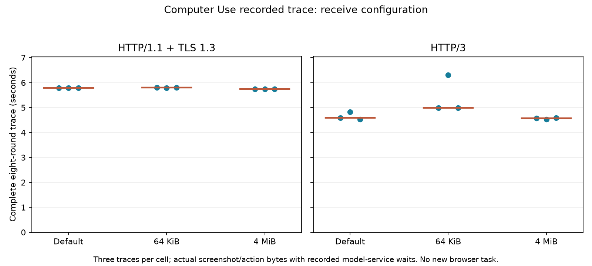

> Socket-default qualification: see [TCP_NODELAY diagnostic](SOCKET-DEFAULTS.md). A full matched rerun is complete in ../receive-windows; do not pool this batch with earlier implicit-socket TCP timings.

# Computer Use receive configuration across the complete trace

All162 real network exchanges passed independent verification (144 formal,18 warmups). Each formal condition transfers all eight screenshot/instruction requests and actual action responses from the first successful structured Qwen3-VL-8B browser trial in [source records](../computer-use/README.md). The measured per-round model-service waits are replayed after complete upload; no new GPU calls or browser actions occur in these transport trials.

| Mode | Protocol | Median validated round ms | Three complete trace times, seconds | Median trace seconds |
|---|---|---:|---|---:|
| default | h1 | 739.815 | 5.785 / 5.782 / 5.786 | 5.785 |
| default | h3 | 573.741 | 4.589 / 4.828 / 4.521 | 4.589 |
| 64k | h1 | 739.399 | 5.798 / 5.795 / 5.801 | 5.798 |
| 64k | h3 | 643.777 | 4.986 / 6.305 / 4.993 | 4.993 |
| 4m | h1 | 730.369 | 5.746 / 5.748 / 5.751 | 5.748 |
| 4m | h3 | 558.791 | 4.571 / 4.523 / 4.588 | 4.571 |

Each cell includes three traces,24 formal rounds with different screenshot/instruction sizes and service times. The sequence is identical across all settings. A trace uses one fresh connection followed by seven reused requests; round medians mix both and are not pure warm latency. Trace time runs from group start through final action-JSON validation, excluding group connection cleanup and source browser screenshot/action execution. The fixed3.158439950s sum of source model-service time is common to each trace. Smaller differences among these three-sample cells do not establish statistical significance or general protocol superiority.

## Intervention and proof

Three trials use position-balanced mode order default/64k/4m,64k/4m/default,4m/default/64k. Each fresh Docker container holds network-none/NET_ADMIN,2CPU/2GiB,netem80ms RTT,20Mbit/s,0.1% random loss. One step0 warmup per protocol precedes each subrun's two formal traces; warmups are excluded from table statistics. There is no concurrent round execution.

TCP sets SO_RCVBUF before client connect and on the listener before accept; defaults leave receive autotuning available,64KiB/4MiB read back as131072/8388608 bytes. QUIC sets initial connection and stream credit on both endpoints, verified by qlogs; those credits may grow. These are different receive mechanisms and do not change the congestion algorithm. Raw TCP_INFO,readbacks,QUIC negotiated parameters and MAX frames are retained in each subrun and summary.json.

Independent verification checks all eight source request/response file hashes, every actual server upload hash and per-step service wait, parsed action JSON and response hash, complete step order, fresh/reused connection identities,TLS/ALPN,all81 HTTP/3 response headers,transport receive settings,netem drain,container resources and all nine container removals. Source screenshots and task state remain in the original live-model report. Correctly replaying a stored action does not establish safe action retries or new semantic model success.

The client and server share a container event loop; qlog/TCP sampling overhead,host scheduling and stochastic packet loss affect these measurements. Absolute times must not be pooled with other runners that use different request/cleanup boundaries. Revalidate with python analyze.py; regenerate the figure/report with the matplotlib environment and python report.py. PROTOCOL.md and orchestrate.py define reproduction. Window comparisons now cover the four stated workload types; missing chunking/recovery cells and final contribution review remain listed in ../COVERAGE-REVIEW.md. Acoustic playback is still unmeasured.
