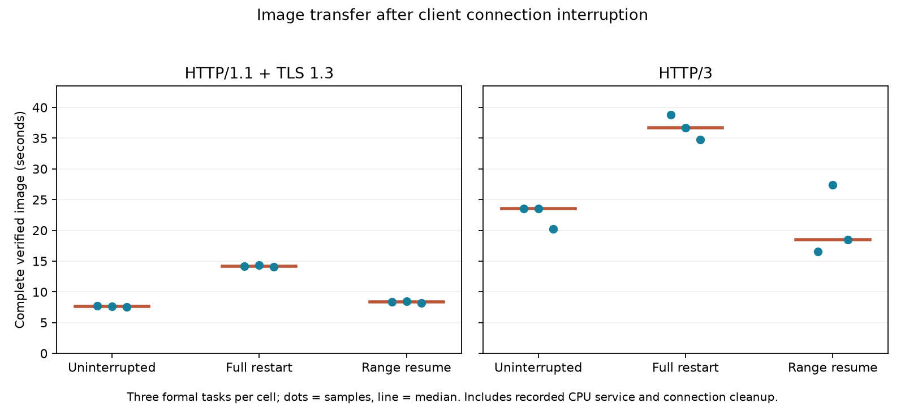

# Interrupted image transfer: restart versus retained-output continuation

All20 tasks passed independent complete-image verification:18 formal tasks and2 protocol warmups,32 real connection exchanges,12 injected client connection interruptions. The source is the same10,656,312-byte RAW and4,556,971-byte developed JPEG used in the image experiment. Each original/full-restart request uploads the complete RAW and replays0.483963046s measured CPU development time before returning the actual image. No new RAW development or GPU inference is claimed.

| Protocol | Policy | Three completion times, seconds | Median seconds | Median post-interruption recovery seconds |
|---|---|---|---:|---:|
| h1 | uninterrupted | 7.700 / 7.670 / 7.557 | 7.670 | — |
| h1 | restart | 14.129 / 14.317 / 14.093 | 14.129 | 8.106 |
| h1 | resume | 8.407 / 8.484 / 8.172 | 8.407 | 2.430 |
| h3 | uninterrupted | 23.531 / 23.504 / 20.279 | 23.504 | — |
| h3 | restart | 38.836 / 36.711 / 34.741 | 36.711 | 19.235 |
| h3 | resume | 16.514 / 27.429 / 18.452 | 18.452 | 4.207 |

There are only three formal samples per cell. HTTP/3 continuation was faster than the uninterrupted median in this batch; these are separate stochastic network realizations, not paired identical-loss runs, and this is not evidence of a negative fault penalty or that injecting a failure generally accelerates transfer. Preserve that observation without inventing a congestion explanation.

For each interrupted case, the client receives at least1MiB of JPEG, retains the exact prefix including read-chunk overshoot, and closes that connection. Full restart discards the prefix and repeats the complete RAW upload, processing wait and image download on a new connection. Range continuation reconnects, names the already materialized output and requests the suffix from the retained offset. It verifies206 status,Content-Range,ETag and complete reconstructed JPEG/RGB. Connection identities/ports are different across both recovery phases. HTTP/3 qlogs contain the actual close frames and response headers.

The continuation endpoint is an explicit test application route `/resume/{offset}` returning206 metadata; it is not a claim that an unmodified default browser or arbitrary server automatically supports HTTP Range recovery. The server retains an immutable finished JPEG in memory under an operation ID. This is output-byte recovery with a surviving server and retained client prefix. It does not recover server-process loss, incomplete RAW uploads, lost GPU state or a changed output version.

## Time and byte boundaries

Completion starts before the first connection and ends after connection cleanup, response-file writes and full RGB validation. The QUIC client also serializes its qlog during cleanup. Consequently these task times include different housekeeping boundaries from the earlier image-records request-only table and must not be pooled with it. Recovery time starts at the first connection-close call, so it includes closing that connection, opening the replacement, retry/suffix work and final validation. No artificial backoff is configured, but close/drain and local persistence work happen before reconnecting.

| Protocol | Policy | RAW upload bytes per task | Client-retained response bytes, three trials | Median connection-close duration seconds |
|---|---|---:|---|---:|
| h1 | uninterrupted | 10,656,312 | [4556971, 4556971, 4556971] | 0.000 |
| h1 | restart | 21,312,624 | [5605547, 5654699, 5605547] | 0.000 |
| h1 | resume | 10,656,312 | [4556971, 4556971, 4556971] | 0.000 |
| h3 | uninterrupted | 10,656,312 | [4556971, 4556971, 4556971] | 0.354 |
| h3 | restart | 21,312,624 | [5606660, 5605596, 5606649] | 0.899 |
| h3 | resume | 10,656,312 | [4556971, 4556971, 4556971] | 1.017 |

Restart reuploads21,312,624 RAW bytes per task; continuation uploads10,656,312 and uses an empty suffix-request body. Restart retains the discarded prefix plus the full replacement image; continuation retains exactly one complete image across both exchanges. Retained application bytes are not network wire bytes. In particular, the original server may already have queued the full JPEG when the client closes; prepared_response_bytes records that output size but does not claim every queued byte crossed the network or reached the client. There were26 processing waits, including warmups and restart duplicates; resume does not repeat that wait.

## Verification and scope

Every stored prefix/full/suffix was reread and hashed. All20 final images were reconstructed and fully decoded again in the independent analyzer. It checks source identity, task order, all32 server request/response records, exact service counts/waits, timeline ordering, fresh recovery connections, TLS/ALPN/ETag/range metadata,16 HTTP/3 response headers and close frames. Server close errors, if present, are retained and allowed only for the deliberately interrupted original-image operations. They are not hidden as unrelated successful server work.

Three repetitions shuffle protocol×policy with defaults held fixed. The actual transport runs in one Docker network-none namespace:netem40ms per traversal/20Mbit/s/0.1% random loss,2CPU/2GiB. Container identity/resources and before/after drained queues are verified; the own container was removed. CPU scheduling, stochastic loss and shared client/server event loop limit generalization. A close is deliberately injected after a payload threshold, rather than an uncontrolled physical link outage. Neither acoustic playback nor recovery of another workload is established by this image result.

Revalidate with the Pillow environment: `python analyze.py`; generate the figure/report with `python report.py`. run.sh launches the isolated experiment and cleans its container on exit. PROTOCOL.md retains the original preparation wording as a dated design artifact; the completed result is this report and summary.json. The remaining12-4 work is the cross-workload coverage/contribution review and any measurements that review identifies, plus the separately unmeasured acoustic boundary.
