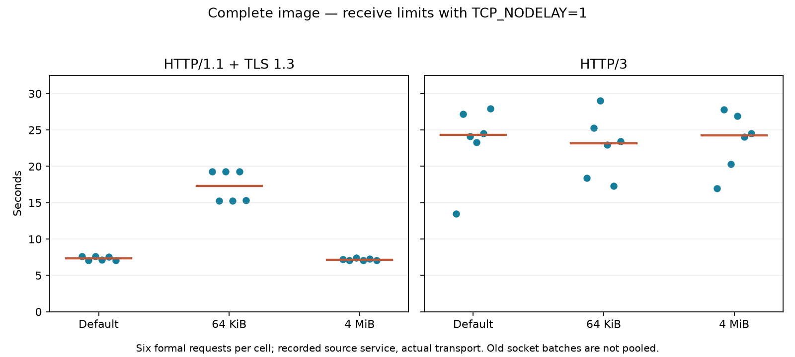
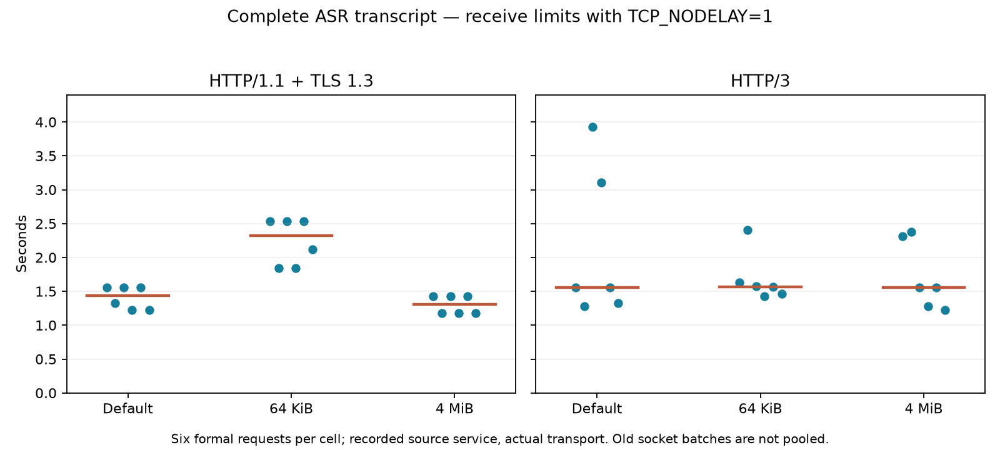
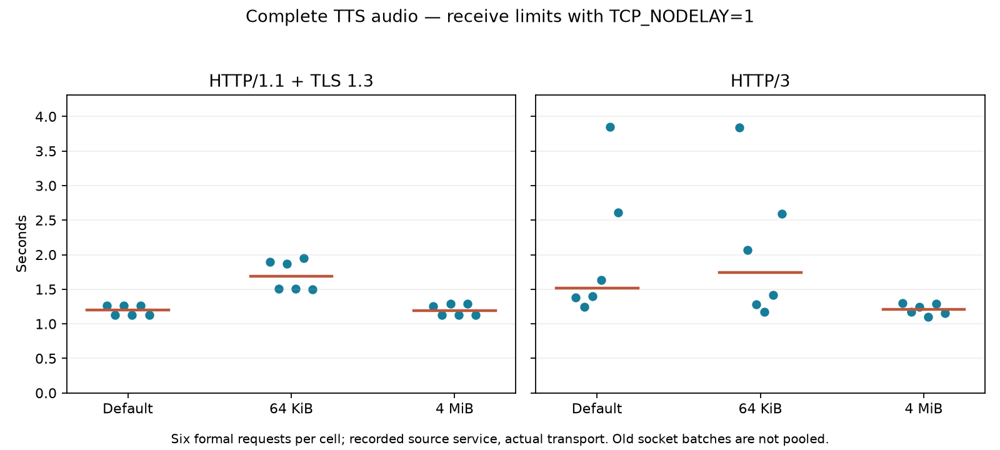
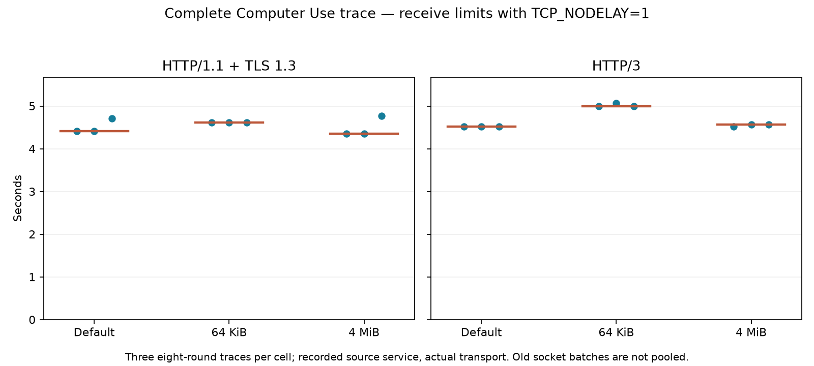
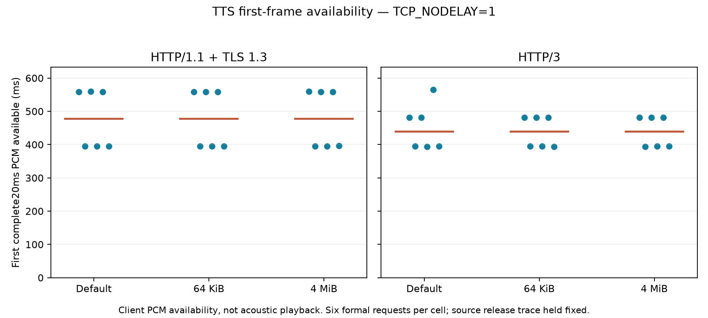

# Receive-window comparison with matched TCP socket settings

All324 exchanges passed independent verification:54 image,54 ASR,54 TTS and162 Computer Use rounds (252 formal,72 warmups). Every data-carrying TCP socket uses explicit TCP_NODELAY=1 and IPPROTO_TCP metadata,checked at client ready/close,server upload records/samples and the listener. This matches the setting reproduced for the earlier implicit asyncio client path. All36 own Docker containers were removed.

The [fresh socket diagnostic](../socket-defaults/README.md) explains why this full rerun was necessary:manual proto0 sockets in the earlier window batches bypassed asyncio's NODELAY default. Those earlier results remain intact and qualified. This rerun includes all protocols/configurations,including unchanged QUIC; old/new batches are not pooled. The diagnostic proves socket-option behavior,not that every old/new latency difference was caused solely by NODELAY.

Each workload uses three position-balanced receive-mode orders:default/64k/4m,64k/4m/default,4m/default/64k. TCP changes only SO_RCVBUF across modes; QUIC changes initial connection and stream credit on both endpoints. TCP readback doubles explicit requests to131072/8388608 bytes; default buffers may grow. QUIC defaults are1MiB each and credits may grow dynamically. A buffer bound is not an advertised wire window,and QUIC credit is not TCP congestion window.

## Complete usable-result timing

| Workload | Protocol | Default median seconds |64KiB median seconds |4MiB median seconds |
|---|---|---:|---:|---:|
| image | h1 | 7.364 | 17.311 | 7.154 |
| image | h3 | 24.347 | 23.185 | 24.279 |
| asr | h1 | 1.439 | 2.326 | 1.303 |
| asr | h3 | 1.557 | 1.570 | 1.558 |
| tts | h1 | 1.197 | 1.692 | 1.191 |
| tts | h3 | 1.517 | 1.743 | 1.212 |
| computer | h1 | 4.417 | 4.617 | 4.356 |
| computer | h3 | 4.519 | 4.990 | 4.566 |

Image/ASR/TTS cells each have six formal requests (three fresh/reused pairs). Computer Use cells have three complete eight-round traces,each one fresh connection followed by seven reused requests. Its pooled round medians are also saved, but the table uses complete trace duration. These are descriptive medians; all samples and slow tails are retained. Small differences do not establish statistical significance or a general protocol ranking.

Image completes after JPEG/RGB verification; ASR after exact UTF8 verification; TTS after complete WAV/PCM verification; Computer trace after the final stored action JSON validates. Request/trace timing excludes group connection cleanup. The original model/CPU service is replayed after complete upload,with no new GPU calls or browser actions. Source identities and quality limitations are unchanged from their live-computation records. Absolute timings with different cleanup/processing boundaries must not be pooled.

## TTS first playable bytes

The original294-part source client-read availability schedule is replayed,not replaced with a single model wait. First response body may be only the WAV header. Complete20ms/three-frame thresholds are1808/5336 bytes for the fixed mono44100Hz PCM16 WAV.

| Protocol | Mode | First body ms | First20ms PCM ms | Three frames ms |
|---|---|---:|---:|---:|
| h1 | default | 163.435 | 477.068 | 478.608 |
| h3 | default | 125.538 | 438.732 | 440.365 |
| h1 | 64k | 163.301 | 476.898 | 478.470 |
| h3 | 64k | 125.635 | 438.367 | 439.986 |
| h1 | 4m | 163.388 | 477.168 | 478.725 |
| h3 | 4m | 125.971 | 438.335 | 439.965 |

These are client byte-availability measurements. No speaker onset,microphone capture or physical acoustic closure is established.

## Execution and validation

Every subrun used the same pinned Docker image,network-none/NET_ADMIN,2CPU/2GiB,loopback netem40ms per traversal/20Mbit/s/0.1% random loss. Only one own benchmark container ran at a time. Previous short calibration is in ../controlled-network; configured rate is not identical to application goodput. Random drop positions,host scheduling and shared client/server event loop can affect results. Qlog and TCP sampling overhead is present in all conditions.

Workload analyzers verify exact source/result bytes and semantic format,the complete8-step Computer ordering or294-part TTS release plan,service waits/arrival conservation,TLS/ALPN/reuse,qlog headers/initial limits/MAX updates,TCP receive-buffer/TCP_INFO/NODELAY/proto readbacks,container resources and per-subrun cleanup. verify_all.py additionally requires final container absence and all324 valid exchanges. verification.json binds analyzer/runtime sources. Revalidate with python verify_all.py and regenerate figures/report with the matplotlib environment using python report.py.

This closes receive-limit coverage for the four workload types under the declared transport implementations. It does not replace remaining chunking/recovery cells or the final contribution review in ../COVERAGE-REVIEW.md. Fixed-trace delivery is not a new model-quality or live-browser benchmark.
