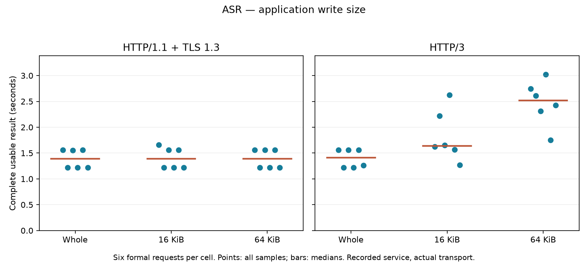
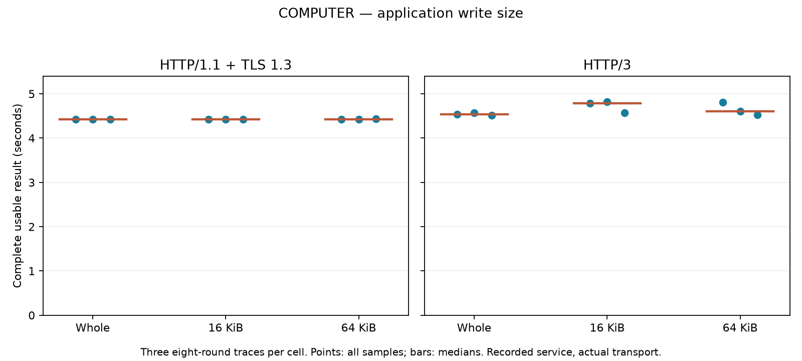
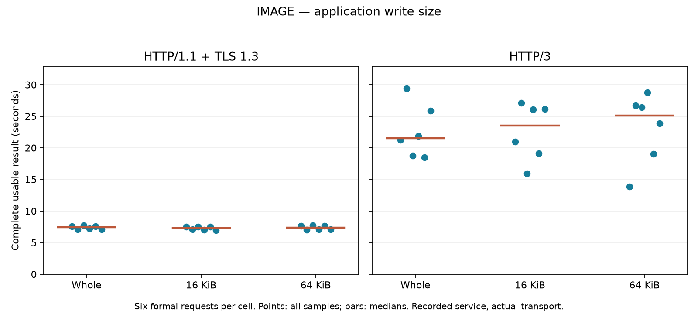

# Application write-size experiment

All 270 exchanges passed independent verification: 54 ASR, 162 Computer Use rounds and 54 image exchanges, including 216 formal exchanges and 54 warmups. Each workload used nine fresh Docker containers, with position-balanced whole/16KiB/64KiB write orders across three trials. Final container absence and every subrun removal are verified.

Both request and response bodies use the selected application write size. Small transcript/action responses fit in one write. Every write has an offset, length, source-slice hash and timing ledger. These sizes describe application writes, not HTTP chunked encoding, TLS records or QUIC packets. Per-write hashing and timing overhead are included. Source input is fully available before upload; recorded service starts after full upload; the full response becomes available after service. TTS source-availability/coalescing is covered separately in ../tts-chunking.

TCP_NODELAY=1 and IPPROTO_TCP=6 are verified. Receive buffers use the default policy, and QUIC initial connection/stream credit stays at 1MiB. Each isolated container uses 2 CPUs, 2GiB RAM and loopback netem configured for 80ms round-trip delay, 20Mbit/s and 0.1% loss. No new GPU inference or browser actions occur in these fixed-source transport runs.

| Workload | Protocol | Whole median seconds | 16KiB median seconds | 64KiB median seconds |
|---|---|---:|---:|---:|
| asr | h1 | 1.389 | 1.389 | 1.390 |
| asr | h3 | 1.410 | 1.637 | 2.518 |
| computer | h1 | 4.423 | 4.422 | 4.423 |
| computer | h3 | 4.533 | 4.790 | 4.608 |
| image | h1 | 7.406 | 7.269 | 7.365 |
| image | h3 | 21.531 | 23.509 | 25.133 |

Image and ASR cells contain three fresh/reused pairs. Computer Use cells contain three complete eight-round traces, each with one fresh connection followed by seven reused requests. All samples, including slow tails, remain in the summaries and figures. These descriptive medians do not establish significance or a general protocol ranking. Earlier receive-window or reuse batches are not pooled with this batch.

Complete-result timing ends after source-result verification: exact transcript, JPEG/RGB identity, or the last stored action JSON in the trace. Group connection cleanup is excluded. Per-write enqueue/drain timestamps are not wire-delivery timestamps. Source quality limitations remain those of the original computation records.

Analyzers independently check every application piece against source bytes, full response identity and semantic format, service waits, arrival conservation, connection reuse, TLS/ALPN, TCP socket settings, QUIC logs, container limits and cleanup. Run `python verify_all.py`, then `python report.py` with matplotlib installed. This completes the declared chunk-size matrix; recovery, cross-workload contribution review and acoustic measurements have separate status.
