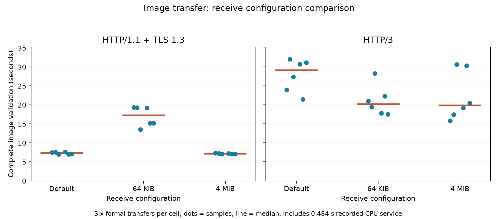

> Socket-default qualification: see [TCP_NODELAY diagnostic](SOCKET-DEFAULTS.md). A full matched rerun is complete in ../receive-windows; do not pool this batch with earlier implicit-socket TCP timings.

# Receive configuration and complete image transfer

This experiment compares default,64KiB and4MiB receive configurations using the exact original RAW and completed JPEG from [image processing](../image-records/README.md). Each real network request uploads10,656,312 bytes, waits the measured0.483963046s CPU service interval, returns4,556,971 JPEG bytes, and fully decodes/hashes the4284×2844 image. The processing interval is replayed; no new RAW development or GPU inference is claimed.

Three seeded repetitions used fresh Docker containers with netem80ms RTT,20Mbit/s,0.1% random loss,2CPUs/2GiB. Each protocol/configuration has one fresh and one reused formal request per repetition, plus a separately connected warmup. All54 exchanges (36 formal,18 warmups) passed upload/response/RGB identity, TLS/ALPN, connection reuse, service wait, qlogs and netem queue-drain checks.

| Receive setting | Protocol | Median complete seconds | Fresh median | Reused median |
|---|---|---:|---:|---:|
| default | h1 | 7.293 | 7.546 | 7.026 |
| default | h3 | 29.099 | 30.769 | 27.429 |
| 64k | h1 | 17.219 | 19.276 | 15.195 |
| 64k | h3 | 20.227 | 19.477 | 22.300 |
| 4m | h1 | 7.169 | 7.266 | 7.088 |
| 4m | h3 | 19.844 | 17.493 | 30.325 |

Dots retain all six formal values per cell; median splits contain only three values each. The seeded mode shuffles happened to produce the same order (4MiB,default,64KiB) in all three repetitions, as results/order.json records. The design therefore did not counterbalance mode order; time/order effects remain a limitation, especially for the variable HTTP/3 results. These small, stochastic batches describe this implementation and controlled loopback path. They do not establish statistical significance or a general best protocol/window. The pair-wide median mixes fresh and reused requests.

## What actually changed

TCP changes only SO_RCVBUF before connect and on the listener before accept. Defaults leave Linux receive autotuning available; explicit settings lock that buffer choice. Linux reports double the requested buffer size:131072 bytes for64KiB and8388608 bytes for4MiB. This readback is not the advertised TCP window. The default observed buffer can grow. Actual TCP_INFO records are retained at client ready/close and sampled on server sockets every100ms. Offsets were compiled from the RTX host linux/tcp.h with tcp_offsets.c; source header, kernel identity and raw bytes are archived. tcpi_snd_wnd reports the peer advertised receive window, tcpi_snd_cwnd is segments, and the limit timers are microseconds.

QUIC changes both initial connection max_data and stream max_stream_data on both endpoints. Default aioquic1.3.0 values are1MiB each. Qlogs verify local/remote advertised initial limits and subsequent MAX_DATA/MAX_STREAM_DATA updates; limits grow dynamically, so64KiB is not a permanent ceiling. TCP buffer sizing and QUIC credit sizing are distinct mechanisms. This experiment does not change the congestion algorithm or equate the two settings.

| Trial/config | Observed server TCP buffer bytes | Sampled peer window min–max bytes | QUIC initial limit bytes | Observed MAX_DATA min–max |
|---|---|---|---:|---|
| trial0-4m | [8388608, 8388608] | [196608, 8212608] | 4194304 | [8388608, 67108864] |
| trial0-default | [131072, 6291456] | [83968, 6148608] | 1048576 | [2097152, 67108864] |
| trial0-64k | [131072, 131072] | [83688, 116050] | 65536 | [131072, 67108864] |
| trial1-4m | [8388608, 8388608] | [196608, 8212608] | 4194304 | [8388608, 67108864] |
| trial1-default | [131072, 6291456] | [83968, 6148608] | 1048576 | [2097152, 67108864] |
| trial1-64k | [131072, 131072] | [83690, 116050] | 65536 | [131072, 67108864] |
| trial2-4m | [8388608, 8388608] | [196608, 8257536] | 4194304 | [8388608, 67108864] |
| trial2-default | [131072, 6291456] | [83968, 6148608] | 1048576 | [2097152, 67108864] |
| trial2-64k | [131072, 131072] | [83688, 116050] | 65536 | [131072, 67108864] |

| Trial/config | Client receive-window-limited time µs | Client busy time µs | Ratio |
|---|---:|---:|---:|
| trial0-4m | 790000 | 13686000 | 5.8% |
| trial0-default | 621000 | 13838000 | 4.5% |
| trial0-64k | 34030000 | 34653000 | 98.2% |
| trial1-4m | 765000 | 14003000 | 5.5% |
| trial1-default | 622000 | 13925000 | 4.5% |
| trial1-64k | 35754000 | 36259000 | 98.6% |
| trial2-4m | 790000 | 13642000 | 5.8% |
| trial2-default | 620000 | 13829000 | 4.5% |
| trial2-64k | 35600000 | 36008000 | 98.9% |

These cumulative client counter deltas include the TCP warmup connection and the two-request formal connection. The ratio describes time marked receive-window-limited by the kernel among its busy time; it is not a fraction of total end-to-end task time, nor a separate throughput measurement.

The sampled peer-window range includes handshake/idle and active phases; do not read its minimum as a sustained transfer limit. Per-connection TCP counters and QUIC frame counts in summary.json provide further diagnostics. Fixed source identity, readbacks and negotiated parameters verify the intervention; they alone do not prove the cause of every latency difference.

The client/server share one container event loop; qlog and100ms TCP sampling overhead is present in every batch. Random drop placement, congestion recovery, CPU scheduling and receive behavior can differ. The larger image is useful for sustained-transfer testing; these results are not automatically the window contribution for the much smaller ASR/TTS/Computer Use records. Previous profile calibration is in ../controlled-network. No host route/sysctl changes were made. All nine own containers were removed.

Reproduce with orchestrate.py on the RTX, preserving the sibling image-records fixture. Revalidate with python analyze.py; generate the figure/report with the local matplotlib environment and python report.py. Fresh result directories are required. PROTOCOL.md records the design before execution. Window configuration is now measured for the image workload; interrupted recovery and final cross-workload coverage review remain open in12-4.
