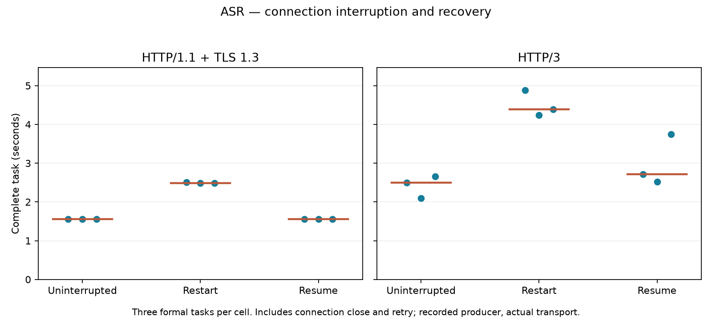
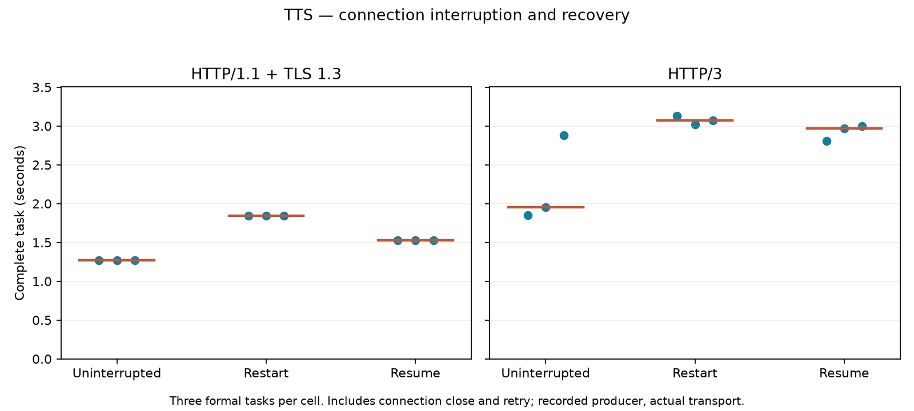
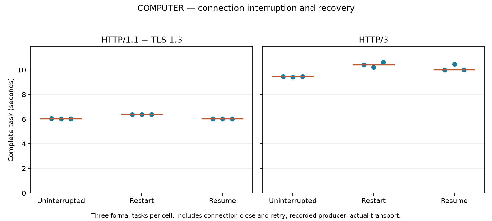

# Interrupted workload recovery

Independent verification passed for 60 tasks (54 formal), 222 exchanges and 36 injected interruptions. This is an application recovery experiment using actual HTTP/1.1 + TLS and HTTP/3 transfers under container loopback netem: configured 80ms RTT, 20Mbit/s and 0.1% loss. Each workload ran serially in its own pinned Docker container with 2 CPUs and 2GiB RAM. All own containers were removed.

The independent producer replays recorded source availability and survives a client disconnect. ASR disconnects after upload and response headers, before the transcript; Computer Use disconnects at that boundary only in round3 of its eight-round trace. TTS disconnects after retaining at least one complete20ms PCM frame, including any read overshoot. Every fault is checked to occur before its producer finishes.

Restart creates a new operation and replays source service; resume retrieves the original operation with no request-body reupload. TTS resume requests the exact retained-byte offset and concatenates only the remaining suffix. Already delivered Computer actions are retained. This does not simulate an action that executed but lost its acknowledgment, nor establish idempotence of arbitrary browser side effects.

Every final transcript, WAV/PCM stream and action sequence is reconstructed from raw received files and checked against the original fixed source. Producer release times and response emissions are independently checked against recorded availability. No fresh GPU inference or browser task occurs during these transport replays. TTS continuity here means exact bytes; it does not establish uninterrupted audible playback.

| Workload | Protocol | Uninterrupted median seconds | Restart median seconds | Resume median seconds |
|---|---|---:|---:|---:|
| asr | h1 | 1.556 | 2.490 | 1.556 |
| asr | h3 | 2.495 | 4.389 | 2.719 |
| tts | h1 | 1.270 | 1.844 | 1.527 |
| tts | h3 | 1.951 | 3.074 | 2.970 |
| computer | h1 | 6.026 | 6.389 | 6.029 |
| computer | h3 | 9.460 | 10.429 | 10.020 |

Each cell has three formal tasks. Computer Use timing covers all eight rounds. Each exchange opens a fresh connection; task timing includes connection teardown, recovery setup and result validation. The earlier reuse/window/chunk runners use different connection and cleanup boundaries, so these absolute timings are not pooled. Source work can finish while a connection is closing; recovery does not assume that the original operation is still pending when the retry starts.

| Workload | Protocol | Policy | Upload bytes per task | Retained bytes per task | Discarded prefix bytes per task | Source jobs per task |
|---|---|---|---|---|---|---|
| asr | h1 | uninterrupted | [1183788, 1183788, 1183788] | [253, 253, 253] | [0, 0, 0] | [1, 1, 1] |
| asr | h1 | restart | [2367576, 2367576, 2367576] | [253, 253, 253] | [0, 0, 0] | [2, 2, 2] |
| asr | h1 | resume | [1183788, 1183788, 1183788] | [253, 253, 253] | [0, 0, 0] | [1, 1, 1] |
| asr | h3 | uninterrupted | [1183788, 1183788, 1183788] | [253, 253, 253] | [0, 0, 0] | [1, 1, 1] |
| asr | h3 | restart | [2367576, 2367576, 2367576] | [253, 253, 253] | [0, 0, 0] | [2, 2, 2] |
| asr | h3 | resume | [1183788, 1183788, 1183788] | [253, 253, 253] | [0, 0, 0] | [1, 1, 1] |
| tts | h1 | uninterrupted | [398, 398, 398] | [1183788, 1183788, 1183788] | [0, 0, 0] | [1, 1, 1] |
| tts | h1 | restart | [796, 796, 796] | [1187928, 1187928, 1187928] | [4140, 4140, 4140] | [2, 2, 2] |
| tts | h1 | resume | [398, 398, 398] | [1183788, 1183788, 1183788] | [0, 0, 0] | [1, 1, 1] |
| tts | h3 | uninterrupted | [398, 398, 398] | [1183788, 1183788, 1183788] | [0, 0, 0] | [1, 1, 1] |
| tts | h3 | restart | [796, 796, 796] | [1186163, 1186163, 1186163] | [2375, 2375, 2375] | [2, 2, 2] |
| tts | h3 | resume | [398, 398, 398] | [1183788, 1183788, 1183788] | [0, 0, 0] | [1, 1, 1] |
| computer | h1 | uninterrupted | [930996, 930996, 930996] | [302, 302, 302] | [0, 0, 0] | [8, 8, 8] |
| computer | h1 | restart | [1047515, 1047515, 1047515] | [302, 302, 302] | [0, 0, 0] | [9, 9, 9] |
| computer | h1 | resume | [930996, 930996, 930996] | [302, 302, 302] | [0, 0, 0] | [8, 8, 8] |
| computer | h3 | uninterrupted | [930996, 930996, 930996] | [302, 302, 302] | [0, 0, 0] | [8, 8, 8] |
| computer | h3 | restart | [1047515, 1047515, 1047515] | [302, 302, 302] | [0, 0, 0] | [9, 9, 9] |
| computer | h3 | resume | [930996, 930996, 930996] | [302, 302, 302] | [0, 0, 0] | [8, 8, 8] |

Retained/discarded application bytes do not count wire overhead or bytes already queued by the server. Post-interruption and connection-close durations are retained per task in the summary accounting.

All samples are retained. Descriptive medians from three trials do not establish statistical significance or a general protocol ranking. Expected server reset/broken-pipe errors are retained and accepted only for deliberately interrupted operations; other server errors fail verification. The release/emission ledger is not a wire-packet trace.

Run `python verify_all.py` to reconstruct outcomes, validate operation counts, fault timing, source and response identities, release schedules, TLS/ALPN, TCP_NODELAY/proto metadata, QUIC parameters, resource isolation and cleanup. Run `python report.py` with matplotlib for this report and figures. Source bindings and the artifact manifest support reproduction. Physical acoustic measurement and the parent exercise's final contribution review have separate status.
