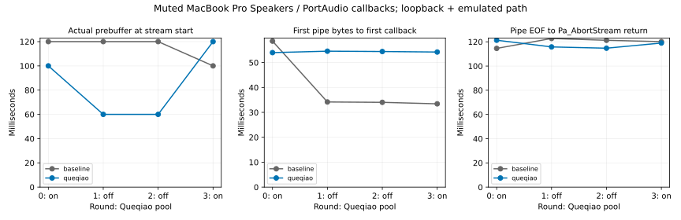

# 12-7：Queqiao 固定音频与真实输出设备回调

**真实设备回调变体完成，12-7 总体仍部分完成。** 本地 MacBook Pro Speakers 经 PortAudio/CoreAudio 实际请求输出缓冲，消费了经过原生 Queqiao／TUIC 的固定 PCM。8 次完整流的网络接收和回调消费均逐字节一致，8 次主动取消均保留正确输入前缀；本轮没有源缓冲不足或驱动输出欠载标志。输出在本进程回调中静音，没有改系统音量，也没有声学测量。



## 固定输入与实际设备

Queqiao 原生源码固定提交 `496ca6278e359c02b5107dfab77c6a3db585f80d`，source-lock.json 绑定 266 个原始源码／模块／许可证文件；只新增实验 harness。fixture/audio.wav 与先前真实 Fish 合成的标准 WAV 逐字一致，1183744 byte PCM、mono PCM16、44100 Hz。所有条件同一音频，不再调用模型；数据完整性不代表人工听辨验收。

Mac 实际为 M2 Max、96 GiB、macOS 26.6.2 arm64，Go1.25.13、系统Python，原有 PortAudio V19.7.0-devel revision `147dd722548358763a8b649b3e4b41dfffbcfbb6`。每条件记录动态库 SHA。device-readiness.json 记录默认 MacBook Pro Speakers、2输出通道、默认48000Hz；host-api.json 绑定 Core Audio。实验向 PortAudio 请求 mono 44100Hz、882frame/callback；所有回调实际交付882frame。不能据此宣称物理DAC时钟改成了44100Hz，宿主转换和缓冲仍在。

计时字段的 ABI/定义依据本机固定 [portaudio.h](sources/portaudio.h)。api_output_dac_time 是 PortAudio 给出的输出时间，未用麦克风核对，不当作实际出声测量。PaStreamCallback 中的数据源不足和 flags 的 paOutputUnderflow 位分开记录；EOF 最后一块的补零不算中途欠载。

## 路径与时钟

沿用固定音频隧道协议：native Queqiao/TUIC、loopback sockets、userspace pathsim 40ms RTT／100Mbit/s／500000byte队列／seed1207／零配置丢包。四轮 pool on/off/off/on，每轮 baseline 然后 queqiao；8完整流后同序执行8取消。每条件重建代理和模拟器并预热，origin 每20ms发送1764byte。

Go接收逐帧PCM并写入独立Python helper的stdin。helper至少收到5292byte才启动真实设备；设备回调每次从实际队列取样本，然后将本stream输出缓冲清零静音。这样测到的是实际设备回调节拍下的队列消费，不是相对sleep模拟；但Python回调、GIL、日志、pipe、进程和设备初始化均有开销，也不符合生产硬实时回调的最佳实践。

**实际预缓冲不是固定三帧。** Pa_StartStream调用时累积60–120ms音频，首次callback时还可能更多。不同条件不能忽略这个差异，再把所有时间差归因连接池。图中首字节到callback从helper收到首批pipe数据起算，不是从HTTP请求、模型开始或网络客户端开始起算。

## 完整流全部结果

|轮次／池|基线启动缓冲 ms|Queqiao启动缓冲 ms|基线pipe首批→首callback ms|Queqiao pipe首批→首callback ms|
|---|---:|---:|---:|---:|
|0／on|120|100|58.604|53.990|
|1／off|120|60|34.180|54.565|
|2／off|120|60|34.033|54.430|
|3／on|100|120|33.437|54.225|

每个完整条件672次callback，累计消费1183744byte PCM；消费SHA与原件一致。最后100byte尾部所在callback补1664byte静音至882frame，这不是播放中途饥饿。8条件source_starvation_bytes=0，paOutputUnderflow标志计数=0。没有足够样本推出长期/压力下零欠载；静音意味着本轮不提供人耳听感、声学起播或扬声器输出音质证据。

## 取消的设备边界

网络客户端收到10帧后关闭，helper读到17640byte后pipe EOF，判断它短于完整音频并调用Pa_AbortStream。以下从pipe EOF读取完成到AbortStream返回；这是本地设备API路径，不是前一批origin观察到EOF的网络传播。

|轮次／池|基线 ms|Queqiao ms|
|---|---:|---:|
|0／on|114.578|121.322|
|1／off|122.764|115.797|
|2／off|121.267|114.744|
|3／on|120.166|119.014|

每条件只消费3–5个callback的PCM前缀后停止；8个前缀逐字一致。analysis.json另列AbortStream调用自身耗时，可区分轮询等待与API返回。不要把返回时刻等同最后一个物理声波消失，API已排队的输出时间和声学尾部未独立测量。也没有远端模型生成可取消。

## 独立复现与原件

```sh
python3 pa.py
python3 run.py
python3 analyze.py
python3 plot.py
```

本目录独立，不导入其他实验代码或依赖原Queqiao仓库、TTS服务/GPU。实跑需要Mac内置扬声器、可用Go和此版本PortAudio；pa.py默认加载`/opt/homebrew/lib/libportaudio.2.dylib`，sink.py明确检查物理设备名。迁移机器/设备须另记配置和版本，不能直接继承此结果。Go工具链和模块可由GOTOOLCHAIN=auto获取；plot.py需要Matplotlib，离线分析仅需Python标准库。run.py要求runs不存在；复现请用副本并移除副本runs。

Go 16子条件全通过，主进程exit0，运行143.233秒（不含构建）。每条件保留原生网络事件、received.pcm、设备pipe读取、device-callbacks.jsonl、device-consumed.pcm、device.json和完整日志。result.json沿用harness的sink_frames=0占位，**不用于计数**；实际callback数量以device.json与逐callback原件为准，实际消费字节也独立核验。原始字段不事后改写。

analyze.py检查全部PCM与前缀、回调消费守恒、读取偏移、单调时钟、API输出时间、启动缓冲、尾部补零、取消顺序及驱动标志。完整成功重复和事前取消均保留，未留下启动失败记录。只删除构建二进制和Python字节码缓存，不删除原始音频。

还缺真实WAN路径、声学闭环和实时模型取消回执；不重算C70历史记录，也不修改calculations/。
