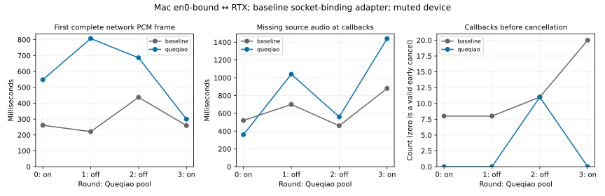

# 12-7：显式绑定 en0 的两端音频

**接口绑定变体已取得有效测量；全实验仍部分完成。** 两栈显式绑定Mac物理接口en0，RTX看到的26个UDP来源socket都匹配绑定探测的出口哈希，且与默认TUN路径的出口不同。8次完整音频一致；完整流仍有360–1440ms源不足。3次取消发生在首个设备回调前，这是有效的提前取消，不应为了得到非零回调而重新采样。



## 绑定证据与基线适配

固定Queqiao提交 `496ca6278e359c02b5107dfab77c6a3db585f80d`。Queqiao原生LocalAddress支持if:en0；但该版本TUIC基线只解析本地IP，不能直接使用同样语法。初次配置批次因此无效，已清理并替换。

最终基线使用[明确的socket绑定补丁](baseline-binding.patch)：新增netbind导入，将本地地址解析改为ResolveWithInterface，将UDP创建改为带InterfaceControl的ListenConfig。认证、拥塞控制、QUIC/TUIC传输代码没有改动。原始文件在[sources/baseline-original.go](sources/baseline-original.go)，前后SHA在baseline-binding-patch.json；原始source-lock.json中265文件未变，1个文件按补丁校验。因此应称“TUIC基线socket绑定适配版”，不能冒充该提交无需改动便支持此配置。原Queqiao工作树未修改。

接口探测以bound/default/default/bound顺序发送64和1200byte各一包，8/8回包一致；Darwin IP_BOUND_IF=25读回en0索引14，默认socket读回0。绑定RTT196.267–235.537ms，默认路径290.528–741.603ms，仅是8个观测，不当作总体延迟分布。interface-reference保留原始记录；绑定与默认路径的来源IP哈希不同。

音频运行中，RTX在原生PacketConn外仅观察每个新来源socket的IP哈希、端口和首包字节数，不改报文。26个来源覆盖两栈，全部匹配绑定探测出口。这结合原生接口绑定代码与内核probe读回，支持本轮显式接口路径；不能据一个出口地址宣称所有中间链路均无隧道。系统路由与已有TUN保持原样。

## 真实条件

Mac M2 Max、96GiB、macOS26.6.2、Go1.25.13，经真实静音PortAudio/CoreAudio回调消费；RTX为真实UDP服务器和loopback音频origin。没有pathsim，没有SSH音频转发。原生server绑定UDP19280/19281，音频/预热origin只在RTX loopback19282/19283；临时证书和授权设备用于认证。

固定同一Fish PCM1183744byte，mono44100Hz PCM16，origin每20ms发送1764byte，最后100byte保留。pool on/off/off/on四轮，每轮基线在前、Queqiao在后；8完整流后同序8取消。客户端先预热。设备至少三帧缓冲后启动，helper/pipe/日志开销实际存在；输出清零静音，不修改系统音量，没有声学测量。

本轮与前一TUN路由批次不在同一时段，不能把两批差值直接归为TUN开销。更不能以某个轮次的较低值宣称协议普遍胜出。

## 完整流全部结果

首帧从预热后建立音频SOCKS连接之前的客户端时刻开始计，终点为完整1764byte PCM读取完成；不包括模型生成、进程准备，也不是实际出声时刻。

|轮次／池|基线首帧 ms|Queqiao首帧 ms|基线源不足 ms|Queqiao源不足 ms|
|---|---:|---:|---:|---:|
|0／on|261.053|548.026|520|360|
|1／off|220.753|807.498|700|1040|
|2／off|436.901|685.960|460|560|
|3／on|258.975|299.528|880|1440|

8次网络接收与回调消费均逐字节等于固定PCM。源不足是回调请求时尚未到达的样本，按PCM格式换算；驱动paOutputUnderflow标志为0不否定源不足。全部慢样本和源不足保留。设备输出静音，所以没有人耳停顿或声学起播结论。

## 提前取消与验收修正

|轮次／池|基线callback数|Queqiao callback数|基线pipe EOF→abort返回 ms|Queqiao ms|
|---|---:|---:|---:|---:|
|0／on|8|0|123.967|151.442|
|1／off|8|0|121.191|149.277|
|2／off|11|11|106.554|120.236|
|3／on|20|0|112.429|148.194|

8次均收到10帧、17640byte后主动关闭，RTX均观察到EOF；两主机未校时，不相减计算跨机取消时延。设备回调消费部分样本或零样本后abort，均为输入的正确前缀。数据在首个设备回调前已到齐并取消时，可以合法地没有任何回调。

旧sink末尾断言错误地要求所有条件callbacks非空，导致3次零回调取消在**完成测量之后**被包装器报错，原native wrapper exit=1。这不是网络失败或缺失声音。runs/executed-sink.py保存实际执行的旧版本并与execution.json的SHA一致；当前sink.py仅修正这条验收条件。没有重新采样来消除这些零值，最终analyze.py基于实际字节计数、SHA、读取/关闭事件、回调数据和发送端EOF核验16条件通过。

证据区别明确保留：8完整和5取消有接收PCM原件；3个零回调取消在Go包装器写received.pcm之前触发旧断言，**没有该接收文件，也未重建冒充原件**。它们保留helper实际输入SHA/长度、10帧网络读取、pipe读取、空消费PCM、完整device.json/abort时刻及远端EOF，输入SHA均等于固定音频前17640byte的SHA。消费空文件与零回调一致。

旧验证器的3份调试堆栈已移除；runs/client-events.log是明确标注的过滤日志，不伪装成原始Go PASS。原exit1、过滤前SHA、删除清单和修正说明在runs/legacy-validation.json。最终测量核验成功不意味着原包装器exit0。正式提前取消数据完整保留。

## 独立复现

```sh
python3 run.py --remote-root /home/ubuntu/ai-infra-book-experiments/reproduce-audio-physical
python3 analyze.py
python3 plot.py
```

使用副本并移除runs及probe/runs；远端目录必须尚不存在。需相同Mac物理设备、en0、既定PortAudio、Go、ssh rtx-pro和rsync。run.py现会先做新的接口探测并更新interface-reference，避免出口变化后继续使用旧哈希；本轮该探测在主测试前独立完成。build.py验证265原始文件和1份精确绑定补丁，构建Mac client/Linux amd64 server。所有依赖代码/固定音频均在本目录；无需原Queqiao项目或GPU模型。

当前sink.py已允许提前取消无回调；原采集仍按executed-sink.py追溯。客户端批次165.583秒，服务器终态PASS，临时服务、密钥和二进制已清理。有效样本不因旧验证器误判而重复采集。

尚缺声学闭环和实时模型取消回执；固定音频重放没有生成任务可取消。不复算C70历史记录，不修改calculations/。
