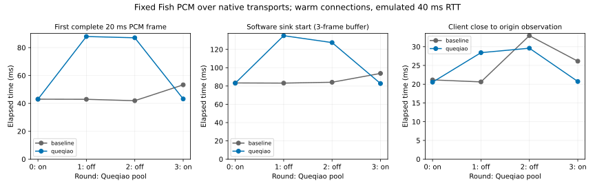

# 12-7：固定音频经过 Queqiao 的逐帧接收与取消传播

**本地音频传输变体已实跑；12-7 总体仍部分完成。** 同一份真实 Fish PCM 经原生 Queqiao／TUIC 基线传输，8 次完整接收全部逐字节一致，8 次主动取消均收到正确的前 10 帧。三帧预缓冲的软件消费端没有空缓冲等待；发送端在客户端关闭后 20.5–32.9 ms 观察到 EOF 并停止发送。这些是本地模拟路径和软件缓冲结果，不代表物理声卡播放、真实 WAN 或模型生成取消。



## 固定条件与实现

Mac 实际为 Apple M2 Max、96 GiB、macOS 26.6.2 arm64，Go 1.25.13。Queqiao 提交 `496ca6278e359c02b5107dfab77c6a3db585f80d` 的 266 个源码／模块／许可证文件固定在 source/，由 source-lock.json 校验。仅添加 [book_audio_test.go](source/cmd/queqiaobench/book_audio_test.go) 实验 harness，调用原生 startStack、warmUp 和 socksConnect，没有修改 Queqiao 或 baseline 传输实现。

baseline 是固定源码中的 TUICTransport，两栈均 BBR-TUIC。实际 loopback TCP/UDP socket，userspace pathsim 配置 RTT 40 ms、100 Mbit/s、500000 byte 队列、零配置丢包、seed 1207；没有系统级网络隔离，主机调度仍能改变实测时间。四轮 pool on/off/off/on，每轮 baseline 在前、queqiao 在后；全部完整流结束后，按相同顺序执行取消条件。只改变 Queqiao pool，baseline 不使用该开关。两个模式及四轮正式重复不能合并成独立 WAN 样本。

音频为先前真实 Fish 合成的最后一次完整流式响应，只修正 WAV 长度字段，PCM 字节未变：1183744 byte、13.4211 s、mono 44100 Hz PCM16。fixture/source.json 保存来历和 SHA；本次无需模型、RTX 或 TTS 服务。所有条件必须还原同一 PCM 或它的规定前缀。内容相同证明本次传输未改变样本，不代表已经人工确认语音质量。

每条件重建代理和模拟器，以原生 1024-byte 请求预热，然后连接新的音频 origin。**首帧计时从预热后、客户端建立 SOCKS 音频连接之前开始**；不包含进程启动、预热、TTS 生成。服务器收到 g 字节后，每 20 ms 向 socket 写 1764 byte；672 次写入中的最后一次为 100 byte，保留所有尾样本。原生 relay 统计在结束时采样，包含预热和控制包，不能当成纯音频流量。

## 完整流全部结果

|轮次／池|基线首帧 ms|Queqiao 首帧 ms|基线软件消费开始 ms|Queqiao 软件消费开始 ms|
|---|---:|---:|---:|---:|
|0／on|43.016|43.016|83.341|83.085|
|1／off|42.931|87.950|83.169|134.996|
|2／off|41.934|87.056|84.109|127.468|
|3／on|53.311|43.214|93.785|82.715|

全部 8 次收到并消费 1183744 byte，PCM SHA 都为 `26ae9256da89db184f63c3d8f11ea5cc029852c3167018117a9c274544f55f96`。完整流最后一帧小于 io.ReadFull 所要求的 1764 byte，故原生 reader_end 为 unexpected EOF；已按完整文件和尾部 100 byte 校验，不是传输缺失或应删的失败。

软件 sink 实际先等待三个完整帧，再通过 Go timer 按样本时长逐帧消费。每帧计时从上帧消费开始后等待，而非追赶绝对时间轴；调度延迟会延长消费过程、积累缓冲。因此“全部条件零空缓冲等待”只适用于这个明确的消费策略，不能推出严格声卡时钟也不会欠载。它没有打开 DAC，也没有测量人耳感知。两次/池条件不足以作普遍性能或显著性结论。

## 取消传播全部结果

取消在接收第 10 个完整帧后发生；客户端保存 17640 byte。下表从客户端 close 调用开始到 origin 反向读取获得 EOF，不是到模型停止。

|轮次／池|基线 ms|Queqiao ms|
|---|---:|---:|
|0／on|21.143|20.542|
|1／off|20.612|28.410|
|2／off|32.948|29.597|
|3／on|26.132|20.719|

8 次 origin 都实际读到 EOF，随后记录 origin_stop_peer；没有用超时或本地 writer 关闭冒充取消传播。7 次 origin 已写 21168 byte，另一次基线已写 22932 byte，说明取消前后在途数据仍存在，客户端收到 10 帧不意味着发送端恰好只做了 10 帧工作。软件 sink 也观察到取消并停止。它是本实验 TCP 音频 origin 的停止，没有 Fish 生成任务或 GPU 可取消。

## 独立运行与检查

```sh
python3 run.py
python3 analyze.py
python3 plot.py
```

需要 Go；GOTOOLCHAIN=auto 可获取 go.mod 指定版本及模块。plot.py 需要 Matplotlib，分析仅用 Python 标准库。run.py 要求 runs 不存在，复现应使用副本并移除副本 runs，保护正式原件。它核对所有固定源码，编译本地实验二进制，仅选择 TestBookAudioReplay；16 个子实验通过、主进程 exit 0，实际运行 142.048 s。构建时间不计入该区间。二进制在完成后删除，SHA、工具链和依赖版本留在 runs/execution.json。

每条件有 events.jsonl、received.pcm、result.json。事件记录原生 socket write、read、软件消费及取消的单进程单调时钟；日志串行化本身可能扰动计时，不当作无开销网络性能。analyze.py 校验事件序号/单调时间、逐帧连续性、字节守恒、三帧预缓冲、取消顺序及全部 PCM／前缀 SHA。analysis.json 中 physical_playback_ms、audible_stalls、model_cancel_ms 留 null。全量事件与正式重复、主动取消均保留，没有启动失败记录。

后续仍需真实设备播放时钟、WAN 路径条件，以及实时合成接口的取消回执。实验不读写 C70 历史数据，也不修改 calculations/。
