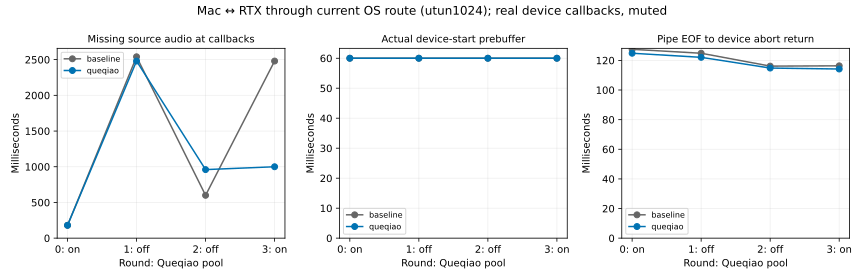

# 12-7：Mac—RTX 两端音频与当前系统路由

**两端变体已完成，尚不是无隧道的公网基线。** 同一 PCM 经原生 Queqiao／TUIC 从 RTX 发到 Mac，8次完整音频逐字节一致，8次取消前缀一致。但当前 Mac 路由经过 **utun1024**：必须把它视为现有系统路由条件，不能称为已经绕过代理、证明纯UDP物理路径或原论文路径。

完整流出现180–2540ms等量源数据不足，而PortAudio驱动欠载标志仍全为0。因此“驱动没报错”和“音频源始终够用”是不同结论。慢样本与源不足全部保留。



## 路径、版本和固定条件

[local-route.txt](local-route.txt)是本轮原件，接口utun1024、网关198.18.0.1；没有修改系统路由或防火墙。应用层数据使用native UDP，SSH只部署和读取记录，**没有用SSH转发音频**。但既有TUN的转发策略、底层载体与其他负载未控制，不能把结果全部归因Queqiao。

Mac M2 Max、macOS26.6.2 arm64，实际静音MacBook Pro Speakers回调；RTX为原有Ubuntu主机，Go服务不使用GPU，也不调用模型。Queqiao固定提交 `496ca6278e359c02b5107dfab77c6a3db585f80d`；source-lock.json绑定266原始文件，另有两个实验harness。Go1.25.13，Mac原生构建、Linux amd64 CGO_ENABLED=0交叉构建；完整版本、依赖、二进制和harness SHA见runs/build.json。

RTX基线UDP19280／Queqiao UDP19281，音频origin只监听RTX loopback19282，预热origin只监听19283。两栈使用新建临时认证材料，验证服务器证书；Queqiao设备由本次provider授权，不关闭认证。发送端、客户端和音频origin都是真实执行，没有pathsim。实验结束服务已退出，临时密钥和二进制已从两端删除。

固定Fish音频PCM1183744byte、mono44100Hz PCM16，与前一变体逐字一致。origin每20ms发送1764byte，最后100byte保留。client通过128byte定长条件标签关联两端记录；两栈同样控制请求形状。四轮pool on/off/off/on，每轮baseline在前、queqiao在后；全部8完整流结束后同序跑8取消。每条件新建客户端并预热。baseline不读取pool，比较它的轮次变化可见路径/时段并不稳定。

Mac接收PCM经pipe交给PortAudio helper，至少三帧后启动；本批实际启动缓冲全部5292byte（60ms）。回调消费真实样本，然后将本stream输出缓冲置零静音，不改系统音量。请求882frame/44100Hz，source starvation表示callback所需音频中尚未到达的字节，时长按PCM采样格式换算；不是声学实测。Python/pipe/日志开销仍在。

## 全部完整流

|轮次／池|基线源不足 ms|Queqiao源不足 ms|基线callback数|Queqiao callback数|两者驱动欠载标志|
|---|---:|---:|---:|---:|---:|
|0／on|180|180|681|681|0|
|1／off|2540|2480|799|796|0|
|2／off|600|960|702|720|0|
|3／on|2480|1000|796|722|0|

8次网络接收和回调消费均完整1183744byte，SHA与固定PCM一致。回调中因源不足插入的静音不算作原始音频样本；因此完整文件最终收到不等于实时播放连续。驱动按时获得了程序提供的输出缓冲，所以没有paOutputUnderflow标志，也不否定应用数据不足。

RTX完整流最大相邻write间隔约21.0–22.1ms，原件逐帧保存；没有在origin故意注入数秒停顿。仍不能仅凭这一点把所有源不足精确分配给某条链路：网络/TUN/接收端和设备调度均可能影响到达。

## 取消和时钟

取消客户端收10帧后关闭，保存17640byte正确前缀。RTX每条件都记录到反向EOF；Mac设备回调消费已到达前缀并收到abort。两主机未校时，origin的ns与client的ns有不同原点，**不相减计算跨主机取消传播**，analysis.json的cross_host_cancel_ms保留null。

|轮次／池|基线pipe EOF→设备abort返回 ms|Queqiao ms|
|---|---:|---:|
|0／on|127.466|124.819|
|1／off|124.816|122.061|
|2／off|116.129|114.817|
|3／on|116.329|114.186|

取消round2/off的Queqiao在停止前也出现20ms源不足，保留原件。设备API返回不是最后声波消失或GPU停止；本次固定音频重放没有生成任务。正式取消不是应删的调试失败。

## 复现

在本目录副本中删除runs，以新的、尚不存在的远端目录执行：

```sh
python3 run.py --remote-root /home/ubuntu/ai-infra-book-experiments/reproduce-audio-wan
python3 analyze.py
python3 plot.py
```

需要本机既定PortAudio/物理输出设备、Go、ssh rtx-pro、rsync及相同主机地址可达。build.py、client.py和Go setup/server/client子命令在本轮分步实际执行；run.py把同样步骤串联，并保护已有原件，未为了验证该编排脚本再次重复16条件。每次新认证材料仅在private目录临时存在，结束后移除。无需原Queqiao项目、GPU模型或其他实验目录。仅离线分析可在普通Python环境运行；绘图需要Matplotlib。

Mac主测试16子条件全部通过、exit0、172.788秒；RTX日志有Go终态PASS，随后核对PID和UDP监听均已消失。长连接SSH观测句柄返回255，故没有把它当作原生服务的退出码，也没有因此重启实验；重连取得终态日志和全部16份origin原件。详见runs/server-exit.json。首轮准备阶段的构建/监听配置错误已被最终成功版本覆盖，没有保留失败启动目录。

每条件保留客户端网络事件、received.pcm、device-consumed.pcm、pipe读取和设备callback；RTX对应条件保留origin-events.jsonl。result.json的遗留sink_frames=0不用作回调计数，以device.json和逐callback原件为准。原始日志显示本批Queqiao的data_stream路径，不能将其结果推广成已验证所有编码/FEC模式。

后续需要显式物理接口绑定的对照、声学闭环与实时模型取消证据；当前这批现有TUN路径的成功实跑仍应保留，不当成启动失败删除。不复算C70历史记录，不修改calculations/。
