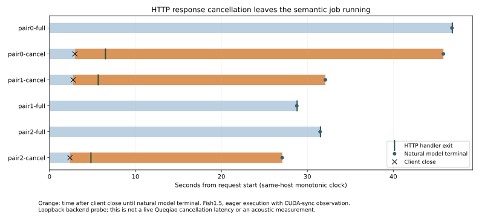

# HTTP cancellation versus Fish Speech model work

Completed one warmup and three paired full/cancel requests on an isolated RTX Fish Speech1.5 server. Both client and server use the same monotonic clock. This is a backend boundary experiment, complementing the existing Queqiao/TUIC two-host audio tests; the live model is not routed through Queqiao in this run.

The upstream semantic queue is unchanged. A forwarding response-queue observer records completed CUDA work before each semantic emission. HTTP cancellation closes the consumer; the upstream generation job has no cancellation signal in this interface. Source and checkpoint config hashes are verified by analyze.py.

| Request | First complete PCM frame ms | Semantic chunks | Worker terminal ms from request start | HTTP handler exit ms |
|---|---:|---:|---:|---:|
| warmup | 3096.797 | 1 | 2742.431 | 3097.182 |
| pair0-full | 4036.557 | 12 | 46828.791 | 46870.946 |
| pair0-cancel | 2952.717 | 12 | 45830.293 | 6508.735 |
| pair1-cancel | 2746.222 | 12 | 32096.793 | 5669.547 |
| pair1-full | 2314.659 | 12 | 28771.997 | 28810.888 |
| pair2-full | 2756.054 | 12 | 31489.153 | 31527.363 |
| pair2-cancel | 2373.458 | 12 | 27077.021 | 4820.111 |

| Cancel request | Local close ms | Close→handler exit ms | Close→worker terminal ms | Chunks completed after close / after handler exit |
|---|---:|---:|---:|---:|
| pair0-cancel | 1.981 | 3555.856 | 42877.415 | 11 / 10 |
| pair1-cancel | 0.519 | 2923.135 | 29350.381 | 11 / 10 |
| pair2-cancel | 0.530 | 2446.491 | 24703.401 | 11 / 10 |

The terminal event is natural generation completion, **not a cancellation acknowledgement**. A chunk completed after cancellation may already have started before it; this measurement does not infer exact post-cancel token-start counts. The later emissions after handler exit establish that HTTP-handler return does not stop the semantic job. Full responses and intentionally truncated WAV responses are retained with hashes. Source sync points introduce instrumentation overhead, and three pairs do not establish a production latency distribution.

Compile=false, fixed long text, chunk_length80, max_new_tokens512, temperature/top_p.7, repetition penalty1.2; no voice reference or named speaker. Sampling is stochastic, so paired outputs are not asserted to be identical. The copied wrapper's HTTP path is replaced by an explicitly instrumented handler with the same queue→decode→write behavior; it is not the unchanged production service. The first import attempt failed before loading a model because the environment selected a different Fish package. attempt-import retains that log; the successful launch explicitly set PYTHONPATH to the recorded implementation.

Reproduce in a fresh directory on RTX with `PYTHONPATH=/home/ubuntu/or-interaction/.runtime/fish/fish-speech /home/ubuntu/OpenRealtime/.runtime/fish-env/bin/python run.py`. The checkpoint path is fixed in run.py. Results must not already exist. After copying results and the pinned source/config files to Mac, run `python3 analyze.py` and `python3 report.py`. The run closes its HTTP server and the enclosing process exits, releasing the model. Process/GPU cleanup evidence is recorded separately.

This does not measure acoustic onset, audible cancellation, cross-host clock subtraction, or a patched cancellable model. Earlier physical-interface transport/device records remain the evidence for Queqiao cancellation propagation and callback starvation.
