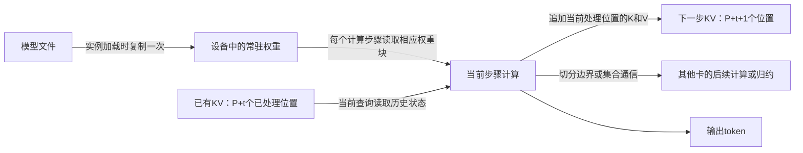

# 当前第1章四题答案

本目录完成当前正文四项练习的计算、解释和测量设计，不把旧实验编号直接当作本题答案。`run.py`使用精确有理数，`results.json`保留正文、已有测量与程序SHA；[tables.md](tables.md)给出数值。这里只设计1-4要求的下一次单因素测量，没有把设计描述成已经执行。

## 1-1 权重、状态与传递

权重文件加载是实例准备，显存中的权重读取是执行，不能把二者合并计成每请求一次。在权重保持驻留且没有重新加载的条件下，把回答从100增加到1000个token不需要再次从文件加载模型。decode步骤数增加，权重访问、当前步计算和KV追加随之增加；每步历史KV更长，累计KV读取增长可快于输出数。若每位置状态为k字节，处理n个新位置后的状态为k(P+n)，逐步扫描旧状态的理想累计访问为k[nP+n(n−1)/2]；实际注意力窗口、压缩和分块会改变此式。最后一个输出若未作为下一步输入被处理，其KV尚未写入；公式中的n是已处理位置数，不把输出事件与KV写入时刻混同。

卡间结果传递只发生在所采用的模型切分/同步路径中；单卡实例没有这项跨卡模型通信。模型切成多卡时，更长输出通常意味着更多次相同通信步骤，通信对象是所需的中间状态或归约结果，不是每步重新传输完整模型文件。

复制为两个完整实例时，每个实例都要有自己的权重副本，因此设备侧权重容量合计约从W增加到2W，另加各自状态和工作区。请求分配到其中一个实例，若希望复用其已有KV，后续轮次需要亲和该实例或显式迁移/共享状态。两个独立副本并不自动同步每个请求的KV，也不等于把一个模型切为两半。

## 1-2 容量与传输

每张80 GB卡可用于权重的预算为75 GB。BF16的141.11 GB单卡不够，两卡均分每卡70.555 GB，加5 GB后为75.555 GB，可容纳。int8的73.73 GB单卡加5 GB为78.73 GB，可容纳；两卡均分每卡36.865 GB，加5 GB为41.865 GB，也可容纳。

48 GB与80 GB异构卡扣除各5 GB后，权重预算为43 GB和75 GB，总计118 GB，容不下141.11 GB BF16。int8可分43 GB到A6000、30.73 GB到H100，两卡总占用分别48 GB和35.73 GB。这里判定的是容量，不证明任意真实后端支持这种非均分切分；实际还需按层/张量粒度和通信实现分配，且精确顶满没有额外余量。

400 Gbit/s ÷8 =50 GB/s；1 GB/50 GB/s =0.02秒，即20 ms理想传输时间，不含启动、协议或排队。

## 1-3 批处理下界

有效带宽为3350×70%=2345 GB/s，有效算力为989.4×50%=494.7 TFLOP/s。一步权重读取70 GB的下界是29.850746 ms，每请求140 GFLOP计算下界是0.2829998 ms；整批取读取与B倍计算的最大值。[完整六组结果](tables.md)保留了整批、每输出分摊和吞吐三个不同量。

原读取量下，B=1、16、64的整批下界均29.850746 ms；权重减半后B=1、16均14.925373 ms，B=64由计算主导，约18.112 ms。六个条件都可仅凭下界排除每步10 ms目标；不能因为B=64的每输出分摊值低于10 ms就宣称请求达标。

计算与读取相等时原条件B*=494700/4690≈105.4797，读取量减半后约52.7399。若只取整数batch，分别从106和53开始由计算项不小于读取项。批内B个输出共用一次权重访问，所以每输出分摊时间下降；各请求仍需等待整批当前步骤完成。下界也未包含KV、量化转换、调度、非矩阵算子、通信和主机开销。

## 1-4 用测量检验批处理假设

按图上两位小数计算，四档吞吐约为单请求的1、3.7987、12.8472、31.2233倍；TPOT增长分别为0%、1.6585%、10.4410%、52.5820%。精确结果见表。若严格只有一次固定权重读取且其他工作不随并发增加，decode单步耗时和TPOT应保持不变，稳态输出吞吐随B线性增加，倍率应为1、4、16、64。图中的整批吞吐还包含prefill，因此不能把它和只计decode的TPOT视为严格倒数。

两个可区分的解释是：（1）每请求KV/注意力状态工作随并发与上下文增加，读取和注意力执行占比上升；（2）计算量和运行时调度/主机提交开销随batch增加，使批执行更慢。二者可以同时存在，单看总耗时无法归因。

单因素方案：固定同一Qwen3-8B revision、BF16、同一RTX和vLLM版本、eager/attention后端、采样、批内并发和调度配置，每请求强制256个输出，只把输入长度依次改为512、2048、8192个token，采用固定内容生成规则并保留全部token IDs。每档至少三次，随机交错长度顺序；统一关闭跨请求前缀复用或在每次开始前明确清空缓存，预热在正式计时外。分别记录端到端批完成时间（从提交前到最后请求末输出）、每请求首末输出事件间255个间隔的TPOT、设备CUDA事件的decode执行，以及注意力与其他kernel时间和主机空隙。

若增大上下文主要抬升注意力时间/显存访问而非其他算子，支持状态工作解释；若长度变化不大却主机空隙或矩阵计算占主导，则支持另一个解释。若两者同时变化，报告各自证据，不能只用吞吐曲线断言瓶颈。改变输入长度本来会改变prefill，因此必须把prefill与decode分开；模型、输出长度、计时起止点以及是否包含排队都应在运行前锁定。
