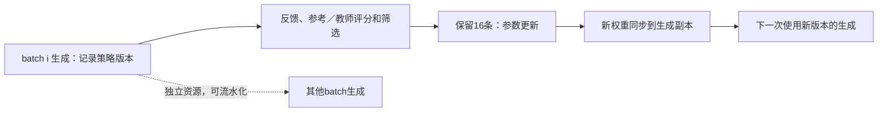

# 当前第3章：十道练习逐题复算

本目录对应当前正文练习3-1至3-10；原编号实验另见历史目录。`python3 run.py`执行整数／有理数计算，并重新拟合固定的八个C4记录；`results.json`保存结果及输入SHA。题设流体队列、音频时间线和成本比较是计算题，不称为新的真实服务器吞吐、声学或账单测量。

## 3-1 请求数与调用次数

|负载|prefill请求调用|decode请求调用合计|每条最终上下文|同步batch权重读取轮数|
|---|---:|---:|---:|---:|
|1条×1024输出|1|1023|2048|1次prefill＋1023次decode＝1024|
|8条×128输出|8|1016|1152|1次batched prefill＋127次batched decode＝128|

最终上下文计入已生成的末token；典型实现尚未把末token再送入模型，实际已物化KV可能少一个位置。请求调用数与batch引擎调用数分开计数。八条请求共处理8192个输入token，单条仅1024；batch形状、权重摊薄、逐步KV长度、prefill效率与队列均不同，仅凭1024个总输出无法判断历时。权重每批一读是题设理想复用，不保证硬件实际只发起一次读事务。

## 3-2 突发队列与工具等待

按题设每卡2796步/s、到达7471.2步/s的流体模型，双卡处理5592步/s。0≤t≤30时Q(t)=1879.2t，30秒积压56376步；停止到达后Q(t)=max(0,56376−5592(t−30))，再用10.081545秒清空。三卡8388步/s高于到达，Q(t)=0，停止到达时无积压。这不推断离散请求的零延迟或真实队列尾延迟。

Little定律给出等待任务数λW：2任务/s×10s＝20任务，占20GiB；30s时60任务，占60GiB。这里是稳态平均状态量，不是瞬时峰值，也不是GPU必需常驻容量。

## 3-3 成功任务成本

独立同分布且可持续重试时，成本/成功率给出旧方法1/0.5＝2，新方法2/0.8＝2.5，因此新方法更贵。成本1.5时需成功率至少0.75才能不超过2。多次采样应将所有生成、所有验证、失败与被丢弃样本的成本计入分子，以成功任务数作分母；不能只统计被采用的那条回答。相关采样、有限重试或状态变化时，应直接按任务账本汇总，不能无条件套独立几何分布。

## 3-4 工具并行和局部加速

串行总时间2＋6＋10＋3＝21s，等待状态16GiB·s；并行总时间2＋max(6,10)＋3＝15s，等待状态10GiB·s。状态是一份任务状态，不按两个工具各复制1GiB。

题给76.510s实测任务中，首轮36.375s提速四倍节省27.28125s，新总时间49.22875s；工具总0.078s提速两倍只节省0.039s，新总76.471s。按题设其余阶段不变、这些区间可直接减去；若真实区间有重叠，应按依赖关键路径重算。局部占比决定局部提速能带来多少全任务收益。

## 3-5 视觉与连续音频

1280²/(16²×2²)＝1600视觉token。完整DeepStack宽度仍10240，BF16 EC＝32,768,000 bytes＝31.25MiB；语言KV＝1600×144KiB＝235,929,600 bytes＝225MiB。两者均是原640²图像的四倍，未把DeepStack宽度误算成四倍token数。

按八块原时间线逐块重放：40ms初始缓冲在78ms首播，第三块123ms才到而计划118ms播放，停顿5ms；60ms缓冲98ms首播，无停顿。`results.json`保存逐块到达和实际起播时刻。连续供给0.9s音频/s、初始0.3s缓冲时，余量0.3−0.1t，3秒后耗尽。有限缓冲吸收有限抖动，同时增加首播延迟，不能弥补长期平均供给不足。

## 3-6 梯度、训练状态和监督行

设X为[m,k]、W为[k,n]、Y为[m,n]，上游梯度dY为[m,n]。dX=dY Wᵀ为[m,k]，dW=Xᵀ dY为[k,n]。三次稠密乘法各2mkn FLOPs；这是矩阵主项，不含激活函数、优化器等开销。

8,190,735,360参数×18 bytes＝147,433,236,480 bytes（147.43323648GB）；FP32梯度改BF16每参数省2 bytes，共16,381,470,720 bytes，新长期状态131,051,765,760 bytes。未包含激活、通信和临时工作区，也未验证训练数值影响。

每次更新输入2×4096×8＝65536token，监督2×1024×8＝16384token。先做完整65536行词表投影再屏蔽损失，并不省掉这些已执行的投影；先选择监督位置则词表投影降至16384行（主项省75%）。上下文主干仍需处理全部输入及相应反向依赖，不能声称整次训练省75%。

## 3-7 固定更新量的RL周期

用正文四舍五入后的两次总量作直线插值：(3410.701−2181.559)/32＝38.4106875 TFLOPs/新增回答；固定截距2181.559−32×38.4106875＝952.417 TFLOPs。它与正文阶段表952.416相差0.001，源于总量取整精度，不把两种输入当成严格一致的高精度数据。48条预测总量2796.130 TFLOPs。

额外教师对48条各做一次前向，按参考模型32条634.944 TFLOPs缩放，新增952.416 TFLOPs。四份BF16权重独立发送，合计4×2×8,190,735,360＝65,525,882,880 bytes（65.52588288GB）。

不同batch的生成与前一batch反馈／更新可在独立资源上重叠；一个batch内部必须先有回答再反馈、先有有效样本再更新、更新完成才能同步新权重。异步提前生成须保留旧策略版本和滞后信息；不能将异步数据等同于同步新策略采样。同步传输也可能与其他副本工作重叠，但接收副本使用完整新版本前需明确切换边界。

## 3-8 最优规模与六拟合／二留出

将D=C/(6N)代入，导数为−αA N^(−α−1)＋βB(6/C)^β N^(β−1)。令其为零，得到N_opt=[αA/(βB)]^[1/(α＋β)]×(C/6)^[β/(α＋β)]，D_opt=C/(6N_opt)∝C^[α/(α＋β)]。A、B、α、β为正时，损失两端上升，驻点是唯一内点最小值；实际容量或数据边界需另检查。α＝β时预算4倍对应N、D各2倍，9倍各3倍。

重用已封存的八个公开C4观测原件、固定原指数网格与N≥2e9留出划分，重新求系数；只对六个拟合点的SSE选择候选。得到归一化模型E＝1.21124217056、A＝1.25125385528、B＝0.523430135365、α＝0.1、β＝0.45，N0＝1e9、D0＝1e10，即L=E+A(N/N0)^−α+B(D/D0)^−β。

|留出记录|实测损失|预测损失|预测−实测，nats/token|
|---|---:|---:|---:|
|2b855b55b|2.574117|2.5827225568|+0.0086055568|
|8b7178b178b|2.336741|2.3627095722|+0.0259685722|

留出RMSE＝0.01934453865。脚本另把留出损失全部加10，确认拟合系数完全不变，验证留出没有参与选模。拟合误差经过参数选择而偏乐观，不能替代新规模的误差；两个留出点、边界网格指数、不同评估样本量及公开N/D估计也限制外推。不重新训练或把重复预算当独立观测；完整源记录与敏感性沿用[既有公开点报告](../../../calculations/results/datablations-real-c4-eight-point-fit.md)。

## 3-9 训练数据与总专家数

|正文模型口径|D/N|6ND FLOPs|
|---|---:|---:|
|Llama 1，6.7B、1T|149.253731|4.02×10²²|
|Llama 2，7B、2T|285.714286|8.40×10²²|
|Llama 3.1，8B、15T|1875|7.20×10²³|
|Qwen2.5，7B、18T|2571.428571|7.56×10²³|
|Qwen3，8B、36T|4500|1.728×10²⁴|

这是正文报告范围的粗估，Qwen为系列披露，未改称该单模型精确已训练量。同N、同精度、同执行假设下D增四倍，6ND增四倍，上线纯权重容量不变。路由专家总数加倍会把该路由专家参数部分加倍，固定共享／注意力部分不变，所以总参数通常小于两倍；每token选中数与专家形状不变时，选中专家矩阵主计算不变。路由计算、优化器更新全部参数、负载不均与通信可变化，完整训练计算不能直接认定不变或两倍。

## 3-10 训练历时与生命周期成本

1,022,362 GPU·h/(2048×24)＝20.800008天；1024卡为41.600016天。这只执行题设总GPU小时不变，不证明实际线性扩展。

小模型相对大模型的总成本差为100000−0.72Q/3600 H100 GPU·h。Q＝2亿时差+60000，选大模型；Q＝10亿时差−100000，选小模型。反转点Q＝5亿成功任务，两者相等。质量与时限是题设共同门槛；此处没有美元价格、利用率变化或真实账单。
