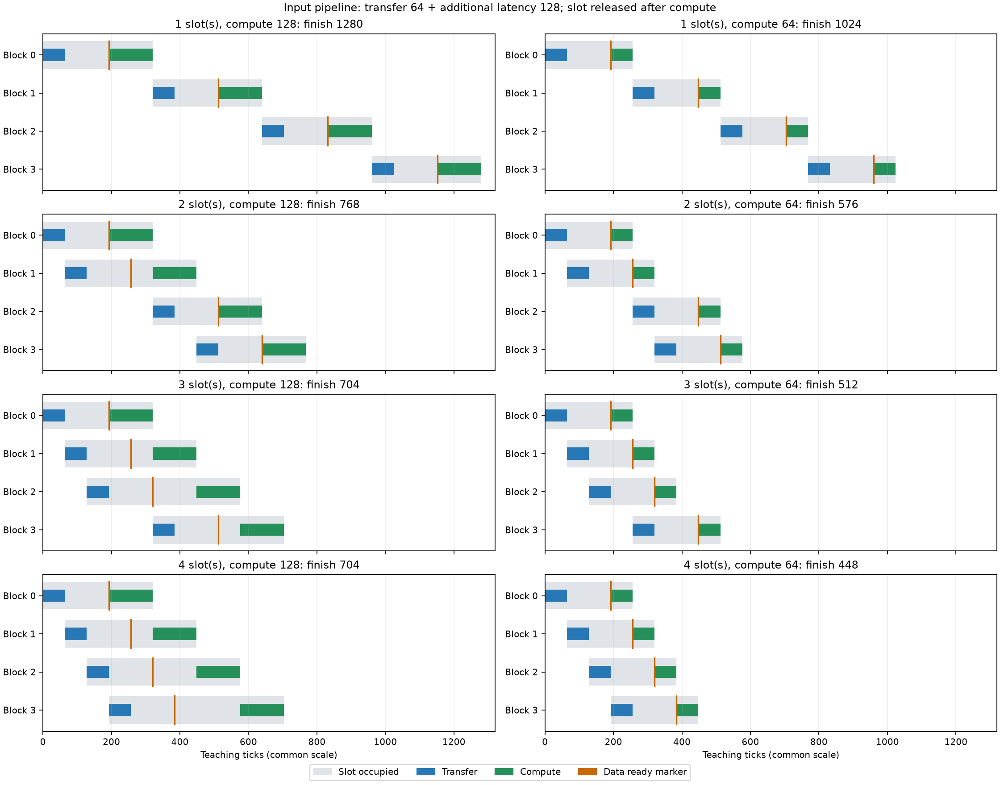
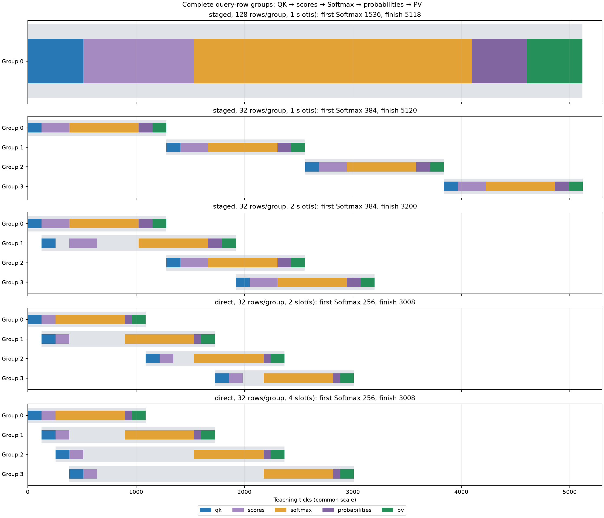
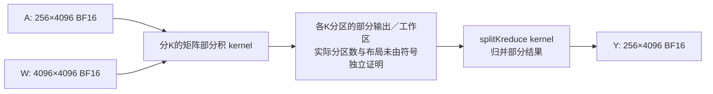
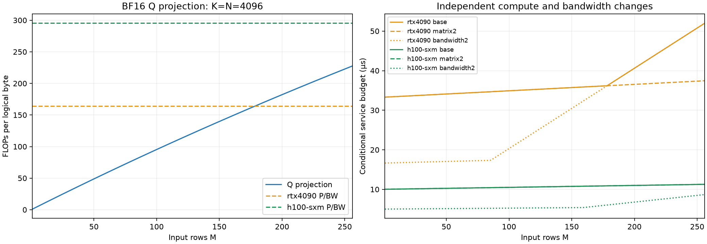

# 当前第4章逐题答案

当前4-1至4-8均已按本版题目逐题补齐：含可复算脚本、原记录再分析及图。此结论仅覆盖本章八道当前题目，不代表其他章节或历史实测缺口已完成。

## 4-1 注意力矩形分块与资源供给

取正文固定B200单SM分析，d=128，矩阵8192 FLOPs/cycle、指数16结果/cycle、SMEM读取128 bytes/cycle。沿已封存FA4 §3.1.1的MMA指令分块口径计数；`python3 run_4_1.py`调用已有统一计算入口，并用化简后的独立等式核验两个形状、六组资源配置。

两种形状M×N=128×256和256×128，QK＋PV均4MNd＝16,777,216 FLOPs、指数32,768个。QK各需2个128×128输出MMA，SMEM读取2×(128d＋128d)×2＝131,072 bytes；PV从TMEM读取P，对V的SMEM读取各65,536 bytes；SMEM总196,608 bytes＝192KiB。因此两种形状在此固定指令映射下的三项服务周期相同：

|资源改动，相对原始配置|矩阵周期|指数周期|SMEM周期|最长项／稳态间隔下界|
|---|---:|---:|---:|---|
|不改|2048|2048|1536|matrix和exp，2048|
|只将矩阵吞吐×2|1024|2048|1536|exp，2048|
|只将指数吞吐×2|2048|1024|1536|matrix，2048|
|只将SMEM带宽×2|2048|2048|768|matrix和exp，2048|
|矩阵和指数均×2|1024|1024|1536|SMEM，1536|
|三者均×2|1024|1024|768|matrix和exp，1024|

前三个单因素变化分别只改变一项，没有把顺序累计改动误称单因素。两个附加累计配置解释解除一个瓶颈后为何还需要提高其他供给。时间用周期表示；若按论文采用的1.85GHz，仅可把周期除以1.85换成ns，不能把它当作实测频率或完整kernel时延。

形状仍改变复用方向。128×256的Q块在两个键列块间重复读取；256×128的K块被两个查询行块重复读取。PV前者是一个128行输出块读取256行V，后者是两个128行输出块分别读取同一128行V。唯一Q/K/V输入载荷前者163,840 bytes、后者131,072 bytes，均不同于SMEM指令操作数累计读取196,608 bytes；不能用唯一载荷替代实际接口读取口径。d=128与128倍数分块造成这里的三项周期相同，不推断其他形状或调度也相同。

图选B200；P的PV输入来自TMEM，未把它计成SMEM读取。max(三项时间)是多个块充分流水后的资源下界；一个块仍有QK→Softmax→PV依赖。指数项没有覆盖完整Softmax、归约、缩放、TMEM／寄存器流量、校正及同步，这些未建模项不是零成本。图与公式不证明资源改动后实际kernel实现能够达到该下界。

来源和精确有理数周期见[4-1-results.json](4-1-results.json)，原计算说明见[FA4资源账本](../../../calculations/results/fa4-qwen8-resource-balance.md)。

## 4-2 分组直算、展开与重复使用

对一行输入与一列权重，分组点积为 y_j=Σ_g a_g b_gj Σ_(k∈g) q_xk q_wkj。正文仅分组激活时b_gj=b_j；激活与权重都分组时b_gj依赖g。各组scale不能一般地提到总和外面。先展开的路径形成x̂_k=a_g q_xk、ŵ_kj=b_gj q_wkj，再一次GEMM；直接路径先算每组INT32部分和，转FP32乘两种scale并合并。BF16展开还带来一次舍入，所以两者不保证逐位相同。

按实际K2048×N1536专家、16个K分组：

|存储对象|分组直算|先展开再计算|
|---|---|---|
|INT8权重|3,145,728 bytes，16个视图不重复存储|同一份，若加载后释放须另注明|
|权重scale|仅激活分组时6,144 bytes；两者分组时98,304 bytes|同样需要用于展开；释放与否单列|
|BF16权重副本|不需要|额外6,291,456 bytes，可跨R次保存|
|激活scale|每原始输入行16×4＝64 bytes|同样量化后展开，不能省略|
|部分和|每组至少一个INT32输出；M1填充32行时192KiB，转FP32缩放并累计|GEMM内部累加／工作区仍存在，不能设为0|
|最终输出|本实现FP32，4MN bytes|BF16 GEMM结果再转FP32，最终也是4MN bytes|

直接路径若逐组累计，无需同时保留全部16份部分和；也不能只凭这个理论最小值代替分配器峰值。展开激活、拼接、填充、临时cast和库保留分配均需按各自生存区间计入。

令Cw为一次权重展开时间，L为使用已展开权重时的一次完整激活准备＋BF16计算路径时间，D为一次完整分组直算时间。权重与形状固定、每次执行成本相同且无跨调用重叠时：加载展开一次总T₁=Cw＋RL；每次展开总T₂=R(Cw＋L)；分组直算T₃=RD。因此T₂−T₁=(R−1)Cw：R=1不省展开，R>1才逐次减少重复工作；若D>L且额外副本能驻留，T₁<T₃的条件是R>Cw/(D−L)。D≤L时不存在靠摊薄Cw取得优势的正R。权重更新、逐出、不同量化／布局使副本失效时，应重新支付Cw，不能一直按一次展开计。

`4-2-results.json`列出R=1/8/64/1024的精确操作次数，例如R=64：加载展开策略仅1次权重展开、64次完整BF16路径；逐次展开为64次展开；直算为1024次INT8部分GEMM和1024次缩放合并。没有给定统一Cw/L/D时，总时间应保留上述参数表达式。现有记录没有测量常驻BF16权重的完整L，因此不拿“完整路径中位减权重阶段中位”伪造L或数值摊销点。

真实输入的证据来自[分组数值与计时](../../ch04/04-02/block-scales/README.md)及[独立进程分配器测量](../../ch04/04-02/workspace/README.md)。本次脚本从432条原样本重新计算各条件的中位数，并从四份原始measurement.json重建首次／后续总峰值与调用增量；未重新生成随机输入代替实际激活。

仅分组激活的真实decode M1中，直接路径2.8101ms、相对L2误差1.9211%，反量化路径2.5165ms、误差1.9349%，均满足原2%局部门槛。真实prefill M512两路径误差1.8607%／1.8771%。同时分组权重的六条件误差约1.44%—1.85%；此前逐行激活方案约2.32%—3.45%的失败仍保留。这些局部误差不自动证明整个模型质量。

|实际输入|直算后续总峰值MiB|逐次反量化后续总峰值MiB|
|---|---:|---:|
|decode M1|11.400879|35.205566|
|prefill M512|25.162109|43.162109|

总峰值以空PyTorch分配器基线计，包含驻留对象；不是单次增量、reserved容量或整卡nvidia-smi值。两路径调用后均保留8.125MiB；decode反量化首次总峰值只有27.080566MiB，不能用它代表后续35.205566MiB。原测量的四次输出相同，CPU数值与分配器快照审计另见原目录。

是否值得保留展开副本，需同时满足空间可驻留、有效复用R足够大、质量门槛通过、完整常驻路径L确实较低。空间紧张或频繁更新／逐出时，可选择省副本的直接路径；当前实现16次未融合矩阵调用的开销不代表所有INT8内核的性能上限。正文4-bit4096²权重的8.5MiB压缩表示／32MiB展开副本是另一教学形状，不能与此INT8真实专家的峰值混用。

## 4-3 容量、带宽与独立访存事务

`python3 run_4_3.py`重新核对统一存储结果的54种负载：Qwen3-8B／235B-A22B，16／8／4-bit声明格式，batch1／8／32，最终8K／32K上下文，MoE再分均衡与集中两种声明路由。逐张量重算常驻权重和当前选中权重，核对KV分项，再生成810种容量、带宽与事务窗口组合。这里的低比特格式含scale及保留BF16张量，并非已验证质量和运行时支持的量化checkpoint。

先求驻留上限：Bmax=max(0,floor((C−W−workspace)/KV_request))，workspace固定2GiB；还须检查权重与workspace本身是否放得下。以H100参数80GB／3350GB/s为原始供给，只改容量为160或640GB，只改带宽为6700GB/s，另列640GB＋双带宽的累计控制。160／640GB配置是教学变量，不对应新硬件产品，也不把多卡容量当成一块共享内存。

|模型与存储，最终8K|全部常驻权重GB|80GB最大请求数|160GB最大请求数|640GB最大请求数|
|---|---:|---:|---:|---:|
|Qwen3-8B BF16|16.381471|50|117|514|
|Qwen3-235B 4-bit方案|123.142036|0，权重已超限|22|326|
|Qwen3-235B BF16|470.187269|0，权重已超限|0，权重已超限|106|

带宽翻倍不改变这些容量数。固定batch和路由时，单加容量不改变当前步的流量或读取预算；将新增空间填满后KV更多，才会增加每步流量，不能混同两种比较。32K每请求KV是8K的四倍，例如80GB下8B只能驻留12请求，160GB下4-bit235B只能驻留5请求。

每步载荷D包含本批选中权重及scale、不同输入token的embedding行、历史KV读取、当前KV操作数读取与append写入。所有专家都驻留，但只读选中专家一次并在batch内复用；不能每步读取完整235B权重，也不能永远只计单token的8个专家。集中路由各token选同8个专家，均衡路由batch1／8／32分别覆盖8／64／128个专家。

|模型与存储|batch|路由|当前步载荷GB|3350GB/s服务预算ms|
|---|---:|---|---:|---:|
|8B BF16|1|dense|16.344926|4.879082|
|8B BF16|8|dense|24.801733|7.403502|
|8B BF16|32|dense|53.796497|16.058656|
|235B 4-bit|1|两者相同|13.696593|4.088535|
|235B 4-bit|8|均衡／集中|75.967159／24.737406|22.676764／7.384300|
|235B 4-bit|32|均衡／集中|172.369665／62.591622|51.453631／18.684066|

235B上述数值是算术服务预算；80GB全部不满足容量，160GB的batch32也不满足，因此结果中相应可运行时间为null。640GB教学容量下才覆盖这些所有请求。集中路由减少选中权重流量，但可能加重专家计算排队或设备不均，不由这张存储表推断完整延迟一定更低。

最后检查独立在途事务数N。显式假设同一内存接口延迟L=500ns，每事务s=128bytes；两者是教学输入，不是实测H100队列或延迟。维持目标带宽所需N=ceil(BW×L/s)：3350GB/s需13,086个，6700GB/s需26,172个。脚本用整数不等式检验ceil边界。有效带宽上限min(BW,Ns/L)：

|可独立在途事务数|窗口带宽GB/s|3350GB/s供给下限制|6700GB/s供给下限制|
|---|---:|---|---|
|128|32.768|事务并发|事务并发|
|4096|1048.576|事务并发|事务并发|
|32768|8388.608|接口带宽|接口带宽|

128或4096事务时，仅翻倍接口带宽不会改善此模型中的读取时间；32768事务且容量通过时，载荷服务时间可减半。事务数指实际独立请求，不是batch、线程、warp或分配槽位数；batch增大未必能产生足够独立访存。容量失败先处理驻留；容量通过再用D/min(BW,Ns/L)判断读取预算，有限传输同时不能低于一次L。这里未建立依赖调度、重读、缓存、非矩阵算子及计算时间模型，因此是条件资源比较，不能写成实测decode吞吐。

完整数值、来源SHA与逐条件可运行性见[4-3-results.json](4-3-results.json)。这也修正旧4-3说明将完整常驻权重当成每步读取的局限；原历史结果保留作口径对照。

## 4-4 输入槽生命周期与矩阵／向量交接

`python3 run_4_4.py`重建12个输入时序、5个交接时序及16个容量条件，逐项检查就绪依赖、同资源互斥与槽位释放；交接时序与原统一计算结果逐事件一致。制图运行`.venv-site/bin/python experiments/current/ch04/plot_4_4.py`（仓库根目录），下列PNG与SVG均已生成，PNG已视觉检查。tick为声明的教学周期，不是本机GPU实测。

每块占16KiB输入槽。发起I，传输结束I+64，就绪R=I+192，计算开始S=max(R,前块计算结束)，结束E=S+C，并在E释放槽。同一槽下次发起不能早于E；传输端每64tick最多发起一块。浅灰条展示完整占槽区间，包括已就绪但尚未计算的等待；橙线是就绪时刻。

|输入槽数|输入缓冲KiB|C=128完成tick|首块后空闲tick|C=64完成tick|首块后空闲tick|
|---|---:|---:|---:|---:|---:|
|1|16|1280|576|1024|576|
|2|32|768|64|576|128|
|3|48|704|0|512|64|
|4|64|704|0|448|0|

原速率的无间隙目标192+4×128=704。两槽时第三块在第一块320结束后才发起，512就绪，晚于第二块448结束，故空闲64。三槽时前三块0／64／128发起；第四块320发起、512就绪，不晚于576的计算开始，达到最少三槽。第四槽只让数据更早等待，完成时间不变。

计算翻倍后目标192+4×64=448。三槽时第四块256发起、448就绪，晚于所需384，产生64空闲；四槽时第四块192发起、384就绪，因此最少四槽。对这一串行传输／计算模型，连续稳态还需传输间隔64≤C，槽生命周期约192+C，故N≥ceil((192+C)/C)，分别给出3与4；有限四块的逐事件核验避免仅凭这个必要条件下结论。附加等待从128翻倍到256时，三槽第四块448发起、768就绪，而所需704，仍缺64；附加延迟不能误当成占用传输端的时间。

每组包含完整查询行与完整K收缩，不能把半个内积的分数交给普通Softmax。QK和PV共用一个矩阵端，Softmax使用一个向量端，两种交接共用接口。槽从QK开始占用，至PV结束释放；图中浅灰为占槽，彩色为各阶段工作，中间空白为已占槽但等待资源或前序结果。

|变化步骤|行／组|槽|首次Softmax|完成tick|相对上一步节省tick|
|---|---:|---:|---:|---:|---:|
|完整128行、写后读|128|1|1536|5118|—|
|只分成32行组|32|1|384|5120|−2|
|增加第二槽|32|2|384|3200|1920|
|再改直接交接|32|2|256|3008|192|
|再增为四槽|32|4|256|3008|0|

分组令首次向量工作提前1152tick，但单槽仍逐组串行，不能制造跨组重叠；总耗时反增2tick，来自向量操作逐组向上取整。第二槽使相邻组推进，省1920tick（37.5%）；直接交接少走一次写／读接口，省192tick（6%）。每32行组QK／PV各128，Softmax640；分数／概率交接从256／128变成128／64。四组交接总服务时间因此减少768tick，但一部分本已与计算重叠，所以完成时间只减192，不能把所有省下的接口时间加到端到端收益上。

直接路径首组分数到达256后，向量端四组连续工作2560tick，最后概率64加PV128，得到下界256+2560+64+128=3008；两槽已经达到。更多槽无法加速这个固定向量端。此下界只适用于所声明交接子图，未包含输入加载、mask构造、输出写回、cast和其他控制工作，也不是对实际FlashAttention实现的性能断言。

每组交接缓冲为g×128×(FP32分数4+BF16概率2)=768g bytes。固定交接容量C，最大可驻留组数floor(C/(768g))，并受实际组数128/g限制：

|行／组|每组KiB|24KiB可容组数|48KiB|64KiB|96KiB|
|---|---:|---:|---:|---:|---:|
|16|12|2|4|5|8|
|32|24|1|2|2|4|
|64|48|0|1|1|2|
|128|96|0|0|0|1|

例如48KiB能容32行两槽，支持上述重叠；同容量64行仅一槽，128行不能容纳。小组提高可驻留数量，但引入更多交接和取整，不能仅按槽数选最佳分组。容量这里专留交接分数／概率；输入槽、Q/K/V、累加器及其他工作区另算。同一物理片上存储若同时承载这些对象，须先从总容量扣除它们，不能把输入流水的48KiB与交接的48KiB各自当成完整可用空间。直接传递在本协议中仍保留相同槽，减少接口字节不等于自动释放分数／概率容量。

完整逐块发起、就绪、计算、释放与逐组依赖见[4-4-results.json](4-4-results.json)；可编辑图为[输入SVG](4-4-input.svg)和[交接SVG](4-4-handoff.svg)。

## 4-6 用实际流量与kernel修正投影预测

`.venv-site/bin/python experiments/current/ch04/run_4_6.py`从原NPZ重新计算FP64参考，检查双端输入字节一致、预设容差、11轮中位数，并从原Nsight CSV重建kernel级字节和时间、核对单位和输入SHA。8种常规计时条件与4次计数器捕获均与封存结果一致。此题要求分析既有Mac／RTX实测，未伪造新计时或用模拟值替代计数器。

固定A[M,4096]、W[4096,4096]，输入输出BF16，M=1／256；每端16份相同内容、独立地址的32MiB权重，比较复用与轮换。原输入为合成张量，不是checkpoint权重。最大绝对误差0.03125／0.0625，通过原atol=.01、rtol=.01；这不代表逐位相同。CUDA禁用BF16 reduced-precision reduction，MPS内部累加精度没有独立证据。

|M|Mac复用／轮换墙钟μs|RTX复用／轮换墙钟μs|假设片外各读写一次，Mac／RTX μs|
|---|---:|---:|---:|
|1|165.987／182.651|42.918／51.866|83.927／18.734|
|256|1835.375／1835.224|32.649／33.478|94.372／21.065|

解释一是缓存状态和接口流量：若差异来自复用权重命中，预期复用组DRAM读取减少，可能仍有相同L2请求。实际RTX M1复用／轮换DRAM读取均33,554,688B、L2请求均34,372,832B，这次捕获不支持“复用减少DRAM字节解释其全部计时差”。M256则由33,607,936B降至256B，L2请求仍均154,094,336B，支持缓存改变了外存需求。M256常规墙钟只差约0.829μs，说明少读约32MiB不能直接按标称带宽换成同等端到端收益。Mac无对应计数器，不能把RTX结论直接套过去。

解释二是执行路径与提交／等待开销：若一个库选择GEMV，另一个形状选择Tensor GEMM加归约，矩阵峰值和逻辑流量就不足以预测完成时间；预期kernel记录出现不同执行单元、额外阶段和中间流量。实际RTX M1只有cuBLAS GEMV，M256为CUTLASS tensorop GEMM加splitKreduce；M256的L2请求154.094MB远高于逻辑载荷37.749MB，存在重复访问／中间流量。符号中的cutlass_80不是SM120设备变成SM80，也不是完整最优路径证明。Mac仍缺相应阶段记录，因此执行路径是需要继续分解的候选解释，不能断言已定位56倍平台差异的具体原因。

这张图表达实测kernel证明的两阶段依赖，不虚构split-K分区数或中间格式。区分执行效率和等待，至少需要：主机提交到kernel开始、矩阵kernel开始／结束、kernel内矩阵指令实际活跃时间及内存／依赖停顿、部分结果写入及归约读取、归约开始／结束、两kernel间隙、最后完成到主机同步返回。同资源并发和时钟也要对齐。当前计数器只给kernel整体时间：复用31.328+5.536=36.864μs，轮换34.752+5.920=40.672μs；不能从整体时间分出矩阵单元活跃与内部等待。且这是插桩重放，不替代11轮正式墙钟32.649／33.478μs，也不能相减得到负的提交开销。

片外一次模型是D=2(4096²+2M×4096)bytes、F=2M×4096²FLOPs；M1载荷33,570,816B，M256载荷37,748,736B。除以400GB/s或1792GB/s得到上表内存服务预算。该模型未计缓存、分块重读、split-K中间流量、第二kernel、提交和同步；M256复用仅256B的DRAM读取直接否定“每调用全部输入权重都从片外读”的实际合同。L2请求与DRAM传输也不能混加或互相替代。DRAM写入可包含先前脏行回写，零写入不等于没有输出。

单次捕获没有重复分布，原环境非独占；Mac只有匹配形状的带宽预算，没有已核实的对应矩阵峰值，故不算Mac完整Roofline或利用率。两端墙钟比约3.87（M1复用）和56.22（M256复用）描述的是所测实现组合，不是纯芯片能力比。每端源文件、原始张量、试验样本和采集日志继续保留在[历史4-6目录](../../ch04/04-06/README.md)，本次复算结果见[4-6-results.json](4-6-results.json)。

## 4-5 batch、上下文与专家输入分布

`python3 run_4_5.py`以BF16输入／输出、FP32累加的Q投影A[M,4096]×W[4096,4096]推导：F=2M4096²，D=2(4096²+2M4096)，算术强度I=4096M/(4096+2M)。D含输入、权重各读一次及输出写一次；不是实测DRAM字节。M从1到256，I从约0.999512增至227.555556 FLOPs/byte，极限2048。以P为矩阵FLOPs/s、BW为bytes/s，令r=P/BW，解F/P=D/BW得M*=4096r/(4096−2r)；r≥2048时不存在有限正交点。

两张具体卡使用仓库已固定来源的BF16稠密／FP32累加矩阵参数：RTX4090为165.2TFLOP/s、1008GB/s；H100 SXM为989.4TFLOP/s、3350GB/s。没有使用稀疏峰值。只改矩阵或只改带宽均相对原始配置独立进行。

|设备|原始连续交点／首个计算主导整数M|矩阵×2|带宽×2|
|---|---:|---:|---:|
|RTX4090|178.145／179|390.234／391|85.360／86|
|H100 SXM|345.112／346|830.107／831|159.147／160|

原始供给下，同一M1任务的max(F/P,D/BW)分别为33.304／10.021μs，均内存主导；M256分别51.997μs（计算）／11.268μs（内存）。单个权重32MiB，两卡容纳此算子对象无困难；这不表示完整模型任意batch都能驻留。矩阵翻倍把交点推远，因为需要更多复用才能喂满更强计算端；带宽翻倍使交点前移。图覆盖全部1–256行，超出区间的交点在表中给出而非截断为256。

加入两类工作后，要分开资源账本：

|子任务|矩阵工作|主要逻辑载荷与非矩阵工作|条件变化|
|---|---|---|---|
|Q投影|2M4096²|2(4096²+2M4096)bytes|batch摊薄共享权重|
|单层GQA decode attention，B请求、S历史，32Q头／8KV头、d128|4B×32×S×128|KV=4B×8×S×128bytes；Q和O另4B×32×128bytes；指数B×32×S，比较B×32×(S−1)，归约／归一化另计|上下文加长同时增大KV、矩阵、指数与归约工作；不只改变权重摊薄|
|一个专家up矩阵，t行、K4096／N1536|2tKN|2(KN+t(K+N))bytes|取决于每专家的t，不能直接代入总batch|

注意力表采用不物化完整score／probability矩阵、KV各访问一次的接口假设；物化路径还会增加O(BHS)中间流量，分块可能重读，向量／特殊函数与依赖不能省略。脚本列B1／32及S8192／32768在两卡的矩阵、内存服务预算及指数次数，非矩阵耗时保留null。此题的两卡完整算子预算选Q投影；不把attention的两个分项max冒充含所有阶段的精确延迟。decode上下文四倍时主要attention工作近四倍；prefill若查询长度也四倍，QK／PV工作近十六倍，不能套decode线性关系。

声明一层128专家、top8、batch32，共256个专家输入行。均衡分布每专家2行，集中分布8个专家各32行；选up投影单项，非完整MoE层或整个Qwen checkpoint。两者总矩阵工作同为3,221,225,472FLOPs，每活跃专家强度却由1.996增至31.109；权重各读一次时，全层载荷从1,613,496,320B降至103,546,880B。RTX4090该分项服务预算1.600691／0.102725ms，H100为0.481641／0.030910ms，均由所计内存项主导。集中可增加复用，也可能导致多卡负载不均；不以单卡流量优势证明多设备完成更快。gate、down、激活函数、dispatch、padding及combine须各补工作与依赖，不能把up分项称为完整专家时间。

完整256点、1536个投影设备／资源条件与attention／expert资源表见[4-5-results.json](4-5-results.json)。图由`plot_4_5.py`生成，PNG已视觉检查，[SVG](4-5-projection.svg)可用于编辑。这些均为声明供给的资源预算，不是RTX或H100新实测；缓存和实现效率需用4-6证据修正。

## 4-7 增加缓冲的收益边界与固定投入

选择B200单SM矩阵供给模型，研究四个连续权重块的线性投影微任务：共享A[B,64]，每块W[64,128] BF16，共生成Y[B,512]。每块权重16KiB，矩阵工作2B×64×128=16,384B FLOPs，以8192FLOPs/tick计为C=2B tick。声明输入搬移端256bytes/tick、传输64tick、额外就绪等待128tick；这是4-4型教学供给，不能当作实测B200指令路径。只将权重槽从2增至3，其他速率和数据量不变。

`python3 run_4_7.py`扫描B1–256，保存逐块发起／就绪／结束。每个槽持有权重直至对应矩阵计算结束；相邻计算不能重叠，下一次传输需等端口及槽释放。B64时四块总工作4,194,304FLOPs、权重共65,536bytes，两槽完成768tick，三槽704tick。首块后等待从64降为0，增量缓冲16KiB。共享输入加最终输出占1152B bytes，B64为72KiB；因此声明对象总缓冲由104增至120KiB。累加器、搬移准备和其他运行时空间未计，不能将这些数当成完整SM占用证明。

对于B≥32，传输间隔64不慢于计算C=2B。两槽无间隙条件为两块计算间隔能覆盖槽从发起至释放的生命周期，即2C≥192+C，解C≥192、B≥96。有限四块的逐事件扫描也确认：B95仍有正收益，B96及以后增第三槽均不省时间。此时计算已足够长，原两槽完成预取；增加容量不会增加矩阵吞吐。B<32还会受传输端发起间隔限制，不能把更多槽视为无限加速。

若为该修改支付固定投入F₀、机器时间价格c美元/小时，单任务节省Δt秒，则Δc=cΔt/3600，回本需V*=F₀/Δc；模型寿命L秒、利用率u、改后处理速率q任务/s、D台，需DuqL≥V*。使用明确教学值F₀=1000美元、c=1美元/小时，tick按1.85GHz换算，B64节省64/1.85GHz=34.595ns，Δc≈9.60961×10⁻¹²美元/任务，回本量104,062,500,000,000任务。改后q=1.85GHz/704≈2,627,841任务/s，50%利用率、365天寿命时每台约41.436万亿任务，至少3台；利用率25%或寿命半年时至少6台。

价格、固定投入、全时可重复的微任务速率都是教学假设，不是采购报价、完整模型吞吐或商业回报预测。利用率与模型寿命必须同时限制可兑现服务量；闲置机器若仍收固定小时费，省下运行时间未必立即减少现金支出，需有其他有效任务利用释放时间。B≥96时Δt=0，本方案不存在靠该任务节省成本收回正固定投入的有限服务量。源码、256行扫描及精确成本分数见[4-7-results.json](4-7-results.json)。

## 4-8 每token能量与功率封顶

`python3 run_4_8.py`直接读取第4.1.3节封存账本：W=15,136,819,200读取bytes、KV₈K=1,207,959,552bytes、矩阵工作19,968,622,592FLOPs；HBM参考31.76pJ/byte、HFMA参考0.75pJ/FLOP。此处沿用该账本的历史长度／接口口径，未换成4-3包含当前append的不同载荷。每token E(B)=EW/B+EKV+EC，固定同一权重跨batch只读一次、各请求KV不共享。

|batch|权重J/token|KV J/token|计算J/token|合计J/token|
|---|---:|---:|---:|---:|
|8|0.060093172|0.038364795|0.014976467|0.113434435|
|32|0.015023293|0.038364795|0.014976467|0.068364555|
|128|0.003755823|0.038364795|0.014976467|0.057097086|

权重严格低于计算的最小整数batch为33；32时0.015023293仍略高于0.014976467，脚本以Fraction核验边界，避免用四舍五入0.481／0.015误判。batch128是题设能量分账，不是单张80GB H100能驻留128份8K KV的部署承诺。

上下文32K时KV项四倍为0.15345918148608J/token。相等条件EW/B=4EKV给B=821225/262144≈3.132724762，整数batch从4开始KV大于权重。继续增加batch仍减小权重项，但无法摊薄每请求独有KV，E的正下限由KV及计算等项决定。这里求相等仅需两个读取项；若同时求32K总能量，attention矩阵工作也应随历史增加，不能保持8K计算项不变。

选H100 SXM：TDP700W、BF16稠密峰值989.4TFLOP/s、HBM3350GB/s。用同一参考字节能耗估计满带宽Pmem=106.396W，计算功率预算593.604W，每FLOP预算b=0.599963614pJ。设e=1.5b≈0.899945421pJ，则电压不变的频率比r=2/3；电压与频率等比下降时P∝f³，r=(2/3)^(1/3)≈0.873580465。这里对计算端应用功率预算，HBM速率保持不变，未假设整卡各模块随一个时钟同步缩放。

按题目指定把（a）的batch32能量相加，一步E₃₂=2.187665771889J。其矩阵工作638,995,922,944FLOPs（32×19,968,622,592）；两种持续算力对应计算时间0.968763／0.739304ms。权重加32份KV的内存服务时间16.057172ms，取max后两者均为该值，账本平均功率约136.242286W，比700W低563.757714W。

这个差距不能解释成“实卡只耗136W”或“测得80.5%功率余量”：账本省略静态漏电、时钟、控制、其他存储层次与运行时工作，并混用HBM2和旧工艺HFMA参考能耗。1.5b是（c）的假设功率封顶情景，而题目最后明确使用（a）能量，所以没有把其0.75pJ/FLOP暗中替换为0.899945pJ；若要物理一致地模拟实际芯片电压和能量，需重建全部分项及电压依赖，不能直接沿用此跨工艺表。当前任务内存受限，满矩阵峰值的持续频率约束也不证明本任务实际触发限频。全部数值及来源SHA见[4-8-results.json](4-8-results.json)。
