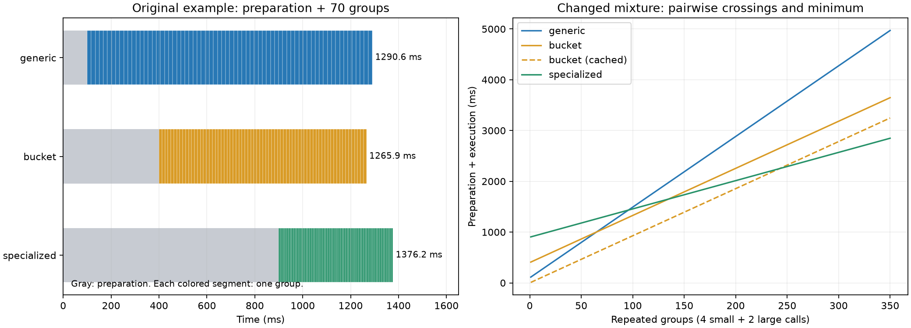
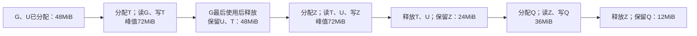

# 当前第5章逐题答案

当前第5章十个题块均已逐题完成，包含两个不同的5-1。每题附推导、可执行复算或原记录审计；当前题号与历史实验协议不同，此结论不关闭其他章节或历史运行缺口。

## 5-6 调用比例、分派开销与搜索成本

原实现A／B均10μs；新实现A5μs、B20μs。令A占比p，则原平均10，新平均20−15p。按形状分派且每次付1μs，对A用新、B用原，平均1+5p+10(1−p)=11−5p。

|p|始终原μs|始终新μs|带分派μs|分派相对原节省μs/调用|
|---|---:|---:|---:|---:|
|1/2|10|12.5|8.5|1.5|
|2/3|10|10|23/3≈7.666667|7/3≈2.333333|
|9/10|10|6.5|6.5|3.5|

始终新严格更快需p>2/3；分派严格更快需p>1/5，等号仅持平。1μs对所有调用付费，包括B；若只对A计开销会得到错误边界。串行N次调用节省N(5p−1)μs；搜索成本C秒时，正收益条件下回本调用数至少ceil(C×10⁶/(5p−1))，但这只是固定调用分布与持续相同收益的条件计算。

`python3 run_5_6.py`从原schedule-search-v2逐候选11个样本重算中位数并核验源码SHA。6个schedule评测的event窗口累计4.965110s，评测墙钟累计5.459703s；再包含native与默认compiled两个基线，8个评测墙钟累计8.855887s。event窗口含主机间隙，并不是GPU实际忙碌秒数；评测墙钟求和也未覆盖各独立进程启动、外部准备等完整实验成本。不能将三种口径相互替换。

原选择仍为index3（256／4warps）。搜索样本的原生T1／T7239中位数2.700800／351.823997μs，所选0.854400／345.673609μs。按各形状分别比较，条件节省1.846400／6.150389μs；每次各调用一次合计7.996789μs。只拿6个候选评测墙钟作成本，条件回本需682,737对，即1,365,474次调用；这不含全部准备，且选择与计时用了同一搜索样本，所以不能作为独立部署收益证明。调用分布p下，条件每调用节省p×1.846400+(1−p)×6.150389μs；若再加入1μs分派需扣掉1。此处两形状是真实T1／T7239，与上面的教学A／B数值不能混用。

原正文脚注引用的两轮Agent共12次生成，本次重新解析全部候选AST，均与起始程序相同。实际生成与评测计费窗口累计44.108082s，两个搜索循环墙钟累计56.353691s（35.417244+20.936447），引擎启动另外计。第一轮重复代码被评测并选出，但没有新优化；第二轮拒绝重复AST。对“Agent找到的新实现”不能声称正节省或有限摊销点。这是已执行搜索的负结果，不应拿schedule搜索的收益冒充Agent成果。

之后的独占GPU补跑另有两次Agent尝试；四次合计charged147.174773s、循环180.438560s，最终512／16候选有真实代码修改和留出验证。它们是独立尝试，不能把总成本写成一次60s搜索。最终三策略99请求对照仍未重复确认正向请求收益，因此部署保留native，没有受实测支持的有限请求级回本量。详细完整协议见[历史5-6最新结果](../../ch05/05-06/FEEDBACK-2026-09-14.md)与[三策略请求](../../ch05/05-09/three-way/README.md)，当前算术及原始搜索复核见[5-6-results.json](5-6-results.json)。

## 5-9 配对差值、长decode估算与关键路径

`python3 run_5_9.py`读取正文对应的paired-eager-v1原始请求与逐行账本，核对源码SHA、11轮覆盖、7239输入和32输出、每对output_ids一致。差值定义为native−schedule，正值表示替换后更快：

|轮次（零起点）|配对节省ms|
|---|---:|
|0|0.749284|
|1|2.477528|
|2|1.508804|
|3|1.342880|
|4|2.788513|
|5|0.125105|
|6|−2.448659|
|7|−0.539541|
|8|4.614959|
|9|3.639383|
|10|1.074999|

11个差值的中位数为1.342880ms，9正2负。先各取组中位数再相减得到1.234230ms；前者保留同轮配对关系，后者从各自排序后的不同观测位置计算，median不是线性运算，因此两者不必相等。交错配对可以减弱共同慢漂移的影响，但不会自动排除顺序、热状态、噪声和争用，也不由11对正中位数证明跨次运行稳定收益。

独立性能采集中的每个热点起止已与原SQLite kernel事件匹配，并检查1152调用及32步各36层。prefill原11.218659ms、新11.244366ms，节省−0.025707ms；31步decode原2.369803ms、新0.920376ms，节省1.449427ms，每步平均0.046755710ms。保持prefill与每步节省不变，127步decode可省1.449427×127/31=5.937975ms；全部激活净省5.912268ms。此时激活调用为36×(1+127)=4608次，其中decode4572次，不是把原总节省乘4或把127当总输出数。

该外推是题设条件下的算术：没有执行新127步请求，不预测新输出、上下文增加后的attention时间、温度／频率或完整请求墙钟。同样不能将单独插桩记录的kernel求和与普通请求墙钟直接相减；两条实际profile请求总时间也受其他工作变化影响。原激活没有与其他观测GPU工作重叠，只支持这个固定“其他工作不变”的局部时间账本，仍非完整反事实实测。

图5-38的独立分支模型为T(A)=10+max(A,40)+10μs：A>40时T=A+20，A≤40时T=60。因此A从60降到40省20μs，继续降到15或0都不再缩短完整请求。平台处于A=40的交点后应优化B或准备／收尾。若新A与B争带宽，使B升至90，T=110，不能沿用原独立资源模型的60。脚本扫描A0–60并检查平台边界。

后续独占复测和三策略请求对照未重复确认原批次的小幅正收益，故当前结论保留原11对数据作为本题统计输入，同时不将它当成普遍可部署的加速保证。原记录在[历史5-9](../../ch05/05-09/README.md)，本次完整逐对数值、阶段推算与DAG扫描在[5-9-results.json](5-9-results.json)。

## 5-7 特化、分桶与缓存准备时间

`python3 run_5_7.py`使用例5-12的H4096、F12288，每行6HF=301,989,888FLOPs，以及声明有效处理率100／200／250TFLOP/s，不用四舍五入后的每组毫秒数解边界。准备时间100／400／900ms只在第一次执行前支付，准备结束才执行第一组；第j组区间为[P+(j−1)T,P+jT]，总结束P+rT。这里没有准备／执行重叠或多流并发。



左图每个彩色段是一组，完整显示一次准备和70组执行；原例三策略结束于1290.565／1265.865／1376.226ms。JSON另列原始和修改后的每组逐调用区间，含实际／补齐行数与准备阶段。图由`plot_5_7.py`生成，PNG已视觉检查，[SVG](5-7-timeline.svg)保留用于编辑。

原例8次小形状加两次大形状，实际5632行，分桶8192行；每组通用17.008070492ms、分桶12.369505812ms、特化6.803228197ms。改为4次小形状后，每组6调用，实际4×256+1536+2048=4608行，分桶4×512+2×2048=6144行，多算33⅓%。新的每组时间为：

|方案|一次准备ms|每组执行ms|r组总时间ms|
|---|---:|---:|---|
|通用|100|13.915694039|100+13.915694039r|
|分桶|400|9.277129359|400+9.277129359r|
|逐形状特化|900|5.566277616|900+5.566277616r|

两两相等的连续重复次数r=(P₂−P₁)/(T₁−T₂)：通用／分桶64.675178793，通用／特化95.815079693，分桶／特化134.739955818。它们都不是整数，因此无整数r上的平局。对三条线共同取最小，1–64组通用最快，65–134组分桶最快，135组起特化最快。通用／特化在95.815处相交时分桶更低，因此不是最优策略的切换点。脚本用精确分数验证每个交点等式，并扫描1–1000组；1000后特化斜率最小且已胜出，不会再切换。

“两个分桶对应的程序已编译并缓存”只消除分桶的400ms，本题未说通用和三个特化程序也缓存；故改用P=(100,0,900)ms。分桶的截距和斜率均小于通用，所以通用不再最优。分桶／特化相等于900/(9.27712935936−5.566277615616)≈242.531920473组，因此1–242组分桶最快，243组起特化最快。若缓存命中仍有加载／校验等准备，应代入实测剩余准备时间；取0是题目的编译缓存简化，不是实测缓存命中零成本。如果三种方案的全部准备都为0，则特化才从第一组起最快。

作为对照，原8次小形状比例下冷启动最优范围1–64／65–89／90起；只缓存两个桶则分桶1–161、特化162起。两组都保存在[5-7-results.json](5-7-results.json)，主答案使用题目修改后的4次小形状。处理率和准备时间是教学设定，不是本机编译器新实测，补齐质量和kernel具体实现仍需原数值协议约束。

## 5-8 图重放、融合与输入复制

`python3 run_5_8.py`以只读方式查询原timeline.sqlite中的四个NVTX范围，分别重数CUDA runtime launch API及GPU kernel；每范围为3次FFN，不把准备／capture阶段混入稳态提交：

|方式|主机launch次数|其中graph launch|GPU kernel数|
|---|---:|---:|---:|
|普通eager|18|0|18|
|融合|15|0|15|
|图重放|3|3|18|
|融合＋图|3|3|15|

图复用了主机提交序列，并没有把图中各kernel自动融合成一个；融合改变加速器节点数。3次图执行也不是1次图执行。本记录GEMM路径还有splitKreduce，不能用逻辑算子数量猜kernel数量。这里直接采用原采集的实际计数；4种路径的采集范围分开，不能只由它们的插桩时长判断稳态性能。

例5-11换RTX4090，给定内存带宽BW=1008GB/s，读写共用接口。保持普通提交40μs（20计算+20等待）、图25μs（20计算+5重放／元数据）不变。输入X bytes的中间复制需同时读源写目标，因此tcopy=2X/BW；临界2X/BW=15μs，得X=7,560,000bytes=7.209777832MiB。输入小于此值时图加复制更快，等于持平，大于更慢。不能漏掉写入一侧而将阈值翻倍。

|输入|额外复制μs|普通提交μs|图＋复制μs|上游直接写图缓冲后图μs|
|---|---:|---:|---:|---:|
|2MiB|4.161016|40|29.161016|25|
|16MiB|33.288127|40|58.288127|25|

直接写固定图缓冲时，两种输入均省15μs，即此固定开销模型中37.5%完成时间。它省的是X→G的额外拷贝，上游生产数据和写输出仍需工作；还须保证上游写完成后才重放、图读取结束前不得覆写、形状与地址满足capture约束。按题目保留20μs计算和5μs图准备，是单因素教学比较；真实输入扩大通常也会改变计算时间、路径和缓冲容量，因此不将上表当成新RTX4090实测。图构建等一次性成本也未纳入此稳态题设。

结果与SQLite及硬件输入SHA见[5-8-results.json](5-8-results.json)，原采集、数值验证和性能记录见[历史5-8](../../ch05/05-08/README.md)。

## 5-3 在线Softmax与额外预取槽

第二个元素之后m=ln2、ℓ=3/2、u=7/2。新元素s=ln4、V=5使m′=ln4，旧统计重标定系数exp(ln2−ln4)=1/2，因此ℓ′=(1/2)(3/2)+1=7/4，u′=(1/2)(7/2)+5=27/4，输出u′/ℓ′=27/7≈3.857142857。一次处理三个元素，其权重1:2:4，直接结果(1+2×3+4×5)/(1+2+4)=27/7。`python3 run_5_3.py`以精确分数核验，再用浮点指数独立复算；没有只缩放分母而漏掉旧分子。

固定8192位置、单头d128、无掩码、b64，总容量101,376bytes。Q、FP32输出累加器、S/P共用槽和行统计共需a(6d+4b+12)=1036a bytes。原K/V槽2bd=16,384bytes，额外BF16预取槽也需16,384bytes；新的约束为1036a+32,768≤101,376。因此a_max=floor(68,608/1036)=66；66行占101,144bytes，余232bytes，67行需102,180bytes而超限。原单槽82行占101,336bytes。

|条件|最大Q行a|完整K/V扫描次数|K/V读取MiB|Q读+O写MiB|总访问MiB|Q块×K/V块对数|
|---|---:|---:|---:|---:|---:|---:|
|原单槽|82|100|400|4|404|12,800|
|额外一槽|66|125|500|4|504|16,000|

每次扫描K和V共4MiB，另一次Q读、O写共4MiB；ceil(8192/66)=125。最后Q块只有8行，仍扫描完整K/V；不能用非整数8192/66直接乘流量。新增槽抢占本可用于Q与累加状态的空间，减少一次扫描所服务的查询数，导致多25次扫描、增加100MiB，约24.75%。块对更新增多，但有效矩阵配对数量和无掩码逐行更新8192×128仍不变；全padding执行会因尾块改变略有额外工作，JSON单列，不能把块对数当作GPU launch数。

预取可能掩盖等待，但必须付容量和相应重读成本。脚本调用统一计算器的双槽容量变体，仅验证多一个b×d BF16槽的空间算术；没有把它声称为已经实现、测得加速的完整异步预取算法。容量模型也不含额外事件、地址、scratch或更多并发缓冲。接口是快速缓冲与下一层之间，不保证所有字节都到HBM；此无掩码算例与历史因果FlashAttention计时的工作范围不同。完整分项及最大行数边界见[5-3-results.json](5-3-results.json)。

## 5-4 非线性位置、舍入边界与重复量化

本题必须区分“把SiLU放进循环”的实际数据流，不能仅凭缩进断言最终结果必然不同。

|变换|改变的内容|可区分例子|
|---|---|---|
|对每个ko部分和先SiLU再相加|数学运算；SiLU非线性，不可跨归约分配|部分和1、−1：正确SiLU(0)=0，错误和≈0.462117157|
|每个ko后将acc覆盖为SiLU(acc)|下一步累加的状态也改变|同例最终≈−0.116496547，而非0|
|保持acc不变，只在每个ko计算／覆写一个未被提前消费的Y|最终结果可相同，增加中间激活和写回；若消费者提前读则破坏依赖|同例输出先约0.731058579再0；最后值正确，提前消费值错误|
|删除最终归约后的BF16舍入|改变数值合同，即使实数公式相同|下面的精确可表示输入产生不同最终BF16结果|
|把量化重新放进每个输出列块，保持相同整行scale|通常保持量化定义，增加重算及宽输入读取|12列块反复量化同一行，下面用0／1输入计数|

第三行对正文K4096／BK32共128个ko块，若每次都完整激活并写同一输出tile，则SiLU和输出写由每tile1次增至128次。只有最后一次写可供正常下游消费；即使最后输出一致，也不等于这种改动没有执行成本。若中间SiLU只计算后丢弃，编译器还可能删除死代码，需看生成程序而非源循环次数断言实际指令数。

BF16舍入反例取一行A=[1,1/256]、一列W=[1,1]，其余归约项为0；这些值均可由BF16精确表示，FP32累加得到1.00390625。它恰在BF16相邻值1与1.0078125之间，round-to-nearest ties-to-even得到1。保留舍入时SiLU约0.731058579，删除时约0.734684595；即使最后再舍入BF16，分别为0.73046875与0.734375，仍能区分。可把两非零项放在不同ko块，嵌入正文大形状而不改变反例。脚本用IEEE FP32位表示实现这组有限值的BF16最近偶数舍入，未宣称模拟全部NaN／溢出行为。

量化部分沿正文[4096,4096] FP16输入、[4096,1536] FP8权重、128列块，共12列块。固定预先计算的整行scale、同一量化规则、无随机舍入时，重新量化会得到同一量化值，但元素量化次数由16,777,216增至201,326,592。用每行交替0／1作可执行例子，整行scale=1/448，FP8 E4M3FN可精确表示0与448，12次重复得到同样编码值；不以这组例子声称实现了任意FP8数值转换。

保存量化结果：输入读32MiB+FP8写16MiB+12次FP8重读192MiB=240MiB。列块中重新量化：整行scale读32MiB+12次FP16读384MiB=416MiB。共同权重读取32×6MiB和输出写12MiB合计204MiB，故总量444与620MiB，相差176MiB，约增加39.64%；scale辅助读写、缓存和局部暂存另计。这里假设整行scale仍在列块外求一次；若连scale也每列重算，还要另计额外归约／读取，不能沿用416MiB。如果改为每个K块的局部scale，则数值定义也变了，属于正文1与10反例所揭示的另一项变换。

`python3 run_5_4.py`执行上述反例、舍入检查和字节计数，输出[5-4-results.json](5-4-results.json)。这完成当前题目要求的合法性／成本区分，不能代替历史完整模型候选的质量验证或GPU性能测量。

## 5-1（正文练习）缩小输出块后的SM占用率

此题K步长为64，与章末另一个5-1的K步长32不同。输出64×64，A和W的BF16块各2×64×64=8192bytes，FP32累加器4×64×64=16,384bytes，共享工作集共32KiB；加每块1KiB预留，实际按33KiB（33,792bytes）扣减SM容量。每块256线程、8warp，H100每SM为2048线程、64warp、65,536个32-bit寄存器、233,472bytes共享内存、最多32块。

|资源|每线程128寄存器时块数上限|每线程64寄存器时块数上限|单项限制对应warp比例|
|---|---:|---:|---|
|线程槽|8|8|64/64=100%|
|寄存器|2|4|16/64=25% → 32/64=50%|
|共享内存|6|6|48/64=75%|
|硬件线程块数|32|32|块数本身不限制本题；结合64warp上限后仍至多100%|

所有资源同时满足，驻留取最小：128寄存器时2块／16warp，占用率25%；64寄存器时4块／32warp，占用率50%。**最紧限制仍为寄存器，没有转移。** 原题“说明限制转移到了哪项”预设了转移，但给定数字不支持该前提。可将题意读为“判断限制是否转移”；不能把每块32KiB错算为更大的输出块，也不能忽略每块寄存器需求来制造共享内存瓶颈。

若继续将每线程寄存器降至42，则floor(65536/(256×42))=6，与共享内存并列；降至36时寄存器允许7块，共享内存才单独成为最紧的6块限制。这是补充边界，不替换题设64。块数上限32对应256warp只是一项松弛约束下的数，不应报告成实际400%占用率；占用率必须满足64warp硬件上限。

600ns延迟、全卡3.35TB/s，平均每SM需求为3.35×10¹²×600×10⁻⁹/132=15,227.273bytes（约14.870KiB）。每warp4条未完成加载，每条32线程各16bytes，共2048bytes/warp。两种配置可提供32,768／65,536bytes，均超过所需。这里假定所有warp的加载独立、实际可并发、带宽均匀分配；只是检查窗口容量，不证明真实带宽一定达到标称值。较高占用率也不一定改善已经有足够在途请求的kernel。精确分数、各资源块数和字节数见[5-1-results.json](5-1-results.json)。

## 5-1（章末实验）64×128输出块的容量、流量与循环记录

固定M1024、K4096、N12288，BM64、BK32、BN128。A块64×32 BF16占4KiB；W块32×128 BF16占8KiB；FP32累加器64×128占32KiB，总44KiB。不额外假设双缓冲，也不把32KiB累加器换成BF16。

共有16个行块、96个列块。每个列块重读完整A一次，所以A读取96×8MiB=768MiB；每个行块重读完整W一次，所以W读取16×96MiB=1536MiB；输出一次写24MiB，总访问2328MiB。原64×64块为24KiB局部工作集、A192遍1536MiB、W16遍1536MiB、输出24MiB，共3096MiB。扩列只减少A跨列块重读，W的行块数未改，不能将两项都减半。

令两方案有效接口带宽分别B₆₄、B₁₂₈，访存时间更短要求2328/B₁₂₈<3096/B₆₄，即B₁₂₈/B₆₄>2328/3096=97/129≈0.751937984。必须严格大于约75.194%，等于只持平。更大块允许一定带宽下降仍获益，但若容量／驻留损失使带宽降得更多，少访问不再保证更快。这里接口是工作缓冲与下一层，不将3096MiB全部视为HBM实测流量。

`python3 run_5_1.py`还核验原CPU实验provenance所有文件哈希，从9轮样本重新取中位数。相同形状、相同输入的Apple M2 Max单线程FP32记录为：

|M×K×N|i-j-k μs|i-k-j μs|速度比|有效GFLOP/s，前→后|
|---|---:|---:|---:|---:|
|64×64×64|119.872181|22.518868|5.323|4.374→23.282|
|128×512×64|3309.500010|365.589744|9.052|2.535→22.945|
|256×128×256|4870.666680|540.107141|9.018|3.445→31.063|
|127×257×65|1398.300000|198.215190|7.054|3.034→21.406|

行主序W[k*N+j]下，i-j-k的内层k令W地址每次跨N个元素，A沿k连续；i-k-j则把A[i,k]加载为标量v后供整行j复用，W[k,j]和C[i,j]均沿连续j走。后者虽然在源码中反复更新C，却给连续访问和向量执行提供机会。compiler.log明确记录两种内循环都被向量化（宽4、交错4），所以不能归因为“一个向量化另一个完全没有”；连续加载、跨步读取和累加依赖的差异仍要结合汇编及实际缓存行为看。

原C程序运行时逐输出对FP64参考执行atol=1e−4、rtol=1e−5检查，当前离线复核不冒充再次执行数值程序。时间包含输出清零，单线程未绑核、未独占或控制频率，无cache-miss计数，因此不能将速度比单独归因于某一级缓存；这些小矩阵FP32 CPU结果也不能替代上面BF16大矩阵的GPU分块预测。原记录、汇编和编译诊断见[历史5-1](../../ch05/05-01/README.md)，本次两题的独立重算在同一个[结果文件](5-1-results.json)中分项保存。

## 5-2 融合、张量生命周期与固定开销

固定G、U各24MiB，BF16中间T=SiLU(G)、Z=T⊙U各24MiB，固定scale量化后的Q为12MiB。输入投影已经完成，本题从G、U驻留开始计；scale、寄存器片段、分配器元数据和其他工作区另算。




三步独立的接口访问分别为G读24+T写24=48MiB，T读24+U读24+Z写24=72MiB，Z读24+Q写12=36MiB，共156MiB。完全融合只需G读24+U读24+Q写12=60MiB，省去T、Z各一次写回与重读，共96MiB，流量减少61.538%。融合并不删除SiLU、乘法、量化运算或原中间舍入。

图按输入所有权可转移、最后使用后可释放、输出不就地覆盖的条件，独立执行峰值72MiB、融合60MiB。如果调用方必须保留G和U，独立乘法分配Z时G+U+T+Z=96MiB；释放T后量化时G+U+Z+Q=84MiB，故峰值96MiB。融合仍为G+U+Q=60MiB。若连所有中间引用也保留到末尾则可达108MiB，那是另一种引用生命周期。不能把最低存活需求、调用增量、allocator reserved和整进程显存混为一谈。`run_5_2.py`分别模拟可释放和调用方保留输入两种条件，保存每个分配／读取／释放事件。

宽度12288时，1024行省96MiB，每行省98,304bytes。假设融合额外固定5μs、两路径同等接口带宽1792GB/s，净受益需98,304M/(1.792×10¹²)>5×10⁻⁶，连续交点M=4375/48≈91.145833；最小整数行数92。91行尚不能抵消，92行才严格超过，脚本以精确分数检查。这个5μs是题设新增开销，不是原测量获得的融合开销，也不能把两个kernel的寄存器数相加估计它。

配套实际实验仅为两步SiLU→乘法、输出BF16：1024行逻辑流量120→72MiB，减少40%；block1024／4warps图重放中位数14.198720→7.678720μs，缩短约45.92%，加速约1.849。脚本从11轮样本重算，T1为1.559680→0.865280μs，T32为1.919680→1.035520μs，并核验原provenance。流量比0.6不必等于时间比约0.5408：kernel数量、调度、计算、有效带宽和缓存均可能改变，原记录没有硬件流量计数器来单独归因。固定数据热缓存、共享GPU，无独占或锁频保证；这些两步数据也不能冒充三步156→60MiB链的实测加速。

源结果的required_tensor_bytes表示实现需要的对象，不是计时程序实际总峰值，因为程序还保留验证张量和另一条路径缓冲。当前字节／生命周期推导及样本重算见[5-2-results.json](5-2-results.json)，完整原始实验见[历史5-2](../../ch05/05-02/README.md)。

## 5-5 i-k-j分块、对象寿命与转置程序

令i=io×BM+ii、k=ko×BK+ki、j=jo×BN+ji。下面采用外层io-ko-jo、块内ii-ki-ji，令同一A块跨所有列块复用。因为下一ko仍要更新已经访问过的全部列块，acc不能在一个jo结束时销毁：

```python
for io in range(ceil_div(M, BM)):
    acc_panel = zeros_fp32(valid_rows(io), N)  # 本行块全部输出列
    for ko in range(ceil_div(K, BK)):
        a = load_A(io, ko)                    # 创建BM×BK缓存
        for jo in range(ceil_div(N, BN)):
            w = load_W(ko, jo)                # 创建BK×BN缓存
            for ii in valid_i(io):
                for ki in valid_k(ko):
                    v = a[ii, ki]
                    for ji in valid_j(jo):
                        acc_panel[ii, jo*BN+ji] += v*w[ki, ji]
            release(w)                       # 本列块最后使用
        release(a)                           # 全部列块最后使用
    store_output(acc_panel)                  # 全部K完成才舍入／写出
    release(acc_panel)
```

`run_5_5.py`有对应可执行Python版本，用5×7×9输入和2×3×4块验证三个维度的尾块，结果与完整整数点积逐项一致，并保存创建／释放事件。此验证证明所写索引与归约覆盖，不是新GPU计时或一般浮点顺序等价证明。

以上为了不把部分和溢写到下一层，保留BM×N累加面板；正文BM64、N12288时需4×64×12288=3MiB，而不是64×64输出tile的16KiB。若局部空间装不下，就需将各jo的部分和保存到下一级并在下一ko重读，或恢复io-jo-ko次序，使一个小输出tile完整归约后再释放。循环次序改变复用与对象寿命，不能同时免费获得A跨所有jo复用和仅一个小acc tile的存储需求。显示的Python列表更不是物理3MiB缓冲测量；3MiB是FP32布局账本。

对配套Triton→SM120转置，选择连续FP16输入的16×16与32×32两种块。`run_5_5.py`核验完整provenance，从11轮样本重算，并检查两种生成TTGIR含convert_layout、PTX含bar.sync。完整1024×4096矩阵结果为：

|块|网格／块数|每块共享临时bytes|每线程寄存器|spill|PTX静态barrier数|中位μs|
|---|---|---:|---:|---:|---:|---:|
|16×16|64×256／16,384|512|18|0|1|7.872640|
|32×32|32×128／4096|2048|17|0|1|2.916800|

连续输入先沿连续方向读取，输出连续转置需要不同线程布局，生成程序通过共享内存中转完成布局转换并同步，再由新的访问映射写出。32块每块处理4倍元素、共享临时量4倍，块数降为四分之一；两者每次覆盖的输入／输出总字节相同。若按每块共享片段写一次读一次的逻辑账本，全矩阵中转量相同；不能把每块共享量4倍解释为整个矩阵流量4倍。相反，块调度数与同步实例数可能减少，但PTX中的一处静态barrier不是实测等待时长。不能由计数直接量化同步节省，也不能仅找ld.shared字符串忽略ldmatrix等共享访问指令。

32块在该条件约快2.699倍，说明块粒度与执行映射影响处理率。非整除1003×4093时，16块7.848960μs、32块4.922240μs；32块寄存器升至38、共享仍2048bytes、spill0。更少元素却没有按比例更快，尾块掩码和生成代码变化需要计入；没有事务和stall计数器，不能确定某一因素贡献了多少。原27项边界检查通过，所有18候选记录逐位等于Torch转置；这是数据移动任务，不能用放宽数值容差掩盖遗漏写入。

原计时为热缓存CUDA Graph、共享GPU且未锁频，布局组分开执行，小差异不构成稳定排名。这里只分析原Triton后端，不声称Ascend或Metal生成同样指令，也不将逻辑字节／时间称为DRAM带宽。完整资源、代码文件和本次循环证据见[5-5-results.json](5-5-results.json)，原始IR、PTX、SASS及样本见[历史5-5](../../ch05/05-05/README.md)。
