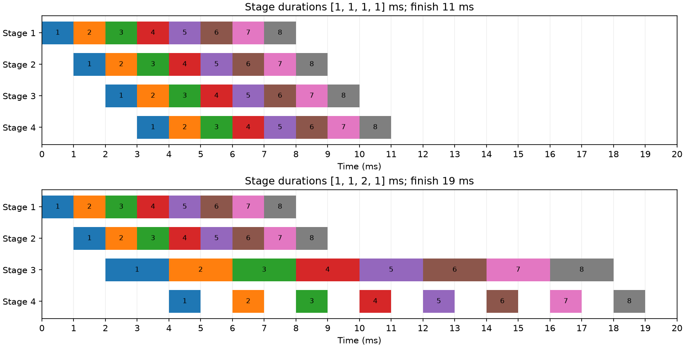
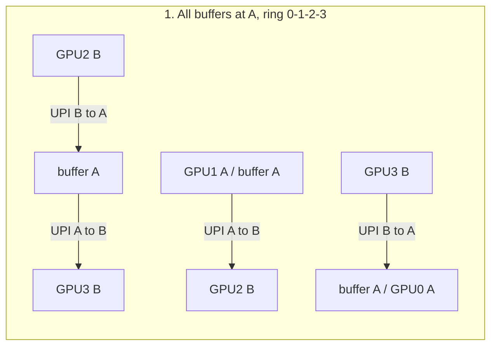
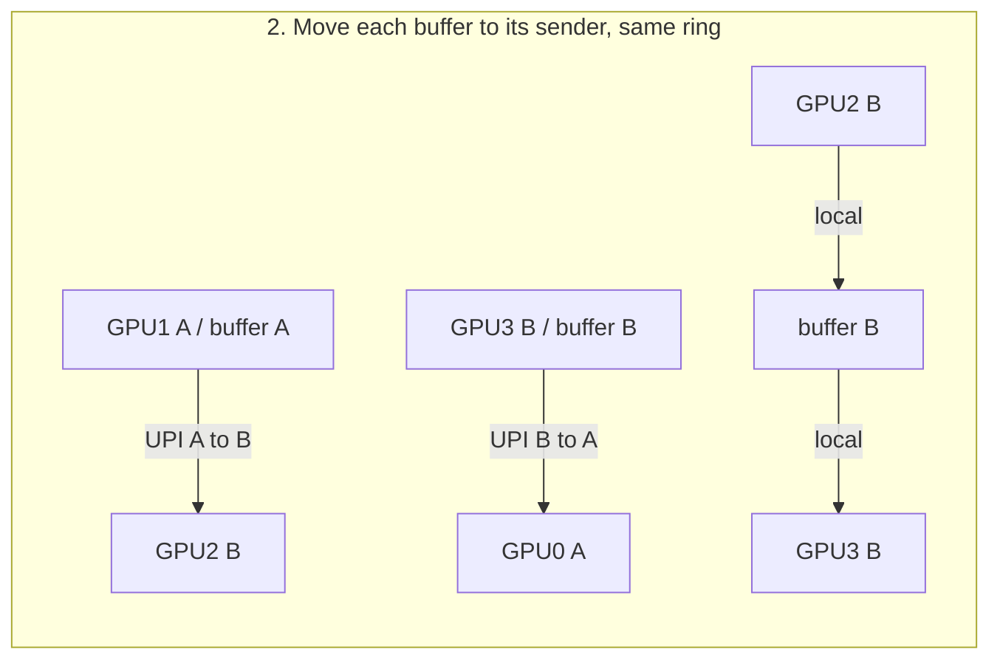
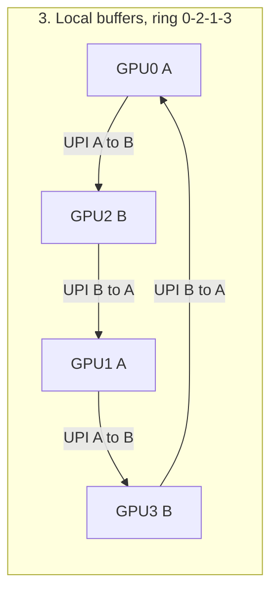
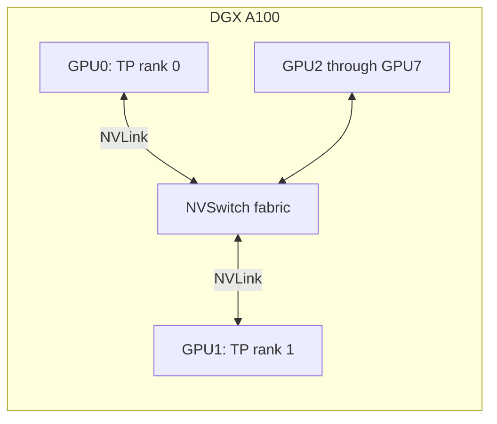
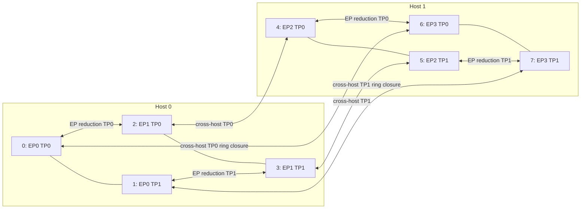

# 当前第6章逐题答案

当前第6章11题均已逐题完成，包括6-5的RTX单GPU选做。多卡拓扑与大模型放置题按各自要求完成分析，未将容量计划写成实际多卡部署；历史运行协议的硬件缺口仍保留。

## 6-1 上下文容量与专家计算

（a）固定官方配置：94层、4个KV头、头维128、BF16每元素2bytes。每token全模型KV=2×94×4×128×2=192512bytes（188KiB）。单请求4096／8192／16384token分别为788529152／1577058304／3154116608bytes，即0.734375／1.46875／2.9375GiB，十进制为0.788529152／1.577058304／3.154116608GB。这是所有层K与V的逻辑容量，不含重复副本或工作区。

（b）[run_6_1.py](run_6_1.py)核验原放置结果的四项来源SHA，并逐rank把所有张量BF16存储量相加；八张卡均为58959617024bytes。还用global_shape×copies独立重建全模型470187269120bytes，与官方权重索引总量匹配。不能只将全模型字节数除8，原布局包含重复张量；物理八卡权重合计471676936192bytes。

每卡KV保存全部逻辑KV的1/4（四个KV头在八卡间复制），不是1/8。32768token单会话每卡KV=1577058304bytes，每卡工作区2147483648bytes。因此最大同时保存会话数为

`floor((80000000000−58959617024−2147483648)/1577058304)=11`。

11会话每卡78454742016bytes，尚余1545257984bytes；12会话每卡80031800320bytes，超限31800320bytes。脚本核验相邻通过／失败配置。这是同一个八卡实例共11会话，不是每卡独立11会话后再乘8；也不保证11会话同时运行的延迟或运行时实际额外开销能满足服务要求。题设工作区总预留固定为每卡2GiB。

（c）每专家三矩阵，单专家权重3×4096×1536×2=37748736bytes（36MiB）；m个token各选8专家，矩阵FLOPs=2m×8×3×4096×1536。64token按均匀路由、token间独立、单token内8个不同专家的假设，选中专家数期望为128[1−(1−8/128)^64]=125.942349267。它是期望而不是一次实际分派的非整数专家数。8192token沿正文全部128专家均被选中的条件；权重在本次调用内每个专家只读一次。

|token数|选中专家数|矩阵FLOPs|权重读取bytes|计算时间ms|权重读取ms|模型调用ms|主要限制|
|---|---:|---:|---:|---:|---:|---:|---|
|1|8|301989888|301989888|0.000305225|0.090146235|0.090146235|内存|
|64|125.942349期望|19327352832|4754164493.703期望|0.019534418|1.419153580|1.419153580|内存|
|8192|128|2473901162496|4831838208|2.500405460|1.442339764|2.500405460|计算|

按一张H100的989.4TFLOP/s和3350GB/s，调用取max(F/P,V/B)。与题中一层专家算例保持一致；这不是把完整235B模型放进单卡，也不是八卡TP实测时间。计算量只含三个专家矩阵乘，不含路由、SiLU、加权合并、激活读写、注意力或卡间通信。64token可能负载不均，期望权重复用不能证明每卡工作均衡；实际权重重复加载也会改变结果。

（d）只将HBM降为1675GB/s，峰值计算不变。1token读取与模型调用增至0.180292470ms；64token增至2.838307160ms，两者均增长100%。8192token读取增至2.884679527ms，超过未变的计算2.500405460ms，因此调用增长15.368470%，从计算限制转为内存限制。不能因为基线是计算限制就断言降带宽没有影响，也不能把所有调用时间无条件乘2。完整精确计算及容量上下边界见[6-1-results.json](6-1-results.json)。

## 6-2 张量切分与流水时序

（a）使用正文行向量约定，X为m×h，Wg／Wu为h×f，Wd为f×h。沿中间维切成两半，六片为Wg⁽⁰⁾、Wg⁽¹⁾、Wu⁽⁰⁾、Wu⁽¹⁾各h×(f/2)，Wd⁽⁰⁾、Wd⁽¹⁾各(f/2)×h。每卡得到Z⁽ⁱ⁾=SiLU(XWg⁽ⁱ⁾)⊙XWu⁽ⁱ⁾，形状m×(f/2)，输出部分和Yi=Z⁽ⁱ⁾Wd⁽ⁱ⁾均为m×h。由[Z⁽⁰⁾ Z⁽¹⁾]乘纵向拼接[Wd⁽⁰⁾; Wd⁽¹⁾]可得Y=Y0+Y1；它们贡献于相同输出元素，不能沿特征拼接替代求和。

若取Qwen3-32B的h5120、f25600，上／门投影分片5120×12800，下投影分片12800×5120，两部分和m×5120。[run_6_2.py](run_6_2.py)用固定seed、FP64小矩阵执行完整与切分SwiGLU并核验一致（1e−12容差），没有通过只检查形状来代替数值检查。浮点加法重排不保证任意低精度实现逐位相同。

（b）沿本章128K续写第一步的精确约定，历史131064、本步131065位置；权重读取与KV读取按各自分片数计算，TP不超过8时二者均按p分摊。H100带宽3350GB/s，本地读取时间如下。

|TP|本地读取ms|相对上一级翻倍节省ms|只计本地加速比|128次归约ms|含归约单步ms|含归约加速比|
|---|---:|---:|---:|---:|---:|---:|
|1|29.350738|—|1|0|29.350738|1|
|2|14.675369|14.675369|2|0.213345|14.888714|1.971341|
|4|7.337684|7.337684|4|0.635665|7.973350|3.681105|
|8|3.668842|3.668842|8|1.478121|5.146963|5.702535|

（c）单次环归约2(p−1)α+2(p−1)M/(pB)，M10KiB、α0.822μs、每方向B450GB/s，每层两次、64层共128次。各配置计算时间均小于本地读取项，故式6-5为本地读取加通信。2→4与4→8净节省分别6.915364、2.826386ms，小于本地节省，因为同步轮数增加；1→2净节省14.462024ms。加速比用同一TP1理论时间作分母，TP1实际上无法保存128K会话，因此不是可执行单卡基线的实测加速。TP2／4／8可以容纳，不能把容量失败的TP1写成已运行。

（d）每阶段一次处理一个micro-batch，阶段间传递耗时设0、可排队缓存、不反压上游。开始时刻start[s,b]=max(end[s−1,b],end[s,b−1])，结束加该阶段耗时。脚本保存64个阶段任务的就绪、开始、结束和等待，并核对总时长=sum(stage times)+7×max(stage times)。

图中数字为micro-batch编号，两图相同时间刻度。四阶段均1ms时，第b批（b从1起）在阶段s的区间为[b+s−2,b+s−1]，第8批最终11ms完成。耗时1／1／2／1ms时，阶段3第b批在[2b,2b+2]，阶段4在[2b+2,2b+3]，最终19ms，比均衡情况多8ms（72.73%）。阶段2每1ms送来一批，阶段3每2ms接收一批，第b批在阶段3前等待b−1ms，最多第8批等7ms；阶段4每次只计算1ms，因此在阶段3产出间隙闲置。积压在第二、第三阶段之间，不能把阶段4的空白看作那里排队。若缓冲有限，上游会被反压，图中假设需相应改变。这是前向流水，不含反向、1F1B或传输延迟。

（e）选择保留token行分片（序列并行），不是隐藏特征分片。两张卡原有同形状m×h的部分和，BF16令完整张量V=2mh bytes，且m可均分。

|边界|完整输出方案|保留行分片方案|
|---|---|---|
|FFN下投影之后|AllReduce，每卡得到完整m×h，每卡发送V|ReduceScatter，每卡得到(m/2)×h，每卡发送V/2|
|残差、RMSNorm|每卡对全部行重复执行|每卡只执行自己的行，残差也需按同样行分片|
|下一列并行投影之前|已有完整输入，不需另收集|AllGather，每卡发送V/2并恢复m×h|
|两边界每卡总发送|V|V/2+V/2=V|

发送量采用两卡标准环、统计单卡发送而非收发之和，不含协议头。完整中间激活每卡2mh bytes；保留行分片期间为mh bytes，但不能据此保证分配器峰值减半，因为部分和和集合通信工作区仍可能存在。ReduceScatter后每个token仍有全部h个特征，因此残差加法和每行RMSNorm可本地执行。脚本把已归约输出按行分片、执行残差和RMSNorm，再拼回，验证与完整路径一致。若按隐藏特征切分，RMSNorm的平方和需要跨卡合并，不能沿用这个“本地归一化”结论。

对于后续仍要求完整行的列并行投影，总通信量未减少，只是将AllReduce的两半移到不同边界，中间算子避免复制；若后续一直接受行分片，AllGather可继续推迟。m1无法在此两卡行分方案均分出两个非空片，须采用不均分／填充并重新计量，不能声称单token的激活也自然减半。选择此题允许的输出布局比较，未额外声称实现二维网格。完整数据与来源SHA见[6-2-results.json](6-2-results.json)，图已视觉核验。

## 6-3 专家分派与放置

（a）token A最初在卡0，路由选择专家1和6并保留token编号、专家编号及路由权重a1／a6。专家1在卡0，直接用本地输入；A的输入副本经dispatch送到卡3，卡3运行专家6。本地专家1和远端专家6在各自输入就绪后可并发，不要求先后串行。得到y1、y6后，将y6及对应标识送回卡0，等待两份贡献齐全，再得到a1·y1+a6·y6。不能把输入权重相加、输出拼接或只保留先返回的一份当作combine。若远端已加权，返回后不应再乘一次权重。

（b）每token8个不同专家，共64×8=512次任务。脚本构造均衡路由(t×8+j) mod128，各专家恰4任务；集中路由则64个token都选择0—7，每专家64任务。每专家权重36MiB，批内只读一次：均衡总128×36=4608MiB（4.5GiB），四EP组各128任务、1152MiB；集中总8×36=288MiB，组0全部512任务，其他0。单个token—专家三矩阵计算37748736FLOPs，总19327352832，两路由相同；最忙组分别4831838208与19327352832FLOPs，后者四倍。TP2将各组矩阵工作各分一半，每卡最大2415919104与9663676416FLOPs，不改变任务的逻辑总数。

（c）保持同一批输入、同样八个热点专家和路由权重，仅将专家0／1、2／3、4／5、6／7分别放入四组。每组2×64=128任务、2×36=72MiB读取；全局仍288MiB、总FLOPs不变，最忙组回到4831838208FLOPs，变成集中时1/4。收益来自所有权重分配让四组工作，既不增加有效任务，也不凭空降低全局计算。这是选定batch下的静态重新放置，未计运行中迁移开销、其他batch路由变化或负载均衡器训练过程。三个显式路由逐项计数见[6-3-results.json](6-3-results.json)。

（d）TP2×EP4中每张卡保存两个KV头、94层，BF16。8192上下文每卡2×94×2×128×2×8192=788529152bytes，即752MiB；16384时1577058304bytes，即1504MiB。八卡物理合计5.875／11.75GiB，是对应逻辑KV1.46875／2.9375GiB的四倍：四个EP组分别保存完整请求的注意力状态，组内再分两个头。不能采用6-1全模型TP8时每卡只保存一个头的数字。

归约用FP32，每token向量4096×4=16KiB。两卡AllReduce每卡发送2(2−1)/2=1倍向量，注意力组内16KiB、专家组内16KiB；四个专家组同TP坐标归约每卡发送2(4−1)/4=1.5倍，即24KiB。每层每token合计56KiB／卡、448KiB／八卡；8192token prefill每层每卡448MiB，八卡3.5GiB。完整94层如都采用该通信模式，再乘94，为每token每卡5264KiB。以上是发送payload，不是收发之和，包含三次结果汇合，不额外虚构输入dispatch，因为该布局各组已有输入。上下文长度改变KV容量；当前decode输入仍一行，归约消息不因缓存长度直接倍增。

（e）选择DeepSeek V4-Flash的固定官方checkpoint原发布格式，采用PP8：43层连续分成6／6／6／5／5／5／5／5层，每阶段在一张H100 80GB上。各层的全部256路由专家、共享专家、注意力权重与相关状态放在同一阶段，专家内部TP1、不跨阶段EP。每次只考虑一个8192token请求，阶段间传递完整激活，后续阶段依赖前一阶段输出；这是容量优先的具体放置，不是最大单用户速度方案。

从46份JSON tensor header及weight_map逐键核验无遗漏、无重复、分片对应正确，总字节159609485896与索引一致。保持I8打包权重、F8_E8M0 scales、F8_E4M3权重及其余BF16／F32／I64张量的真实存储字节，不以参数量×2替代，也不将I8容器一概称为未打包INT8数值。嵌入放stage0，输出与未匹配主干层的辅助权重放stage7；MTP权重完整计入但本方案关闭MTP执行，其状态不另创建。没有从总账删掉辅助权重来使放置通过。

注意力状态选前文生产存储账本：main每entry584bytes（含格式／padding），CSA索引68bytes，每层窗口min(8192,128)×584；压缩比r非零时另加floor(8192/r)×[584+68·1(r=4)]。归属于该阶段的层逐项相加。压缩器工作状态、临时激活、集合通信与运行时空间统一在每卡显式2GiB预留中，未声称这是已profile的精确峰值。

|阶段|主干层|路由专家GB|共享专家GB|注意力权重GB|全部权重GB|KV bytes|含2GiB预留总GB|
|---|---|---:|---:|---:|---:|---:|---:|
|0|0—5|20.535312|0.151004|0.718905|22.514459|3193856|24.665137|
|1|6—11|20.535312|0.151004|0.757463|21.475343|4566528|23.627393|
|2|12—17|20.535312|0.151004|0.757463|21.475343|4566528|23.627393|
|3|18—22|17.112760|0.125837|0.641847|17.906746|4454400|20.058684|
|4|23—27|17.112760|0.125837|0.620592|17.885491|3156480|20.036132|
|5|28—32|17.112760|0.125837|0.641847|17.906746|4454400|20.058684|
|6|33—37|17.112760|0.125837|0.620592|17.885491|3156480|20.036132|
|7|38—42|20.535312|0.151004|0.748811|22.559866|4454400|24.711804|

每阶段均低于80GB，最大预算24.711804216GB；完整逐类字节和dtype直方图在JSON。辅助权重算入相应阶段的类别，因此最后一阶段虽只含五个主干层，也可能比其他五层阶段更大。保留原打包格式要求执行kernel支持该格式；若加载器展开成BF16，需另算容量。要物理验证此PP8方案，需八张兼容GPU、相应流水实现和跨阶段链路；当前单GPU不满足，按作者允许保留为硬件执行待办。题目要求的具体格式／逐项放置已完成，不以该容量账本宣称多卡推理跑通。复算[run_6_3.py](run_6_3.py)。

## 6-4 环形与树形归约

（a）沿图6-23的顺时针发送规则，rank r 在第 j 轮（j从0起）发送块(r−j) mod 4。每一轮同时发送，接收方把自己的原始贡献加入收到的部分和。块1的累加链如下；表中“持有”指本轮新收到的累计部分和，未要求清除发端残留副本。

|完成轮次|累计块所在卡|已加入的卡贡献|
|---|---:|---|
|初始|1|1|
|第一轮|2|1、2|
|第二轮|3|1、2、3|
|第三轮|0|0、1、2、3|

[run_6_4.py](run_6_4.py)同时模拟四个块，每轮先快照所有发送，再更新接收，检查没有重复加入贡献，最终卡0／1／2／3分别得到块1／2／3／0的完整和。不是把块0的最终所在卡误用于块1。

（b）设每卡待归约的完整张量为M bytes。ReduceScatter和AllGather各有n−1轮，每轮每卡发送M/n，所以每卡总发送2(n−1)M/n。四卡为3M/2，八卡为7M/4；10KiB输入分别发送15KiB、17.5KiB。这是发送量，不把接收量再混加成发送量。

同步环耗时T_ring=2(n−1)α+2(n−1)M/(nB)。正文的未分段二项树归约log₂n轮、广播log₂n轮，每轮关键路径发送完整M，故T_tree=2log₂n(α+M/B)。四卡为4α+4M/B，八卡为6α+6M/B；它不是树上每张卡都发送相同字节数的断言，也不覆盖分段、流水化或其他树算法。取α0.822μs、每方向B450GB/s，10KiB下四卡环／树4.966133／3.379022μs，八卡11.547822／5.068533μs。

（c）八卡相等时14α+7M/(4B)=6α+6M/B，得到M*=32αB/17。原参数为11836800/17=696282.352941bytes，即679.963235KiB；α减半后为5918400/17=348141.176471bytes，即339.981618KiB。脚本以精确分数检验等式，并检查交点两侧的整数byte：原参数从696283bytes起环严格更快，减半后从348142bytes起环严格更快。交点以下树更快。降低α减少环额外八轮的惩罚，而两算法传输量差不变，因此环在更小张量处就能胜出；并不意味着降低延迟使任何一种算法本身变慢。

（d）沿原Qwen3-32B、TP8、128K第一步账本（历史131064，本步读取131065位置），本地项3.668842221ms，128次归约。脚本重读配置并匹配原continuity-model.json第一步，保持相同权重、KV读取、HBM带宽和计算项，仅改归约算法或NVLink带宽。

|归约选择|单次归约μs|128次归约ms|整步ms|相比原环节省μs|
|---|---:|---:|---:|---:|
|环，450GB/s|11.547822|1.478121|5.146963|0|
|树，450GB/s|5.068533|0.648772|4.317614|829.348978|
|环，900GB/s|11.527911|1.475573|5.144415|2.548622|
|树，900GB/s|5.000267|0.640034|4.308876|838.087111|

单独选树使整步加速1.192085倍；单独加倍链路带宽仅1.000495倍，因为10KiB环的主要通信项是14轮启动。树再加倍链路带宽额外节省8.738133μs。这里带宽翻倍是NVLink，并非HBM翻倍；两项资源不能混用。采用正文通信与本地串行相加、无额外排队的下界模型，没有据此声称在RTX单卡上实测了八卡集合通信。全部数值、贡献集合与来源SHA保存在[6-4-results.json](6-4-results.json)。

## 6-5 通信重叠、准备成本与归一化顺序

（a）[run_6_5.py](run_6_5.py)核验原CPU实验清单所有文件SHA，从四rank原始日志重算45个正式组的最大rank操作区间，再核对五组中位数。图6-27／28采用这些操作区间，题设同时开始、后续等待两分支时，用独立通信+独立计算减去并发两区间的较大值：

|数据量|独立通信ms|独立计算ms|两者相加ms|并发通信ms|并发计算ms|并发较大值ms|条件节省ms|较长分支|
|---|---:|---:|---:|---:|---:|---:|---:|---|
|4MiB|2.673917|11.530583|14.204500|6.140792|11.522541|11.522541|2.681959|计算|
|64MiB|36.918834|11.030750|47.949584|45.208542|12.884875|45.208542|2.741042|通信|

4MiB通信虽然增长3.466875ms，仍短于计算；64MiB通信增长8.289708ms，计算增长1.854125ms，通信决定模型整体结束。不能用独立两者的min当成实际重叠收益，因为共享后各自时长也变化。这是图中区间的组合计算，原记录没有实跑“先通信再计算”的合并串行基线。

若换用最早rank开始至最晚rank结束的组墙钟，中位数相加再减并发组中位数分别为2.682210、2.794001ms。它们含启动、rank偏移和主机可见完成差异，不应替换图示区间后仍声称是相同指标。五个配对区组的墙钟差值均另存JSON；中位数之差也不等于配对差值的中位数。通信回调只记录主机可见完成，不能证明物理链路准确完成时刻。

（b）S≥0、固定Δ>0时，首次严格超过S要求nΔ>S，因此n_min=floor(S/Δ)+1。若只要求达到收支相抵，才是ceil(S/Δ)；当S/Δ恰为整数两者差一次。Δ≤0没有有限的正收益回收次数。用64MiB图示Δ=2741042ns、S=10⁹ns，364次为997739288ns，365次为1000480330ns，故最少365次。使用另一个墙钟口径Δ2794001ns会得到358次，不能将它写成图示口径答案。这里假设未来每次收益固定，不是用五次CPU观测证明未来稳定回报。

（c）取a=[1,0]、b=[0,1]，epsilon0、缩放1。先求和得[1,1]，RMSNorm结果[1,1]；分别归一化为[√2,0]与[0,√2]，求和为[√2,√2]。脚本直接计算并检查两结果不同，因此不能交换。保留共同epsilon≥0时两结果分别是每项1/√(1+epsilon)和1/√(1/2+epsilon)，有限epsilon下仍不同。融合实现必须让归一化使用完整归约结果。

（d）单GPU选做已在rtx-pro独占RTX PRO 6000执行。固定FP32矩阵[16,4096]@[4096,4096]、TF32关闭；另一分支是4／64MiB页锁定主存到GPU复制。每种大小各3预热、11正式随机顺序区组，每组transfer-only／compute-only／shared三条件，共84案例、66正式案例。复制逐元素完全一致，矩阵输出与CPU FP64参考转FP32完全一致；每次运行均检查输出。它比较同一GPU形状独立与共享执行，H2D路径不是四卡AllReduce。

两个CUDA stream等待同一个延迟释放事件，记录ready、操作前start和操作后end，验证所有事件顺序及22个正式shared案例的正区间重叠。事件包围stream操作，不是硬件指令级kernel开始时间。完整每次时间戳见[gpu-overlap/results.json](gpu-overlap/results.json)，独立分析见[gpu-overlap/analysis.json](gpu-overlap/analysis.json)。

|复制量|独立复制ms|并发复制ms|独立计算ms|并发计算ms|并发ready至两者结束ms|
|---|---:|---:|---:|---:|---:|
|4MiB|0.135488|0.136160|0.026304|0.033696|0.142656|
|64MiB|2.183520|2.160928|0.032448|0.039328|2.167936|

以上均11次中位数。4MiB复制增加0.672μs，计算增加7.392μs（约28.1%），计算区间改变较大；64MiB复制减少22.592μs（约1.0%），计算增加6.880μs（约21.2%）：绝对变化最大的是复制，但变慢的是计算，不能把较小复制中位数当成并发稳定加速证明。两种大小共享完成均受复制分支支配。就绪到开始的调度等待另在analysis中保留，未混入操作时长。这个结果描述PCIe／复制引擎与GEMM并发，不能推断NCCL争用SM、跨机链路或归约融合的收益。进程exit0，运行后GPU为0MiB且没有计算进程；没有留下后台占卡会话。

## 6-6 物理链路、缓冲与交换网络

（a）沿128K第一步，TP16本地2.475426770ms，加128×32.74μs，单步6.666146770ms。TP8为5.146963465ms。保持本地项不变，TP16单次AllReduce临界为(5.146963465−2.475426770)/128=20.871380431μs；低于此值才更快，原32.74μs需下降11.868619569μs（约36.25%）才到临界。这里仍使用实验7-3的16KiB档代替10KiB，具体原始行已在6-10核验。不是增加卡数就自动减半KV：TP16仍只有8个不同KV头。

（b）每端口每方向25GB/s。32下／32上提供800GB/s上联，32条GPU链路公平同时发时每条25GB/s；48下／16上提供400GB/s，每条平均400/48=8.333333GB/s，为物理25GB/s的1/3。公平平均不是保证每流瞬时吞吐，计算假设共同上联饱和、无其他瓶颈，不把双向带宽相加当单向出口。

（c）图6-31第三轮每rank i顺时针发给(i+4) mod16，每份1MiB。以有向边0→1为例，来自0→4、15→3、14→2、13→1的四份都经过它，合计4MiB；反方向1→0是另一条有向边，不能合并计数。脚本枚举16个发送方和每条四跳路径，所有16条顺时针边均承载4MiB，总物理传输64MiB；逻辑发出总量仍16MiB。四跳描述单份数据经过多少链路，4MiB描述多份共享同一链路后的累计量，两者概念不同。按50GB/s，瓶颈边4MiB至少83.88608μs；不能把它再乘四作为整轮时间，因为该负载已经累计所有路径的使用。Swing第三轮虽三跳，正文分散方向后最大边2MiB、全网48MiB，说明跳数本身不能唯一决定最忙链路量。

（d）四卡环形归约共发送48MiB，每卡所有轮合计12MiB。卡0／1在A，卡2／3在B。每次转发按“发送GPU→缓冲所在NUMA→接收GPU”追踪；节点变化才计UPI一次，PCIe流量另计。图中每条带UPI标签的箭头代表12MiB。

0→1完全在A，没有UPI。2→3虽然两个GPU都在B，却绕A，产生一去一回；1→2一次A→B，3→0一次B→A。因此两方向各24MiB。

移动缓冲后，2→3原来两次UPI都消失；3→0的跨越从“发送GPU到远端缓冲”移到“本地缓冲到接收GPU”，方向和字节数不变。两方向各降到12MiB，无新增跨CPU逻辑边。

改环后每条边都跨CPU：新出现0→2、2→1、1→3；旧1→2消失，3→0保留，原本本地0→1及2→3也消失。两方向各24MiB。脚本保存三种配置每个转发的缓冲节点、跨越列表和字节数，验证24／12／24MiB。这是主机中转模型，不把UPI计算误用于GPU直接P2P路径。

（e）8³环面共512卡、每卡6有向出口，共3072有向边、1536条双向物理链路。每维最大4跳，最远12跳。若每卡共发送M给其他511卡，最短距离枚举总和为3072，平均3072/511≈6.011742跳；在对称最短路、对跖距离均分方向、流量充分平衡时，每有向边为512M×(3072/511)/3072=512M/511。这个值也给出任何路由的最大边负载下界；不平衡路由可能更高。

正文用平均6跳得到每边M，是含自身距离的均值或大规模近似。严格排除自身时要保留512/511修正；4³的相应准确值为每边32M/63，而正文为M/2。脚本枚举全部坐标差核验，答案未用近似伪装严格等式。M32MiB、每方向50GB/s时512卡近似671.08864μs，精确约672.402μs。

保持每卡六个相同速率端口，构造六个独立交换平面，每平面接所有512卡各一条链路。每平面16颗叶芯片：各32端口下联、32上联；8颗脊芯片：每颗以4条并行链路连接每颗叶，16×4=64端口用满。每颗叶连8脊×4=32上联，也全部用满；每平面24芯片，六平面共144颗。端点链路3072条、叶脊3072条，总6144条物理链路。通过平面与等价上联均衡分流，每叶上下总速率相同，支持无收敛的可路由流量；单流不分流、固定路由或包调度约束可能使实际吞吐低于该设计带宽，不声称严格无重排电路交换保证。

相对64卡单级六芯片方案，卡数8倍，最远跳数2倍，固定M时每边环面负载约2倍，交换芯片6→144为24倍，交换物理链路384→6144为16倍。因此在题设64→512跨越交换层级的比较里，芯片数增长最快；不能把这一次层级跳变外推为所有规模永远24倍。环面总物理链路192→1536线性8倍，固定基数／层数能覆盖的规模也有限。所有端口等式、路径与来源见[6-6-results.json](6-6-results.json)。

## 6-7 功率预算与整组扩容

`python3 run_6_7.py`按每台八卡服务器10.2kW上限，以精确分数计算，包含服务器配套部件，不能仅用八张卡的700W相加。原120kW预算、无其他固定功耗时：64卡8台为81.6kW；72卡9台为91.8kW；96卡12台为122.4kW而超限。

（a）预算150kW时最多floor(150/10.2)=14台，即112卡，用142.8kW；15台153kW不满足。扩容粒度为整台八卡服务器，不能将7.2kW余量除以单卡700W另塞卡。

（b）超过64卡时为二级交换设备另留10.2kW，功率为10.2n+10.2·1[n>8]。120kW可装10台80卡，共112.2kW；11台88卡需122.4kW而失败。64卡仍只需81.6kW，额外交换功率在越过门槛时才加入，不能给所有n固定加一次或漏掉它。

（c）若只按四台／32卡整组安装，取n∈{0,4,8,12,…}。8台64卡通过，下一组12台96卡含交换需要132.6kW，所以最多64卡，尚余38.4kW也不够下一个含交换的51kW增量。三项上限112／80／64分别来自预算增加、交换开销、离散扩容粒度；并非GPU计算能力发生变化。

（d）选择（b）的80卡与（c）的64卡，均以每服务器一个TP8实例服务Qwen3-32B的128K会话，独立实例之间不做跨服务器TP。沿前文相同八步续写账本，初始历史131064，每步追加一个token；脚本重新调用原step函数并求八步和，得到每会话41.175981605ms，且每实例容量检查通过。

|配置|独立TP8实例|每会话八步时间ms|条件饱和会话/s|条件输出token/s|
|---|---:|---:|---:|---:|
|64卡|8|41.175982|194.288|1554.304|
|80卡|10|41.175982|242.860|1942.880|

80卡多25%实例，条件聚合能力多25%，不会使单会话更快。按每实例一次一个会话、所有实例有任务、无额外排队／恢复／供数限制计算，不能作为实测机柜吞吐；需求不足时也不能兑现该比例。功率为安装预算上限，未用于伪造每任务实测能量。完整枚举、相邻失败配置和来源SHA见[6-7-results.json](6-7-results.json)。

## 6-8 通信组、割集与连接状态

（a）选择正文介绍的DGX A100八卡NVLink／NVSwitch系统，用一个TP2组说明路径。下图是逻辑交换层示意，不表示只有一颗物理NVSwitch或只有一条物理链路。

两卡输出部分和经NVLink进入交换层，到达对端完成归约；通信组是{0,1}，另外六卡虽接在同一结构上，并非自动参与本次集合通信。该路径没有跨服务器网卡。逻辑归约轮次和实际交换转发层是不同概念；图不能替代完整布线图或为所有端口赋予未给出的型号带宽。

（b）k³环面沿x维等分需切断中间及首尾两个平面，每个k²条双向物理链路，合计2k²。脚本枚举每条正方向邻接边并检查两端所属分区，4³得64芯片、32二分链路；8³得512芯片、128链路。芯片8倍、割集4倍，故每芯片份额减半。若每条链路每方向50GB/s，A→B的割集分别1600／6400GB/s；分别由A侧32／256个发送芯片共享，每个发送芯片50／25GB/s。若归一化到全系统芯片数则为25／12.5GB/s，但不能把这个分母口径与发送半区混用。反向B→A另有相同带宽，不把双向合计用于单向数据。

（c）采用正文的重复注意力、组内专家输入已完整、最终跨专家组求和方案。主机0放卡0—3，主机1放卡4—7；TP组{0,1}、{2,3}、{4,5}、{6,7}均留机内。按TP坐标分别组织专家组归约{0,2,4,6}与{1,3,5,7}，两组都跨主机。

图中跨组边画成一种逻辑环；库可采用分层算法，不要求真实四条独立网络链路。组内TP求和与跨EP求和是两个阶段，不能把EP组误写为{0,1,2,3}和{4,5,6,7}，那会漏掉另半专家的贡献。若改用不重复注意力的dispatch方案，还需输入跨主机分发；此题沿正文布局，不把省略dispatch推广为所有MoE实现。

（d）A64时S_pair=512×64²(H−1)+32×64=2097152(H−1)+2048bytes。256KiB缓存仅H1可行，即只能保存本地主机记录，不能支持任何远端主机的全端点逐对连接；H2需2099200bytes。扩大至1MiB仍不足以放H2。192主机需400558080bytes，即382MiB+2KiB，约为1MiB缓存的382倍。

同样64端点，端点加通道模型S=3328+56(H−1)，192主机仅14024bytes；256KiB容纳4622主机，1MiB容纳18666主机。脚本对每个上限验证下一个主机恰超限。这里算的是所有关系的上下文全驻留，不声称溢出后网络不能工作；按需缓存和主存取状态能继续工作但有额外开销。参数是题设模型，也不是CloudMatrix每台主机实际端点数的测量。

（e）N=M1024、每次系统调用5μs、RTT50μs。逐对每连接4次调用加1RTT=70μs，共1048576连接，串行73.40032s，理想32核均分2.29376s。端点加通道为N×5+M×(5+50)=61440μs，即串行61.44ms、理想32核1.92ms。与原RTT500μs的串行545.25952s／522.24ms相比，两者均变快。

对RTT的绝对敏感度分别NM和M：RTT每增加1μs，串行总时间增加1.048576s和1.024ms，逐对大1024倍。若比较这次RTT缩短后的倍率，则逐对约7.43倍、端点加通道8.5倍；绝对敏感度和相对加速不是同一指标，不能混用。理想并行假设没有控制面锁、带宽或远端串行瓶颈，不是实测启动时间。

此处沿正文用M分别计远端端点关系和远端主机通道；比较同一个物理场景时可取每远端主机一个被访问端点。若每主机有多个远端端点，必须另外给远端主机数R，通道创建RTT项应为R，不能无条件继续用远端端点总数M。这个设定与（d）的A64状态计算是分开的两个题设。

（f）选择正文TPU v4的4³电互联单元加OCS。安装需求决定单元边界：64芯片与16CPU主机可放一柜，直接扩大为8³则要跨柜。通信需求决定单元内规则环面及编译器布局沿维度映射；扩大后每芯片二分带宽下降，任意All-to-All不能凭更多芯片获得等比例吞吐。作业分配又要求空闲芯片组成可用切片；同样数量空闲芯片若碎片化，未必有连续形状。OCS在单元之间改变光路，提供可用形状而不必将所有芯片固定为同一个大电互联块。重连有耗时，必须由后续执行收益摊销，不能将OCS视为每条消息都可免费重接或提高每条ICI物理速率。这里解释正文系统设计，不声称在现有RTX服务器上安装或测量TPU／UB设备。结果、分区边与来源见[6-8-results.json](6-8-results.json)。

## 6-9 借用内存、事务窗口与本地缓存

（a）四节点各80GB，总容量320GB。需求100／60／40／40GB，其中任务0有20GB尚未放置；借用前物理已占80／60／40／40GB，共220GB。其他三个节点空闲20／40／40GB，合计100GB。借用节点1的20GB后，物理占用80／80／40／40GB，共240GB，等于需求；剩余0／0／40／40GB，共80GB。节点1的80GB中60属于任务1，20属于任务0。不能把借用前“100GB需求”当成在80GB节点已实际存放的100GB，也不能说借用增加了系统物理容量。

（b）每事务q256bytes，路径BW50×10⁹bytes/s，满足窗口条件需u≥ceil(BW·L/q)。RTT7.52μs时需ceil(1468.75)=1469；RTT15.04μs时需ceil(2937.5)=2938。倍增RTT并非再次把7.52当单向延迟；它已经是一轮往返。`run_6_9.py`用整数／精确分数核验ceil上下边界。

（c）有效带宽上界min(50GB/s,uq/L)，一次完整读取20GB按D/B计算。完成前不开始下一次完整读取时，连续读取次数上界为B/D：

|RTT μs|在途事务u|窗口带宽GB/s|有效上界GB/s|读取20GB时间s|最多完整读取/s|
|---|---:|---:|---:|---:|---:|
|7.52|128|4.357447|4.357447|4.589844|0.217872|
|7.52|4096|139.438298|50|0.400000|2.500000|
|15.04|128|2.178723|2.178723|9.179688|0.108936|
|15.04|4096|69.719149|50|0.400000|2.500000|

这里“每次完整读取串行”不等于一个256byte事务完成后才发下一个：每次20GB读取内部仍最多有u个独立事务。4096在两种RTT下均足以覆盖线速窗口，所以加倍延迟不改变表中50GB/s服务项；实际启动／排空、协议、竞争和依赖仍可能增加时延。它们是声明接口模型下的服务下界／频率上界，不是现有RTX Docker HTTP测量，也不声称实现了UB或RDMA路径。

（d）沿正文“先取回，再本地读r次”的计数，直接远读Tremote=rD/Bremote；缓存Tcache=D/Bremote+rD/Blocal。本地HBM3350GB/s，单次20GB读约0.005970149s。缓存严格更快需r>Blocal/(Blocal−Bremote)；线速50GB/s时临界67/66≈1.015152，最小整数为2。r1缓存多一次本地读而较慢；r2起受益。r10直接4s，缓存0.459701493s，条件节省3.540298507s。

使用128事务的受限远端带宽，同样公式在两种RTT下最小整数仍为2；r10分别由45.8984375／91.796875s减到4.649545243／9.239388993s。完整精确边界保存在JSON。若取回本身已经完成第一次算法读取，可采用另一计数约定，但不能一边用正文公式、一边少算一次本地扫描。

缓存需要额外20GB（约18.626GiB）本地可用空间及传输／运行时工作区。原节点0已占满80GB，不能无条件再容纳这20GB；必须释放、逐出或迁移其他数据，或采用分块缓存并重算其收益。远端原件若保留，本地副本还增加系统物理占用20GB。重复读取比较假设快照不变，更新、失效和一致性管理可能增加成本；容量收益和重复读取收益不能脱离各自条件合并宣称。结果及物理守恒检查见[6-9-results.json](6-9-results.json)。

## 6-10 完成期限、计费与故障恢复

（a）固定Qwen3-32B、初始历史131064、续写8步、4会话同时到达，八卡分成8/p个TPp实例。按会话编号模实例数分配，每个实例一次执行一个会话；同实例的下一个会话等待前一个完成，不跨会话batch。第j步（j从1起）读取131064+j个位置。本地项为[WEIGHT_READ/p+KV_TOKEN·(131064+j)/min(p,8)]/3350GB/s，计算项沿原矩阵FLOPs除p和989.4TFLOP/s，单步为两者较大值加128次环归约；八步逐项相加，不能用第一步直接乘8忽略KV增长。

[run_6_10.py](run_6_10.py)独立展开上述公式，保存每步的读取／计算／通信项，与原continuity模型、已归档健康和40ms故障时间线匹配。结果如下，完成列表按会话编号排列。

|TP|独立实例|单会话八步ms|四会话完成ms|总GPU·s|128K容量可行|
|---|---:|---:|---|---:|---|
|1|8|234.808093|234.808093 / 234.808093 / 234.808093 / 234.808093|1.878465|否|
|2|4|119.110804|119.110804 / 119.110804 / 119.110804 / 119.110804|0.952886|是|
|4|2|63.787344|63.787344 / 63.787344 / 127.574688 / 127.574688|1.020598|是|
|8|1|41.175982|41.175982 / 82.351963 / 123.527945 / 164.703926|1.317631|是|

TP1每实例最多0个128K会话，时间只供理论对比，不是可执行候选。TP2／4／8每实例最大会话数为2／7／16，实际分配1／2／4个，均满足存储容量。

（b）75%等于至少3个会话。100ms时TP2完成0个、TP4与TP8各2个，均不满足。130ms时TP2／4／8分别完成4／4／3个；170ms时三者均完成4个。计费按正文八张卡从到达至最后会话完成一直占用，GPU·s=8×最后完成秒数，不按每卡活跃kernel时间收费，也不能在期限处停止计费。

130ms时每个按时会话成本TP2／4／8为0.238222／0.255149／0.439210GPU·s；170ms时分别0.238222／0.255149／0.329408。两种期限下TP2成本最低。总GPU·s不随完成期限改变，改变的是按时会话数这个分母；100ms没有可选方案，不能从不达标者中选“合格最低成本”。

（c）两台HGX H100、TP16使用实验7-3的hgx2、out_of_place、16rank记录。实际10KiB消息按正文取不小于它的最小记录16KiB，raw/hgx2.txt第81行32.74μs、错误0；脚本匹配CSV与原始文本，未选in-place的32.24μs。每步本地权重分16份，KV仍只分8份；各步加128×32.74μs，八步合计53.329448ms，超过50ms约3.329448ms。多一台服务器不能保证更快。这是归档通信实测代入模型，没有新跑两台机器或声称实际10KiB恰为该时延。

（d）20ms卡0失效，包含卡0的实例停止；恢复后从正在执行的会话起点重做八步，之前20ms工作丢弃。40ms停顿在60ms重启，10ms停顿在30ms重启；不是只把原完成时刻加40或10。其他实例继续，相同实例后续会话依次后移。128K结果：

|停顿ms|TP|四会话完成ms|总GPU·s|130ms按时数|每个130ms按时会话GPU·s|130ms满足75%|
|---|---|---|---:|---:|---:|---|
|40|2|179.111 / 119.111 / 119.111 / 119.111|1.432886|3|0.477629|是|
|40|4|123.787 / 63.787 / 187.575 / 127.575|1.500598|3|0.500199|是|
|40|8|101.176 / 142.352 / 183.528 / 224.704|1.797631|1|1.797631|否|
|10|2|149.111 / 119.111 / 119.111 / 119.111|1.192886|3|0.397629|是|
|10|4|93.787 / 63.787 / 157.575 / 127.575|1.260598|3|0.420199|是|
|10|8|71.176 / 112.352 / 153.528 / 194.704|1.557631|2|0.778816|否|

130ms下停顿缩短后合格集合仍是TP2／TP4，TP2仍更便宜；TP8按时数从1变2，仍不到3，不能声称恢复加快必然让它合格。100ms两种停顿下都无合格方案。170ms下40ms停顿只有TP2／4合格且各3个按时；10ms停顿让TP2／4各4个按时、TP8也达到3个，因此TP8进入可选集合，但成本仍较高。JSON也保存32K两种停顿的完整比较，未以128K结果代替它们。

（e）32K设初始历史32760、续写后32768；无故障、130ms、至少3/4目标不变。TP1／2／4／8每实例最大保存1／10／28／64个会话，都能容纳实际分配的1／1／2／4个；容量不再排除TP1。八步服务为173.268263／88.340889／48.402386／33.483503ms。四会话最晚完成173.268263／88.340889／96.804773／133.934011ms，按时0／4／4／3个，所以时间排除TP1，TP2总0.706727GPU·s、每按时会话0.176682GPU·s，仍为最低。

题目没有给新的数值功率上限，不能擅自从10.2kW整机上限推导四种TP的不同实际功率。沿正文八卡整机始终分配的预算口径，四种配置均按10.2kW包络：若允许上限低于10.2kW，则都不能按此包络保证满足；若至少10.2kW，功率不进一步区分TP2／4／8。脚本显式比较10／10.2／12kW三个条件，前者没有可保证的部署，后两者仍选TP2。实际功率可能低于上限，要用限功率后的性能和功率实测才能改变该结论，不能把包络不足写成已测超功率。

按10.2kW乘32K最后完成时间，TP2／4／8的条件能耗上限为901.077071／987.408682／1366.126917J；这是预算计算，没有电表测量。128K先以容量淘汰TP1，32K则以时间淘汰TP1，功率单独作为所有候选都需通过的条件。各步、各期限、恢复事件、成本、原始测量行与来源SHA见[6-10-results.json](6-10-results.json)。

## 6-11 综合算例（全部子题已完成）

六个子题已完成，采用各自明确的布局和单因素条件。总索引见[6-11-results.json](6-11-results.json)；早期partial文件保留当时仅覆盖a／c／f的记录，其pending字段不代表最终状态。[run_6_11_partial.py](run_6_11_partial.py)重读官方分片头、配置及KV／forward计算，重建模型结果与原归档逐字段相同，再逐项改变参数；[6-11-partial-results.json](6-11-partial-results.json)记录明确完成／待办部分和来源SHA。

（a）按完整字节值计算，K180703360bytes、工作区2147483648bytes，8／64／128／256卡超节点每卡权重分别71013068098／17216875184.25／13374289976.125／11452997372.0625bytes。原模型按均分后的平均字节数建账，分数来自该假设，不是实际分片可以保存分数byte。容量分别37／335／356／367会话；脚本核验再加一会话都超过80GB。将TPOT由50ms收紧到20ms，最大容量处步时间14.060305／17.250611／18.358194／18.939041ms，全部通过，故可服务会话数不变，仍受容量限制。正文四舍五入9.5／288.8／203.1GB及180.7MB不适合替代这些精确容量边界。

（c）仅改跨服务器启动5→2μs、每卡两张50GB/s网卡理想合计100GB/s，沿原50ms目标与每卡335会话；其他参数保持不变，假设两张网卡可均衡分流。原跨机步时间42.797411ms，新28.149731ms，其中通信14.567680ms；本地同335会话步时间17.250611ms，通信3.668560ms。改进后仍慢10.899120ms，不能追平超节点内实例。比较固定相同batch，没有通过减少会话数制造追平；两网卡不能保证实际流量均分，结论为模型下界。20ms是（a）的单因素变化，此处按（c）改网络、其余原参数不变，不能误说28.15ms满足20ms目标。

（f）沿正文每步开始预取、首块窗口取整步时间/40的模型，主机RTT改为2μs，则隐藏条件T_step/40≥2μs，即T_step≥80μs。H100和ROM阈值都为12500token/s；恰好相等无额外等待，速度严格超过此值开始暴露查表等待。当前H100窗口69.118861μs、ROM窗口6.142746μs，均能隐藏2μs。两者阈值相同来自同样40层的比例窗口假设，不表示两者当前速度相同；若首块与平均块时长不符，应使用真实首块事件重算。这里的2μs按题设为查表取回延迟，未另行重复加48次RTT；多行请求不能并发或需要另计传输时间时阈值也会变化。

（d）进一步读取本机OpenTallas固定commit c7093ba的roofline.py，按其真实公式重建原159.068356928μs通信并与归档匹配；源码快照在sources/opentallas-roofline.py。57分区mesh的AllReduce跨越次数为1.1×2×(ceil√57−1)=15.4，80次、每跳125ns，片上传播154μs；片上载荷另0.000090261μs。晶圆之间一次点对点包含5μs传播和0.068266667μs传输。只把片上每跳125→62.5ns，通信变82.068356928μs，跨晶圆及两处载荷项不变。

式6-15中的存储计算项仍max(68.930777592,1.618092661,5.538719514)/0.9=76.589752880μs，固定流水10.051735375μs不变。新token时间168.709845182μs，速度5927.336362token/s，通信占48.644676%。不能把159μs全部减半，否则额外减少了题目未要求改变的跨晶圆时间和载荷传输，也不能把固定流水延迟混入每跳项。此为分析设计，没有已流片ROM实测。

（e）沿原200000token十进制上下文，将1M解释为1000000。从固定KV源层及压缩比重算：全局状态890000000bytes，固定SWA窗口2703360bytes，总892703360bytes。原SRAMKV设计只分配180703360bytes给KV，因此一个1M会话也放不下，驻留0；原HBMKV设计容量1741500000000bytes，可放1950会话，第1951会话需1741664255360bytes，超限。SRAM设计没有自动扩容为WSE-3的44GB，那是正文另一个权重容量对照，不能借来补足此设计。

若读者用二进制1Mi=1048576位置，结果为全局933232640+窗口2703360=935936000bytes，HBM1860会话、SRAM0；这项替代解释也保存边界核验。两种解释均不能简单将原9637除5，因为全局历史随长度增长，窗口固定。脚本还重现200K时9637／1的原始容量，未用四舍五入MB作分母。完整组件与边界在[6-11-de-results.json](6-11-de-results.json)，运行[run_6_11_de.py](run_6_11_de.py)。

（b）选择主注意力query-head／输出group的TP8，保持其余模块不变。按原固定权重格式，分片wq_b、wo_a、wo_b及attn_sink，共4702218240bytes，每卡保存1/8。wq_a低秩投影、共享latent的wkv、归一化、压缩器、完整indexer仍复制；共享专家、输出头、原EP的dispatch／combine也不改。该模型的KV在不同query heads之间共享，不能因TP8而将其读取或容量除8。复制indexer让八卡得到相同候选索引，避免引入额外的index-score归约；这是明确的注意力布局选择，不是直接把原推理程序world_size设8（该开关还会切分indexer及其他模块）。

脚本从48份固定checkpoint header逐张量提取可分片项，重建原9531704768bytes复制权重及8207877568bytes每步复制读取总量，核对40层均覆盖，注意力头／输出组数可被8整除。未切分的复制读取3505659328bytes保持不变，含每层至少一个路由专家的原关键路径权重读取，改变后总权重读取4845462208bytes；KV仍46763136bytes。本地读取(4845462208+46763136)/3350GB/s=1.460365774ms。即使保留未切分的完整计算上界0.040543437ms，也小于读取，因此无需通过把所有FLOPs除8来制造更低时间。

每层注意力输出部分和要相加，按原RowParallelLinear的FP32归约语义，消息5120×4=20480bytes。沿本算例α0.833μs、450GB/s、八卡环：单次14α+1.75M/B=11.741644444μs，40层共469.665777778μs。原EP通信76.197333333μs不变，整步=1460.365774328+469.665777778+76.197333333=2006.228885439μs，得到498.447613token/s，相对原361.695775token/s加速1.378085倍。若无新增通信或将全部8.2GB复制权重一律除8，会高估收益。

该结果是正文聚合读取／计算取max后加通信的理想模型，具体kernel布局、低精度舍入、缓存和调度仍需另行实现与实测；未将它写成RTX单卡实际运行八卡attention。保留完整indexer的原因和切分范围均明确，其他布局可有不同索引通信成本，不能混用此结果。每张量字节数与源码哈希见[6-11-b-results.json](6-11-b-results.json)，复算脚本[run_6_11_b.py](run_6_11_b.py)。
