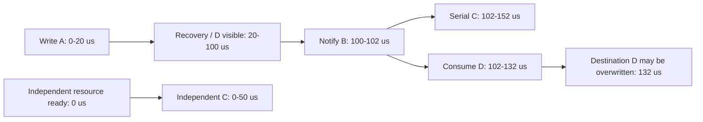
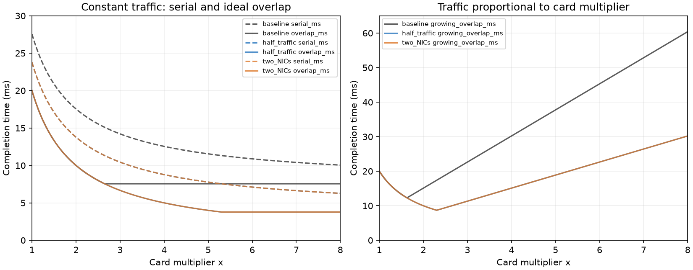
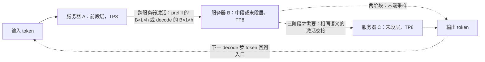
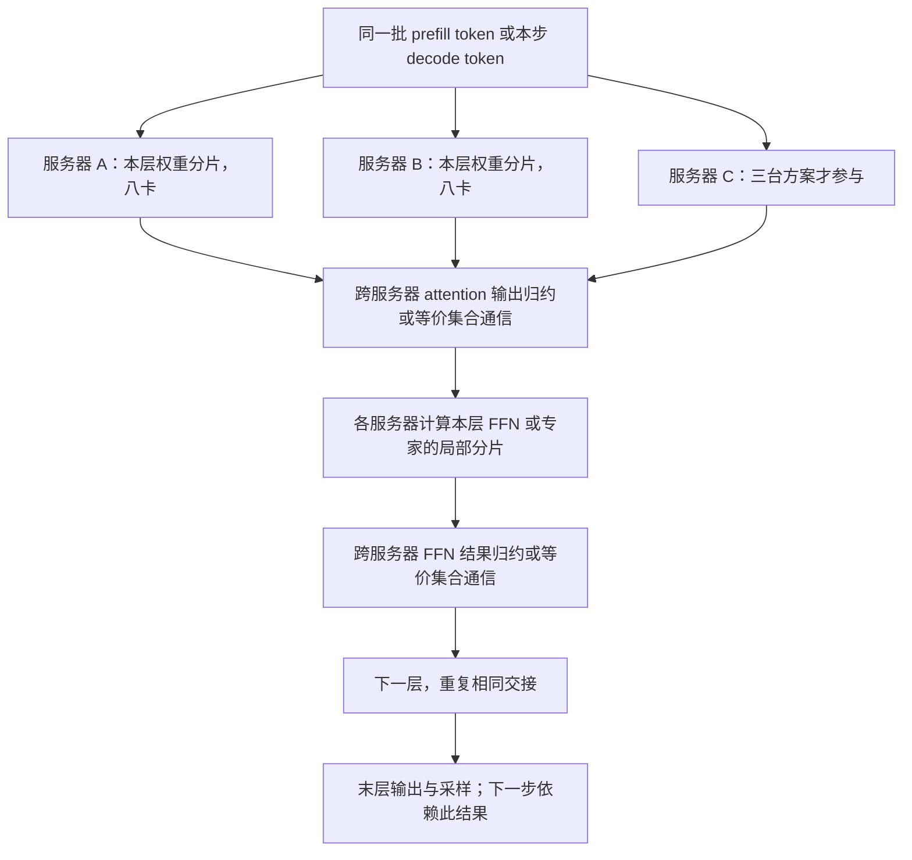
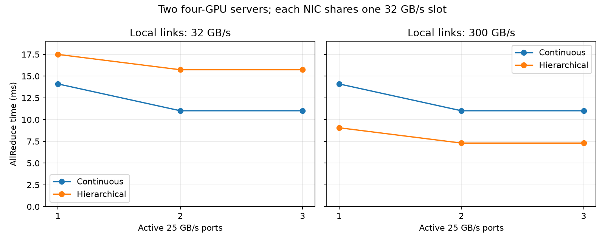
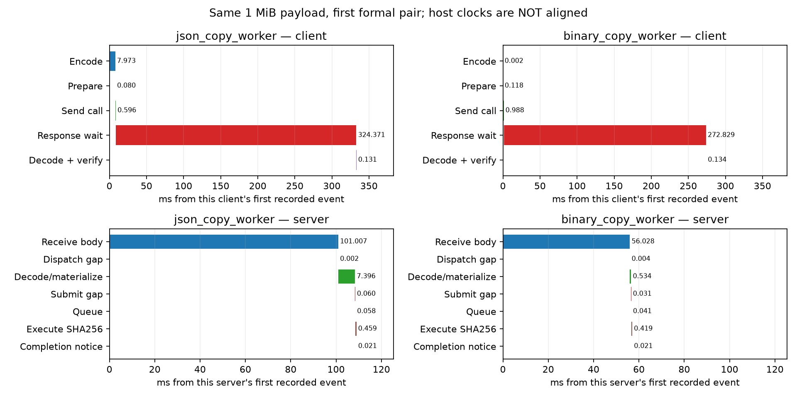
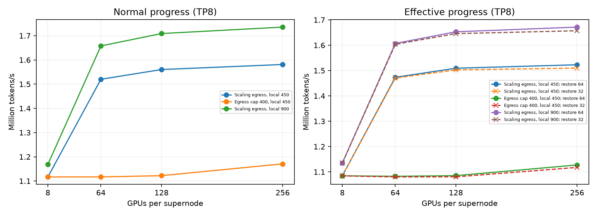
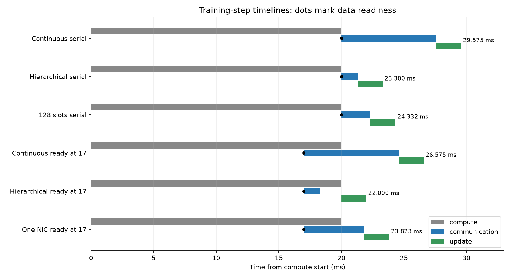

# 当前第7章逐题答案

当前第7章7-1至7-15全部逐题完成。这里的精确计算按正文模型，未以公式代替题目另行要求的实测。[run_7_8_11.py](run_7_8_11.py)使用分数计算并检查上下边界。

## 7-8 在途槽位、发起间隔与指针链

槽位占用T4μs从发出到记录可复用，不能再加一遍往返。目标B50×10⁹bytes/s，槽位条件n≥ceil(BT/m)。256B需ceil(781.25)=782槽；4KiB需ceil(48.828125)=49槽。脚本验证少一个槽不够、取该整数通过。原128槽在4μs时的槽位带宽上界为8.192GB/s（256B），4KiB时131.072GB/s再受物理路径限制到50GB/s。

完整上界为min(B,nm/T,m/δ)。上述782只是覆盖占用时间的必要条件，不保证满足发起速率：256B、δ18.6ns时最大13.763441GB/s；δ6.2ns时41.290323GB/s，均达不到50GB/s，即使有无限槽位也不够。对4KiB两种发起间隔均不先限制50GB/s，49槽在该理想模型下足够。

固定δ18.6ns，载荷需m≥Bδ=930bytes；δ6.2ns需至少310bytes。按整数byte计这些是可达到等号的最小值，不擅自向上改成1KiB；若接口要求对齐或固定粒度，需另按该粒度取整。还必须配足槽位：在最小载荷930／310bytes处分别需要216／646槽。50GB/s在这里是有效载荷带宽模型，协议头／编码不另重复扣除。

指针链中第i次结果给出第i+1次地址。单条链无法利用独立地址的大量并发隐藏数据依赖，增加槽位不能让尚未知的地址提前发出。设返回下一地址的数据可用延迟为L，发起间隔δ，则在记录资源充足且忽略本地指针处理时，长度n的链至少用L+(n−1)max(L,δ)，当L远大于δ时约nL。若严格等槽位释放后才提交下一次，则这里每项4μs，完成并释放整条链约4nμs；例如1000项约4ms。

题目只给槽位占用4μs，未给“下一指针何时已可读取”的独立事件。数据可能在完成处理／槽位回收前可用，所以不能无条件把4μs视作指针依赖延迟并声称精确4nμs；保留这一条件是为了区分数据返回与槽位生命周期。若每项仅用一个槽且必须等其复用，串行发起间隔至少max(T,L,δ)。多条独立链可在链间交错，但那改变了并发负载，不消除单链线性依赖。数值见[7-8-results.json](7-8-results.json)。

## 7-11 反馈时延与排空

初始Q0=256KiB=262144bytes，反馈生效前净增长100−50=50GB/s。最大反馈延迟t=(C−Q0)/(50×10⁹)，512KiB容量为5.24288μs，1MiB为15.72864μs。必须减去已有积压，不能用C/B当成全部可用反馈时间；等号表示理想连续流模型下刚好满而尚未超出。

题设反馈在刚好满时生效，故反馈后的初始队列是C，不能仍用原256KiB。反馈后到达率r小于50GB/s时，净排空速率50−r，Q(t)=max(0,C−(50−r)×10⁹t)。

|缓冲容量|允许反馈μs|r50GB/s排空μs|r45GB/s排空μs|r40GB/s排空μs|
|---|---:|---|---:|---:|
|512KiB|5.24288|不能排空|104.8576|52.4288|
|1MiB|15.72864|不能排空|209.7152|104.8576|

r50时每秒离开的数据恰被新到达数据补上，积压恒等于满缓冲，有限时间内不会清空。更大的缓冲允许更远的反馈距离，但若都在满时降到相同速率，排空也更久。表中时间从反馈生效算，不含此前增长段；若需从最初时刻到清空，总时间还要加对应反馈时延。

结论假设反馈立即把入口改为恒定新速率、出口持续50GB/s、无额外在途突发和报文粒度。它是题目的连续流量边界，不是现实交换机可在完全满时无余量工作的保证。完整分数检查见[7-11-results.json](7-11-results.json)。

## 7-12 Incast 与反馈距离

N是包括接收者在内的参与者数，因此发送者N−1个，各50GB/s；两张接收网卡合计出口100GB/s。净积压速率为[(N−1)×50−100]=(N−3)×50GB/s。按剩余缓冲Q_free=1MiB而非总缓冲计算，允许反馈延迟Q_free/净积压速率。

|N|发送者|到达GB/s|超额GB/s|允许反馈μs|30m headroom bytes|
|---|---:|---:|---:|---:|---:|
|8|7|350|250|4.194304|82500|
|16|15|750|650|1.613194|214500|
|64|63|3150|3050|0.343795|1006500|

每根线缆仍是单端口50GB/s；两网卡聚合100GB/s没有把单个1500B报文的串行化时间减半。沿正文30m、5ns/m，一跳反馈为2×30×5ns+1500/(50GB/s)=330ns=0.33μs。headroom按对应超额速率乘0.33μs，三种均小于1048576bytes；N64只剩42076bytes余量。脚本与原incast记录的一跳反馈值核对，再改出口，不混用单端口和合计带宽。

线缆100m时，一跳反馈2×100×5ns+30ns=1030ns=1.03μs。N8／16／64的headroom分别257500／669500／3141500bytes；N64约2.995968MiB，超过1MiB，因此沿题设模型也不能在缓冲用尽前完成暂停。允许反馈时延本身仍由速率和缓冲决定，线缆增长改变实际反馈距离而非允许值。

最后用5μs端到端反馈，要求max(0,(N−3)×50GB/s)×5μs≤1048576bytes。N7需要1000000bytes，通过；N8需要1250000bytes，失败。因此最大N=7，即6发送者加1接收者。N≤3时到达不超过出口，没有持续净增长，此时不应用负值除法制造负反馈预算。

这是沿正文聚合队列的连续流量headroom模型，假设接收流量可分到两条出口并共享声明的剩余缓冲。真实PFC按端口／优先级触发，发送暂停帧处理、阈值、同时在途的报文以及接收端口负载不均可能要求更多余量；不能用聚合100GB/s保证某个仍只有50GB/s的单端口不拥塞。题设未提供这些附加开销，没有把它们杜撰进数字。完整精确分数边界见[7-12-results.json](7-12-results.json)，复算[run_7_12.py](run_7_12.py)。

## 7-9 共享状态与隔离组

先用教学尺寸e256B／端点、r64B／关系、t1024B／传输状态。64端点只访问一个目标时，端点身份16384bytes、绑定4096bytes，两种方式都不能删除。独占传输状态64×1024=65536bytes，总86016bytes（84KiB）；共享只保存一份1024bytes，总21504bytes（21KiB）。传输状态减64倍，但总存储只减4倍，不能把前者比例用于全部状态。

目标改为128、容量2MiB，固定部分Le+LPr=16384+524288=540672bytes，即528KiB；每组给所有128目标各一份传输状态，增131072bytes=128KiB。最大K=floor((2097152−540672)/131072)=11。11组1982464bytes（1936KiB）可放，12组2113536bytes（2064KiB）超限16384bytes；余下114688bytes不足一个完整组。64端点足以划分11个非空组，不另要求每组相同端点数，题目只要求完整的一套目标传输状态。

固定目标P、增加一个端点时，身份增加e，关系绑定增加Pr；独占传输还增加Pt，共享传输若仍在同组则不增加。固定L、增加一个目标时，身份不变，绑定增加Lr；独占传输增加Lt、共享增加t、K组隔离则增加Kt。因此“固定状态”是固定L／P之后相对K固定，并非它不随端点或目标数增长。保留关系绑定的教学模型仍含LP项，不能据共享传输就宣称全部存储都是O(L+P)。

最后改用正文实现尺寸，沿缓存溢出图的N=M增长场景（本地N端点访问M=N远端目标）：每注册内存段32B也计入。S_pair=512N²+32N；S_endpoint-channel=(20+32)N+56N=108N。缓存1MiB=1048576bytes，首次严格大于容量才是溢出：

|组织|最后可容纳N|最后字节数|首次溢出N|溢出字节数|
|---|---:|---:|---:|---:|
|逐对连接|45|1038240|46|1084864|
|端点加通道|9709|1048572|9710|1048680|

脚本用整数逐点验证相邻边界，避免浮点根与ceil误差。9709时仅剩4bytes，但仍未超出；不能把相等或接近容量写成已经溢出。最后一问沿正文N=M，而不是继续固定128目标；若固定目标M，则应解线性式(512M+32)N与52N+56M，临界数会不同。上述字节口径也不等于仿真器按512／2048条记录设定的容量门槛。

共享状态节省的是硬件传输上下文；关系权限／软件映射及实际未完成请求状态可能另占空间。溢出表示无法全驻留在指定缓存，不等于禁止更多端点工作，也不能据此推算未测的实际延迟。完整数据见[7-9-results.json](7-9-results.json)，复算[run_7_9.py](run_7_9.py)。

## 7-10 必要顺序与消费后的缓冲复用

A写入0—20μs，恢复20—100μs后数据D可见，B通知100—102μs；C改为50μs。串行A→B→C时C在102—152μs，全组152μs、C完成152μs。只要求A完成并使D可见后才通知B，独立资源上的C可在0—50μs执行，全组102μs、C完成50μs。全组节省50μs，C提前102μs；A→B发布链没有加速。脚本按依赖边求开始／结束而不是只相加预期答案。

消费者收到通知后立即处理30μs，两方案均102—132μs，因此D的目的缓冲最早132μs可写入新数据。通知102μs只证明可开始消费，不能作为目的缓冲释放时刻。串行方案ABC虽到152μs才结束，C使用另一块数据，不必拖住D到152；独立方案ABC到102μs结束，但消费者还要30μs，所以D仍不可复用。若把消费者也纳入整组完成定义，则分别152／132μs，不能与原只包含ABC的152／102混用。生产者还需获得消费完成的许可；若确认传送另有时延，要在132μs之后再加，题目没有给该时延。

减少顺序边要求C有独立资源。若同一处理单元从A开始一直占到B结束，资源本身要求C后置，两方案仍152μs。这不是数据依赖可以消除的等待。

旧值反例D初始0，2μs更新为1，3μs标志可见。错误路径1μs先读到D0，4μs读到标志，5μs仅延迟返回先前结果，仍是0。两条正确路径如下，读取耗时沿正文重读的2μs设定：

等待后读取把实际取值放在就绪之后；提前读取方案必须有版本／冲突验证，并在发现陈旧后重新取值。只按顺序返回、只等待标志而继续使用旧副本都不修复错误。两条正确路径在这个给定时间线都到6μs得到1，不代表提前读取必然更快。真实实现还需建立可见性与读取顺序，模型中的时钟比较不是语言内存屏障的替代。完整事件表与反例检查见[7-10-results.json](7-10-results.json)，复算[run_7_10.py](run_7_10.py)。

## 7-13 路径传播差与首包恢复

每个4KiB报文在50GB/s上串行化τ=4096/(50×10⁹)=0.08192μs。两条路径从0同时开始、各自连续发送，无其他共享出口瓶颈；第一条传播d1=1μs。单路径八包完成T1=1+8τ=1.65536μs。均分4／4时T2=max(1+4τ,d2+4τ)，d2在1—9μs内故为d2+0.32768。相等点d2=1.32768μs：第二路径传播增加不到0.32768μs时均分更快，超过则更慢。脚本保存1—9μs的81个取样及精确交点；交点通过分数等式验证，不从离散采样近似定位。

改为快路径五包、慢路径三包，快路径结束1+5τ=1.40960μs，慢路径9+3τ=9.24576μs，整份数据9.24576μs，比4／4时9.32768μs只省一个τ。仍远慢于全走第一路径1.65536μs，说明在8μs时延差下少发一个慢路径包不能弥补代价。任意一包放慢路径，最早也到9.08192μs；对此八包负载，若允许不用第二路径，全部走第一路径更好。包编号分配影响乱序峰值，但固定各路径包数、不插空时不改变最后到齐时刻；脚本显式采用0、2、4、6、7走快路径，1、3、5走慢路径。

保留序号0丢失，40μs恢复等待从它原发送结束τ开始计算：重传开始40.08192μs，再串行化τ、走第一路径传播1μs，41.16384μs到达。此时第一次能按序交付，并能连续释放0—7全部数据；不能从发送起点直接加40，也不能漏算重传的串行化。其他七包最晚9.32768μs已到，等待首包期间需缓存7×4096=28672bytes（28KiB）载荷。原20μs恢复等待时为21.16384μs；等待增加20μs，交付也增加20μs，所需乱序载荷仍28KiB。

[run_7_13.py](run_7_13.py)按完整包到达事件维护缺口和待交付集合，相同时刻先加入所有到达再释放连续前缀；检查八包最终均交付，并重现无丢包4／4时12KiB乱序峰值。这里28KiB不含报文头、接收描述符、重传包到达时的瞬时入口槽或其他流；不能当成网卡全部内存需求。沿题设选择性重传只重发4KiB，若回退重发全部八包则额外32KiB，二者不是同一恢复协议。完整事件、交付时刻及结果见[7-13-results.json](7-13-results.json)。

## 7-14 哈希冲突与逐包喷洒

16条独立等速流均匀哈希到32条上联，最忙负载期望E[Lmax]=2.392383361571；无冲突负载为1，按正文“固定工作量除以期望完成时间”的相对速度1/E[Lmax]=0.417993209643，即41.7993%。8条流／16上联的相应值为2.062916487455和48.4751%。虽然n/m均1/2，更大系统里最大值取自更多条链路，极端碰撞机会改变，不能只凭平均占用率断言两者相同。

[run_7_14.py](run_7_14.py)用整数动态规划枚举分配数：限制每箱最多k条流，逐箱按二项式系数分配有标号的流；除mⁿ得P(Lmax≤k)，再用尾概率之和求期望，并与PMF加权期望独立核对。结果不是抽样Monte Carlo。1/E[Lmax]不等于E[1/Lmax]；后者也保存在JSON便于核对，不能用它替换正文表的口径。

喷洒沿正文固定8MiB消息、八条独立50GB/s路径、报文按序轮转，传播d[j]=1+j×29/7μs（j0—7）。4KiB包共2048个，每路256个、每路发送1MiB需20.97152μs，最慢路径传播30μs，因此全部到齐50.97152μs。脚本逐包计算完整包到达时刻，维护待交付集合，缺口填上后立即释放连续前缀；同刻所有到达作为一组处理，峰值统计释放后仍因缺口等待的载荷。得到峰值1266包、5185536bytes（4.9453125MiB）。这不是当前最大延迟差乘某一条链路速率的简单替代，有限消息会先发完，实际编号关系也影响峰值。

单路径8MiB序列化167.77216μs，加第一路径1μs，共168.77216μs。仍均分到八路时，最慢传播达到168.77216−20.97152=147.80064μs即恰好相等；大于此值喷洒更慢，小于则更快。该边界比较消息完成，不自动说明缓存容量或按序交付过程满足部署要求。

保持总8MiB与1—30μs路径传播，只将包缩小为1KiB，报文总数8192、每路1024，单路发送量与完成时刻不变，仍50.97152μs。峰值5078包、5199872bytes（4.958984375MiB）。相较4KiB，峰值包数约4.011倍，载荷只增14336bytes（约0.2765%）；差别来自包的离散到达／前缀释放粒度。包描述符、ACK和协议头开销可能随包数显著增加，JSON的载荷字节不含它们。

脚本同时重现原1—8μs、4KiB模型的339包乱序峰值，避免把不同模拟口径误用于新题。全部10240个新到达包事件与哈希PMF见[7-14-results.json](7-14-results.json)。这些是独立通路且无拥塞的模型，不是现有服务器真实交换网络喷洒吞吐实测。

## 7-2 通信出口与扩容曲线

设原卡数的倍数x≥1，均匀分摊的计算20/x ms。原每方向360MiB、50GB/s，通信c=7.5497472ms。两个方向全双工并行，不把发送与接收再相加。流量减半时180MiB/50GB/s，双网卡都能有效工作时360MiB/100GB/s，两者均c'=3.7748736ms；本题分别改变它们，不把两项同时应用而再减半。

固定流量时，串行Tserial=20/x+c，完全重叠Toverlap=max(20/x,c)。基线计算与通信相等在x=20/7.5497472=2.649095323351，两个改动均在x=20/3.7748736=5.298190646701。串行曲线在交点之后仍下降但渐近通信下界；完全重叠曲线达到交点后持平，不应声称继续扩卡一定继续加速。相等处串行为2c，重叠为c。

左图虚线串行、实线完全重叠；蓝色流量减半与橙色双网卡完全重合，这是公式相同的结果，不是遗漏曲线。图显示1—8倍，JSON保存1—16倍、步长0.01的1501个点／配置，交点按精确系数计算，不从取样读数决定。

再令流量V(x)=V0x，则通信cx，完全重叠时间max(20/x,cx)。交点左边计算项随x严格下降，右边通信项严格上升，因此连续最小值在x*=sqrt(20/c)，而不是固定流量时的20/c。基线x*=1.627604166667，最短12.288ms；以减半流量或双网卡后的系数c'计算，x*=2.301779886675，最短8.688928127ms。三个条件均另存，不把最后一问是否沿改动配置的解释留成隐含假设。

如果部署只允许原配置的整组倍数，比较最优连续点左右整数即可：三种都选x2，基线15.0994944ms、两种改动10ms。若只允许二倍扩展1／2／4／8…也均选2。这里“整数倍”是额外部署粒度条件，不能将连续最优1.628直接宣称为可部署的分数GPU；允许逐卡增加或服务器整机增加时，应在对应离散候选集合重算。没有成本限制且固定流量时不存在有限的串行最小点，只有渐近下界；线性增长流量才使本题出现有限最优。

所有推算假设计算完全均衡、出口字节可均衡分到两张网卡、链路与本地计算在完全重叠模型中无额外争用，不含启动开销或新增同步。两NIC若共用较小的PCIe出口，不能实现100GB/s，需采用7-5的共享出口模型。脚本[run_7_2.py](run_7_2.py)检查等式与离散候选，图已视觉核验，数据见[7-2-results.json](7-2-results.json)。

## 7-4 BF16梯度与在网归约引擎

每参与者96MiB，沿本地八卡ReduceScatter后每条rail分片m=12MiB=12582912bytes。跨服务器阶段每方向50GB/s，启动α0.833μs；本地阶段两种算法相同，本题下表只计跨服务器阶段。

|服务器S|环每网卡发送MiB|环轮数|环时间ms|在网每网卡发送MiB|无限引擎在网时间ms|
|---|---:|---:|---:|---:|---:|
|2|12|2|0.25332424|12|0.25249124|
|8|21|14|0.45206392|12|0.25249124|

环T=2(S−1)α+2(S−1)m/(SB)，在网T=α+m/B。发送与接收处在不同方向并可流水，不在该模型中把m/B再加一次；两服务器只省0.833μs启动，八服务器还减少传输载荷。

新增的200GB/s引擎是八条rail共同使用的资源，不能给每条rail各用200GB/s。题目未定义“归约吞吐”的计数字节口径，先采用归约结果等价载荷：完成八个分片计8m=96MiB，所有参与者的归约fan-in能力已包含在该吞吐定义里。引擎时间8m/R=0.50331648ms，而NIC服务m/B=0.25165824ms，因此引擎限制更强。在网阶段α+max(m/B,8m/R)=0.50414948ms，慢于两服务器与八服务器环。网络400GB/s聚合出口不意味着归约引擎也能处理400GB/s。

此口径在网严格快于环需R>8m/(T_ring−α)。S2边界398.680350257GB/s，S8边界223.085988877GB/s；恰好等于边界只是打平。若设备规格只按整数GB/s选取，分别最少399／224GB/s。完全不受引擎限制需至少400GB/s；“比环快”与“引擎不再限制”是不同目标，因此八服务器时223.086—400GB/s之间仍可比环快。

若题中200GB/s实际指所有输入操作数的合计处理速率，一次输出必须读S份输入，则应计8Sm字节，不能沿用上述R。S2／S8引擎服务1.00663296／4.02653184ms，在网总1.00746596／4.02736484ms；严格快于环的阈值分别797.360700514／1784.687911015GB/s。200GB/s仍失败，但所需硬件能力不同。若八条rail分属互不共享的交换引擎，要给出各引擎分工重新计算；本文不把“八条rail”自动等同于八个独立200GB/s引擎。脚本保留两种吞吐定义的完整结果，避免以未说明的计数口径给出唯一设备规格。

最后沿7.6.3的八参与者8KiB归约，每轮启动改用该节5μs，不混用上表0.833μs。36层每层两次共72归约：环启动72×14×5=5040μs，在网一轮72×5=360μs，总启动差4680μs（4.68ms）。这是启动项差值，不是声称完整decode一定加速4.68ms；载荷、引擎服务、计算和实际通信可重叠范围还需计入。8KiB大小不会改变这些轮数。

[run_7_4.py](run_7_4.py)以精确分数复算环与引擎等式、阈值，并区分严格快于与相等；结果见[7-4-results.json](7-4-results.json)。这是指定模型的分析，未声称在rtx-pro实测SHARP交换机。

## 7-6 错位配对与故障借用rail

改配对为i→((i+4) mod8)+8，得到0↔12、1↔13、2↔14、3↔15、4↔8、5↔9、6↔10、7↔11。A的rail i与B的rail(i+4) mod8都不同，因此八对全部经过脊层；每对每方向24MiB，两轮合计每方向192MiB=201326592bytes，双向合计384MiB。该数是必须跨脊层的逻辑payload，不是将叶到脊和脊到叶两次物理传输再次相加后的链路工作量。健康时每NIC每方向24MiB，按两轮0.833μs启动，阶段0.50498248ms；路径增加可能带来额外延迟／竞争，此处按正文只计序列化与轮次的下界。

继续沿改后的配对，B NIC3对应rank11，配对A rank7。rank11的一半流量借B NIC2，另一半借B NIC4，每个方向各12MiB；原B2对应rank10、B4对应rank12的24MiB业务保留。因NIC已经跨rail，流量在两端的rail编号不同，不能只报一个含糊的“rail总量”。下面分端口分别列出两轮的发送量，反方向接收量相同：

|rail编号|A侧NIC发送MiB|B侧NIC发送MiB|
|---|---:|---:|
|0|24|24|
|1|24|24|
|2|24|36|
|3|24|0|
|4|24|36|
|5|24|24|
|6|24|24|
|7|24|24|

各端发送量仍各192MiB，B的36+36相对于原24+24多出24，恰好接管故障端口原24。A7→B2／B4依然跨rail，其他也未对齐，所以脊层每方向仍192MiB；B NIC3没有网络流量，不代表A rail3也为空，它仍与B7通信。

两轮各按B NIC2／4上的18MiB瓶颈算，T_network=2×0.833μs+36MiB/(50GB/s)=0.75664072ms，比健康多0.25165824ms。这是已完成故障检测与重路由、NVLink转发可流水且脊层足够时的网络阶段下界。借用还要求rank11与代理NIC所在GPU之间转发：每方向两轮共24MiB，按卡侧聚合NVLink450GB/s，载荷服务55.924053μs。若完全不能与网络重叠，并假设NVLink两个方向并行，简单分阶段相加为0.812564773ms；额外启动、故障发现、重试和代理调度未知，不能把任一数写成实测恢复时间。450GB/s是每卡聚合口径，不能给两个邻居各重复分配完整450GB/s。

最后改128卡超节点为TP16，一组跨两台各八卡服务器。以服务器编号s0—15、机内GPU编号i0—7，DP坐标d=floor(s/2)，TP坐标t=8(s mod2)+i。rail i在偶数服务器承载t=i，在奇数服务器承载t=i+8，两个坐标不能混为一份。128卡里每个TP坐标有8个DP成员；全局1024卡、八个超节点时，每坐标共64个DP成员。

沿7.6.4全模型64GB梯度、均匀切分，TP16每坐标G=4GB。超节点内先归约，跨八超节点的环每坐标发送2×7/8×4=7GB；rail i承载坐标i与i+8各7GB，共14GB，八rail合计112GB，与原TP8的8GB×1.75×8总量相同。各rail仍均匀，前提是两个坐标同大小、同节奏且映射如上；TP16的组内注意力通信跨两服务器，是另一类流量，不能用本梯度rail分布证明它免费或更快。

[run_7_6.py](run_7_6.py)枚举配对与故障分流，验证两端字节守恒及八rail总量，结果见[7-6-results.json](7-6-results.json)。这是布局和时间下界分析，未在单GPU服务器模拟成真实多卡链路。

## 7-3 Clos 端口、整数叶分配与超售割集

每个端口单向50GB/s。k端口无阻塞两层有k台叶、k/2台脊，端点k²/2、交换机3k/2。标准三层fat-tree有k个pod，每pod各k/2台叶及汇聚，另(k/2)²台核心，因此端点k³/4、交换机5k²/4。半分带宽按一半端点的单向带宽合计，不再乘双向系数。

|128端口拓扑|端点|交换机|单向半分带宽TB/s|
|---|---:|---:|---:|
|两层|8192|192|204.8|
|三层|524288|20480|13107.2|

64端口恰好2:1存在整数约束：d=2u且d+u=64无整数解。保留精确比例的最大端口布局是42下行、21上联、1端口不用。按正文1024卡占用整数台叶、独占全部上联的口径，需ceil(1024/42)=25台叶，1050个下行槽中26个未用，上联525条；作业对外割集26.25TB/s，每卡平均25.634765625GB/s。这是整个作业到外部的割集，不是再取作业的一半，也不是每种内部流量都能无条件达到此速度。其余网络假设不再瓶颈。

若按连续比例给每卡分配50/2=25GB/s，则1024卡割集为25.6TB/s。这是忽略整叶分配余量的模型。43下行、21上联实际为43:21，不能标成精确2:1；42下行、22上联也不是2:1。题目没有指定余端口策略，故两种合理口径分别保留。

第7.6.4节128卡超节点使用按卡数比例分配出口的模型：H=8、q=16，跨域发送2×7/8×8×8GB=112GB，2:1出口128×50/2=3200GB/s=3.2TB/s，纯传输35ms。若另加14轮、每轮0.833μs启动，则35.011662ms；这不是全步时间，也不包含节点内归约。若另行给128卡独占4台42/21叶的全部上联，会得到4.2TB/s、26.666667ms，但那是多预留40个下行槽的不同资源分配，不能替换书中按卡数缩放的35ms答案。

超售比3时，令留在本叶的比例为l，满速网卡的跨叶流量(1−l)×50不得超过50/3GB/s，故l≥2/3。等号表示理想流量均衡模型下刚好饱和；要有余量则需大于2/3。必须在每台相关叶的割集上满足约束，只有全作业平均达到2/3仍可能有热点。正文f表示跨叶比例，对应f≤1/3，与这里的l=1−f一致。

[run_7_3.py](run_7_3.py)重现64端口基线、验证整数叶数上下边界和本叶比例边界；[7-3-results.json](7-3-results.json)保存计算及正文哈希。本题为解析延伸题，未宣称已搭建128端口Clos或执行1024卡训练。

## 7-1 八卡服务器容量与推理交接

按题设近似参数量1.6T／2.8T、每参数0.5byte计算，V4-Pro／Kimi K3权重分别800／1400GB。GB均为十进制；这里不以真实检查点的混合格式或量化元数据暗中替换题设。

|模型|仅权重最低卡数|仅权重最低八卡服务器数|每卡预留8GB后最低卡数|预留后最低服务器数|占满这些服务器时均分权重＋预留GB/卡|全部剩余GB|
|---|---:|---:|---:|---:|---:|---:|
|V4-Pro|10|2|12|2|50＋8＝58|352|
|Kimi K3|18|3|20|3|58.333333＋8＝66.333333|328|

公式分别为ceil(W/80GB)、ceil(W/640GB)；预留后为ceil(W/72GB)、ceil(W/576GB)。V4-Pro一台剩余576GB不足800GB，两台1152GB足够；Kimi两台1152GB不足1400GB，三台1728GB足够。这证明的是理想均衡切分的容量下界，实际层大小、专家不可任意切分、量化附属张量和运行时额外复制仍须单独校验。最低卡数与租用整台八卡服务器后的16／24张卡不可混用。

**服务器内TP、服务器间PP。** 以PP2×TP8表示V4-Pro的候选布局，PP3×TP8表示Kimi的候选布局。每台保存一段连续层，每层的矩阵由本台八卡切分；注意力／FFN局部结果在本台NVLink上汇合。本图的C仅在三阶段方案存在，层边界应按权重容量与计算负载选择，并非默认层数完全相等。

一次完整prefill前向经过PP2的一处或PP3的两处服务器边界；一次decode前向也经过同样边界。区别在交接激活包含的token数：普通完整prefill为batch B乘提示长度L，单步decode为B个新token。若激活每元素s bytes、隐藏维h，则每个边界的逻辑载荷分别BLhs与Bhs；分片发送可以把这份载荷分摊到多个链路，接收方复制会额外增加流量。chunked prefill会分多次交接，不能把这里“一处边界”误读为只发一个网络包。各阶段自己的层保存自己的KV，正常PP不需要每一步把历史KV整体送到下一阶段。末端采样后的token／控制消息返回入口，是下一步依赖的一部分；prefill结束产生的首个token同理。

**服务器内EP、服务器间PP。** 仍按连续层分配服务器；本台八卡分存这些层的专家，路由器选择专家后，本台做dispatch，专家结果本台combine。注意力／共享专家可本台复制或TP切分，具体选择会改变容量；上表没有把复制成本当成零。

此布局的EP通信局限本台，是因为每台拥有其负责层的全部专家。若改为同一层专家跨服务器分布，dispatch与combine也必须跨服务器，已是另一种布局。不能因MoE每token仅激活少数专家，就只为那些专家计算权重容量。

**跨服务器TP。** 对比方案把同一层矩阵分片放到所有参与服务器，各服务器都执行所有层的对应部分，层内归约或收集在服务器之间发生。V4-Pro可把TP16作为示意候选；Kimi使用全部三台卡的TP24只是逻辑示意，是否允许取决于头数、分组矩阵、量化分块的整除和实现支持，容量计算不证明原生TP24可运行。

图中采用行并行输出归约的常见实现说明交接位置；实现可以用ReduceScatter／AllGather替换AllReduce，也可能因MoE路由增加通信，因此不声称两模型每层必定恰好两次AllReduce。对于这种典型两归约布局，n层前向有2n次跨服务器集合通信，prefill和decode都不能跳过这些数据依赖。Prefill载荷较大，带宽与计算重叠更关键；decode载荷较小，逐层启动与等待难以被单token计算隐藏。PP则主要在阶段边界交接，并有单请求阶段串行和流水线气泡，不能只凭通信次数宣布其一定更快。

[run_7_1.py](run_7_1.py)和[7-1-results.json](7-1-results.json)检查容量下界前后整数边界及均分预算。本题的计算和逻辑分工图已完成；真实V4-Pro／Kimi跨服务器推理未在单张RTX上实测。

## 7-5 完整复算与共享插槽端口曲线

使用M=12288×4096×4=201326592bytes=192MiB和α=0.833μs，逐轮取资源传输时间的最大值再加启动，各轮串行。发送与接收分别占全双工方向，不把双向总字节除以单向带宽。以下是正文规定的通信模型，不包含GPU加法、排队与额外软件开销，也不是新NCCL实测。

**例题7.2的全部三种方案。** 两台各八卡、每卡独立50GB/s网卡，本地450GB/s。连续环0…15共30轮，每边每轮12MiB；只有7→8与15→0跨机，每方向360MiB。交错环0、8、1、9…7、15的16条边全部跨机，各独立网卡仍每轮12MiB。分层的本地RS与AG各7轮、每边24MiB；跨机2轮、每rail每轮12MiB。

|方案|总逻辑发送MiB|双向跨机MiB|轮数|完整通信模型ms|3ms预算|
|---|---:|---:|---:|---:|---|
|连续环|5760|720|30|7.5747372|超出|
|交错环|5760|5760|30|7.5747372|超出|
|分层|5760|384|16|1.299581227|剩余1.700418773ms|

连续／交错的时间都是30α+360MiB/(50GB/s)。分层为16α+336MiB/(450GB/s)+24MiB/(50GB/s)。本地传输0.782936747ms、跨机纯传输0.50331648ms，启动0.013328ms。分层相对连续环跨机字节减少46.6667%，时间减少约82.8432%；它把跨机工作分给八张独立网卡，不能只用总字节比例解释时间收益。总逻辑发送守恒为2(p−1)M，脚本对每个方案检查。

**对照配置。** 两台各四卡，p=8。连续环14轮，每轮每条边24MiB，每台只有一条跨机有向边。使用n个25GB/s端口、共享32GB/s插槽时，出口E=min(25n,32)GB/s；允许该边的载荷按字节分条带到多个端口。其时间为14α+336MiB/min(BL,E)。

分层本地RS／AG共6轮，每条本地边每轮48MiB，合计288MiB/BL；跨机仍2轮，每卡每轮24MiB，但同一台的四卡共96MiB都经过同一插槽，两轮总192MiB/E。因此T分层=8α+288MiB/BL+192MiB/E。总逻辑发送均2688MiB；连续环双向跨机672MiB，分层384MiB。不能把共享槽当成四个独立32GB/s出口。

|本地GB/s|端口数|可用出口GB/s|连续环ms|分层ms|较快算法|
|---:|---:|---:|---:|---:|---|
|32|1|25|14.10452344|17.49691168|连续环|
|32|2|32|11.02171000|15.73530400|连续环|
|32|3|32|11.02171000|15.73530400|连续环|
|300|1|25|14.10452344|9.06636064|分层|
|300|2|32|11.02171000|7.30475296|分层|
|300|3|32|11.02171000|7.30475296|分层|

两端口下，本地32GB/s使分层本地通信9.437184ms，再加跨机6.291456ms与启动0.006664ms，超过连续环。把所有本地边提高到300GB/s，本地项降至1.00663296ms，连续环仍由出口限制，故选择翻转。令两式相等，在BL≥32GB/s分支有BL=288MiB/[144MiB/(32GB/s)+6α]=63.932282014GB/s；忽略启动即64GB/s。题设300GB/s假设覆盖每一条本地边；真实两卡桥接不能自动给四卡环全部边300GB/s，混合环仍由PCIe边限制。

**为什么本章八卡独立网卡配置不翻转。** 其连续环为30α+360MiB×max(1/BL,1/50)，分层为16α+336MiB/BL+24MiB/50（带宽单位统一为GB/s）。后者的传输项是前者最大倒带宽的加权和，权重总和同为360MiB，所以不超过前者；且启动少14轮，在这个模型中任何正BL都比分层前更快。正文约50GB/s的讨论足以说明450GB/s所在分支，但不能把固定连续环7.6ms外推到BL<50后声称存在严格翻转阈值。共享插槽则把分层跨机项增至192MiB/E，权重结构改变，确实出现约64GB/s阈值。

一个端口到两个端口让出口25→32GB/s；第三个端口虽增加名义带宽，仍共享已饱和的32GB/s插槽，两算法在两种本地带宽下均不再缩短。图连接离散1／2／3端口点供阅读，不表示可部署小数端口。[SVG](7-5-ports.svg)可用于排版。

[run_7_5.py](run_7_5.py)输出逐轮载荷和资源时间到[7-5-results.json](7-5-results.json)，检查总逻辑字节守恒、正文三种跨机字节、预算与端口饱和边界。曲线已视觉检查。对照配置改变了参与者数，不能将其绝对时长直接当作同一16卡实验的硬件性能比较。

## 7-7 同载荷RPC时间线与编码收益

使用历史目录07-04中的真实Mac→SSH转发→rtx-pro CPU测量，当前题号为7-7。重新运行其verify.py，通过7个封存文件、264次调用、逐条独立服务日志与payload身份核验。按预先明确的选择规则取**第一个正式1MiB试验trial0**，JSON copy worker的id26与binary copy worker的id28；不按快慢挑选。两次SHA256均为18dbc1fc7e1f2f2ab505fb8f7734b5ec27a3830ed67ec3e28181bf5240e31a17。请求串行、顺序曾随机打乱，不是同时发送的两次调用。

|客户端阶段ms|JSON id26|binary id28|
|---|---:|---:|
|编码|7.973042|0.001667|
|帧头准备及拼接|0.079666|0.118292|
|sendall调用|0.595709|0.988375|
|等待完整响应|324.370750|272.829375|
|响应JSON解码及身份验证|0.131166|0.133666|
|完整调用（以上五项之和）|333.150333|274.071375|
|客户端进程CPU（另一个指标，不能再相加）|8.877|1.394|

二进制行的“编码”只包含选取原payload路径及计时开销，不是仍在做base64。响应仍为JSON，小响应的解码保留。sendall结束只说明本地socket已接收待发送字节，不说明远端已收完或执行完，更不能把sendall时长当成链路传输时间。

|服务端阶段ms|JSON id26|binary id28|
|---|---:|---:|
|接收请求体|101.006581|56.028290|
|接收结束到开始解码|0.002364|0.003629|
|JSON/base64解码或bytes物化|7.395866|0.534071|
|解码后到提交|0.059997|0.031379|
|工作线程排队|0.057831|0.041235|
|SHA256执行|0.459012|0.418688|
|完成通知被连接线程观察|0.020679|0.021124|

图中每行位置按原始事件时间绘制，数字为该阶段毫秒数；同类主机的两图使用相同尺度。客户端以start为零，服务端以读完帧头后开始接收body为零。**两主机monotonic时钟未同步，两个零点不是同一时刻**，不能将上下图垂直投影为实测跨主机时序；服务端响应编码／发送没有单独分段。[SVG](7-7-timelines.svg)供排版，完整纳秒来源及派生毫秒记录见结果JSON。

服务端必须读完请求、解码、执行摘要、观察完成，再编码发送响应，客户端才能收到完整响应并验证。因此远端执行已经计入从客户端发送请求到取得响应的端到端经过时间；把服务执行时间再加到完整RPC会重复计时。通常说“服务执行包含在客户端等待中”指的是等待RPC结果这段因果过程。在这里的细分计时里，sendall本身也可能与远端接收甚至处理重叠，未同步时钟不能额外证明所有服务执行均严格落在send_end到receive_end这个窄区间。可靠结论是它已包含于send＋response_wait的总过程，不能独立相加。剩余等待也混有SSH加密转发、网络、内核缓冲、线程调度和响应发送，不能标成纯网络延迟。

**字节核算。** 原始n=1048576bytes，base64长度4ceil(n/3)=1398104bytes，单纯base64膨胀349528bytes。紧凑JSON的`{"payload":"..."}`外壳另14bytes，实验帧头17bytes两方案相同。JSON应用请求1398135bytes，binary1048593bytes，减少349542bytes，即原请求的25.0005901%。“增大约三分之一”以原二进制为分母，“减少约四分之一”以编码后请求为分母，二者一致。这里是请求应用字节，不包含SSH／TCP头、重传或链路编码；响应包含计时字段，长度可变，不能把请求差值冒充双向网卡计数。

**编码占比与全程加速。** 若总时间T中能串行删除的编码占f，编码加速k倍、其他成本完全不变，则S=1/[(1−f)+f/k]；完全消除此项时S≤1/(1−f)。所选JSON调用客户端编码占7.973042/333.150333=2.39322648%，仅删除客户端编码的理想加速上限1.02451906倍，最多省7.973042ms。假设占比10%／50%，对应完全消除上限1.1111／2倍。编码CPU占比不是同一个指标，不能把8.877ms进程CPU直接除成端到端可消除比例。

本对实际全程省59.078958ms，超过上述只删客户端编码的预算；binary还减少服务端解码和发送字节，同时跨主机等待本身波动，不能将59ms全部归因于编码。对全部20个正式1MiB同trial配对重新计算，binary仅11对更快，配对节省中位数10.0936465ms。两组总体中位数之差不是配对差的中位数，更不是稳定因果收益。本例证明编码与应用字节可以减少，尚不能证明在该SSH路径上有稳定的完整调用加速。若传输带宽、队列和其他阶段固定，可另用减少的请求字节除以瓶颈带宽估算节省，但应考虑与发送／接收阶段的重叠，不重复加算。

[run_7_7.py](run_7_7.py)独立核验封存输入、配对身份、服务日志、阶段顺序与客户端时间守恒，生成[7-7-results.json](7-7-results.json)及时间线。没有为了得到更好结果替换原始慢调用；本题要求从配套记录选取与分析，故无需新GPU运行。

## 7-15 固定工作量、恢复与整步关键路径

本题所有子项按正文模型复算。1024卡部分直接重建固定场景，12个TP8结果和39个TP候选均与原归档逐字段完全一致；另用独立展开式检查分层梯度项。没有把计算模型称为1024卡训练实测。[run_7_15.py](run_7_15.py)及[7-15-results.json](7-15-results.json)保存全部候选、恢复两带宽、六时间线和小／大消息对比，源代码／输入／原结果均固定哈希。

**固定工作与变量。** 总1024卡、P=32B、每次更新2²⁰token，TP=t、DP=1024/t、每DP副本token=1024t，8192token序列数=t/8。t=8／16／32／64时分别1／2／4／8条序列，不把增加TP偷偷变成减少全局batch。超节点S=8／64／128／256，H=1024/S，q=S/t；仅枚举能在本域内放下完整TP组的候选。

每卡梯度G=64GB/t，分层本地项2(q−1)α+2(q−1)G/(qBL)，跨域项2(H−1)α+max[2(H−1)G/(HqBNIC),2(H−1)tG/(HBout)]。连续DP环为2(DP−1)α+max[V/BNIC,tV/Bout]，V=2(DP−1)G/DP；每个TP坐标只用一条跨域环边，不额外条带到闲置NIC。这里BL为450或900GB/s，均大于BNIC50GB/s，连续环本地边不先限制速度。q=1时两算法等价，结果中的flat只是相等时的选择规则。

TP每次激活大小为(全局token/DP)×5120×2bytes，t=8时80MiB，随t增长，不能固定它再枚举TP。TP通信=256[2(t−1)α+2(t−1)M/(tBL)]。每卡计算时间为6P×2²⁰/(1024×405654000000000)s；有效算力为405.654TFLOP/s。完整步为计算＋TP通信＋min(两梯度算法)＋50ms更新，均串行。每卡训练状态512GB/t另预留8GB；TP8为72GB，较大TP假定复制布局和矩阵实现仍受支持，固定有效算力并非实测。

三种网络条件分别为A：Bout=S×50GB/s、BL450；B：只把A出口封顶400GB/s；C：保持A出口，只把本地带宽翻倍900GB/s。先在每种条件内改变S，再对同S横向比较出口或本地带宽，避免把两项收益混在一起。

|条件|S|跨域发送GB/节点/方向|梯度算法|步时间s|正常token/s|
|---|---:|---:|---|---:|---:|
|A|8|127|flat|0.938879508|1116838|
|A|64|120|hierarchical|0.689815689|1520081|
|A|128|112|hierarchical|0.672037911|1560293|
|A|256|96|hierarchical|0.663169014|1581160|
|B|8|127|flat|0.938879508|1116838|
|B|64|120|flat|0.938879508|1116838|
|B|128|112|hierarchical|0.934537911|1122026|
|B|256|96|hierarchical|0.895669014|1170718|
|C|8|127|flat|0.897122881|1168821|
|C|64|120|hierarchical|0.632503507|1657818|
|C|128|112|hierarchical|0.613614618|1708851|
|C|256|96|hierarchical|0.604190166|1735507|

|条件|S|各TP候选：步时间s（所选梯度算法）|最佳TP|
|---|---:|---|---:|
|A|8|TP8：0.938880（flat）|8|
|A|64|TP8：0.689816（hierarchical）；TP16：0.770887（hierarchical）；TP32：0.959706（hierarchical）；TP64：1.350683（flat）|8|
|A|128|TP8：0.672038（hierarchical）；TP16：0.753102（hierarchical）；TP32：0.941918（hierarchical）；TP64：1.332893（hierarchical）|8|
|A|256|TP8：0.663169（hierarchical）；TP16：0.744220（hierarchical）；TP32：0.933029（hierarchical）；TP64：1.324001（hierarchical）|8|
|B|8|TP8：0.938880（flat）|8|
|B|64|TP8：0.938880（flat）；TP16：1.033387（hierarchical）；TP32：1.222206（hierarchical）；TP64：1.613183（flat）|8|
|B|128|TP8：0.934538（hierarchical）；TP16：1.015602（hierarchical）；TP32：1.204418（hierarchical）；TP64：1.595393（hierarchical）|8|
|B|256|TP8：0.895669（hierarchical）；TP16：0.976720（hierarchical）；TP32：1.165529（hierarchical）；TP64：1.556501（hierarchical）|8|
|C|8|TP8：0.897123（flat）|8|
|C|64|TP8：0.632504（hierarchical）；TP16：0.674742（hierarchical）；TP32：0.772562（hierarchical）；TP64：0.974873（flat）|8|
|C|128|TP8：0.613615（hierarchical）；TP16：0.655846（hierarchical）；TP32：0.753663（hierarchical）；TP64：0.955973（hierarchical）|8|
|C|256|TP8：0.604190（hierarchical）；TP16：0.646408（hierarchical）；TP32：0.744218（hierarchical）；TP64：0.946525（hierarchical）|8|

所有列出的候选组均TP8最好。B的64卡域选连续环，因为分层额外本地汇合不足以补偿共享400GB/s出口；A／C的大域分层有效利用出口。C同时缩短本地梯度和TP通信，不能把这部分收益归给域大小。TP超过8后虽然每卡梯度变小，但每个DP副本token增多，TP激活交换增加，抵消梯度收益。表只覆盖指定候选和模型，没有证明TP8对所有kernel、重叠、CP／PP配置全局最优。

**恢复通道减半。** 正文λ=1/(7.9×3600)s⁻¹，I600s、C10s固定，恢复R=60+S×64GB/恢复带宽。恢复通道64→32GB/s只改变恢复读回，不改变训练NIC、本地互联、checkpoint保存10s、故障率或正常步时间。ε=10/600+λ(300+R)，有效吞吐=正常吞吐/(1+ε)。恢复载荷按正文每卡64GB，用上述最优TP8比较；未把这个载荷误作所有TP候选的精确训练状态。

|S|R原→减半后s|ε原→新|A有效token/s原→新|
|---:|---:|---:|---:|
|8|68→76|2.960619%→2.988748%|1084723→1084427|
|64|124→188|3.157525%→3.382560%|1473554→1470346|
|128|188→316|3.382560%→3.832630%|1509242→1502700|
|256|316→572|3.832630%→4.732771%|1522796→1509708|

通道减半只把读回部分翻倍，不能把固定60s也翻倍。A的256卡域仍比128卡域快，但有效吞吐优势缩小；图与JSON同时给出B、C的全部恢复结果。有效token/s乘目标秒数是本模型的平均有效进度，不是尾延迟或一次具体故障的保证。λ已含原集群公共故障统计，不再按超节点数另加一次故障；整个同步作业暂停，不能只从故障节点的局部吞吐扣损失。

**例题7.6六种完整时间线。** 20ms计算与2ms更新固定，通信每轮α0.833μs。由7-5精确通信值，连续环7.5747372ms，分层1.299581226667ms。本地14轮载荷项0.782936746667ms；分层8个独立NIC跨域项0.50331648ms，启动0.013328ms。

128个256B槽、周转2μs对应128×256/(2μs)=16.384GB/s，跨域载荷项1.536ms，通信共2.332264746667ms。恢复50GB/s需ceil(50GB/s×2μs/256)=391槽，且要求发起与完成处理速度足够；256B操作须至少195312500项/s，不能只增加槽数就忽略发起限制。

|安排|数据就绪ms|通信结束ms|更新区间ms|整步ms|
|---|---:|---:|---|---:|
|连续环串行|20|27.5747372|27.5747372—29.5747372|29.5747372|
|分层串行|20|21.299581227|21.299581227—23.299581227|23.299581227|
|128槽分层串行|20|22.332264747|22.332264747—24.332264747|24.332264747|
|连续环提前|17|24.5747372|24.5747372—26.5747372|26.5747372|
|分层提前|17|18.299581227|20—22|22|
|分层提前但只剩一NIC|17|21.822796587|21.822796587—23.822796587|23.822796587|

单NIC时每服务器每方向192MiB通过同一50GB/s出口，传输4.02653184ms，通信总4.822796586667ms。它是题设出口退化模型，不包括实际重路由、额外NVLink中继、重试和故障检测成本。所有提前通信均假设计算与通信资源无争用；若存在竞争，不能无条件使用max重叠。

图中每种安排的三条子行分别显示计算、通信、更新，黑点是数据就绪，同一横轴便于直接比较。最后更新必须等计算与通信全部完成，即Tstep=max(20,r+Tcomm)+2。分层恰好完全覆盖的最晚就绪r=20−1.299581226667=**18.700418773333ms**；再晚δ会暴露δ通信，继续加速已藏住的通信不能缩短原22ms整步。

**36层、每层两次8KiB归约。** 此处换成8参与者环，14轮／次、共72次；基准每轮启动5μs，与大梯度示例0.833μs不是同一参数。一次T=14α+1.75M/B。“启动降至2μs”指每轮启动，不是整次AllReduce只付2μs。

|条件|一次归约μs|72次总ms|其中启动ms|比基准节省|
|---|---:|---:|---:|---:|
|50GB/s、5μs/轮|70.286720|5.06064384|5.040|—|
|150GB/s、5μs/轮|70.095573|5.04688128|5.040|13.76256μs|
|50GB/s、2μs/轮|28.286720|2.03664384|2.016|3.024ms|

表为通信总时长，未加题目未给出的模型计算，不能称作完整decode延迟。小消息传输原本只20.64384μs/72次；提升带宽只能减少这部分，降低启动或减少跨机同步次数更有价值。对照正文8MiB输入，一次归约基准363.60128μs，三倍带宽167.867093μs，启动2μs时321.60128μs，大消息则带宽收益更大。训练大梯度先减少跨域流量、用满独立出口和在途能力，再提早到达并重叠；已被计算覆盖后应改善关键路径上的计算或更新。优先顺序来自载荷／启动占比与依赖关系，而非网络名称。

两张图均已视觉核验，可导出[扩展SVG](7-15-scaling.svg)与[时间线SVG](7-15-step-timelines.svg)。基线39个候选、12个恢复对照、槽数上下边界、完整时间线及来源哈希均保留。本题解析要求全部完成，真实多卡协议缺口仍按总审计单列。
