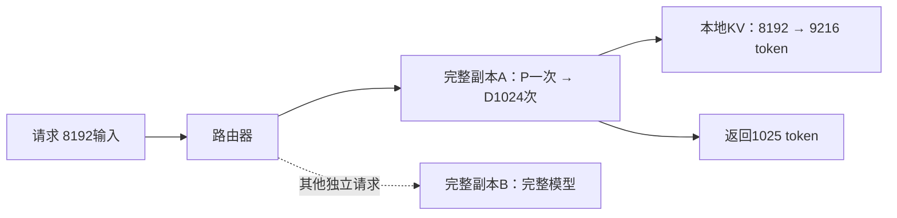
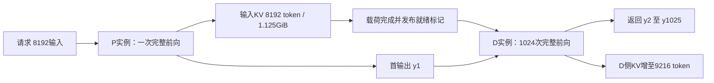
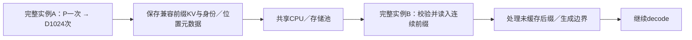
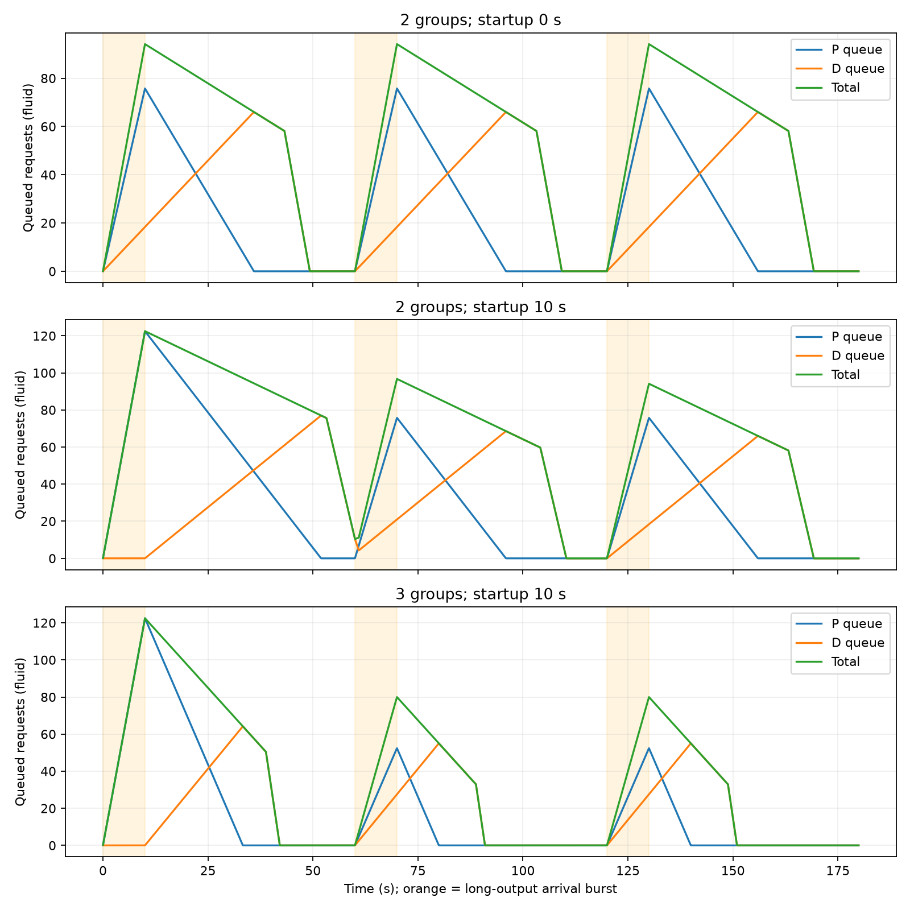

# 当前第9章逐题答案

已完成9-3、9-4与9-6；其余当前题目待逐题核验。当前题目与历史同号目录的要求分别审计，不以解析结果替代历史多GPU实测。

## 9-3 CPU专家执行的读取／计算分界

单专家参数Pₑ=18874368，BF16权重2Pₑ=37748736bytes=36MiB。m行输入矩阵工作F=2mPₑ，算子模型T=max(F/C,W/B)。令计算与读取相等，权重每参数w bytes时，m*=wC/(2B)。以下C固定AVX-512为1.8TFLOP/s、AMX为21.3TFLOP/s；每批每专家权重读一次，DRAM分别220／125GB/s。

|权重bytes/参数|DRAM GB/s|kernel|连续等时点m*|首次计算≥读取的整数行数|
|---:|---:|---|---:|---:|
|2|220|AVX-512|8.181818|9|
|2|220|AMX|96.818182|97|
|2|125|AVX-512|14.4|15|
|2|125|AMX|170.4|171|
|1|220|AVX-512|4.090909|5|
|1|220|AMX|48.409091|49|
|1|125|AVX-512|7.2|8|
|1|125|AMX|85.2|86|

连续等时点与整数边界不同，14.4不可四舍五入成14就声称14行已经计算受限。这是CPU内部瓶颈交点，不是正文CPU与搬权重到GPU的完整路径胜负交点71／72或688／689。

**执行时间。** 下表算子时间只含max(读权重,矩阵计算)。完整CPU路径另外包含BF16激活来回、每方向5μs启动：T通信=10μs+2m×4096×2/(25GB/s)。八专家按题设串行，完整路径总时间是单专家算子与通信之和乘8。GPU搬权重路径未混入CPU内部交点。

|权重bytes|DRAM GB/s|kernel|m|单专家算子ms|瓶颈|八专家含交接总ms|
|---:|---:|---|---:|---:|---|---:|
|2|220|AVX-512|1|0.171585164|read|1.457924189|
|2|220|AVX-512|128|2.684354560|compute|22.225925120|
|2|220|AMX|1|0.171585164|read|1.457924189|
|2|220|AMX|128|0.226846864|compute|2.565863554|
|2|125|AVX-512|1|0.301989888|read|2.501161984|
|2|125|AVX-512|128|2.684354560|compute|22.225925120|
|2|125|AMX|1|0.301989888|read|2.501161984|
|2|125|AMX|128|0.301989888|read|3.167007744|
|1|220|AVX-512|1|0.085792582|read|0.771583535|
|1|220|AVX-512|128|2.684354560|compute|22.225925120|
|1|220|AMX|1|0.085792582|read|0.771583535|
|1|220|AMX|128|0.226846864|compute|2.565863554|
|1|125|AVX-512|1|0.150994944|read|1.293202432|
|1|125|AVX-512|128|2.684354560|compute|22.225925120|
|1|125|AMX|1|0.150994944|read|1.293202432|
|1|125|AMX|128|0.226846864|compute|2.565863554|

BF16、m1时两kernel均读取受限，跨插槽把读取0.171585→0.301990ms放大76%，并不会因为AMX峰值更高就缩短这一项。m128时AVX-512计算2.684355ms远大于两种读取，所以跨插槽不改变模型执行时间；AMX计算0.226847ms在本地略长于读取，跨插槽读取0.301990ms则超过计算，瓶颈翻转。

权重改成每参数一字节而算力保持不变，读取时间减半、计算工作不变，故交点m*严格减半，计算受限更早出现。特别是跨插槽AMX在m128从读取受限转为计算受限。这里没有假定整数算力自动翻倍、没有改变BF16激活大小，也未计未知的scale、解码和格式转换；实际一字节kernel若改变吞吐与附属字节，应重新代入，不能直接当作量化部署收益。

[run_9_3.py](run_9_3.py)用有理数检查所有交点前后整数边界，保存16种执行条件与读／算／通信分项；见[9-3-results.json](9-3-results.json)。输入来自正文固定例题，不需要在Mac模拟不存在的AVX-512／AMX硬件来宣称实测。

## 9-6 专家补齐、副本容量与收益回收

八专家的输入行数[32,16,8,4,2,1,1,0]共64有效行、7个非空专家。每专家Pₑ=18874368参数，每行2Pₑ FLOPs：

|执行策略|执行行数|矩阵FLOPs|相对有效工作|
|---|---:|---:|---:|
|仅有效行|64|2415919104|1倍|
|每个非空专家补齐32行|224|8455716864|3.5倍|
|所有8专家均补齐32行|256|9663676416|4倍|

后两者额外执行160／192个无真实token的行。此表比较矩阵工作，不假定实际kernel时间严格增长3.5或4倍：读取、并发、tile与空专家是否跳过仍影响时间。补齐零行不能计入模型有效FLOPs，且该64行分布与后面例9.6的128token×8专家复制算例是不同输入。

**复制回本。** 沿例9.6，七份36MiB副本依次从卡0送到卡1—7，单向总载荷252MiB，每份另付5μs启动，Tcopy=7×5μs+252MiB/B。使用正文脚注固定的未舍入关键卡每批节省Δt=402784256/1675ns=0.240468212537ms。要求累计收益严格超过复制耗时，Nmin=floor(Tcopy/Δt)+1；等号还不算净获益。

|复制路径|单向GB/s|复制ms|最少批数|持续16批净省ms|持续64批净省ms|
|---|---:|---:|---:|---:|---:|
|同HGX NVLink|450|0.62220256|3|3.225288841|14.767763042|
|跨机ConnectX-7|50|5.31982304|23|−1.472331639|10.070142562|

跨机热点只持续16批时，尚未收回投入，不能把每批都更快当成整体获益。上述批数按固定负载、相同关键路径和无新增争用成立；不是测得的动态EPLB效果。

**先做逐卡容量排除。** 原每接收卡64MiB额外空间能容纳36MiB一份，剩28MiB；改为32MiB则每卡缺4MiB，七个目标卡均不可行。即使其他卡总空闲很多或热点持续无限久，也不能在这些卡上分配这份副本。要先释放／改变放置，或另行验证切分／压缩方案；不能把32MiB预算临时扩大再宣布回本。副本应与原逻辑专家一致，减少top-k、丢弃token或用不同权重不是透明复制。

**热点随时间变化。** 在观察窗口记录逐专家有效行数、补齐后行数、服务时间、路由／通信负载、逐卡峰值及队列，预测候选副本部署后第j批的关键路径差Δtⱼ=T原,j−T副本,j。对预期驻留H批，净收益为Σ(j=1…H)E[Δtⱼ]−T复制−T路由切换−T排空及其他迁移开销。先满足每目标卡容量和链路余量，再选净收益为正的候选；若当前瓶颈移到其他卡，不能继续使用原0.240468ms固定节省。

热点消退概率可写成每批仍受益概率pⱼ，将收益写为ΣpⱼΔtⱼ；也应计入热点消失后额外占用缓存、通信拥塞或退化的负收益。迁移占用与执行重叠时按实际暴露关键路径计成本，不将同一复制既算准备又算运行开销。用不同窗口的回放验证预测并留出收益余量，避免每次短期波动都重新复制。路由切换后旧映射要保留到在途dispatch／combine完成，才能回收旧副本。

[run_9_6.py](run_9_6.py)与[9-6-results.json](9-6-results.json)保存精确矩阵工作和回本上下边界。当前题目解析要求完成，历史9-6的实际多GPU放置／复制比较仍按资源要求暂缓，未被本答案关闭。

## 9-4 交接次数、完整AF流量与双阶段流水

有效带宽B=25×10⁹bytes/s。一份1.125GiB状态为1207959552bytes。一次交接T₁=α+V/B；保持总字节不变分为72次，每次16MiB，T₇₂=72α+V/B，多出71α。这里各次串行，未另加网络重传与排队。

|每次启动μs|一次交接ms|同字节72次交接ms|额外ms|
|---:|---:|---:|---:|
|1|48.31938208|48.39038208|0.071|
|5|48.32338208|48.67838208|0.355|
|20|48.33838208|49.75838208|1.420|

上表只隔离启动次数影响，不能将每次16MiB当作实际单token AF载荷。实际AF每层去回各一份4096维BF16激活，即每次8192bytes；36层共72次，每步589824bytes=576KiB。8192输入一次不分块prefill，每次传64MiB，合计4831838208bytes=4.5GiB。prefill生成首个输出，1025输出还需1024步decode；完整AF总字节5435817984bytes=5.0625GiB，总交接72×1025=73800次。

|每次启动μs|AF prefill ms|一步AF decode ms|1024步decode ms|完整请求累计交接ms|
|---:|---:|---:|---:|---:|
|1|193.34552832|0.09559296|97.88719104|291.23271936|
|5|193.63352832|0.38359296|392.79919104|586.43271936|
|20|194.71352832|1.46359296|1498.71919104|1693.43271936|

完整交接时间为总字节/B+73800α；不能把prefill的72次错误地乘8192，也不能只报告392.799ms的decode部分就称完整请求。两方向按先发后返回串行计入，并非全双工并行后再除2。表是通信累计时间，不包括模型计算／队列，若通信可重叠也不是一定暴露在请求关键路径上的延迟。prefill分块会改变交接启动数，本题按整段输入处理。

**四个独立micro-batch。** 每批attention2ms、FFN3ms。全部串行4×(2+3)=20ms；两侧独立资源、同批先attention后FFN、不同批可重叠时，流水(2+3)+3×max(2,3)=14ms。

|micro-batch|attention区间ms|FFN区间ms|
|---:|---|---|
|0|0—2|2—5|
|1|2—4|5—8|
|2|4—6|8—11|
|3|6—8|11—14|

FFN3ms是稳态节拍，后面几批在两阶段之间等待。设额外通信与计算效率下降合计增加关键路径δms，仍快于原20ms串行要求14+δ<20，即**δ<6ms**。6ms是可逼近的上限，等于6时仅持平，不存在“最大且仍严格更快”的连续实数值。不是每批都可额外加6ms，也不是把所有链路忙碌时间简单相加；额外成本若可隐藏，不全部落在δ中，若破坏原重叠或增加反压，需重排完整时间线。比较的串行基准保持20ms不变。

[run_9_4.py](run_9_4.py)用分数检查71α差值、完整流量及两阶段依赖日程；[9-4-results.json](9-4-results.json)保存数值与来源。本题解析完成，没有将理想流水称为双GPU实测。

## 9-9 缓存路由交点、逆CDF尾延迟与CPU回退

按例9.7的十进制链路带宽，V=1207959552bytes=1.125GiB，主机到GPU耗时H=48.31838208ms。网络与主机传输串行，查找10ms；准备可与B的20ms排队重叠。因此T远端(B)=max(20ms,10ms+V/B+H)+30.9ms。不能在准备耗时上再次加20ms。

A命中耗时280.9ms；B本地重算按该算例舍入值为907ms。两交点分别为V/(250ms−10ms−H)=**6.301906073GB/s**，以及V/(907ms−30.9ms−10ms−H)=**1.477117516GB/s**。带宽严格高于各交点时远端路径才更快，等于时持平；6.25GB/s略低于前者。查找与主机传输固定开销使无限网络带宽仍需89.21838208ms，不能将整个准备阶段压缩为零。

概率部分遵循题目另给的110.9ms／967.2ms两原子，不把前面的舍入887ms替换进此分布。均值为967.2−856.3p；逆CDF分位数定义Q(.99)=inf{t:F(t)≥.99}。

|HBM可用概率p|均值ms|逆CDF p99 ms|
|---:|---:|---:|
|0.5|539.05|967.2|
|0.9|196.53|967.2|
|0.99|119.463|110.9|

p恰为0.99时，快路径处CDF已达到0.99，故p99为110.9ms；这不是有限样本插值分位数。p0.9均值低于220ms，但p99仍不满足220ms。不能从均值推断尾延迟。

**CPU副本仍有效。** 如果HBM未命中能立即从CPU独立取回，48.31838208ms传输完全藏在80ms排队中，回退耗时max(80,48.31838208)+30.9=110.9ms；即使另需10ms查找也仍可隐藏。于是所有HBM命中与CPU回退请求都落在110.9ms，三个p的均值和p99均为110.9ms。原来“HBM未命中即全层次丢失并重算”的两点分布已不适用。

这依赖CPU副本保证有效、传输及时开始、带宽独立可用且与排队重叠。若发现失效较晚、CPU也可能未命中，或链路争用让准备超过80ms，需增加相应状态及概率，以max(队列就绪,状态就绪)+后续计算重建分布；不能保留原967.2ms原子概率1−p，也不能无证据承诺固定110.9ms。

[run_9_9.py](run_9_9.py)以精确分数检查交点等式及CPU重叠，[9-9-results.json](9-9-results.json)保存结果和正文哈希。这完成当前题目的解析要求；历史9-9完整跨机器远端KV路由实验仍未完成，没有以计算结果替代其实测证据。

## 9-8 KV缺页、截断与版本不兼容的恢复判断

**读取量与有效复用量。** 封存Qwen3-8B BF16运行的KV每token为147456bytes，16token一页2359296bytes。64次成功get读取1024token对应的150994944bytes=144MiB；引擎实际复用1008token，即63页、148635648bytes=141.75MiB。有效token复用比例98.4375%，多读的一页占2.25MiB。前者衡量后端读取工作，后者衡量本次实际使用的前缀，不能把64次get全部记为缓存命中并据此省掉1024token的计算。有效复用受连续前缀、页粒度和生成边界约束；本记录显示1008这一实际边界，不能将其泛化成所有引擎均固定少一页。文件读取字节也不等于物理SSD读取，操作系统页缓存未被控制。

**决策以最早可验证就绪为准。** 设最早GPU可用时刻为Q，状态准备就绪为S，重算有效连续前缀之后的时间为Cpartial，全量为Cfull。比较等待路径max(Q,S)+后续计算、部分路径Q+Cpartial+后续计算与全量路径Q+Cfull。共同后续工作须采用一致边界，已计入C的工作不重复相加。等待必须受请求剩余期限约束，只有明确有生产者／读取在推进、状态可验证且预计早于回退时才有收益；无界等待不构成恢复策略。以下是应采用的判断条件，并非声称当前SGLang均已实现。

|故障|继续等待|部分重算|放弃缓存|
|---|---|---|---|
|缺页|写入仍在进行，能确认最终完整发布；预计等待小于重算且满足期限|保留首个缺页之前已验证的连续前缀，从缺页处重算后缀|第一页缺失、没有有效连续前缀、生产者失败或等待超限时全量重算|
|截断页|仅在另一个有效副本或确定会原子发布的完整版本可及时到达时等待|隔离损坏页，丢弃该页及依赖它的后缀，仅复用此前可信连续前缀|无法建立可信边界、异常未安全传回调度器或全部状态不可信时，取消本次恢复并用干净状态重算|
|版本不兼容|已知兼容版本正在生成／传入且能及时获得；等待本身不会改变不兼容内容|只有兼容性合同明确允许保留的部分才能复用；普通权重／位置编码变化通常使整个前缀失效|模型权重、adapter、token序列与位置、dtype、布局、分片或压缩版本不匹配，且无已验证转换时拒绝整个对象|

缺页后的孤立后续页不自动成为可拼接前缀：它们有前文依赖，重算后的状态也可能数值不同。截断read可能已经向目标写入部分字节，发生异常后必须清理／隔离目标，不能把“抛出异常”当作无副作用。若原后端仅按文件存在判断set成功，重算后再次set不保证替换损坏文件；修复须采用明确的失效／替换及完整发布机制。转换不兼容格式的成本和误差也必须计入，不能只改命名空间标签绕过校验。

**三种独立检查。**

1. 请求能否完成：从提交到服务返回记录生命周期、期限、错误传播及进程状态，确认有完整输出和结束原因；HTTP存活、主进程存活或get开始都不等于请求完成。无返回的观察只证明在该窗口未完成，不证明永远死锁。
2. 缓存是否修复：核对缺失／损坏对象的实际长度、身份、完整性和发布版本，再由新进程独立读取验证；检查其他对象未被意外修改。文件存在与set返回True均不足够。重算出的KV可不逐位等于原缓存，须区分字节恢复、结构与身份有效、数值允许误差以及实际可复用，不能仅凭输出相同宣布全部成立。
3. 输出是否一致：使用相同权重、tokenizer、输入token、解码参数、随机性及输出长度，对比不复用缓存的参考token序列，保留每次完整输出。若要求数值等价，另比较同位置逐层KV／logits及预先规定误差；若要求任务质量，需独立任务评分。有限合成输入的token相同不证明任意输入或所有随机生成都相同。

**已验证证据及边界。** 原实验六次完整输出一致，独立消费者首请求存储复用1008token。缺页0／32两条件各三次请求均完成且输出等于参考，首请求分别复用0／512token；两缺页均重新生成，其他64文件哈希不变。页0与原字节相同，页32有995403个BF16元素不同、最大绝对差26.75，因此不能将“文件重新生成且输出相同”写成KV逐位恢复。

截断2字节的真实请求产生OSError，60.082702秒观察内没有返回或请求异常事件，之后监督程序终止本次进程组，损坏文件未修复。后端七条件实验还显示同长翻转一位会被读入、附加尾部未报错，对现存损坏文件set返回True却不替换；更改model_name只验证命名空间不命中。该项不是完整权重／布局版本不兼容的端到端实验，表中的相应策略仍是设计答案。

[run_9_8.py](run_9_8.py)重新执行原证据验证与缺页分析，计算读入／复用差额；[9-8-results.json](9-8-results.json)保存结果、验证脚本退出状态及来源哈希。证据见[缺页实测](../../ch09/09-08/missing-pages/README.md)、[截断实测](../../ch09/09-08/truncated-request/README.md)与[后端边界](../../ch09/09-08/storage-contract/README.md)。当前解释题各项已回答；历史9-8容量、Agent轨迹、保存策略、多级存储和完整版本故障协议仍保持未完成。

## 9-11 紧凑MLA对PD／AF及D池能力的影响

按题目只替换交接状态、保留例9.2阶段能力和例9.4 AF载荷。这是受控敏感性计算，不把Qwen阶段速度直接宣称为真实DeepSeek-V3部署速度。紧凑MLA每token为61×(512+64)×2=70272bytes，8192token共**575668224bytes=549MiB**。512维潜变量与64维位置部分各保存一次，不能因原GQA有K、V两项而再将此状态乘2。

令α=5μs，单次PD耗时V/B+α；一步AF仍是36层、每层去回各4096维BF16向量，共589824bytes=576KiB、72次启动，耗时VAF/B+72α。

|链路GB/s|PD纯载荷ms|PD含一次启动ms|一步AF ms|链路能力B/V 请求/s|临界α* μs|
|---:|---:|---:|---:|---:|---:|
|25|23.02672896|23.03172896|0.38359296|43.427792186|323.987830986|
|50|11.51336448|11.51836448|0.37179648|86.855584372|161.993915493|

阶段能力从表中未再舍入的速率求出：μP=4×9566/8192=4.670898438，μD=4×1166/1024=4.5546875请求/s。因此μPD=min(μP,μD,B/V)，两条链路均不约束吞吐。链路严格成为最小项需要B<min(μP,μD)V=**2.621988864GB/s**；等于时与D池并列。按题目方程链路项为纯载荷吞吐，不将一次启动重复塞入B/V；若服务系统的启动完全串行占用链路，可另用1/(V/B+α)计算其能力，本表不假设这种调度。

临界启动时间由V/B+α=VAF/B+72α得α*=(V−VAF)/(71B)。实际5μs远低于两交点，所以单步AF交接比一次PD快；该比较不能替代整个输出序列的累计代价。

|链路GB/s|输出token|decode步数|累计AF交接ms|相对一次PD倍数（均含启动）|
|---:|---:|---:|---:|---:|
|25|1025|1024|392.79919104|17.0546984|
|25|4097|4096|1571.19676416|68.2187936|
|50|1025|1024|380.71959552|33.0532686|
|50|4097|4096|1522.87838208|132.2130746|

prefill产生第一个输出，故decode调用是输出数减1。表按题目只比较这些decode步的AF累计交接与一次PD，不包括AF prefill交接，不能称完整请求全部通信成本（完整边界见9-4）。50GB/s使PD接近减半，AF却有每步360μs固定启动，故更快链路下AF/PD倍数反而更大。这里是串行通信时间；真实计算重叠会改变暴露延迟，不能直接推断端到端加速倍数。

**查询变换与四张H20。** 题给每条请求每decode步2.05GFLOPs，74TFLOP/s有效算力下额外2.05×10⁹/(74×10¹²)=27.702702703μs。batch32一次调用增加65.6GFLOPs、0.886486486ms；摊到每条请求仍是27.7027μs，不能多除或多乘一次batch32。

假定新增计算完全暴露，1024步新增28.367567568ms，每请求D需求由1024/1166=0.878216123499GPU秒升至0.906583691067GPU秒。四H20容量降至**4.412168495请求/s**，下降3.1290622%；三张只有3.309126371，低于3.5到达率，因此该固定负载下仍需且只需四张D卡。四A100的P能力及25／50GB/s链路均高于新D能力。若计算可藏在原访存中，实际暴露成本可更低，但需要测量，不能无条件扣除。

四D卡恰能处理3.5请求/s时，每条请求每步可额外承受δ=(4/3.5−1024/1166)/1024=258.438495467μs；严格超过此值四卡平均能力不足，恰等于时没有排空积压的余量。当前27.7μs低于该边界。此容量判断沿用例9.2的1025输出；上面的4097输出用于AF累计比较，不能将4.41请求/s无修改地用于长输出工作负载。

[run_9_11.py](run_9_11.py)以有理数验证交点、阶段能力与四卡边界，[9-11-results.json](9-11-results.json)保留数据及正文哈希。真实MLA还改变权重、算子、读取量及batch瓶颈，需重推实际阶段性能；本题没有将固定速率敏感性计算包装为A100／H20实测。

## 9-1 完整副本、PD、共享KV与工具继续执行

以下计数采用正文普通自回归生成约定：无前缀命中、一次不分块prefill、无推测解码。每请求一次外部生成调用，内部1次P处理8192输入并产生首个输出，随后1024次D各处理前一个输出并产生下一个，共1025次模型前向。实际批处理可将多个请求合在一次模型调用，分块则增加prefill调用数；这不改变本题单请求逻辑计数。存储GET／PUT和服务RPC另计，不能混成模型前向调用。

**完整副本：一个请求选一个完整实例。**



P与D均在A产生KV，本请求无需跨实例KV交接；B增加处理其他请求的能力，不将本请求的前向次数减半。若副本内部多卡协作，内部通信另计，本图的一实例不必等于一张GPU。

**PD：按阶段交给两个完整模型实例。**



P生成8192输入位置的KV，D接收一次逻辑快照后扩展1024位置。D也需要首输出token及请求位置／生成状态，不能仅凭KV自动知道P已经采样的y1。两池各有完整模型权重，P并非只算attention、D也并非只算FFN。一次逻辑交接可由多个块与RPC实现。整份双缓冲时源、目的各1.125GiB，目的确认可用、执行权转移后才能释放源缓冲。

**共享KV：扩大状态可复用范围，可与完整副本或PD组合。**



本图选择两个完整副本共享池：冷请求在A仍是1P+1024D，KV由计算实例生成，存储池不执行模型。保存与后续B读取是A→池、池→B两个逻辑载荷阶段，发生在被选择的保存／复用边界，**不是每个生成token必须跨实例传一次KV**。仅配置共享池却无复用，本请求没有必须发生的跨实例交接；实际GET数量取决于页数。若把共享池用作同一请求P→池→D中转，初始快照两跳各1.125GiB，合计2.25GiB载荷，计算仍为1P+1024D。

B命中h个有效连续输入token时，P只处理剩余输入与必要的生成边界，D仍是1024次；应说明h与实际调用策略。只有KV而无可用的末位置logits／已采样输出时，不能宣称完整8192命中就完全不执行模型。引擎可能保留末token重算或按页退回边界；实际读1024而复用1008的例子见9-8。共享不保证此次一定命中，也不规定始终由B接续。

**输出改为1token。** 三种部署均只需1次P、0次D，P直接产生唯一输出。完整副本不再进入decode；PD不需要为这次生成向D交接KV，也不需要D侧接收缓冲；共享KV仍可选择保存输入状态供未来请求使用，但这不是完成当前输出的必要步骤。P仍执行8192输入的完整前向，标准缓存实现生成这些输入KV，只是完成单次生成后可以释放；不能把“不再需要decode”理解为不用处理输入。若为工具下一轮继续而保留／换出状态，相应保存成本依然存在。

**工具调用后的末token边界（位置从0计）。**

```text
输入：x0 ... x8191 | 已生成且已送回模型：y1 ... y1024 | 已返回尚未送回：y1025 | 工具结果及新输入
位置：0  ... 8191  |                    8192 ... 9215 |              9216 | 9217 ...
KV：  <--------------------- 9216个位置已覆盖 ---------------------> | 尚无KV
下一轮新增处理：                                                    y1025 + 工具结果及新输入
```

最终KV覆盖输入8192及前1024个输出，共9216token（1296MiB）；最后已返回的y1025在位置9216，尚无对应KV。工具等待期间保存该连续KV，并在会话记录中保留末token、顺序、位置和必要生成元数据。恢复后先把y1025与工具结果／新增输入一并处理，从位置9216开始，不跳过y1025，也不重复把已有KV前缀当新输入。工具API的一次调用不是一次模型decode调用；工具响应的token数量由实际内容决定，本题未给出，故不虚构下一轮调用总数。

输出为1时边界相同：KV只覆盖x0…x8191，已返回y1的位置8192尚无KV，继续时先处理y1。若引擎额外执行了末token或保存logits等状态，应以实际执行记录修改边界，不沿用本题假设。

[run_9_1.py](run_9_1.py)逐位置模拟这两种输出长度，验证前向次数、KV覆盖与未处理末token；[9-1-results.json](9-1-results.json)保存结果和正文哈希。三种部署图及计量边界完成当前解释题，未声称本轮进行了多实例GPU部署实测。

## 9-2 整数配比、有限链路与工作负载变化

从正文锁定的Qwen逐算子账和硬件表重新调用stage_rates，保留未舍入有理数，不将表中9566／580等显示值当作精确输入。设a、h分别为分配到P的A100与H20数量，各取0…4，其余4−a、4−h给D。每格μ=min(a/dPA+h/dPH,(4−a)/dDA+(4−h)/dDH,B/V)。每种条件枚举25格，并另由逐卡GPU秒核验每格的资源约束。

**原始条件25GB/s。** P每请求分别0.856373868／1.805328694GPU秒，D分别1.764391690／0.878319008GPU秒。下表每行h、每列a，单位请求/s；只在显示时舍入。

|h \ a|0|1|2|3|4|
|---:|---:|---:|---:|---:|---:|
|0|0.000000|1.167714|2.335429|3.503143|4.554154|
|1|0.553916|1.721630|2.889344|3.982383|3.415615|
|2|1.107832|2.275546|3.410612|2.843845|2.277077|
|3|1.661747|2.829462|2.272074|1.705306|1.138538|
|4|2.215663|1.700303|1.133535|0.566768|0.000000|

最优(a,h)=(4,0)，上限4.554153973请求/s，D为瓶颈。完整共置为Σ4/(dP+dD)=3.016780192请求/s；不能先将异构卡GPU秒平均后求倒数。JSON保存所有25格的两池能力、限制项、精确分数和所有并列最优组合。

**每秒一快照的链路。** 有效B=1207959552bytes/s=1.207959552GB/s，故B/V恰为1请求/s，不能把1.21GB/s舍入值拿来声称精确1。25格中21格达到1，原最优(4,0)也在其中；仅(0,0)、(0,1)、(3,4)、(4,4)未达到，分别因无P、P不足、D不足、无D。增加计算卡或换这些并列最优配比都无法突破共享链路限制。

到达率λ=μ=1且一次增加10请求，采用无启动成本、服务已稳态的连续流量模型，Q(t)=max(0,10+(λ−μ)t)=10，t≥0；链路待处理载荷保持10V=12079595520bytes。原先十个请求在FIFO下可以陆续完成，但新到达者补上队尾，**总积压从不清空**，排空时间无限。均值相等不提供稳定余量；离散／随机到达可引起波动，该常数曲线不构成尾延迟保证。

**重新推算两种请求组成。** 下表回到原25GB/s链路；P命中仅减少计算，D仍冷缓存，因此两种情形都交接完整8192token、1.125GiB。

|情景|A100 P GPU秒|H20 P GPU秒|A100 D GPU秒|H20 D GPU秒|最优P数量(A,H)|PD上限 请求/s|共置上限 请求/s|
|---|---:|---:|---:|---:|---|---:|---:|
|命中6144输入，输出1025|0.237886962|0.501491433|1.764391690|0.878319008|(2,0)|5.687689123|4.896672869|
|无命中，输出129|0.856373868|1.805328694|0.212254977|0.105661108|(4,3)|6.332604401|5.836270504|

命中时新token虽为四分之一，仍需注意已缓存的长前缀，所以P耗时不是原值简单除4。两A100的P能力约8.407请求/s，两A100加四H20的D能力5.687689；若仅一A100做P，则约4.204请求/s反而不足。

129输出需要128次decode，平均history由8704改成8256；重新计KV读取后D调用速率为A100603.048285、H201211.420194调用/s，不能只将原1024步的GPU秒除8。单H20可提供9.464220269请求/s，高于七张P卡合计6.332604401，故瓶颈转向P。与共置比约提高8.5043%。若这两个情景也保留1.207959552GB/s慢链路，因为每请求交接字节未减，最优上限仍只有1请求/s，无法兑现25GB/s下的计算收益。

**效率50%改为40%。** 算力、显存带宽效率同时降低为原0.8，计算和读取时间均增为1.25，原P计算受限、D读取受限的判定不变。用硬件原值A100312TFLOP/s、2039GB/s，H20148TFLOP/s、4096GB/s：有效能力变为124.8TFLOP/s／815.6GB/s与59.2TFLOP/s／1638.4GB/s。注意正文显示的1020GB/s为2039×0.5的近似，本计算保留原值。

|卡|P新token/s|D调用/s|每请求P GPU秒|每请求D GPU秒|
|---|---:|---:|---:|---:|
|A100|7652.732349|464.295998|1.070467335|2.205489613|
|H20|3630.142268|932.690734|2.256660867|1.097898760|

25GB/s下最优仍四A100做P、四H20做D，P能力约3.736686，D能力**3.643323179请求/s**，高于3.5，但仅剩0.143323179请求/s理论余量。按该流量模型若额外积压10请求，约需69.772秒消化，未含启动和随机排队；不把“均值够用”写成SLO保证。若仍用每秒一快照的慢链路，λ3.5当然超过链路1，与GPU效率无关。

[run_9_2.py](run_9_2.py)与[9-2-results.json](9-2-results.json)保存5种完整枚举、逐算子阶段账、来源哈希和队列采样。本题复算完成，未替代历史异构多GPU实测。

## 9-10 长短输出混合、八卡组数与突发队列

使用例9.2锁定的逐算子模型、batch32、50%算力与带宽效率，输入8192，无前缀命中。每种输出长度重新计算平均history和D调用次数，不能把长输出D时间简单乘4：更长上下文还增加每步KV读取。

|输出token|D调用数|平均history|A100每步ms|H20每步ms|A100每请求D GPU秒|H20每请求D GPU秒|
|---:|---:|---:|---:|---:|---:|---:|
|1025|1024|8704|55.137240326|27.447469|1.764391690|0.878319008|
|4097|4096|10240|62.246369616|30.986413|7.967535311|3.966260864|

两类各半，每请求平均D需求A100为**4.865963501GPU秒**、H20为**2.422289936GPU秒**。对工作量先求算术平均，再由卡数除需求求能力；不能把两类请求/s直接平均。两长度的batch32模型驻留均通过原模块标称容量检查，实际workspace余量和调度仍须部署验证。

令a、h为一组四A100／四H20中分给P的数量。P需求仍为0.856373868／1.805328694GPU秒，μP=a/dPA+h/dPH，μD=(4−a)/平均dDA+(4−h)/平均dDH，μ=min(μP,μD,25GB/s÷1.125GiB)。下表25格全部枚举，行h、列a，单位混合请求/s。

|h / a|0|1|2|3|4|
|---:|---:|---:|---:|---:|---:|
|0|0.000000|1.167714|2.062348|1.856839|1.651330|
|1|0.553916|1.721630|1.649516|1.444007|1.238497|
|2|1.107832|1.442192|1.236683|1.031174|0.825665|
|3|1.234869|1.029360|0.823851|0.618342|0.412832|
|4|0.822037|0.616527|0.411018|0.205509|0.000000|

最优(a,h)=(2,0)：两A100做P，其余两A100及四H20做D。每组μP=2.335428573、μD=**2.062348274**、链路20.696057214请求/s。原先四A100做P的配置不再最优。JSON保存每一格的P、D、链路能力和精确吞吐分数。

**最少组数。** 复制同一八卡组合，假定每组具有同等独立有效链路与可并行启动能力，n组容量nμ。稳定余量要求nμ>3.5：一组不足，两组4.124696548请求/s，因此至少**两组16卡（8A100+8H20）**。

启动10秒时积压35请求，要求从开始启动算起60秒前排空，留给服务的50秒内必须同时完成全部210个到达请求。故nμ≥210/50=4.2；两组不足，三组6.187044822请求/s足够，至少**三组24卡（12A100+12H20）**。按例9.8单一服务率连续模型，清空时刻10+35/(nμ−3.5)，两组66.0272025秒，三组23.0254619秒；即使把“前”解释为严格早于60，整数答案仍为三组。各组使用相同最优组合已最大化单组能力，其他整数配比不能让两组跨过4.2。

上述为长期混合服务能力的容量推导，不含P→D流水填充、单次生成时延和SLO。即使所有组共用一条25GB/s链路，它的20.696请求/s仍高于这些方案的能力，当前组数结论不变；不能对任意规模都假定共享链路随卡数增长。

**集中长输出的到达约定。** 每分钟总210请求，其中105长、105短。题目未指定短请求在分钟内的分布，这里固定短请求1.75/s均匀到达；将全部105长请求放在每分钟前10秒，即长请求10.5/s。前10秒总到达12.25/s，后50秒1.75/s，分钟平均仍3.5/s。若要求总到达率每一瞬间始终3.5/s，则10秒最多容纳35请求，无法放入105长请求；不能同时强加这两个条件。

FIFO流量模拟显式区分P队列与D队列。P按请求数提供服务，完成的类别依序送入D；D按平均请求工作单位计预算。长／短每请求D权重分别为1.637401372／0.362598628，均值为1。两类卡在这两种长度均受读取限制，权重比相同，故此归一化与固定长期混合路由一致。D不使用“积压个数×平均耗时”替代前10秒实际高比例长请求，图中D队列与总队列仍按请求数显示。



|方案|最大总积压 请求|首个突发后首次清空时刻 秒|180秒末积压|
|---|---:|---:|---:|
|两组，立即服务|94.1486|49.27|0|
|两组，启动10秒|122.5|110.34|0|
|三组，启动10秒|122.5|42.11|0|

两组无启动时可在下一分钟到达前清空，但不能避免前10秒排队；启动与首个长请求突发重叠时，两组在60秒前仍未清空，下一轮又加入长请求，首次清空推迟到110.34秒。三组在同样首轮启动条件下约42.11秒清空。启动前10秒积压122.5请求，不是均匀混合模型的35请求，因此这里不能使用上面的23.03秒预计恢复。

决定瞬时容量和恢复期限的是**前10秒长请求工作注入，以及随后D池处理这些长请求的排空区间**。增加P只可能更快把积压推到D，未必让总积压消失。仅从平均到达与平均能力足够，不能推出突发期间没有排队或满足尾延迟。

模拟以0.01秒步长运行180秒，并用0.005秒复核：峰值差小于0.007请求，首次清空时刻差不超过0.005秒；每步检查到达−完成=P积压+D积压。曲线是可分割请求的FIFO流量近似，P可以连续输出流量、D在同一步消费；不包含真实请求prefill最低时延、批调度、KV传输延迟、token级抢占或不同队列优先级，不能作为真实GPU服务时间承诺。阶梯更精细并不会消除这些模型假设。

[run_9_10.py](run_9_10.py)、[9-10-results.json](9-10-results.json)保存阶段来源、25种分配、三条完整队列轨迹与步长复核。当前计算／设计题完成，历史9-10的PD／AF动态并行与故障实测仍按多GPU资源要求保留。

## 9-5 V4-Flash权重放置、NUMA负载与容量之外的约束

使用保存的DeepSeek V4-Flash配置、checkpoint index及全部46份tensor header，逐tensor核对名称、所属分片与data_offsets字节区间。配置为43层、每层256路由专家、top6、hidden4096、专家中间维2048、1共享专家；前三层采用hash routing。下述方案保留checkpoint原存储格式，不用“总参数×0.5”代替实际含scale与不同dtype的张量账。

**一种明确的CPU专家执行放置。** 每层专家0—127在NUMA0主存，128—255在NUMA1主存，均保存原打包权重与scale。GPU常驻attention、共享专家、embedding、norm等其余权重；checkpoint含MTP权重一并保留，但此方案关闭MTP执行。CPU按专家逐个展开BF16计算，复用一个展开缓冲，不在CPU保留所有专家的完整BF16副本。

|项目|精确bytes|放置／说明|
|---|---:|---|
|完整checkpoint|159609485896|全部tensor均已归属|
|路由专家原格式，每份|13369344|12.75MiB，含scale|
|NUMA0路由专家|73584869376|43×128份|
|NUMA1路由专家|73584869376|43×128份|
|GPU共享专家|1107363840|43层共享专家|
|GPU其他权重|11332383304|attention、embedding、norm及MTP等|
|单专家BF16展开缓冲|50331648|每NUMA一份，48MiB|
|输入／输出双缓冲|8388608|2槽×2方向×256行×4096×2bytes|

每专家三矩阵共3×4096×2048=25165824参数，展开为BF16才是48MiB。每NUMA预算原权重+48MiB展开+8MiB激活双缓冲+1GiB临时工作区=74717331456bytes，小于声明的96GiB／NUMA容量。GPU预算常驻权重+8MiB激活双缓冲+8GiB attention状态池+4GiB工作区=25333037640bytes，小于96GiB。两主存节点总预算149434662912bytes，没有漏掉CPU临时副本，也不因GPU有空余而擅自计为可供任意NUMA本地使用的容量。

状态池按与6-3相同的原格式主KV584bytes／entry、压缩比4的索引68bytes／entry及128token窗口估算，脚本检查128个9216token会话可放入8GiB。激活batch256行可来自prefill分块，不代表允许256个完整长会话驻留。容量之外的排队请求只保留输入元数据，须受 admission 管理；不能让无限积压同时占用GPU KV。1GiB／4GiB工作区是明确规划额度，非实测峰值；实现若需要额外展开、临时张量或不同状态格式必须重算。该方案依赖支持原格式解码和CPU矩阵计算的实现，本题未声称已有原生FP4 CPU kernel跑通。

**并发不能唯一确定实际专家数。** 一个decode执行步中b个有效token产生6b次分派，但最多访问min(6b,256)个不同专家。如果每token在256中等概率不放回选6且不同token独立，期望访问数为256[1−(250/256)^b]，每专家期望行数6b/256，每NUMA期望总行数3b。下表同时给出两种可复算的路由输入：分散路线token t选(6t+j) mod256，j0…5；热点路线全部选0…5。每token均为6个不同专家，未改top-k。

|并发token数b|均匀独立期望专家数|每专家期望行数|分散路线不同专家|分散NUMA行数(0,1)|热点不同专家|热点NUMA行数(0,1)|
|---:|---:|---:|---:|---|---:|---|
|1|6|0.0234375|6|(6,0)|6|(6,0)|
|8|44.241763|0.1875|48|(48,0)|6|(48,0)|
|32|136.149085|0.75|192|(128,64)|6|(192,0)|
|64|199.889681|1.5|256|(256,128)|6|(384,0)|
|256|255.409186|6|256|(768,768)|6|(1536,0)|

JSON保存每种条件全部256个专家的行数（含零）、每NUMA任务数及每批各专家权重只读一次时的字节数。分散路线b256时两节点并列最忙，其余所列条件节点0最忙；热点始终只访问6专家但NUMA0行数随并发增长，不能用专家数量少推断CPU工作少。任意层的真实预测须从token／路由日志统计m(l,e)，再按实际放置汇总；配置只能给专家数量上限和矩阵形状，不包含任务分布。特别是前三个hash层要用实际token映射，不能将此人工route表当作它们的模型预测；这里的热点反例选第3层（零起始，非前三hash层）。

**构造容量够、CPU仍过载的条件。** 输入8192、输出1025，无命中，每请求处理8192+1024=9216个token。假定第3层这些token都路由到NUMA0的专家0…5，且该NUMA CPU矩阵执行有效上限取例9.3的1.8TFLOP/s。这是明确的条件化负载，不声称找到了真实模型必然产生该路由的prompt。

只计算这一层的六个专家，就需要9216×6×2×25165824=**2783138807808FLOPs／请求**。因此CPU0每秒最多服务1.8×10¹²／2783138807808=**0.646751788请求**。到达率设为1请求/s，从空队列开始，积压增长至少1−0.646751788=**0.353248212请求/s**，60秒至少21.1948927个请求的流量工作。若只保留该单层计算而假定其他工作全免费，这是等号模型；完整43层、解量化、主存、传输和排队只可能增加耗时，所以全模型结果应写成增长下界，不把0.64675当作已测服务率。

两节点合计空闲或NUMA1算力不能自动消除节点0瓶颈：需要迁移专家、副本或远端执行，并重新计容量、UPI／PCIe、转换和同步成本。此例总权重可容纳但CPU能力已不足，满足题目的反例要求；不会将容量规划误写成吞吐保证。实际rtx-pro上的NUMA数与CPU吞吐须实测，本方案的双NUMA容量与1.8TFLOP/s是给定建模条件。

[run_9_5.py](run_9_5.py)与[9-5-results.json](9-5-results.json)保存逐tensor容量守恒、路由分派与CPU增长下界，以及配置／index／header／正文哈希。当前题目分析完成，没有把此方案列为已完成的CPU大模型执行实验。

## 9-7 KV保存、驻留、分层容量与写入寿命

复用对象V=1207959552bytes=1.125GiB，A100按峰值50%重算8192输入耗时Tc=0.856373867651s。以下比较同一前缀100次使用，省略三条路径共同的后续模型工作与本地attention读取；驻留不代表后续模型执行免费。

|方式|前缀准备累计耗时，25GB/s网络载荷口径|跨网络字节|条件|
|---|---:|---:|---|
|重算一次后驻留|0.856373868s|0|HBM保留到最后一次使用|
|取回一次后驻留|0.048318382s|1207959552|兼容前缀已存在，HBM可保留|
|每次使用均远程读取|4.831838208s|120795955200|100次重复读取不变前缀|

表中取回采用正文该比较段的纯网络口径；若完整路径为网络→主机→GPU，且两段25GB/s整份串行，一次为0.096636764s，100次为9.663676416s。不能把纯网络时间和端到端取回混列比较。100次读取要在1秒内完成，仅网络载荷就要求120.7959552GB/s，超过25GB/s约4.83倍，计算重叠无法消除这一总字节约束。

**写入与保留时间。** 若已有状态未来分k次独立恢复，每次恢复后又失去本地驻留，则保存策略成本Tw+kTr，对照kTc；严格收益条件Tw+kTr<kTc。若Tc>Tr，最小整数复用次数floor(Tw/(Tc−Tr))+1；若Tc≤Tr且写入成本非负，无复用次数能使这个未重叠模型获益。网络写、读各48.318382ms时，一次未来复用就回本；完整串行双跳写、读各96.636764ms时也一次回本。SSD按4.2GB/s写、7.1GB/s读，单次约287.609417／170.135148ms，合计约457.744565ms，仍小于Tc。这些路径均不计未知查找、排队、文件系统及争用，不冒充实测。

若100次连续使用期间只取回一次，应使用Tw+Tr而非Tw+100Tr，并与相同驻留约定的Tc比较；上表中的“重算一次驻留”不能偷偷换成“重算100次”以夸大保存收益。是否付Tw还取决于比较起点：远端副本已存在时本次不重复收取其历史写入，端到端保存决策则必须计入。

保留V字节τ秒占用Vτ字节·秒。此量不能直接与耗时相加；设单位容量时间的机会成本折成等价延迟系数c，保存条件变为Tw+kTr+cVτ<kTc，同时每时刻容量需求≤可用容量。若c>0，则τ<[k(Tc−Tr)−Tw]/(cV)，右侧须为正；若用费用比较，应将所有计算、读写及容量时间换成同一费用单位。无c和复用预测时不能凭空给“最长值得保留秒数”。实际驱逐别的高复用对象、传输等待及失效风险也应进入收益，不能只算当前对象的理想命中收益。

**改变HBM容量的例子。** 一份1.125GiB对象在专用2GiB空闲预算中可驻留；其他已批准工作到来，将该预算压到1GiB时，即使总模型权重仍放得下，这份完整对象也放不下，至少缺128MiB。采取整对象换出策略，将1.125GiB移到CPU、完成后释放HBM；未来恢复前重新争取足够空间并读回。也可分层逐页保留，但须另计部分重算／分块读取，不宣称整对象仍本地命中。按25GB/s，单向主机换入或换出各48.318382ms。此次容量变化与是否值得保存是两个独立条件。

**4GiB→8GiB共享CPU池的具体机会。** 重新执行原[双引擎实验](../../ch09/09-07/shared-kv/README.md)的814项核验，两容量各72记录输出均与参考一致。12个首次取回候选中，完整块对齐前缀命中由5变12；原来3个部分、4个零命中变成完整。新增的七次机会如下，单位为有效前缀token，而非纯目录lookup或读入字节。

|case_id|4GiB复用|8GiB复用|多保留的可复用token|
|---|---:|---:|---:|
|r0-n8192-a1-main|5632|7936|2304|
|r1-n2048-a1-main|0|1792|1792|
|r1-n8192-a0-main|1792|7936|6144|
|r1-n8192-a1-main|0|7936|7936|
|r2-n2048-a1-main|0|1792|1792|
|r2-n8192-a0-main|2304|7936|5632|
|r2-n8192-a1-main|0|7936|7936|

两条件的消费者再次请求各12次都没有提交retrieve，状态已经驻留本地，说明跨引擎取回与每步远程读取不是一回事。8GiB也有回收，不能用是否回收判断这些对象是否保住；也不能把七次改进称为七次完整重算全免，其中三次原本已部分命中。这是同GPU两独立引擎CPU共享池，非跨主机NIC测试；固定任务与顺序不能直接推广一般Agent命中率。

**五分钟保留容量。** 按正文每卡连续无命中8K prefill，r=V/Tc≈1.410551627GB/s，300秒需rT=**423165487982bytes≈423.165488GB=394.103572GiB**。这是保留整个五分钟新KV流的容量，单独只保留指定一份对象仍只需1.125GiB；不能混淆工作集与单对象。

每卡HBM扣BF16权重后上限63618529280bytes≈63.619GB，未扣工作区；主机按正文2TiB／8=256GiB=274.877907GB。主机独立不足，两者即使排他分层、不重复保存，相加也仍缺84669051758bytes≈84.669GB，故需要SSD层；3.84TB单盘容量足够，不要求远端池。若每层保存完整副本，不能把各层容量相加掩盖重复。实际HBM还需扣工作区和在途状态，SSD所需容量会更多。

**128／512新token的逐层预加载。** 全历史KV读取量相同，主机25GB/s下总读取48.31838208ms，36层每层32MiB、1.34217728ms。用固定逐算子模型重新计算新增token的矩阵工作，再均分为36层计算时间；层间异构开销不在此近似中。

|新token|总计算ms|一层计算ms|无提前预读的逐层流水总ms|计算开始前最少已读层数|提前缓冲|
|---:|---:|---:|---:|---:|---:|
|128|15.401961525|0.427832265|48.746214345|25|800MiB|
|512|61.955590197|1.720988617|63.297767477|1|32MiB|

设k层在计算前已读好，剩余读取连续执行，第i层（零起始）就绪为0（i<k）或(i−k+1)Tread,layer。递推结束时刻Ci=max(Ci−1,Ri)+Tcompute,layer，枚举k找第一次总耗时恰等于纯计算，并检查k−1仍失败。128token时需提前25层，预读耗时33.554432ms；512token计算比读取慢，之后的层可全部隐藏，但**第一层仍必须先就绪**，故若要求从计算时刻起零读取停顿需预读1层、1.34217728ms。正文连续带宽差公式给512token的额外积压缓冲为0，不表示第一层历史可尚未到达就开始attention；无提前预读时总时间仍多第一层启动。提前读取必须有先前batch／排队时间和HBM预算，不能从完整到达延迟中无条件删除这段时间。

**SSD长期准入比例。** 按D7-P5520的3.84TB、1DWPD，日写入额度3.84×10¹²bytes，平均每秒44444444.444bytes。除以r，最多接纳**3.150855566%**的新KV；若题设50%命中使新KV生成率减半，比例变为**6.301711133%**。这是假定KV写入独占该额度、无额外重写／应用写放大；若还有其他写入须扣除。SSD容量足以存五分钟全量，不意味着耐久额度允许持续写全量；以上两项须同时满足，可能需要只准入预测会复用的对象或扩大存储资源。该额度不是精确故障日期，也不是短时写带宽。

[run_9_7.py](run_9_7.py)、[9-7-results.json](9-7-results.json)保存两种后缀的完整分层账、整层就绪边界、七次复用改进及来源哈希。当前第9章11道练习均有对应答案；历史远端／多GPU等物理实验缺口仍按原协议保留。
