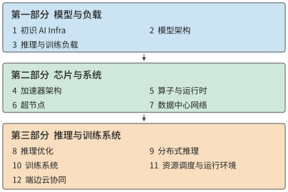

# 前言

我的上一本著作《深入理解 AI Agent》讨论 Agent 的架构设计与工程实践。在与读者交流、解答问题的过程中，我愈发意识到，要开发好基于模型的应用，还需要理解这类应用赖以运行的基础。一方面是模型本身：模型怎样处理输入、生成输出，并根据上下文与环境交互。另一方面是模型的运行系统：参数和上下文状态存在哪里，计算怎样执行，多台设备怎样协作，以及模型调用怎样与工具程序衔接。本书由此而来，讨论支撑模型训练与推理的基础设施——AI Infra。

大多数软件工程师不需要亲自开发操作系统、编译器和芯片，但仍然需要学习操作系统、编译原理和计算机体系结构。这些知识帮助我们理解程序所依赖的抽象，以及抽象背后的实现。申请一块内存、读取一个文件、调用一个函数，看起来只是简单的操作，却各有资源与时间代价。理解这些代价，才能解释程序为什么慢，以及怎样改进。基于模型开发应用，同样需要这样的基础。选择多大的模型、保留多长的上下文、允许多少条请求同时执行、把任务放在本地还是云端，都会改变系统需要完成的工作。

## 编程抽象上移：从操作系统到模型上下文

我在微软亚洲研究院与中科大联合培养读博期间，做的是计算机系统研究，很自然地习惯了从操作系统、编译器和硬件的分工来理解应用。这个领域的两大顶级会议 SOSP（操作系统原理研讨会）和 OSDI（操作系统设计与实现），名字里都包括“OS”，也就是操作系统。传统操作系统需要支撑多种多样的应用，编译器和硬件则为事先未知的程序提供通用能力。怎样设计这些抽象，怎样在编程便利与执行效率之间选择，一直是系统研究的重要问题。

做 Agent 以后，我越来越清楚地感受到，应用表达行为的方式正在变化。开发者既用代码规定流程，也通过选择模型、组织上下文和提供工具来表达任务。同一个模型可以根据不同上下文完成多种工作。我认为，**编程抽象从操作系统到模型上下文的迁移，是计算机系统领域数十年来最重要的变化之一。** 一部分过去需要逐条写进程序的行为，现在可以通过模型与上下文来表达；底层仍然需要执行代码和管理资源，但系统设计可以利用的应用信息发生了变化。

这种变化也让我们有机会重新考虑原有的分工。独立算子通过内存交换结果，便于组合成不同程序，也增加了中间数据的读写；主机统一提交设备任务，便于控制执行，也增加了反复交接的时间。把模型训练和推理作为完整应用，贯穿各层加以分析时，模型结构提供了计算依赖，运行时掌握数据的产生与使用时机，芯片和网络可以据此安排运算与传输。相邻算子可以直接复用中间结果，执行计划可以重复使用，设备交接也可以按真正需要的顺序组织。

怎样利用应用信息改进底层执行，一直是我关心的问题。模型应用让这个问题有了更广阔的空间：上层通过模型承接多样的任务，底层围绕共同的计算过程开展专用化与跨层优化。这是我想写这本书的另一个重要原因。

## 从数量级估算到系统设计

早年做数据中心加速时，无论面对的是模型推理、网络处理，还是存储访问，我都会先做一遍数量级估算：一项任务要完成多少计算，读写多少数据？设备装得下吗，数据来得及送到吗，最少需要多长时间？Jeff Dean 所倡导的 back-of-the-envelope estimation，也就是用纸笔做粗略估算，体现的正是这种习惯。几步计算往往就能帮助我们判断一个方向是否值得继续，以及应该先解决哪个问题。

这也成了我写这本书的一个直接动机。在与 AI Infra 从业者交流时，我发现，不少人熟悉模型和工具，却还没有形成对容量、带宽、算力和延迟的数量级直觉，也缺少一套把这些数字放在一起检查的方法。面对一个设计，能够说出所用的技术，与能够判断它是否可行、性能大致落在哪里，是两种不同的能力。我希望这本书能帮助读者建立后一种能力。

我也经常让当时能力最强的一些模型帮忙估算系统性能。它们能列出公式，算出看似精确的数字，却仍会漏掉决定结果的基本约束：有时只算权重读取，忘了注意力还要读取 KV 缓存；有时估算了读取时间，却没有检查这些缓存是否放得进显存；有时按峰值算力推算速度，却没有检查存储带宽能否持续供给数据；有时把工作量平均分给多张卡，却遗漏卡间通信；还有时算出了很高的总吞吐量，却没有检查串行依赖与通信往返给单次请求带来的延迟下界。只漏掉其中一项，结论就可能偏离几个数量级。

因此，我希望贯穿本书的方法是：**从约束推导设计。** 先明确任务与质量要求，再列出计算、存储、通信和依赖关系，检查容量是否足够、数据供给是否匹配、哪些等待无法消除，然后讨论模型怎样分工、状态放在哪里、执行如何组织。把已知的基本约束逐一纳入，才能排除明显不可能的方案；实际系统中的开销和变化，则要继续用测量来校正。估算不必一开始就精确，但必须知道自己算进了什么，还有什么没有算进去。

## 让算法与系统共同决定执行方式

这些约束也常常提示新的设计。2016 年，围绕微软 Bing 搜索排序所用的深度神经网络，我们探索用 FPGA 加速推理。模型权重反复从片外内存搬进芯片，限制了计算速度。我想到，能否把模型拆到多块 FPGA，让各部分留在各自的片上存储中，只通过高速网络传递中间结果？我兴奋地把想法告诉徐宁仪老师，他说，这叫“模型并行”。[^preface-fpga] 计算放在哪里、数据怎样流动、专用化能省下什么，已经是我当时反复思考的问题。

2019 年加入华为后，我参与了 MindSpore 的自动算子生成项目 AKG，担任动态形状团队的架构师和技术负责人。这项工作延续了此前的软硬件协同思路：把模型计算转换为适合昇腾神经网络处理器执行的程序，由编译器安排数据分块、存储和执行顺序。[^preface-akg] 我还记得，为了融合 softmax 算子，我到处寻找合适的算法。后来读到 NVIDIA 在 2018 年发表的在线 softmax 研究，才找到实现融合的办法。[^preface-softmax] 要让中间结果尽量留在片内，就需要把算法、编译和硬件放在一起考虑。

到了 2020 年，我加入 Unified Bus（UB）项目，开始研究更大规模的设备协作：怎样让成千上万个处理器高效地共同完成一项计算？

最早在华为内部推动这件事时，我们遇到了不少来自其他部门的质疑。当时有人问：“现在模型最多就八卡训练，你搞一个万卡的，什么时候才能有一万张卡啊？”那时候，整个公司都没有一万张卡。[^preface-doubt] 对习惯了单机多卡训练的人来说，为万卡规模设计互联，确实离眼前的需求很远。

我们之所以作出这个判断，是因为看到了另一组证据。2019 年，谭焜博士把 AI 算力需求的发展趋势画成散点图，看到需求的增长远快于单芯片能力的提升，于是推动了面向上万张卡的高性能互联研究。2020 年我加入项目，GPT-3 论文的发表又为这个方向提供了新的论据。[^preface-taste] 如果模型训练需要的计算量继续这样增长，就必须让更多设备协同工作；互联架构的研究和实现需要时间，等需求完全显现以后再开始，很可能已经来不及。

今天回头看，万卡训练的必要性已经不难理解。但我想把当年的质疑写进这本书，因为在当时的条件下，答案远没有今天看起来这样清楚。系统设计需要同时看清眼前的负载和正在变化的条件。八张卡能够完成当时熟悉的任务，是一种实际经验；更多计算会推动更大规模协作，是对未来需求的判断。要说服别人，就需要把这个判断所依赖的趋势、资源和代价讲清楚。后来的需求变化让大规模互联的重要性更加明确，也让我们面对更具体的问题：设备多了以后，怎样分配状态，怎样减少交接，怎样避免大量计算资源一起等待？

UB 希望把数据中心作为一台计算机来设计，让处理器、内存和存储能够更直接地协作，也让程序更方便地使用分布在不同位置的资源。[^preface-ub] 真正设计时，需要逐项决定应用与硬件之间的分工：应用需要传递一条消息，还是访问一块数据？数据传完以后，谁负责通知使用它的程序？哪些操作必须保持先后顺序，哪些可以独立推进？每一种分工都能简化某些工作，也会把责任和开销转移到其他部分。

从模型推理加速到 AKG，再到 UB，工作跨越了不同的尺度，我反复遇到的却是相通的问题：计算需要的数据在哪里，现有接口增加了哪些工作，掌握更多应用信息以后，能否换一种执行方式？

## 当系统性能决定产品体验

2023 年离开华为创业以后，这些问题又以另一种方式出现在我面前。我们做的 Agent 需要与人实时语音交互。用户说完一句话，要等多久才能听到回答？一通电话持续半个小时，服务成本又是多少？这些问题直接决定了产品能不能用、能不能让更多人用得起。

2024 年，我们在 GPT-4o 发布之前就推出了实时语音交互。后来与基于 GPT-4o 的实时语音 API 比较，我们的运行成本约为调用它的百分之一。[^preface-voice] 这背后有大量 Infra 优化：选择适合任务的模型和部署方式，分析推理的计算与内存访问，再逐项减少网络、数据库和客户端的等待。

我还记得，2023 年底第一个语音电话演示的延迟高达 5 秒。我们把整条交互拆开，先估算模型一次推理需要多少计算、读取多少数据，再与 GPU 的能力比较；随后继续检查网络传输、数据库访问和客户端处理。延迟就这样从 5 秒降到 2.5 秒、1 秒，后来做到约 500—600 毫秒，整个系统可以在一张 RTX 4090 上运行。[^preface-voice-detail] 用户感受到的是对话终于能够接得上，而我们要找到的是每一段时间究竟花在了哪里。

这段经历让我更加确信，应用开发与基础设施之间有很直接的联系。同样是一次模型调用，多等几秒，产品体验就可能完全不同；同样是一小时语音服务，成本相差两个数量级，能够服务多少用户、支持哪些使用方式，也会随之改变。前面在芯片、编译器和网络上积累的经验，最终都要用于改善这些具体的体验与成本。

## 我希望这本书讲清楚什么

在优秀的基础模型团队中，我越来越常看到一种跨越分工的工作方式：**最懂 Infra 的人做算法，最懂算法的人做数据，最懂数据的人做 Infra。** 这句话表达的是一种相互理解的深度。算法设计者知道硬件的容量、带宽和通信限制，才能在模型结构中利用这些条件；数据工作者理解模型怎样学习，才能判断哪些样本和训练任务最有价值；Infra 工程师了解数据的组织、长度和使用过程，才能把系统资源真正用在有效的训练与推理上。

这种协作会直接改变模型的设计。模型架构不仅决定能够学到什么，也决定训练要保存多少状态、设备之间交换什么数据，以及生成答案时需要反复读取什么。在满足质量要求的前提下，把这些执行代价一同纳入架构选择，往往能够取得单独优化算法或系统难以获得的收益。模型、数据与 Infra 之间的反馈越直接，团队就越有机会找到这样的设计。

DeepSeek V4 到 V4.1 的演进就是本书贯穿的一个例子。长流程 Agent 需要反复处理输入、保存和恢复上下文，显存与持久存储的容量、缓存迁移的带宽因此直接影响服务成本。V4.1 根据这些需求重新组织模型：让输入处理阶段只执行部分主干计算，让多个层共享全局上下文缓存，并结合低精度存储和恢复策略减少需要保存和搬运的数据量。[^preface-v41] 这些选择同时改变了模型架构与系统执行，让推理效率成为模型架构设计的一部分。第二章会从具体表示和资源需求开始，后续章节再逐步检查执行与部署的代价。

我希望读者也能建立这种跨层理解：看到一种模型结构时，能想到它要求设备做哪些工作；看到一种硬件能力时，能判断怎样改变模型与执行方式，才能真正把它用起来。

贯穿这些分析的一条线索，是数据搬移。计算单元需要取得权重和中间结果，多台设备需要交换各自算出的数据，远端服务需要接收输入并返回结果。我们看到的是模型在生成答案，底层发生的却是一次次读取、计算、保存和交接。数据放在哪里、重复使用多少次、需要经过哪些接口、后续工作是否必须等待，都会影响执行效率。

因此，本书反复追问五个问题：搬什么、搬多少、搬几次、经过哪里、谁必须等它。从芯片上的存储层次，到超节点和数据中心网络，再到端边云之间的任务分工，这五个问题都能帮助我们找到需要计算的量。保留数据可以减少重复计算，却会占用容量；扩大并行规模可以分担工作，却会增加通信；减少传输可能需要更多本地计算，也可能改变结果质量。设计的价值最终要由任务来判断：能否达到要求的质量，能否按时完成，以及需要付出多少成本。

这也是本书采用“量化分析与系统设计”作为副标题的原因。《计算机体系结构：量化研究方法》为这种分析方式提供了很好的示范。本书也希望把前面所说的估算习惯落实到每一层设计中：从模型的工作量出发，对照资源约束，解释为什么选择一种执行方式，以及条件改变以后为什么需要重新选择。

估算的作用，是帮助我们选择下一步最值得做的工作。公式使用了哪些假设，哪些操作尚未计入，哪些阶段实际上无法重叠，都需要在实验中检查。测量与预测不一致时，这个差异往往正好指出了尚未理解的地方。书中的练习会邀请读者先作预测，再用小程序、实验记录或设备测量检验，最后改变一个条件，看看原先的选择是否仍然合适。

## 全书结构

十二章按照“理解工作需求—认识执行资源—组织完整系统”的顺序展开，如图 0-1 所示。第一部分是模型与负载（第 1—3 章），建立分析方法，说明计算量、数据量和任务依赖从哪里来。第二部分是芯片与系统（第 4—7 章），从单设备执行走向多设备协作，说明资源怎样承担这些工作。第三部分是推理与训练系统（第 8—12 章），研究如何组织请求、模型状态和训练过程，并将这些服务延伸到任务运行环境与端边云部署。

*图 0-1　全书结构与阅读顺序。前一部分为后一部分提供分析依据；进入服务与部署之后，还要根据任务质量、完成时间和成本，重新检查模型与资源选择。*

下面是每章要回答的主要问题。你可以先在这里找到自己关心的问题，再看看前面的章节为它提供了哪些基础。

| 章节 | 主要问题 |
| --- | --- |
| 第 1 章 初识 AI Infra | 怎样认识系统全景，并用几个关键数字估算一次模型执行？ |
| 第 2 章 模型架构 | 模型的计算、参数和上下文状态怎样形成资源需求？ |
| 第 3 章 推理与训练负载 | 请求到达、多轮调用、多模态和训练过程怎样改变需求与等待？ |
| 第 4 章 加速器架构 | 芯片的计算、存储和数据通路怎样配合，适合什么负载？ |
| 第 5 章 算子与运行时 | 怎样组织算子与执行过程，减少重复读写、提交和等待？ |
| 第 6 章 超节点 | 模型怎样在多台设备间分工，协作规模应当多大？ |
| 第 7 章 数据中心网络 | 数据怎样跨设备传输，交接规则、拥塞和故障怎样影响计算？ |
| 第 8 章 推理优化 | 怎样安排批处理、请求和缓存，提高给定设备组合的服务效率？ |
| 第 9 章 分布式推理 | 计算与状态应当放在哪里，怎样组织分工、共享和扩缩容？ |
| 第 10 章 训练系统 | 怎样安排训练状态、通信与恢复，在期限内取得有效训练进展？ |
| 第 11 章 资源调度与运行环境 | 怎样把模型服务、工具环境和共享资源组织成完整的任务系统？ |
| 第 12 章 端边云协同 | 怎样结合实际传输与交互要求，选择任务在端、边、云的部署位置？ |

随着阅读推进，对同一个问题的分析会不断加入新的条件：最初只考虑权重容量，后来还要计算上下文状态；最初比较单次执行，后来还要面对并发、交接和故障恢复。我希望你能跟着这些变化，回头检查自己在前面作出的判断。这也是我把模型、芯片、网络和服务系统放在一本书里讲的原因：它们共同决定了一项任务怎样完成。

## 如何阅读本书

如果你希望从头建立系统认识，我建议先读第 1—3 章，学会估算一次执行，弄清模型与负载提出了哪些需求，再依次阅读后面两部分。不同背景的读者，也可以在这个共同基础上选择自己的重点。

- **模型与应用开发者**可以重点阅读第 8、9 章的推理服务，以及第 11、12 章的任务环境和部署。遇到容量、算子或通信问题时，再回到第 4—7 章追踪原因。
- **系统与网络工程师**可以重点阅读第 5—7 章的执行与设备协作，再通过第 9、10 章检查这些机制如何影响分布式推理和训练。
- **芯片与体系结构工程师**可以重点阅读第 4—7 章，并结合后续章节的任务算例，检查自己熟悉的硬件指标怎样转化为实际的服务能力。

我尤其建议你在看答案之前，先自己估一下。拿一张纸，写下数据量、处理能力和必须等待的步骤，通常就能发现一些值得追问的地方。如果结果与书中不同，先检查双方是否使用了相同的条件；如果条件相同，就继续寻找漏算或重复计算的工作。这种来回检查，往往比直接记住一个结论更有收获。

书中的练习分为核心与延伸，核心练习帮助你完成本章的主要推导，延伸练习可按兴趣和项目需要选择。配套计算脚本、实验记录和扩展资料保存在本书仓库中；需要实际运行的项目会说明环境和设备条件。没有相应设备时，也可以先分析已有记录，再改变输入重新计算。

读这本书时，你也可以带着自己的模型、机器和业务问题。把书里的输入替换掉，看看结论是否改变，再决定下一步值得测什么。我希望这些例子能够成为你分析自己问题的起点。

## 前置知识

本书面向具有编程经验、希望理解模型执行与系统设计的读者。下面几项基础会帮助你跟上书中的推导和实验。

- **编程与工具。** 能读懂和修改简单的 Python 程序，熟悉命令行和基本的依赖安装。基础练习从手算、小脚本和已有实验记录开始，使用特定设备的实验会另行说明条件。
- **数学。** 理解向量、矩阵乘法和基本代数，能够进行单位换算。平均值与概率的基本知识有助于分析负载和等待；导数与梯度的直觉有助于阅读训练章节。
- **计算机系统。** 了解进程、内存、文件与网络通信的基本用途。模型结构、并行方式和专用硬件机制会随问题逐步介绍。

如果你已经调用过模型 API，或者在自己的机器上运行过一个模型，可以把这些经验带进书里的算例：为什么长上下文变慢，为什么增加并发后每个人等得更久，为什么换了设备却没有得到预期的加速？这些都是很好的阅读起点。

不必等到熟悉所有层次才开始阅读。从博士期间的可编程网卡，到后来的 AKG 和 UB，我一直需要围绕具体问题，学习相邻层次的知识。遇到陌生的概念，可以先抓住它要解决的问题，再回来看实现细节。

我希望你读完后，面对一个新模型、一款新设备或一种新的部署要求，能够画出执行过程，算出几个关键数字，指出最需要验证的假设，并根据观察修改自己的选择。你的结论可以与书中不同；能够说明差异来自哪里，本身就是理解系统的表现。

[^preface-ub]: 李博杰，《Unified Bus 背后的思考》，2025 年 9 月 28 日。[原文存档](../references/files/documents/ub-reflection.md)。

[^preface-akg]: AKG 项目与作者职责见[作者经历取材记录](../references/editorial-context/2026-09-10/preface-author-stories.md)。技术背景见 [AKG 项目介绍与论文](https://ring0.me/projects/AKG/)。
[^preface-softmax]: 李博杰，《跟基础模型公司做朋友——六叉路口 podcast》，2024 年 11 月 1 日。相关回忆摘录见[作者经历取材记录](../references/editorial-context/2026-09-10/preface-author-stories.md)。
[^preface-doubt]: 李博杰，极客公园《AI Agent，注定爆发》访谈，2025 年 3 月 14 日；《如何培养 Research Taste？》，2024 年 4 月 15 日。八卡与万卡的问话来自访谈回忆，公司卡数来自后文回忆，并非对当时所有训练任务规模的统计。见[原文摘录](../references/editorial-context/2026-09-10/preface-author-stories.md)。
[^preface-taste]: 李博杰，《如何培养 Research Taste？》，2024 年 4 月 15 日。2019 年趋势判断与 2020 年加入项目的时间线见[原文摘录](../references/editorial-context/2026-09-10/preface-author-stories.md)；谭焜博士的项目指导关系另据作者简历。

[^preface-fpga]: 2016 年的 FPGA 推理与模型并行经历见《MSRA 读博五年（二）》中“机器学习加速器的探索”；《芯片架构换血！如何评价微软在数据中心使用 FPGA？》博客日期为 2017 年 1 月 10 日。相关原文摘录见[作者经历取材记录](../references/editorial-context/2026-09-10/preface-author-stories.md)。

[^preface-voice]: 发布时间与约百分之一的成本比较据作者对 2024 年产品实践的回忆。该比例比较自建语音系统的运行成本与 GPT-4o 实时语音 API 推出后的调用费用。相关回忆见[作者经历记录](../references/editorial-context/2026-09-10/preface-author-stories.md)。
[^preface-voice-detail]: 延迟逐步优化及单张 RTX 4090 运行的经历，见《跟基础模型公司做朋友——六叉路口 podcast》，2024 年 11 月 1 日。原文摘录见[作者经历记录](../references/editorial-context/2026-09-10/preface-author-stories.md)。

[^preface-v41]: [DeepSeek V4.1 官方技术报告](../calculations/sources/deepseek-v4.1-flash/DeepSeek_V41_Tech_Report.pdf)，摘要与第 1—3 节，从长流程 Agent 的计算、缓存容量和迁移带宽约束出发，说明因果编码器—解码器、跨层缓存共享、低精度缓存与恢复策略的联合设计。
