# 第 4 章 加速器架构

一段计算用时 100 μs，其中矩阵乘法占 60 μs，其余工作占 40 μs。把矩阵单元的速度提高一倍，总时间降为 70 μs，加速比约为 1.4。若矩阵乘法只占 10 μs，同样的改动只能把总时间降到 95 μs。增加的计算能力相同，得到的收益却很不一样。架构设计要解决的，正是在芯片面积、功耗和存储容量的限制下，选择最能缩短执行时间的设计。

第二、三章介绍了模型的计算图，以及请求在不同阶段的计算需求。本章以 Qwen3-8B 的一个查询投影（Q 投影）为例，即把当前位置的隐藏向量变换成注意力查询的矩阵乘法，说明加速器如何完成这些计算。我们先计算运算次数和读写的数据量，再逐步考虑矩阵分块、存储层次和数据依赖，解释实际执行时间为什么与理想估算不同。随后加入注意力和专家计算，分析更复杂的算子如何使用同一套硬件。

本章围绕三个问题展开：任务需要多少计算、存储和传输；计算单元为什么会等待数据或前一步结果；提高某一部分的性能以后，哪一部分会成为新的瓶颈。理解这三个问题，就能够用同一种方法分析 GPU、昇腾、Apple 芯片以及更专用的设计。

## 4.1 从模型计算认识加速器

分析一个算子时，首先要确定它执行哪些运算、读写哪些数据。我们从这两项需求出发，认识加速器的组成，并初步分析计算单元、存储和接口之间的取舍。

### 4.1.1 矩阵乘法的计算与数据需求

Qwen3-8B 的隐藏维度为 4,096，32 个查询头各有 128 个分量，Q 投影的输出宽度也是 4,096。一次处理 $M$ 个 token 位置时，投影为

$$
Y=XW_Q,\qquad X\in\mathbb{R}^{M\times4096},\quad W_Q\in\mathbb{R}^{4096\times4096},\quad Y\in\mathbb{R}^{M\times4096}.
$$

在投影 $Y=XW$ 中，$M$ 是本次处理的 token 总数，每个 token 的特征向量占 $X$ 的一行；$K$ 是每个输入向量的特征数，也是权重矩阵 $W$ 的行数；$N$ 是每个输出向量的特征数，也是 $W$ 的列数；本例 $K=N=4096$。这组大写字母描述矩阵形状，与第一章容量记号 $M$ 的语境不同。若一次处理 $B$ 条等长请求、每条有 $P$ 个新输入位置，prefill 的 $M=BP$；单步 decode 为每条请求处理一个位置，因此 $M=B$。两个阶段使用同一份权重，完成相同的线性变换，区别在于每次有多少行输入共同使用它。[^qwen]

每个输出元素都需要计算一个长度为 4,096 的内积。将一次乘法和一次加法计为两个浮点操作，矩阵乘法计算量为

$$
F=2MKN=2M\times4096^2=33\,554\,432M\ \mathrm{FLOPs}.
$$

再看数据。**读写假设：输入和权重各读一次，结果写回一次** 输入、权重与输出均为 BF16，即每元素两字节的浮点表示；计算从零开始累加，FP32 是四字节浮点表示，部分和使用这一格式保存在芯片内部。假定输入与权重各从片外读取一次，最终结果写回一次，则总读写量为

$$
V=2MK+2KN+2MN=33\,554\,432+16\,384M\ \mathrm{bytes}.
$$

第一项是固定的 32 MiB 权重，第二项是随行数增长的输入与输出。这里 MiB 为 $2^{20}$ bytes，带宽规格中的 GB/s 使用 $10^9$ bytes/s。将计算量除以访问量，得到**算术强度** $I=F/V$，即每传输一个字节可以完成多少次运算。

| 一次 Q 投影 | $M=1$ | $M=256$ |
| --- | ---: | ---: |
| 矩阵乘法计算量 | 约 33.6 MFLOPs | 约 8.59 GFLOPs |
| 权重读取 | 32 MiB | 32 MiB |
| 输入读取与输出写回之和 | 16 KiB | 4 MiB |
| 总访问量 | 约 32 MiB | 36 MiB |
| 算术强度 | 约 1 FLOP/byte | 约 228 FLOPs/byte |

图 4-1 把两种调用放在同一张图中。上方只有一行输入独自使用权重；下方多行输入共用同一份权重。两种调用都只读入一次权重，增加的是围绕这份权重进行的计算。

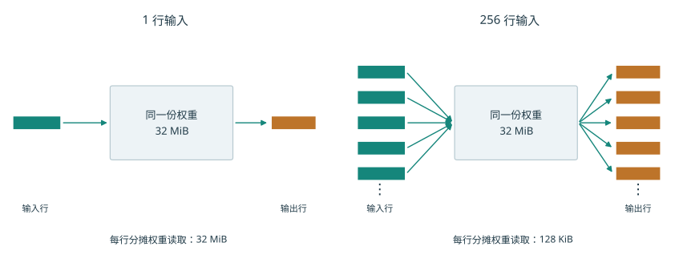

*图 4-1　两种调用都使用同一份 32 MiB 权重。上方是一行输入，下方以部分条带示意 256 行；每行分摊的权重读取从 32 MiB 减至 128 KiB。*

行数增至原来的 256 倍，运算次数也增至 256 倍，访问量却只增加约八分之一。原因在于权重复用：单行调用独自承担 32 MiB 权重读取，256 行调用把它摊成每行 128 KiB。同一份权重支持的运算越多，矩阵单元花在等待权重上的时间比例就越小。[^projection]

图 4-1 解释了复用怎样减少每行的读取量；公式还可以回答这种减少能持续到什么程度。将算术强度的分子、分母同除以 $M$，有

$$
I(M)=\frac{2KN}{2KN/M+2(K+N)}.
$$

随着 $M$ 增长，每行分摊的权重项 $2KN/M$ 不断缩小，输入输出项保持不变。对本例，$I(M)$ 最终趋近 2,048 FLOPs/byte。因此，继续增大 batch 所带来的收益会逐渐减小：每行分摊的权重读取量虽然越来越少，但新增位置的输入和输出仍然需要读写。

前面的计算假定权重只读一次。要在机器上做到这一点，就需要在使用期间保存操作数和中间结果。下一节沿数据流找到承担这些任务的硬件部件。

### 4.1.2 加速器的组成与分工

主机（host）通常是运行框架、准备输入并发起任务的 CPU 一侧，设备（device）是执行模型计算的加速器。对有独立显存的 GPU，主机内存和显存是两处存储。运行投影前，输入与权重先放到设备可访问的位置；CPU 随后提交命令，给出算子、数据地址与执行参数。数据已经驻留时，后续调用可以反复引用同一地址。

图 4-2 展示了设备内部各部分如何协作完成一次矩阵乘法。片外内存保存较大的输入和权重；共享缓存是由多组计算单元共同访问、自动保留近期数据的存储；局部缓冲是分配给当前计算组暂存输入的存储；矩阵单元反复更新部分和；累加存储把部分和留到本块计算结束。向量与通用计算单元负责结果变换、地址计算和流程控制等工作。

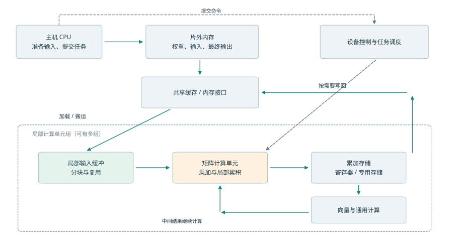

*图 4-2　主机、显存与芯片内部的关系。实线表示数据经过缓存、局部缓冲、矩阵单元和累加存储，虚线表示主机提交工作。图按硬件功能分组。*

计算一个输出块时，需要沿 K 维依次读入多块输入和权重。每完成一次乘加，部分和仍留在累加存储中，下一块继续更新它。如果每次更新都写回片外，中间结果就会被反复写入和读出；把部分和留在片上，便把这些访问缩减为最终的一次写回。数据重复使用的次数越多，将它留在片上就越有价值。

NVIDIA 把一组可协作执行的线程、通用计算单元、矩阵单元与局部存储组织为流式多处理器（Streaming Multiprocessor，SM），其中矩阵乘加单元称为 Tensor Core。线程是程序中分别执行指令的工作单位。昇腾 DaVinci 的 Scalar、Vector、Cube 和 MTE 则分别指控制单元、向量计算单元、矩阵计算单元与数据搬运单元。Apple 的 Metal 是提交 GPU 工作的编程接口，用线程组组织能够共享局部存储并同步的线程。虽然名称不同，这些部件都要解决几个共同问题：操作数怎样到达执行单元，结果怎样保存，下一项工作何时可以开始。[^architecture]

沿图中的箭头可以区分两种等待。一种是数据尚未到达，例如输入块仍在传输；另一种是前一项计算尚未结束，例如将分数转为归一化权重的 Softmax，正在等待查询与键的点积（QK）完成。增加带宽能够缩短第一类等待，改变分块或执行顺序能够改变第二类等待。后续各节将分别展开这两种机制。

模型与芯片在一代代设计中相互影响。现有设备的能力影响模型的状态大小、矩阵形状和通信方式，软件通过压缩、融合和并行提高执行效率；当某种负载长期占据较大比重，芯片设计者便会考虑为它增加专用能力。新一代芯片投入使用后，不同模型的运行成本又会随之改变。设计和制造存在周期，因此硬件响应的是此前已经观察到、并预计会延续的需求。

DeepSeek V3 报告针对 H800 上的执行瓶颈，提出通信卸载、跨互联的一致操作、低精度累加和量化支持等硬件需求；其中，通信卸载源于部分 SM 被通信占用。[^feedback] 结合芯片设计时间线，可以研究这些需求如何影响后续设计。

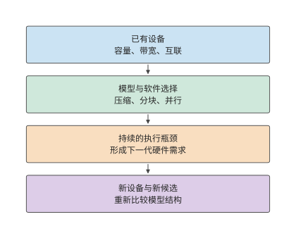

*图 4-3　模型与硬件跨代协同。实线沿时间向下：现有设备影响模型选择，软件运行暴露长期瓶颈，硬件设计回应这些需求，新设备使更多模型方案成为可能。*

### 4.1.3 芯片面积、功耗与封装的限制

计算单元、存储器和接口都占用芯片面积，也都消耗电能。分给某一部分的资源越多，留给其他部分的预算就越少。因此，评价一项局部改进，要看它能让整个任务缩短多少时间。

本章开篇的串行任务中，矩阵计算占 60 μs，其余工作占 40 μs。矩阵速度翻倍后，两部分分别用 30 μs 和 40 μs，合计 70 μs。若以 $f$ 表示可加速部分的时间比例，$s$ 表示其加速倍数，根据 Amdahl 定律，整体加速比为：

$$
S=\frac{1}{(1-f)+f/s}=\frac{1}{0.4+0.6/2}\approx1.43.
$$

继续把矩阵速度提高到原来的四倍，总时间降至 $60/4+40=55$ μs。第一次翻倍省下 30 μs，第二次只省下 15 μs；即使矩阵计算时间趋近于零，其余 40 μs 仍然保留。整体加速上限为 2.5 倍。剩余工作在新总时间中所占比例越来越大，资源投入的重点也随之改变。

早期 TPU 的面积分配展示了计算与存储之间的实际取舍。TPU 是 Google 设计的张量处理器。第一代 TPU v1 具有 $256\times256$ 个 8-bit 乘加单元、24 MiB 的统一数据缓冲（Unified Buffer） 和 4 MiB 累加存储。论文给出的芯片面积分布中，数据缓冲约占 37%，计算单元约占 30%，控制电路约占 2%。缓冲占用的面积甚至超过计算单元，因为阵列需要反复使用输入、权重和部分和。如果每次都从片外读取，乘加器就会花大量时间等待数据。[^tpu]

假设为了增加乘加器，设计者缩小了缓冲容量。原来能保留的输入块被提前逐出，下次使用时要再次加载；重复读取增加的时间，可能抵消新增乘加器带来的收益。反过来，为很少重复使用的数据配置过大的缓冲，也会占用本可用于计算的面积。比较设计方案时，要计算同一任务在改动前后的总时间，把计算加快与重复读取增加的影响一起考虑。

> **思考：矩阵加速与其余工作加速的收益比较** 在上述 60 μs 加 40 μs 的任务中，把矩阵速度从两倍提高到四倍，与把其余工作从 40 μs 降至 25 μs，哪种改动节省的时间更多？如果两者面积代价不同，应怎样选择？

下一节先分析计算单元怎样利用矩阵运算的规律，再引入那些无法由矩阵乘法完成的步骤。这样才能确定公式中的“可加速部分”究竟包含什么。

## 4.2 计算单元

上一节用运算速率表示矩阵单元的性能。本节进一步解释这一速率从何而来：一条指令处理多大的矩阵，为什么小矩阵难以充分利用计算单元，以及矩阵结果还要经过哪些向量与控制操作。

### 4.2.1 矩阵单元为什么适合神经网络

矩阵单元的优势之一，是让多个乘加单元共享操作数。计算一个 $m\times n$ 输出块时，同一行输入参与 $n$ 个输出元素的计算，同一列权重参与 $m$ 个输出元素的计算。把这些乘加组织到阵列中，操作数便可以在相邻计算位置间传递，部分和留在本地更新；一条指令描述整块工作，控制成本由大量运算共同分摊。

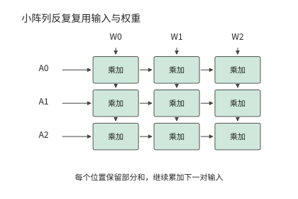

*图 4-4　三行三列的乘加阵列示意。输入沿行传递，权重沿列传递，每个乘加位置保留自己的部分和。这里用小阵列解释操作数复用。*

以一次 $16\times16\times16$ 的矩阵操作为例，两个输入块各有 256 个元素，完成 $2\times16^3=8192$ 次浮点操作。每个输入元素在块内参与 16 次乘法。相比逐个输出独立取得全部操作数，这种计算方式减少了重复搬运和指令开销。

矩阵指令通常按固定大小的块执行。设某种实现的最小计算块为 $m_t\times n_t\times k_t$，矩阵尺寸不足整块的部分用零补齐。有效运算占实际执行运算的比例为

$$
\eta_{\mathrm{shape}}=\frac{MNK}{\lceil M/m_t\rceil m_t\,\lceil N/n_t\rceil n_t\,\lceil K/k_t\rceil k_t}.
$$

若行方向最小为 16，真实矩阵只有一行，其余维度均对齐，则 16 行中只有一行包含有效输入。把矩阵单元数量翻倍，会同时加快有效计算和补零计算；改用适合单行的矩阵向量乘法（GEMV）实现，则可以减少补零造成的无用计算。第 4.7 节的实测将展示库如何选择不同实现。

专家模型让行数问题更加突出。设 64 个 token 各选择八个专家，共有 512 次分派；各专家矩阵尺寸相同。如果分派恰好均匀覆盖 256 个专家，每个专家只处理两个 token 的特征向量；如果全部 token 选择同样的八个专家，每个专家处理 64 个 token 的特征向量。两种情况下，64 个原始 token 都产生 512 次专家分派，在各专家输入矩阵中合计占 512 个有效行。

继续使用行方向按 16 补齐的实现。前一种分派执行 $256\times16=4096$ 行，其中 512 行有效；后一种执行 $8\times64=512$ 行，全部有效。两种分派的有效计算相同，补齐后的工作却相差八倍。一批 token 选中了哪些专家，既决定需要读取哪些权重，也决定每个专家处理多少行，从而影响矩阵单元的利用率。

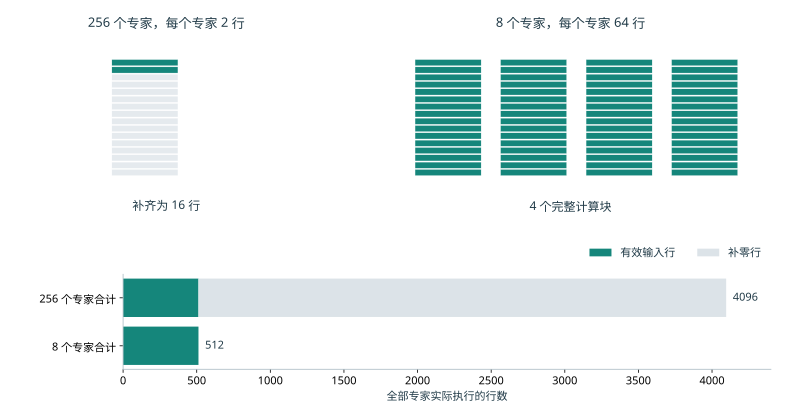

*图 4-5　一个专家的 16 行计算块。每专家只有两行时，剩余十四行填零；每专家有 64 行时，可组成四个完整块，图中展示其中一块。*

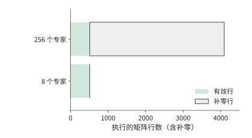

*图 4-6　相同 512 行有效输入在全部专家上的执行量。分散到 256 个专家后总计执行 4096 行，集中到八个专家时只执行 512 行。*

图中浅灰部分是补零带来的计算，增加乘加器也会加快这些无用操作。减少浅灰部分则要改变每个专家的输入行数或选择更小的计算块。这两种改进作用不同：前者提高运算速度，后者减少需要执行的运算。

这解释了为什么库为不同形状准备多种内核：大矩阵利用阵列复用，小矩阵需要更合适的执行粒度，多个小任务还可以通过分组减少调度空隙。Tensor Core 与昇腾 Cube 专门执行规则矩阵运算，通用执行单元保留对其他形状的处理能力；两者配合处理实际负载中大小不同的矩阵。[^nvidia]

### 4.2.2 向量与控制单元负责哪些工作

除了矩阵乘法，Transformer 层还包含归一化、位置编码和激活函数；专家模型还需要进行路由。这些步骤包含逐元素运算，也包含多个元素之间的依赖。

以一行有 $n$ 个分数的 Softmax 为例，为保证数值稳定，先求最大值，再计算平移后的指数，最后求和并归一化：

$$
a=\max_j z_j,\qquad e_j=\exp(z_j-a),\qquad p_j=\frac{e_j}{\sum_k e_k}.
$$

$n=128$ 时，需要计算 128 个指数值，并对 128 个结果归一化；求最大值和求和则要分别合并 128 个输入。逐元素运算可以分配给多个计算单元并行执行，把多个元素合并为较少结果的操作称为归约，例如求和或求最大值；归约需要逐步合并各单元的结果。理想二叉归约经过 $\log_2 128=7$ 轮，每轮等待上一轮结果。增加并行计算单元可以缩短每一轮的处理时间，但各轮仍需依次进行。

向量单元承担这类逐元素和归约工作，特殊函数单元处理指数等操作，控制逻辑安排循环、地址、分支和同步。它们一起决定矩阵结果何时能够被后续计算使用。昇腾的 Cube、Vector、Scalar 命名直观地体现了这种分工；950 白皮书中的一个 AI 子系统由一个 Cube Core 和两个 Vector Core 组成，向量部分采用以单指令多数据（SIMD，即一条指令对一组数据执行同样操作）为主、单指令多线程（SIMT，即把同一指令分派给一组各有执行状态的线程）为辅的执行方式。[^ascend]

Softmax 的分数随输入变化，需要每次重新求指数；另一些非矩阵运算使用的系数只随位置变化，可以预先计算并反复使用。旋转位置编码（RoPE）通过旋转向量引入位置信息。它使用固定位置的正弦、余弦系数，对一对分量执行

$$
x'_0=x_0\cos\theta-x_1\sin\theta,\qquad x'_1=x_0\sin\theta+x_1\cos\theta.
$$

Qwen3-8B 一层的 32 个 Q 头和 8 个 K 头，每头旋转 128 维，共有 $(32+8)\times64=2560$ 对分量。每对四次乘法、两次加减，共 15,360 FLOPs/token。各头在同一位置使用相同系数，因而可以共享一张表：为 1,024 个位置各保存 64 个 cos 和 64 个 sin，BF16 存储只需 $1024\times128\times2=256$ KiB。[^nonmatrix]

预计算把重复的三角函数求值转成系数读取，旋转本身仍按每个 token 执行。这个变化把压力从特殊函数计算转向表访问与向量运算。理解实际执行时，可以先区分哪些值随输入变化、哪些值能够重复使用，才能找到真正反复发生的计算。

### 4.2.3 NVIDIA、昇腾和 Apple 如何执行注意力计算

注意力把两类计算连接起来：$Z=QK^{\mathsf T}$ 生成分数，$P=\operatorname{Softmax}(Z)$ 生成概率，$O=PV$ 形成输出。同一块数据必须依次经过这三步；多个块则可以在不同资源上交错推进。

| 工作 | NVIDIA GPU | 昇腾 | Apple GPU |
| --- | --- | --- | --- |
| 查询与键的点积 QK、概率与值的乘积 PV | Tensor Core；小矩阵可用通用计算单元 | 矩阵核 Cube（AIC） | Metal GPU 矩阵运算 |
| 指数、归约、缩放 | SM 的通用与特殊函数资源 | 向量核 Vector（AIV） | GPU 线程与相应库实现 |
| 中间状态 | 寄存器、共享内存、累加存储 | 计算单元近旁的零级缓冲（L0）、统一缓冲与交换通路 | GPU 缓冲与线程组存储 |

这一分工决定哪些操作可以同时执行。例如，一个块在处理指数时，矩阵单元可以处理另一个块；但双方若都要从同一个片上接口取操作数，该接口仍需依次提供全部字节。哪些单元能够并行工作、哪些操作共用同一接口，共同决定了流水线稳定运行时的吞吐率。本章 Apple 实验使用 M2 Max 的 Metal GPU；其独立神经网络加速单元 Neural Engine，以及后续 M5 集成在 GPU 中的神经网络加速单元 GPU Neural Accelerator，属于不同的计算单元。[^apple]

FlashAttention 系列通过分块减少注意力中间结果的显存访问；第四版进一步研究更强矩阵单元下的计算分工。下面用 FlashAttention-4 对 NVIDIA Blackwell 架构 B200 单个 SM 的分析，计算这种分工对吞吐率的影响。一个 $128\times128$、头维度为 128 的矩形注意力块，QK 与 PV 合计约 8.39 MFLOPs，指数结果有 16,384 个。按矩阵速率 8,192 FLOPs/SM/cycle、指数速率 16 results/SM/cycle，两者各需 1,024 周期。矩阵操作数的共享内存读取为 96 KiB，按 128 bytes/SM/cycle，需要 768 周期。[^fa4]

连续处理多个块时，矩阵单元、共享内存接口和指数单元可以构成流水线，处理每个块时，三者分别被占用 1,024、768 和 1,024 周期。若新块到达的速度超过其中任一单元的处理速度，等待队列就会不断增长。因此，在流水线稳定运行后，相邻两块完成的时间间隔至少为

$$
\tau\ge\max(T_{\mathrm{matrix}},T_{\mathrm{smem}},T_{\mathrm{exp}}).
$$

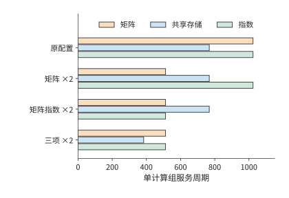

*图 4-7　同一注意力块在四种资源配置下的服务周期。矩阵、共享存储和指数三项分别比较，单独增加一种能力后，其他资源可能成为较长的一项。*

> **例 4-1：注意力流水的吞吐为何受指数运算与共享内存限制？**
>
> **比较矩阵与指数吞吐提高后的块完成间隔** 多个块在独立资源间形成流水。只把矩阵吞吐率提高到原来的两倍，然后同时把指数吞吐率提高到原来的两倍，流水线稳定运行时，相邻两个块最短隔多久完成？
>
> **由最慢资源求注意力流水的服务周期** 原配置为 $\max(1024,768,1024)=1024$ 周期。只提高矩阵能力，得到 $\max(512,768,1024)=1024$ 周期；再提高指数能力，得到 $\max(512,768,512)=768$ 周期。
>
> **矩阵加速后，瓶颈向指数运算与共享内存转移** 第一项改动使矩阵单元更早完成，但指数运算的吞吐率保持不变，完成时间间隔的下界不变。第二项改动消除了指数的限制，共享内存成为耗时最长的单元，对应的理想吞吐提高到原来的 $1024/768=4/3$ 倍。
>
> **共享内存速度也翻倍后的新服务周期** 若共享内存速度也翻倍，三项变为 512、384、512 周期，下界才降到 512。新的均衡点由矩阵与指数共同决定。

提高一种资源的处理能力，可以减少等待，直到另一种资源成为瓶颈。对单个块，QK、Softmax、PV 仍有先后关系；要达到上述完成时间间隔，需要同时保存不同进度的多个块。第 4.4 节将把所需缓冲与时序一起算出来。

> **实验 4-1 · 核心：注意力计算与单元配比**
>
> 将矩形块改为 $128\times256$ 和 $256\times128$，计算三项操作所需时间，再分别提高矩阵、指数和共享内存速度。分别找出改动前后耗时最长的单元，再解释块形状怎样改变复用。最后选一种硬件，将三类工作与存储位置标在执行图上。

### 4.2.4 低精度如何改变计算量、数据量与转换开销

矩阵形状决定做多少乘加，数值格式决定每次乘加使用什么表示。分析低精度需要依次回答三个问题：数据占多少空间，执行时经过哪些变换，误差要求允许采用哪些变换。

先看表示。若 $n$ 个权重各存 $b$ bit，每 $g$ 个值共享一个 $s$ bytes 的缩放因子，分组恰好整除时，存储量为

$$
V_W=\frac{nb}{8}+\frac{n}{g}s.
$$

对前面的 $4096\times4096$ 权重，每个值用 4 bit 保存，每 32 个值共用一个占一字节的缩放因子（scale）：权重数据为 8 MiB，scale 为 0.5 MiB，共 8.5 MiB，相对 BF16 的 32 MiB 压缩约 3.8 倍。若每 16 值一个 scale，总量增为 9 MiB。分组越细，缩放因子越容易适应该组数值的范围，但需要保存的缩放因子也越多。

量化用较少位数表示一组原始数值，并用缩放因子把压缩表示映射回原来的量级。再看执行。压缩值 $q$ 与缩放因子 $a$ 一起表示近似值 $\hat w=aq$。可以先展开成 BF16 再做矩阵乘法，也可以让低精度矩阵指令处理 $q$，随后施加缩放。图 4-8 并列展示这两种实现：前者先花时间展开权重，并保存高精度副本，后者把缩放和合并放进执行过程。

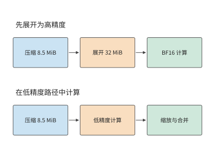

*图 4-8　相同压缩权重的两条计算路径。先展开会形成 32 MiB 的 BF16 副本；低精度路径在计算过程中完成缩放和合并。压缩权重及缩放因子共 8.5 MiB。*

FP4 和 FP8 分别使用四位和八位浮点格式，INT8 则使用八位整数格式。DeepSeek V4-Flash 的一种路由专家实现先将 FP4 权重转换为 FP8，再执行通用矩阵乘法（GEMM）。权重以 FP4 保存和读取，减少了传输字节数；转换后，矩阵单元按 FP8 格式计算。若展开结果被多次使用，一次转换可以分摊到多次调用；若每次调用都重新展开，转换时间就成为每次任务的固定部分。低精度能省下多少时间，要将减少的读取时间与增加的转换时间相比较。[^precision]

两种方法能否采用，还要看量化误差是否满足要求。分组越细，通常越容易控制误差，但缩放与合并也会更多。下面用同一个专家矩阵比较这两方面的变化。配套实验选用 Qwen3-VL-30B-A3B 的一个 $2048\times1536$ 专家矩阵，比较两种方法：直接用 INT8 分块计算，以及先展开为 BF16、再完成一次矩阵乘法。实验在 RTX PRO 6000 上运行，输入来自实际专家路由。向量的 L2 范数是各元素平方和的平方根；用输出误差的 L2 范数除以参考输出的 L2 范数衡量局部相对误差，门槛设为 2%。逐行激活缩放的误差约为 2.3%—3.5%；将激活沿 K 维每 128 个元素分别缩放后，误差降为约 1.5%—1.9%。[^quant-exp]

更细的量化分组改变了点积的累加方式。对一行输入和一列权重，设激活每组缩放因子为 $a_g$，权重列缩放因子为 $b_j$，点积可以写成

$$
y_j\approx\sum_{g=1}^{16}a_gb_j\left(\sum_{k\in g}q_{x,k}q_{w,kj}\right).
$$

由于每组的 $a_g$ 不同，计算时先求各组的整数部分和，再分别乘缩放因子，最后将结果相加。因此，这种实现需要调用 16 次矩阵乘法，并在调用之间完成转换、缩放和合并。输入行数较少时，还要补齐到内核要求的最小行数。另一种方法先将各组展开为 BF16，再通过一次 GEMM 完成整个 K 维的累加。

以真实单 token decode 输入为例，两种方法的总执行时间分别约为 2.81 ms 和 2.52 ms，先展开再计算的方法较快。显存占用则正好相反：内存分配器在后续调用中记录的显存占用峰值分别约为 11.4 MiB 和 35.2 MiB，直接计算的方法节省约三分之二。[^workspace] 更细的量化分组降低了误差，分组调用增加了时间，省去高精度副本减少了显存占用；数值格式与计算方法由此共同决定了误差、执行时间和显存占用。

因此，改进这种实现的方向是把组内计算、缩放和累加融合起来，在降低量化误差的同时减少内核启动开销。位宽决定每个数的表示成本，分组与融合决定这些数怎样参与完整计算。

> **实验 4-2 · 延伸：低精度执行成本**
>
> 从上述分组点积式出发，列出两种方法各自需要保存的权重、量化尺度、展开后的权重副本、部分和与输出。计算加载时展开一次、每次调用展开、直接分组计算三种策略在重复使用 $R$ 次后的总时间。再用实际输入的实验记录比较误差与显存占用峰值，解释何时值得多占用内存来保存展开后的权重，以减少重复展开的开销。

## 4.3 存储层次

接下来分析 Q 投影的数据读写。上一节说明了数值格式怎样改变数据大小，本节进一步区分三个问题：这些数据能否放下，重复使用时从哪一级读取，独立访问是否足以维持目标带宽。

继续分析 V4.1 处理会话时的数据读写，可以看出降低位宽首先减少了 KV 的存储和传输量。主 KV 的 512 个值及分组 scale 共占 288 B；局部 SWA 采用 FP8 加 scale，每条为 528 B。主 KV 在注意力计算前先反量化，因此 FP4 主要用于缓存的存储和传输，注意力乘法使用的是反量化后的数据。主通路降低位宽、局部通路保留更高精度，是按数据敏感性分别选择。[^v41-case]

硬件条件也影响量化格式和量化位置的选择。索引采用 OCP MXFP4，以覆盖更多硬件平台，尽管实验中其他格式的精度更高；主 KV 选择在 RoPE 后量化，因为 RoPE 前量化虽略有精度收益，却增加 decode 开销。报告还测试了去掉第二级全局 scale 的方案，在该实验中未测出精度下降。

若一种新设备提高了 HBM 带宽，先保持这些格式不变，计算节省的读取时间，再比较提高主 KV 精度后的收益与开销。格式选择需要结合任务质量、反量化成本和缓存容量进行评估。

### 4.3.1 显存与统一内存

模型运行时，权重、KV 缓存与临时工作区同时占用内存。这里 KV 缓存保存注意力已经计算出的上下文键（K）和值（V），供后续生成复用。权重占用相对固定，KV 随请求数和上下文长度增长，工作区保存执行中的中间结果。先确定这三项，才能决定设备能否再接收一个请求。

Qwen3-8B 的 BF16 权重约占 16.4 GB。模型有 36 层，每层有 8 个 KV 头，每头 128 维；K 和 V 各保存一份，每个元素两字节。因此，每个上下文位置的 KV 占用为

$$
m_{\mathrm{KV}}=36\times2\times8\times128\times2=147\,456\ \mathrm{bytes}=144\ \mathrm{KiB}.
$$

每条请求保留 $S$ 个位置、同时服务 $B$ 条请求时，容量条件为

$$
W_{\mathrm{resident}}+BSm_{\mathrm{KV}}+M_{\mathrm{workspace}}\le C_{\mathrm{available}}.
$$

将它按 $B$ 求解，就得到固定长度下的最大请求数：

$$
B_{\max}=\left\lfloor\frac{C_{\mathrm{available}}-W_{\mathrm{resident}}-M_{\mathrm{workspace}}}{Sm_{\mathrm{KV}}}\right\rfloor.
$$

设可用容量为 24 GB，留 2 GiB 工作区。扣除权重后，约 5.47 GB 用于 KV。$S=8192$ 时每条请求需要 1.125 GiB，约 1.21 GB，四条请求的 KV 共约 4.83 GB，可以放下；增加到五条后，共需约 6.04 GB，超过剩余容量。上下文翻倍后，每条请求 KV 翻倍，最大请求数降为两条。[^capacity]

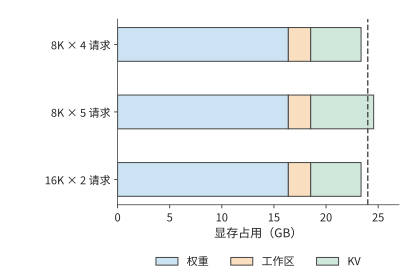

*图 4-9　固定 24 GB 显存中的权重、工作区和 KV。8K 四请求与 16K 两请求可以容纳，8K 五请求超过虚线标出的容量上限。*

图 4-9 中，权重与工作区的宽度保持不变，变化发生在右侧的 KV 区域。长上下文让每个 KV 块变宽，增加并发则增加块数；二者争用同一份剩余空间。

这个公式揭示了容量的阶梯效应。增加少量内存时，$B_{\max}$ 可能保持不变；只有剩余空间足以容纳一条新请求的全部 KV，才能多接收一条请求。压缩权重会增大公式分子中的剩余空间，因此也能容纳更多请求。对权重较大的模型，减少固定占用可明显提高并发；对长上下文任务，KV 已占较大比例，继续压缩权重的收益会逐渐减小。

训练还使用梯度、优化器状态和保留激活。按照第三章介绍的张量保存时间计算这些状态的占用：在某一时刻同时存活的张量共同决定峰值，已经释放的中间结果腾出空间给后续工作。容量规划因而既与每份张量大小有关，也与执行顺序有关。

高带宽内存（HBM）通过堆叠存储裸片和宽接口提供带宽；图形双倍数据速率内存（GDDR）通常以多颗存储芯片配合高速接口提供显存。两者都是内存器件与接口技术，统一内存是处理器共享内存的组织方式。Apple 的 CPU 与 GPU 访问共享物理内存，两者可以先后使用同一个缓冲区，减少独立副本；相应地，CPU、GPU 与其他应用也共同消耗这份容量与带宽。[^apple] 第 4.5 节会沿主机到设备的路径分析这种组织对传输时间的影响。

> **思考：KV 压缩能否容纳第五条请求？** 若每条请求 KV 需求从 1.21 GB 降低 10%，上述设备能否容纳第五条请求？先求五条请求的总需求，再比较剩余空间。

### 4.3.2 缓存、片上缓冲与寄存器

图 4-9 只回答了数据能否放下。即使容量足够，每次计算都从片外取得操作数也会造成大量等待；将重复使用的数据留在片上，可以减少这部分传输。寄存器保存线程与指令正在使用的值，缓存自动保留最近访问的数据，软件管理的缓冲则由程序明确安排加载和释放。它们把高频使用的数据留在计算单元附近，但片上存储占用芯片面积，容量也比片外内存小得多。

考虑一个 $m=n=128,k=64$ 的乘加块。BF16 输入与权重块各为 16 KiB，合计 32 KiB；FP32 输出累加器为 $128\times128\times4=64$ KiB。设某计算组有 96 KiB 局部缓冲，若操作数与累加器都放在其中，恰好用满。要同时准备下一对操作数，便需要 $2\times32+64=128$ KiB。

若累加器使用独立存储，同样的 96 KiB 就能容纳三组输入。总输入缓冲没有增大，但存储分工改变了可以提前准备的输入块数。Blackwell SM100 的 Tensor Memory 为矩阵累加提供专门位置，寄存器与输入缓冲的压力也随之重新分配。[^nvidia] 片上存储的作用既取决于容量，也取决于哪些执行单元能够访问它。

前例把一个计算块的部分和留在片上，省去了反复写回。同样的思路也适用于多个计算块共同使用的输入。设四个输出块都要读取同一份 32 KiB 输入，它们共发出 128 KiB 的逻辑请求。L2 是计算单元之间共享的二级缓存，DRAM 是片外动态随机存储器。若第一次读取把数据留在 L2，后面三次命中，则片外只需提供 32 KiB，L2 仍要向各块提供全部 128 KiB。若四个输出块由同一计算组顺序处理，并将输入留在局部缓冲，后续访问就可以直接从局部缓冲取得数据。

同一份数据因而有三个不同的量：数据本身占用的空间、各计算块请求读取的字节数、某一级接口实际传输的字节数。算术强度也随观察层次变化。用 L2 请求量计算的强度要与 L2 带宽一起使用，用 DRAM 流量计算的强度则与片外带宽一起使用。第 4.7 节将用实际计数展示这种差别。

增大计算块通常能增加数据复用，但也需要更大的缓冲。设各计算组共用 128 KiB 缓冲，每个计算组需要 32 KiB 时，可以容纳四组；每组扩到 64 KiB 后，只能容纳两组。一组等待数据时，另一组可以继续计算。因此，同时运行的组数减少后，计算单元更容易闲置。选择块大小时，要同时考虑每组能减少多少重复读取，以及还能容纳多少组相互独立的计算。

A100 到 Hopper 的每个 SM 的共享内存（shared memory）容量上限由 164 KiB 增至 228 KiB，可以容纳更大的数据块或更多同时运行的计算组；新的累加存储与异步搬运机制则改变这些空间的使用方式。[^evolution] 下一节从“需要多少相互独立的访存请求”出发，说明局部存储容量如何影响有效带宽。

### 4.3.3 容量、带宽与延迟分别限制什么

容量是某一时刻能够保留多少数据，带宽是单位时间传输多少数据，延迟是一次请求从发出到完成经过多久。容量越大，能同时保存的数据越多；带宽越高，每秒能传输的数据越多；同时发出足够多的独立请求，则可以在等待一次访问返回时继续处理其他访问。

先看模型驻留和逐步执行对内存提出的不同要求。H100 SXM 的名义容量为 80 GB、标称带宽为 3.35 TB/s；H200 SXM 分别为 141 GB 和 4.8 TB/s。容量增长约 76%，带宽增长约 43%。Qwen3-235B-A22B 的一组 4-bit 方案中，权重与量化缩放系数（scale）约为 123.1 GB，八条请求各保留 8,192 个位置的 KV 约为 12.6 GB，加 2 GiB 工作区，共约 137.9 GB。H100 缺近 58 GB，H200 则留约 3.1 GB 余量。容量增加首先使这些数据能够共同驻留。[^storage]

全部专家的权重都保存在内存中，而每步需要读取哪些权重由路由结果决定。八条请求的专家选择分散时，权重、scale 与 KV 的每步访问约为 76 GB；集中选择相同专家时，降至约 24.7 GB。在 H200 上，仅传输这些字节分别需要约 15.8 ms 和 5.2 ms；改用 8 TB/s 的 B200，分别为约 9.5 ms 和 3.1 ms。专家复用把流量减少到约三分之一，设备升级则把传输一个字节所需的时间减少到原来的约六成，两种改动作用在公式 $T=V/R$ 的不同位置。

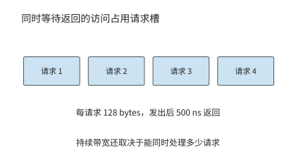

*图 4-10　读取请求从发出到返回一直占用请求记录空间。多个独立请求交叠，才能在单次访问等待期间持续利用接口；图中只画四个代表请求。*

前面的 $V/R$ 计算假定接口可以持续达到给定带宽。要维持这种速度，就必须在一次访问等待返回时继续发出其他请求。将内存接口一次传输的基本单位称为访存事务。设接口中最多同时有 $N_o$ 个未完成事务，每个事务带回 $s$ bytes，平均完成延迟为 $L$。一个事务从发出到返回期间占着一个位置；每秒最多完成约 $N_o/L$ 个事务，于是

$$
R_{\mathrm{effective}}\le\min\left(R_{\mathrm{interface}},\frac{N_os}{L}\right).
$$

把式子按 $N_o$ 求解，维持目标吞吐需要

$$
N_o\ge\left\lceil\frac{R_{\mathrm{target}}L}{s}\right\rceil.
$$

这就是 Little 定律：平均未完成请求数等于请求完成速率乘以平均请求延迟。硬件队列决定能容纳多少未完成事务，而程序中相互独立的访问决定能否用满队列。若下一地址依赖上一读取结果，队列即使很深也装不满；多个独立计算块则能提供互不等待的读取。

> **例 4-2：把接口带宽翻倍，读取会快一倍吗？**
>
> **比较在途事务数与接口带宽对 KV 读取的限制** 读取一条请求的 8,192 位置 KV，共 1.125 GiB。接口带宽为 1 TB/s，每事务 128 bytes，完成延迟为 500 ns。比较 128 和 4,096 个在途事务，再把接口升级到 2 TB/s。
>
> **由在途字节数和访问延迟求有效读取带宽** 维持 1 TB/s 需要 $\lceil10^{12}\times500\times10^{-9}/128\rceil=3907$ 个事务。128 个事务只能提供约 32.8 GB/s，读取时间至少为 36.9 ms；4,096 个事务足以维持 1 TB/s，时间降为约 1.21 ms。
>
> **在途事务不足使接口带宽翻倍只带来有限收益** 升级到 2 TB/s 后，4,096 个事务仍只能支持约 $4096\times128/(500\ \mathrm{ns})=1.05$ TB/s，时间约为 1.15 ms。接口增加一倍带宽，而未完成事务数的限制使吞吐率只能提高约 5%。
>
> **带宽或访问延迟增加时所需的在途事务数** 同时把在途事务数提高到至少 7,813 个，才能维持新的 2 TB/s；若延迟增至 800 ns，这个要求又增至 12,500 个。

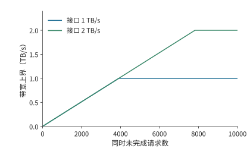

*图 4-11　在每事务 128 bytes、返回延迟 500 ns 的题设下，增加在途请求数提高带宽上界，直到碰到接口本身的速率上限。*

两条曲线在并发较小时重合，是因为限制来自在途字节数。越过各自拐点以后，接口带宽成为新的瓶颈。实际系统中，增加并发访问还会使队列变长，延迟也随负载变化；内存性能测量工具 Mess 用延迟探针与可调背景流量同时观察这两项，得到带宽—延迟曲线。[^mess] 它把“同时发起独立请求可以减少空等”与“请求过多会增加排队时间”放进同一张图中。

分析存储性能时，先根据容量判断数据能否驻留，再根据复用情况计算各级接口的流量，最后结合并发量和延迟判断接口能否持续传输。下一节将把这些条件放入一条具体的加载—计算时间线。

> **实验 4-3 · 延伸：存储容量与解码带宽**
>
> 使用 Qwen3-8B 与 Qwen3-235B-A22B 的存储结果，分别只增加容量、只增加带宽，再改变 batch 和专家分布。先求最大可驻留请求数，再计算每步读取时间，最后求维持目标带宽需要的在途事务数。说明每种方案首先受容量、传输时间还是访存并发数限制。

## 4.4 数据搬运

前面算出了数据的大小与复用次数，也解释了维持带宽所需的并发。现在进一步安排这些数据何时取得、何时使用、何时释放。数据搬运的核心，是让下一块在计算单元使用它之前到达，同时保留当前块直到最后一次使用结束。

### 4.4.1 数据布局与寻址

数学上用行列索引表示矩阵元素，硬件则通过内存地址访问它们。一个元素占 $b$ bytes、行步长为 $s_r$ bytes、列步长为 $s_c$ bytes 的二维视图，元素地址为

$$
\operatorname{addr}(i,j)=\operatorname{base}+is_r+js_c.
$$

按行连续存储的矩阵的 $s_c=b$，行步长由完整行宽决定。取子矩阵时，子矩阵每行只占原矩阵一行的一部分，但相邻行起点之间的距离仍等于原矩阵的行步长。这决定硬件要发起怎样的访问。

例如，从 BF16、行宽 4,096 的矩阵中取 128 行、每行连续 128 个元素。有效数据为 $128\times128\times2=32$ KiB，每行只有 256 bytes，而相邻行起点相差 8,192 bytes。第一行起点到最后一行终点跨越 $127\times8192+256=1\,040\,640$ bytes。逐行读取只传输各行的有效区间；如果相邻线程访问相邻元素，它们的请求还可以合并成较少的事务。

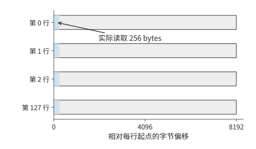

*图 4-12　每行前 256 bytes 是实际读取区间，相邻行起点相差 8192 bytes。128 行合计读取 32 KiB，行间灰色区域由步长跳过。*

蓝色区域每行只有 256 bytes，下一行的蓝色区域却要到 8,192 bytes 之后才开始。读取整个地址跨度会把灰色空隙也搬走，逐行读取则只取得蓝色部分。行步长的作用由此明确：它告诉搬运单元下一段有效数据从哪里开始。

数据布局通过两种方式影响访问开销：步长影响地址计算，地址的连续性影响多个访问能否合并为一次事务。相同的 32 KiB，有的排列能够用规则连续请求取得，有的排列要发出大量短请求。第 4.3 节中的每事务字节数 $s$，就取决于这些访问如何合并。

分块又决定同一地址会被请求多少次。DeepSeek V4-Flash 共享专家的一次 w1 计算为 $[32,4096]\times[4096,2048]$，FP8 输入只有 128 KiB。输出宽度分成 16 个、各 128 列的块，每个输出块都要遍历完整输入，所以块级输入请求合计为 $16\times128$ KiB，即 2 MiB。权重按输出列划分，各块读取自己的部分，权重数据合计为 8 MiB。[^coordinates]

输入大小仍是 128 KiB，多出的请求来自输出列方向的分块。若这些输出块共享缓存，重复请求可以直接从片上缓存取得数据；若同一个计算组保留输入并连续计算多个输出块，复用又可以移到局部缓冲。寻址、分块与存储层次在这里连接起来：分块方式决定发出哪些读取请求，数据所在的位置决定这些请求经过哪一级接口。

普通加载指令可以逐步计算地址并发起访问；专门的搬运单元则接收张量形状、步长和起点，重复生成这些地址。NVIDIA Hopper 架构（H100 所属架构）的张量内存加速器（TMA）和昇腾 950 的多维直接内存访问单元（NDDMA）都提供多维张量搬运能力，NVIDIA 后续的 Rubin 架构还支持更新描述符，以适应运行时变化的数据地址。[^transfer] 对前面的子矩阵，起点、128 行、每行 256 bytes、行步长 8,192 bytes 足以描述整次规则搬运。由专门单元负责这些重复的地址计算后，计算线程就可以继续处理其他工作。

### 4.4.2 异步搬运与双缓冲

前面的地址图说明了如何找到并取出一块数据。找到之后，还要安排它何时到达：如果总等当前块算完才读取下一块，计算单元就会反复停下来。先看加载和计算这两个阶段。共 $n$ 块数据，每块加载耗时 $t_l$、计算耗时 $t_c$。若取得一块、算完一块，再开始下一块，总时间为 $n(t_l+t_c)$。准备两个缓冲，就能在计算当前块时把下一块装入另一缓冲。加载与计算使用独立资源时，第一块先加载、再计算，后续各块以较慢阶段的节奏完成：

$$
T_{\mathrm{pipe}}=t_l+t_c+(n-1)\max(t_l,t_c).
$$

八块数据每块加载 2 μs、计算 1 μs，串行需 24 μs，流水需 $2+1+7\times2=17$ μs。节省的 7 μs 来自重叠，传输字节和乘加次数都保持不变。再把计算加快一倍，总时间仅降到 16.5 μs，因为加载仍然每两微秒才能提供一块。

上述双缓冲分析把加载看作一个完整阶段。下面再将加载拆成传输与等待返回，看看多个请求同时进行时需要多少缓冲。这里需要区分**发起间隔**与**完成延迟**：用 tick 表示本算例的离散时间单位。若每隔 64 tick 发出一次读取请求，而每块数据要在请求发出 192 tick 后才可使用，就会有多块同时等待返回。计算开始前，输入必须已经到达。把保存一个输入块的缓冲区称为一个输入槽：从发出读取请求，到该块计算结束，这个槽一直被占用。增加槽位可以更早发起后续数据的读取，但也占用更多局部存储。

用注意力的 QK 计算具体推导。两个输入都是 $128\times128$，沿头维度切成四个 $k=32$ 的累加块。每块 Q/K 输入合计 16 KiB，计算量为 1,048,576 FLOPs，四次计算依次更新同一份 FP32 结果，结果保存在独立的 64 KiB 累加存储中。用 tick 表示本例的离散时间单位：输入传输速率为 256 bytes/tick，传输后再等 128 tick；矩阵速率为 8,192 FLOPs/tick。[^pipeline]

于是每块输入传输耗时 64 tick，发起后 192 tick 就绪，计算再用 128 tick。

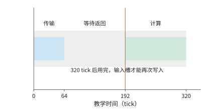

*图 4-13　一个输入槽从发起到释放的完整生命周期。传输 64 tick，额外等待 128 tick，数据在 192 tick 就绪，再计算 128 tick，于 320 tick 释放。*

只有一个输入槽时，该槽经历加载、等待、计算，共 $64+128+128=320$ tick 后才能复用，四块在 1280 tick 结束。

下面依次画出一槽、两槽和三槽的执行，并保持时间尺度一致。先沿绿色计算区间寻找空闲，再向上查看下一块输入何时就绪，就能判断等待从何而来。

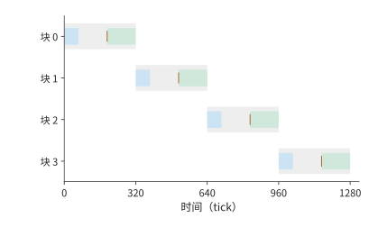

*图 4-14　一个输入槽的四块时序。蓝条为传输，橙线为就绪，绿条为计算，浅灰为槽占用；上一块用完后才能再次发起，完成时刻为 1280 tick。*

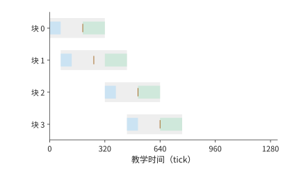

*图 4-15　两个输入槽使用相同时间尺度。前两块可提前发起，但第三块到 512 tick 才就绪，第二块在 448 tick 已结束，留下六十四 tick 空闲。*

两个槽允许在时刻 0 和 64 发出前两块的读取请求。第一块在 192 开始计算、320 结束，释放的槽用于第三块，第三块在 512 就绪；第二块在 448 已算完，因此中间留下 64 tick 空闲。继续按同样次序，第四块在 768 结束。第二个槽把一部分等待移到了计算期间，但计算期间仍有空闲。

要连续计算四块，最早完成时间是首块等待加四次计算，即

$$
T_{\min}=192+4\times128=704\ \mathrm{tick}.
$$

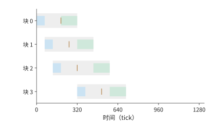

*图 4-16　三个输入槽提前发起前三块，第一槽释放后接收第四块。矩阵单元从 192 连续计算到 704 tick，第四槽不再缩短完成时间。*

三个槽已经足够实现这个时间。前三块的读取请求分别在时刻 0、64、128 发出，分别在 192、256、320 就绪；计算从 192 开始依次进行。第一块在 320 释放槽位，立即发出第四块的读取请求，它在 512 就绪，早于计划开始计算的时刻 576。矩阵单元因此从 192 到 704 tick 一直连续计算，中途没有空闲。[^pipeline-extra]

| 输入槽数 | 输入缓冲 | 完成时间 | 相对前一项节省 |
| --- | ---: | ---: | ---: |
| 1 | 16 KiB | 1280 tick | — |
| 2 | 32 KiB | 768 tick | 512 tick |
| 3 | 48 KiB | 704 tick | 64 tick |
| 4 | 64 KiB | 704 tick | 0 |

这个例子给出了一种寻找缓冲配置的方法：先用首块到达时间与连续计算时间求出目标，再逐个检查每块能否按时到达，最后寻找满足目标的最少槽位。第四个槽虽然让最后一块更早就绪，却没有让计算更早开始；提前取得的数据只是多等待了一段时间。

缓冲配置还随计算速度变化。矩阵速率翻倍后，每块只算 64 tick，连续计算的目标变为 $192+4\times64=448$ tick。只有三个槽时，第四块最早在 256 tick 发出读取请求，到 448 tick 才可使用，赶不上原计划的 384 tick 开始计算，完成时间为 512 tick；四个槽则能提前发出全部请求，达到 448 tick。矩阵计算加快以后，原来的加载安排已经来不及准备下一块数据，输入缓冲也需要重新配置。

硬件机制提供执行这种安排的手段：NVIDIA Ampere 架构（A100 所属架构）的异步拷贝可以省去部分加载过程中的寄存器中转，Hopper TMA 用描述符发起较大的张量搬运，昇腾 MTE／NDDMA 配合同步事件交接数据，Metal 则按照任务之间以及缓冲区读写之间的依赖安排执行。[^transfer] 在每一种实现中，搬运单元向空槽写入数据，计算单元用完数据后释放该槽。槽位既要保存尚未用完的输入，又要容纳提前取得的数据，因此决定了计算能否正确进行，以及搬运和计算能重叠多少。

> **思考：传输延迟翻倍后三个缓冲槽是否够用？** 保持原来的传输和计算速率，把输入完成的额外延迟从 128 增至 256 tick。三个槽能否继续实现无间隙计算？分别写出第四块的就绪时刻与所需时刻。

### 4.4.3 单元间的数据传递

输入流水解决了数据到矩阵单元的等待，注意力还要把矩阵结果交给向量单元，再将概率送回矩阵单元。若完整保存一个 $128\times128$ FP32 分数矩阵，需要 64 KiB；矩阵单元写一次、向量单元读一次，经过同一存储接口的数据共 128 KiB。若矩阵单元直接把结果传给向量单元，就可以省去这次中间结果写回和重新读取。

向量计算何时开始，还取决于它需要哪些完整结果。普通逐行 Softmax 要先得到一行的全部分数，再求最大值和归一化分母。沿 QK 的内积维度计算一半时，每个分数都只是部分和；沿查询行切分则可以先完成一组完整行，把它们交给 Softmax，其余行继续矩阵计算。分组方向因此决定向量单元能否提前开始计算。

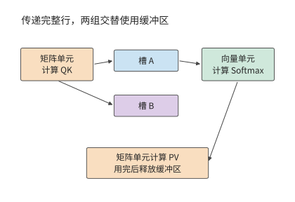

*图 4-17　矩阵与向量单元通过完整行组交接。QK 产生分数，Softmax 产生概率，PV 使用概率后释放槽；另一槽容纳相邻行组，使不同组可以重叠推进。*

具体来看，将 128 行沿查询方向分成四组、每组 32 行，一组 FP32 分数和 BF16 概率共需 $32\times128\times(4+2)=24$ KiB。采用两个缓冲区保存矩阵单元与向量单元之间传递的数据；每个缓冲区从该组 QK 开始占用，到 PV 完成才释放。QK 与 PV 共用矩阵单元，Softmax 使用向量单元，两个方向共用交接接口。这样，不同组可以同时执行不同阶段的计算。[^handoff]

| 交接方式 | 行组大小 | 槽数 | 向量计算开始时刻 | 完成时间 |
| --- | ---: | ---: | ---: | ---: |
| 写入存储后再读取 | 128 | 1 | 1536 tick | 5118 tick |
| 写入存储后再读取 | 32 | 1 | 384 tick | 5120 tick |
| 写入存储后再读取 | 32 | 2 | 384 tick | 3200 tick |
| 直接传递 | 32 | 2 | 256 tick | 3008 tick |
| 直接传递 | 32 | 4 | 256 tick | 3008 tick |

先只改分组。向量单元从 1536 提前到 384 tick 开工，但总时间仍约为 5120 tick。原因在于只有一个槽：这一组进入 Softmax 时，槽内结果仍要保留，下一组 QK 无处写入，只能等待前组 PV 结束。提前开始缩短了第一组的等待，却没有让相邻组重叠。

再增加第二个槽，下一组可以使用另一槽推进，总时间降到 3200 tick，减少约 38%。随后改为直接交接，减少每次交接经过存储接口的字节数，总时间进一步降至 3008 tick，节省约 6%。继续增加槽位没有改变耗时最长的单元的工作节奏，完成时间保持不变。

这与输入流水的分析得到相同结论：先为相互独立的计算组提供缓冲，再缩短关键路径上各步骤的耗时。按行分组使一部分结果能够提前算完，缓冲则保存各组的中间结果，直接通路减少交接代价。昇腾 950 在矩阵核 Cube 与向量核 Vector 之间的 CV 通路、专用累加存储及细粒度完成事件分别作用于其中的环节。[^transfer]

> **实验 4-4 · 核心：片上缓冲与数据复用**
>
> 分别画出输入流水使用一至四个缓冲槽时的时间线，用数据到达、计算结束和缓冲区释放时刻证明最少槽数；再将矩阵速率翻倍，解释最少槽数的变化。随后重建行组交接表，区分分组、增加槽位和直接传递各自省下的时间。最后在固定片上容量下，分析每组缓冲的大小如何限制能够同时驻留的组数。

至此，计算单元之间的协作已经可以通过各步骤的计算量、使用的硬件单元和数据依赖来分析。跨芯片执行会增加更长的数据路径，但仍然遵循同样的结果生成、传递和使用顺序。

## 4.5 多芯片封装与互联

单个设备无法满足计算或存储需求时，可以把计算和存储分布到更多芯片。扩展增加了资源，也增加了生成数据的单元与使用数据的单元之间的距离。本节沿封装内、主机与设备、设备之间三种连接，分析数据放置和传输粒度怎样影响完成时间。

### 4.5.1 封装内的计算芯片、内存与连接

一个封装可以包含多颗裸片（die），由它们共同提供计算单元和内存接口。Blackwell 数据中心产品与昇腾 910C 都采用双裸片设计：各 die 提供本地计算和存储访问，封装内链路交换跨 die 数据。[^package] 扩大的容量使更多模型能够驻留，计算放在哪一侧则决定多少访问要经过链路。

设两个 die 各有 64 GiB 本地存储，一份 96 GiB 权重在两侧各放 48 GiB。某阶段全部在 die 0 上执行，需要读取 32 GiB 本地权重与 32 GiB 远程权重；两段依次进行，本地有效带宽为 4 TiB/s，跨 die 带宽为 1 TiB/s。远程读取需要 $32/1024$ s，约 31 ms；本地读取约 7.8 ms，合计约 39 ms。远程数据只占一半字节，却占约五分之四的读取时间。

可以把处理远程权重的计算移到 die 1，让两侧权重都在本地使用。这样会增加输入或结果交换，但传输的内容从体积较大的权重变成体积较小的激活张量。若迁移计算所需的输入与结果共 64 MiB，同一 1 TiB/s 链路只需约 61 μs，远小于原来的 31 ms。让计算单元在本地反复使用大块权重，只在芯片之间传递较小的输入和结果，便能减少跨 die 通信。[^host]

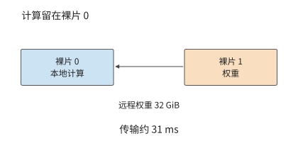

*图 4-18　计算集中在裸片 0 时，需要跨连接读取裸片 1 上的 32 GiB 权重。题设链路为每秒一 TiB，仅这笔跨裸片传输约需 31 ms。*

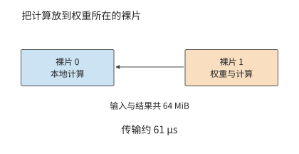

*图 4-19　计算放到权重所在裸片后，跨连接交换输入与结果，共 64 MiB。在相同链路上，传输约六十一微秒；权重由各裸片本地读取。*

图 4-18 比较计算单元与权重的相对位置：集中计算路径搬运权重，就地计算路径搬运输入并取回结果。判断怎样分配计算时，先画出每种方案经过链路的数据，再比较它们的总量。

这种放置还创造了并行机会：两侧本地读取和计算可以分别推进，最终再交接结果。是否需要等两侧都完成，由模型的计算图决定；如果下一步要合并部分和，就在合并点形成同步。第六章会从具体并行切分推导这些交接。

容量增加与局部性改善是两个连续步骤。第 4.3 节约 137.9 GB 的工作集，需要足够容量才能驻留；驻留后，将大块权重放在使用它的计算单元附近，才能避免把封装内链路变成新的瓶颈。分析封装扩展时，先确认容量足以保存所需数据，再安排本地复用，最后计算跨芯片传输的数据量。

### 4.5.2 CPU 与加速器之间的数据访问

封装内的数据放置决定跨裸片传输；设备外也有类似问题。图 4-2 展示了设备之间的数据交接：CPU 准备的数据需要传给 GPU 使用。CPU 准备的输入通常先位于主机内存，独立显存 GPU 通过 PCIe 或平台专用连接取得数据。主机到设备称为 H2D，设备到主机称为 D2H。复制引擎通过直接内存访问（DMA）按准备好的地址搬运，CPU 提交复制命令后可以处理其他工作。

同一个张量先经主机链路上传，再由 GPU 从显存读取，需要分别计算传输和读取的时间。设输入为 64 MiB，主机链路有效带宽为 32 GB/s，GPU 内存读取为 1 TB/s，先忽略启动开销，则

$$
T_{\mathrm{H2D}}=\frac{64\ \mathrm{MiB}}{32\ \mathrm{GB/s}}\approx2.1\ \mathrm{ms},\qquad
T_{\mathrm{read}}=\frac{64\ \mathrm{MiB}}{1\ \mathrm{TB/s}}\approx67\ \mu\mathrm{s}.
$$

上传时间约为一次设备读取时间的 31 倍。如果只使用一次，主机传输占主要时间；如果上传后在设备上复用 $R$ 次，每次分摊 $T_{\mathrm{H2D}}/R$。复用 100 次时，平均每次分担的上传时间降至约 21 μs。每次调用只需提交地址和执行参数，整份数据继续留在显存中。

还可以求出至少需要复用多少次：当 $R\ge32$ 时，每次分摊的上传时间已不大于一次设备读取。于是，提高主机链路带宽对一次性输入更有价值，保持权重常驻则可以省去重复上传。所需复用次数可以直接由上传时间与设备读取时间之比求得。

复制引擎与计算单元是独立执行资源，可以在 GPU 计算当前批次时上传下一批。要形成流水，两个输入缓冲分别保存当前批和下一批，当前批次计算结束后再交换缓冲区的用途；这正是第 4.4 节双缓冲在主机链路上的应用。若复制写入与计算读取共同占用内存接口，该接口要承担两部分流量。

Apple 的 CPU 与 GPU 共享物理内存，采用双方可访问的缓冲时，CPU 写好数据并完成同步后，GPU 可以从同一存储读取。与独立显存的做法相比，省去的是单独 H2D 副本及其传输；GPU 随后的读取仍由内存系统提供。[^apple] 统一内存把数据交接从“复制后使用”变成“同步后使用”。

统一地址则解决另一件事：让 CPU 和 GPU 以统一的地址空间引用数据。CUDA 是 NVIDIA GPU 的编程与运行平台；其统一内存机制（Unified Memory）可按平台规则迁移页面，地址相同而物理位置可以变化。[^host] 数据与使用它的处理器之间的距离影响访问时间，地址和同步机制则让处理器能够找到数据，并在写入完成后读取。Vera—Rubin 等主机协作平台也是通过具体连接组织这条路径。[^package]

### 4.5.3 加速器之间的数据交换

主机上传的例子强调了数据驻留和复用。加速器之间还会频繁交换激活、专家输入或部分结果，这些消息有大有小，除了传多少字节，还要考虑每次传输的固定开销。一次传输既要提交请求、通知接收方完成状态，也要通过链路传送数据。用固定开销 $\alpha$、有效单向带宽 $R$ 和数据量 $V$ 表示，点对点时间为

$$
T_{\mathrm{edge}}=\alpha+\frac{V}{R}.
$$

设传递 $[M,4096]$ 的 BF16 激活，数据量为 $8192M$ bytes，$R=100$ GB/s、$\alpha=2$ μs。$M=1$ 时数据量只有 8 KiB，传输约 0.08 μs，总计约 2.08 μs；$M=256$ 时数据量为 2 MiB，传输约 21 μs，总计约 23 μs。

把带宽翻倍，小消息时间从 2.08 降至 2.04 μs，大消息从约 23 降至 12.5 μs。若改为把固定开销减半，小消息约减半，大消息仅省约 4%。两种优化针对的是公式中不同的主导项。

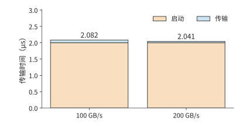

*图 4-20　8 KiB 小消息的启动与传输。固定启动两微秒，带宽从 100 增至 200 GB/s 只缩短蓝色传输项。*

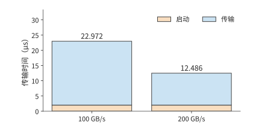

*图 4-21　2 MiB 消息在相同启动条件下的传输时间。较大的蓝色传输项使带宽翻倍带来更显著的收益；本图纵轴范围与小消息图分别标注。*

令两项相等，就得到消息大小的转折点：

$$
V^*=\alpha R=2\times10^{-6}\times10^{11}=200\,000\ \mathrm{bytes}\approx195\ \mathrm{KiB}.
$$

对本例激活，这对应 $M\approx24.4$，即从 25 行起，传输时间超过固定开销。小于这一规模时，合并消息能降低每条消息分摊的启动开销；大于这一规模时，减少字节或提高带宽的收益更明显。把多个已就绪的消息合并，会减少启动次数；等待尚未就绪的消息来凑大包，则会增加排队时间。消息粒度因此也涉及吞吐与响应时间的取舍。

若一次执行有 100 次必须串行的小消息交换，每次 2 μs，仅固定开销就有 200 μs。此时，即使减少一些传输数据，总时间也很难明显缩短，而减少交换轮数可以直接缩短依赖链。全归约（AllReduce）将各设备的局部贡献合并，并让每个设备取得完整结果；它将多次传输与归约连接起来，第六章会分别计算轮数、每条链路的传输字节数，以及传输与计算能够重叠的时间。

NVLink、昇腾 Unified Bus 等互联提供带宽与可达路径，完成通知让接收方及时开始计算。[^package] 分析它们时，仍是从每次传输的数据量、固定开销，以及接收方需要等待哪些数据出发；本节的转折点让我们能够判断应优先减少消息次数，还是增加持续传输能力。

> **思考：消息大小如何改变带宽与启动延迟的优化收益？** 对一条 8 KiB 消息，将带宽由 100 增至 200 GB/s，与将固定开销由 2 降至 1 μs，各节省多少时间？对 2 MiB 消息重复计算，解释选择为何变化。

## 4.6 专用架构

前面通过复用、流水与局部性提高通用加速器效率。如果负载中有些条件长期保持稳定，还可以把它们直接用于硬件设计：固定规则运算、固定通信次序，甚至固定权重。专用化减少某些工作，也把更多资源集中到剩余工作上。

### 4.6.1 TPU

TPU v1 的推理计算以规则矩阵乘法为中心。$256\times256$ 个乘加位置构成阵列，权重经过片上先进先出队列（FIFO，按进入次序取出的缓冲）装入，输入从 Unified Buffer 送入，结果保存在独立累加存储中，再交给激活单元。一条指令可以描述较大规模的矩阵运算，局部连接反复传递操作数，减少每次乘加所需的控制和远距离访问。[^tpu]

一块 $256\times256$ 的 8-bit 权重为 64 KiB。若只处理一行输入，完成 $2\times256^2=131\,072$ 次操作，每字节权重对应两次操作；处理 256 行时，完成约 33.6 M 次操作，每字节权重对应 512 次。权重保持不变，计算增长 256 倍，正是第 4.1 节投影复用关系在阵列中的实现。

要取得这种收益，阵列需要连续的输入行。权重 FIFO 能容纳四块这样的权重块，装入与计算可以通过缓冲衔接；输入不断送入阵列时，独立的累加存储负责保存部分和。大阵列、输入缓冲和权重队列因此互相配合：阵列提供乘加位置，缓冲保证这些位置重复得到有用操作数。

阵列启动时，操作数还要沿连接传播到各计算位置；结束时，结果要汇集输出。连续计算的块数越多，每块分摊的流水线填充与排空时间越少，小任务则更容易受到这些固定步骤影响。这与上一节小消息受启动限制具有相同结构：一次连续处理更多数据，可以让有用工作占据更大比例。

负载发生变化后，硬件各部分的配比也需要调整。训练增加可写状态、梯度与设备间交换；长上下文生成增加 KV 占用，并要求每个生成步骤等待前一步结果。Google 对 TPU 8t／8i 的说明将训练与采样服务分别组织，体现了不同阶段对矩阵、向量、存储和互联的需求。[^tpu8] TPU 的共同思路是围绕已知工作安排资源，而具体配比随主要负载变化。

### 4.6.2 Groq、Graphcore 与 Cerebras

将更多数据留在片上，可以减少远距离访问。沿着这一思路，可以把计算和存储分散到许多局部单元，也可以进一步增大芯片，在片上容纳更多这样的单元。二者都让大量数据由附近的计算单元使用，也都需要安排单元之间的交换。

Groq 的张量流处理器（Tensor Streaming Processor，TSP）由编译器预先安排张量的生成、传输和使用时刻。Graphcore 的智能处理单元（Intelligence Processing Unit，IPU）由许多带有局部存储的计算单元（tile）组成，各单元通过计算、同步和数据交换协同完成任务。Cerebras 把大量计算与存储铺在晶圆尺度上，第三代晶圆级引擎 WSE-3 的片上静态随机存取存储器（SRAM）为 44 GB。SRAM 适合直接集成在计算芯片内，用面积换取低延迟访问。[^special] 这些设计在不同尺度上实现局部性：让通信尽量短，让反复使用的数据靠近计算。

分布式容量的难点在于各处需求并不相同。一个单元释放了存储空间，其他单元也无法直接把这部分空间当作自己的本地存储；要重新平衡，必须迁移数据或移动计算。路由不均的专家模型尤其容易出现这种情况：总量相同，集中到少数专家的请求会使少数局部单元更忙。

局部存储不均衡可以通过重新分配任务缓解，但还有一个随服务规模增长的问题：KV 的总量会增加。沿用 Qwen3-8B，每条 8,192 位置请求的 BF16 KV 是 1.125 GiB。设一种片上方案放完权重后，每设备剩 256 MiB 用于 KV，状态可均匀切分。一条请求需要 $\lceil1152/256\rceil=5$ 个设备；八条请求共 9 GiB，需要 36 个；若八条请求的上下文都增至 32,768 位置，需要 144 个。

从 5 到 36 再到 144，增加的是可写状态，模型权重并未增加。片上保存权重减少了一类读取，但持续服务还需要为增长的状态提供容量。增加设备后，分布式 KV 又带来跨设备数据汇集；容量扩展与通信需求由同一工作负载同时产生。作者关于 Groq 的历史容量讨论也可以从这一关系理解。[^author]

晶圆尺度缩短了部分原本跨封装的连接，但数据仍沿网络经过多个局部单元。把使用同一状态的计算安排在附近，能够减少经过的链路和同步；把任务均匀摊开则有利于使用更多计算位置。分配计算任务时，既要让数据在本地复用，又要避免少数单元过忙而其余单元空闲，原理与多 die 放置一致。

### 4.6.3 固定数据流与固定权重

专用化利用执行中已经确定的条件重新分配硬件资源。固定算子种类使指令和控制简化，固定数据流使通信提前安排，固定数值格式使存储器和运算单元可以按所需位宽设计，固定权重则让不可变参数进入专门的存储组织。原来用于处理多种情况的控制和数据通路，可以相应简化。条件确定得越早，可省去的通用工作越多；模型变化时需要更新的部分，也由这些选择决定。

设计中哪些部分允许重新配置，决定了模型改变后需要更新什么。SambaNova 的数据流组织与现场可编程门阵列（FPGA）的可重配置通路，允许通过重新配置改变部分连接和执行顺序；固定权重设计则围绕特定参数组织存储与计算。[^special] 选择哪一种，取决于哪些部分长期稳定，以及省掉的工作原来占据多少时间。

改变输入，就能让同一个模型执行不同的上层任务。同一组模型权重既可以处理文档问答，也可以根据代码和测试结果提出修改；每次调用使用自己的上下文状态。因而，硬件可以针对共同的模型执行设计权重通路，同时用可写存储保存各条请求的上下文。下面把权重与上下文分别计量，计算这种分工能够释放多少容量和带宽。

作者的 OpenTallas 项目研究将不可变权重放入掩模 ROM 的架构。下面以项目中的 Qwen3-8B 为例，通过解析估算说明“从独立只读存储器（ROM）读取权重、从 HBM 读写 KV”的设计怎样改变各接口的传输量。[^opentallas] 每批只读取一次本步计算所需的权重，约 $W=15.1$ GB；每条请求完整读取 8,192 位置 KV，约 $K=1.21$ GB。完整驻留权重约 16.4 GB，每步读取其中参与计算的部分。

先看同一接口原来承担多少读取。权重与 KV 共用 HBM 时，每步读取为 $W+BK$。把权重移到独立 ROM 后，HBM 只承担 $BK$。两种 HBM 读取量之比为

$$
S_{\mathrm{HBM}}=\frac{W+BK}{BK}=1+\frac{W}{BK}.
$$

$B=1$ 时，HBM 读取量从约 16.3 GB 降至 1.21 GB，读取时间降为原来的约 $1/13.5$。$B=16$ 时，KV 已为约 19.3 GB，总量从约 34.5 GB 降至 19.3 GB，改善约 1.8 倍。batch 增大已经把权重摊到更多请求上，因此进一步省去权重读取的相对收益减小。

令 $BK=W$，可求得 KV 与权重相等的转折点，约为 $B=12.5$；从整数 batch 13 起，KV 超过权重。图 4-22 用水平线与斜线展示了这一转移。

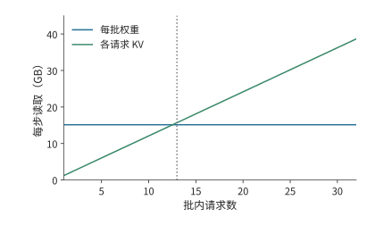

*图 4-22　固定权重的同时，各请求仍独立读取 KV。题设每请求保留 8K 上下文，batch 从十三起 KV 读取超过共享权重读取。*

独立 ROM 接口使权重读取与 HBM 读取可以并行，各自的带宽决定各自所需时间。若目标为单用户 10,000 token/s，每 token 只有 100 μs，那么仅 1.21 GB KV 就要求约 12.1 TB/s。减少 HBM 的权重读取以后，KV 等可写数据成为新的主要带宽需求。

前面用 100 μs 的时限求出了 KV 所需带宽。同一个时限也可以用来求计算单元数量。项目的一组历史分析中，矩阵运算量约为 15.1 G 次操作。设每条运算通道（lane）在 1 GHz 下每周期完成一次乘加（FMA），100 μs 内所需的运算通道数至少为

$$
n_{\mathrm{lane}}\ge\left\lceil\frac{15\,134\,641\,792}{2\times10^9\times100\times10^{-6}}\right\rceil=75\,674.
$$

256 条运算通道完成这些操作需约 29.6 ms。若分给矩阵计算的时间只有 40 μs，且有效利用率为 60%，需要 315,306 条运算通道，约为最初所需通道数的 4.2 倍。时间预算越紧，留给等待的余量越小，必须配置的计算与存储吞吐就越大。

因此，评价专用架构需要回答两个问题：它省去了哪些操作，省去之后又由什么限制速度；模型被替换之前，它能完成多少任务，节省的成本能否收回投入。第 4.7 节将结合性能与能耗计算这些收益。

先保持 Qwen3-8B、BF16、上下文和 batch 不变。两条独立路径理想重叠时，完成存储访问所需的最短时间变为

$$
t_{\mathrm{memory}}\geq\max\left(\frac{W}{\beta_{\mathrm{ROM}}},\frac{BK}{\beta_{\mathrm{HBM}}}\right).
$$

提高 ROM 带宽会缩短第一项，直到 KV 读取成为较慢的路径。

独立 ROM 还释放了原来存放权重的 HBM 容量。固定 8K 上下文，24 GB HBM 扣除 2 GiB 工作区后，按每条 1.125 GiB 的静态 KV 预算，可容纳 18 条 8K 请求；原来还需存放完整 BF16 权重时只能容纳 4 条。[^core-calculation]

扩大 batch 后，新增请求的 KV 读取会继续增加。8K 时 $BK=W$ 的交点约为 $B=12.53$；32K 时交点降至约 3.13。更长上下文使 KV 更早主导。于是模型设计仍有压缩 KV 的动机，服务系统仍要管理动态状态，而原来为了放下权重而增加设备的理由可能减弱。后续章节将继续检查并行、批处理和版本更新是否还值得采用。

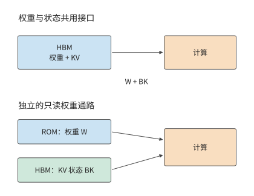

*图 4-23　独立只读权重改变两条存储路径。上方权重与 KV 争用 HBM；下方 ROM 提供权重，HBM 保留可写状态。箭头表示读取，KV 还需写入新状态。*

## 4.7 根据架构分析性能、选择设备

我们已经逐步给最初的投影补上执行粒度、局部复用、缓冲、依赖和传输路径。现在将这些因素合成时间模型，找到资源改动的转折点，再用测量解释实际执行，最后比较完成同一任务的成本与能耗。

### 4.7.1 从计算量与访问量估算执行时间

执行时间来自两种关系：同一硬件单元要依次执行哪些操作，后一项工作要等哪些结果。前者决定各单元需要工作多久，后者决定各步骤的执行顺序。

先看共享资源。同一矩阵单元处理两类各 1 G 次操作的工作，速率分别为 100 和 200 Gops/s，就分别占用 10 ms 和 5 ms，共 15 ms。第 $i$ 类工作在资源 $r$ 上的工作量为 $w_{r,i}$，对应速率为 $p_{r,i}$，则该硬件单元完成这些操作所需的时间为

$$
T_r=\sum_i\frac{w_{r,i}}{p_{r,i}}.
$$

权重与 KV 共用内存接口时，它们的流量相加；QK 与 PV 共用矩阵单元时，它们的计算时间相加。这些工作即使分布在不同算子中，也消耗同一份硬件能力。

再看独立资源。矩阵和搬运能够同时推进时，总执行时间至少等于耗时最长的单元完成全部操作所需的时间，所以 $T\ge\max_r T_r$。第 4.2 节的稳态分析采用了这一关系：指数没有加快时，矩阵单元提前完成后便会空闲，块的完成节奏仍由指数决定。

最后加入依赖。设第一阶段矩阵需 10 μs、内存需 1 μs，第二阶段矩阵需 1 μs、内存需 10 μs；每阶段内部可重叠，第二阶段要等第一阶段完整结束。于是第一阶段用 10 μs，第二阶段也用 10 μs，共 20 μs。只把资源总量汇总，会得到矩阵与内存各 11 μs；差出的 9 μs 来自阶段依赖：第一阶段的矩阵计算与第二阶段的内存访问必须先后进行，无法重叠。[^stage]

输入流水给出了同样的例子：四块共需 256 tick 输入传输、512 tick 计算，而首块在 192 才就绪，所以最早完成时间为 704 tick。三个槽可以按前面的时间表完成计算，两个槽则因第三块晚到又增加 64 tick。计算量和传输量决定各步骤耗时，数据依赖与缓冲容量决定各步骤何时开始。

矩阵单元的运算速率还与输入和累加精度有关。RTX 4090 的 Tensor Core 执行稠密矩阵运算时的峰值，FP16（每元素 2 字节的半精度浮点格式）输入与 FP16 累加约为 330 TFLOP/s，FP32 累加约为 165 TFLOP/s；本章 BF16／FP32 投影采用 165.2 TFLOP/s。[^hardware] 对 8.59 GFLOPs，两个速率分别对应约 26 和 52 μs。后面算出的读取时间约为 37 μs，速率选择会直接改变计算与读取的大小关系。因此，速率应从执行路径确定：先知道矩阵单元实际处理的格式，再用对应的操作吞吐计算时间。

由此可以把建模分成三步：先确定实际执行的操作，再把占用同一硬件单元的耗时相加，最后按数据依赖安排执行顺序。接下来先对最初的 Q 投影应用前两步，观察 batch 怎样改变资源配比。

### 4.7.2 Roofline 与负载变化

设矩阵峰值为 $P$，片外带宽为 $R$，投影工作量与访问量分别为 $F$、$V$。计算与数据传输所需的时间分别为 $F/P$ 和 $V/R$。计算与访问充分重叠时，较大者决定时间下界，对应 Roofline（屋顶线）模型的吞吐上界为

$$
P_{\mathrm{attainable}}\le\min(P,RI),\qquad I=F/V.
$$

这里的斜线 $RI$ 描述带宽能够支撑多少运算，水平线 $P$ 描述矩阵单元能够完成多少运算。两者在 $I^*=P/R$ 相交。低于交点时，数据来得慢；高于交点时，每字节已对应足够多运算，计算速度成为新的瓶颈。

沿用第 4.1 节输入与权重读一次、输出写一次的投影，RTX 4090 在 BF16 输入、FP32 累加时的矩阵运算峰值为 165.2 TFLOP/s，带宽为 1.008 TB/s。将同一组 $F$ 和 $V$ 代入，得到：[^projection]

| 本次处理的 token 数 $M$ | 矩阵计算时间 | 片外数据传输时间 | 两项耗时的最大值 | 主导资源 |
| --- | ---: | ---: | ---: | --- |
| $M=1$ | 约 0.20 μs | 约 33.3 μs | 约 33.3 μs | 内存 |
| $M=256$ | 约 52 μs | 约 37.4 μs | 约 52 μs | 矩阵 |

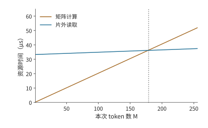

*图 4-24　同一 Q 投影的计算与访存耗时随输入行数的变化。计算量按行数增长，片外访问同时包含固定权重和增长的输入输出；从 179 行起计算项较长。*

图 4-24 中，计算时间随行数成比例增加，数据传输时间却只有缓慢增长，因为 32 MiB 权重始终只读一次。曲线交点左侧，等待数据占主要时间；右侧，每次读入的数据已经支持足够多运算，矩阵计算成为较慢的一项。

单行调用每字节只做约一次浮点操作，数据传输时间远长于矩阵计算时间。256 行共同使用权重，强度增至约 228 FLOPs/byte，计算反而超过读取。整次调用时间增大，但每行分摊的下界降至约 0.20 μs：一次处理更多工作换来了更高吞吐。

还可以求出转折发生在哪个行数。令 $d=4096$，第 4.1 节的强度可写成 $I(M)=Md/(d+2M)$。令它等于 $I^*=P/R$，得到

$$
M^*=\frac{I^*d}{d-2I^*}.
$$

代入未舍入速率，$I^*\approx164$ FLOPs/byte，$M^*\approx178.1$。因此从整数行数 179 起，矩阵计算时间超过数据传输时间。转折点把“较大 batch 更适合矩阵单元”变成了可以计算的行数阈值。[^pipeline-extra]

提高一种资源会移动这个边界。$M=1$ 时，带宽翻倍使时间下界从 33.3 降至约 16.7 μs，矩阵能力翻倍则仍由读取决定。$M=256$ 时，矩阵能力翻倍把计算从 52 降至 26 μs，但读取仍需 37.4 μs，所以新下界为 37.4 μs；带宽单独翻倍，52 μs 的计算仍然保留。当两项耗时相等后，只加快其中一项就无法继续降低总时间下界。

上下文长度以不同方式改变投影和注意力。全注意力 prefill 的序列长度翻倍，投影行数与计算量翻倍，而分数矩阵的行、列都翻倍，QK/PV 工作增至四倍。单步 decode 的当前投影行数由请求数决定，上下文变长则增加 KV 读取。随着上下文增长，同一层中，注意力计算和 KV 读取所占的时间比例也会增加。

> **实验 4-5 · 核心：batch 与架构性能**
>
> 推导并画出 Q 投影从 1 到 256 行的算术强度，分别将矩阵计算吞吐率、内存带宽提高到原来的两倍，求计算时间与读取时间相等时的输入行数。随后把注意力与专家矩阵加入资源表，解释上下文和专家行数分布怎样改变耗时最长的单元。选择两个具体设备，将相同任务放入各自资源模型比较。

这个模型已经明确指出了复用的作用。下一节考察运行库实际执行的计算，观察同一权重的复用究竟发生在片外、缓存还是局部计算之中。

### 4.7.3 预测与实测为什么有差距

运行库为数学算子选择具体的计算内核：小矩阵可能采用 GEMV，大矩阵可能分块并合并部分结果；权重可能从 DRAM 读取，也可能由缓存提供。测量的用途是识别这些路径，把第 4.7.1 节中的工作、资源与依赖补全。

配套实验在 M2 Max 与 RTX PRO 6000 Blackwell Workstation 上运行相同的 $K=N=4096$ 投影，输入、权重、输出为 BF16。为改变权重访问记录，在每台设备上准备 16 份内容相同、地址不同的 32 MiB 权重。复用组始终使用同一地址，轮换组依次使用不同地址。每轮执行 16 次调用，记录包括主机提交与同步在内的整轮耗时，再除以 16，得到该轮每次调用的平均耗时。共运行 11 轮，取这 11 个平均值的中位数。[^measurement]

| 本次处理的 token 数 $M$ | M2 Max：复用／轮换 | RTX PRO 6000：复用／轮换 |
| --- | ---: | ---: |
| $M=1$ | 约 166／183 μs | 约 42.9／51.9 μs |
| $M=256$ | 均约 1.835 ms | 约 32.6／33.5 μs |

先看 RTX 单行：轮换比复用约慢 21%。一个自然解释是重复使用同一份权重使其留在缓存中，减少了 DRAM 读取。这个解释可以直接检验：若少读权重是差别来源，复用条件应出现更少的片外字节。实验另用 NVIDIA 的 GPU 内核性能分析工具 Nsight Compute，先按指定方式访问权重，再记录一次待测调用，汇总全部内核的访问计数。

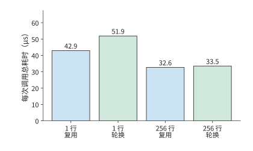

*图 4-25　RTX PRO 6000 的投影总耗时。每个条件测十一轮、每轮十六次调用，取每轮平均耗时的中位数；计时包含提交与同步。*

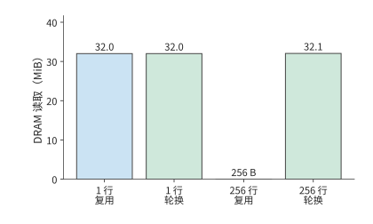

*图 4-26　相同四个条件下另行采集的 DRAM 读取计数。单行均约 32 MiB，256 行复用为 256 bytes、轮换约 32.1 MiB。访问计数与常规计时分别测量。*

单行在两种权重访问方式下的 DRAM 读取都是约 32 MiB，恰好对应整份权重的规模。两种条件读取了相同规模的片外权重，单行的时间差需要沿提交、执行与等待进一步定位。256 行则呈现另一种情况：此前重复使用同一份权重时只读 256 bytes，此前轮换使用不同权重副本时约读 32.1 MiB，但常规计时都在 33 μs 左右。缓存改变了片外流量，而调用总时间还包含其他计算、传输与等待。

第 4.3 节区分的存储层次在这里变得可见。256 行的两种权重访问方式都有约 147 MiB L2 请求，远大于近乎为零的那次 DRAM 读取。缓存命中意味着由片上提供数据，计算单元的读取请求和局部传输仍然存在。源程序中的同一权重，在分块执行后可以被多个计算块反复请求。

片上请求解释了为什么 DRAM 读取减少后仍有数据访问。接着看计算：库是否把一次投影拆成了更多步骤？单行调用使用一个 GEMV 内核；256 行使用 GEMM 加 split-K 归约两个内核。split-K 把内积维度上的计算交给多个计算块，先形成部分输出，再由归约合并。这样能让更多计算块并行执行，但也需要保存和读取部分结果，并在最后进行归约。因而第 4.1 节的一次数学乘法，在这里展开成多个阶段。

再按 RTX PRO 6000 的参数估算输入和权重均从片外读取时的执行时间：BF16 输入、FP32 累加的稠密矩阵运算峰值约 504 TFLOP/s、带宽 1.792 TB/s，两种行数的下界约为 18.7 和 21.1 μs。模型给出矩阵计算与片外读取所需的时间，计数器揭示缓存后的流量，内核路径解释额外的合并工作；总耗时还包含提交、同步与执行间隙。结合这些信息，才能逐步解释实际耗时与估算值之间的差距。[^paired]

要进一步定位差距，可以把“忙了多久”与“忙时完成得多快”分开。设某硬件单元按理想速率完成全部操作需时 $S_r$，实际处于工作状态的时间为 $A_r$，任务总时间为 $T$，则

$$
\frac{S_r}{T}=\frac{S_r}{A_r}\times\frac{A_r}{T}.
$$

前一项表示工作时的实际速率与理想速率之比，后一项表示工作时间占总时间的比例。两个任务都耗时 100 μs，理想计算时间也都是 40 μs。执行第一个任务时，该单元只工作了 40 μs，工作时达到理想速率，但其余 60 μs 都在等待；执行第二个任务时，该单元工作了 80 μs，速率只有理想值的一半，等待时间则只有 20 μs。两者整体比值都是 40%，对应的优化方向却不同。

第一个任务更需要提前准备数据、安排更多相互独立的计算，或减少等待前一步结果的时间，类似第 4.4 节两槽到三槽的改动；第二个任务更需要改善执行粒度、指令与局部访问，类似第 4.2 节补齐浪费和分组调用的分析。[^nonmatrix] 由此，可以用执行记录逐项核对性能模型：比较各步骤的预计耗时与实际耗时，再找出差距来自计算效率还是等待。

> **实验 4-6 · 延伸：Mac 与 RTX 的预测和测量**
>
> 根据投影在两种设备上的实测总耗时，提出两个能够解释耗时差异的原因，再读取 DRAM、L2 与内核记录，为每个解释列出预期现象和实际现象。随后画出 256 行调用的矩阵、部分结果与归约路径，指出需要哪些阶段时间才能区分计算单元工作时的执行效率与等待时间。将所得结果与假设输入和权重均从片外读取的模型对照。

### 4.7.4 在容量、速度、功耗与成本之间做选择

架构选择最终面对的是完成任务的代价。容量决定请求能否驻留，完成时间决定能否达到服务目标；在可行方案之间，再比较每任务成本与能耗。前面的资源模型负责解释时间从哪里来，这一节把时间换算成经济结果。

设两台整机的小时成本为 $c_A,c_B$，完成同一任务的运行时间为 $t_A,t_B$。按运行时间计费时，每任务成本与 $ct$ 成正比，因此

$$
K_A<K_B\quad\Longleftrightarrow\quad\frac{c_A}{c_B}<\frac{t_B}{t_A}.
$$

右侧给出了每小时成本可以相差多少倍：如果 A 的速度是 B 的两倍，那么 A 每小时的成本低于 B 的两倍时，每个任务仍然更便宜。上一节复用组中，Mac／RTX 时间比分别约为 3.9（单行）和 56（256 行）。假设 RTX 整机小时成本是 Mac 的十倍，按运行时间计费，单行调用的成本为 Mac 的约 $10/3.9\approx2.6$ 倍；256 行调用则为约 $10/56\approx0.18$，节省约 82%。同一组设备和成本，矩阵尺寸改变了哪种设备更便宜的结论。[^paired]

长期运行的服务还要计算空闲期间的成本。设一台机器处理请求时每秒生成 $q$ 个有效 token，每小时有 $u$ 的时间在处理请求，则每小时产出为 $3600uq$，每 token 成本为 $c/(3600uq)$。生成速度翻倍而利用率减半，每小时产出不变，单位成本也不变。因此，速度更快的设备是否更经济，还要看是否有足够多的请求使用它。

能耗同样由功率与时间共同决定。设系统 A 平均 200 W、运行 2 s，任务耗能 400 J；系统 B 平均 300 W、运行 1 s，耗能为 300 J。功率增加 50%，每任务能耗反而减少 25%。一般形式为

$$
E=\int_0^T P(t)\,dt.
$$

对长期服务，统计一段时间内的总耗电量，再除以这段时间的有效产出，就能把空闲和预热期间的耗电一并计入。缩短运行时间可以减少执行任务时的耗电，提高利用率则能减少每个任务分摊的空闲耗电。

专用化另有固定投入。设相对通用方案增加的固定成本为 $F_0$，每个有效输出节省可变成本 $\Delta c$，回本量为

$$
V^*=\frac{F_0}{\Delta c}.
$$

模型会被更新或替换，因此专用设备能用于该模型的时间有限。设有 $D$ 台设备，每台处理请求时的生成速率为 $q$，利用率为 $u$，模型可用时间为 $L$，总产出为 $DuqL$。这段时间内节省的运行成本达到固定投入后，专用方案才算回本。

> **例 4-3：专用化能否在模型寿命内回本？**
>
> **给定固定投入、单次节省与模型可用时间** 增量固定成本为 2,000 万美元，每百万合格输出 token 节省 0.50 美元。部署 100 台，每台处理请求时产出 10,000 token/s，利用率 50%，模型经济寿命一年，每年按 365 天计算。
>
> **比较回本所需输出量与一年可完成的输出量** 回本量为 $20\,000\,000/(0.50/10^6)=4\times10^{13}$ token，即 40 万亿。一年产出为 $100\times10\,000\times0.5\times31\,536\,000\approx1.58\times10^{13}$ token，即约 15.8 万亿。
>
> **满足回本目标需要多少设备与请求需求？** 一年产出约为回本量的 39%。在单机速率与利用率保持不变时，至少需要 254 台按上述速率和利用率运行一年，并有足够多的请求使用这些设备。
>
> **模型寿命减半或利用率下降后的回本规模** 模型半年更换，每台可用时间减半，设备与需求规模要增至至少 508 台；若利用率从 50% 降至 25%，也产生相同结果。

这个算例说明，能否回本既取决于每个任务能省多少钱，也取决于模型被替换之前能完成多少任务。只有模型使用时间足够长、实际需求足够多，才能积累足够的节省来收回固定投入。[^opentallas] 这与芯片内部的资源取舍遵循相同原则：比较增加资源以后，目标任务实际减少的代价。

> **实验 4-7 · 延伸：负载变化与芯片资源分配**
>
> 选择一种架构和一种典型负载，提出一次资源改动。先用工作量、流量和依赖推导时间变化，再计算增加的容量及减少的等待。随后改变 batch 或上下文，寻找原有改动失去收益的位置。若方案需要额外固定投入，再求单位节省、利用率和寿命共同决定的回本边界。

[^qwen]: Qwen3-8B 固定配置、张量索引与模型实现见[模型配置](../calculations/configs/models/qwen3-8b/config.json)及[投影计算结果](../calculations/results/projection-qwen3-8b-rtx4090-b256.md)。

[^projection]: [Q 投影，RTX 4090，M=1](../calculations/results/projection-qwen3-8b-rtx4090-b1.md)；[M=256](../calculations/results/projection-qwen3-8b-rtx4090-b256.md)。

[^architecture]: [加速器架构与执行比较](../case-studies/accelerator-architecture.md)。

[^tpu]: Jouppi 等，*In-Datacenter Performance Analysis of a Tensor Processing Unit*，ISCA 2017，[归档论文](../references/files/papers/tpu-v1.pdf)。

[^nvidia]: [A100 架构白皮书](../references/files/specs/nvidia-a100.pdf)、[H100 架构白皮书](../references/files/specs/nvidia-h100.pdf)、[Hopper Tuning Guide](../references/files/documents/nvidia-hopper-tuning.md)、[Blackwell 技术简报](../references/files/specs/nvidia-blackwell-brief.pdf)与[CUTLASS Blackwell 功能](../references/outline-checks/2026-09-07/systems-cases/cutlass-blackwell.md)。

[^ascend]: [昇腾 950 官方架构白皮书](../references/files/specs/ascend-950-official.pdf)，§4.1—4.1.6；早期 DaVinci 与 CANN 分离架构的页级定位见[比较笔记](../case-studies/accelerator-architecture.md)。

[^nonmatrix]: [从算子利用率到执行中的等待](../case-studies/component-utilization-and-overlap.md)及[论文阅读记录](../references/proceedings/ASPLOS/2025/ascend-components-reading.json)。

[^apple]: [M2 Pro／Max 官方规格](../references/files/specs/apple-m2-pro-max.md)、[Apple GPU 架构说明](../references/files/documents/apple-gpu-architecture.md)、[Metal 存储模式](../references/files/documents/apple-metal-memory.json)、[M5 GPU Neural Accelerator 官方说明](../references/outline-checks/2026-09-07/systems-cases/apple-m5-evolution.md)。

[^fa4]: *FlashAttention-4*，MLSys 2026，[论文](../references/proceedings/MLSys/2026/papers/mlsys2026-ae8b0b5838ba510daff1198474e7b984.pdf)，§2.2、§3.1.1、公式 1—3 与表 1；[单 SM 独立复算](../calculations/results/fa4-qwen8-resource-balance.md)。

[^precision]: [硬件精度审查](../calculations/HARDWARE-AUDIT.md)、[DeepSeek V4-Flash 与 Qwen 逐阶段资源条件](../calculations/research/stage-resource-bounds/README.md)、[低精度与执行路径调研](../case-studies/kernel-orchestration-and-quantization.md)。硬件演进与成本归因的采用范围另见[成本下降调研](../research/token-cost-2023-2026/report.md)。

[^quant-exp]: [实验 4-2](../experiments/ch04/04-02/README.md)、[真实路由激活](../experiments/ch04/04-02/routed-activations/README.md)、[128 元素分组](../experiments/ch04/04-02/block-scales/README.md)、[单专家模型内替换](../experiments/ch04/04-02/model-intervention/README.md)。

[^workspace]: [实验 4-2 分配器峰值](../experiments/ch04/04-02/workspace/README.md)。

[^capacity]: [Qwen3-8B 配置](../calculations/configs/models/qwen3-8b/config.json)；[存储代际完整结果](../calculations/results/storage-generation-qwen8-235.md)。

[^evolution]: [从负载变化理解芯片演进](../case-studies/architecture-evolution.md)。

[^storage]: [存储代际比较结果](../calculations/results/storage-generation-qwen8-235.md)及[计算说明](../calculations/research/storage-generation-comparison/README.md)。

[^mess]: *Mess*，MICRO 2024，[作者接受稿](../references/proceedings/MICRO/2024/paper-011.pdf)，选读物理页 3—6；[访存并发算例及限制](../case-studies/memory-bandwidth-and-concurrency.md)。

[^coordinates]: [DeepSeek V4-Flash 共享专家搬运坐标结果](../calculations/results/v4-copy-coordinates-m32.md)与[源级计数说明](../calculations/research/v4-copy-coordinates/README.md)。

[^transfer]: [Hopper Tuning Guide](../references/files/documents/nvidia-hopper-tuning.md)、[昇腾 950 白皮书](../references/files/specs/ascend-950-official.pdf)、[Rubin 官方架构说明](../references/outline-checks/2026-09-07/systems-cases/rubin-rechecked.md)。

[^pipeline]: [Qwen 注意力输入流水基线](../calculations/results/attention-input-base.md)、[矩阵速率翻倍](../calculations/results/attention-input-matrix-double.md)、[建模与独立检查](../calculations/research/attention-input-pipeline/README.md)。

[^handoff]: [矩阵—向量交接说明](../calculations/research/matrix-vector-handoff/README.md)、[32 行两槽直接路径](../calculations/results/matrix-vector-direct-rows32-slots2.md)。

[^package]: [Blackwell 技术简报](../references/files/specs/nvidia-blackwell-brief.pdf)、[CloudMatrix384 v2](../references/files/papers/cloudmatrix384-v2.pdf)，§3.3.1 与 §4.2.2、[Vera Rubin 平台](../references/files/specs/nvidia-rubin-system.md)、[UB 与昇腾核对](../references/UB-ASCEND-NOTES.md)。

[^tpu8]: [Inside the Eighth-Generation TPU: An Architecture Deep Dive](../references/files/specs/google-tpu8.md)。

[^special]: [Groq TSP 论文](../references/files/papers/groq-tsp.pdf)、[IPU Programming Model](../references/files/documents/graphcore-programming.md)、[Cerebras WSE-3 数据表](../references/files/specs/cerebras-wse3-spec.pdf)、[SambaNova SN40L 论文](../references/files/papers/sambanova-sn40l-paper.pdf)。

[^author]: [作者材料与技术判断](../case-studies/author-context-and-design.md)。

[^opentallas]: [OpenTallas 案例](../case-studies/opentallas.md)。

[^stage]: [逐阶段资源界建模说明](../calculations/research/stage-resource-bounds/README.md)；实际模型算子范围见[Qwen3-8B prefill128 资源结果](../calculations/results/stage-resources-qwen8-b1-prefill128.md)。

[^hardware]: [硬件来源与精度审查](../calculations/HARDWARE-AUDIT.md)及[官方基础表](../calculations/results/hardware.md)。

[^measurement]: [实验 4-6 全部说明与原始记录](../experiments/ch04/04-06/README.md)、[投影计时汇总](../experiments/ch04/04-06/results/projection-summary.json)、[实际 DRAM／L2 计数](../experiments/ch04/04-06/results/projection-traffic.json)。

[^paired]: [配对投影成本与平均功率条件](../calculations/results/paired-projection-unknown.md)。

[^host]: 主机、DMA 与统一地址的术语见 [CUDA Programming Guide](https://docs.nvidia.com/cuda/cuda-programming-guide/)。

[^pipeline-extra]: 本次补充的三槽流水、计算翻倍变体及设计转折点由[教学推导脚本](ch04/derive.py)生成，完整时序见[推导数据](ch04/teaching-data.json)。

[^feedback]: [DeepSeek V3 技术报告](../references/text/deepseek-v3.txt)第 3.5 节，Suggestions on Hardware Design。

[^core-calculation]: 本章新增条件比较的[逐项复算](../calculations/results/core-principles.json)与[计算程序](../calculations/core_principles.py)。

[^v41-case]: [DeepSeek V4.1 官方技术报告](../calculations/sources/deepseek-v4.1-flash/DeepSeek_V41_Tech_Report.pdf)，第 1、2、3 节与第 6 节；[跨章会话的固定条件与复算](../calculations/results/v41-throughline.json)。架构、格式和部署机制按报告区分，教学时间假设不作实测。

## 本章小结

模型的长期运行需求推动硬件专用化，新硬件又改变不同模型方案的运行成本。固定权重实验把这一关系具体化：ROM 减轻权重通路与 HBM 容量压力，可写状态、计算和互联仍会限制性能，更新权重时还需要相应调整部署方式。

本章从一个 Q 投影出发，分析了计算量、数据读写量和硬件性能怎样共同决定执行时间。同一份权重被更多输入行使用，可以减少每行分摊的读取量；矩阵尺寸与指令要求不一致时，补零又会增加无用计算。数据保存在片外、缓存还是局部缓冲中，决定了读取代价；缓冲容量和数据依赖则决定各步骤何时能够开始。

分析一个新设计时，可以先从计算图中列出运算和需要保存的数据，再把使用同一硬件单元的耗时相加，最后安排满足数据依赖的执行顺序。耗时最长的单元限制吞吐率，必须先后执行的步骤决定完成时间的下界，缓冲容量则限制能够同时准备多少组数据。三槽达到 704 tick 的例子说明，算出时间下界后，还需要找到能够实现它的执行安排，才能确定至少要配置多少缓冲。

不同优化改变的是不同的代价：局部复用减少重复读取，异步搬运让传输与计算重叠，合理分配多芯片任务减少远距离访问，专用化则省去部分通用处理。某一项改进取得足够收益后，瓶颈会转移：矩阵计算加快以后，读取开始占主导；缓冲已经能让所有数据按时到达，继续增加容量便不再缩短执行时间；权重读取减少以后，KV 成为主要流量。设计取舍要围绕这些变化，比较下一项投入还能省下多少时间。

实际测量让我们看到运行库怎样使用硬件。缓存计数显示数据从哪里取得，内核记录显示一个算子被分成哪些步骤，硬件单元的工作时间则帮助区分计算效率低和等待过多。第五章将进一步研究布局、融合和调度如何改善这些具体步骤。
