# 第 5 章 算子与运行时

同一份输入，刚用于一个输出，接着又要用于旁边的输出：如果它还留在计算单元附近，下一次就可以直接使用；如果已经被换走，就要重新搬来。矩阵乘法的程序需要安排这些使用次序，并给输入和部分和留下合适的空间。仅仅改变一次处理多少输出、先算哪一块，就会改变重复搬运的次数，以及能够同时执行的任务数。

本章的矩阵乘算例需要约 103 GFLOPs 的运算，输入、权重和输出总共占 128 MiB，一种分块实现的读写量却达到约 3 GiB。扩大输出块可以让输入多用几次、使读写量减半，但每个块的局部存储需求也从 24 KiB 增至 80 KiB。这些数字将帮助我们判断，减少搬运带来的收益，能否抵消同时执行的块数减少所带来的性能损失。

第四章介绍了加速器的计算能力、存储容量和数据传输带宽。本章讨论程序如何利用这些资源。我们以一段前馈网络（FFN）为例，先说明主机如何发起计算、加速器如何完成任务，再分析矩阵乘的循环与分块，以及相邻算子如何共享中间结果。随后讨论编译器和运行时如何实现这些优化，最后计算这些优化能让完整请求节省多少时间。

本章主要使用 Qwen3-8B 的 FFN 作为算例：隐藏宽度 $H=4096$，FFN 中间宽度 $F=12288$。先同时处理 $M=1024$ 个 token，将它们各自的 4096 维特征向量排成输入矩阵 X，计算一支投影 $C=XW$；X、W 和 C 使用 BF16，每个元素占 2 bytes，矩阵乘使用 FP32 累加。M 表示一次调用处理的 token 数，每个 token 对应输入矩阵的一行。这些 token 可以来自 prefill 的一段输入，也可以来自同一批中的多个请求；单请求逐 token decode 时，M 为 1。[^model]

| 对象 | 形状 | 大小 | 在计算中的作用 |
| --- | --- | ---: | --- |
| 输入 X | $[1024,4096]$ | 8 MiB | 每个 token 的特征向量占一行，投影后得到该 token 的新特征向量 |
| 权重 W | $[4096,12288]$ | 96 MiB | 由 1024 个 token 的投影计算共享 |
| 投影 C | $[1024,12288]$ | 24 MiB | 随后进行激活等处理 |

本章围绕三个问题展开：哪些工作在重复执行，哪些数据能够复用，哪些计算或等待决定了总时间。加速器内核（kernel）是在加速器上执行的程序。分析读写量、缓冲容量和内核数，可以了解程序做了多少工作；再结合这些工作的执行顺序，才能计算程序需要多长时间。

## 5.1 加速器执行过程中的提交、搬运与同步

先考虑输入和输出都在 CPU 内存中的矩阵乘。CPU 准备输入，将它送入 GPU，发起计算，再取回结果。这一过程需要两个处理器协作。理解它们何时独立执行、何时等待对方，是后续融合、流水和图重放的基础。

### 5.1.1 从框架调用到 kernel launch

PyTorch 是表达张量运算并组织模型执行的软件框架。调用它的矩阵乘法时，CPU 首先执行框架代码：读取张量形状和数据类型，选择实现，准备地址和参数，再通过运行时与驱动向 GPU 提交任务。向加速器发起一次内核执行称为 **kernel launch（内核启动）**。运行时负责提交任务、管理内存和同步执行；编译器则事先或在首次调用时生成加速器代码。

这里有三个层次。**算子**描述数学工作，例如矩阵乘和激活；**kernel** 是加速器上执行的程序；**launch** 是 CPU 发起这次执行的动作。一个矩阵乘可以通过多个 kernel 完成，几个逐元素算子也可以由同一个 kernel 完成。因此，既可以优化加速器上的计算，也可以减少主机准备和提交任务的开销。

CUDA 是 NVIDIA GPU 的编程与运行环境。它执行一个 kernel 时会启动多个线程。若干线程组成一个线程块（thread block），所有线程块组成一个线程网格（grid）。矩阵乘通常把输出矩阵分成多个数据块（tile），交给不同线程块计算，块内线程协作读取输入并累加结果。流式多处理器（SM）是 GPU 内组织线程执行、矩阵计算与局部存储的硬件单元。加速器将线程块安排到有可用资源的 SM 上。较早完成的块释放资源，后续块便可开始；因此，grid 中的线程块可以分批执行。

kernel launch 采用异步提交。调用返回时，CPU 已完成这次提交，GPU 则按照任务队列和依赖关系执行。CPU 可以立即准备下一项任务。只有在 CPU 需要加速器结果，或准备覆盖仍被加速器使用的数据时，CPU 才需要等待相应的加速器操作完成。[^execution]

这种分工形成一条简单流水：CPU 准备并提交任务，GPU 执行任务。大矩阵计算持续较久，CPU 有时间准备下一次调用；小算子很快结束，GPU 更容易执行完队列中的任务，停下来等待 CPU 提交下一项。因此，可以从两方面加速：减少加速器等待主机的时间，以及缩短 kernel 本身的执行时间。

### 5.1.2 主机与加速器之间的数据复制

CPU 能够提前提交下一项任务，加速器却只有在输入到达后才能计算。先分析数据的传输过程，就能看清提交任务后、开始计算前还需要完成哪些工作。Host 指主机，Device 指设备，在本节中具体指 GPU 加速器。对具有独立显存的 GPU，常见复制方向有三种：

| 名称 | 复制方向 | 典型对象 |
| --- | --- | --- |
| H2D（Host to Device） | 主机内存 → 显存 | 当前批次的输入张量 |
| D2H（Device to Host） | 显存 → 主机内存 | CPU 要使用的计算结果 |
| D2D（Device to Device） | 显存 → 显存 | 固定输入缓冲或重排结果 |

上述矩阵乘的执行过程是：

> CPU 准备输入 → H2D → GPU 计算 → D2H → CPU 使用结果。

运行完整模型时，并非每次调用都要重新传入所有数据。权重加载后可以一直保留在显存中，层间激活可以由下一个内核直接读取，KV 也可以在后续 decode 步中继续使用。如果采样在 GPU 上完成，CPU 只需接收少量 token ID，即输出词元在词表中的整数编号。因此，主机与加速器之间的复制次数，与加速器内部的读取次数并不相同：一份权重可以只传入一次，却在加速器上读取很多次。

**例 5-1：主机到 GPU 的输入传输需要多久？** 一个 $[8192,4096]$ 的 BF16 张量占 $8192\times4096\times2=64$ MiB。取 H2D 有效单向带宽为 24 GiB/s，传输时间为：

$$
T_{\mathrm{H2D}}=\frac{64\ \mathrm{MiB}}{24\ \mathrm{GiB/s}}\approx2.6\ \mathrm{ms}.
$$

将输入分成两份 32 MiB 张量，每份约需 1.3 ms，总传输量保持不变。这样做的好处是第一份数据可以更早到达：GPU 开始计算前半批时，复制引擎继续传送后半批。5.3 节将进一步计算传输与计算重叠后的总时间。[^buffer]

主机内存的类型也影响复制过程。普通内存的页面由操作系统管理；**锁页内存（pinned memory）**在使用期间保持驻留，便于加速器直接搬运。从普通内存传输数据时，运行时常先将数据复制到内部的锁页缓冲：CPU 先复制一遍，再由加速器读取。若每批都把 64 MiB 数据复制进新建的锁页缓冲，就在 H2D 之前多做了一次主机复制。让 CPU 直接在可复用的锁页缓冲中准备输入，可以省去这次中转和反复分配。[^execution]

### 5.1.3 stream、event 与完成顺序

数据传到哪里，决定哪个处理器能够使用它；数据何时传完，则决定后续计算何时能够开始。异步调用返回后，复制可能仍在进行，需要用执行顺序保证计算不会读到尚未传完的输入。CUDA 的 **stream（流）**是一串按顺序执行的加速器任务。把 H2D 和读取该输入的 kernel 放在同一 stream 中，计算就排在复制之后；CPU 可以连续提交两项工作。

若复制和计算放在不同 stream 中，就用 **event（事件）**指定跨流的执行顺序。复制流在 H2D 后记录事件，计算流等待事件，再使用这份输入。等待发生在计算流的加速器任务序列中，CPU 仍可继续提交其他工作。

事件也可以用来确定缓冲何时能够再次使用。设当前输入从主机缓冲复制到 GPU 的缓冲槽 A。复制完成后，CPU 就可以往主机缓冲写入下一批输入；槽 A 则要等 GPU 用完当前输入后才能覆盖。两块缓冲虽然保存同一批数据，却要在不同的时刻才能重新使用。

| 缓冲 | 最后使用者 | 随后的动作 |
| --- | --- | --- |
| H2D 的主机源缓冲 | 复制引擎读取 | CPU 写入下一批输入 |
| GPU 输入缓冲 | 读取该输入的 kernel | 复制引擎写入下一批输入 |
| D2H 的加速器源缓冲 | 复制引擎读取 | GPU 写入新结果 |
| D2H 的主机目标缓冲 | 复制引擎写入 | CPU 读取当前结果 |

因此，应在最后一次读写之后记录事件，让随后使用这块缓冲的操作等待该事件。CPU 需要 D2H 结果时，可以等待对应事件；其他无关的加速器任务继续运行。5.3 节的双缓冲正是把两套这样的使用顺序交错起来。

### 5.1.4 从提交时间到结果可用时间

把复制、计算和缓冲使用的顺序连起来，才能确定结果何时可用。图 5-1 将这一顺序画成时间线。

**例 5-2：为什么提交耗时、加速器耗时与完整调用耗时不同？** 输入已在主机准备好。CPU 在 0–3 μs 内提交全部任务，第一项加速器工作从 3 μs 开始；H2D、kernel、D2H 分别用 8、20、4 μs，加速器按依赖连续执行。

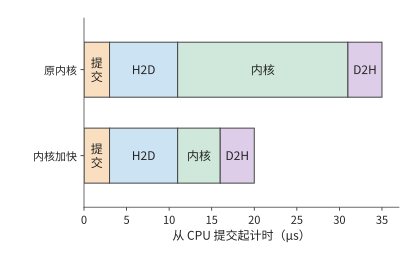

*图 5-1：CPU 提交、H2D 输入复制、加速器内核与 D2H 结果返回依次发生。上方内核执行二十微秒，结果在第三十五微秒可用；下方内核执行五微秒，结果在第二十微秒可用。*

CPU 提交任务用时 3 μs，kernel 执行用时 20 μs，CPU 到第 35 μs 才能使用结果。若把 kernel 的执行时间从 20 μs 缩短到 5 μs，结果就能在 $3+8+5+4=20$ μs 时使用。内核速度提高到原来的四倍，整次执行则从 35 μs 降至 20 μs，加速比约为 1.8；剩余 15 μs 由提交和复制构成。

计时结果取决于在什么位置开始和结束计时。在异步调用前后读取 CPU 时钟，测得提交所用的时间；若在结束计时前等待结果，则测得从发起到完成的时间。CUDA event 在加速器任务序列中标出起止位置，测得加速器执行这段任务所用的时间。性能分析工具（profiler）将主机调用、加速器计算和复制画在同一时间线上，使提交之后的排队、依赖等待和执行可以逐段辨认。

前面的时间线从输入准备好开始。若程序尚未编译，时间线之前还要加上一次准备工作：首次调用可能需要编译代码或分配工作区。假设首次编译用 100 ms，随后每次执行 1 ms，调用一次共 101 ms，调用 100 次共 200 ms，平均每次 2 ms。调用次数越多，平均分担的编译时间越少，而每次执行所需的 1 ms 保持不变。在 5.5 节，我们将用同一方法判断分桶和特化需要重复多少次才值得。

现在可以分别分析复制、计算和准备工作了：它们各自需要多少时间，哪些可以重叠，哪些只需执行一次。下面先从一次矩阵乘出发，分析加速器内部的数据访问。

## 5.2 单个算子的分块、布局与实际访存

大矩阵计算可以像切豆腐一样分块：先分成适合处理的小块，再逐块完成。不过，切成什么形状，要同时看计算单元能处理什么，以及它附近能放下多少数据。第四章已经说明，硬件矩阵指令支持有限的形状；整张加速器上的多个计算单元可以同时处理许多块，每份工作内部仍要组织成硬件能够执行的小步。

分块还要让搬来的数据多用几次。沿用第四章的工作台比喻，当前输入和尚未算完的部分和要放在计算单元附近，用完才能腾出空间。输出块太小，同一份输入可能为不同输出块反复搬运；块太大，又会占用更多局部存储，挤掉其他可以同时执行的任务。下面先跟踪一个输出需要哪些数据，再把多个输出组织成块，分析块大小、访问顺序和局部容量怎样共同影响复用。

### 5.2.1 矩阵形状与重复读取

以下用 A 表示章首的输入 X，投影写作 $C=AW$，其中 $M=1024,K=4096,N=12288$。A、W、C 采用 BF16（每个元素占 2 bytes 的 16 位浮点格式），大小分别为 8、96、24 MiB。若 A、W 各读一次，C 写一次，只需传输 128 MiB。为何一种分块实现会产生约 3 GiB 的访问？先看一个输出怎样算出来。

计算 C[i,j] 时，取 A 的第 i 行和 W 的第 j 列，将对应元素相乘，再沿 K 维求和。接着计算右边的 C[i,j+1]，W 换成相邻一列，A 却仍是同一行。图中两次计算的蓝色部分完全相同。

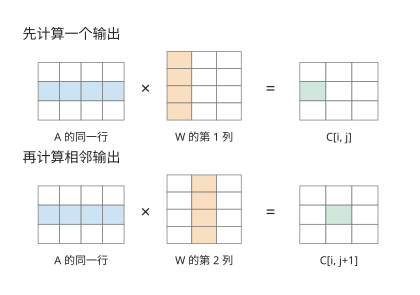

*图 5-2：先算一个输出，再算相邻输出。蓝色表示所用的 A 行，橙色表示所用的 W 列，绿色表示本次得到的输出元素。图中矩阵缩小为示意尺寸，实际算例的 K 为 4096。*

如果这行 A 在两次使用之间仍留在局部存储或缓存中，就能直接复用；若已被替换，就需要再次向下一级存储请求数据。转到下一行输出时，W 中的元素也会再次使用。同一份数据在数学运算中需要反复使用。程序怎样安排这些运算，决定了这份数据要经过存储接口多少次。

本节以工作缓冲和下一级存储之间的接口为计数位置，累计程序每次读入与写出的字节数。后面约 3 GiB 的访问量，也按这一接口计算。[^tiles]

把图中的逐元素计算写成循环，就是：

```python
for i in range(M):
    for j in range(N):
        acc = 0.0
        for k in range(K):
            acc += A[i, k] * W[k, j]
        C[i, j] = acc
```

内层 k 循环每执行完一遍，得到一个输出。一次乘加计两个 FLOPs，计算全部输出所需的运算量为：

$$
F_{\mathrm{gemm}}=2MKN\approx103\ \mathrm{GFLOPs}.
$$

作为比较基准，三份 BF16 矩阵各经过接口一次的读写量为：

$$
V_{\mathrm{once}}=2(MK+KN+MN)=(8+96+24)\ \mathrm{MiB}=128\ \mathrm{MiB}.
$$

其中 MiB 为 $2^{20}$ bytes。以各输入读一次、输出写一次为基准，后面就能计算分块增加了多少重复访问。

循环顺序还决定每次访问的地址。W 按行连续存储时，上面的内层循环依次读取 W[k,j]、W[k+1,j]，地址相差 N 个元素。若改成 i、k、j 的顺序，内层便依次读取 W[k,j]、W[k,j+1]，同时将 A[i,k] 用于多个输出。这样一次连续传输取得的数据能立即参与计算。

不过，新顺序也要同时保存一段输出的累加结果。若这些结果放不进局部存储，每轮更新都可能增加对下一级存储的读写。接下来用分块限制同时保留的数据量，让输入复用与输出保存相互配合。

### 5.2.2 容量约束下的分块复用

先选 C 的一小块作为当前要完成的输出，为这个 $m\times n$ 输出块分配累加缓冲区。每次沿 K 维读入一对输入块：A 块为 $m\times k$，W 块为 $k\times n$。它们相乘，更新同一份输出累加器；换入下一对输入块时，已经得到的部分和继续保留。直到沿 K 完成全部累加，才把结果转为 BF16 并写出。这里安排的是软件为复用数据而组织的块，其内部还可以分解为多次硬件矩阵指令。分块本身不要求先把原矩阵复制成许多独立的小矩阵，具体搬运由执行程序安排。

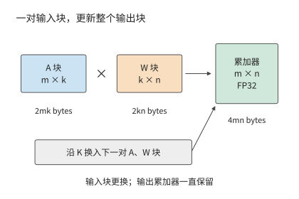

*图 5-3：固定当前 m×n 输出块，沿 K 依次搬入对应的 A、W 块，反复更新同一份部分和，全部累加结束后才写回。A、W 输入为 BF16，累加器为 FP32（每个元素占 4 bytes 的 32 位浮点格式）。图示为软件分块，一次块乘可包含多次硬件矩阵指令；尺寸符号表示形状，方框面积不按字节数缩放。*

A 块中的一个元素可以用于 n 列输出，W 块中的一个元素可以用于 m 行输出。扩大输出块，就能让一次读入的数据参与更多乘加；同时也要保存更多输入和输出部分和。

**例 5-3：扩大矩阵输出块能减少多少输入读取？** 图中的 A 输入块、W 权重块和输出累加器分别占 $2mk$、$2kn$ 和 $4mn$ bytes。只使用一组输入缓冲时，局部存储需求为：

$$
S=\underbrace{2mk}_{A\text{ 块}}+\underbrace{2kn}_{W\text{ 块}}+\underbrace{4mn}_{\text{累加器}}\quad\mathrm{bytes}.
$$

取 $k=32$，先用 64×64 输出块。A 块和 W 块各占 4 KiB，累加器占 16 KiB，合计 24 KiB。把输出块扩大到 128×128 后，两份输入各占 8 KiB，累加器占 64 KiB，合计增至 80 KiB。输入复用增多，输出累加器也增长得更快。

接着计算全矩阵的读写。假设每个输出块独立读取自己的输入，不考虑不同输出块之间的缓存复用。N 方向有 N/n 个列块，每个列块都要遍历 A；M 方向有 M/m 个行块，每个行块都要遍历 W。最终 C 只写出一次，因此：

$$
V=\underbrace{2MK\frac{N}{n}}_{A\text{ 的重复读取}}+\underbrace{2KN\frac{M}{m}}_{W\text{ 的重复读取}}+\underbrace{2MN}_{C\text{ 写出}}.
$$

64×64 输出块将输出划为 16 个行块、192 个列块。192 个列块各读一遍 8 MiB 的 A，共 1536 MiB；16 个行块各读一遍 96 MiB 的 W，也是 1536 MiB。加上 24 MiB 输出，总量为 3096 MiB。这就是本节开头约 3 GiB 的来源。

改成 128×128 后，行块数从 16 减到 8，列块数从 192 减到 96，两份输入的读取均减半。输出大小不变，总量降至 $768+768+24=1560$ MiB。图 5-4 把这项收益与占用的局部存储放在一起比较。

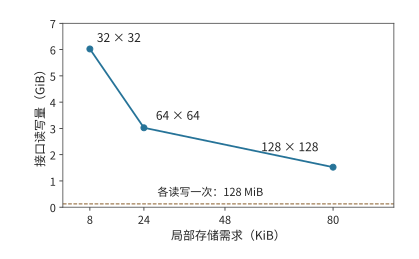

*图 5-4：每个点标出输出块形状。扩大输出块能减少跨接口的重复读取，但需要更多局部存储。虚线为三份矩阵各经过一次的 128 MiB；比较条件为 k=32、单组输入缓冲、各输出块独立读取输入。*

完整数值如下，算术强度用同一矩阵乘的 FLOPs 除以上述接口字节数计算：

| 输出块 | 局部存储需求 | 工作缓冲与下一级存储之间的访问 | 算术强度 |
| --- | ---: | ---: | ---: |
| 32×32 | 8 KiB | 6168 MiB | 15.9 FLOP/byte |
| 64×64 | 24 KiB | 3096 MiB | 31.7 FLOP/byte |
| 128×128 | 80 KiB | 1560 MiB | 63.0 FLOP/byte |

访问量接近减半，时间是否也会减半？还要看加速器能同时安排多少工作。GPU 的输入缓冲与累加器分别受共享内存和寄存器容量约束。这里先用一个合并预算的容量模型：每个线程块（一组协作执行、可共享局部数据的 GPU 线程）负责一个输出块，把输入缓冲与累加器合并计算，所有工作集共用 96 KiB 的局部存储预算。

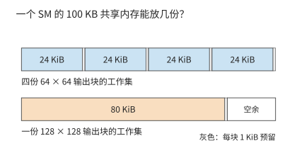

*图 5-5：条形总长均表示 96 KiB。24 KiB 的工作集能放四份，80 KiB 的只能放一份。*

同时驻留的线程块可以交错发起访存：一些块等待数据时，另一些块继续工作。同时驻留的工作集从四份减为一份，可能减少在等待访存期间执行其他计算的机会。因此，大块虽然少读数据，实际获得的带宽却可能下降。

假设两种实现都受这一层的带宽限制，有效带宽分别为 $B_{64}$ 和 $B_{128}$，则：

$$
\frac{T_{128}}{T_{64}}=\frac{1560}{3096}\frac{B_{64}}{B_{128}}.
$$

若带宽相同，时间接近减半；若大块只能获得原来四成的带宽，时间比约为 $0.504/0.4=1.26$，耗时反而增加约 26%。可以先按容量排除放不下的方案，再按访问量缩小比较范围，最后测量实际执行效率。5.4 节将把这一过程交给编译器。

### 5.2.3 数据布局与归约方式对并行执行的影响

上一小节中，大块虽然少读数据，却可能因并行度下降而变慢。并行度不仅取决于驻留多少线程块，也取决于这些线程发出的读取请求能否同时得到服务。先看局部存储的布局。考虑一个 32×32 的 FP32 暂存块，分成 32 个可独立服务读取请求的存储体，称为 bank，每个 bank 每轮提供一个 32-bit 字，bank 号为字地址对 32 取模。这里将同时执行的一组线程中的各个位置称为 lane；32 个 lane 各读取同一行中的一个字时，请求分散到 32 个 bank；读一列时，行跨度为 32 个字，所有地址集中到同一 bank，需要 32 轮。

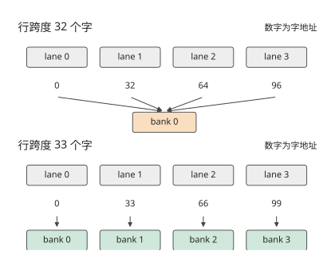

*图 5-6：同一列的 32 个不同字由 32 个 lane 同时请求。上半图行跨度为 32 个字，请求集中到同一 bank；下半图补齐为 33 个字，请求分散到 32 个 bank。图中画出前四个请求；假设每个 bank 每轮提供一个 32-bit 字，不计广播。*

在每行末尾补一个字，行跨度变为 33。同一列相邻行的 bank 号便依次加一，32 次请求分散到 32 个 bank，一轮即可完成。所占空间由 4096 bytes 增至 4224 bytes，只多约 3.1%。有效数据和读取次数都没有变化，但原本需要分 32 轮完成的列读取，现在可以在一轮内完成。

这种在行末增加填充元素的做法称为 padding（填充）。它让已有的并行请求分散到不同 bank。但如果程序本来就只安排了少量任务，改变地址布局还不够，还要把计算拆开。RMSNorm（均方根归一化）先根据一行元素的均方值计算共同的缩放因子，再缩放这一行。将多个元素合并为一个统计量的操作称为归约，它正好说明这种情况：一行的缩放因子来自整行平方和，随后每个元素乘以这个因子和对应的可学习参数 gamma。对 $[1024,4096]$ BF16 输入，一组处理一行，可以独立安排 1024 组；对单请求每次生成一个 token 的解码步骤（decode），同一种分配只产生一组，加速器的大量执行资源会空闲。

把每行分成八个 512 元素片段，可以增加第一阶段的并行任务。完整归约随之变成三个阶段：每个片段产生局部平方和，合并八个局部和得到行缩放因子，再用该因子归一化输入。前两阶段只需传递很少的数，但最后一阶段要重新读取原始数据。

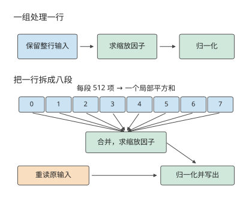

*图 5-7：上行由一组处理完整一行，输入保留到归一化结束；下行把一行分为八段，先求局部和，再合并，最后重读输入并归一化。每行 4096 个 BF16 元素；图中仅画一行，推广到 1024 行时，第一阶段任务数由 1024 增至 8192。橙色框表示增加的原输入读取。*

沿着图 5-7 的箭头计数，就能求出增加并行任务所付出的访存代价。仍取 1024 个 token，每个 token 的特征向量占输入矩阵的一行。第一阶段的并行任务从 1024 组增到 8192 组；8192 个 FP32 局部和占 32 KiB，1024 个 FP32 缩放因子占 4 KiB。一组一行的程序在局部保留输入，读入 8 MiB 输入，每行再读取一份 BF16 gamma，累计 8 MiB，最后写出 8 MiB 结果，总访问量为 $8+8+8=24$ MiB。拆分后，最后的归一化阶段重读 8 MiB 输入；局部和、缩放因子的写出与读取再增加约 0.1 MiB，总量为 32.1 MiB，kernel 启动次数从一次增至三次。[^reduction]

图中每组只处理一行的八分之一，还带来另一项收益：需要保存的临时数据随之减少。以 FP32 保存完整一行需要 16 KiB，保存其中八分之一只需 2 KiB。原来因寄存器不足而写入较远存储的临时数据，可以因此保留在寄存器中。并行任务数增加与每组临时数据减少，是拆分归约获得收益的两个具体来源；增加的输入读取和阶段间数据传递则构成额外开销。

矩阵分块、bank padding 和归约拆分都在重新安排同一批数学工作。分块让多个输出复用输入，padding 将读取请求分散到不同 bank，拆分归约则增加能够并行执行的任务。分析程序的耗时时，可以分别检查这些变化带来了多少收益和开销。配套实验中的连续访问与宽行归约对照提供了对应的执行记录。[^exp1]

## 5.3 相邻算子的融合、缓冲与流水执行

单算子内部可以利用局部存储复用输入。相邻算子之间也有同样的机会：前一个算子的输出，往往立即成为后一个算子的输入。如果后一个算子能直接读取局部存储中的结果，就能省去一次写回和重读。为此，需要确定后一个算子要用哪些数据，以及这些数据何时全部算好。

### 5.3.1 中间张量与融合边界

下面将算例扩展到前馈网络（FFN）的两支投影。令 $G=XW_g$、$U=XW_u$，激活链计算 $Z=\operatorname{SiLU}(G)\odot U$，再将 Z 交给降回隐藏维度的 down 投影。G、U、Z 的形状均为 $[1024,12288]$，以 BF16 保存时各占 24 MiB。

这里 SiLU 是激活函数，$\operatorname{SiLU}(x)=x/(1+e^{-x})$；符号 $\odot$ 表示对应位置的元素相乘。SiLU 和乘法都是逐元素运算。Z[i,j] 只依赖 G[i,j] 与 U[i,j]，不同位置之间没有归约。因此，读入同一位置的两个元素后，就能直接算出该位置的最终结果，而无需先生成全部 SiLU 结果。

先比较中间结果 T 的去向。分开执行时，完整 T 要写到下一级存储，再被乘法读回；融合后，一小块 SiLU 结果可以直接交给同一 GPU 内核程序（kernel）中的乘法，用完就释放局部空间。这就像把工作台上刚处理好的材料直接交给下一道工序，省去送回远处再取出的往返。对应到这里，省去的是中间结果的写回与重读，两步运算仍然都要完成。

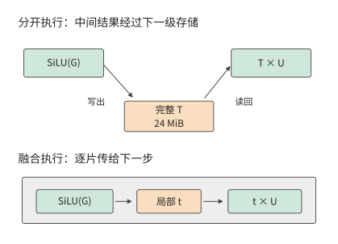

*图 5-8：上半图的完整 T 经过一次写出与一次读回；下半图中局部片段 t 直接传给乘法。两种方式仍读取 G、U 并写出 Z，图中省略这些共同的输入输出边。融合后仍保留原有的中间结果舍入规则。*

**例 5-4：激活算子融合如何减少中间张量读写？** 分开执行时，先计算 $T=\operatorname{SiLU}(G)$，读取 G、写出 T，共 48 MiB；再计算 $Z=T\odot U$，读取 T、U，写出 Z，共 72 MiB。总读写量为 120 MiB。将两步融合，每次读取 G、U 的一片，在局部完成 SiLU 和乘法，写出 Z，只需 72 MiB。

省下的 48 MiB 正是 T 的一次写回和一次读取。沿用上一节的带宽模型，取两种程序的有效带宽相同，时间比为 $72/120=0.6$，加速约 1.7 倍。实际激活链对照从约 14.2 μs 降到 7.7 μs，加速比约为 1.8。理论计算与实测结果都说明了同一个收益来源：省去完整 T 的写回和重读。[^exp2]

接下来将 Z 按固定尺度量化，使每个元素只占 1 byte。独立转换需读取 24 MiB 的 Z，写出 12 MiB 量化结果，增加 36 MiB。三步完全分开的总量为 156 MiB；融合前两步为 108 MiB；三步全部融合为 $24+24+12=60$ MiB。图 5-9 将必需的输入输出读写画在每条柱形的左侧，再依次加上两个中间量的读写。

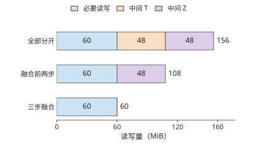

*图 5-9：每少保存一个 24 MiB 中间量，就少一次写出和一次读入，共 48 MiB。G、U 为 BF16，最终输出占 1 byte/元素，量化尺度预先给定。各方案采用相同的运算与舍入顺序。*

中间张量的容量与访问量在这里具有不同含义。设每步先分配输出，完成后释放已用完的输入。独立执行 SiLU 时，G、U、T 同时占用内存，峰值为 72 MiB；三步融合时，G、U 与最终输出同时占用内存，峰值为 60 MiB。读写减少 96 MiB，峰值却只减少 12 MiB，因为同一块存储空间可以被反复读写。[^fusion]

逐元素运算的每个输出只依赖对应位置的输入，因此可以在读入后立即计算，减少中间结果的保存。要让这种复用顺利发生，还得让前后两步使用彼此兼容的数据布局，并保证缓冲在最后一次读取结束前不会被覆盖。下面沿着一个数据块的使用过程，分析这两个条件。

### 5.3.2 布局转换、缓冲复用与双缓冲

相邻算子有时使用不同布局。前一个算子适合按行写出，后一个算子却需要按另一种块顺序读取。若另建一份 24 MiB 重排结果，就要读原结果、写新结果，共 48 MiB。也可以让前一个算子直接按后续计算所需的布局写出，省去单独的重排。比较“计算后再重排”与“计算时直接按新布局写出”的总时间，就能判断哪种方式更快。

缓冲还决定两个阶段能否重叠执行。设搬运器把块 0 放入槽 A，计算单元随后读取 A。在 A 被读取期间，搬运器将块 1 放入槽 B；计算转向 B 后，便可将块 2 加载到 A。这样，两个槽交替使用，使计算单元读取当前块时，搬运器可以写入下一块。

注意，槽 A 的“数据已经搬完”与“数据已经用完”是两个时刻。搬运结束后，计算才开始读取；只有最后一次读取结束，才能将下一块数据写入槽 A，覆盖原有内容。取每块搬运 2 μs、计算 3 μs，搬运器和计算单元独立工作。先看三个时段中各槽位的状态，再据此画出完整的搬运与计算时间线。

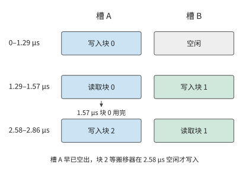

*图 5-10：块 0 在 2–5 μs 使用槽 A，所以块 2 到 5 μs 才能开始写入 A。图中抽取三个时段；4–5 μs 的块 1 已在槽 B 中等待，尚未开始计算。颜色固定表示槽 A、B，文字说明当前读写的是哪个块。*

**例 5-5：双缓冲如何重叠数据搬运与计算？** 每块搬运 2 μs，计算 3 μs。搬运器和计算单元独立工作，事件开销记为零。串行执行四块需要 $4\times(2+3)=20$ μs。

采用两个槽后，0–2 μs 搬入块 0，2–5 μs 计算块 0；块 1 在 2–4 μs 搬入，5 μs 时已经就绪。此后每隔 3 μs 完成一块。块 2 在 5 μs 才开始写槽 A，因为此前计算仍在读块 0；块 3 同理在 8 μs 开始写槽 B。第四块于 14 μs 完成，时间减少 30%。

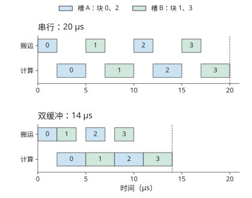

*图 5-11：两个输入槽交替复用，让搬运与计算重叠。每块搬运 2 μs、计算 3 μs，资源独立，忽略同步开销；同一颜色表示同一槽，计算读取结束后才能再次写入。*

将四块推广到 n 块。首块要先搬运，随后每隔较慢阶段所需的时间完成一块，末块还需完成计算。因此：

$$
T_{\mathrm{pipe}}=t_m+(n-1)\max(t_m,t_c)+t_c.
$$

其中 $t_m$ 为每块搬运时间，$t_c$ 为每块计算时间。在刚才的例子中，首块搬运后，计算单元连续忙了 12 μs，总时间已是 $2+4\times3=14$ μs。增加第三个槽可以让后续数据更早搬入，却无法让计算单元每 3 μs 完成一块的速度再提高。此时要继续缩短时间，应缩短每块的计算时间，而不是继续增加输入缓冲。

当两阶段访问顺序不同，缓冲需要保存更多尚未使用的数据。三个排队的 16 KiB 块占 48 KiB，再加 32 KiB 重排空间，共需 80 KiB。若预算只有 64 KiB，写入第三块之前，必须等待计算单元用完并释放一个槽。这种下游来不及处理、使上游暂停的机制称为**背压（backpressure）**。选择共同布局能够减少排队，扩大缓冲则能容纳更多已经写入但尚未使用的数据。[^buffer]

5.1 节的主机输入也可以按此组织。这里的流（stream）是按提交顺序执行操作的队列，事件（event）用于标记进度，让另一条流等待指定操作完成。复制流传入下一批，计算流处理当前批；计算流等待“复制完成”事件后读取新输入，复制流等待“计算完成”事件后覆盖旧缓冲。这两种事件分别保证输入已准备好和旧数据已用完，时间收益则来自两种资源同时工作。

### 5.3.3 FlashAttention：分块与在线 Softmax

计算一行注意力输出时，可以先把各位置的分数变成尚未归一化的权重，用这些权重对值求加权和，最后除以权重总和。可以先处理一块，记下它对加权和与权重总和的贡献，再处理下一块；只要能正确合并贡献，就不必一直保留已处理过的全部分数。困难在于 Softmax 要根据分数求指数，后面出现更大的分数时，还要调整前面累计结果所用的数值基准。

FlashAttention 围绕这一逐块计算过程安排存储，减少长序列注意力中间矩阵的显存读写。它由斯坦福大学的 Tri Dao 等研究者与纽约州立大学布法罗分校的合作者于 2022 年提出。[^fa]

读到 FlashAttention 时，我想起了自己在 2019 年做 AKG 的一段经历。当时为了融合 softmax 算子，我四处寻找合适的在线算法，后来找到 NVIDIA 在 2018 年发表的研究，才得以结合 AKG 的分块与融合能力，把前面的矩阵乘法和后面的 softmax 接在一起计算。我那时甚至还不了解 Attention，后来才意识到，自己偶然摸到了 FlashAttention 的一条核心思路。从这一步走到完整的 FlashAttention，还需要把后续与 V 的加权求和也纳入在线更新，并围绕完整注意力安排片内存储和数据搬运。下面的推导会说明，这个看似局部的算法变化怎样消除大块中间矩阵。

其中 Q 是查询向量，K 是供查询匹配的键向量，V 是最终按权重汇总的值向量。Softmax 将一行分数转换为总和为 1 的权重。标准注意力先计算 $S=QK^\mathsf{T}/\sqrt d$，再计算 $P=\operatorname{softmax}(S)$，最后计算 $O=PV$。同一输出依赖整行分数，当前块之后的贡献也要计入，因此逐块处理需要能够正确合并各块结果的归约方法。

把这三个运算分别交给通用算子，可以直接按公式组合程序，算子之间通过中间张量交换结果。掌握完整注意力计算的数据依赖后，便可以采用另一种编译与执行方式：利用 Softmax 的归约关系，跨过独立算子的边界，在小块数据上连续计算。下面先算出原来完整保存中间张量的开销，再推导逐块计算所需保存的状态。

取一个头，序列长度 $L=8192$，头维度 $d=128$，对全部位置计算注意力。Q、K、V、O 使用 BF16，各占 2 MiB；完整 S、P 使用 FP32，各占 256 MiB。Q、K、V 各读一次，O 写一次，共 8 MiB；S、P 各写一次、读一次，却要传输 1 GiB 数据。中间矩阵的大小随序列长度的平方增长，因而造成了大量读写。[^attention]

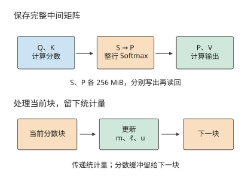

*图 5-12：上半图保存完整 S、P，两份 FP32 矩阵各占 256 MiB，写出与读回合计 1 GiB。下半图只传递已处理部分的最大值 m、指数和 ℓ、加权值 u；每处理完一个块，其分数缓冲即可复用。箭头概括处理顺序，完整计算还需读入 Q、K、V。*

直接套用逐元素融合会遇到一个障碍：Softmax 的分母是整行指数和。只读到前一块时，既不知道最终分母，也不知道后面是否会出现更大的分数。要在处理完一个块后丢弃其中的分数，就需要保留几个统计量，使后续计算仍能计入这个块对结果的贡献。

要丢弃已经处理过的分数，需要保留三个量：最大分数 m，以 m 为基准的指数和 $\ell$，以及相同指数权重下的值之和 u。这里 u 通常是向量，先用标量值的小例子看清更新过程。

**例 5-6：在线 Softmax 如何合并分块结果并保持归一化？** 分数为 $[0,\ln2]$，对应值为 $[1,3]$，每块只含一个元素。第一块得到 $m=0,\ell=1,u=1$。处理第二块后，最大值增至 $\ln2$，将原来的 $\ell$ 和 u 都乘以 $r=1/2$；新元素的指数为 1，于是 $\ell'=1/2+1=1.5$，$u'=1/2+3=3.5$，结果为 $7/3$。一次处理整行时，两个权重正比于 1 和 2，结果同样为 $(1+2\times3)/3=7/3$。

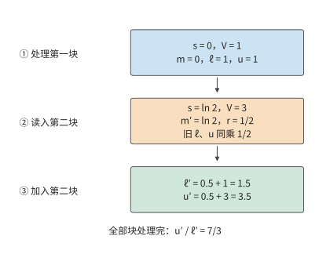

*图 5-13：两个块的分数分别为 0、ln 2，值分别为 1、3。最大值增大后，将旧指数和与旧加权值同时乘以 1/2，再加上新块的贡献，最后才做除法。箭头传递的是统计量，旧分数无需保留。*

小例子中，第二块把最大值从 0 提高到 ln 2。旧项原来的指数为 1，换到新基准后变成 1/2；分母中的旧贡献和分子中的旧贡献必须同时缩小，才能保持它们的相对权重不变。

推广到一行分数，减去共同最大值可避免指数溢出。令 $\ell=\sum_j\exp(s_j-m)$、$u=\sum_j\exp(s_j-m)V_j$，最终输出为 $u/\ell$。新块到来后，把旧状态改到新的最大值基准，再加上新块贡献：

$$
m'=\max(m,\max(s)),\qquad r=\exp(m-m'),\qquad p_j=\exp(s_j-m'),
$$

$$
\ell'=r\ell+\sum_jp_j,\qquad u'=ru+\sum_jp_jV_j.
$$

右侧求和只遍历新块中的 j，旧块的全部贡献已经保存在 $\ell$ 与 u 中，无需重新读回旧分数。

FlashAttention 正是利用这一递推关系省去了完整 S 和 P 的存储。每处理完一块，就更新 m、$\ell$ 和 u；该块的分数和概率用完即可丢弃，其缓冲可以留给下一块。旧块对输出的贡献已经进入统计量，后续无需读回旧分数。在相同注意力范围内，该算的查询与键的匹配、值的加权仍然要做；改变的是计算顺序与中间结果的保存方式，浮点执行还会有舍入差异。

图 5-13 中，旧块留下的是三个统计量，分数缓冲可以反复使用。这样就把存储完整分数矩阵的问题，变成了在快速存储中安排当前块的问题。接下来要确定：一次处理多少行 Q、多少行 K/V，才能更好地利用这块空间。设快速缓冲为 128 KiB，一次保留 a 行 Q 与 FP32 输出累加器，分数块大小为 a×b。K 与 V 按阶段复用同一个 b×d 输入槽，分数和概率复用一个 a×b 槽，另为逐行统计和更新暂存分配三个 FP32 向量。局部存储需求为：

$$
S=\underbrace{2ad}_{Q}+\underbrace{2bd}_{K/V\text{ 槽}}+\underbrace{4ab}_{\text{分数/概率}}+\underbrace{4ad}_{\text{输出累加器}}+\underbrace{12a}_{\text{逐行状态}}\le131072.
$$

K/V 块越小，它自身和分数块占用越少，就能放下更多 Q 行。更多 Q 行共享一次 K/V 扫描，整份 K/V 被重读的次数随之减少。取 b=64，能放下 a=110 行 Q，需要 $\lceil8192/110\rceil=75$ 次完整扫描。每次读 4 MiB 的 K/V，另有一次 Q 读取和 O 写回，共 $75\times4+4=304$ MiB。

将 b 缩为 1，能放下 a=166 行 Q，扫描次数降为 50，访问量降至 $50\times4+4=204$ MiB。但每次扫描从 128 个 K/V 块变成 8192 个块，在线状态必须更频繁地更新。

| K/V 块行数 b | 可容纳的 Q 行数 a | K/V 完整扫描次数 | 缓冲与下一级存储之间的访问 | Q 块与 K/V 块之间的状态更新次数 |
| --- | ---: | ---: | ---: | ---: |
| 1 | 166 | 50 | 204 MiB | 409600 |
| 64 | 110 | 75 | 304 MiB | 9600 |
| 128 | 76 | 108 | 436 MiB | 6912 |

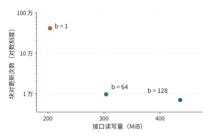

*图 5-14：快速缓冲为 128 KiB，序列长 8192、头维度 128，无掩码；每个点对应正文表格的一种 K/V 块大小。横轴为缓冲与下一级存储之间的访问量，纵轴为在线更新次数，采用对数刻度。从 b=64 的点移到 b=1 的点，读取减少，更新次数却约增至 43 倍。*

图 5-14 把两项代价放在同一平面上，越靠左表示少读数据，越靠下表示少做更新。从 64 行块缩到 1 行块，少读 100 MiB，却把状态更新从 9600 次增至 409600 次，约为原来的 43 倍。每次更新都要执行循环控制、最大值比较、指数与输出缩放；每次只处理一行 K/V，也使矩阵乘的一个维度过小，难以充分利用矩阵计算单元。较小的 K/V 块能减少读取，却会增加更新次数；较大的块则有利于矩阵计算，并减少循环开销。因此，选择块大小时，需要同时比较这两类开销。

在线归约消除了完整中间矩阵的读写，但块内的矩阵乘、指数计算和统计量更新仍要执行。后续优化便转向这些剩余工作。FlashAttention-2 改进了线程之间的任务分配，减少中间数据交换和非矩阵运算；FlashAttention-3 利用异步执行，使搬运、矩阵乘和 Softmax 重叠进行。省去巨大的中间矩阵之后，这些改进进一步缩短了剩余的计算和搬运时间。[^fa]

为了检验这些机制在实际程序中的效果，配套实验比较了 PyTorch 中同一个注意力接口的两种执行实现。这里的**后端（backend）**，指框架在接口内部实际选用的计算程序：调用者给出相同的 Q、K、V，框架可以用不同程序完成注意力计算。

**数学后端（`SDPBackend.MATH`）**按注意力公式组合矩阵乘、Softmax 等通用运算，保存完整的分数和概率中间矩阵。**FlashAttention 后端（`SDPBackend.FLASH_ATTENTION`）**采用前面介绍的分块与在线归约方法，避免保存完整的中间矩阵。实验分别指定这两个后端，比较它们完成同一次注意力计算的时间与新增显存。

实验在 RTX PRO 6000 Blackwell 上进行，输入输出为 BF16，一次处理一个序列、一个注意力头，头维度为 128。序列长为 8192 token，每个 token 对应序列中的一个输入位置；采用因果注意力，即每个位置只使用自身及此前的位置。预热后，使用 CUDA Graph 将一组 GPU 操作预先记录并重复执行，以减少逐次由主机提交的干扰。按每次注意力计算统计，保存完整中间矩阵的数学实现约需 2.6 ms，采用分块与在线归约的 FlashAttention 实现约需 80 μs，后者的加速比约为 33。[^exp3]

再比较一次普通调用的新增显存占用峰值。输入 Q、K、V 预先驻留显存，计量范围为输出与临时工作区：数学实现约为 848 MiB，FlashAttention 实现约为 22 MiB。

这组完整实现的对照展示了分块、在线归约和融合如何配合：分块让当前数据放得进快速存储，在线归约使 Softmax 可以逐块计算，融合省去块内中间结果的写回。三者共同改变了执行时间与中间存储需求。

## 5.4 编译器：表达、变换与选择

前两节通过手工分析选择了循环、块大小、缓冲和算子边界。实际模型会使用多种输入形状和算子组合，每种加速器也有不同的存储层级和执行资源。编译器的任务，是用程序表示这些实现方式，根据依赖关系排除错误的变换，再比较其余实现的执行开销。

### 5.4.1 为什么要比较多种实现

回顾逐元素链：SiLU 对每个数执行非线性变换，再与另一输入对应相乘，最后量化成低位宽表示。两处相邻算子之间，都可以选择分开执行或融合执行，共有四种划分：三步独立、融合前两步、融合后两步、三步融合。如果一条链包含十个算子，就有 $2^9=512$ 种相邻边界划分。每一种划分还可以选择块大小、局部布局和流水深度。

这些选择会相互影响。合并两步可以消除中间写回，也会增加同一时刻需要保存的值；临时数据增多，又会改变能够采用的块大小。因而，编译器要同时表达计算内容、执行顺序和数据保存位置。只记录一个算子名，无法推导这些代价。

编译器可以按三个步骤选择实现。首先，把数学运算表示为循环和数组访问，明确可以变换的循环及其读写关系；其次，根据读写依赖和数值规则检查合法性；最后，结合容量和实测时间比较执行成本。下面先用可读的循环展示前两步，再看自动算子代码生成系统 AKG 怎样通过多面体编译组织整个过程。

### 5.4.2 用循环变换表达分块与融合

前面决定了每次处理多大一块，现在还要决定这些块按什么顺序计算。同样切好的数据，如果刚用过就换走，过一会儿又要重新搬回来，仍然会产生不必要的访问。循环变换让程序表达这些安排：split 将循环拆成“第几块”和“块内第几个位置”；reorder 调整遍历顺序，让即将再次使用的数据有机会留在局部存储中。再选择在哪一层循环保存或使用中间结果，就能明确它要留下多久。

取 $Y=\operatorname{SiLU}(AW)$，沿用 $M=1024,K=4096,N=12288$，矩阵乘用 FP32 累加，结果舍入为 BF16 后再激活。最直接的程序先生成完整 C，再遍历 C 生成 Y：

```python
for i in range(M):
    for j in range(N):
        acc = 0.0
        for k in range(K):
            acc += A[i, k] * W[k, j]
        C[i, j] = round_to_bf16(acc)

for i in range(M):
    for j in range(N):
        Y[i, j] = silu(C[i, j])
```

第一项变换是 **split（拆分）**。把 i 拆成块号 $i_o$ 与块内坐标 $i_i$，令 $i=64i_o+i_i$。原来的 1024 行就成为 16 个块，每块 64 行。对 j 同样处理，得到 192 个列块。同时拆分两个输出维度，就形成 64×64 的 **tile（分块）**。

拆分首先改变了索引的表示方式。要连续完成一个 tile，还需要 **reorder（重排）**：在外层循环中遍历输出块，在内层循环中遍历块内元素。再把 K 按 32 拆成 128 个归约块。程序先选定一个输出 tile，逐块加载所需 A、W，累加到同一个输出块中。

采用这种循环结构后，就能确定输入块需要保留多久。A、W 的当前块各占 4 KiB，在一次归约块计算后即可替换；4096 个 FP32 累加器占 16 KiB，要一直保留到全部 128 次归约块计算结束。因此，两类缓冲应在不同的循环层分配和释放。

最后调整激活的**计算位置**。一个输出 tile 完成全部 K 归约后，其 4096 个 C 值已经全部算好，可以立即做 SiLU 并写出 Y；其他输出 tile 尚未完成也不影响这一片结果。这样只需在局部保存当前输出块的结果，省去完整 24 MiB 的 C，也就省去了 48 MiB 写回与重读。

```python
for io in range(ceil_div(M, BM)):
    for jo in range(ceil_div(N, BN)):
        acc = zeros_fp32(BM, BN)
        for ko in range(ceil_div(K, BK)):
            a = load_tile(A, io, ko, BM, BK)
            w = load_tile(W, ko, jo, BK, BN)
            matmul_accumulate(acc, a, w)
        c = round_to_bf16(acc)
        store_tile(Y, io, jo, silu(c))
```

这里 `load_tile` 和 `matmul_accumulate` 分别表示成块读取和矩阵累加；最后一个不足整块的数据块用掩码标出有效位置。伪代码的缩进清楚地标出了这些先后关系：输入块在 ko 循环内更新，累加器在整个 ko 循环期间持续保存，激活计算在 ko 循环结束后执行。

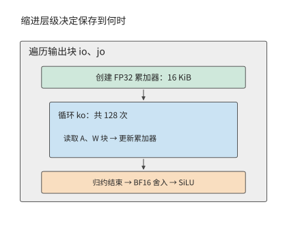

*图 5-15：循环层次决定临时数据需要保存多久。外层选输出块，创建十六 KiB 累加器；内层 ko 反复读取 A、W 块，全部归约结束后再舍入并计算激活函数。*

Halide 是将运算定义与执行调度分离的编程系统，把“计算什么”和“如何调度”分开，程序员用 split、tile、reorder 等动作改变执行方式。这里把生成中间结果的算子称为生产者，使用该结果的算子称为消费者。`compute_at` 指定生产者在消费者的哪一层循环内执行。TVM 是面向张量计算的编译系统，也通过调度指定计算位置和缓存读写，让相邻算子在同一块数据上连续计算。[^schedule]

计算位置同时决定复用和重算。把生成中间结果的计算放在最外层，会先算出完整结果，供所有后续计算读取；放到后续计算的分块循环内，就只算当前需要的部分。如果多个输出块需要同一部分中间结果，在每个块内计算就会造成重复。编译器因此要比较两种做法：先保存中间结果供多次读取，或在每次使用前重新计算。

循环中的 `fuse` 还可以把多个迭代维合成一个维度。例如，可以将 16×192 个输出块的二维坐标转换为 0 到 3071 的一维编号，再分配给加速器工作组。这改变了遍历输出块和分配任务的方式；将 SiLU 紧接到矩阵乘 tile 后面，则省去了中间矩阵的写回和重读。两者可以在同一份调度中组合使用。

### 5.4.3 依赖与舍入怎样限制变换

刚才把激活移入输出 tile，但仍安排在 ko 循环结束后执行，原因可以用两个数说明。设一个输出的两个部分和为 1 与 −1，完整和为 0，SiLU(0)=0。若在每个部分和之后先做 SiLU，再相加，结果为 $\operatorname{SiLU}(1)+\operatorname{SiLU}(-1)\approx0.4621$。把激活计算移到完整求和之前，已经改变了运算。

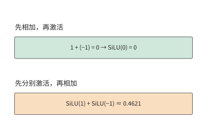

*图 5-16：同样两个部分和，先相加得到零，再做 SiLU 仍为零；先对各部分做 SiLU 再相加，得到约 0.4621。两个数说明把激活计算移到求和之前会改变结果。*

编译器需要遵守的依赖关系因此有两个层次：同一输出的部分和要按归约规则合并，后续算子要等所需的结果算好。不同输出可以并行计算；同一输出的归约和后续运算则必须按依赖顺序执行。

FlashAttention 能逐块完成计算，是因为它保留了 m、$\ell$、u，并在最大值改变时，同时调整之前累加的指数和与加权值。若只保留每块已经归一化的输出，就丢失了各块分母的相对大小。比如两个块各自只有一个值，分别为 1 和 3，块内输出仍是 1 和 3；仅凭这两个输出，无法判断整行 Softmax 应给它们分配 1:2 还是 2:1 的权重。因此，分块归约必须保存足够的统计量，才能正确合并各块的结果。

浮点舍入进一步限制了变换。原程序将 FP32 累加结果舍入为 BF16，再激活，融合后的程序也要在激活之前执行 `round_to_bf16`。中间值可以从寄存器直接传给激活，这次舍入仍然存在。数据保存位置与数值格式是两项独立选择。

**例 5-7：整行量化尺度如何约束分块计算顺序？** 一行包含 256 个元素，分成两个块，每块各含 128 个元素，两个块的首个元素分别为 1 和 10，其余为零。量化使用 E4M3FN 格式：一种含符号位、四位指数和三位尾数的八位浮点表示，最大有限值为 448。尺度由整行最大绝对值决定；随后做点积，权重仅第一个元素为 1。因此结果完全取决于第一个元素如何量化。

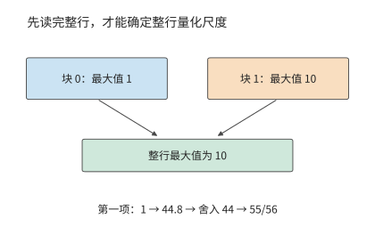

*图 5-17：一行分成两个块，后一块中的十决定整行尺度。第一项要先按这一尺度映射，再舍入到格式允许的值，最后反量化。*

先读完整行，最大值为 10。第一项缩放为 $1\times448/10=44.8$，舍入到该格式可表示的 44，反量化结果为 $44\times10/448=55/56$。若读完第一块就量化，当时最大值为 1，第一项可表示为 448，反量化结果恰好为 1。

读到后一块中的 10 后，即使调整后续计算所用的尺度，也无法使第一项重新经历 44.8→44 的舍入。两种做法的结果相差 $1/56$，约 1.8%。因此，按整行最大值确定尺度时，应先读完一行并求出最大值，再进行量化。[^numerics]

这些例子说明了哪些变换可以进行，哪些运算顺序需要保留。输出之间可以交换执行顺序，输入可以分块缓存，算好的结果可以直接供后续运算使用；归约的合并方式和量化的舍入位置则属于运算定义，需要在变换中保留。

### 5.4.4 AKG：用多面体编译组织循环与存储

AKG 是面向张量算子的自动代码生成与优化系统，其核心技术是 **Polyhedral Compilation（多面体编译）**。它把规则循环表示为三类信息：有哪些迭代要执行，每次迭代读写哪些数组元素，以及哪些读写必须保持先后顺序。循环边界和规则下标可以用线性约束描述，这就是“多面体”名称的来源。借助这种表示，编译器能够推导迭代之间的依赖，并据此调整执行顺序。[^akg]

以矩阵乘为例，编译器可以确定不同 i、j 对应不同输出，沿 k 的更新则指向同一个累加结果。选定 64×64×32 的 tile 后，还可以由数组访问推导当前需要的 A、W 区域：A 为 64×32，W 为 32×64。这样既能确定循环的执行顺序，也能确定需要读入哪些数据，以及这些数据要保存多久。

AKG 从张量表达式生成多面体表示，将分块与分层融合结合起来：在外层安排完整算子的执行顺序，在内层安排各块的连续计算和局部缓存。存储管理根据这些区域分配片上空间、插入搬运，代码生成再将计算映射到硬件执行方式，调优阶段选择块形状等参数。前文手工完成的“拆分循环—确定读取区域—保存累加器—完成归约后激活”，在这里成为相互联系的编译步骤。

将计算和存储一起分析，也能解释融合为什么会增加访存。前面的逐元素链通过融合少读了中间值；若中间结果采用位数更少的表示，又需要被后续计算反复读取，保留它反而可以减少读取。

**例 5-8：量化单独执行还是融合进矩阵乘，哪种方式读写更少？** 取 $[4096,4096]$ 的 FP16 输入 A，占 32 MiB，量化为 FP8 后占 16 MiB；FP8 权重为 $[4096,1536]$，占 6 MiB，FP16 输出占 12 MiB。输出按 128×128 分块，共有 32 个行块、12 个列块。各输出块独立读取所需数据，量化尺度来自整行最大值。

先看单独执行量化的做法。每处理一行，就用 8 KiB 局部空间保存该行输入，求出尺度后再量化。全部输入共读入 32 MiB，量化结果共写出 16 MiB。随后，12 个输出列块各读取一遍 FP8 输入，共 192 MiB。因此，与输入有关的读写量为 $32+16+192=240$ MiB。

把量化合并到矩阵乘中后，先读取 32 MiB 原输入求出行尺度；12 个列块随后各读一次原来的 32 MiB 输入，并在本地量化。输入相关访问为 $32+12\times32=416$ MiB。虽然省去了 16 MiB 量化结果的写出，但每个列块读取的输入从 16 MiB 增至 32 MiB，12 次读取增加了 192 MiB。

两种方案都由 32 个行块各读取 6 MiB 权重，再写出 12 MiB 输出，共 $32\times6+12=204$ MiB。因此总访问量分别为 $240+204=444$ MiB 与 $416+204=620$ MiB，融合后增加约 40%。

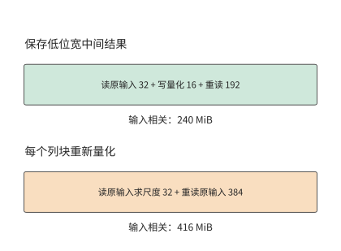

*图 5-18：两种方案都先读完整输入以确定行尺度。保存 FP8 结果后十二列块合计重读 192 MiB；融合方案重读 FP16 输入 384 MiB。权重与输出另有相同的 204 MiB。*

图 5-18 中，决定差距的是通向 12 个列块的重复读取：每次读取的数据量相差一倍。输出列块数因而直接决定两种做法的访存量差异。每增加一个列块，保留量化结果的方案多读 16 MiB，融合方案多读 32 MiB。将 1536 个输出列放入同一块，可消除这种跨列块重复；相应输出累加器也从 128 列扩大为 1536 列，需要十二倍空间。因此，选择是否融合量化时，仍要比较 5.2 节讨论过的局部存储占用与数据复用。[^numerics]

AKG 将融合与分块共同考虑，正是为了处理这样的相互作用。中间结果的计算位置改变后，各输出块读取哪些数据、读取多少次都会改变；缓冲需求随之变化，又影响能够采用的块大小。编译器需要把这些因素放在一起，比较整个计算过程的开销。

### 5.4.5 成本估计与实测选择

前面的量化例子已经能够按读写量比较两种实现。面对更多分块与融合组合，编译器也按同样的思路逐步缩小范围：先检查依赖和数值规则，再排除局部存储不足以容纳的实现，最后估计执行开销，决定优先测试哪些实现。5.2 节已给出一种估计：用访问量和有效带宽比较两个 tile。编译器还可以加入矩阵指令利用率、寄存器需求和启动成本，确定各实现的测试顺序。

同一转置程序的 RTX 对照中，16×16 块约需 7.9 μs，32×32 块约需 2.9 μs，扩大后快约 2.7 倍。块的每个维度增至两倍，内部元素数就增至四倍，存储布局和线程协作也一起改变。[^exp5]

TVM 的自动调优根据硬件实测结果搜索分块、循环顺序等调度方案；让能够调用编译和测试工具的智能体（Agent）修改调度或内核代码，还可以尝试原有调度模板之外的实现。两种搜索都以编译后的程序为评价对象，通过数值检查筛选正确实现，再以执行时间评价调度。编译器可以将源码中分开表达的算子融合为一个内核。[^exp4] 搜索方法还要解决另一个问题：用什么负载评价这些实现。

**例 5-9：输入形状的调用比例如何改变算子实现的选择？** 某个算子有 A、B 两种输入形状，原实现处理它们都需要 10 μs。新实现处理 A 需要 5 μs，处理 B 需要 20 μs：A 的耗时减半，B 的耗时翻倍。若两种形状各出现一次，总时间从 20 μs 增至 25 μs，新实现的耗时增加 25%；若 A 调用 100 次、B 调用一次，总时间从 1010 μs 降至 520 μs，新实现的加速比约为 1.9。

令输入形状为 A 的调用占比为 p。原实现的平均执行时间为 10 μs，新实现的平均执行时间为：

$$
\overline T_{\mathrm{new}}=5p+20(1-p)=20-15p\quad\mathrm{\mu s}.
$$

要使新实现平均时间更短，需满足 $20-15p<10$，即 $p>2/3$。图 5-19 的交点说明，只有当 A 占全部调用的比例超过 2/3 时，新实现才更快。

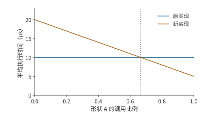

*图 5-19：形状 A 占比超过 2/3 时，新实现的总执行时间更短。A、B 原耗时均为 10 μs，新实现分别为 5、20 μs；调用串行，图中比较稳态执行。交点由两种实现的平均时间相等确定。*

因此，调优可以按形状分别选择实现，也可以按实际调用频数选择一种综合成本较低的方案。搜索本身消耗的编译与测量时间，则属于准备成本。配套的 Agent 实验保留了代码生成、重复提交和测量记录；下一节将结合调用次数，计算节省的执行时间需要多久才能抵消搜索开销。[^exp6]

## 5.5 运行时：提交、重放与动态形状

编译器选出加速器程序后，运行时还要反复准备输入、选择程序、提交任务并管理缓冲。即使使用同一份内核代码，改变提交方式或复用已有的准备结果，也会改变总时间。本节接着 5.1 节的时间线，分析这些主机工作。

### 5.5.1 主机准备与加速器计算的重叠

5.1 节区分了 CPU 提交时间与加速器执行时间，5.3 节又说明两类资源可以重叠工作。把这两点用于模型的一次前向计算：CPU 为下一阶段检查形状、准备参数或元数据，GPU 执行当前阶段。如果下一阶段的准备可以提前，两侧便形成流水；若 CPU 一直等到 GPU 完成才开始准备，加速器会在两个阶段之间停下来。

**例 5-10：加速器加速后，主机为何成为瓶颈？** 设有 100 段工作，每段的主机准备和加速器计算各需 20 μs。准备下一段所需的数据均已知，缓冲足够，两类资源独立。严格串行需要 $100\times(20+20)=4000$ μs；采用流水后，先完成第一段的准备，随后每 20 μs 完成一段，总时间为 $20+100\times20=2020$ μs。

将加速器计算缩短至 5 μs，主机仍每 20 μs 才准备好一段。流水变成 $100\times20+5=2005$ μs，只比原来少 15 μs。CPU 提交任务的速度没有提高，GPU 算得越快，等待下一项任务的时间就越长。再把主机准备时间缩短至 5 μs，两侧才能每 5 μs 完成一段工作，完成时间降为 $5+100\times5=505$ μs。[^host]

这个例子说明了主机优化的两个方向。一是减少准备工作，例如重复使用已经确定的形状和执行计划；二是把准备移到前一段加速器执行期间，例如异步处理上一轮输出。它们分别减少流水中的工作量和阶段之间的空隙。

在自回归生成中，能否提前准备，取决于所需的数据是否已经算好。下一步计算需要用到上一轮选出的 token；组建批次、更新语法状态和判断是否停止，也各自需要相应的结果。运行时可以提前执行不依赖这些结果的工作，减少两轮计算之间的等待。vLLM 等引擎的异步执行与调度演进围绕这一问题展开。[^runtime]

如果专用加速器把模型执行从 100 μs 缩短到 10 μs，而主机每轮准备仍需 20 μs，在可重叠、无其他依赖的稳定流水中，步间隔的下界就从 100 μs 变为 20 μs，收益为 5 倍。此时进一步缩短步间隔，需要把动态批次准备、地址更新与提交一起优化。

两次调用可以分别要求模型解释代码和检查测试，输入内容不同，却仍经过同一组模型层。长度与批次落在已有执行计划支持的范围内时，运行时可以复用程序，更新 token、位置和状态地址；遇到新的形状或控制路径时，则选择另一份执行计划。应用通过上下文表达变化，运行时利用稳定的执行结构减少重复准备。下面的图重放与形状特化，将分别计算这两种复用的收益。

### 5.5.2 CUDA Graph：提交收益与输入复制开销

上一小节中，GPU 提速后仍在等待主机。模型反复执行相似的任务序列时，其中许多提交工作可以复用：先把加速器任务及其依赖记录成图，再重复提交。使用 CUDA Graph 时，主机每次只需发起一次图重放，无需重新逐个准备和提交 kernel。加速器仍然执行图中的各个节点，减少的是主机的重复工作。

图 5-20 取三次 FFN 执行作对照。普通提交产生 18 次主机 kernel launch 和 18 个加速器 kernel；图重放改为 3 次 graph launch，加速器仍执行 18 个 kernel。将激活链融合后，加速器 kernel 减至 15 个；再使用图重放，主机仍只需 3 次 graph launch。融合将多个算子的计算合并到同一内核中，图重放减少了主机逐个准备和提交任务的工作。[^exp8]

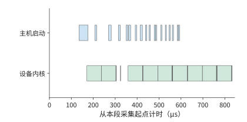

*图 5-20：普通提交的三次 FFN 实测。上行为主机内核启动 API，下行为加速器 kernel；横轴从本段标记起点计时。十八次内核启动对应十八个加速器 kernel。*

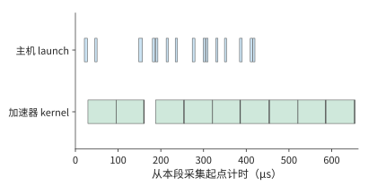

*图 5-21：三次 FFN 融合激活链后，主机启动内核十五次，加速器相应执行十五个内核。数据来自与前图相同实验的单独标记的采集区间。*

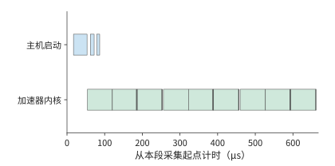

*图 5-22：三次 graph launch 对应十八个加速器 kernel。图重放减少主机提交次数，加速器仍执行原图各节点；本图按自身采集范围标出真实时间。*

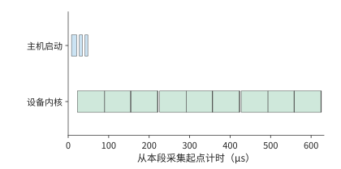

*图 5-23：先融合再重放，主机发起三次图执行，加速器执行十五个 kernel。融合减少加速器内核数，图重放减少主机提交次数。*

图重放前，还要把新输入放到图所记录的地址。典型实现为图预留固定缓冲区，上游每次将新数据写到这里，图按已记录的地址读取。若上游输出位于另一份张量中，就在图执行前增加一次复制；若上游直接写固定缓冲，这次复制便可省去。

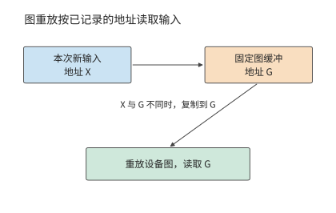

*图 5-24：图执行时读取记录的地址 G。新输入位于 X 时先复制到 G；上游直接写 G 时沿用同一缓冲，省去中间复制。*

**例 5-11：输入复制何时抵消图重放的收益？** 普通执行的加速器计算为 20 μs，加速器等待主机提交任务的时间为 20 μs，共 40 μs。图重放与元数据准备为 5 μs，加速器计算保持 20 μs。图原本可以节省 15 μs。

取图执行所需的 BF16 输入为 $[256,4096]$，数据量为 2 MiB。复制同时读取源和写入目标，读写量合计为 4 MiB；按 2 TB/s 的有效读写流量带宽计，复制需约 2.1 μs，图执行的总时间约为 27.1 μs，比普通执行少约 12.9 μs。

保持计算与准备时间不变，把输入扩大至 2048 行，数据量增为 16 MiB。复制读写增为 32 MiB，用时约 16.8 μs，图执行的总时间约为 41.8 μs。这次复制已超过原本省下的 15 μs。

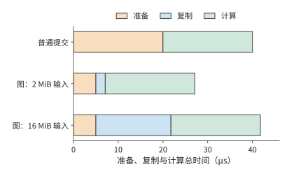

*图 5-25：橙色为准备，蓝色为额外输入复制，绿色为加速器计算。普通方式四十微秒；图的两 MiB 输入约二十七微秒，十六 MiB 输入约四十二微秒。*

图 5-25 中，图重放节省的准备时间是一段固定长度；表示复制时间的条形却随输入增大而变长。两者长度相等时，图重放恰好不再节省时间。令输入数据量为 X，复制带宽为 B，图执行更快的条件为 $2X/B<15\ \mathrm{\mu s}$。代入 B=2 TB/s 得：

$$
X<\frac{15\times10^{-6}\times2\times10^{12}}{2}\ \mathrm{bytes}\approx14.3\ \mathrm{MiB}.
$$

2 MiB 低于这一临界值，16 MiB 则超过它。让前一个算子直接将结果写入图缓冲，或者从输入张量较小的位置开始捕获，都能减少复制开销。因此，选择哪些操作组成一张图时，需要同时比较省下的主机提交时间与增加的输入复制时间。[^graph]

图重放复用了提交序列，同一思路还可以用于生成这些任务之前的准备工作。例如，执行计划可以供多个模型层共同使用。若 36 层能够使用同一份计划，每层都重新生成一次，就要做 36 次相似的准备工作；共同使用一份计划，只需生成一次。推理算子库 FlashInfer 的两组对照将时间从约 2.0、2.4 ms 降至 0.72、0.75 ms，加速器 kernel 数保持不变。将计划生成（plan）与执行（run）分开后，就能在多次执行之间重复使用同一份计划。[^plan]

### 5.5.3 动态形状与编译开销

多个模型层共享计划，利用的是计算结构相同；不同调用共享编译后的程序，还要处理输入形状的变化。输入行数变化时，运行时可以选择三种方式。通用程序根据当前形状计算索引和边界；分桶将输入补齐到少数代表形状，复用这些形状的程序；**特化（specialization）**则利用已知的输入条件生成专门实现；这里针对每个常见形状分别编译程序。越充分地利用已知形状，越有机会简化加速器工作，但也需要编译和保存更多程序。

**例 5-12：重复执行多少次，特化才值得？** 取十次 FFN 为一组：8 次为 256 行，1 次为 1536 行，1 次为 2048 行，共 $8\times256+1536+2048=5632$ 行。采用 512、2048 两个桶时，实际处理 $8\times512+2048+2048=8192$ 行，多算约 45%。

完整 FFN 的三个投影每行共需 $6HF$ FLOPs。取通用、分桶、特化的有效矩阵处理率为 100、200、250 TFLOP/s，则每组时间分别约为 17.0、12.4、6.8 ms。分桶虽然多算 45%，处理率却翻倍，仍比通用实现更快。再设它们的准备时间分别为 100、400、900 ms，得到下表。[^specialization]

| 策略 | 一次性准备 P | 每组执行 T | 形状处理方式 |
| --- | ---: | ---: | --- |
| 通用 | 100 ms | 17.0 ms | 按实际 5632 行执行 |
| 分桶 | 400 ms | 12.4 ms | 补至两个桶，执行 8192 行 |
| 逐形状特化 | 900 ms | 6.8 ms | 三个形状分别生成程序 |

运行 r 组的总时间为 $T_{\mathrm{total}}=P+rT$。图 5-26 中，每条线的截距表示准备时间，斜率表示每组执行时间。本例中，每组执行越快的方案，直线越平缓，但起点也越高，因为它需要更长的准备时间。

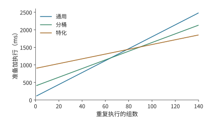

*图 5-26：同一组调用反复执行时，最省时的策略随复用次数变化。曲线采用例 5-12 的形状、处理率和准备时间，不同策略适用的整数调用次数范围使用未经四舍五入的数值计算。*

分桶比通用方案多用 300 ms 准备，每组却能省下约 4.6 ms，执行约 65 组后就能抵消这部分开销。特化比分桶再多用 500 ms 准备，每组再省约 5.6 ms，需要执行约 90 组。由完整数值求得，1–64 组通用最省，65–89 组分桶最省，90 组起特化最省。

如果实例只执行 70 组，总时间分别约为 1.29、1.27、1.38 s。分桶用时最短，是因为它节省的执行时间已经超过多花的准备时间；特化虽然每组执行得更快，但累计节省的时间还不足以抵消额外的准备开销。若三种程序均已缓存，本次准备成本为零，特化从第一组起就用时最少。运行时的选择因而同时依赖形状频数与程序是否已经编译并缓存。

同样可以计算自动调优需要多少次调用才能抵消准备开销。若搜索耗时 10 分钟，每次使用新实现省 5 μs，以累计节省时间抵消搜索时间，需要 $600/(5\times10^{-6})=1.2\times10^8$ 次调用。每秒一万次约需 3.3 小时，每秒一百次约需 14 天。调优耗时越长，就越应优先优化调用频繁、能够长期使用的形状。

第八章将结合请求到达情况和动态批处理，进一步讨论如何选择和缓存程序。如果某种形状在短时间内反复出现，保留对应的编译结果可以减少重复准备；如果很久不再使用，就可以删除该缓存，为其他形状腾出空间。

### 5.5.4 Persistent Kernel：按数据块调度任务

前面通过图重放和程序缓存减少了重复的准备工作。现在再看加速器上的等待：对于有依赖关系的两个 kernel，后一个通常仍要等前一个全部完成后才能开始。如果后一个算子只需要前一个算子的一块结果，就可以把等待条件缩小到数据块：第一块算好后，立即开始后续运算，同时继续计算其余数据块。

**Persistent Kernel（常驻内核）**在加速器上持续运行，从队列中取出任务，通过事件确认所需数据是否准备好。这样既减少主机反复启动内核的工作，也使相邻算子能够按块重叠执行。Mirage Persistent Kernel／MPK 是采用这种任务调度方式的研究系统。[^persistent]

仍以投影后接激活为例，取 512 个 token 的特征向量，每 64 个 token 的向量组成一个数据块，共八块。设矩阵与向量资源独立、缓冲充足，每块投影约需 32.2 μs，激活约需 39.3 μs，主机启动每次 5 μs。等全部投影完成再开始激活，共需 $2\times5+8\times(32.2+39.3)\approx582$ μs。

现在将计算分为八个投影任务和八个激活任务，每个任务增加 0.5 μs 调度时间、0.2 μs 完成通知时间。每块投影变为 32.9 μs，激活变为 40.0 μs。一次主机启动后，先完成第一块投影，随后投影与较慢的激活重叠，完成时间为 $5+32.9+8\times40.0\approx358$ μs，加速比约为 1.6。

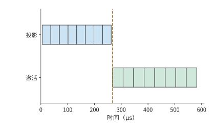

*图 5-27：粗粒度执行先完成八块投影，再启动八块激活。每块投影约 32.2 μs、激活约 39.3 μs，两次主机启动各五微秒；竖线为激活开始。*

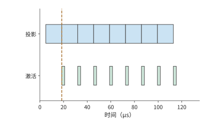

*图 5-28：矩阵与向量资源独立、缓冲充足。每个任务另计 0.7 μs 调度与通知，首块投影完成后即可激活，八块流水约三百五十八微秒结束。*

沿着图 5-28 的激活时间线看，首块开始后就连续执行到最后一块。这与双缓冲具有同样的规律：第一块先完成前一阶段，之后每隔较慢阶段所需的时间完成一块。任务调度增加了开销，但按块开始后续计算省下了更多等待时间。每个缓冲槽从投影开始一直被占用到激活结束；没有空槽时，投影任务就要等待。因此，任务队列、完成事件和空闲缓冲共同决定下一块何时能够开始。

图重放减少重复提交，特化后缓存的程序减少重复编译，常驻内核让相邻算子按块重叠执行。三者分别减少了提交、准备和等待时间。下一节将进一步计算这些改进能让完整请求的耗时减少多少。

## 5.6 从局部优化到完整请求

前面每项优化都有明确的作用对象：分块减少输入重读，融合减少中间读写，运行时优化减少准备和等待。但完整请求还包含其他工作，局部省下的时间只占其中一部分。本节先说明如何从局部加速推算请求时间，再分析 Qwen3-8B 的实际请求。

### 5.6.1 热点占比决定加速空间

设请求由串行阶段构成，其他阶段时间保持不变，热点占原时间的比例为 f，热点的加速比为 s。将原请求时间归一化为 1，新时间为 $(1-f)+f/s$，整体加速为：

$$
S_{\mathrm{request}}=\frac{1}{(1-f)+f/s}.
$$

若热点占 20%，速度提高到原来的两倍后，总时间变为 $0.8+0.2/2=0.9$，加速比约为 1.11。继续把热点加快到十倍，总时间为 0.82；即使热点耗时降到零，其他阶段仍需原总时间的 0.8，整体加速上限为 1.25 倍。

这个关系就是 Amdahl 定律。它解释了优化收益逐渐缩小的原因：热点耗时越短，其他阶段在总时间中所占的比例就越高。

### 5.6.2 并行分支与关键路径切换

Amdahl 关系按串行阶段相加计算时间。若请求中有两个分支同时执行，缩短一个分支后，还可能需要等待另一个分支；此时应沿依赖图寻找决定完成时间的最长路径。设准备 10 μs 后，同时启动热点 A 和分支 B，分别需 60、40 μs；收尾需 10 μs，并等待两条分支都完成。原请求时间为：

$$
T=10+\max(60,40)+10=80\ \mathrm{\mu s}.
$$

将 A 加快四倍至 15 μs，B 仍需 40 μs，新时间为 $10+\max(15,40)+10=60$ μs。A 省下 45 μs，请求却只省 20 μs，因为 B 接替 A 成为关键路径。

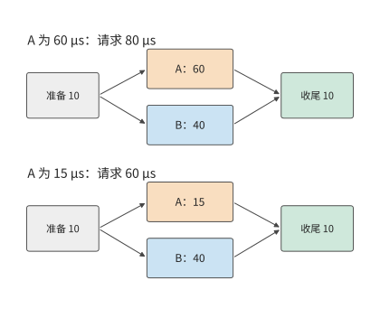

*图 5-29：收尾等待 A、B 两条分支。A 从 60 μs 缩短至 15 μs 后，较慢分支由 A 切换为 B，请求从 80 μs 降至 60 μs。准备和收尾各为 10 μs，两条分支使用独立资源。*

A 缩至 40 μs 时，恰好与 B 同时结束；继续只优化 A，完成时间便停在 60 μs。这个交点给出了单独优化 A 所能获得的最大收益。若要继续缩短请求，应优化 B，或减少准备和收尾。

共享资源还会改变分支自身的时间。设 A 的新实现大量占用带宽，使并行执行的 B 耗时增至 90 μs，请求就变成 $10+\max(15,90)+10=110$ μs。B 增加的等待时间超过了 A 节省的计算时间，导致整个请求反而变慢。[^dag]

第二章的 V4.1 会话说明，保存同一份数据所需的容量，与执行期间对它的累计访问量可以明显不同。8K 条件下，V4 Flash 全局 KV 为 27.455 MiB，V4.1 为 6.953 MiB；但计入局部窗口与索引的逐层逻辑读取为 12.556 与 11.375 MiB。共享状态无需为每层保存一份副本，各使用层仍需要访问它。[^v41-case]

上下文变长后，仍需执行的索引扫描也会带来更多开销。128K 时，两代模型的全局历史状态与索引的逻辑读取量分别约为 65.085 与 33.422 MiB。V4.1 后续解码索引器只访问候选池，初始索引仍需遍历全局。因此，即使后续层索引的访问范围固定，整个 decode 的开销仍会随上下文长度增长。

除了数据从哪里取得，程序是否真正省去了计算也会改变开销。候选池通过缩小后续索引的搜索范围来节省工作。公开参考实现先对完整索引缓存执行点积，再屏蔽候选池之外的位置；论文中的生产实现直接减少后续索引扫描的条目。前者已经完成了池外点积，后者在发起计算时就省去这部分工作。同一选择规则由此对应两种执行成本。

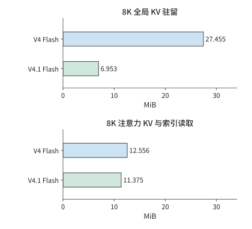

*图 5-30：全局驻留与逐层逻辑读取分开比较。上方仅计全局 KV 容量，下方读取包含全局条目、局部窗口和索引；两栏各自采用相同横轴尺度。数值按生产布局计算。*

### 5.6.3 综合案例：一次 Qwen3 请求的优化选择

现在把这一方法用于 Qwen3-8B。请求输入 7239 个 token，生成 32 个输出 token，并发为 1，采用 BF16 与 eager 执行；这里的 eager 表示由主机沿程序过程逐项提交加速器工作。模型有 36 层，先做一次 prefill 产生首输出，再做 31 次 decode。每层每步执行一次 SwiGLU，即第 5.3.1 节中以 SiLU 调节一支投影、再与另一支逐元素相乘的门控前馈计算，共有 $36\times32=1152$ 次调用，其中 prefill 36 次，decode 1116 次。

两类调用承担不同工作。同一请求的 prefill 在 36 个模型层中分别对 7239 个输入 token 执行该算子，共处理 $36\times7239=260604$ 个 token 表示；31 步 decode 在每层处理一个新 token，共执行 $36\times31=1116$ 次单 token 算子调用。这里按“层数 × token 数”累计算子工作，同一个 token 在不同层参与计算会被重复计数。decode 的调用数是 prefill 的 31 倍，处理的行数却小得多。这正是本章反复遇到的形状差异：大矩阵提供较多并行工作，小矩阵的计算时间较短，内核启动和任务分配的开销更突出，也更难充分利用加速器。

在同一引擎中，将 36 层 SwiGLU 替换为一个采用不同调度方案的内核，执行记录确认 1152 次调用均使用了替换后的内核。阶段计时如下。[^exp9]

| SwiGLU 阶段 | 调用形状与次数 | 原内核 | 替换后的内核 |
| --- | --- | ---: | ---: |
| Prefill | 7239 行，36 次 | 约 11.2 ms | 约 11.2 ms |
| Decode | 1 行，1116 次 | 约 2.4 ms | 约 0.92 ms |

替换后的内核主要缩短了一行输入的 decode 激活时间，加速比约为 2.6，合计节省约 1.5 ms。prefill 的激活耗时基本相同。轨迹中的这些激活与其他加速器工作顺序执行。原内核的全部激活计算约为 13.6 ms，占约 851 ms 采集区间的 1.6%；保持其他工作不变，即使省去全部激活计算，也最多节省 13.6 ms。目前只缩短了 decode 部分，因此整个请求预计只能减少约 1 ms。

在客户端交错测量替换前后的请求，共得到 11 对结果，与上述预期相符。替换前后的首 token 时间均约 436 ms，完整请求中位数分别约为 817 ms、815 ms。对每轮计算“替换前用时减去替换后用时”，配对时间差的中位数约为 1.3 ms，占原请求耗时的约 0.16%。图 5-31 列出每轮差值，其中 9 对在替换后耗时缩短，2 对在替换后耗时增加。

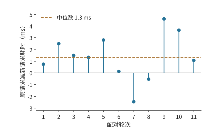

*图 5-31：同轮替换前的请求时间减去替换后的请求时间，正值表示替换后更快。Qwen3-8B，7239-token 输入、强制 32-token 输出，并发 1，BF16、eager，关闭前缀缓存；11 对交错计时，轮内顺序随机，期间有其他驻留服务。虚线为配对时间差的中位数约 1.3 ms。阶段表来自单独采集的性能分析记录。*

decode 的改进发生在首输出之后，因此当前长输入请求的首 token 时间仍由 prefill 中的计算与等待决定。输出越长，一行输入的激活计算重复执行的次数越多，单步节省的时间也就累积得越多。

分析完整请求时，首先统计各种形状的调用次数，再计算每次调用节省的时间，最后根据依赖关系判断这些节省能否缩短整个请求。这样，就能把内核的加速比、各阶段的耗时和用户实际等待的时间联系起来。

## 常见误区

**误区：仅凭 kernel 数量判断执行成本。** 图重放将三次 FFN 的主机提交从 18 次降到 3 次，加速器仍执行 18 个 kernel；融合才把加速器 kernel 减到 15 个。主机提交和加速器计算应分别沿各自的时间线解释。

**误区：访问量最小的实现一定最快。** 注意力的 K/V 块从 64 行缩到 1 行，访问量减少 100 MiB，状态更新次数却增至约 43 倍。读取、状态更新与矩阵处理率共同构成执行成本。

**误区：增加缓冲就能提高吞吐率。** 搬运 2 μs、计算 3 μs 的四块流水，用两个槽已在 14 μs 完成。第三个槽只能让输入更早就绪，要继续缩短时间，就需要加快已经连续运行的计算阶段。

**误区：稳态执行最快，总耗时就最短。** 执行 70 组调用时，分桶约需 1.27 s，逐形状特化约需 1.38 s。特化每组执行得更快，但省下的时间尚不足以抵消额外的准备开销。

## 习题与配套实验

以下题目沿本章算例逐步改变条件。先完成纸面推导，再用配套代码或执行记录解释差异；实验入口保留原编号，配置、操作步骤和完整记录见对应材料。

> **实验 5-1 · 延伸：矩阵块大小如何改变局部存储与读取量**
>
> 将例 5-3 的输出块改为 64×128，归约块仍为 32，求局部存储需求、A/W 各自的读取次数与总访问量。与 64×64 方案相比，64×128 方案的有效带宽至少要达到前者的多少，才能使访存时间更短？再比较两种循环次序的执行记录，解释连续访问如何影响处理率。[^exp1]

> **实验 5-2 · 核心：激活算子融合能减少多少访存与显存占用**
>
> 对 G、U 各 24 MiB 的激活链，分别画出三个算子独立执行和完全融合时，各张量的分配、使用与释放顺序，推导 156 MiB、60 MiB 的访问量，以及两种方案的显存占用峰值。若融合实现每次增加 5 μs 固定开销，接口带宽为 2 TB/s，输入行数至少达到多少时，融合节省的访存时间才能超过这项开销？再结合配套实验结果，解释访问量减少的比例与耗时缩短的比例之间的关系。[^exp2]

> **实验 5-3 · 延伸：分块归约与预取如何改变注意力计算和访存**
>
> 在例 5-6 的输入中再加入一个元素，其分数为 $\ln4$、对应值为 5，更新 m、$\ell$、u，并与一次处理三个元素比较。保持注意力缓冲的总容量为 128 KiB，从中额外划出一个 b×d 的 BF16 预取槽，取 b=64，求新的最大 Q 行数、扫描次数与访问量。解释预取缓冲为何会改变数据的重复读取次数。[^exp3]

> **实验 5-4 · 延伸：算子融合会改变计算结果还是执行成本**
>
> 在 5.4.2 的伪代码中，分别将 SiLU 移到 ko 循环内、删除中间 BF16 舍入、将量化计算移入每个输出列块的循环。说明各自改变了数学运算、数值舍入还是执行成本，并给出一个可区分前后结果或访问量的输入。[^exp4]

> **实验 5-5 · 延伸：分块循环如何改变访问顺序与临时存储**
>
> 用块号与块内坐标写出 i-k-j 的分块循环，标出输入缓存和累加器在程序中的创建、最后使用与释放位置。再对照配套转置程序采用两种块大小时的执行过程，比较访问连续性、同步操作和临时数据量，并据此解释执行时间的差异。[^exp5]

> **实验 5-6 · 延伸：输入形状的调用比例如何影响调优收益**
>
> 采用例 5-9 的两种输入形状，令形状 A 的调用占比分别为 1/2、2/3、9/10，计算原实现和新实现的平均时间。若根据形状选择实现，每次多花 1 μs，对 A 使用新实现、对 B 使用原实现，何时优于始终使用原实现？再根据配套搜索记录，统计搜索的总耗时，并计算找到的实现在重复调用中能节省多少执行时间。[^exp6]

> **实验 5-7 · 延伸：特化需要重复执行多少次才有收益**
>
> 画出例 5-12 中准备与执行的完整时间线。将每组中小形状的调用次数从 8 次改为 4 次，其他两种形状仍各调用一次。对三种方案两两比较，求各对方案总耗时相等时的重复次数。再假设两个分桶对应的程序已编译并缓存，求准备时间改变后，各方案总耗时最短时对应的重复次数范围。[^specialization]

> **实验 5-8 · 核心：图重放与算子融合分别减少哪些开销**
>
> 阅读图 5-20，分别统计四种方式下的主机提交次数与加速器 kernel 数量。将例 5-11 的复制带宽改为 1 TB/s，求输入数据增大到多少时，复制开销恰好抵消图重放节省的时间；再让上游直接写入图缓冲，分别在输入大小为 2 MiB 和 16 MiB 时，比较普通提交与图重放的完成时间。[^exp8]

> **实验 5-9 · 核心：内核加速如何改变请求耗时与关键路径**
>
> 根据配套的 11 对请求记录，先计算每对请求的耗时差，再取这些差值的中位数。解释它与分别取两组请求耗时的中位数后再相减有何区别。采用本章综合案例的条件，保持 prefill 不变，把 decode 步数从 31 增至 127，假设每步节省的时间不变，估算激活计算总共能节省多少时间。再将图 5-29 中 A 的执行时间逐步缩短，求完整请求时间不再随之缩短时 A 的执行时间。[^exp9]

## 历史与进一步阅读

Halide 将算法与调度分离，使分块、重排和计算位置成为程序员可组合的动作；TVM 将张量计算、后端生成与自动调优联结起来；AKG 则将多面体调度、分层融合与片上存储安排结合，用于神经处理器代码生成。沿三者的原始材料阅读，可以进一步追踪表达方式怎样影响编译器能够自动完成的变换。[^schedule][^akg]

FPGA 是可配置逻辑器件，高层次综合（HLS）将较高层程序转换为硬件数据通路。我早期的 FPGA／HLS 工作，也经历过从接口封装转向代码变换的过程：为了形成所需流水，必须识别原语和读写依赖，改变生成的数据通路。这个经历说明了研究重点如何从简化编程转向改进执行方式。

算子编排优化系统 Korch 提供了另一个有启发的例子：在一个历史案例中，子图原本由三个 kernel 执行，合计耗时约 91 μs；调整为四个 kernel 后，合计耗时约 69 μs。重新拆分和组合算子缩短了加速器执行时间，足以抵消额外的内核启动和数据传递开销。[^korch] 这一方向与本章的融合反例一起，说明了优化应比较整个计算过程的开销。

[^model]: [固定 Qwen3-8B 配置](../calculations/configs/models/qwen3-8b/config.json)；[模型算子与实现](../case-studies/model-operator-examples.md)。

[^tiles]: [分块容量与数据复用](../case-studies/buffer-capacity-and-data-movement.md)，含循环计数、Orojenesis 选读与 bank 映射。

[^reduction]: [RMSNorm 三阶段拆分计算](../calculations/results/rmsnorm-row1024-split8.md)。输入和 gamma 为 BF16，gamma 每行读取；一组一行保留输入，三阶段方案在应用阶段重读输入。

[^exp1]: [实验 5-1](../experiments/ch05/05-01/README.md)、[GPU 分块](../experiments/ch05/05-01/gpu-tiles/README.md)、[归约拆分](../experiments/ch05/05-01/rmsnorm-split/README.md)。

[^fusion]: [固定尺度融合与张量生命周期](../calculations/results/fusion-qwen8-pointwise.md)。

[^exp2]: [实验 5-2 的原始条件、数据与分析](../experiments/ch05/05-02/README.md)。RTX PRO 6000、共享 GPU、热缓存与图重放；原始中位数为 14.20／7.68 μs，仅测激活子链。

[^buffer]: [流式顺序与缓冲预算](../case-studies/stream-order-and-buffer.md)；[主机搬运与缓冲区占用时间](../case-studies/host-transfer-and-buffer-lifetime.md)。

[^attention]: [注意力分块与在线状态](../case-studies/attention-tiles-and-io.md)。容量模型采用单头、无掩码、K/V 复用输入槽和 S/P 复用临时槽。

[^fa]: [FlashAttention](../references/files/papers/flashattention.pdf)、[FlashAttention-2](../references/files/papers/flashattention2.pdf)、[FlashAttention-3](../references/files/papers/flashattention3.pdf)。

[^exp3]: [实验 5-3](../experiments/ch05/05-03/README.md)。RTX 热缓存单头对照：2.64 ms／79.5 μs；新增分配峰值约 848／22.2 MiB，包括各后端分配的临时量。

[^akg]: Zhao 等，2021，[AKG: Automatic Kernel Generation for Neural Processing Units using Polyhedral Transformations](../references/files/papers/akg-pldi21.pdf)。

[^korch]: [Korch 的编排案例](../case-studies/kernel-orchestration-and-quantization.md)：论文 V100／FP32 子图，三 kernel 为 38.7、24.2、28.2 μs，四 kernel 为 7.6、18.4、7.5、35.7 μs。

[^schedule]: [TVM](../references/files/papers/tvm.pdf)、[TensorIR](../references/files/papers/tensorir.pdf)。


[^numerics]: [融合合法性、FP8 舍入和量化投影](../case-studies/fusion-legality-and-precision.md)；[RedFuser 后端阅读](../experiments/ch05/05-04/redfuser/README.md)。444／620 MiB 计数包括 A、W 与输出；行尺度的辅助读写另见配套计算。

[^exp4]: [实验 5-4 的编译、舍入与执行差异](../experiments/ch05/05-04/README.md)、[DeepSeek V4-Flash 专家子链](../experiments/ch05/05-04/v4/README.md)。

[^exp5]: [实验 5-5 的生成代码与转置对照](../experiments/ch05/05-05/README.md)。

[^exp6]: [实验 5-6 的搜索与测量记录](../experiments/ch05/05-06/README.md)；[评测与部署计算](../case-studies/optimization-evaluation-and-deployment.md)。已记录两轮共 12 次 Agent 调用，未产生新的更快实现。

[^host]: [主机时间线调研](../research/2026-infra-survey/parallel-host-timeline/NOTES.md)；[配置流水与图执行](../case-studies/graph-execution-tradeoffs.md)。

[^runtime]: [运行方式与反馈](../case-studies/execution-feedback.md)、[框架演进](../case-studies/framework-evolution.md)及[token 成本调研 第 7—8 节](../research/token-cost-2023-2026/report.md#runtime)。

[^graph]: [图重放的小输入复制](../calculations/results/graph-small-input.md)与[图执行取舍](../case-studies/graph-execution-tradeoffs.md)。复制带宽按源读加目标写的接口流量定义。

[^plan]: [FlashInfer 计划复用实测](../experiments/ch05/05-08/flashinfer-plan/README.md)。

[^specialization]: [形状特化的完整教学输入与交点](../calculations/results/specialization-medium.md)。

[^exp8]: [实验 5-8](../experiments/ch05/05-08/README.md)与[轨迹分析 JSON](../experiments/ch05/05-08/results/trace-analysis.json)。

[^persistent]: [设备任务组织与 MPK](../case-studies/execution-feedback.md)；[八块任务计算](../calculations/results/persistent-tiles-base.md)。投影、激活的执行时间由 200 TFLOP/s 和 20 G 元素/s 推得；独立资源、任务开销和缓冲条件采用例中设定。

[^dag]: [请求关键路径教学计算](../calculations/results/request-dag-path-switch.md)、[争用情景](../calculations/results/request-dag-contention.md)。

[^exp9]: [实验 5-9 的内核实现、执行记录与 11 对请求](../experiments/ch05/05-09/README.md)。vLLM 0.23，替换后的内核采用 block256／4-warps 调度，11 对输出 token 一致。客户端中位数为 816.640／815.406 ms，配对时间差的中位数 1.343 ms，首 token 中位数 435.674／436.353 ms。单独采集的性能分析记录中，prefill 为 11.218659／11.244366 ms，decode 为 2.369803／0.920376 ms。原内核耗时 13.588462 ms，采集区间 850.848989 ms；各热点与其他观测 GPU 工作的时间交集为零。

[^execution]: [CUDA 执行模型](https://docs.nvidia.com/cuda/cuda-programming-guide/02-basics/intro-to-cuda.html)；[CUDA Runtime API 的同步语义](https://docs.nvidia.com/cuda/cuda-runtime-api/api-sync-behavior.html)；[CUDA stream 管理](https://docs.nvidia.com/cuda/cuda-runtime-api/group__CUDART__STREAM.html)与[event 管理](https://docs.nvidia.com/cuda/cuda-runtime-api/group__CUDART__EVENT.html)；[PyTorch 锁页内存与异步复制教程](https://docs.pytorch.org/tutorials/intermediate/pinmem_nonblock.html)。主机复制与缓冲复用另见本章引用的本地计算材料。

[^v41-case]: [DeepSeek V4.1 官方技术报告](../calculations/sources/deepseek-v4.1-flash/DeepSeek_V41_Tech_Report.pdf)，第 1、2、3 节与第 6 节；[跨章会话的固定条件与复算](../calculations/results/v41-throughline.json)。

## 本章小结

本章从一次矩阵投影出发，讨论了存储访问、算子融合、编译与运行时，最后分析完整请求。各节反复使用了三个基本判断。

第一，**复用需要空间**。更大的输出 tile 让同一输入参与更多乘加，也需要更多累加存储；保存量化结果让多个列块读取位宽更低的数据，也需要中间存储。判断这部分存储是否值得，应看它能减少多少重读或重算。

第二，**数据依赖决定计算顺序**。逐元素运算可以在一个位置的输入准备好后直接完成，归约则要保存部分和或在线统计。编译器根据依赖移动计算位置，运行时通过事件确认数据是否就绪、缓冲区能否释放。融合和流水都以这些依赖关系为基础。

第三，**总时间取决于各项工作的执行顺序**。带宽决定传输一批数据需要多久，较慢阶段决定流水线中相邻两块的完成间隔，复用次数决定后续节省的执行时间能否抵消首次准备时间，关键路径决定局部改进能否缩短请求。因此，既要计算减少了多少工作，也要确定这些工作原本是否影响了最终完成时间。

下一章将这些关系推广到多个加速器。一片结果何时就绪、谁需要读取、要保存多久，将决定通信何时开始以及两端需要多少缓冲。
