# 第 9 章 分布式推理

第 8 章讨论了怎样用批处理、请求调度、缓存和推测解码，提高一组给定计算资源的推理效率。这些方法既适用于单卡，也适用于多卡协同执行的实例。本章进一步研究计算与状态放在哪里：不同计算资源分别承担哪些阶段和算子，权重与 KV 怎样分布，执行位置之间怎样传输数据、分配工作并处理故障。

本章用 **P** 表示预填充（prefill），即处理已知输入并生成首个输出；用 **D** 表示解码（decode），即将刚生成的 token 送回模型，继续产生输出。**PD 分离**把这两个阶段交给不同资源。**AF 分离**把每层的注意力（attention）与前馈网络（FFN，包括专家网络）交给不同资源。**KV** 是上下文 token 的键和值，保存着后续注意力计算所需的状态。

增加完整副本，可以让不同资源组分别处理请求。将 prefill 与 decode 分开，可以为两个阶段分别配置计算资源；将注意力与专家计算分开，可以利用不同计算资源的计算和存储能力；共享 KV 则让请求使用其他执行位置留下的状态。这些组织方式可能发生在一个推理实例内部，也可能连接多个独立调度的服务池。下面依次分析执行位置、调度关系和数据流向。

本章从一个具体设计问题出发：四个擅长 prefill 的 A 类执行单元（worker）和四个擅长 decode 的 B 类执行单元，怎样处理每秒到达的四个请求？每个请求输入 8192 个 token、输出 129 个 token，模型采用 Qwen3-8B，KV 使用每元素 2 字节的 BF16 浮点格式。一个 worker 可以是一张卡，也可以是协同执行的一组卡。八个 worker 都有足以运行完整模型的内存容量。我们将依次决定计算怎样分工、上下文在哪里交接、缓存何时值得保留，以及启动后的积压多久能够消退。第 9.7 节将综合这些结果，为这组资源确定部署方案。

贯穿第 9.3、9.4 节的另一个算例采用 Qwen3-235B-A22B，研究专家权重放在哪里。同样是 512 次专家分派，分派结果不同时，可能需要读取许多专家的权重，也可能反复使用少数热点专家的权重。我们将据此判断专家计算应放在 CPU 还是 GPU 上，再考察热点集中到一张卡后，为什么需要专家副本。两个算例采用相同的分析方法：先确定每个请求需要的工作和状态，再估算各类处理器完成这些工作、存储系统提供所需数据的速度。

## 9.1 计算与状态的分布方式

### 9.1.1 计算资源、推理实例与服务副本

先区分硬件组织与服务组织。GPU、NPU 等加速器和 CPU 提供计算能力与相应的存储资源，进程在它们上面运行模型和通信逻辑；通信组内的每个进程有一个编号（rank）。一个推理实例可以由多个这样的进程协同执行。完整服务副本则拥有完成整个模型推理所需的权重和执行能力，可以和其他副本分别处理请求。

下面逐一画出四种组织方式。前两种都执行完整模型，但一个八卡协作组共同处理同一批请求，多个完整副本则各自接收请求。后两种进一步改变分工：PD 按生成阶段划分，AF 按层内算子划分。每种组织方式都有自己的调度器管理它负责的计算。

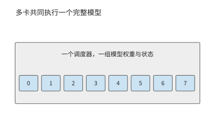

*图 9-1：八张卡共同执行一个完整模型实例，接收同一批请求。卡号表示协作组成员。*

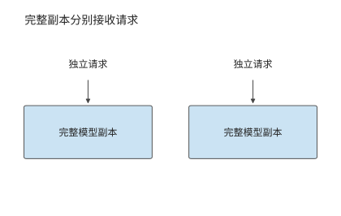

*图 9-2：每个副本都能完成整次推理，可以分别接收独立请求。副本自身也可以由多张卡组成。*

完整副本按请求分工，图 9-3 则让同一请求先后经过两个服务池。沿 P 到 D 的箭头看，交接的是输入处理留下的上下文 KV，两个池仍各自执行相应阶段的完整模型。

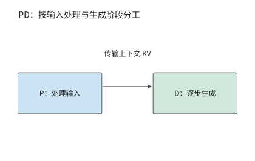

*图 9-3：P 处理输入，D 继续生成。两个服务池分别调度，上下文 KV 从 P 交给 D。*

图 9-4 将分界移到模型层内部：注意力一侧产生的激活交给前馈一侧，结果再返回。与一次阶段交接相比，这条数据通路要在每一层、每一步生成中反复走过。

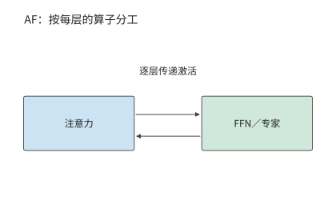

*图 9-4：注意力与 FFN／专家分别执行，隐状态作为激活在两侧往返。每层都需要这次交接。*

比较这些部署方式时，先使用第 8 章得到的运行配置和处理速度，再改变计算资源之间的分工。这里把 P、D 由同一组执行资源处理的方式称为**共置**。考虑一个已经调优的共置实例。请求的输入长度为 $L$，总输出长度为 $G$，prefill 计算最后一个输入 token 的 **logits**，即转换成 token 概率之前的词表分数，并由此采样首个输出。在本章采用的生成约定下，后续 decode 调用为 $G-1$ 次：最后一个返回的 token 尚未送入模型，所以输出数比后续 decode 调用数多一。

对给定请求分布，记每个请求在资源 $r$ 上消耗的平均服务时间为 $d_r$，同类资源共有 $n_r$ 个可独立工作的单元。到达率与资源占用时间需要满足

$$
\lambda d_r < n_r,
$$

其中 $\lambda$ 是到达率。若多个操作使用同一资源，应先将它们的资源占用时间相加；若操作分别使用相互独立的资源，则为每种资源单独列出约束。资源占用量按“资源数 × 占用秒数”计算，单位为资源秒。例如，每秒到达四个请求，每个占用 0.5 个资源秒，就需要两个持续工作的资源单元。若恰好只有两个单元，突发到达的额外请求就会一直积压，因为两个单元都忙于处理源源不断的后续请求；只有增加资源，才能消化突发。

设每个请求在某类副本上的 prefill 和 decode 分别占用 $d_P$、$d_D$ 秒，两个阶段在该副本上串行执行，那么 $N$ 个相同共置副本的请求率上界为

$$
\mu_{\mathrm{co}}=\frac{N}{d_P+d_D}.
$$

对开篇的 A 类 worker，每个请求的 P、D 阶段分别占用 0.5 秒和 2 秒；B 类恰好相反，分别为 2 和 0.5。每个完整副本都要承担两个阶段，所以两类副本均需 2.5 资源秒/请求，每秒完成 $1/2.5=0.4$ 个请求。八个合计 3.2 请求/s，低于每秒四个请求的到达率，每秒积压 0.8 个请求。问题由此变得明确：同样八个 worker，重新分工能不能补上这 0.8 请求/s 的缺口？

这里的副本可以由多张卡共同构成。例如，Qwen3-235B-A22B 的一种 TP2×EP4 部署方式（张量并行 TP 将专家矩阵二分，专家并行 EP 将专家分成四组）用八张卡处理同一批请求：每两张卡分担专家矩阵，四个 EP 组分别持有不同的专家。注意力和 KV 在四个 EP 组间各复制一份，因此一条请求 8192 个 token 的上下文在整个实例内占 5.875 GiB，是单份逻辑 KV 的四倍。这八张卡共同组成一个推理实例；要增加能独立处理请求的副本，还要另外安排一套完整的权重与状态。[^ownership]

### 9.1.2 计算分工与状态共享

增加完整副本改变请求的分配；PD 分离改变 prefill、decode 的执行位置；AF 分离改变 attention 与 FFN、专家的执行位置；共享 KV 改变上下文状态的保存与读取范围。这些部署方式改变了系统的不同部分，可以逐项引入，也可以组合使用。

| 部署方式 | 希望获得的收益 | 新增的主要约束 |
| --- | --- | --- |
| 增加完整副本 | 处理更多独立请求，分散排队 | 模型复制、缓存分散、启动及保持实例运行 |
| PD 分离 | 分别配置两个阶段的能力 | KV 交接、两端同时占用内存、两个队列 |
| AF 分离 | 让算子使用适合的计算与存储资源 | 逐层激活往返、同步、流水线各阶段的负载均衡 |
| 共享 KV | 跨实例复用上下文，减少重复 prefill | 缓存标识、读取、就绪通知、失效与空间释放 |

部署选择从当前负载的资源需求开始。如果两个阶段的资源需求相近，完整副本已经能够均衡服务，分离可能只会增加交接开销。如果许多请求共享长前缀，跨实例缓存可能比进一步拆分计算更有价值。分别计算资源占用和交接时间，就能判断当前应增加副本、分离阶段还是共享状态。

### 9.1.3 同一请求的执行路径与状态驻留时间

图 9-5 把一次多轮请求的计算阶段与状态驻留时间放在同一时间线上。带视觉输入时，**编码阶段 E** 将图像转换为模型使用的特征；保存下来供复用的编码结果称为**编码缓存 EC**（encoder cache）。P 处理这些编码结果与文本，D 逐步生成输出；工具返回后，新一轮 P 处理新增信息。权重通常跨请求保留，激活主要跨相邻算子传递，KV 随已处理的位置增长。工具等待期间计算可以暂停，但上下文状态仍可能占据内存。

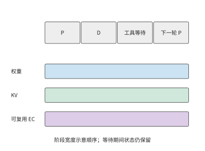

*图 9-5：计算暂停期间，状态仍需保留。示意同一请求从 prefill、decode 到工具等待和下一轮的状态驻留时间；横轴按阶段排列，不表示相等时长，EC 仅在有视觉输入时出现。E 为视觉编码，EC 为保存的视觉编码结果，P 为预填充，D 为解码。*

以本章的 Qwen3-8B 为例，一份包含 8192 个 token 的 BF16 上下文 KV 占 1.125 GiB。工具执行 10 秒时，GPU 可以处理其他请求，但这份上下文 KV 仍需占用 1.125 GiB 内存，容量与占用时长的乘积为 11.25 GiB·s；十个这样的会话同时等待，就占 11.25 GiB。计算暂停后，状态仍需保留，这正是共享缓存和换出策略要解决的问题。

这条请求若随后返回 129 个 token，P 先产生第一个输出，128 次 decode 再处理前 128 个生成 token。此时连续 KV 覆盖 $8192+128=8320$ 个 token，最后一个返回 token 尚未送回模型。下一轮在这 8320 个 token 之后继续，先处理这个尚未写入 KV 的末尾 token 和新增输入。因此，已返回的输出序列比 KV 所覆盖的序列多一个 token；恢复生成时，需要从这个位置继续计算。

## 9.2 Prefill–Decode 分离与资源配比

### 9.2.1 Prefill 与 Decode 为什么需要分离

Prefill 可以在一次调用中处理许多新 token，较大的矩阵计算往往能更充分地复用权重。在 decode 阶段，每个请求每步通常只处理一个新 token，需要反复读取权重与上下文状态。两者混合执行时，一个较长的 prefill 可能推迟已有请求的下一个输出；过度优先 decode 又会延长新请求的等待。

第 8.2 节已经用分块 prefill 缩短了长输入对 decode 的阻塞。本节保持相同模型和请求，进一步改变执行位置。PD 分离把两个阶段放入不同的服务池，使它们拥有独立的队列、批处理和资源配比。DistServe 与 Splitwise 是研究 P、D 分离部署的推理系统。同构的计算资源靠独立队列减少两个阶段之间的调度干扰，异构的计算资源还可以各自承担更擅长的阶段。[^pd]

这种分工像是先由一个人读完材料，再交给另一个人继续处理：接手者需要已有的工作记录，才能接着往下做。对本例模型，这份需要交接的记录就是上下文 KV。P 和 D 分别处理同一请求的不同阶段，每个阶段都要执行完整的前向计算。Qwen3-8B 的 P 处理 8192 个输入 token，D 随后调用 128 次；每次都经过注意力和前馈网络。因此两个池都需要完整的模型权重，KV 则从 P 交给 D。独立批处理带来的收益，首先要抵得过这次新增的交接。

应用通过一次调用请求完整的模型推理，服务内部则可以按阶段安排不同资源。模型的数据依赖确定了阶段之间的切分位置，KV 给出了两阶段之间需要交接的状态，负载比例决定各池需要多少资源。利用这些信息，服务可以在统一调用接口之下，为输入处理和逐步生成分别选择批次与计算资源。接下来用传输量和处理能力计算这种分工的收益。

### 9.2.2 KV 传输与两端内存占用

P 完成输入处理后，D 需要得到上下文 KV 才能继续生成。**分组查询注意力**（GQA）让多个查询头共享一组键和值。对保存逐 token 上下文键和值的完整 GQA 状态，设层数为 $n$，上下文长度为 $L$，KV 头数为 $h_{kv}$，每头维度为 $d_h$，每元素为 $b$ bytes，则逻辑状态大小为

$$
V_{KV}=2nLh_{kv}d_hb.
$$

系数 2 分别对应 K 与 V。Qwen3-8B 的固定配置为 36 层、8 个 KV 头、每头 128 维。BF16 状态每个 token 的 KV 占 144 KiB；8192 个 token 占

$$
V_{KV}=8192\times144\ \mathrm{KiB}=1.125\ \mathrm{GiB}.
$$

**例 9.1　预填充与解码之间的 KV 交接需要多久？** 假设有效单向载荷带宽为 25 GB/s，采用整份状态直接交接。纯载荷传输时间为

$$
T_{\mathrm{payload}}=\frac{1.125\times2^{30}}{25\times10^9}
\approx48.3\ \mathrm{ms}.
$$

再加一次 5 μs 的启动与同步，总时间仍约 48.3 ms：对这份完整 KV 数据，固定开销只占万分之一左右，提高载荷带宽更有助于缩短等待时间。而在 AF 逐层交接的小数据量传输中，固定开销会占更大的比例。[^handoff]

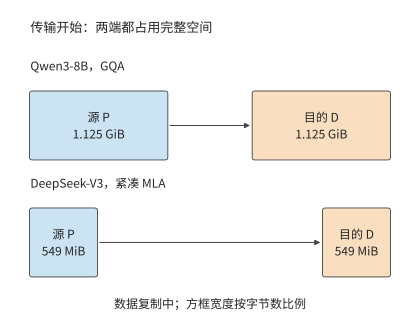

*图 9-6：源 P 保留完整 1.125 GiB 状态，目的 D 同时分配 1.125 GiB 接收空间。传输过程共占 2.25 GiB。*

采用整份双缓冲交接时，传输结束前源端保留完整状态，目的端分配完整接收缓冲。因此，源端和目的端各占用 1.125 GiB，共 2.25 GiB。采用分块传输时，目的端确认收到某一块后，源端就可以提前释放这一块，缩短两端重复驻留的时间；目的端靠完成标记确定哪些连续的块已经可用。若经主存中转，状态则依次占用源端、主存和目的端的缓冲，主存到 GPU 的拷贝成为新的依赖边。

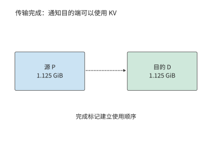

*图 9-7：数据到齐并满足可见性条件后，完成标记允许 D 读取状态。标记指示使用顺序，完整载荷已经写到目的端。*

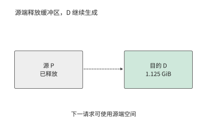

*图 9-8：本算例将执行权交给 D 后释放 P 的源缓冲，D 保留上下文并继续生成。源端空间用于后续请求。*

链路带宽既限制每秒能交接多少份状态，也影响每份状态需要传输多久。每秒 8 次上述交接需要约 9.7 GB/s 的传输带宽；每秒 16 次则需要约 19.3 GB/s。一条 11 GB/s 的链路能满足前者的平均需求，但每个请求仍要等传输完成；后者则不同：即使两池有空闲计算能力，网络队列也会持续增长。前一种情形下每份状态要约 110 ms 才能传完，后一种情形每秒还会积累约 8.3 GB 待传数据。传输时间决定了单个请求至少要等待多久，而数据到达速率与传输速率之差决定了队列增长多快。

### 9.2.3 阶段处理能力与实例数量配比

比较各阶段的处理速度前，应先算出一个请求在各阶段分别需要多少工作。设一个请求有 $L_{new}$ 个需要 P 新处理的 token、$G-1$ 次 decode 调用。某类 worker 的有效能力分别为 $r_P$ 个新 token/s 与 $r_D$ 次 decode/s，则它的每请求资源需求为

$$
d_P=\frac{L_{new}}{r_P},\qquad d_D=\frac{G-1}{r_D}.
$$

沿用第 8.6 节的方法，在确定批处理、精度和缓存设置后，用完成的工作量除以资源占用时间，得到各阶段的实际处理速度。以一个假设的计时实验为例：若 A 连续处理 20 份互不复用、各 8192 个 token 的输入，总共占用一个 worker 10 秒，则 $r_P=20\times8192/10=16384$ 新 token/s，每请求消耗 $10/20=0.5$ 资源秒。若同一批请求的 2560 次 decode 调用共占用 40 秒，则 $r_D=64$ 调用/s，每请求消耗 2 资源秒。批内多个请求共享一次调用时，完成的解码步要把所有请求都算上，但资源占用时间只按这一次批执行计一次。这样得到的资源占用时间可以直接相加；输入 token/s 与输出 token/s 则要先换算成同一个请求的需求。

**例 9.2　预填充与解码的资源配比如何决定吞吐上限？** 使用 8192 个输入 token、129 个输出 token。两类 worker 各四个，假设它们采用已选定的运行配置，各阶段的处理速度如下表所示；后续改变请求长度时，保持这组有效能力不变。

| worker 类型 | P 能力，新 token/s | D 能力，调用/s | 每请求 P 资源秒 | 每请求 D 资源秒 |
| --- | ---: | ---: | ---: | ---: |
| A，偏向 prefill | 16384 | 64 | 0.5 | 2 |
| B，偏向 decode | 4096 | 256 | 2 | 0.5 |

共置时，每个 worker 消耗 2.5 资源秒/请求，八个合计 3.2 请求/s。把四个 A 分给 P、四个 B 分给 D，两池分别提供 8 请求/s。按每请求传输 1.125 GiB 计算，25 GB/s 链路每秒可支持约 20.7 个请求，于是总体吞吐率上限为

$$
\mu_{PD}=\min\left(\mu_P,\mu_D,\frac{B_{net}}{V_{KV}}\right)=8\ \text{请求/s}.
$$

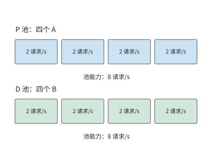

*图 9-9：每个 A 在 P 阶段提供 2 请求/s，每个 B 在 D 阶段也提供 2 请求/s。两池均为 8 请求/s，低于给定链路约 20.7 请求/s 的交接能力。*

分离后，两类 worker 都避开了各自较慢的阶段，请求率上界从 3.2 增至 8 请求/s，增至原来的 2.5 倍。模型仍处理同样的 8192 个输入 token 与 128 次 decode，差别在于由谁执行。

再作一个对照：假设八个 worker 完全相同，每请求 P、D 各占 1 秒。共置上界为 $8/(1+1)=4$ 请求/s；四个做 P、四个做 D，两池也都只能提供 4 请求/s。一个请求在分离前后都消耗两个资源秒，所以仅改变执行位置无法突破四请求/s。[^pool]

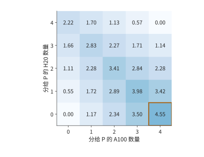

*图 9-10：阶段配比如何限制请求率。两类 worker 各四个，能力见例 9.2；横纵轴为分给 P 的数量，其余分给 D。每格取两池能力与 25 GB/s 链路容量的最小值，不含排队；颜色深浅表示可持续的请求率，单位为请求/s。A、B 是例 9.2 中分别更擅长预填充和解码的两类 worker。*

图 9-10 还给出了偏离最优配比后的吞吐率变化。把一个 A 从 P 调到 D，P 从 8 降为 6 请求/s，D 从 8 增为 8.5 请求/s，结果受 P 限制而降至 6。把一个 B 从 D 调到 P，P 增为 8.5，D 却降为 6，同样变慢。最优配比使两池都达到八请求/s。改变配比后，一个池即使有富余能力，也无法替另一个池完成工作。

### 9.2.4 不同请求与负载下的收益边界

现在只改变一个条件：前缀命中。P 已经缓存了前 6144 个 token，只需处理剩下的 2048 个，即原来的四分之一。一个 A 的 P 能力于是从 2 增至 8 请求/s；若仍给 P 四个 A，它们合计能处理 32 请求/s，D 却仍只能处理 8 请求/s。

把两个 A 调到 D，留下的两个 A 提供 16 请求/s 的 P 能力；D 则由两个 A 与四个 B 提供 $2\times0.5+4\times2=9$ 请求/s。总体吞吐率上限提高到 9 请求/s。再调走一个 A，P 只剩 8 请求/s，反而更慢。假定 D 没有缓存这段前缀，因此两种配比仍须交接完整的 1.125 GiB；P 的计算量减少了四分之三，但传给 D 的 KV 大小没有变化。

再恢复原始输入，把输出从 129 个增加到 1025 个 token。D 调用数从 128 增至 1024，增至原来的八倍；A、B 的 D 能力分别降为 $1/16$ 和 $1/4$ 请求/s。一个 A 做 P 已能提供 2 请求/s，其余三个 A 与四个 B 做 D，合计为 $3/16+4/4=19/16$，约 1.19 请求/s。两个 A 做 P 则只剩 1.125 请求/s 的 D 能力，更不划算。与原来四 P、四 D 相比，长输出将资源需求推向 D；若仍以 4 请求/s 到达，队列就会持续增长。

图 9-11 将三次调整画在同一组计算资源上。每个方块都是原来的一个 worker，变化的只是它承担的阶段。前缀命中后 P 的工作减少，可以让出两个 A；输出变长后 D 的工作增加，则要再给 D 一个 A。

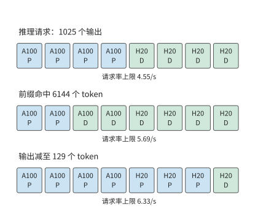

*图 9-11：请求组成改变资源分配。两类 worker 各四个，处理速度沿用例 9.2；第二行只减少 P 的新输入，第三行恢复完整输入并将输出增至 1025 个 token。方块表示执行单元数量，每行下方为对应的吞吐率上限。P 为预填充池，D 为解码池；A、B 是例 9.2 的两类 worker。*

这三种请求最合适的 P 单元数分别是四个、两个和一个。前缀命中减少 P 的新工作，输出增长增加 D 的重复工作，两者都要求提高 D 的资源比例，只是前者的输出长度没有变。由此可以把调度分成两个时间尺度：请求到达时选择进哪个队列，负载分布持续变化时调整池的规模。队列分配决定眼前等待，池规模决定积压能否长期消退。

## 9.3 Attention–FFN 分离与异构执行

### 9.3.1 Attention、FFN 与专家的执行边界

AF 指注意力与前馈网络的分工。与 PD 一次划分两个生成阶段不同，AF 在模型层内划分计算：注意力产生隐状态，前馈网络或被选中的专家处理它，再把结果送回，供后续算子使用。下一层通常要等这个结果，因此小数据量传输的启动与同步会重复很多次。

混合专家模型（MoE）由路由器为每个 token 选择一部分专家网络，特别适合这种分工。总专家权重很大，但一个 token 只选择其中一部分。若大多数专家保存在主存，可以将被选中的权重搬给 GPU，也可以让 CPU 使用本地权重完成计算，再传递较小的激活。前一条路径花链路带宽换 GPU 算力，后一条路径花 CPU 算力换较少的链路流量。怎么选取决于本次分派给同一个专家的 token 数：每个 token 的特征向量占该专家输入矩阵的一行，这些行复用同一份专家权重。

### 9.3.2 CPU／GPU 协作

一份专家权重已经放在主存里，GPU 上的输入需要用它计算。可以把整份权重搬到 GPU，也可以把输入送到 CPU，让 CPU 在权重所在的位置完成计算，再把结果传回。两条路径交付同一份输出：前者跨链路传输权重，后者传输输入和输出。先沿图中的箭头看清传什么，再比较字节数和计算时间。

第 8.4.3 节采用第一条路径，将权重暂存主存，使用时搬到 GPU。KTransformers 是采用第二条路径的实际系统：GPU 处理注意力和部分常驻专家，CPU 处理分给自己的专家；提交 CPU 的工作后，GPU 执行可以并行的分支，最后同步并合并结果。热点专家、共享专家以及 prefill 阶段可以采用不同的计算资源分工。分支汇合时，下一层必须等两侧都完成后才能开始。[^kt]

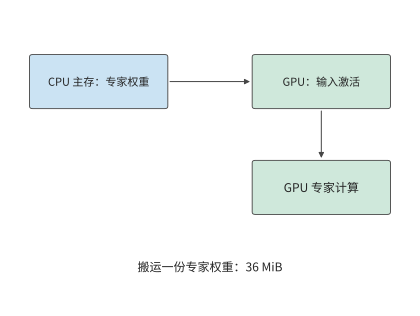

*图 9-12：把一份 36 MiB 专家权重从主存送到 GPU，再由 GPU 读取本地输入完成计算。*

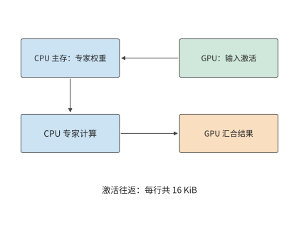

*图 9-13：输入从 GPU 交给 CPU，CPU 使用主存权重执行专家，结果回到 GPU。每次 token 到专家的分派，传入和传出的特征向量合计 16 KiB；并行的 GPU 常驻专家分支完成后再汇合。*

对 Qwen3-235B-A22B，一个专家包含三个矩阵，参数数量为 $3\times4096\times1536=18874368$。BF16 权重为 36 MiB。

**例 9.3　专家权重复用如何改变 CPU 与 GPU 的执行选择？** 设有效 CPU 算力为 2 TFLOP/s、DRAM 带宽为 200 GB/s，GPU 算力为 100 TFLOP/s、HBM 带宽为 1000 GB/s，交接带宽为 25 GB/s，每次启动为 5 μs，BF16 激活宽度为 4096。八个专家依次执行，总时间为各专家耗时之和，权重每批读取一次。每个专家只收到一个 token 的特征向量时，CPU 直接读本地主存里的权重，省去了在较慢链路上搬 36 MiB；随着每个专家的输入行数增加，搬一次权重的开销由更多行的计算分摊，CPU 却更早碰到算力上限。

先看八个热点专家各处理一个 token：权重合计 288 MiB。在 200 GB/s 主存上读取约 1.5 ms，加激活交接后 CPU 路径约 1.6 ms；搬到 GPU 的路径仅传权重就约 12.1 ms，连同启动与 GPU 计算约 12.4 ms。低复用时，避免大块权重搬运比提高矩阵算力更有价值。

若这八个专家各处理 128 个 token，权重仍是 288 MiB，计算量却增至原来的 128 倍。CPU 路径增至约 20.1 ms，GPU 路径约 12.5 ms，此时在 GPU 上计算更快。图 9-14 画出了中间过程：按题设参数，每个专家的输入从 78 个 token 增到 79 个时，GPU 开始比 CPU 快；交点附近两条路径都约 12.4 ms。每个专家每多处理一个 token，CPU 多花的计算时间远多于 GPU，而权重搬运的开销不变，所以过了交点 GPU 就占优。[^locality]

将上述数字写成一般形式。记专家参数数量为 $P_e$、权重字节数为 $W_e$，输入宽度为 $h$、每元素字节数为 $b$。若同一个专家本批收到 $m$ 个 token，其矩阵计算量为 $F_e(m)=2mP_e$ FLOPs，权重至少需要被访问一次。设有效 CPU 算力、DRAM 带宽分别为 $C_C,B_D$，GPU 算力、HBM 带宽为 $C_G,B_H$，交接带宽为 $B_L$。假定权重与激活已经转换为执行所需的格式，交接与专家计算串行发生，算子时间取计算与权重读取两项中的较大值，则单个专家在两种执行方式下的耗时分别为

$$
T_C(m)=2\alpha+\frac{2mhb}{B_L}
+\max\left(\frac{2mP_e}{C_C},\frac{W_e}{B_D}\right),
$$

$$
T_G(m)=\alpha+\frac{W_e}{B_L}
+\max\left(\frac{2mP_e}{C_G},\frac{W_e}{B_H}\right).
$$

前式将输入传输、CPU 上的专家计算和输出传输三段时间相加；后式先搬一份权重，再执行 GPU 计算。公式中的 $\alpha$ 是每次交接的固定代价。输入激活先到 CPU，输出激活在计算后返回，式中的两次启动和往返载荷正对应这两条依赖边。

硬件变化可以用同一组公式估计。若有效主存带宽从 200 降到 100 GB/s，八份权重的读取时间从约 1.5 增至 3.0 ms；单 token 情形明显变慢，而每专家 128 个 token 时，CPU 仍主要受约 19.3 ms 的矩阵计算时间限制。就地计算是否划算，由当前的主要瓶颈决定：读取受限时提高主存带宽有用，计算受限时提高矩阵吞吐有用。非统一内存访问（NUMA）把内存分到不同 CPU 附近，跨节点读取要经过处理器间互联。跨 NUMA 读取会降低有效主存带宽，矩阵内核与量化格式则会改变有效矩阵吞吐率。[^kt-audit]

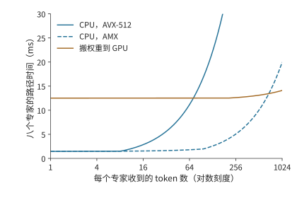

*图 9-14：专家复用改变执行位置的选择。八个专家各有 36 MiB BF16 权重，有效 CPU／GPU 算力为 2／100 TFLOP/s，DRAM／HBM 带宽为 200／1000 GB/s，交接为 25 GB/s、每次启动 5 μs。曲线按例 9.3 计算单层专家路径，未含 NUMA 和格式转换。*

### 9.3.3 容量、并发与专家复用对服务能力的影响

能否装下权重和能否及时完成请求，是两个不同的问题。Qwen3-235B-A22B 每层 128 个 BF16 专家共占 4.5 GiB。若每层固定 32 个专家驻留 GPU，单层为 1.125 GiB，94 层合计约 106 GiB。即使一张卡能腾出 80 GiB，也装不下这组常驻专家；还需在多卡间切分，或减少每层驻留数量。把每层驻留数减到 16，这部分权重降到约 53 GiB，但也把更多专家的执行交给了主存一侧。容量选择由此直接改变请求的执行路径。

一个 token 选择八个专家，并不意味着一个批次也只访问八个专家。设一批有 64 个 token，每个选择八个专家，共有 512 次分派。如果它们均匀覆盖全部 128 个专家，每专家处理四行；如果所有 token 都选择同样的八个专家，每专家处理 64 行。两种情况下专家矩阵的有效计算量都是 $512\times2\times18874368$，约 19.3 GFLOPs。

假定批内每份专家权重只读取一次，均匀分派读取 $128\times36=4608$ MiB，即 4.5 GiB；集中分派读取 $8\times36=288$ MiB，相差 16 倍。在同一条 200 GB/s 数据读取通道上，单看权重读取约为 24.2 ms 与 1.5 ms。计算量相同，需要读取的权重总量却相差一个数量级。

下面两图把这两个批次画成面积相同的矩形。宽度表示访问了多少个专家，高度表示每个专家处理多少行；面积对应分派总数。矩形变窄、变高时，计算量不变，需要读取的权重总量却减少了。

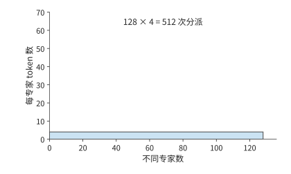

*图 9-15：512 次分派覆盖 128 个专家，每专家四行。矩形宽为专家数，高为每专家行数，面积为分派次数。*

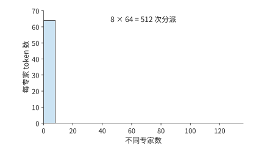

*图 9-16：八个专家各处理 64 行，总面积仍为 512。两图横纵轴相同，权重读取却从 4608 MiB 降至 288 MiB。*

于是，总专家数决定需要安排多少权重，分派次数决定这一批的有效矩阵计算量，批内专家集合决定需要访问哪些权重。图 9-14 已说明，输入行数决定 CPU 与 GPU 哪一侧更快。这里还要补上另一个量：一批请求究竟会访问多少个专家。知道这个数量，才能将单专家的结果扩展到整个批次。

除完全均匀和完全集中这两种情况外，还可以分析随机路由平均会访问多少个专家。设每个 token 独立、均匀地从 $E$ 个专家中选择 $K$ 个不同专家，一个指定专家被一个 token 跳过的概率为 $1-K/E$，被全部 $M$ 个 token 跳过的概率为 $(1-K/E)^M$。用 1 减去这一概率，再对 $E$ 个专家求和，得到批内活跃专家数的期望值

$$
\mathbb{E}[U]=E\left[1-\left(1-\frac{K}{E}\right)^M\right].
$$

代入 $E=128,K=8,M=64$，期望约 126 个专家，理想权重读取约 4.43 GiB，接近上述均匀覆盖情形。随着批量继续增长，被访问的不同专家数最多到 128 就不再增加，分派次数却继续线性增加，新增的 token 于是越来越多地复用已经读入的权重。

这一分析也说明，配备大容量主存和少量 GPU 的服务器，更适合每个专家输入行数较少的负载。DeepSeek V4-Flash 公开的单张 RTX 5090 配置要配至少 200 GB 主存，Kimi K2 采用 Q4_K_M 分组量化的配置（以 4 比特为主，部分张量采用更高位宽）需要约 600 GB 主存。主存解决了总权重的容纳问题；请求批量增大后，瓶颈仍可能从权重读取转到 CPU 矩阵计算。图 9-14 的交点正对应这种变化：增加并发，既摊薄读取权重的代价，也逐渐耗尽 CPU 计算能力。[^capacity]

### 9.3.4 跨机 AF、专家分离与微批次流水

在 MoE 中，可以把路由专家放到独立的专家资源池，由保留注意力与 KV 的 worker 发送激活并接收专家结果。这称为**专家分离**（Expert Disaggregation），也常叫 EP 分离；本书用“专家分离”指部署边界，用 EP 指专家并行度。它是本节注意力与专家计算分工的一种形式，具体系统还要说明共享专家、路由器和前后投影分别放在哪一侧。

**大 EP** 则指一个专家并行组跨越较多的卡。它让每张卡只保存少量专家，并汇聚多个 attention worker 的输入，使专家拿到足够大的矩阵批次。大 EP 不必采用独立专家池：同一张卡也可以同时执行注意力和自己持有的专家；独立专家池也不必只有一个很大的 EP 组。DeepSeek-V3/R1 的公开推理报告分别给出 prefill EP32 与 decode EP144，并采用冗余专家和多类负载均衡；这说明大 EP 的实际用途，但这组规模本身不能证明注意力与专家已经分到两套设备上。[^ep-system]

扩大 EP 并不自动扩大每个专家的批量。若本批有 $n$ 个 token、每 token 选择 $k$ 个专家、共有 $E$ 个逻辑专家，均匀路由下每专家平均只有 $nk/E$ 行。例如 $n=1024,k=8,E=256$ 时为 32 行；只把同样的 256 个专家从 32 张卡摊到 128 张卡，这个平均值仍是 32，减少的只是每卡的专家数。汇聚更多输入才能增大每个专家的批次，却也会扩大通信范围、同步范围和排队时间。批次固定时，参与的卡越多，每卡平均任务越少，少量集中分派或晚到就越容易拖长尾部；偏斜是否加剧仍要用实际路由与放置验证。

专家池可以独立增加副本、选择不同算力／内存配比，并从多个 attention worker 汇聚任务。代价是原本可以在本地执行的专家输入也要跨池传送，网络成了两池共享的资源。只有多个独立 EP 组各保存一套完整的专家集合，它们才是可以分别接收任务的服务副本；只添加保存部分专家的卡，并不能让每条请求随意绕开繁忙的专家。共享专家池的队列、显存、模型版本和接纳策略要当作一个整体来管理。

把 AF 从同一台服务器扩展到跨服务器后，每次传输的启动时间、链路带宽以及各节点开始执行的时间差都会有更大影响。MegaScale-Infer 是采用注意力与专家计算分离的分布式推理系统。它让微批次在注意力节点与专家节点之间交错执行，形成交替的流水：一个微批次执行注意力时，另一个微批次执行专家计算。理想情况下，若两个阶段每微批次需要 $t_A,t_F$，忽略交接，处理 $q$ 个独立微批次的双阶段流水需要 $t_A+t_F+(q-1)\max(t_A,t_F)$。其中首个微批次花费 $t_A+t_F$，之后每隔较慢阶段的一个服务周期完成一个微批次。跨层时，返回激活将上一层的结束连接到下一层的开始。

MegaScale-Infer 的实验为这种部署提供了实际证据。其 2025 年论文使用 Mixtral-8×22B、DBRX 与 317B 的 Scaled-MoE，权重、激活和 KV 均为 BF16，生产请求的输入／输出长度中位数为 571／159 个 token。评估约束是每个输出 token 的平均耗时（TPOT）不超过 150 ms；在八个节点、每节点八张 80 GB Ampere GPU 的同构集群上，Scaled-MoE 的每 GPU decode 吞吐达到 TensorRT-LLM 的 1.90 倍。这个结果包含分离放置、并行选择、流水和通信库的共同效果，不能当作“只开启 EP 分离”的通用加速比。论文也明确按专家热度配置冗余副本并最小化最忙节点的成本，说明独立专家池仍要处理负载偏斜。[^ep-papers]

例如，注意力与专家阶段每个微批次分别需要 2 ms、3 ms。四个微批次串行执行共需 20 ms；理想双阶段流水只需 $2+3+3\times3=14$ ms，省下 6 ms。若拆小微批次后每阶段的实际服务时间变长，或者无法与计算重叠的往返通信超过 6 ms，这项收益就没有了。因此，通信和计算效率下降带来的额外耗时合计必须小于 6 ms，流水执行才更快。[^af]

**例 9.4　注意力与前馈网络逐层交接会增加多少通信开销？** 在 Qwen3-8B 的示例部署中，把 36 层稠密前馈网络放在另一侧，每层发送一个完整 BF16 隐状态向量，并返回同样大小的结果。单向传输一次的数据量为 $4096\times2=8192$ bytes；一步 decode 合计 72 次、576 KiB。25 GB/s 下纯载荷约 23.6 μs，72 次 5 μs 启动合计 360 μs，串行交接约 0.384 ms。

这段时间短于例 9.1 中的一次 PD 交接，但两者对应的工作范围不同。若生成 129 个输出，后续 128 次 decode 的 AF 串行交接累计约 49.1 ms；8192 个输入 token 的 prefill 若也按整批稠密 AF 交接，激活载荷为 4.5 GiB，约需 193 ms 纯传输，再加启动。一次 PD 搬运与逐层 AF 往返的区别在这里显现出来：前者随上下文长度增长，后者还随生成步数反复发生。

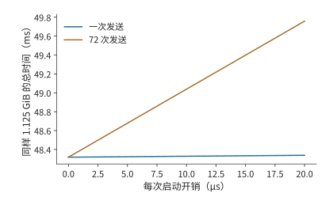

*图 9-17：相同总载荷下，传输次数放大启动开销。两条曲线总载荷均为 1.125 GiB、有效带宽均为 25 GB/s，分别串行发送 1 次和 72 次；差值为 $71\alpha$，纵轴从 48.2 ms 起以显示差异。这样保持总字节数不变，只比较传输次数的影响；实际一步 AF 只传 576 KiB。*

保持总字节数相同，更容易看清传输次数的影响：把同一份 1.125 GiB 载荷分成 72 次串行交接，载荷时间不变，启动开销比一次交接多 $71\alpha$，在本例中约为 0.36 ms。PD 往往先受大块 KV 搬运的影响，AF 则更容易受小数据量传输的延迟和操作间依赖的影响。下一节考察 MoE 中的激活传输：一个输入可能发往多个执行位置，完成时还要等它选中的各个专家都返回结果再汇合。

## 9.4 专家放置、复制与负载均衡

### 9.4.1 大 EP 中的计算与通信偏斜

上一节中，集中复用减少了权重读取。但这些热点专家如果都放在同一张卡上，其他卡就帮不上忙。本节继续跟踪同样的 512 次分派，考察各张卡何时完成计算。即使全系统的总计算量不变，最忙的那张卡也可能让整层推迟完成。对卡 $r$，记矩阵计算量为 $F_r$、需要读取的权重字节数为 $W_r$，有效算力和带宽分别为 $C_r$、$B_r$。这张卡完成计算与权重读取的时间至少为 $\max(F_r/C_r,W_r/B_r)$；合并各卡的结果时，必须等耗时最长的卡完成。

把上一节的 512 次分派放到八张卡上，可以看到集中路由的另一面。若各卡恰好分到 64 次任务，每卡处理约 2.42 GFLOPs；若八个热点专家都位于一张卡，该卡处理全部约 19.3 GFLOPs。假设每卡有效算力都为 100 TFLOP/s，只看计算，最忙卡的服务时间从约 24 μs 增到 193 μs，增至原来的八倍。

图 9-18 中，横条的长度表示各卡完成计算所需的时间。所有结果合并后才能进入下一层，因此决定完成时刻的是最长的一条，而不是八条的平均长度。

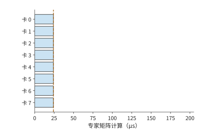

*图 9-18：总计 512 次专家分派均分到八张卡，每卡 64 次；虚线表示全部计算结束、可以汇合的时刻。*

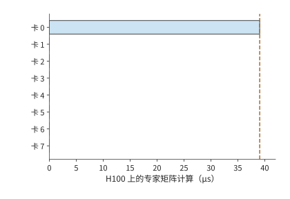

*图 9-19：512 次全部落在卡 0，其他卡空闲。相同总计算量，需要等待卡 0 完成；两图使用相同时间尺度。*

集中路由将需要读取的权重从 4.5 GiB 减少到 288 MiB，却可能把最忙卡的计算量增至原来的八倍。前者有利于读取受限的执行，后者不利于计算受限的执行。均衡策略因此要先确定瓶颈所在，再决定是追求复用还是分散工作。

通信量也取决于 token 最初在哪张卡上。在第 9.1 节的 TP2×EP4 布局中，各 EP 组处理同一批请求，每个 EP 组的成员已经持有相同的隐状态输入，跨 EP 组的派发（dispatch）可以为零，结果通过部分和归约合并。另一种布局让各张卡持有各自不同的输入 token，就可能要把激活派发给远端专家。输入已复制时，通信集中在结果合并；输入分属不同的卡时，执行前还多出一次远端派发。通信量由 token 的起点、专家的位置与结果的归属共同决定。

大 EP 中的**偏斜（skew）**至少要分三个层次观察。逻辑专家的选择频率决定每个专家的有效行数；专家放置与副本选择把这些行数变成每卡负载；token 的来源、目标和网络路径再把它们变成每个方向的流量。专家热度不均未必造成卡间不均，卡间计算均匀也未必让共享链路均匀。第 6.3.2 节的批内复用解释权重读取，本节继续核算逐卡计算、通信与完成时间。

设 $a_{ij}$ 是来源 $i$ 发给专家组 $j$ 的 token—专家分派次数，每份输入与输出分别为 $d_D,d_C$ bytes。在按分派传送、无去重与预归约的方案下，

$$
V^D_{ij}=a_{ij}d_D,\qquad V^C_{ji}=a_{ij}d_C,\qquad
m_j=\sum_i a_{ij},\qquad
s_{\mathrm{expert}}=\frac{\max_j m_j}{nk/R}.
$$

这里 $R$ 是接收专家组数，$\sum_jm_j=nk$。$s_{\mathrm{expert}}=1$ 表示组间有效任务均衡；同型专家、相同精度且忽略 padding 时，它才近似等于计算量偏斜。对通信阶段 $X\in\{D,C\}$，把矩阵按发送方、接收方和物理割集统计，有

$$
T_X\ge\max\left(
\max_i\frac{\sum_jV^X_{ij}}{B^{\mathrm{send}}_i},
\max_j\frac{\sum_iV^X_{ij}}{B^{\mathrm{recv}}_j},
\max_{\mathcal C}\frac{V^X_{\mathcal C}}{B_{\mathcal C}}
\right).
$$

这是载荷传输下界，不含启动、排队与数据晚到；同一物理方向的并发流量需要相加，不能把多条流各自除以一份完整带宽后假定同时完成。带宽 skew 在这里指各张卡、各条链路的需求或占用不均，硬件的额定带宽并没有变。

**例：总通信量相同，为什么热点让两次交换都变慢？** 沿用第 7.2.3 节的 1024 个 token、每 token 选 8 个专家与 8 KiB 向量，现在全部分派都跨入四个专家组，每个组由一张卡执行、拥有独立的 25 GB/s 双向接口。四个来源各发送 2048 份，dispatch 总计 64 MiB，combine 也是 64 MiB。两池之间每方向割集带宽为 100 GB/s。均衡时每组接收 2048 份，即 16 MiB；热点分布为 $[5120,1024,1024,1024]$ 时，组 0 接收 40 MiB，另外三组各 8 MiB。两种分布的总通信量和总有效计算量相同，专家 skew 却从 1 变为 2.5。

每份专家计算按 Qwen3 MoE 示例的 $6\times4096\times1536$ FLOPs 计，有效算力假设为每卡 100 TFLOP/s。暂不计权重读取、padding、启动与排队，得到下表。最后一列仅适用于三个阶段之间设整批屏障的执行，是三个下界之和；有重叠时须另算关键路径。[^ep-calc]

| 分布与路径 | dispatch 下界 | 最忙卡计算下界 | combine 下界 | 阶段屏障总下界 |
|---|---:|---:|---:|---:|
| 四组均衡，割集 100 GB/s | 0.671 ms | 0.773 ms | 0.671 ms | 2.115 ms |
| 热点组，割集 100 GB/s | 1.678 ms | 1.933 ms | 1.678 ms | 5.288 ms |
| 四组均衡，割集仅 25 GB/s | 2.684 ms | 0.773 ms | 2.684 ms | 6.142 ms |
| 热点组，dispatch 改为 FP8 | 0.839 ms | 1.933 ms | 1.678 ms | 4.449 ms |

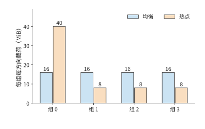

*图 9-20：四个专家组在 dispatch 阶段接收、combine 阶段发送的载荷。均衡与热点分布总计均为每方向 64 MiB；热点组在两个阶段都承担 40 MiB。柱高表示字节需求，不表示测得的瞬时带宽。*

热点同时拉长接收、计算与返回。把热点分散后，若共同割集只有 25 GB/s，仍需每方向至少 2.684 ms，说明增加专家卡不能替代跨池带宽。只把 dispatch 改为 FP8，也不会同比缩短 BF16 combine 或专家计算；表中假设量化不改变计算时间，并忽略尺度元数据，目的是分开看这几项影响，不是量化性能的预测。

### 9.4.2 专家副本、放置与动态调整

图 9-19 中集中在少数卡上的工作提示了一个改进方向：把热点专家的副本放到空闲卡上，让这些卡也能处理热点任务。专家复制让同一个逻辑专家拥有多个物理副本，调度器可以把任务分给这些副本。只要副本的权重相同、路由权重用得正确、结果合并无误，复制就不必改变每个 token 选分数最高的 k 个专家这条规则（top-k）；修改专家选择规则会改变模型行为，两者要分开评价。vLLM、SGLang 的专家负载均衡机制（EPLB）根据路由统计，调整各逻辑专家的副本位置和任务分配。

专家副本占用显存，也会挤占 KV 和缓冲。每卡每层增加一个 36 MiB 专家，94 层共需 3384 MiB，约 3.30 GiB；若只为八个最拥挤的层各增加一个副本，则只需 288 MiB。两者相差近 12 倍。CRAFT 是研究专家副本与显存分配的服务系统，它要解决的正是这个各层显存怎样分配的问题：把空间花在最能缩短等待的层，而不是机械地给每层同样多的副本。[^moe]

**例 9.5　热点专家副本需要多少批次才能收回复制成本？** 在八张卡之间增加七份专家副本，共 252 MiB；七张接收卡各增加 36 MiB，都放得进 64 MiB 的额外可用空间。假设这次复制准备需要约 10.6 ms，此后每批从约 0.92 ms 缩短到 0.52 ms，节省约 0.40 ms。按未经四舍五入的执行时间，节省时间超过复制时间所需的最少批数满足

$$
N\Delta t>T_{copy},\qquad
N_{min}=\left\lfloor\frac{T_{copy}}{\Delta t}\right\rfloor+1=27.
$$

若热点持续 16 个批次，节省约 6.4 ms，还不足以抵消 10.6 ms 的准备时间；持续 64 批时，节省约 25.8 ms，扣除准备后净省约 15.2 ms。图 9-21 将一次投入与逐批收益画在同一条线上。若接收卡只有 32 MiB 空间，连一份 36 MiB 专家也放不下，此时无论热点持续多久，都应先改变放置或腾出容量。[^replica]

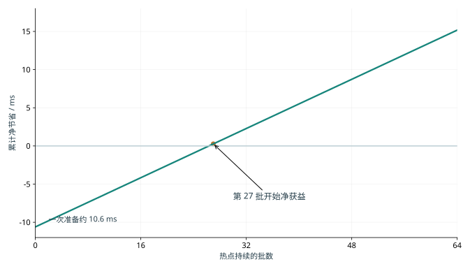

*图 9-21：热点持续多久，专家复制才值得。一次准备约 10.6 ms，每批节省约 0.40 ms；曲线使用例 9.5 中未经四舍五入的时间计算，第 27 批开始净获益。七张接收卡各需额外 36 MiB，假设容量足够且热点不变。*

CRAFT 的实测进一步表明，复制收益与层有关。该研究基于 SGLang v0.4.8，在八个 AWS p4de.24xlarge 节点组成的 A100 80GB 集群上运行 BF16 的 DeepSeek-R1 和 Kimi K2，比较显存预算内按层分配专家副本与既有复制策略的效果。论文报告端到端吞吐平均达到对照的 1.14 倍、最高 1.2 倍。这说明把副本预算优先给收益大的层是对的，但不表示任意热点复制都能得到这一增幅；其输入按 4096 个 token 分块、输出固定为 256 个 token 等实验条件，以及按有效吞吐（goodput）定义的容量拐点，也不能直接替代线上的 P99 指标。[^ep-papers]

副本策略要预测的是热点还会持续多久。若统计窗口结束时热点只剩 16 批，复制将多花约 4.2 ms；若还剩 64 批，则净省约 15.2 ms。每次重新复制都要再花 10.6 ms，所以频繁跟着热点迁移副本，会推迟收回复制成本的时间。将容量优先分给持续拥挤的层，才能让累计节省的等待时间超过准备耗时。

均衡策略还要沿完整路径选择控制对象。来源侧要平衡 token 数与注意力的就绪时间；专家侧要平衡有效行数、实际 GEMM 时间和接收量；网络侧要检查共享出口、跨机架流量与返回方向。DeepSeek 的公开报告把 prefill、decode 与 EP 负载均衡分别处理，原因就在这里。长上下文 decode 即使每卡请求数相同，注意力的 KV 读取量仍可能不同，最终形成不同的 dispatch 发起时刻。[^ep-system]

在独立专家池中，还要控制跨来源的排队。多个 attention worker 可能同时选中同一个热点专家，即使它们各自的小批次看起来均衡，汇合后的流量也可能超过这个专家的服务能力。若池每秒接纳 $\lambda$ 批，每批平均在专家卡 $j$ 上产生 $\mathbb E[F_j]$ FLOPs，则稳定运行至少需要 $\lambda\mathbb E[F_j]<C_j$；每条链路 $\ell$ 还需满足 $\lambda\mathbb E[V_\ell]<B_\ell$。平均负载满足这些条件只是必要条件，突发和重尾输入仍会造成很长的队列。共享池有时能汇聚批次、平滑各来源的波动，有时会放大相关的热点，不能直接假定分离会消除 skew。

热点副本应放到同时有计算余量、链路带宽余量和网卡报文处理余量的位置（第 7.2.4 节）。动态选择副本时要计入队列和路径，并保留当前批次使用的路由映射直至 combine 完成；迁移或回收旧副本前要排空在途任务。对热点设置接纳额度、限制单个来源的在途量，可以避免它耗尽整个池的缓冲；因此增加池容量时，要同时调整接纳额度与背压。丢弃溢出 token、改变 top-k 或替换逻辑专家会改变模型行为，不能当作透明的资源均衡。

### 9.4.3 输入分发、计算与结果合并的重叠

《Demystifying the Mixture of Experts Serving Tax》从各阶段的微基准解释另一种影响：prefill 的计算不均会让最慢的卡拖住整批，decode 的专家集中却可能通过减少活跃权重和 padding 降低访存成本。这与第 6.3.2 节的复用分析一致。论文的 Mixtral／Qwen2 MoE 使用八张 A100，DeepSeek-V3 使用八张 B200，通信微基准另有 8／16 张 H200；这些结果不能合成一个跨集群的端到端加速比。它提供的证据说明，路由、实际矩阵形状、通信和内存访问要一起测量。[^ep-papers]

分组通用矩阵乘法（Grouped GEMM）把多个专家矩阵组织成一个执行批次，内核按照分块要求补齐各矩阵的行数。例如八个本地专家收到 $[32,16,8,4,2,1,1,0]$ 个 token，合计 64 次 token 到专家的分派，对应输入矩阵中的 64 个有效行。若每个非空专家补齐到 32 行，需要 224 行；若八个专家都按最大值补齐，需要 256 行。实际执行的行数分别为有效行数的 3.5 倍和 4 倍。这解释了为什么有效任务数相同，矩阵时间仍可能不同：硬件执行的是补齐后的矩阵，模型所需的专家计算只对应其中 64 个有效行；补齐的零行没有对应的真实 token。

假设 dispatch、专家计算与 combine 分别需要 0.2、0.6、0.2 ms，完全串行为 1.0 ms。若能均分成两个微批次，各阶段时间减半，理想三阶段流水为 $0.1+0.3+0.1+0.3=0.8$ ms，只省下 0.2 ms。若 HBM 争用使每个微批次的计算耗时从 0.3 增至 0.4 ms，同一流水就回到 $0.1+0.4+0.1+0.4=1.0$ ms。通信确实重叠了，整批却没有变快。

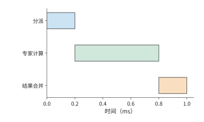

*图 9-22：整批依次分派 0.2 ms、计算 0.6 ms、合并 0.2 ms，总时间 1 ms。*

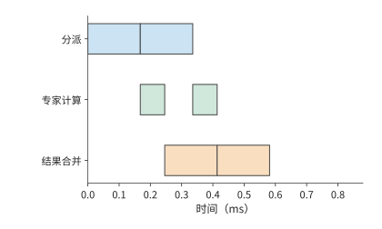

*图 9-23：每微批次各阶段时间减半，三条轨道使用独立资源。第一微批次计算时可以分派第二微批次，总时间降到 0.8 ms。*

沿图 9-23 的时间线看，第一个微批次计算时可以派发第二个微批次；第一个微批次合并时，第二个微批次已经开始计算。第一批的派发负责填充流水，最后一批的合并负责收尾，这两段是流水之外的串行时间。

上面的流水假设两个微批次大小均匀。真实的专家分离中，一个 token 的路径仍然是“dispatch → 所选专家计算 → combine”，**两次通信阶段**夹着专家计算。dispatch 的数据就绪偏斜来自注意力的完成时间和发送队列；专家计算的偏斜又变成 combine 的发送就绪偏斜。即使两次交换的字节数完全对称，返回阶段也可能因为数据晚到而拖长。

对 token $t$，令所选专家集合为 $\mathcal E(t)$，从当前层起点到专家 $e$ 的排队、分派、计算与返回的累计路径长度为 $L_{t,e}$。其合并完成时刻满足

$$
T_t=\max_{e\in\mathcal E(t)}L_{t,e}+T_{\mathrm{merge},t}.
$$

这里每条路径都包含共享资源上的排队，不能把各阶段单独运行的时间直接代入并假定互不干扰。若某 token 的两条分支分别在 0.5 ms 和 1.4 ms 返回，它要等到 1.4 ms 后才能合并；只把快的那条分支降到 0.3 ms 不会改变它的完成时刻。逐 token 或逐块推进时，没有选中慢专家的 token 可以更早继续；整批屏障则让它们一起等。运行时是否真正支持细粒度推进、后续矩阵是否还要求凑批，决定了等待会传播多远。

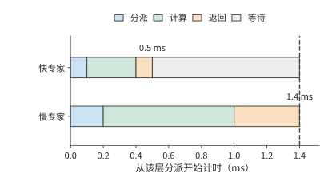

*图 9-24：一个 token 选中的两条专家分支，教学时长分别为 0.5 ms 与 1.4 ms。每条都依次经过 dispatch、计算与 combine；同一个 token 要等两份结果，图中忽略本地加权合并的时间。灰色表示快分支的结果到达后的等待。*

这也解释了为什么不能总用一个 $\max(t_A,t_F)$ 来预测专家池的流水周期。这个式子要求各阶段耗时稳定、资源独立、工作能持续供给；实际周期还受最忙专家、往返链路、返回缓冲和跨层依赖的约束。同一个专家池若为多个层或多个模型服务，必须合计它们占用的资源。第一个微批次仍要承受完整的往返延迟，提高稳态吞吐并不等于缩短单个 token 的响应时间。

NCCL 提供通用的集合通信与点对点原语，专用的 EP 通信库则把路由、打包、传输和合并放在一起实现。DeepEP 提供 MoE dispatch／combine 和低精度传输支持；V2 的公开接口使用 ElasticBuffer，底层采用 NCCL Gin，并移除了 V1 的零 SM RDMA 低延迟 EP 路径。这说明库名相同也不能省略版本条件。比较实现时，应固定版本、数据形状、精度和拓扑，分别记录发送／接收字节数、expert GEMM 行数、padding、每阶段的就绪与完成事件，再看整个层和整条请求耗时的 P50／P99。单独测得的通信带宽只能解释其中一部分。[^ep-system]

复算本节时，可先保持总分派数不变，只改变专家分布；再固定分布，改变共享出口和 dispatch 精度；最后在跟踪记录中改变一个来源或专家的就绪时间。前三项由配套计算直接重现，最后一项要在执行时间线中观察等待如何传播。这样才能区分流量偏斜、计算偏斜和单纯晚到造成的等待，不会把所有慢通信都归咎于网络带宽不足。[^ep-calc]

专家执行有两项相互作用的成本：补齐扩大了矩阵计算量，并发的传输又可能拖慢这些计算。上面的流水靠重叠省下 0.2 ms，一旦计算累计多花同样的时间，重叠的收益就全部抵消了。[^expert-exp]

## 9.5 KV 的分布、共享与请求路由

### 9.5.1 缓存标识、共享范围与可用状态

前两节靠改变执行位置和任务分配，减少了当前请求的耗时。另一种节省计算的方法，是让后续请求直接使用前一次计算留下的 KV。第 8.3 节已经说明分页、前缀匹配、共享和淘汰的机制。本节接着考虑状态分布在不同执行位置时，怎样确认匹配、找到数据并完成传输。前缀缓存的价值来自避免重复执行，但“相同文本”不足以唯一确定所有可复用状态。模型与适配器（adapter，附加在基础模型上的参数模块）版本、token 序列、位置索引、状态格式以及必要的编码配置都可能参与缓存标识的计算。例如，同样的 token 配上不同的 adapter，投影后会得到不同的 K、V；同样的后缀接在不同的前文后面，注意力看到的上下文也不同。缓存键需要沿前缀链标识出生成这份状态的整个计算。滑动窗口状态或递推状态则还要携带对应的 token 位置索引与更新时刻，才能从同一个状态继续。

确认两份状态可以相互替代之后，还要确定它们存在哪里、其他实例怎样读取。容量相加并不会自动形成共享缓存。两个实例各有 4 GiB 私有的主机内存（host memory）缓存时，同一份 1.125 GiB 前缀会在两边各存一份，共占 2.25 GiB，而任何一个实例都用不上对方那一份。若两者连接到同一个共享存储后端（接收和提供缓存对象的存储服务），一份对象就能服务两边，但每一边在生成前可能还要把它取回本地。SGLang 的分层缓存 HiCache、vLLM 的多级缓存路径和 KV 缓存管理系统 LMCache 提供了不同的组织方式；取回是否经过 CPU，决定下一节的路径时间。[^cache]

状态产生后，需要先保存并发布，其他实例才能查询、取回并使用它。路由器用到的缓存事件通常只有存储位置和缓存标识这类元数据，不带完整的 KV。GPU 上的副本被淘汰时，CPU 上的副本可能还在。**目录**保存缓存标识与位置的映射，**对象**保存实际 KV 字节；恢复时分别确认目录映射和对象数据。事件遗漏、延迟或缓存空间被释放，都可能使原先记录的位置不再可用。

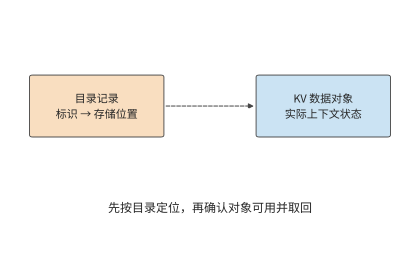

*图 9-25：虚线表示按标识查找对象位置。目录用于定位，实际 KV 对象用于恢复计算；路由前还需确认对象版本与可用性。*

### 9.5.2 多级存储

第 8.3.4 节比较了本地缓存保留、换出和重算的代价。现在把同一份状态放到远端：除了对象大小，还要考虑经过哪些链路，以及每次生成是否重复读取。共享 KV 的三种典型路径是本地重新 prefill、从远端取回一次并在本地驻留、每一步都从远端读取数据。它们可能使用同样的上下文内容，传输频率却完全不同。

沿用 1.125 GiB 前缀和 25 GB/s 链路，一次载荷取回约 48.3 ms。若 100 次 decode 调用都重新从远端读取这份不变的前缀，累计占用链路约 4.83 s。若这 100 次读取要在一秒内完成，仅这份上下文就要求约 121 GB/s，是给定链路能力的 4.8 倍。把读取与计算并行安排，也不能让 25 GB/s 的链路在一秒内送完这些字节。

取回一次并驻留把传输频次从“每步一次”降到“每次复用一次”，代价是占用本地 HBM。设一份状态占 $V$ bytes、保留 $\tau$ 秒，内存占用与保留时长的乘积为 $V\tau$，单位为字节·秒。保留时间相同时，大对象占用更多容量；大小相同时，保留越久，这一乘积越大。因此可以把不活跃的会话放到远端，会话恢复时取回，在连续 decode 期间留在本地。这样数据传输主要发生在会话恢复和暂停的时候。

假定状态将在未来复用 $k$ 次，暂不考虑排队时间，也不考虑它占用空间后挤掉其他缓存内容的影响。保存后再取回比重新计算更快的条件为

$$
T_{write}+kT_{read}<kT_{recompute}.
$$

例如，保存需要 50 ms，每次取回需要 60 ms，而重算需要 100 ms。复用一次时，保存加取回为 110 ms，比重算慢；复用两次时为 170 ms，比两次重算的 200 ms 少 30 ms。保存值不值得，取决于未来的复用次数。若链路变慢，每次取回要 120 ms，复用越多反而亏得越多；这时应该重算，或者设法把取回挪到关键路径之外提前做。

缓存容量还会影响一份状态能保留多久，以及后续请求能否复用它。在一组同卡双引擎实验中，12 次前缀复用机会里，4 GiB 共享 CPU 池完整命中 5 次，8 GiB 池完整命中 12 次。多出的 4 GiB 保住了七次本来会丢掉的完整前缀；再次请求所需的状态若已经在本地，就不必重复取回。所以共享容量的收益要按“保存多久、避免几次重算、增加几次搬运”来比较。[^shared]

### 9.5.3 持久化、检查点与部分重算

上一节假定保存下来的状态能完整取回。实例重启后，目录记录、磁盘数据和可连续复用的前缀可能并不一致，恢复过程需要重新确认哪些计算结果已经保存。持久化让状态在实例重启或任务暂停后仍然可用。完整保存减少恢复时的重算，周期性检查点减少写入但增加恢复工作，部分重算则用已保留的前缀补齐缺的部分。检查点要保存继续计算所需的全部状态：完整 GQA 保存上下文 K、V；DeepSeek V4 的状态还涉及压缩结果、窗口以及未完成的压缩块。恢复时从检查点所记录的最后一次完整更新继续计算。[^v4]

先考虑完整的 GQA 页。Qwen3-8B 每个含 16 个 token 的逻辑页为 2.25 MiB。若各层的 K、V 分片分别搬运，会形成许多小的连续段；若按页汇集，传输次数和所需的布局转换都不同。一个逻辑页按 36 层的 K、V 分开后有 72 个 32 KiB 的连续段；按页汇集后则是一个 2.25 MiB 的对象。前者更容易受每秒操作次数的限制，后者把更多时间花在连续载荷的传输上。

重启后的一个请求读取了 64 页，覆盖 1024 个 token，但可复用的连续前缀只有 1008 个 token，即 63 页。多读的那一页占 2.25 MiB，却没有省掉相应的重算。对这个请求，读取量为 144 MiB，有效复用量约为 142 MiB；更能说明问题的说法是“读入 64 页，用上 63 页”。这里的限制发生在读取之后：只有匹配成功、能连续接到已有上下文上的页，才能替代计算。把磁盘读得更快能缩短读取时间，却改变不了这个请求要处理的末页。[^restart]

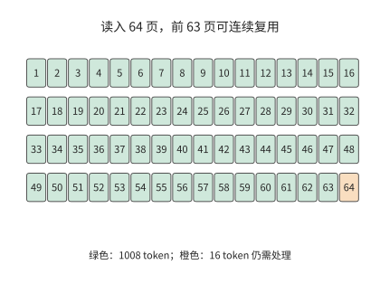

*图 9-26：读入的页不一定全部成为可复用前缀。正常重启后的这一请求读入 64 个各含 16 个 token 的页，只复用前 63 页；末页仍需处理。每页 2.25 MiB，该请求的匹配边界为 1008 个 token。*

页面缺失时，要比较继续等待和重新计算各需要多久。例 9.6 中本地重算只要 180 ms；若为取回一个不可用的对象已经等了 1 秒，光这一次等待就超过了五次重算的时间。实际的截断页实验里，无条件等待的请求在 60 秒观察窗口内一直没有完成，改为允许放弃等待后，请求靠重算得到了结果。完成当前请求之后，还要隔离或修复坏页，否则下一个请求还会遇到同样的等待。[^fault]

### 9.5.4 缓存亲和性与请求路由

确认缓存可以复用后，仍需决定把请求发给哪台机器。缓存所在的机器可能很忙，另一台机器虽然需要取回或重算，却可能先完成。因此路由时要比较的是请求的完成时间。设 GPU 最早可执行时刻为 $Q$，状态从请求到达起的就绪时刻为 $R$，状态可用后的剩余工作为 $C$。在整份状态到齐后才执行、取回可与 GPU 等待重叠的模型中，首 token 时间为

$$
T_{first}=\max(Q,R)+C.
$$

如果取回要等 GPU 排完队才能开始，排队时间与取回时间就要相加；如果逐层流水，就需要更细的执行图。例如 $Q=80$ ms、取回耗时 60 ms、剩余计算 10 ms，并行就绪时共需 90 ms；等 GPU 空闲后再启动取回则需 150 ms。计算量和传输字节数都相同，只是依赖关系不同，耗时就差了 60 ms。

**例 9.6　缓存命中与排队等待如何共同决定请求路由？** 对同一份 8192 个 token 的前缀，A 在 HBM 里有命中，但要等 250 ms；B 只等 20 ms，但完整重算要 180 ms；命中后的剩余工作为 10 ms。远端读取的固定开销为 10 ms，整份数据先到主机内存，再经 25 GB/s 搬到 GPU。

| 路径 | 首 token 时间，教学计算 |
| --- | ---: |
| A：本地命中 | $250+10=260$ ms |
| B：直接重算 | $20+180=200$ ms |
| B：远端 5 GB/s，经主机内存取回 | 约 310 ms |
| B：远端 20 GB/s，经主机内存取回 | 约 129 ms |

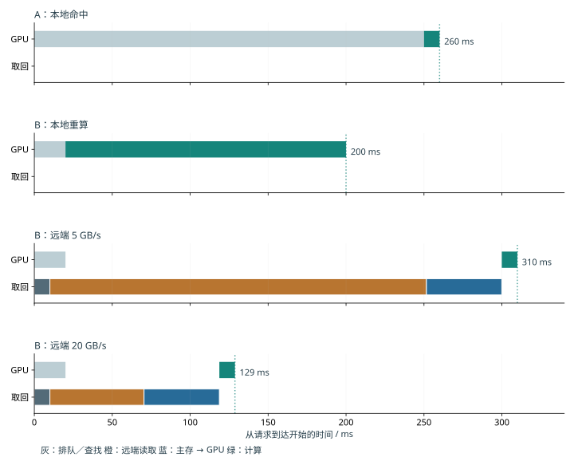

*图 9-27：A 本地缓存已命中，GPU 排队 250 ms 后再计算 10 ms，首 token 在 260 ms 返回。灰为排队，绿为计算。*

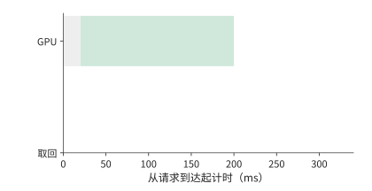

*图 9-28：B 在 20 ms 空闲，随后重算 180 ms，首 token 在 200 ms 返回。*

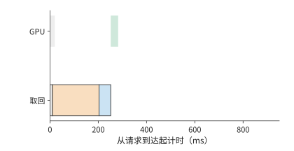

*图 9-29：取回先查找 10 ms，再按 5 GB/s 读取 1.125 GiB 至主存，最后按 25 GB/s 搬到 GPU。计算等待数据和 GPU 都就绪，首 token 约 310 ms 返回。*

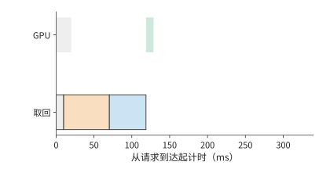

*图 9-30：远端带宽提高到 20 GB/s 后，首 token 约 129 ms 返回。橙为远端读取，蓝为主存到 GPU；四图均从请求到达起计时，横轴相同。*

第一张路由图中，A 的数据已经在 GPU 上，但计算要等到 250 ms 才能开始。B 在 20 ms 时空闲；直接重算会立即开始计算，远端取回则要继续等数据。提高远端带宽缩短的是橙色条，查找、主存到 GPU 的传输和最后的计算仍然存在。

B 要在 200 ms 内返回，扣除命中后 10 ms 计算，状态必须在 190 ms 内就绪。再扣除查找的 10 ms 与主机内存到 GPU 的约 48.3 ms，远端读取只剩约 131.7 ms。用 1.125 GiB 除以这个预算，得到取回与重算耗时相等时的带宽，约为 9.2 GB/s。

同一个会话由此可以按状态与资源所在的位置重新安排。应用保留连续的上下文，服务在继续使用本地状态、迁移状态和重新计算之间选择，依据是这三条路径各自何时能让后续的模型执行开始。第 8 章根据内容判断可复用的前缀，本节进一步把排队时间与链路带宽纳入路由决策。

把远端读取带宽提高到 20 GB/s 后，单请求取回明显占优；但每秒 16 次取回需要约 19.3 GB/s，已用去约 97% 的链路能力。突发请求会增加传输排队时间。因此，按单请求算出所需带宽后，还要计算持续到达时的总流量。[^route]

上面的比较假定缓存位置已知且数据可用。路由器通常根据缓存事件预测位置，事件延迟或对象被淘汰会让预测失准。为了看清这种误差怎样影响响应时间，把 A 的排队改为 80 ms，并设缓存只以概率 $p$ 真正可用。命中时为 90 ms，所有层次都失效时为 260 ms，期望为

$$
\mathbb{E}[T_A]=90p+260(1-p)=260-170p\ \mathrm{ms}.
$$

平均值要优于 B 的 200 ms，需要 $p>6/17$。取 $p=0.9$，平均只有 107 ms，但 10% 的请求仍是 260 ms，所以这个两点分布的 p99 为 260 ms，达不到 220 ms 的目标。要让 p99 达到 220 ms，这个两点时间模型要求命中概率至少 99%；90% 已经明显改善了均值，却仍让十分之一的请求走 260 ms 的慢路径。[^events]

同时运行两个任务的负载压力实验更直观地显示了这种取舍。缓存优先时，目标请求约 1.38 秒完成，两个任务也在这时全部结束；把目标请求移到空闲实例后，它的完成时间缩短到约 0.33 秒，两个任务却要到约 1.54 秒才全部完成。目标请求快了约 1.05 秒，全部任务的完成时刻却推迟了约 0.16 秒。做路由决策之前，必须先确定优化的是目标请求的响应时间，还是全部任务的完成时间。[^pressure]

## 9.6 服务启动、扩缩容与故障恢复

把第 8 章的状态恢复过程计入路由决策后，要同时比较实例何时空闲与状态何时准备好。设实例 A 保留了全局 KV 与编码器的滑动窗口注意力（sliding window attention，SWA）状态，但有排队；实例 B 可以立即执行，却要取回全局 KV 并恢复编码器 SWA 状态。A 的优势是能复用状态，B 的优势是计算资源可以马上开工；路由器要比较的是两者的预计完成时间，而不是只看一个缓存命中标志。

设两边后续的新增输入处理、解码器窗口重放与生成耗时相同，准备工作串行执行。B 的全局状态传输按第 7 章的算例为 4.666 ms，编码器 SWA 状态的恢复假设为 8 ms，共需 12.666 ms。A 保留了这两份状态，准备时间就是排队时间：排队 10 ms 时 A 更早开始处理新增输入；排队增到 20 ms 时 B 更早。12.666 ms 由此成为本例中路由选择翻转的排队阈值。

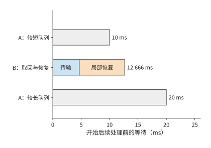

*图 9-31：缓存亲和性与空闲执行位置的比较。A 保留全局 KV 与编码器 SWA；B 需要 4.666 ms 全局传输和假设的 8 ms 编码器恢复。两端共同的解码器重放等后续工作略去，只比较不同的串行准备时间；A 的排队时间从 10 ms 增到 20 ms 时，更快的方案由 A 变为 B。灰色为等待队列，其他色块分别为全局状态传输与编码器局部状态恢复。*

### 9.6.1 启动与预热开销

前面的路由比较都从已经有可用实例开始。扩容或故障恢复时，新实例要先完成启动，而等待中的请求还在不断到达。因此，本节把启动和状态恢复纳入同一条服务时间线。一个新副本还要完成进程与分词器（tokenizer，将文本转换为 token 编号的组件）初始化、权重读取与分片、编译、KV 容量探测和图捕获。这些准备的总时间决定新副本何时开始分担请求。首次试运行触发编译时，编译时间已经包含在试运行里，应按先后依赖计算总时间。Breaking the Ice 对历史 vLLM 版本的分阶段分析说明了这个问题；把包含关系展开后，启动总时间由从进程创建到可以接收请求的最长依赖路径决定。[^startup]

假设准备执行图让启动多花 $T_s$，但此后每个执行步都能省 $\delta$，经过 $N$ 步后的净收益为 $N\delta-T_s$。多花 10 秒、每步省 0.2 ms，要 50000 步才持平，从第 50001 步起累计节省的时间才超过额外的启动时间。若每步为 32 个请求各生成一个 token，50000 步对应约 160 万个输出 token。每执行一个批次省一次时间，所以累计收益要按批执行的次数算。

启动期间新到达的请求还会积压。若原有服务完全不可用、到达率保持 $\lambda$、启动时间为 $T_s$，启动结束时积压约为 $\lambda T_s$。就绪后的服务能力为 $\mu>\lambda$，在理想的连续流量模型中，额外的排空时间为

$$
T_{drain}=\frac{\lambda T_s}{\mu-\lambda}.
$$

例如，启动需要 10 秒，期间每秒到达 4 个请求，就绪时已有 40 个请求积压。若就绪后每秒能服务 8 个，新请求仍占去 4 个，每秒实际只能消化 4 个积压请求，还要 10 秒才能排空；若服务能力只有 5 请求/s，每秒只能消化一个积压请求，要再等 40 秒。同样是 10 秒启动，从开始启动算起的排空时刻分别是第 20 秒和第 50 秒，如图 9-32 所示。

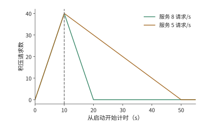

*图 9-32：服务余量决定启动积压的消退速度。连续流量模型，每秒到达四请求，启动 10 秒后积压 40 个。就绪后服务率为八或五请求/s，净排空率分别为四或一请求/s，从开始启动算起在第 20 或 50 秒排空。例 9.7 的排空期限为第 25 秒。*

并发预取还可能改变谁先开始执行。一个 1024 个 token 的请求单独运行时复用了 1008 个 token；八个请求同时到达时，前四个请求各登记了 1024 个 token 的预取，合计占用 4096 个 token，后面的请求因为超过容量限额而没有登记。最先完成的请求恰恰来自后者：它没有命中任何缓存，直接开始 prefill；正因为没有等缓存，它更早进入了执行队列。所以，即使缓存对象存在，请求也要先拿到预取所需的空间，才能用上这份缓存。预取空间用完后，后面的请求直接重算，而已经开始预取的请求还在等数据。[^branch]

权重固定在不可修改介质上时，增加同型号加速器可以扩展同版本服务；部署新权重则要配置支持新版本的加速器。路由器按模型版本分派请求，容量规划为新旧版本并存和加速器替换预留资源。固定版本服务持续得越久、需求越大，部署投入便能由更多请求分担。

### 9.6.2 运行中重配置与状态交接

启动解决的是新实例何时可用；运行中的迁移还要让目标实例接着源端的进度执行。改变张量并行度、专家并行度或服务池的规模，需要重新安排权重与请求状态。目标卡拿到参数只是第一步，还可能要建立通信组、准备新的执行图、转换布局并恢复接收请求。这些准备与数据搬运有先后依赖，共同决定何时能把新请求交给目标。

计划内的迁移可以利用源端仍在运行这个条件：先在后台复制不再改变的上下文，源端继续生成；最后短暂停下，复制完迁移期间新增的状态，再把执行权交给目标。设还有 1 GiB 待复制，复制速率为 2 GiB/s，源端每秒新增 0.5 GiB，则积压以 1.5 GiB/s 减少，约 0.67 秒后完成复制；若状态增长速率也达到 2 GiB/s，积压便保持不变。最后的交接点同时确定状态版本与执行权，防止目标漏掉源端最后的更新。

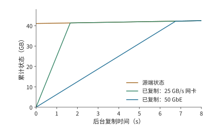

*图 9-33：后台复制需要赶上仍在增长的状态。开始时待复制状态为 1 GiB，源端以 0.5 GiB/s 生成新状态，目标以 2 GiB/s 复制；两条曲线相交前，垂直距离就是尚未复制的数据量。相交后，目标只需跟随源端的新增状态。*

图 9-33 中，源端曲线也在上升，所以追赶速度是两条曲线斜率之差。复制能力恰好等于状态增长率时，两条线平行，初始积压便不会缩小。最终交接必须安排在目标已追上源端、两端状态一致的时刻。

运行时切换并行方式，是把同一组卡重新组织成张量并行（TP）或序列并行与张量并行的组合（SP×TP）。这里 TP 切分层内矩阵，序列并行（SP）按 token 位置分配一部分计算与中间状态。ArcticInference 与 vLLM 的相关案例展示了这种做法：切换改变每一步参与计算的卡与 token 的分布，也改变所需的权重、KV 布局和执行图。预先保留两种模式的权重与执行图可以缩短切换的等待，但这些额外保存的权重与图会减少 KV 的可用空间。Elastic EP 扩大专家组时，新加入的卡要先拿到专家权重，随后才能承担派发来的任务；处理完整的请求还需要相应的注意力状态。[^switch]

目标追上源端的状态更新后，两边的数据才一致。此外，目标还要完成通信组和执行图的准备。下面保持数据量不变，看提高传输带宽究竟能缩短多少迁移时间。一个从四路张量并行（TP4）切换到八路张量并行（TP8）的迁移例子需要约 16.4 GB 的网络传输，在本地构建目标张量还要读写约 4.7 GB 数据。把同一份网络载荷放到有效带宽 5 GB/s 和 25 GB/s 的路径上，单看搬运约需 3.3 秒和 0.66 秒，相差五倍。

但若再假设建立通信组、准备执行图与恢复接收请求在传输之后串行占用 9 秒，总时间就约为 12.3 秒和 9.7 秒，只缩短约 21%。这 9 秒卡住了继续提高带宽的收益：即使网络传输趋近于零，总时间也只能趋近 9 秒。若能提前建立通信组并准备好执行图，就能进一步缩短迁移时的等待。[^migration]

### 9.6.3 部分故障与流式生成恢复

计划内迁移时源端还能提供最后一次更新；故障发生后，源端的数据可能已经读不到，只能依靠提前保存的状态和输出记录。恢复首先要确定用户已经收到哪一段输出。故障后有三种不同的目标：恢复足够的状态继续 decode；根据已经确定的 token 重做 prefill；重新采样一段输出。前两种沿用户已经收到的序列继续生成，第三种重新做随机选择，可能产生不同的后缀。对强化学习（RL）的采样轨迹生成（rollout）来说，这还改变了样本的生成过程。

假设原输入有 8192 个 token，已经向用户返回 129 个输出，但最近保存的 KV 仅覆盖原输入。恢复时，若这些输出已经可靠记录，只需把前 128 个输出补入模型，重建覆盖 8320 个 token 的 KV，再处理第 129 个输出继续生成。若已经有覆盖 8320 个 token 的兼容 KV，就可以省去这 128 个 token 的重放。

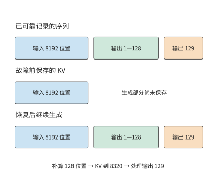

*图 9-34：输出记录决定继续哪条序列，KV 检查点决定从哪里补算。假定 129 个输出均已可靠记录，但 KV 只保存了原输入。下方按输入、前 128 个输出和第 129 个输出分段示意，宽度不按 token 数量比例绘制。*

图 9-34 把两种记录的末端分开画出。输出已经返回，不表示对应的 KV 已经保存；恢复时用已记录的 token 补算，就能重建相同的前缀，不必重新采样这些输出。

**预写日志**（write-ahead log，WAL）在对外确认之前可靠保存待恢复的操作或结果。这里的 token 级 WAL 保存已经确定的输出序列，KV 保存的是这段序列已经完成的计算。前者决定恢复后应继续哪条输出，后者决定还要重做多少工作。DeepSeek V4 的生成服务采用这类机制；恢复时还要保持权重版本、token 位置索引和解码状态一致。[^v4]

故障的影响范围由同步组决定。张量并行组或专家并行组丢失一张卡，可能让整个协作实例上的请求停住；其他完整副本则可以继续服务。故障恢复依次经过检测、实例重建与请求恢复；恢复后的处理能力决定积压的请求还要多久才能完成。第 10 章进一步分析这些选择对 RL 样本与训练进展的影响，第 11 章再处理工具和环境的任务恢复。

## 9.7 部署方案的综合比较

### 9.7.1 组合副本、PD、AF 与共享 KV

现在已经知道各阶段需要哪些计算资源、状态怎样取回，以及启动和故障期间会积压多少请求。下面把这些结果用于章首的八 worker 服务，先确定状态传输方式，再比较整个服务能否满足到达率和恢复期限。P 产生的 KV 可以直接交给 D，也可以先进入共享池再由 D 取回；D 新生成的状态若要用于下一轮 P，还需确认它们已经保存并发布。直接交接与经池中转读取的可能是相同的内容，占用的链路和缓冲却不同。

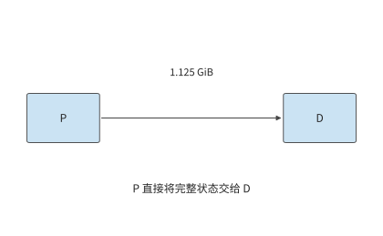

*图 9-35：P 直接向 D 交接 1.125 GiB 上下文 KV 缓存，只经过一次直接传输。P 为预填充，D 为后续逐 token 解码。*

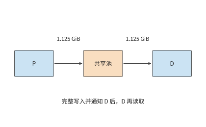

*图 9-36：P 先向池写入完整 1.125 GiB 并发布，D 再取回同一对象，共经过写入和取回两次传输。后续实例还可以复用池中对象。P 为预填充，D 为后续逐 token 解码。*

对本章的 1.125 GiB 上下文 KV 缓存，直接 P→D 交接搬一次；经池中转则在 P→池、池→D 两条边各搬一次，总载荷为 2.25 GiB。假设两条边都为 25 GB/s，且整份写入后才能读取，中转等待约 96.6 ms，比直接交接多约 48.3 ms。

若 D 只用一次这份状态，这次中转就没有复用收益。若后面还有另一个实例要继续处理同一个会话，它就有机会用约 48.3 ms 的读取替代一次 180 ms 的重算，省下约 132 ms，超过先前多花的约 48.3 ms。因此，后续请求复用这些 KV 省下的计算时间，可以抵消额外的搬运时间。共享池把一次会话留下的计算成果用于后续请求；AF 则改变当前请求每一层的执行位置，两者改变的是时间线上不同的部分。

同样的规则也适用于视觉输入。E 产生的 EC 与语言 KV 使用不同的缓存标识，占用的空间也不同；图像缓存命中可以减少 E 的工作，却不会自动省掉后续语言模型的 P 阶段。在 E→P→D 的执行图中，EC 命中使 E 的需求下降，语言前缀命中使 P 的工作减少，资源配比也随各阶段工作量的变化而调整。

### 9.7.2 同质量、同资源约束下的方案比较

**例 9.7　哪种推理部署能持续服务并按期清空启动积压？** 采用章首的资源与负载：四个 A 类 worker、四个 B 类 worker，每秒到达四个独立请求，每个请求输入 8192 个 token、输出 129 个 token。有效能力沿用例 9.2，两个阶段在同一个 worker 上执行时依次占用该资源，表中的有效能力对应下面的驻留限制。链路为共享的 25 GB/s 载荷通道，各次搬运占用同一份链路带宽。比较窗口内模型与生成设置相同，请求需要的前缀互不复用。服务从停止状态启动，三种部署方案都在 10 秒后就绪；就绪后的队列按连续流量模型处理。设计目标是持续处理新到达的请求，并在开始启动后的 25 秒内消除启动积压。

容量条件也一并给定：各 worker 将模型加载到内存后，留出 12 GiB 专用于本例的 KV 与交接缓冲，调度器最多允许八份活动请求状态同时驻留；使用共享池的方案另有 64 GiB 状态容量。每个请求经过 128 次 decode 后，其 KV 覆盖 8320 个 token，占约 1.14 GiB。八份活动状态共约 9.14 GiB，再预留一份 1.125 GiB 接收缓冲，共约 10.3 GiB，能放入每个 worker 的 12 GiB 可用空间。尚未执行的请求只保留输入，分配到缓存空间后再开始计算。

现在比较完整副本、直接交接的 PD、经共享池交接的 PD。共享池按整份写入后再读取，因此每个请求在公共通道上搬两次；池的读写两侧都能达到这条通道的带宽。

| 部署方案 | P、D 的组织 | 每请求通道载荷 | 计算能力，请求/s | 通道能力，请求/s | 启动后的总体吞吐率，请求/s |
| --- | --- | ---: | ---: | ---: | ---: |
| 八个完整副本 | 每个 worker 都执行 P、D | 0 | 3.2 | — | 3.2 |
| 直接 PD | 四个 A 做 P，四个 B 做 D | 1.125 GiB | 8 | 20.7 | 8 |
| PD 加共享池中转 | 相同的 P、D 实例配比，P→池→D | 2.25 GiB | 8 | 10.3 | 8 |

完整副本每秒只能完成 3.2 个请求，持续少于到达的四个，因此首先排除。两种 PD 方案的通道能力都高于八请求/s，均由计算池限制。在每秒四个请求的到达负载下，直传消耗约 4.8 GB/s，中转消耗约 9.7 GB/s；在八请求/s 的排空阶段，两者分别需要约 9.7 和 19.3 GB/s。

两种方案的稳态吞吐率相同，但直接 PD 更适合这组请求。后续请求不会复用这批请求的前缀，中转却让通道传输量翻倍，每个请求还多等约 48.3 ms。64 GiB 的共享池最多容纳 56 份完整的 1.125 GiB 前缀，在这个负载里，保留下来的每一份都不会再用到。直接交接完成同样的工作，留出更多链路余量，交接等待也更短。因此本例选择四 A 做 P、四 B 做 D、P→D 直传。

接着检查这一方案能否按期处理完启动期间积压的请求。10 秒后积压 40 个请求；直接 PD 就绪后每秒完成八个，同时每秒又来四个，净减少四个，10 秒后排空。从开始启动算起共 20 秒，满足 25 秒目标。完整副本在就绪后仍每秒增加 0.8 个请求，到第 25 秒时积压已从 40 增至 52 个。

上述方案能在 20 秒内排空，但执行单元的处理速度稍低时是否仍能满足 25 秒期限？把问题反过来，就能求出满足这个期限所需的最低服务率。启动占去 10 秒，剩余 15 秒要消除 40 个请求，同时继续处理每秒到达的四个新请求，因而要求

$$
\mu-4\geq\frac{40}{15},\qquad \mu\geq\frac{20}{3}\approx6.7\ \text{请求/s}.
$$

直接 PD 的八请求/s 高于这一最低要求。若有效服务能力降至五请求/s，稳态仍能处理持续到达的请求，但排空要到第 50 秒，错过目标。图 9-32 中两条下降线的斜率，正是八减四和五减四得到的净排空能力。

计算服务成本时，还要考虑资源的计费方式。设八个 worker 按小时预留，每小时总成本为八元，实际每秒完成四个请求，则每小时完成 14400 个请求，成本约为每千请求 0.56 元。若到达率仍是每秒四个，八请求/s 的能力不会凭空多出四个请求来处理；多出来的能力用于消化突发和启动积压。

比较满负载时的请求处理量，3.2 与八请求/s 对应每千请求约 0.69 元与 0.28 元。若业务另设完成时限，而后一方案只有四分之一的请求合格，每秒合格的请求数就降到两个，每千个合格请求的成本升到约 1.11 元。一般写成

$$
C_{effective}=\frac{\text{统计期间的总成本}}
{\text{满足质量与时限的请求或任务数}}.
$$

分子随计算资源、主存、网络和保持运行的备用实例变化，分母随实际到达与合格完成数变化。以一个提前退出的 Agent 为例，它可能少生成 token、少占用资源，但没有完成任务，这次退出不计入已完成的合格任务数。[^cost-model]

### 9.7.3 负载变化后的部署调整

现在改变例 9.7 中“前缀不再复用”这个条件。设另一个实例还会把每次留下的 1.125 GiB 上下文 KV 缓存复用一次，重算耗时为 180 ms，取回耗时为 48.3 ms。先前为中转多付的 48.3 ms 加上后续取回的 48.3 ms，共约 96.6 ms，低于重算的 180 ms，一次后续复用就净省约 83 ms。共享池由此获得了具体用途：用更短的读取代替重复计算。

这项收益同时增加了通道的需求。每次原始交接写一次、读一次，后续复用再读一次，共搬 3.375 GiB。每秒到达四组这样的请求对时，共需约 14.5 GB/s；通道最多支持约 6.9 组请求对/s。与只传一次相比，后续复用增加了读取量，用掉了原有的带宽余量。共享池省去重算的同时，也降低了通道能支持的请求对吞吐上限。

共享池改变的是传输次数。下面固定 D 没有缓存，只改变 P 要重新计算多少输入，看资源分配是否也要调整。假定 P 已在本地命中 6144 个 token，D 仍为空。沿第 9.2 节计算，完整副本合计约 5.88 请求/s，原来四 P、四 D 为八请求/s，改成两个 A 做 P、其余六个 worker 做 D 则为九请求/s。若仍采用相同的 10 秒启动与四请求/s 到达，三者从开始启动算起分别约在第 31.3、20 和 18 秒排空。前缀复用让完整副本也能处理持续到达的请求，但它仍达不到第 25 秒排空的目标；两 P、六 D 则进一步缩短了积压持续的时间。

再把输出改为 1025 个 token，并恢复无命中的输入，最佳的一 P、七 D 也只有约 1.19 请求/s。这时无论怎样改变 P、D 实例的数量比例，原来的八个 worker 都处理不了每秒四个请求。复制四组这样的八 worker 部署，合计能力约 4.75 请求/s；若还要求相同的启动与排空期限，所需能力仍至少为 $20/3$ 请求/s，五组只能提供约 5.94，六组约 7.13，因此要配置六组。按组扩展原有的计算资源组合时，持续处理到达的请求需要 32 个 worker，满足恢复期限需要 48 个。额外计算资源的用途是加快积压的消退。

这也给出了把本章的推导用于新系统的顺序。先把每个请求的工作量换算成各类资源需求；再按整数的资源分配找出最忙的资源池或执行单元；按执行顺序计入状态传输时间与内存占用；最后用服务率减去到达率得到的剩余处理能力，求出突发或启动积压持续的时间。若瓶颈是 D，增加 P 不会减少积压；若瓶颈是共享通道，增加计算副本只会让更多请求等着取回。

PD 的八 worker 案例和 MoE 的专家案例在这里相接。前者把不同阶段交给更擅长该阶段的计算资源，后者靠批内复用减少权重读取，再靠专家副本分散最忙执行单元上的工作。共享 KV 则保存已完成的计算结果供下一次请求复用；启动与恢复决定这些计算资源何时能提供服务。一次部署选择的依据，是这些部署方式一共改变了多少计算量和等待时间，以及消除积压需要多久。

单个阶段变快也会改变实例配比。设链路充足，每个 P 实例每秒处理 20 个请求，每个 D 实例每秒完成 5 个同样的请求，一个 P 配四个 D 时两池能力相等。若 D 阶段加速四倍，沿用原配比会让 D 池能力增到 80 请求/s，P 池仍是 20；改为一个 P 配一个 D，两池都提供 20 请求/s，并释放三个 D 实例。加速一个阶段的收益，由此体现为完成同样的工作所需的资源减少。

## 练习

练习按复算、改变条件和独立设计展开。前两题建立共同的请求单位，第三至九题分别改变计算、通信与状态条件，第十题完成新工作负载的设计。带“核心”的题目贯穿多个资源层次。

**9-1　三种推理部署的调用次数与状态交接。** 对输入 8192 个 token、输出 129 个 token 的请求，画出完整副本、PD 和共享 KV 三种部署方式，分别列出每请求调用数、KV 产生位置和跨实例交接。再将输出长度改为 1 个 token，指出哪些工作不再需要执行。最后考虑调用一次工具后继续生成的情况，标出最后一个已返回、但尚未生成对应 KV 的 token 位置。

**9-2　链路瓶颈与请求组成如何改变 PD 配比。** 复算例 9.2 的 25 种整数分配方案，并将链路的有效带宽设为每秒恰好传输一份 1.125 GiB 快照所需的带宽（约 1.21 GB/s）。求新的总体吞吐率上限；到达率恰等于该上界时，再一次性加入十个请求，求积压随时间的变化。随后复核高前缀命中与长输出两个情景。

**9-3　专家批量与权重位宽如何改变 CPU 执行瓶颈。** 用例 9.3 的同一专家形状，求 CPU 执行从读取受限转为计算受限时，每个专家接收的 token 数；再将 DRAM 带宽减半，重新计算这一临界值。分别比较每个专家接收 1 个和 128 个 token 时的执行时间；将权重改为每元素一字节、有效 CPU 算力保持不变，重新求解读取与计算的交点，并解释它的移动方向。

**9-4　PD 与 AF 的传输量、启动次数与通信重叠〔核心〕。** 采用 Qwen3-8B，设有效交接带宽为 25 GB/s，分别取 1、5、20 μs 的启动开销，比较一次 1.125 GiB 交接与总字节数相同的 72 次交接。再采用例 9.4 中 AF 的实际载荷大小，计算输入 8192 个 token、输出 129 个 token 的完整请求所需的累计交接时间。

另考虑四个独立微批次，每个微批次在注意力侧和前馈侧分别计算 2 ms 和 3 ms。比较全部串行执行与理想双阶段流水的总耗时，再求额外通信和计算效率下降合计最多能增加多少关键路径耗时，流水方案仍比串行方案快。

**9-5　异构推理的权重容量与 CPU 处理能力约束。** 从已保存的 DeepSeek V4-Flash 或 Kimi K2 配置还原权重存放、GPU 缓冲和主存需求。增加请求并发后，分别预测被访问的专家数量、各专家的任务数，以及负载最重的 NUMA 节点。再构造一组总权重可以容纳、但到达率超过 CPU 计算能力的请求条件，推导积压增长率。

**9-6　专家副本的容量约束与复制成本回收。** 设八个专家分别接收 $[32,16,8,4,2,1,1,0]$ 行输入，比较只计算有效行、将非空专家的输入补齐到 32 行，以及将所有专家的输入补齐到 32 行时的计算量。随后按例 9.5 的条件，求累计节省时间首次超过复制耗时所需的最少批次数，把每卡额外容量改为 32 MiB，解释为什么应先排除不可行的副本方案。如果热点随时间变化，说明如何根据观察窗口内的负载预测复制后的累计收益，并与迁移开销比较。

**9-7　KV 保存、取回与重算的收益条件〔核心〕。** 给定一份占 1.125 GiB 的前缀 KV，假设后续请求合计需要使用该前缀 100 次，比较重算一次后驻留、取回一次后驻留，以及每次使用时远程读取三种方式的总耗时。进一步计入写入耗时，以及两次请求之间保留缓存的时间，推导何时保存 KV 比重算更合算；设计一个改变 HBM 可用容量后需要将状态从 HBM 换出的例子。结合已有双引擎记录，解释共享 CPU 池从 4 GiB 增至 8 GiB 时保住了哪些复用机会。

**9-8　KV 缺页与版本不兼容时的恢复选择。** 解释读取了 1024 个 token 的 KV、却只复用其中 1008 个 token 时，两种计量方式的差异。对缺页、截断页、版本不兼容分别提出继续等待、部分重算与放弃缓存的判断条件。分别说明如何检查请求能否完成、缓存数据是否修复，以及输出是否与不使用缓存时一致。

**9-9　缓存路由的带宽交点与首 token 尾延迟。** 推导例 9.6 的远端取回与本地重算耗时相等时的带宽，并计算 $p=0.5,0.9,0.99$ 时，选择 A 路径的首 token 时间均值，以及按逆累积分布定义的 p99。再假设 HBM 副本不可用时，CPU 副本仍可用，且取回过程可以与 80 ms 的排队时间重叠。检查原来的两点分布模型是否仍然适用。

**9-10　长短输出混合负载下的 PD 扩容与排队〔核心〕。** 沿用例 9.7，每秒四个请求中一半输出 129 个 token，另一半输出 1025 个 token，均输入 8192 个 token，无前缀命中；池内按长期平均工作量分配能力。先求每请求平均 D 调用数，再枚举将八个 worker 分配给 P、D 两阶段的所有数量组合。允许复制同样的八 worker 组合，分别求两种目标下所需的最少组数：持续处理新到达的请求；启动耗时 10 秒，并在开始启动后的第 25 秒前清空积压。最后将长输出请求集中到每分钟的前十秒到达，画出队列变化，并说明平均需求不变时，哪一段时间决定容量选择。

**解题示范：CPU 专家执行在多大批量下由读取受限转为计算受限？** 单专家 CPU 路径的读取项与计算项相等时，

$$
\frac{2mP_e}{C_C}=\frac{2P_e}{B_D},
\qquad m=\frac{C_C}{B_D}=10.
$$

这里 BF16 每参数两字节，每行每参数两次浮点操作，两个系数恰好约去。在 2 TFLOP/s 与 200 GB/s 下，每个专家处理十个 token 时，计算时间与权重读取时间相等：少于十个 token 时主要等待权重，多于十个 token 时主要等待计算。主存带宽减至 100 GB/s，等时点移到每专家 20 个 token；单行执行的权重读取时间翻倍，128 行执行仍由计算项主导。

这个十行边界与图 9-14 的 78／79 行边界回答的是不同的问题。十行是 CPU 从带宽受限转为计算受限的分界；78／79 行比较的是包含权重搬运的完整 CPU、GPU 两条路径。CPU 过了十行已经计算受限，但仍能胜过要先搬权重的 GPU 路径，直到累计的计算代价超过这笔搬运成本。

[^ownership]: [同一 MoE 请求的权重、状态与通信归属](../research/2026-infra-survey/parallel-moe-ownership/NOTES.md)。其 TP2×EP4、处理同一批请求和 FP32 传输格式是明确教学条件，用于具体展示通信归属。

[^pd]: DistServe、Splitwise 与阶段放置的已归档材料见[本章扩写资料](../archive/outlines/extensions/09-分布式推理.md#detail-9.2)及[阶段分工与状态交接研究](../case-studies/chunking-and-state-transfer.md)。

[^handoff]: [Qwen3-8B 的 PD／AF 交接计算](../calculations/results/pd-af-handoff-qwen8.md)，固定官方模型形状、字节与启动假设。生成图读取同名 JSON。25 GB/s 使用十进制单位，1.125 GiB 使用二进制单位；精确载荷为 1207959552 bytes，纯传输耗时为 48.31838208 ms，加上 5 μs 后为 48.32338208 ms。

[^pool]: [P、D 实例数量的整数分配](../calculations/results/pd-pool-book.md)、[同构对照](../calculations/results/pd-pool-homogeneous.md)、[前缀命中](../calculations/results/pd-pool-prefix.md)、[长输出](../calculations/results/pd-pool-long-output.md)。

[^kt]: [权重卸载与执行位置](../case-studies/weight-offload-execution.md)及[实现版本说明](../references/framework-history/2026-09-08/offload-execution/README.md)。

[^locality]: [每专家 78 个 token](../calculations/results/expert-locality-boundary78.md)、[79 个 token](../calculations/results/expert-locality-boundary79.md)。本例采用 200 GB/s 的有效 DRAM 速率。

[^kt-audit]: [KTransformers 公开实验记录](../experiments/ch09/09-03/README.md)。教程平台为双 6454S＋4090，论文平台为双 8452Y；Expert Deferral 的公开结果包含质量提升与下降两种情况。

[^capacity]: [DeepSeek V4-Flash 与 Kimi K2 配置记录](../experiments/ch09/09-05/README.md)。表中并发上限取自部署配置。

[^af]: [跨机执行与框架演进](../case-studies/framework-evolution.md)及[AF 扩写依据](../archive/outlines/extensions/09-分布式推理.md#detail-9.3.4)。

[^moe]: [MoE Serving Tax、CRAFT 与启动研究笔记](../case-studies/moe-and-startup.md)。

[^replica]: [专家副本回本计算](../calculations/results/replica-payback-book.md)。算例固定路由、有效传输速率与逐卡额外可用空间，按串行复制计算准备时间。准备耗时为 10.60464608 ms，每批节省 0.402784256 ms；正文数值经过舍入，最少 27 批的结果使用未经四舍五入的数值计算。

[^expert-exp]: [专家执行与后端实验记录](../experiments/ch09/09-06/README.md)。

[^cache]: [缓存层次、路径与路由研究](../case-studies/cache-tiers-and-routing.md)。

[^shared]: [共享 CPU KV 池容量对照](../experiments/ch09/09-07/shared-kv/README.md)与[真实上下文保留后的 Agent 回放](../experiments/ch09/09-07/history-preserved/README.md)。容量对照采用受控查找任务；真实 Agent 回放中出现了提前结束及任务质量下降。

[^v4]: [DeepSeek V4 技术报告](../references/files/papers/deepseek-v4.pdf)的状态持久化与生成服务内容，以及[本章的阅读笔记](../archive/outlines/extensions/09-分布式推理.md#detail-9.6.3)。

[^restart]: [重启页读取与实际复用核算](../calculations/results/cache-restart-book.md)，读取量为 144 MiB，有效复用量为 141.75 MiB。读取 64 页、共 1024 个 token，其中 63 页、共 1008 个 token 得到复用。

[^fault]: [截断页的预取策略对照](../experiments/ch09/09-08/prefetch-policy/README.md)，实验观察窗口为 60 秒。

[^route]: [缓存路由计算](../calculations/results/cache-route-book.md)、[快速远端对照](../calculations/results/cache-route-fast-remote.md)。具体公式包含整份远端→主机内存→GPU 的串行路径。

[^events]: [缓存事件与路由判断](../case-studies/cache-events-and-routing.md)、[缓存失效两点分布](../calculations/results/cache-route-stale.md)。

[^pressure]: [真实路由压力的配对核算](../calculations/results/router-pressure-book.md)，区分目标请求和完整任务对的完成时间，原始条件随结果保存。

[^startup]: [Breaking the Ice 的研究整理](../case-studies/moe-and-startup.md)，研究使用 vLLM v0.10.1.1。

[^branch]: [HiCache 请求分支观测](../experiments/ch09/09-10/branch-observation/README.md)，使用同一请求 ID 的事件链解释限额和有效命中。原记录的预取限额为 3289 个 token，已登记占用 4096 个 token；八个请求由客户端同时发出，GPU 最多同时运行一个请求。

[^switch]: [动态并行与状态条件](../case-studies/parallel-switching-and-state.md)、[专家分派与扩缩容](../case-studies/expert-dispatch-and-resizing.md)。

[^migration]: [串行迁移的时间计算](../calculations/results/reconfiguration-declared-serial.md)，按载荷、设定带宽和串行准备时间计算迁移耗时。

[^cost-model]: 例 9.7 的容量、共享通道、启动时间、排空目标和成本，以及服务目标（SLO）的通过比例、第 9.4.3 节的重叠时间均为教材假设，用于推导条件变化。单位成本用完整小时成本除以（3600×有效请求率）。迁移算例分别采用 5／25 GB/s 带宽，串行准备时间设为 9 秒。

[^v41-case]: [DeepSeek V4.1 官方技术报告](../calculations/sources/deepseek-v4.1-flash/DeepSeek_V41_Tech_Report.pdf)，第 1、2、3 节与第 6 节；[跨章会话的固定条件与复算](../calculations/results/v41-throughline.json)。

[^ep-system]: [DeepSeek-V3/R1 推理系统工程报告](../references/files/documents/deepseek-serving-report.md)，大 EP、三类负载均衡及通信精度；[DeepEP V2 阅读快照](../research/ub-ep-integration-2026-09-10/sources/deepep.md)。[来源与版本边界](../research/ub-ep-integration-2026-09-10/README.md)。

[^ep-calc]: [大 EP 与专家分离偏斜的固定输入](../calculations/scenarios/ep-skew-example.json)、[计算脚本](../calculations/ep_skew.py)、[复算结果](../calculations/results/ep-skew-book.md)。所有带宽和算力均为教学假设，计算输出为所列执行模型的下界。

[^ep-papers]: Zhu 等，[MegaScale-Infer](../references/outline-checks/2026-09-07/execution-feedback/megascale-infer.pdf)，arXiv:2504.02263v1，§6 的 Load balance、§7.1–7.2 的实验条件与吞吐；[CRAFT](../references/proceedings/MLSys/2026/papers/mlsys2026-3a7f9e485845dac27423375c934cb4db.pdf)，MLSys 2026，摘要、§3–5；[Demystifying the Mixture of Experts Serving Tax](../references/proceedings/MLSys/2026/papers/mlsys2026-42a452cbafa9dd64e9ba4aa95cc1ef21.pdf)，MLSys 2026，§3–5。原文摘取、阅读范围与数字适用条件见[本次研究记录](../research/ub-ep-integration-2026-09-10/README.md)。

## 本章小结

分布式推理把一条请求的计算与状态分配到多个位置。PD、AF、专家放置和共享 KV 都要比较局部执行的收益与新增的交接，容量、服务率、启动和恢复共同决定部署是否合适。路由不仅选择空闲计算资源，也决定能够复用哪些状态。

硬件变化后，先固定请求与部署，找出新的瓶颈，再重新分配各阶段资源。下一章将转向训练，讨论参数与训练状态的持续更新，以及训练进度如何推进。
